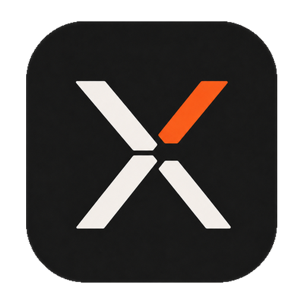
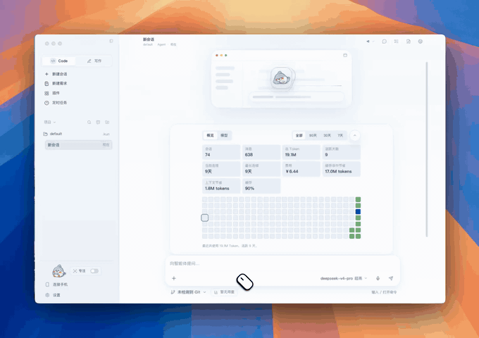
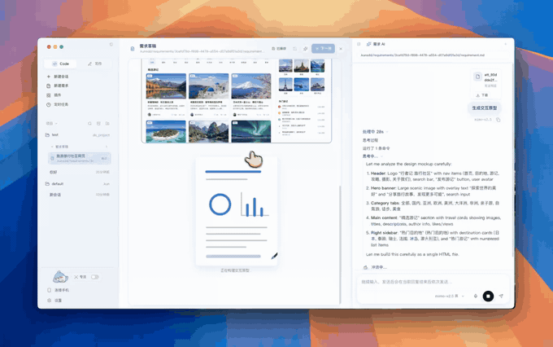
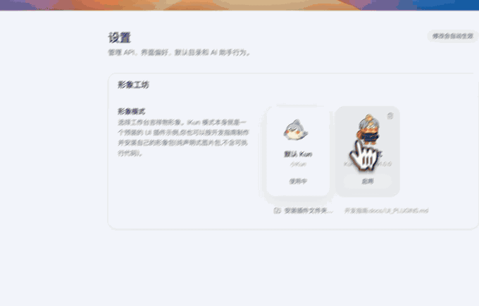

<p align="center">
  
</p>

<h1 align="center">Analytix</h1>

<p align="center">
  <strong>Analytix — Agents for sensitive work.</strong><br>
  <em>Built for any work. Ready for sensitive work.</em>
</p>

<p align="center">
  <a href="./README.md">简体中文</a>
  &nbsp;·&nbsp;
  <strong>English</strong>
  &nbsp;·&nbsp;
  <a href="#documentation-map">Docs</a>
  &nbsp;·&nbsp;
  <a href="#run-from-source">Run from source</a>
</p>

<p align="center">
  <a href="./LICENSE"></a>
  
  
  
</p>

Analytix is an **Agent Platform** for everyday and sensitive work. It handles code, requirements, plans, research, writing, and automation while providing built-in boundaries for sensitive data and professional workflows. It is not just a chat client or a CLI shell for programmers.

The core workflow starts from the requirement, then moves through design, plans, todos, agent coding, file changes, and acceptance. The normal desktop flow uses local Provider onboarding, with one Registry and protected Secret Store managing credentials. Sessions, logs, preferences, and runtime data stay local by default. Settings manages Providers, models, and connection recovery; ordinary startup does not require Hub sign-in.

The only production agent core is the Go runtime in `packages/runtime-go`. `packages/runtime` provides the public TypeScript contracts, config, telemetry, and `analytix serve` launcher; that launcher starts the Go `runtime-server` and is not a second TypeScript agent runtime. Code, Write, SDD, Connect Phone, and scheduled tasks share one local HTTP/SSE runtime boundary.

## Go Agent Harness + Plugins + Privacy Layer

- **Go Agent Harness** is the one stable execution core for the agent loop, sessions, tools, jobs, subagents, providers, permissions, recovery, and public protocol.
- **Plugins** add professional tools, workflows, skills, and provider/public-safe UI extensions through one capability and lifecycle contract. Funds is Analytix's **first flagship professional plugin**. Knowledge, Legal, Research, Writing, Coding, and later capabilities follow the same path instead of entering Core.
- **Privacy Layer** is built into that same Go Harness. It applies unbypassable projections across models, subagents, compaction, memory, persistence, logs, telemetry, and protected local display. It is neither a second runtime nor an optional plugin.

**Any capability. Any model. Private by design.** From everyday workflows to sensitive data, Analytix uses one general Agent rather than a separate branch for sensitive work.

This is the accepted product and architecture target, not a claim that every privacy, plugin-isolation, or formal release gate is already complete. See the [Analytix Agent Platform brand and architecture spec](docs/analytix/specs/11-agent-platform-brand-and-architecture.md) for the Core/Plugin boundary, data flows, current implementation, and gaps.

---

<p align="center">
  <a href="src/asset/img/code.mp4">
    
  </a>
  <a href="src/asset/img/write.mp4">
    
  </a>
</p>

## Requirement-First Coding

Analytix explores a next-generation programming workflow: **requirement -> design -> plan -> code -> verify**. It is not just a chat box attached to an IDE.

| Stage | Analytix approach |
| --- | --- |
| **Clarify** | Create requirement drafts in the GUI and ask AI to find missing questions, research options, and shape boundaries |
| **Document** | Save drafts as `.analytixsdd/requirements/<uuid>/requirement.md`, with structured requirement blocks, acceptance criteria, and history |
| **Design** | Generate UI design drafts, infographics, or interactive HTML prototypes from selected requirement content |
| **Plan** | Use `/plan` and `create_plan` to produce GUI-owned `.analytixsdd/plan/...` implementation plans linked back to requirements |
| **Code** | Move from plan into todos, file edits, command execution, and change review |
| **Verify** | Bring requirement blocks, acceptance criteria, plan state, and `/review` together to answer whether the original requirement is done |

## Core Features

- **Code workbench**: bind a real codebase, chat around project context, run shell commands, edit files, and review changes before committing.
- **Requirements, plans, and review**: create requirement drafts, plan work, manage todos, run `/goal`, review changes, compact threads, fork, and archive.
- **Write mode**: dedicated Markdown workspaces with a file tree, Live / Source / Split / Preview modes, completion, selection-based inline agent actions, image attachments, and `HTML / PDF / DOC / DOCX` export.
- **Connect Phone**: Feishu / Lark / WeChat entry points, local webhook / relay support, and one-time or recurring scheduled tasks.
- **Model providers**: the local Provider Registry configures DeepSeek, Xiaomi MiMo, MiniMax, OpenAI-compatible, self-hosted, and other custom services.
- **Multimodal and media capabilities**: image attachments, vision input, speech transcription, image generation, speech generation, music generation, and video generation when enabled by provider config.
- **MCP and Skills**: Model Context Protocol servers and project/global Skills give Analytix specialized tools and workflows for different tasks.
- **Local runtime**: the TypeScript `analytix serve` launcher starts the Go `runtime-server`, which provides the unified HTTP/SSE boundary, append-only event logs, usage tracking, and context management.

## More Demos

<p align="center">
  <a href="src/asset/img/pdf-research.mp4">
    
  </a>
</p>
<p align="center"><em>PDF research and source organization demo</em></p>

<p align="center">
  <a href="src/asset/img/sdd.mp4">
    
  </a>
</p>
<p align="center"><em>Requirement clarification, requirement documents, and planning demo</em></p>

<p align="center">
  <a href="src/asset/img/mascot-ui-plugin.mp4">
    
  </a>
</p>
<p align="center"><em>mascot / cameo UI plugin demo</em></p>

## Quick Start

### Download a Release

General release packages use `analytix-${version}-${os}-${arch}.${ext}`. The supported release channels are `stable` and `beta`. Official Standard Windows is an explicit localized exception: its installed display name is `Analytix灵鉴` and the current x64 artifact is `analytix-standard-${version}-x64.exe`; the executable `analytix`, app id `com.analytix.desktop`, CLI `analytix serve`, and `ANALYTIX_*` environment variables keep the canonical analytix identity.

| Platform | Package | Architecture |
| --- | --- | --- |
| macOS | `.dmg` or `.zip` | Intel / Apple Silicon |
| Windows | `.exe`, NSIS installer | x64 |
| Linux | `.AppImage` | x64 |

On first launch:

1. Choose a UI language.
2. Choose a service in local Provider onboarding and configure its Base URL, endpoint format, and model.
3. Complete the normal credential-entry flow; the protected Secret Store holds credentials while settings retain key-free metadata.
4. Open Code and bind a local project, or open Write and create a writing workspace. Manage later Provider changes in Settings.

### Run From Source

Requirements:

| Dependency | Version |
| --- | --- |
| Node.js | 22.12+ |
| npm | Ships with Node.js |
| Go | A Go 1.22+ compatible toolchain (source development only; release packages ship a native runtime-server) |
| Model service | A usable local Provider connection for model tasks; ordinary startup does not require a Hub account |

```bash
cd /path/to/analytix
npm ci
npm run dev
```

For slower network access in mainland China, use an npm mirror:

```bash
npm ci --registry=https://registry.npmmirror.com
```

## Common Commands

| Command | Description |
| --- | --- |
| `npm run dev` | Build the TypeScript runtime launcher/contracts and start the Electron dev app |
| `npm run build:runtime` | Build the `packages/runtime` launcher/contracts; this does not validate the Go core |
| `(cd packages/runtime-go && go test ./...)` | Run the Go runtime tests |
| `npm run build` | Production build |
| `npm run typecheck` | TypeScript type checking |
| `npm run lint` | ESLint checks |
| `npm run test` | Vitest tests |
| `npm run dist:mac` | Build macOS `.dmg` and `.zip` |
| `npm run dist:win` | Build the Windows NSIS installer |
| `npm run dist:linux` | Build the Linux AppImage |

## Configuration and Data

- Default runtime dataDir: `~/.analytix/data`.
- Default Write workspace: `~/.analytix/write_workspace`.
- Runtime-owned desktop settings use top-level `runtime`, while model provider profiles use top-level `provider`; old data is read only through explicit legacy import / migration boundaries.
- The one Registry / Secret Store authority manages Provider credentials for authorized runtime consumers. Ordinary settings, exports, and logs do not carry credentials. Hub remains an explicit, lazy compatibility surface.
- Fresh interactive sessions use execution-policy version 2 with
  `approvalPolicy: on-request` and `sandboxMode: workspace-write`. The latter
  is an Analytix application-level tool/path policy, not an operating-system
  sandbox; it limits file tools and blocks host shell execution.
  `danger-full-access` remains an explicit opt-in.
- The exact unversioned legacy `auto` plus `danger-full-access` pair migrates
  once; other valid explicit combinations and a version-2 full-access opt-in
  are preserved.
- Unattended Connect Phone and scheduled-task turns default to `never` plus
  `workspace-write`, so they do not wait for an absent operator approval.

## Documentation Map

| Doc | Contents |
| --- | --- |
| [docs/analytix/README.md](docs/analytix/README.md) | documentation classes, sources of truth, and evidence freshness rules |
| [packages/runtime-go/README.md](packages/runtime-go/README.md) | production Go runtime architecture, capabilities, and validation |
| [packages/runtime/README.md](packages/runtime/README.md) | TypeScript launcher/contracts, CLI, and config boundary |
| [docs/ANALYTIX_CONFIG.md](docs/ANALYTIX_CONFIG.md) | Local Provider credentials, desktop settings, and runtime config layers |
| [docs/analytix/qa/windows-qa-operator-runbook.md](docs/analytix/qa/windows-qa-operator-runbook.md) | secret-free Windows QA SSH/RDP/RustDesk operator entry |
| [docs/analytix/specs/01-identity-runtime-schema-reset.md](docs/analytix/specs/01-identity-runtime-schema-reset.md) | identity, runtime schema, and data directories |
| [docs/analytix/specs/02-release-packaging-channels.md](docs/analytix/specs/02-release-packaging-channels.md) | release, packaging, and channels |
| [docs/analytix/specs/03-brand-assets-visual-system.md](docs/analytix/specs/03-brand-assets-visual-system.md) | brand assets and visual system |
| [docs/analytix/specs/04-analytix-derived-thread-virtualizer.md](docs/analytix/specs/04-analytix-derived-thread-virtualizer.md) | ThreadVirtualizer and chat feel |
| [docs/analytix/specs/05-architecture-code-upgrade-inventory.md](docs/analytix/specs/05-architecture-code-upgrade-inventory.md) | code upgrade inventory |
| [docs/analytix/specs/06-implementation-closure-and-acceptance.md](docs/analytix/specs/06-implementation-closure-and-acceptance.md) | closure and acceptance |
| [docs/analytix/specs/07-desktop-qa-release-readiness.md](docs/analytix/specs/07-desktop-qa-release-readiness.md) | desktop QA and release readiness |
| [docs/analytix/specs/08-upstream-absorption-and-go-runtime.md](docs/analytix/specs/08-upstream-absorption-and-go-runtime.md) | long-term Kun / Reasonix absorption and Go runtime evolution |
| [docs/analytix/specs/09-agent-quality-product-benchmark.md](docs/analytix/specs/09-agent-quality-product-benchmark.md) | agent quality, product strength, and upstream comparison benchmarks |
| [docs/analytix/specs/10-subagent-todo-goal-control-plane.md](docs/analytix/specs/10-subagent-todo-goal-control-plane.md) | subagent, todo, goal, and control-plane safety boundaries |
| [docs/analytix/specs/11-agent-platform-brand-and-architecture.md](docs/analytix/specs/11-agent-platform-brand-and-architecture.md) | Agent Platform brand, Go Agent Harness, plugins, and Privacy Layer architecture |
| [docs/analytix/upstreams/README.md](docs/analytix/upstreams/README.md) | upstream sync ledgers, conflict decisions, and conformance records |
| [docs/analytix/upstreams/agent-platform-architecture-recheck-2026-08-25.md](docs/analytix/upstreams/agent-platform-architecture-recheck-2026-08-25.md) | architecture recheck evidence for Codex, Claude Code, DeepSeek Harness, and OpenCode |
| [docs/analytix/upstreams/absorption-targets.md](docs/analytix/upstreams/absorption-targets.md) | what to absorb from Kun / Reasonix and how to prove it is better |
| [docs/analytix/upstreams/code-level-absorption-blueprint.md](docs/analytix/upstreams/code-level-absorption-blueprint.md) | code-level reuse boundaries, landing areas, and proof requirements for Kun / Reasonix |
| [docs/analytix/upstreams/code-level-implementation-plan.md](docs/analytix/upstreams/code-level-implementation-plan.md) | follow-up implementation stages, validation gates, and `/goal` usage guidance |
| [docs/analytix/benchmarks/README.md](docs/analytix/benchmarks/README.md) | benchmark scenarios, quality gates, and upstream scorecards |
| [docs/UI_PLUGINS.md](docs/UI_PLUGINS.md) | mascot / cameo UI plugins |
| [docs/legacy/kun/README.md](docs/legacy/kun/README.md) | historical legacy notes for migration background only |
| [docs/CONTRIBUTING.md](docs/CONTRIBUTING.md) | local maintenance guide |
| [SECURITY.md](SECURITY.md) | security disclosure policy |

## Local Maintenance

Bug fixes, UI/UX improvements, documentation, localization, build/release work, and runtime integration changes are maintained locally.

Before committing local changes, run `npm run typecheck`, `npm run build`, and `npm run test` when possible.

## License

Analytix-owned first-party code is licensed under the [Apache License 2.0](./LICENSE). Existing third-party material remains subject to its own terms. Public availability and Git synchronization do not mean that all code is Apache-2.0 or grant additional third-party commercial-use or redistribution rights.

Analytix's first-party copyright owner and Project Owner is Guoqin He,
publicly operating under the GitHub account [Eysn0130](https://github.com/Eysn0130).

License and attribution obligations for bundled third-party material are recorded separately in [THIRD_PARTY_NOTICES.md](./THIRD_PARTY_NOTICES.md); that file does not change Analytix's Apache-2.0 license.

## Source synchronization

This project and [GitHub main](https://github.com/Eysn0130/analytix) share the
public mainline. Run `git pull` in the project directory to get updates; record
local changes with `git commit`, then upload them with `git push`. Run
`npm run git:setup` once in a new clone. See the [Git workflow](docs/analytix/git-workflow.md)
for safe synchronization, private-history protection and resources not included
in the public source tree.
