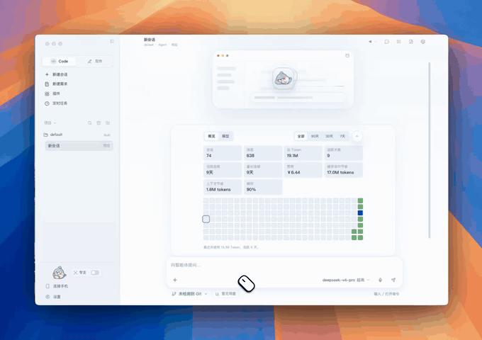
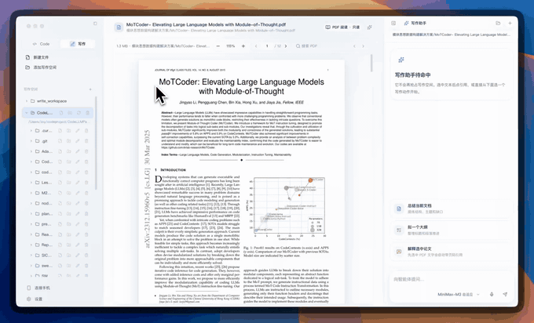
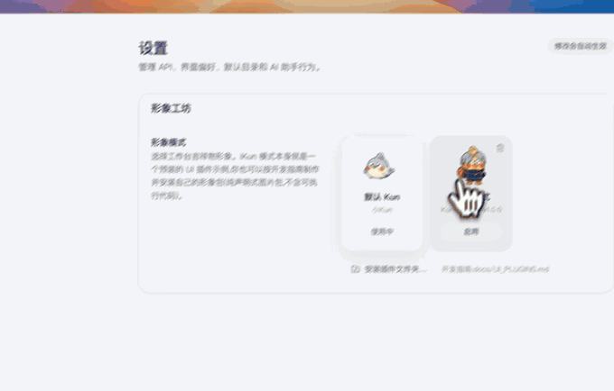

<p align="center">
  
</p>

<h1 align="center">Analytix</h1>

<p align="center">
  <strong>Analytix — Agents for sensitive work.</strong><br>
  Analytix —— 面向敏感业务而生的通用 Agent 平台。<br>
  <em>胜任日常，更胜任敏感业务。</em>
</p>

<p align="center">
  <strong>简体中文</strong>
  &nbsp;·&nbsp;
  <a href="./README.en.md">English</a>
  &nbsp;·&nbsp;
  <a href="#文档地图">文档</a>
  &nbsp;·&nbsp;
  <a href="#从源码运行">源码运行</a>
</p>

<p align="center">
  <a href="./LICENSE"></a>
  
  
  
</p>

Analytix 是一个 **Agent Platform**：既处理代码、需求、计划、研究、写作和自动化等日常工作，也为敏感数据与专业业务提供内置保护边界。它不是只聊天的客户端，也不是只给程序员的 CLI 外壳。**Built for any work. Ready for sensitive work.**

Analytix 的核心工作流从“需求是什么”开始，再推进到设计、计划、Todo、Agent 执行、文件变更和验收。常规桌面流程通过本地 Provider 引导完成连接配置，由统一 Registry 与受保护 Secret Store 管理凭据；会话、日志、偏好设置和 runtime 数据默认保存在本机。后续在 Settings 中管理 Provider、模型与连接恢复，普通启动不依赖 Hub 登录。

唯一生产 Agent core 是 `packages/runtime-go` 中的 Go runtime。`packages/runtime` 提供 TypeScript 公开 contracts、config、telemetry 与 `analytix serve` launcher；该 launcher 启动 Go `runtime-server`，不是另一套 TypeScript Agent runtime。Code、Write、SDD、Connect Phone 和定时任务共享同一个本地 HTTP/SSE runtime 边界。

## Go Agent Harness + Plugins + Privacy Layer

- **Go Agent Harness**：唯一稳定执行核心，统一拥有 Agent loop、会话、工具、任务、子代理、Provider、权限、恢复和公共协议。
- **Plugins**：通过同一能力与生命周期契约扩展专业工具、工作流、Skills 和安全 UI 扩展。Funds 是 Analytix 的**首个旗舰专业插件**；未来 Knowledge、Legal、Research、Writing、Coding 等能力沿同一路径扩展，不进入 Core。
- **Privacy Layer**：内置在同一个 Go Harness 中，对模型、子代理、压缩、记忆、持久化、日志、遥测和本机显示执行不可绕过的敏感数据投影；它不是第二 runtime，也不是可选插件。

**Any capability. Any model. Private by design.** 从日常工作流到敏感数据（**From everyday workflows to sensitive data.**），Analytix 使用同一个通用 Agent，而不是为敏感任务再建一套分叉系统。

这是已接受的产品与架构目标，不代表当前发布包已经完成所有 Privacy Layer、插件隔离或正式保密验收。Core/Plugin 边界、数据流、当前实现和缺口见[《Analytix Agent Platform 品牌与架构规范》](docs/analytix/specs/11-agent-platform-brand-and-architecture.md)。

---

<p align="center">
  <a href="src/asset/img/code.mp4">
    
  </a>
  <a href="src/asset/img/write.mp4">
    
  </a>
</p>

## 需求先行的 coding 范式

Analytix 探索的是“需求 -> 设计 -> 计划 -> 编码 -> 验证”的下一代编程工作流，而不是把聊天框简单贴到 IDE 上。

| 阶段 | Analytix 的尝试 |
| --- | --- |
| **澄清需求** | 在 GUI 中新建需求草稿，让 AI 帮你补问题、做实现前调研、整理边界 |
| **沉淀文档** | 把草稿保存为 `.analytixsdd/requirements/<uuid>/requirement.md`，支持结构化需求块、验收标准和需求历史 |
| **生成设计** | 从需求片段生成 UI 设计稿、信息图或交互式 HTML 原型，让需求不只停留在文字里 |
| **形成计划** | 通过 `/plan` 和 `create_plan` 生成 GUI 管理的 `.analytixsdd/plan/...` 实施计划，并把计划步骤和需求关联 |
| **Agent 编码** | 计划进入 Todo、文件编辑、命令执行和变更审查；需求变更后可以提示重规划，避免计划和需求脱节 |
| **回到验收** | 结合需求块、验收标准、计划状态和 `/review`，把“做完了吗”落回最初的需求 |

## 核心能力

- **Code 工作台**：围绕真实代码库对话，读取项目上下文，执行 shell 命令，修改文件，并在提交前审查变更。
- **需求、计划与审查**：从需求草稿进入计划，再到 Todo、执行、复盘和代码审查；长会话可以压缩、恢复、分叉或归档。
- **Write 写作模式**：独立 Markdown 工作区，支持文件树、预览模式切换、补全、选区改写、图片附件，以及 `HTML / PDF / DOC / DOCX` 导出。
- **Connect Phone**：连接飞书 / Lark / 微信等 IM 入口，支持本地 webhook、relay、一次性任务和周期性任务。
- **模型 Provider**：通过本地 Provider Registry 配置 DeepSeek、Xiaomi MiMo、MiniMax、OpenAI 兼容、自托管或其他自定义服务。
- **多模态与媒体能力**：支持图片附件、视觉输入、语音转写、图片生成、语音生成、音乐生成和视频生成；相关能力随 Provider 配置启用。
- **MCP 与 Skills**：接入 Model Context Protocol 服务器，加载项目或全局 Skills，让不同任务获得更专门的工具和工作方式。
- **本地运行时**：`analytix serve` 通过 TypeScript launcher 启动 Go `runtime-server`，提供统一 HTTP/SSE 边界、追加式事件日志、用量统计和上下文管理。

## 更多演示

<p align="center">
  <a href="src/asset/img/pdf-research.mp4">
    
  </a>
</p>
<p align="center"><em>PDF 研究与资料整理演示</em></p>

<p align="center">
  <a href="src/asset/img/sdd.mp4">
    
  </a>
</p>
<p align="center"><em>需求澄清、需求文档与计划演示</em></p>

<p align="center">
  <a href="src/asset/img/mascot-ui-plugin.mp4">
    
  </a>
</p>
<p align="center"><em>mascot / cameo UI 插件演示</em></p>

## 快速开始

### 下载发布版

通用发布包命名为 `analytix-${version}-${os}-${arch}.${ext}`，发布通道为 `stable` 与 `beta`。Official Standard Windows 是明确的地区化例外：安装后显示名为 `Analytix灵鉴`，当前 x64 产物为 `analytix-standard-${version}-x64.exe`；其可执行文件 `analytix`、app id `com.analytix.desktop`、CLI `analytix serve` 与 `ANALYTIX_*` 环境变量仍使用 canonical analytix 身份。

| 平台 | 安装包 | 架构 |
| --- | --- | --- |
| macOS | `.dmg` 或 `.zip` | Intel / Apple Silicon |
| Windows | `.exe`，NSIS 安装器 | x64 |
| Linux | `.AppImage` | x64 |

首次启动时：

1. 选择界面语言。
2. 在本地 Provider 引导中选择服务，配置 Base URL、Endpoint format 与模型。
3. 通过正常凭据输入流程完成连接；凭据由受保护 Secret Store 保管，设置只保留无密钥元数据。
4. 进入 Code 绑定本地项目，或进入 Write 创建写作工作区；在 Settings 中管理后续 Provider 变更。

### 从源码运行

环境要求：

| 依赖 | 版本 |
| --- | --- |
| Node.js | 已验证基线 22.22.1，见 `.node-version` |
| npm | 10.9.4，按 lockfile 安装 |
| Go | CI / 当前原生基线 1.26.4；`go.mod` 的 1.22 是语言最低版本 |
| 原生开发 | Rust 1.94.1、匹配的 SDK / 主机构建 authority 与 runtime 资源，见下方开发基线 |
| 模型服务 | 运行模型任务时需要可用的本地 Provider 连接；普通启动不要求 Hub 账号 |

```bash
cd /path/to/analytix
# 配置的 Owner macOS 主机须先在同一 zsh source 缓存脚本
npm run bootstrap
npm run verify:baseline
```

以上验证源码开发基线，不等于完整安装包就绪。原生资源和主机条件满足后，使用
`npm run doctor -- --native`、`npm run dev` 启动完整开发链路。公开 clone 的
资源准备、平台限制、CI 和封包状态见
[开发基线](docs/analytix/development-baseline.md)；不把 `dev:fast` 当作完整初始化。
`dev` / `dev:fast` 保留既有行为，不承诺自动隔离真实资料。新的显式
`dev:isolated` 入口还要求已配置的专属 Keychain；目录准备不等于启动就绪。

### macOS 本机开发缓存

在配置了外接 Analytix 缓存卷的 macOS zsh 开发终端中，先执行以下命令，再运行
`npm ci`、`npm run dev`、测试、Go 或 Rust 构建：

```bash
source ./scripts/use-analytix-cache.sh
```

该脚本要求 `/Volumes/AnalytixCache` 已挂载且可写，并将 npm、Go、Python/uv、
Cargo target、Electron、electron-builder、Playwright、Node 编译缓存和临时构建
目录放入该卷；挂载不可用时会失败，不会悄悄回退到系统盘。

它不会迁移工作树、`node_modules`、`dist/`、应用 runtime 数据或密钥。若这些
内容也不能占用系统盘，应将整个工作树放到外接盘，而不是修改应用数据目录。

中国大陆访问较慢时，可以使用 npm 镜像：

```bash
npm ci --registry=https://registry.npmmirror.com
```

## 常用命令

| 命令 | 说明 |
| --- | --- |
| `npm run bootstrap` | 安装 Git 同步保护、刷新 root/runtime 锁定依赖、检查开发输入 |
| `npm run verify:baseline` | 开发输入、同步回归、类型检查、源码构建及输出 smoke |
| `npm run dev` | 先构建原生数据工具和 TypeScript launcher/contracts，再启动 Electron 开发环境 |
| `npm run build:runtime` | 构建 `packages/runtime` launcher/contracts，不验证 Go core |
| `(cd packages/runtime-go && go test ./...)` | 运行 Go runtime 测试 |
| `npm run build` | Electron / TypeScript 源码构建；不等于完整原生包验收 |
| `npm run typecheck` | TypeScript 类型检查 |
| `npm run lint` | ESLint 检查 |
| `npm run test` | 运行 Vitest 测试 |
| `npm run dist:mac` | 构建 macOS `.dmg` 和 `.zip` |
| `npm run dist:win` | 在 Windows 构建机上构建 official Standard Windows 安装器 |
| `npm run dist:linux` | 构建 Linux AppImage |

## 配置与数据

- 默认 runtime dataDir：`~/.analytix/data`。
- 默认 Write workspace：`~/.analytix/write_workspace`。
- runtime-owned 桌面设置使用顶层 `runtime`，模型 Provider profile 使用顶层 `provider`；旧数据只通过显式 legacy import / migration 边界读取。
- Provider 凭据由统一 Registry / Secret Store authority 管理，经授权的运行时消费者按需解析；不写入普通设置、导出或日志。Hub 仅保留显式、延迟加载的兼容入口。
- 新的交互会话默认使用 execution-policy version 2：
  `approvalPolicy: on-request` + `sandboxMode: workspace-write`。后者是 Analytix
  应用层的工具/路径策略，不是操作系统沙箱；它会限制文件工具并阻止主机 shell。
  `danger-full-access` 仍可显式选择。
- 未版本化且恰好是旧默认 `auto` + `danger-full-access` 的设置只迁移一次；其他
  有效显式组合及 version-2 full-access opt-in 均保留。
- 无人值守 Connect Phone 与 scheduled-task turn 默认使用 `never` +
  `workspace-write`，不会等待不存在的 operator approval。

## 文档地图

入口只提供当前路由；按任务选择相关范围，不递归加载历史证据。

| 文档 | 内容 |
| --- | --- |
| [文档地图](docs/analytix/README.md) | 当前责任、真相源、验证命令与历史查询规则 |
| [spec registry](docs/analytix/specs/README.md) | accepted targets/contracts 与 historical 分类 |
| [交接入口](docs/analytix/handovers/README.md) | fresh 恢复候选、writer 与证据 |
| [Go runtime](packages/runtime-go/README.md) | 唯一生产 Agent core |
| [TypeScript runtime](packages/runtime/README.zh-CN.md) | launcher/contracts/config |
| [配置](docs/ANALYTIX_CONFIG.md) | 本地 Provider 与桌面设置 |
| [插件](plugins/README.md) | 插件来源与 packaging 边界 |
| [上游 admission](docs/analytix/upstreams/README.md) | 精确版本、许可证与来源 |
| [安全披露](SECURITY.zh-CN.md) | 漏洞报告方式 |

## 本地维护

欢迎在本地维护 bug 修复、UI/UX 优化、文档改进、本地化内容、构建发布流程和运行时集成相关改动。

提交本地改动前，从当前任务、适用 `AGENTS.md` 和实际受影响的源码/消费者确定验证范围；可用 `node scripts/validation-burden.mjs --plan <task-owned-paths> --json` 查看已映射的维护路线。文档改动先检查 diff 与链接；源码、本地化或构建改动按其实际影响选择类型、测试、构建及其他适用门禁。未知范围须回到受影响 owner 与现有 CI 矩阵；此路线不替代 CI 或正式验收。

## 许可证

Analytix 自有第一方代码适用 [Apache License 2.0](./LICENSE)。现存第三方材料仍受各自条款约束；仓库公开及 Git 同步不代表所有代码均为 Apache-2.0，也不授予额外的第三方商业使用或再分发权利。

Analytix 的第一方版权人及 Project Owner 是 Guoqin He，其公开 GitHub
账号为 [Eysn0130](https://github.com/Eysn0130)。

随包第三方材料的许可与归属要求单独记录在 [THIRD_PARTY_NOTICES.md](./THIRD_PARTY_NOTICES.md)；该文件不改变 Analytix 自身的 Apache-2.0 许可证。

## 源码同步

本项目与 [GitHub main](https://github.com/Eysn0130/analytix) 使用同一公开主线。
后续开发采用 **Branch → PR → CI/验收 → Merge main**：在干净的 `main` 上
`git pull --ff-only`，从最新主线创建短期 `codex/*` 分支；修改后 `commit`、
`push` 到该分支，通过 PR 的 CI 和适用验收再合并。不要直接推送 `main`。
新 clone 请先运行 `npm run git:setup`。操作方法、私有历史保护和
未随公开源码提供的资源见[Git 工作流程](docs/analytix/git-workflow.md)。
