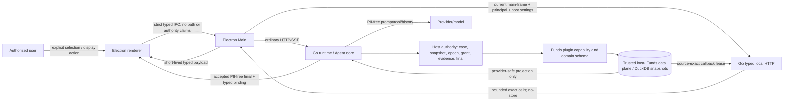
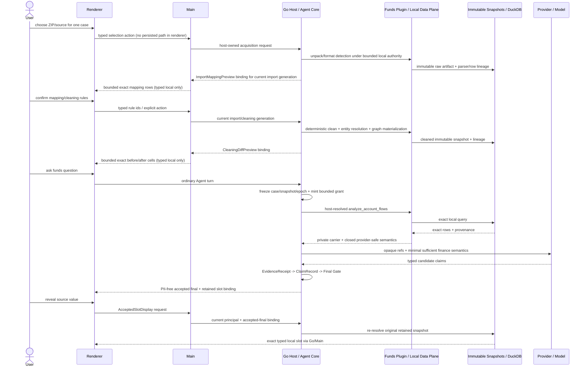
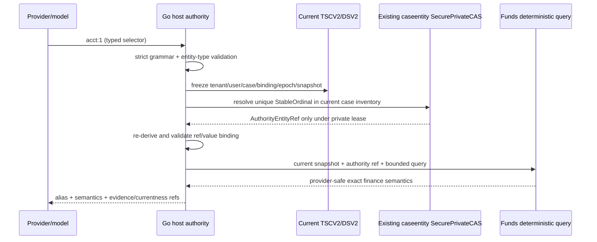
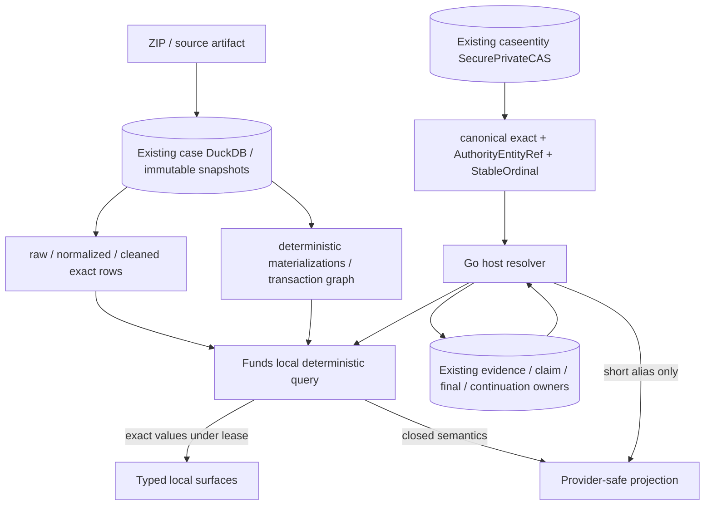
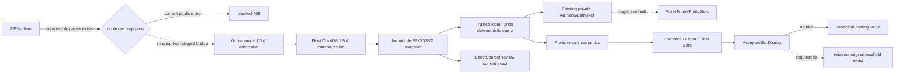

# Funds 数据平面与 Typed Local Surface 架构路线

> Status: **Reference / pre-implementation architecture decision record**
>
> Scope: Analytix core、Funds plugin、source-exact 本地数据平面、Provider-safe 语义投影、四类 typed local surface、三层案件身份、记忆/存储/at-rest、迁移与验证。
>
> Currentness: 基于 2026-08-21 的只读核验，仓库 `main`、`HEAD cf4d80ea781cf5786fd66eefe8771632db2f71d3`。
>
> Authority: 本文不修改 accepted OpenSpec，不授权实现、发布、Provider 调用或 formal claim；产品行为仍以当前源码、accepted specs 与 fresh runtime evidence 分别为准。
>
> Data handling: 本文不记录真实姓名、证件、账号、交易原文、文件/数据库路径、凭据或可反查映射。

## 1. 判定词与使用方式

- **OBSERVED**：本线程在上述 `HEAD` 和当前主机上直接读取、运行只读检查或验证得到。
- **THREAD-REPORTED**：用户或历史线程提供、但本线程未独立重放的结论；不能提升为当前事实。
- **INFERRED**：根据已观察证据作出的工程判断、目标设计或路线建议；不是 as-built 事实。
- **UNVERIFIED/BLOCKED**：缺少授权、可达产品入口、正式 artifact、同案来源或 fresh public-seam 证据，不能下结论。

本文同时维护四个互不替代的证据面：

1. active change `case-evidence-publication-gate`：当前获准的工作计划，但不是已实现行为；
2. `openspec/specs/`：accepted product target；
3. 当前源码与测试：as-built 静态实现；
4. fresh runtime / packaged / live-data evidence：实际可达行为。

### 1.1 用户问题 A–L crosswalk

| User item | Owning sections |
| --- | --- |
| A — core / Funds职责 | §7 |
| B — ZIP到typed exact display全流 | §§5–6 |
| C — 字段级分类 | §8 |
| D — 分渠道admission/retention/revocation | §9 |
| E — 四类typed local contract | §10 |
| F — producer/consumer/public seam | §§4、11 |
| G — PII与最小充分语义 | §§8.2、12 |
| H — live/sample测试必要性 | §§3.2、13 |
| I — formal B1与两个sample边界 | §14 |
| J — 迁移兼容 | §15 |
| K — 验证方案与证据上限 | §17 |
| L — 官方隐私资料与法律边界 | §§3.3、12 |

第二轮专项问题按以下章节收口：三层身份表示见 §21，token 与计算精度见 §22，DuckDB、private mapping 与 at-rest 路线见 §23，案件记忆分层见 §24，日志与缓存见 §25，上游采用矩阵见 §26，新增 OpenSpec delta 与验证裁决见 §27。

## 2. 执行摘要

1. **OBSERVED**：Analytix 的唯一生产 Agent core 是 `packages/runtime-go`；桌面公共边界仍是 `Renderer -> preload -> Electron Main -> Go runtime HTTP/SSE`。Go 还暴露一条与 generic runtime route 隔离、带专用 header 和 `no-store` 的 typed local display HTTP seam。
2. **OBSERVED**：Funds 普通插件 MCP 配置固定 `disabled: true`，Go 宿主只在 current case、immutable snapshot、source、grant 与执行 authority 均有效时动态广告固定 `analyze_account_flows`。这不是缺陷。
3. **OBSERVED**：accepted specs 当前只把 `DirectSourcePreview`、`AcceptedSlotDisplay` 以及显式用户动作的 typed Main/Host effect 列为 source-exact 本地出口。Provider、provider-visible MCP、普通历史、generic HTTP/SSE、日志、telemetry、compaction 等必须保持 source-exact-PII-free。
4. **OBSERVED**：current Go Funds provider projection 已提供精确且不要求主体身份的金融语义：case-scoped `SubjectRef`/`Counterparty.Reference`、闭集 counterparty 状态、精确 UTC 时间、方向、整数最小货币单位、币种/scale、count、coverage/gaps、EvidenceRef、query/result hash。原账号、户名、路径和 SQL 不在该 envelope 中。
5. **OBSERVED**：旧 data-analysis import adapter 的 `sanitizePreviewRows` 只截取五行并字符串化；Python repository 仍能把来源行放进 `sample_rows`，renderer wizard 类型也能持有 `sourcePath` 与 raw sample cells。mapping UI 在渲染/复制前另做字段投影，但 page-local `wizardFiles` 里的原字符串没有被替换；函数名暗示的脱敏不存在。
6. **OBSERVED**：上述旧 raw preview 路径在当前 Electron 产品入口并不可达：Main 的 data-analysis backend manager 返回 `data_analysis_native_authority_unavailable`，导入/清洗/文件选择入口处于 fail-closed quarantine。代码存在不等于产品已泄漏，但一旦重新启用将形成 generic renderer state 风险。
7. **OBSERVED**：当前 cleaning API 主动返回 `raw_details_exposed:false`、`items:[]`，因此也没有可用的 source-exact before/after 清洗差异界面。当前产品是“阻断细节”，不是“安全地显示细节”。
8. **INFERRED — architecture decision**：accepted target 应从两个孤立 sink 升级为一个**闭集、逐变体定义**的 `typed-local-data-surface` family：`ImportMappingPreview`、`CleaningDiffPreview`、`DirectSourcePreview`、`AcceptedSlotDisplay`。family 复用现有 Main/Host current-principal authority、Go runtime、不可变来源/快照、callback-scoped exact carrier 和 typed IPC/HTTP；不得变成 `Record<string, unknown>`、通用 PII handle、第二 Grant、第二 registry 或第二协议。
9. **INFERRED — architecture decision**：数据清洗、实体解析、跨表关联、图计算和 exact monetary calculation 均在可信本地 Funds 数据平面完成。模型只接收完成任务所需的最小充分语义；主体身份用案件域随机/密钥化 opaque ref，不用 PII 裸 hash，不输出反查表。
10. **OBSERVED**：本轮仅对授权 live state 和两个 sample ZIP 做了无 PII 的只读 inventory、schema 与内容哈希稳定性检查；没有启动 Electron、没有创建案件、没有导入/清洗、没有写 live state。静态证据已经证明当前旧链路不可达且缺少正确 typed surface，进行 mutation 不会证明 formal B1。
11. **OBSERVED**：两个 sample 的 archive identity、entry 数与 schema digest 不同。**THREAD-REPORTED**：用户明确它们是两个独立案件。**INFERRED**：它们可分别用于未来 import/cleaning/privacy discovery，不能伪装成同一案件的 baseline/evolved snapshot，也不能归类为 `external-preexisting-owner-isolated-real-case`。
12. **UNVERIFIED/BLOCKED**：没有 fresh packaged Electron、真实 Provider/MCP、retained-snapshot lifecycle、same-case longitudinal B1 或完整 P0/P1 redline evidence；本轮结论上限是 architecture/reference，不是 release/formal PASS。

13. **OBSERVED — second-round source audit**：现有 `ReferenceV1` 是 `cer1_` 加 64 个高熵字母，共 69 字符；其 keyed digest 输入包含 canonical exact value、canonicalizer、tenant/user/case、case binding 与 entity type。现有 private binding 同时保存 canonical exact value、`ReferenceV1` 与 `StableOrdinal`，落在同一个 `SecurePrivateCAS/bindings-v1` owner。当前支持的实体类型只有银行账号与银行卡号。
14. **INFERRED — identity decision**：保留完整 `ReferenceV1` 作为 host authority/evidence binding；provider prose、绝大多数 provider-safe semantic rows 与可调用 selector 改用基于现有 `StableOrdinal` 的短 `ModelEntityAlias`，如 `acct:1`、`card:2`。短 alias 不是 authority，必须在 current TSCV2/DSV2 下由 host 解析成唯一 authority ref；不得新增 registry、Grant、CAS 或数据库。
15. **OBSERVED + INFERRED — continuity decision**：case entity binding 不含 thread ID，因此同案不同 thread 可以条件复用 ref/ordinal；但 `thread-context-v1` 的 key 含 thread ID 与 generation，resolver 只支持 exact generation，没有 latest/list。故 resume/fork 已有 typed continuation target，而“同案全新独立 thread 自动发现长期调查状态”仍是明确 gap，应在现有 caseentity/evidence owner 内做最小 case-level typed index，不建第二记忆系统。
16. **OBSERVED — confidentiality correction**：`SecurePrivateCAS` 提供 owner/root/ACL、handle-relative traversal、no-replace、inventory 与 readback/integrity 保护，但当前 Unix/Windows writer 直接写入 private JSON bytes；未观察到内容加密、key ID 或 key rotation API。当前主机 FileVault 为关闭状态，不能把操作系统全盘加密当作已存在的产品保护。
17. **OBSERVED — token result; limited scope**：使用固定合成、无 PII 的标识和临时官方 `tiktoken 0.14.0`，当前 69 字符 ref 在 `cl100k_base`/`o200k_base` 中分别为 33/32 tokens，而 `acct:1` 为 3/3 tokens；18–19 位合成数字为 6–7 tokens。它证明长 ref 在这两个 tokenizer 上不省 token，也不能证明其他 Provider。隐私准入与 token economy 必须分开验收。
18. **INFERRED — memory decision**：“永久记忆”是 host-owned typed records、immutable snapshots/evidence 与按任务检索的 provider-safe projection，不是模型永久保存完整案件。generic `MemoryRecord.content` 是 user/workspace/project 级 free-form manual registry，缺少 case/snapshot/currentness/revocation binding，绝不能自动吸收案件 PII、案件事实或 reverse map。
19. **OBSERVED — third-round correction**：`AcceptedSlotDisplay` 虽验证committed final、claims/receipts与retained历史authority，但当前resolver最终把caseentity private binding的`canonicalValue`传给`displayValue`；没有读取原immutable snapshot的source file/row/field。故“retained authority已验证”不能等同“source-exact原值已恢复”。
20. **OBSERVED — third-round reachability**：ZIP/archive解析、schema mapping与旧DuckDB workbench源码存在，但controlled-ingestion gate和Main native-authority quarantine使公开import/cleaning入口fail closed；Go/Rust当前可观察的host admission主链是direct canonical CSV，不是ZIP→cleaned product chain。
21. **OBSERVED — active planning settlement only**：本轮已把四surface family、三层身份/短alias、同案独立线程复水合、entity correction、memory/cache/log/encryption、token/privacy双验收与DuckDB oracle写入active change；accepted main specs与产品实现仍未改变。

### 2.1 对 THREAD-REPORTED 结论的重判

| THREAD-REPORTED statement | 本线程 disposition |
| --- | --- |
| accepted OpenSpec只允许DirectSourcePreview与AcceptedSlotDisplay两个source-exact typed local sink | **OBSERVED — substantially correct**：另有“显式用户动作的typed Main/Host effect”这一独立出口，不能漏写。 |
| `sanitizePreviewRows`可能未脱敏并导致raw PII进入generic renderer state | **OBSERVED — corrected**：未脱敏属实；如果旧API可达，raw cells进入ImportPage的page-local React state，而不是已观察到的global AppState。当前入口又在renderer、API、FastAPI与Main/process authority多层fail closed；因此“产品当前泄漏”不成立。 |
| cleaning API返回`raw_details_exposed:false`、`items:[]`，用户看不到真实before/after | **OBSERVED — correct**：detail路径如此；history/logs缺少与detail相同的renderer normalizer，是未来解封前要关闭的schema drift。 |
| Go Funds已有EvidenceRef、安全Counterparty、OccurredAt、Direction、AmountMinor等 | **OBSERVED — correct with nuance**：provider-safe transaction与aggregate schema存在；counterparty safe display不是raw name/account，但仍需taxonomy/source PII canary。 |
| 应升级为四类typed-local-data-surface family | **INFERRED — accepted as best direction**：必须是closed variants并复用existing authority，不得成为generic raw-data API。 |
| Provider可得到精确金融语义但主体只用case-scoped opaque ref | **OBSERVED + INFERRED**：当前account-flow vertical已实现主要字段；推广到其他Funds tools仍是目标设计。 |

## 3. 证据与方法

### 3.1 仓库与 OpenSpec

- **OBSERVED**：起始 worktree 为 `main`；存在用户修改的 `AGENTS.md` 和未跟踪的历史 evidence JSON；另有一个用户 stash。本任务未读取其敏感内容、未修改、未 stage、未 commit。
- **OBSERVED**：适用的 root、`docs/`、`src/`、`packages/runtime/`、`packages/runtime-go/`、`plugins/` agent guides 已完整读取。
- **OBSERVED**：OpenSpec CLI 1.6.0；active change 为 `case-evidence-publication-gate`，进度 `110/194`。其 planning artifacts 完整且 strict validation 通过，只说明 proposal/design/specs/tasks 结构有效，不说明实现完成。
- **OBSERVED**：18 个 accepted specs 的 strict validation 通过。accepted spec validation 是规范结构证据，不是产品可达证据。
- **OBSERVED**：active delta 与 accepted `case-data-forensics` 对 renderer 是否可提交 `workspaceRoot` 存在冲突：accepted 仍允许，active target 要求 Main 从当前 settings/main-frame authority 推导并禁止 renderer 提交 workspace/database path。

主要代码与规范证据：

- [case-data-forensics accepted spec](../../openspec/specs/case-data-forensics/spec.md)
- [case-evidence-kernel accepted spec](../../openspec/specs/case-evidence-kernel/spec.md)
- [case-source-mcp-readiness accepted spec](../../openspec/specs/case-source-mcp-readiness/spec.md)
- [case-desktop-release-safety accepted spec](../../openspec/specs/case-desktop-release-safety/spec.md)
- [active change tasks](../../openspec/changes/case-evidence-publication-gate/tasks.md)
- [active migration](../../openspec/changes/case-evidence-publication-gate/migration.md)
- [Go runtime composition](../../packages/runtime-go/internal/runtimeapp/app.go)
- [Funds provider semantics](../../packages/runtime-go/internal/domain/nativecomponent/account_flow_projection_v1.go)
- [typed local HTTP seam](../../packages/runtime-go/internal/adapters/inbound/httpapi/local_display.go)
- [Electron typed IPC schemas](../../src/main/ipc/app-ipc-schemas.ts)
- [typed local renderer](../../src/renderer/src/components/chat/AcceptedSlotDisplay.tsx)
- [legacy import adapter](../../src/renderer/src/data-analysis/features/import/adapters/preview-to-wizard.ts)
- [legacy cleaning boundary](../../src/renderer/src/data-analysis/services/cleaning/api.ts)
- [Funds plugin boundary](../../plugins/analytix-fund-analysis/README.md)

### 3.2 Live-state 安全检查方法

- **OBSERVED**：检查前没有发现 Analytix/Electron/runtime-server 同名活动进程；因此只读 inventory 没有与已知产品 writer 并发。
- **OBSERVED**：只读取目录项类型、文件类型、大小、schema、row-count metadata、压缩 central directory、编码/列宽一致性和完整 SHA-256；没有向终端或本文输出字段值、CSV 行、表名、列名、文件名、案件名或来源路径。
- **OBSERVED**：唯一 SQLite 文件先复制到临时隔离目录再打开；临时副本已删除。DuckDB 使用 `read_only=True` 逐个打开，仅读取 schema metadata；所有源文件检查前后 SHA-256 一致。
- **OBSERVED**：没有调用 Provider、外部模型、签名、公证、发布或外部写入。

#### 3.2.1 Sanitized observation receipt

> Receipt status: **executed / non-formal / read-only**
>
> Binding: 2026-08-21；Darwin arm64 26.5.2；repository `HEAD cf4d80ea781cf5786fd66eefe8771632db2f71d3`
>
> Claim ceiling: 仅支持本节的inventory/schema/hash observations；不支持产品可达、数据真实性、formal B1或release结论。

| Observation | Method | Sanitized result | Integrity / cleanup |
| --- | --- | --- | --- |
| writer quiescence | 进程名只读inventory | 未发现已知Analytix/Electron/runtime-server writer | observation only，不证明所有可能writer不存在 |
| core data root | no-follow file type/size/count + metadata manifest | 3,645 files、1,054 dirs、436,720,785 bytes；JSON 1,069、JSONL 2,567、other 9；SQLite magic 1 | tree-manifest SHA-256 `d53559379c9b054b1da48cf25242e01f1a798e7ec7378f0e1fb92d27446a703d` |
| SQLite | isolated temporary clone；schema/count only | 2 tables、8 indexes、42 columns、434 rows | source hash before/after相同；clone已删除 |
| data-analysis root | no-follow file type/size/count | 1,209 files、8,052,908,758 bytes；CSV 881、DuckDB 7、JSON 47、DB 1、log 1、ZIP 218、other 54 | no symlink；无写入 |
| DuckDB set | `read_only=True`；schema types/count only | 7 DB、361 tables、5,364 columns；类型汇总见§13.1 | 每个source SHA-256 before/after相同；无content query |
| Sample A | ZIP central directory + in-memory GB18030 CSV structural parse；no extraction | 6 CSV、未加密、3,458 parsed data rows | SHA-256 `5e7c792d8430d40296b440387dc6df061f1e32da33d20c05b618e420479c0946` |
| Sample B | ZIP central directory + in-memory GB18030 CSV structural parse；no extraction | 76 CSV、未加密、50,661 parsed data rows | SHA-256 `b2c1ab633226c97e68f793f7361d4f3b8d4d4887f78cb8bb5682a6ca61b146d0` |

**OBSERVED**：上述receipt没有记录source路径、文件名、表/列名、cell value或原始行。它是本文内的脱敏研究收据，不是独立签名artifact，也没有改变数据来源分类。

### 3.3 官方参考与证据上限

- **OBSERVED**：全国人大官方《中华人民共和国个人信息保护法》第 28 条把生物识别、特定身份、金融账户、行踪轨迹等列为敏感个人信息，并要求特定目的、充分必要性和严格保护措施；本文把它作为风险基线，不作法律意见。参见[中国人大网法律文本](https://www.npc.gov.cn/WZWSREL25wYy9jMi9jMzA4MzQvMjAyMTA4L3QyMDIxMDgyMF8zMTMwODguaHRtbD9yZWY9aW1i)。
- **OBSERVED**：NIST SP 800-188 指出 de-identification 只能降低、未必消除重识别风险；应选择合适的数据共享模型，评估准标识符、重复发布与组合泄漏，且仅 masking 不构成充分去标识。参见[NIST SP 800-188](https://csrc.nist.gov/pubs/sp/800/188/final)及其[官方 PDF](https://nvlpubs.nist.gov/nistpubs/SpecialPublications/NIST.SP.800-188.pdf)。
- **INFERRED**：本项目采用“可信本地 protected data plane + 有界 provider-safe query projection + typed local exact sink”，比把整张去标识表交给模型更符合最小充分语义和 composition-risk 控制。

## 4. As-built、accepted target 与 gap

| Surface | As-built（OBSERVED） | Accepted target（OBSERVED） | Gap / 裁决（INFERRED） |
| --- | --- | --- | --- |
| Agent core | 唯一生产 core 为 Go；TS runtime 仅公共合同/launcher，TS backend 为 diagnostic。 | 同左。 | 保持唯一 Go core；不新增 runtime。 |
| Desktop boundary | `Renderer -> preload -> Main -> Go HTTP/SSE`；local display 有独立 typed IPC/HTTP。 | source-exact 只能走 allowlisted typed Main/Host path。 | 把四种 surface 接到现有 typed local seam，不走 generic runtime request。 |
| Funds MCP | ordinary `.mcp.json` disabled；Go reserved host 以 in-process transport 动态广告单一分析工具，不启动 ordinary MCP child。 | host-owned、current-probe、case/snapshot/grant-bound。 | `disabled:true` 保持不变；禁止 JS fallback。 |
| Import preview | legacy Python 可产 raw `sample_rows`；adapter 只截五行/stringify；wizard 能持有 path/raw cells；生产入口 fail closed。 | accepted specs 未定义 ImportMappingPreview source-exact sink。 | 先定义 typed surface；再删除/隔离 generic raw state，不能直接解封旧 backend。 |
| Cleaning diff | public normalization 强制 `raw_details_exposed:false`、空 items。 | accepted specs 未定义 CleaningDiffPreview。 | 增加 snapshot/transform-bound typed diff；不能用 generic JSON items。 |
| Direct preview | TS/Go/renderer 已有 strict schema、current case/snapshot revalidation、full/masked、25 行 UI/100 行上限、ephemeral component state。 | current principal + active case + current immutable snapshot；不经 Agent/MCP/Final Gate。 | 保留；修正 accepted/active `workspaceRoot` 冲突，renderer 永不提交路径。 |
| Accepted slot | retained accepted-final authority 已验证；当前 resolver 把 private binding 的 `canonicalValue` 用作 display value，未读取原 snapshot row/field；当前字段只允许 `account`。 | 原 witnessed snapshot；claim/receipt/final exact binding；不可用时 fail closed。 | 必须修复为 retained source-exact read；不用 canonical/current DB 回填；字段扩展必须逐 slot allowlist。 |
| Provider semantics | exact integer money、time、direction、count、coverage、refs、hashes；counterparty只有closed status、case ref与host-produced safe display；无 raw account/name/path/SQL。 | 允许最小充分、不可识别主体的 case-safe semantics。 | 继续闭集；safe display taxonomy仍需PII canary，增加quasi-identifier budget与重复查询控制。 |
| Full ZIP-to-analysis | legacy ZIP/import/cleaning code存在；Go 当前只观察到受控 Funds canonical CSV admission 与 immutable Funds query source。 | immutable acquisition/parser/row lineage、cleaned snapshot、Agent evidence/final。 | 端到端 ZIP 产品链路未建立；不能用 dormant Python/JS 文件冒充。 |
| Product reachability | static/focused tests存在；本轮未运行 packaged app。 | formal B1 必须 packaged Electron public seam。 | 保持 `UNVERIFIED/BLOCKED`。 |

## 5. 系统与信任边界



**OBSERVED** trust zones：

1. `Provider/model`、provider-visible MCP、普通 Agent history、generic HTTP/SSE、日志/telemetry 是**不可信或可持久外域**；不得接收 source-exact PII。
2. trusted local Funds MCP/data-plane component 可在 current host grant 下读取 exact DuckDB，但其返回模型的 projection 仍是不可信边界输入，必须重新验证闭集 schema。
3. Electron Main 与 Go host 是 authority owner；renderer 只持有短生命周期显示值，不得声明 case/snapshot/path/grant。
4. typed local UI 是 authorized local display sink，不是证据/claim/final authority，也不是可泛化的 raw-data API。
5. **OBSERVED**：显式 `insecure` runtime配置可绕过bearer token，但专用typed header、Main/current authority与surface validation仍执行；formal packaged证据必须证明该模式关闭、loopback origin无代理/重定向，不能把“仍有其他检查”当作可接受的生产认证替代。

## 6. 端到端数据流与 authority flow



### 6.1 Stage-by-stage authority

| Stage | Exact data owner | Required binding | Model-visible output | Failure behavior |
| --- | --- | --- | --- | --- |
| ZIP selection | Main/Go acquisition boundary | current main frame, principal, case project, user action | none | cancel/invalid source; zero durable case effect |
| Unpack/format | Funds local adapter under Go supervisor | acquisition intent, bounded source, archive inventory | fixed status/count only | reject encrypted/unsafe/symlink/bomb/unsupported entries |
| Import mapping | typed local surface | current import generation + source item + parser generation | none | revoke stale generation; no raw fallback |
| Raw snapshot | Go evidence/snapshot authority | full content hash, manifest, parser/row lineage | source ref/digest only if needed | immutable; mismatch quarantines |
| Cleaning | Funds domain | input snapshot + rule-set version + execution generation | closed rule/coverage/count semantics only | partial/rejected explicitly, never default zero |
| Cleaning diff | typed local surface | input row lineage + output snapshot + transformation step | none | stale/missing lineage unavailable |
| Entity/graph | Funds domain + host case entity store | case-scoped key material, snapshot/epoch | opaque refs, closed relations | no global identity, collision fails closed |
| Local Funds MCP | Go-reserved host binding | live source probe + exact grant + tool schema | provider-safe closed result | revoke removes tool; no JS fallback |
| Agent claims | Go evidence kernel | exact outcome/receipt/claim/context | PII-free prose + typed refs | unsupported/partial/boundary-only |
| Local exact display | Go/Main typed route | surface-specific current/retained binding | none | no-store, late response discarded |

## 7. Core 与 Funds plugin 的最终职责边界

### 7.1 Analytix core

**INFERRED — normative ownership**：以下能力属于通用 Go Agent Harness Core：

- current principal、main-frame/navigation generation、workspace/case binding、Context Epoch 与 immutable snapshot currentness；
- plugin discovery/materialization、reserved capability composition、tool advertisement/revocation、schema validation；
- 唯一 ExecutionGrant/effect authority、MCP host、provider client、ordinary HTTP/SSE、history/compaction/resume/replay；
- EvidenceReceipt、ClaimRecord、Final Gate、accepted-final persistence与 typed binding；
- 一个闭集 typed-local-data-surface transport/framework：strict discriminated union、request/response limit、current-authority check、`no-store`、late-response revocation、component-local lease；
- generic logging/telemetry/crash/search/cache policy与 PII canary；
- explicit copy/export/share 等 typed host effect 的通用权限与审计框架。

### 7.2 Funds plugin / Funds domain

**INFERRED — normative ownership**：以下能力属于第一款专业插件，而不是 Analytix 本体：

- 银行/支付/资金明细 ZIP/CSV/XLS 等格式识别、解析 profile、字段同义词和 mapping rule；
- Funds raw/normalized/cleaned schema、金额/币种/时区规则、accepted/rejected/duplicate 口径；
- 清洗 rule catalog、before/after diff reason code、transaction lineage；
- 账户/主体/对手方解析、同主体集合、transaction graph、资金流查询与 coverage 语义；
- provider-safe Funds projection 的闭集字段与 invariants；
- 四类 surface 中 Funds-specific 的 field enum、view enum、cell formatter 和 mask policy；
- Funds claims/slot types、报告语义与领域验证器。

### 7.3 物理边界裁决

- **OBSERVED**：部分 Funds privileged adapter/domain code 当前物理位于 `packages/runtime-go/internal/...`，因为它需要 host-private callback 与 snapshot/grant authority。
- **INFERRED**：物理共址不等于 Funds 逻辑属于通用 core；应通过明确 package interface 与 schema owner 保持领域边界，但不应为“纯插件化”启动第二进程、runtime、权限引擎或数据库。
- **INFERRED**：Go host 负责验证插件声明与执行，不把 authority 委托给插件；插件不能自报 current case/snapshot 或解封 dormant tool。

## 8. 字段分类矩阵

### 8.1 分类

- `L-EXACT`：授权 typed local surface 或 trusted local calculation 中可 source-exact；默认不进入任何通用状态。
- `L-MASKED`：同一 local surface 的 host-produced masked display preference；不是去标识证明。
- `O-REF`：案件域、实体类型域内的高熵随机或 host-private keyed opaque ref；跨案件不可链接，无反查表出域。
- `ENUM`：闭集语义枚举或受控 taxonomy。
- `AGG/RANGE`：计数、整数金额、coverage、区间/分桶等最小充分语义；仍需组合风险预算。
- `DENY`：任何 Provider/普通历史/generic API 外域禁止；只在 host-private lineage/authority 内保留。

| 字段族 | 本地 exact | Provider-safe 候选 | 默认外域裁决 | 说明 |
| --- | --- | --- | --- | --- |
| 姓名、曾用名、别名、户名 | `L-EXACT`/`L-MASKED` | `O-REF` + entity type | `DENY` raw text | 别名组合也可重识别。 |
| 身份证、护照、统一身份标识 | `L-EXACT`/`L-MASKED` | 一般无；必要时 `O-REF` | `DENY` | 不输出 hash/后四位作为全局 identity。 |
| 账号、卡号、支付账号、钱包地址 | `L-EXACT`/`L-MASKED` | `O-REF` + `ENUM` account type/institution category | `DENY` | 钱包地址即使公开也可强链接。 |
| 对手户名、账卡号、支付账户 | `L-EXACT`/`L-MASKED` | case-scoped counterparty ref + resolution status | `DENY` | current Go projection符合该方向。 |
| 电话、邮箱、详细地址 | `L-EXACT`/`L-MASKED` | 通常无；国家/省级粗粒度仅在任务必要时 `AGG/RANGE` | `DENY` | 邮箱域名也可能暴露组织。 |
| 交易流水号、订单号、凭证号、票据号 | `L-EXACT`/`L-MASKED` | host-minted `EvidenceRef` | `DENY` | 禁止原值、可逆前后缀或裸 hash。 |
| 开户机构、精确网点 | `L-EXACT`/`L-MASKED` | 机构类别/标准机构代码仅经受控 taxonomy；精确网点默认禁止 | `DENY` exact branch | 稀有网点是强准标识符。 |
| IP、MAC、设备 ID、IMEI、广告 ID | `L-EXACT`/`L-MASKED` | device-class `ENUM` 或 case-scoped device ref | `DENY` | 与时间/位置组合可强链接。 |
| 精确地理坐标、轨迹、精确位置 | `L-EXACT`/`L-MASKED` | 任务必要时受控区域/距离分桶 | `DENY` exact | 位置属高风险敏感/准标识信息。 |
| 交易时间 | `L-EXACT` | 必要时 UTC exact timestamp；否则日期/窗口 | `AGG/RANGE` preferred | exact 时间与金额/地点组合会重识别。 |
| 金额、余额、币种、scale | `L-EXACT` | 字符串整数最小货币单位 + currency + scale；range only when exact unnecessary | `AGG/RANGE` | 禁止浮点近似与 missing->0。 |
| 方向、账户类型、渠道、交易类型 | `L-EXACT` | closed `ENUM` | `ENUM` | 原始自由文本不出域。 |
| 备注、摘要、用途、OCR 文本 | `L-EXACT`/`L-MASKED` | 受控分类/关键词命中布尔值；不得原文 | `DENY` raw | 含身份、案件事实与 prompt injection。 |
| 商户名称、收单方、门店 | `L-EXACT`/`L-MASKED` | MCC/行业类别；必要时 case-scoped merchant ref | `DENY` exact by default | 个人商户名可能直接识别主体。 |
| 组织机构代码、统一社会信用代码、税号 | `L-EXACT`/`L-MASKED` | organization ref + type | `DENY` | 法人标识也可关联自然人/案件。 |
| 车牌、车辆 VIN | `L-EXACT`/`L-MASKED` | vehicle ref + class | `DENY` | 不输出前后缀 token。 |
| 案件号、案由内部编号 | `L-EXACT`/`L-MASKED` | case-scoped opaque ref；案由 taxonomy 可 `ENUM` | `DENY` exact | 禁止跨案件稳定 ref。 |
| 文件名、目录、数据库路径、FD、URL locator | host-private only | source/evidence ref + content digest | `DENY` | typed local UI 通常也无需展示绝对路径。 |
| 附件/OCR 元数据 | 授权 UI 可显示安全字段 | MIME/category/count/size bucket/content ref | `DENY` original filename/path/EXIF | EXIF 可含设备、坐标、时间。 |
| 生物特征、照片人脸、声纹、DNA | 极窄 typed local viewer | 通常无；case-scoped evidence ref | `DENY` | 不交给底座模型，除非另有接受的专门能力与法律依据。 |
| 签名、笔迹、印章原图 | 极窄 typed local viewer | authenticity/status enum + evidence ref | `DENY` | renderer 普通 state 不缓存原图。 |
| 原始行、reverse map、token key | host-private only | 无 | `DENY` | 即使用户可在 typed UI 看某字段，也不授权整行/映射出域。 |

### 8.2 Opaque ref 规则

**INFERRED — required design**：

1. ref 至少绑定 installation secret、case、entity type 和 canonical entity identity；优先用随机高熵 ID + host-private mapping，或域分离的 keyed construction。
2. 不使用身份证/账号/电话等的裸 SHA、短 hash、固定后缀、全局 token、递增序号。
3. entity ref 可在同一 case 跨 snapshot 稳定；fact/evidence 必须另行绑定 exact snapshot/currentness，不能让稳定 identity 暗示事实仍当前。
4. collision、映射缺失、case mismatch、key rotation ambiguity 均 fail closed；禁止“最接近”匹配。
5. 删除案件或撤销 authority 后停止解析；已经发给远程 Provider 的 opaque ref 无法召回，所以其本身也不得携带可逆信息。

## 9. Channel admission matrix

| Channel | 允许 | 禁止 | Authority | Retention | Revocation |
| --- | --- | --- | --- | --- | --- |
| Provider prompt/body | `O-REF`、`ENUM`、最小 `AGG/RANGE`、evidence/claim refs、currentness | 所有 `L-EXACT`、mask mapping、path、raw row、token key | frozen turn context + host projection policy | 单请求；远端保留取决于 provider contract，产品不得假装可删除 | host 可阻止未来请求；不能召回远端副本 |
| provider-visible MCP args | host-resolved subject ref、bounded time/query params | case/snapshot/path/SQL/raw identity、caller self-asserted authority | exact advertised schema + grant | attempt-local；durable 仅 closed argument projection | grant/epoch/snapshot change立即失效 |
| provider-visible MCP results | exact integer money、direction、currency/scale、coverage/count、bounded timestamps、refs/hashes | exact subject/counterparty、source locator、raw rows、自由诊断 | Go host revalidation + closed result schema | current attempt + PII-free accepted history | currentness标记；不能改写历史事实 |
| trusted local Funds MCP/data plane | exact DuckDB、lineage、private mappings | 将 exact 值写进 public result/log/cache/history | host-private callback lease + current grant | callback/transaction lifetime；immutable source按 case policy | lease close、case/snapshot/grant change |
| ordinary message/history | accepted PII-free prose、typed refs/currentness | exact PII、raw tool args/results、reasoning | Final Gate/public projector | thread retention policy | deletion/retention policy；旧 exact legacy 必须 withheld/migrate |
| compaction/resume/replay/fork | typed bindings、current/historical distinction、gaps | source-exact prose、reverse maps、raw rows | Go compaction/public history policy | bounded task-relevant history | original snapshot失效则 `source unavailable`，不得替换 |
| generic runtime HTTP/SSE | public closed envelopes、fixed codes、counts | exact PII、local display payload、paths、reasoning | runtime auth + public projector | response/event only；ordinary durable event无 exact | token/session close；persisted public event按线程策略 |
| typed local HTTP/IPC | 当前 surface 请求的 bounded exact cells/slots | 非 allowlist 字段、generic bags、path/authority from renderer | current Main frame + principal + host-resolved binding +专用 header | `no-store`；IPC response到组件内存 | navigation、case/snapshot/import/cleaning generation、mode/window change |
| renderer component state | 当前可见 page/slot exact value、mode/window | global store、localStorage、durable cache、search index、ordinary chat store | typed component mount + response generation equality | mount/page lifetime | unmount/focus refresh/authority generation bump清空 |
| logs | fixed topic/code/count/boolean、不可逆 request id | PII、path、raw error/body、SQL、token、exact amount+time组合 | logging allowlist | operational retention policy | delete/rotate；本来就应 zero exact bytes |
| telemetry | aggregate health/perf/count、固定版本 | case/entity refs、source digest若可关联、exact values、free text | explicit metric schema | minimum operational window | opt-out/delete policy；不发送 exact |
| crash report | stack symbol、version、fixed error code | memory dump、request body、DOM、path、env、PII | crash scrubber + allowlist | crash policy | delete policy；full dump默认禁用 |
| search index | PII-free accepted prose、safe taxonomy | exact local cells、raw history、token map | index admission policy | index lifecycle | case/thread delete purges安全投影 |
| cache | schema/catalog、PII-free key含完整 binding digest | raw values、`active/current` alias、跨 case fact | context/snapshot/source/query-bound key | short TTL或none | binding/epoch/snapshot change硬失效 |
| export/report | Final-Gated、PII-projected artifact；exact PII仅显式受控 effect | renderer Blob/download、自动导出、无 receipt 文件 | exact user action + typed host publication | artifact retention policy | 删除/吊销未来访问；已复制外部文件不可召回 |
| clipboard | 仅用户显式选择的当前 cell/slot，经 typed host action | 自动 copy、整页/raw table、后台复制 | current principal + exact surface generation | OS clipboard，产品无法保证时长 | 可主动覆盖但不能保证外部应用未复制 |
| screenshot/screen share | OS 显式用户动作 | 产品自动 capture、crash screenshot、telemetry screenshot | OS/user | OS/第三方决定 | 不可可靠召回；UI应有敏感提示/快速 mask |

## 10. Typed-local-data-surface family

### 10.1 Common contract

**INFERRED — proposed accepted target**：family 是 closed discriminated union，不是通用 endpoint。

```ts
type TypedLocalSurfaceKind =
  | 'import_mapping_preview'
  | 'cleaning_diff_preview'
  | 'direct_source_preview'
  | 'accepted_slot_display'

type DisplayMode = 'full' | 'masked'

type SurfaceWindow = {
  rowOffset: number       // 0..100_000
  rowLimit: number        // 1..100
}
```

共同 invariants：

1. renderer request 不能提交 path、database locator、caseId、snapshotId、grant、principal、raw SQL 或 reverse mapping；必要的 source/run/step selector 只能是 Main/Host 先签发、仅用于当前代际解析的 opaque reference，且本身不创建 authority。
2. Main 在请求前后验证 current main frame/navigation/principal；Go 在 exact read 前后验证 surface-specific binding。任何晚到响应丢弃。
3. `full` 是授权本地 UI 的默认 source-exact display；`masked` 是 host projection preference，不更改底层 snapshot、claim、receipt 或 provider content。
4. response schema固定、unknown field拒绝；cell 最多 4096 UTF-8 bytes，response最多 1 MiB，默认 page 25，硬上限 100。
5. exact carrier callback-scoped、不可 JSON marshal/format/log；只有最终 Main IPC response包含当前 page 的 exact display string。
6. renderer 只放在专用组件局部 state；window/page/mode/authority变化先清空再加载，不进入 Redux/Zustand generic store、localStorage、history/search/cache。
7. UI 不自动 copy/export/download；显式动作另走 exact target/case/snapshot/field-bound Main/Host effect。

### 10.2 ImportMappingPreview

**INFERRED — proposed contract**：

```ts
type ImportMappingPreviewRequest = {
  view: 'import_mapping'
  sourceItemRef: string       // opaque selector, not authority
  fieldIds: ImportPreviewField[]
  rowOffset: number
  rowLimit: number
  displayMode: DisplayMode
}

type ImportMappingPreviewResponse = {
  schemaVersion: 1
  kind: 'import_mapping_preview'
  importGenerationRef: string
  sourceItemRef: string
  parserProfile: ImportParserProfile
  fields: ImportPreviewField[]
  rows: Array<{ rowIndex: number; cells: TypedLocalCell[] }>
  hasMore: boolean
  displayMode: DisplayMode
}
```

- Authority：current main frame + principal + active case project + current import generation + host-owned source acquisition intent/locator + parser generation。
- Snapshot binding：导入确认前绑定不可变 staging source identity，不把 renderer path当 identity；导入落账后生成 raw immutable snapshot，原 preview generation立即失效。
- Field allowlist：source column label、typed sample cell、inferred type、target canonical field、parse status、mapping status；路径、secret、host key、非所选 source item 禁止。
- Revocation：source reselection、archive reparse、mapping change、case switch、navigation、import commit/cancel均撤销 pending response。
- Copy/export：mapping definition可导出 PII-free schema；exact sample cell仅显式单 cell copy，不允许整表/自动导出。
- Reuse：优先复用现有 `RawArtifactAcquisitionIntentV1`、raw artifact locator/manifest、parsed-generation lineage；不要新建 import authority registry。

### 10.3 CleaningDiffPreview

**INFERRED — proposed contract**：

```ts
type CleaningDiffPreviewRequest = {
  view: 'cleaning_diff'
  cleaningRunRef: string      // opaque selector, not authority
  stepRef: string
  fieldIds: CleaningDiffField[]
  rowOffset: number
  rowLimit: number
  displayMode: DisplayMode
}

type CleaningDiffPreviewResponse = {
  schemaVersion: 1
  kind: 'cleaning_diff_preview'
  cleaningRunRef: string
  stepRef: string
  inputSnapshotRef: string
  outputSnapshotRef: string
  fields: CleaningDiffField[]
  rows: Array<{
    sourceRowRef: string
    cells: Array<{ field: CleaningDiffField; before: string; after: string }>
    reasonCodes: CleaningReasonCode[]
  }>
  hasMore: boolean
  displayMode: DisplayMode
}
```

- Authority：current case + immutable input snapshot + exact cleaning run/step/rule-set version + candidate/committed output snapshot + transformation lineage。
- `sourceRowRef` 必须是 host-minted evidence/source-row ref；不能是 filename/row-number locator。
- Before/after 必须从同一 retained lineage pair解析；不得用当前 DB 值重新查询、重新清洗或用摘要近似。
- Revocation：rule edit、rerun、cancel、output replacement、snapshot/current case change、navigation均撤销。
- Pagination：默认25、最多100；排序由 immutable transformation ledger决定，客户端不得排序后重绑行。
- Copy/export：默认无；显式导出属于独立 cleaning audit artifact contract，需 PII projection 与 receipt，不能复用 preview response。

### 10.4 DirectSourcePreview

**OBSERVED — keep current contract, settle one conflict**：

- renderer 只提交 `view:'transactions'`、allowlisted fields、`rowOffset`、`rowLimit`、`displayMode`；当前 UI 默认25，合同上限100。
- Main 从 current settings解析 canonical workspace；Go 从 current case/snapshot authority解析 exact source。active delta 要求 renderer/Main request彻底不携带 workspace/database path，应在 accepted spec中明确并同步实现。
- 不创建 Agent turn，不调用 Provider/subagent/MCP，不创建 EvidenceReceipt/ClaimRecord，不经过 Final Gate。
- snapshot change、case switch、principal/navigation change使 pending response失效；full/masked切换重新请求，不在前端自行 mask。

### 10.5 AcceptedSlotDisplay

**OBSERVED — retained authority exists, source-exact restore is a gap**：

- renderer 提交 accepted final 的 `threadId`、`turnId`、`acceptedFinalDigest` 与 display mode；这些字段只是查找 selector，Go 仍验证 current principal、active case、accepted disposition、claim/receipt/final binding。
- accepted target要求exact value从原accepted result witnessed immutable snapshot的source file/row/field重新读取；current snapshot、canonical binding或reparse都不得替代。
- current as-built `resolveAcceptedEntitySlotsRetainedV1` 实际调用`UseRetainedBindingByReferenceV1`并把callback里的`canonicalValue`作为`displayValue`；没有source-row resolver。因此本缝只证明retained case binding校验与private callback，没有实现上述source-exact restore。
- 当前 as-built slot字段只允许 `account`，最多256 slots，每 slot最多64 claim refs与64 receipt refs。
- **INFERRED**：未来字段扩展必须逐 slot type/claim type/source field allowlist，不允许任意 field name/value bag；slot内容随原 snapshot删除或验证失败变为 `source unavailable`。

## 11. As-built producer / consumer / public seam 审计

| Layer | Producer | Consumer | Public seam | OBSERVED disposition | Production owner / next gap |
| --- | --- | --- | --- | --- | --- |
| Renderer import | `preview-to-wizard.ts` 从 backend preview构建 `sampleRows` | Import wizard React state | legacy loopback data-analysis HTTP | raw cells仅截五行/stringify；无脱敏；当前入口不可达 | Funds import UI + core typed surface；删 generic raw state |
| Python import | `ImportRepository` 读取 CSV sample rows | backend schema/API | data-analysis HTTP | 可产生 raw rows；process authority quarantine | Funds parser behind Go supervisor；不可直接解封 Python server |
| Renderer cleaning | cleaning API normalizer | cleaning detail UI | data-analysis HTTP/WS | 强制 no raw details / empty items | Funds cleaning domain + CleaningDiffPreview |
| Main data-analysis | backend manager / IPC | renderer services | local endpoint lease | `native_authority_unavailable`，file/import routes fail closed | Core Main；保持 quarantine直到 typed Go seam完成 |
| data-analysis WS | Python operational projector | renderer `AppState.runtime.lastWsEvent` | local WebSocket | backend当前丢弃unknown payload并固定no-fact/no-raw；renderer envelope仍是未经schema验证的 `Record<string, unknown>` | Core desktop/data-analysis；改为closed event union并做hostile payload canary |
| Go local display | localdisplay service/native runner | Main local display client |专用 HTTP + header + no-store | Direct/Accepted strict路径存在 | Core Go/Main；扩展 closed union两变体 |
| Renderer local display | preload IPC结果 |专用 React component local state | typed preload API | generation-bound、focus刷新、25行分页、full默认 | Core UI framework；移除对 legacy case store的非权威依赖 |
| Funds query | native exact result + provider projector | Go model/tool settlement | reserved in-process `analytix_funds` | safe schema已有；private carrier不可marshal且exactly-once | Funds domain + core host verifier |
| Funds plugin manifest | plugin package | runtime plugin materializer | plugin host | ordinary MCP disabled正确；broad tools dormant | Plugin owner；不能为旧 harness改生产语义 |
| DuckDB/snapshot | Funds materialization + DSV2 stores | query source/local display/evidence | host-private | immutable/source/query lineage types存在 | Funds schema + core snapshot authority；需产品链路证明 |
| Ordinary history | accepted final/public projection | replay/compaction/SSE/UI | Go public runtime | accepted target要求 PII-free；migration tasks仍有 open rows | Core history/persistence；legacy exact bytes需 journaled cleanup |
| Logs/telemetry | runtime/desktop/plugin diagnostics | operator/debug | local files/events | fixed-code containment有源码/测试，未做全产品 canary | 各 producer owner；core定义 admission test |

**INFERRED**：不得为了让旧 Python/JS harness 通过而把 renderer path、raw rows、current-case alias、JS MCP fallback 或 generic cleaning items重新加入生产语义。Harness 应适配 accepted public seam；production contract 不迁就 dormant test path。

**OBSERVED**：snapshot vocabulary 仍有跨层兼容缺口：Go `DatasetSnapshotManifestV2`/authority record 是最终 host authority；Rust `analysis_dataset_snapshot_manifest_v2` 是producer content digest，源码明确不能替代Go `dsv2_`；legacy Python case-effect binding仍只接受 `dsv1_`。迁移不得通过字符串重命名或把Rust/Python记录冒充Go authority解决。

**OBSERVED**：Funds/local-display 的 TypeScript strict contract当前主要位于Electron shared/Main，而 `packages/runtime` 未暴露相同的Funds-specific public contract。是否把closed family基类型提升到 `packages/runtime` 必须在OpenSpec中明确；无论位置如何，Go wire与Electron schema必须有一个canonical owner和golden equality test。

## 12. 最小充分语义与模型边界

### 12.1 为什么清洗/分析不需要把真实 PII 交给模型

- **OBSERVED**：current account-flow projection已经证明，主体可以用 case-scoped ref 表示，精确金额/方向/时间/coverage/evidence ref仍可提供有价值推理。
- **INFERRED**：清洗规则、类型转换、币种/scale、重复检测、实体聚合、graph construction应由 deterministic local code完成；模型负责选择问题、解释 safe facts或提出补证，不负责读 raw identity来完成基础 join。
- **INFERRED**：跨表关联用本地 canonical identity graph：规范化候选 -> host-private keyed lookup -> case-scoped entity ref -> snapshot-bound fact edges。模型看到 ref的一致性，不看到映射。

### 12.2 风险与控制

| Threat | Example | Control |
| --- | --- | --- |
| Dictionary attack | 对账号/电话做裸 SHA后穷举 | random/keyed case-domain ref；secret不出host |
| Cross-case linkage | 同一账号在两个案件得到同 token | case + entity-type domain separation |
| Collision/aliasing | 两实体意外共用 ref | sufficient entropy + host uniqueness check + fail closed |
| Membership inference | 重复问“某 ref 是否存在”观察差异 | bounded query catalog、统一 unavailable/no-hit语义、query audit/rate budget |
| Rare-combination re-identification | 精确金额+秒级时间+网点/位置唯一 | 最小字段、时间/地理降粒度、稀有组合 suppression、bounded rows |
| Composition across turns | 单次安全字段在多轮累积成身份 | thread-level disclosure budget、compaction不扩展、重复查询合并/拒绝 |
| Mapping leakage | debug/log/cache暴露 ref->PII | mapping仅private store/callback；zero-byte canary |
| Stale snapshot substitution | 历史 slot用current DB重算 | retained immutable snapshot exact binding；缺失即 unavailable |
| Renderer exfiltration | global store/devtools/clipboard/Blob | component-local lease、no automatic action、typed explicit effect |
| Prompt injection in data | raw remark/OCR影响模型/日志 | raw text不进Provider；local parser提取closed semantics |

**INFERRED**：exact timestamp可以是最小充分语义，也可以是准标识符；不能一律禁止或一律放行。每个 tool schema必须说明为何需要精度、row limit、组合字段及其降级策略。

## 13. Live data 与两个 sample ZIP

### 13.1 Read-only inventory

- **OBSERVED**：授权 core data root含 3,645 个regular files、1,054 个目录、约416 MiB；主要为 JSON/JSONL，发现一个 SQLite magic。隔离副本 schema为2 tables、8 indexes、42 columns、434 rows；源 hash前后稳定。
- **OBSERVED**：授权 macOS data-analysis root含1,209 files、约7.50 GiB；类别包括CSV、7个DuckDB、JSON、ZIP及少量其他文件，无symlink。
- **OBSERVED**：7个DuckDB共约4.73 GiB，均可只读打开且hash前后稳定；schema汇总为361 tables、5,364 columns，其中 `VARCHAR 4519`、`BIGINT 453`、`DOUBLE 166`、`INTEGER 149`、`TIMESTAMP 41`、`BOOLEAN 28`、`DATE 8`。
- **INFERRED**：存在 `DOUBLE` 列本身不能证明 evidence-bearing money 使用浮点；后续必须做列用途/lineage审计。若 claim金额链路依赖 `DOUBLE`，应拒绝或迁移到 exact integer/decimal，而不是静默四舍五入。
- **OBSERVED**：Sample A含6个未加密CSV，约3,458 data rows；Sample B含76个未加密CSV，约50,661 data rows。两者均可按GB18030只读解析，检查到的行列宽一致；archive hash、entry数、row数、schema digest均不同。
- **OBSERVED**：inventory仅记录类别/计数/hash/schema，不读取或输出source-exact values。

### 13.2 是否需要本轮做完整 UI/import/cleaning

- **OBSERVED**：当前 Electron data-analysis backend manager fail closed；现有 ImportMappingPreview/CleaningDiffPreview typed contract不存在。
- **INFERRED — decision**：本轮不做 live mutation。此时启动真实 UI创建两个项目只会验证 quarantine或把样本落入旧/generic状态，不能证明目标架构，也不能补 formal B1。
- **OBSERVED**：因此没有创建/删除/覆盖案件，没有写 snapshot/DB/history/cache；无需 live-state restore。临时SQLite clone已删除，所有已读源hash稳定，post-run integrity check通过。
- **INFERRED**：在 typed surfaces实现并通过静态/跨层 canary后，两个sample应分别建立两个隔离case做产品discovery；每次先quiesce、full inventory、verified backup、exact target receipt，完成后做hash/integrity与rollback演练。结果只能标为 sample product evidence。

## 14. Formal B1 与 sample 的 claim ceiling

- **OBSERVED**：accepted B1要求 packaged Electron + production Go/MCP，在一个 authorized isolated case workspace中完成真实 `analyze_account_flows`、EvidenceReceipt、ClaimRecord、Final Gate、PII-free final和 typed local display，并在同一 Agent/thread上验证snapshot evolution、compaction/restart/resume/fork、case switch与retained display。
- **OBSERVED**：当前 formal harness还要求 owner-private external root、pre-existing contract/provenance、同一case的 `baseline`/`evolved` 两快照、不同source hash且revision递增、运行前后source identity不变，以及独立provider-audit authority。
- **OBSERVED**：这些 owner-root/provider-audit细节是当前 active harness admission，不都已写入accepted main spec；不能反向宣称为普遍accepted product requirement。
- **THREAD-REPORTED**：用户明确Sample A与B是不相关独立案件，并把其来源定性为用户提供的example/sample。授权使用不会改变该任务输入分类；本线程没有独立法律或来源证明将其升级为external real case。
- **INFERRED**：A/B可分别证明archive/parser coverage、ImportMappingPreview、CleaningDiffPreview、PII canary、case isolation、rollback；不能证明same-case evolution、retained original snapshot、external preexisting real-case provenance或formal provider path。
- **UNVERIFIED/BLOCKED**：缺少同一真实案件的owner-authoritative baseline/evolved bundle、fresh package、正常Provider authority、signed audit及full longitudinal lifecycle。因此formal B1仍阻塞。

## 15. 迁移与兼容策略

### 15.1 Principles

1. **OBSERVED**：active migration要求new saves versioned/fail closed、legacy free-form facts仅 `legacy-unverified`、不从旧文本推断snapshot、不dual-write旧evidence/final/report shape、rollback不恢复高风险free-form publication。
2. **INFERRED**：typed-local family升级遵循同一原则：新增闭集schema version，不在旧generic response中塞exact字段，不将旧raw renderer cache提升为snapshot evidence。
3. **INFERRED**：迁移只使用现有Go snapshot/evidence/private-store owners；不新建第二DuckDB、第二CAS/registry或parallel epoch。

### 15.2 Upgrade plan

| Existing state | Migration action | Compatibility result |
| --- | --- | --- |
| live raw/cleaned DuckDB | read-only inventory、schema/version/lineage验证；金额类型单独审计 | 可验证者注册为immutable retained snapshot；不可验证者audit-only/unavailable |
| existing case/snapshot | 保留case identity；为每个snapshot验证manifest/source/transform lineage | 不从当前DB重建旧snapshot |
| active session/turn | snapshot/import/cleaning generation变化即撤销local response；高风险turn重冻结context | 不让in-flight exact response跨代际 |
| old renderer wizard state | 丢弃path/raw sample rows；重新选择source并通过host staging | 不做raw state in-place upgrade |
| old cleaning detail cache | 删除generic items/raw details；从immutable transform ledger重开preview | 缺lineage显示unavailable |
| legacy Agent history | display-only `legacy-unverified`；raw output withheld | 不能支持新claim/slot |
| old facts/cache aliases | 删除`active/current/last-opened`与缺binding entries | 不fallback到邻近case/snapshot |
| old AcceptedSlot binding | 验证exact original snapshot/claim/receipt/final | 成功重解；否则source unavailable |
| export/report | 无receipt的一律legacy/unverified；重新查询/验证/发布 | 不从filename/path推断authority |
| token mapping/key | version/domain inventory；case deletion或key ambiguity时停止解析 | 不跨case或静默换key |

### 15.3 Rollback

- **INFERRED**：rollback只能关闭新的surface并保留Direct/Accepted的gate，不能重新启用旧raw preview、Python direct process、renderer Blob/download、JS MCP或free-form case final。
- **INFERRED**：migration apply前必须有sealed read-only plan、exact backup/rollback target和crash-cut tests；失败保持boundary-only，不得把部分迁移视为成功。

## 16. 分阶段开发路线

### Phase 0 — OpenSpec settlement（唯一下一依赖）

- Owner：product architecture + `case-data-forensics` / `case-desktop-release-safety` spec owners。
- Modules：active `case-evidence-publication-gate` planning artifacts；不改代码。
- Deliverables：accepted four-surface closed union、field/channel matrix、Import/Cleaning authority/snapshot/revocation合同、accepted/active workspace-path冲突、migration与claim ceiling。
- Exit：`openspec validate <change> --strict` 与 accepted target review；没有悬而未决的authority choice。

### Phase 1 — P0 containment hardening

- Owner：Electron renderer/Main + data-analysis owner。
- Modules：legacy import adapter/model/store、cleaning API boundary、Main backend quarantine、related tests。
- Work：在不开放新能力的前提下，确保raw sample/path永不进入generic renderer store/history/log；旧入口继续fail closed；增加PII canary和source presence != reachability tests。
- Exit：generic HTTP/WS/Main/preload/renderer/log/search/cache zero canary bytes。

### Phase 2 — Core typed-local family framework

- Owner：`packages/runtime` contracts、Electron shared/preload/Main、`packages/runtime-go` localdisplay。
- Work：把现有两种union扩展为四种明确variant；复用专用local HTTP、header、no-store、Main current-frame验证、component lease；没有generic bags或新grant。
- Exit：TS/Go canonical contract equality、unknown-field rejection、size/window limits、late-response revocation。

### Phase 3 — Funds import acquisition + ImportMappingPreview

- Owner：Funds plugin/domain + Go supervisor/snapshot authority。
- Work：在现有raw-artifact acquisition/parsed-generation/DSV2链上增加ZIP/format adapters；renderer只接收source item ref和typed rows；确认后创建immutable raw snapshot。
- Exit：unsafe archive negative matrix、two-sample separate-case import、no path/raw rows in generic channels、rollback receipt。

### Phase 4 — Deterministic cleaning + CleaningDiffPreview

- Owner：Funds cleaning/domain + snapshot/evidence lineage owner。
- Work：规则版本、input/output snapshot、accepted/rejected/duplicate、exact monetary type、before/after row lineage；typed diff不走Agent/Final Gate。
- Exit：re-run deterministic hash equality；stale/missing lineage unavailable；no missing->zero。

### Phase 5 — Entity/graph + provider-safe expansion

- Owner：Funds case-entity/query projection + Go privacy/public projector。
- Work：case-scoped refs、collision/rotation、minimal sufficient schemas、quasi-identifier budget、repeated-query composition controls。
- Exit：cross-case unlinkability、dictionary/membership/rare-combination negative tests、provider body audit。

### Phase 6 — Retained local display lifecycle

- Owner：Go evidence/localdisplay + Electron UI。
- Work：扩展必要slot field allowlist；restart/resume/fork/compaction重解original snapshot；copy/export explicit effect。
- Exit：current snapshot substitution impossible；delete/revoke显示unavailable；no exact bytes in history/SSE。

### Phase 7 — Sample product discovery, then formal candidate

- Owner：coordinating Sol/Main agent only for live authority/final conclusion。
- Work A：A/B各自独立case做normal visible UI import/cleaning/preview，verified backup/rollback/post-integrity；只形成sample evidence。
- Work B：另行获得same-case owner-authoritative baseline/evolved bundle、provider authority与fresh package后，才可执行formal B1一次性候选。
- Exit：A不能替代B；formal任何缺项保持HOLD/UNVERIFIED。

## 17. 验证矩阵

| Class | Success criteria | Evidence ceiling |
| --- | --- | --- |
| Unit/schema | 四variant strict union；field enum、4096-byte cell、100-row/1MiB limits；unknown/duplicate拒绝 | 只证明函数/合同 |
| Token/entity | same-case稳定、cross-case不同、collision fail、key/mapping不出域 | 不证明产品UI/Provider |
| Import parser | archive bomb/traversal/symlink/encrypted/encoding/width/unsupported拒绝；immutable source hash | 不证明Main/renderer |
| Cleaning | deterministic before/after lineage、exact money、missing/invalid/zero区分 | 不证明display/channel isolation |
| Cross-layer | Renderer请求无path/case/snapshot；Main current-frame；Go exact binding；late response丢弃 | source-level/integration，不是packaged |
| Electron UI | normal visible entry显示四surface；full/masked、pagination、focus/nav/case/snapshot revoke | dev app不等于formal package |
| Live-data sample | A/B两个独立case、backup/rollback/hash稳定、无PII receipt | sample product evidence，非formal real-case |
| PII canary | 每一敏感field族植入独立canary；Provider body/MCP public/history/SSE/generic renderer/log/telemetry/crash/search/cache/export zero bytes | 仅覆盖执行到的渠道/field族 |
| Negative authority | forged handle、cross-case、stale snapshot、wrong principal、navigation race、duplicate use、oversize全部fail closed | 不证明positive exact correctness |
| Retained snapshot | baseline answer后evolved snapshot；历史slot仍读baseline；删除baseline后unavailable | same-case lifecycle；仍非Provider/formal除非packaged |
| Revocation | import/cleaning rerun、case/snapshot/principal/nav变更使pending/visible exact值清空 | 不召回OS clipboard/screenshot/remote copies |
| Model-visible audit | capture exact provider request/tool args/results；只含allowlisted semantics；重复查询composition检查 | 需Provider authority；本轮未执行 |
| History lifecycle | compaction/restart/resume/fork只保留typed safe bindings/currentness | 需fresh persistent app execution |
| Migration | sealed preflight、crash cuts、idempotent restart、legacy exact bytes removed/withheld、rollback gate-preserving | 只针对tested platform/root set |
| Formal B1 | fresh package、same-case baseline/evolved、owner/provenance、Provider/MCP、Final Gate、retained display、full redlines | 才可支持B1；仍不自动授权release |

## 18. OpenSpec delta 建议

**OBSERVED — active planning settlement completed; implementation remains open**：

1. 在 `case-data-forensics` 定义 `typed-local-data-surface` closed family及四variant；把source-exact allowlist从两个名字升级为family的明确成员，而不是“任意本地UI”。
2. 保留DirectSourcePreview/AcceptedSlotDisplay既有语义；新增ImportMappingPreview的pre-snapshot staging identity和CleaningDiffPreview的input/output snapshot + transform lineage。
3. 统一accepted与active contract：renderer绝不提交workspace/database/source path；Main/Go从current authority解析。
4. 在 `case-desktop-release-safety` 增加renderer component-local exact state、no automatic clipboard/download/export、navigation/generation revocation、OS screenshot不可召回边界。
5. 在 `case-provider-structured-output` / source MCP spec增加最小充分语义、quasi-identifier组合预算、重复查询composition与case-scoped ref lifecycle。
6. 在migration中明确old wizard sample/path、cleaning raw items、generic cache/history的discard/withhold策略，以及live DuckDB exact-money lineage admission。
7. 在test strategy中加入四surface positive/negative、每field族PII canary、retained original snapshot、copy/export与no-substitute tests。
8. 明确sample evidence与formal B1 provenance classification；禁止把两个独立sample重标为same-case evolution。
9. 明确current formal harness附加的owner-root/provider-audit admission哪些应成为accepted requirement，哪些只是当前qualification procedure，避免tracker反向定义产品。

## 19. Formal claim ceiling

- **OBSERVED**：OpenSpec planning/accepted validation通过；current源码包含Go Funds safe projection和两个typed local surface；旧import/cleaning raw/detail边界与current fail-closed reachability已静态确认；live/schema inventory完整且无写入。
- **THREAD-REPORTED**：历史线程曾报告focused Go/renderer/B1 slice结果、formal package失败或HOLD；本文未把这些报告当current runtime evidence。
- **OBSERVED**：四surface family及相关identity/memory/encryption/testing contract已进入active delta，但accepted main specs尚未sync，产品尚未implemented。
- **UNVERIFIED/BLOCKED**：ZIP-to-cleaned-DuckDB产品链路、fresh Electron、Provider/MCP、同案独立线程复水合、source-exact retained slot、merge/split/key rotation、全channel canary、same-case formal B1均未执行。
- **INFERRED**：本文与strict-valid active change可支持返回主施工线程按依赖实施；不能支持release readiness、formal PASS、commercial authorization或privacy/legal compliance结论。

## 20. 未决事项与唯一下一依赖

### 20.1 Settlement 后仍需在实施证据中关闭

1. ImportMappingPreview是否绑定“未提交staging generation”还是“先创建raw immutable snapshot再preview”；本路线推荐前者，但必须复用existing raw-artifact acquisition lineage且commit后立即撤销。
2. Cleaning output是candidate immutable snapshot还是仅commit后可preview；本路线推荐candidate也不可变并有独立generation，不能让mutable working table成为display authority。
3. exact timestamp/geo/merchant在每个Funds tool中的必要精度与composition budget。
4. AcceptedSlotDisplay除`account`外首批允许的slot field与claim类型。
5. exact local copy/export是否首期完全禁用，或开放单cell copy；无论哪种都不能自动化或复用preview response作artifact。

### 20.2 唯一下一依赖

**INFERRED — NEXT**：active planning settlement完成并通过strict validation后，先实施 §31 Slice 1 的三层身份、短alias与同案独立线程existing-owner复水合；完成其negative/PII/continuity验证前，不应解封旧data-analysis链路或实施generic raw preview。

## 21. 三层身份表示合同

### 21.1 As-built 证据与边界修正

| Claim | Evidence | Disposition |
| --- | --- | --- |
| `ReferenceV1` 格式 | [reference_v1.go](../../packages/runtime-go/internal/domain/caseentity/reference_v1.go) 要求 `cer1_` + 64 个 `a`–`p` 字符；总长 69 字符。 | **OBSERVED** |
| ref 派生域 | [service.go](../../packages/runtime-go/internal/app/caseentity/service.go) 的 canonical payload 包含 canonical exact value、canonicalizer、tenant/user/case、case binding 与 entity type，再用 installation-keyed purpose `case_entity.reference/v1` 派生。 | **OBSERVED** |
| private binding | [private_state_v1.go](../../packages/runtime-go/internal/domain/caseentity/private_state_v1.go) 的 binding 同时保存 canonical exact value、`ReferenceV1`、`StableOrdinal` 与 canonicalizer；ordinary JSON/String 路径拒绝或 redacted。 | **OBSERVED** |
| ordinal 分配 | [store.go](../../packages/runtime-go/internal/adapters/outbound/caseentity/store.go) 在同一 tenant/user/case/case-binding inventory 内取 `max + 1`，已有 binding 复用；账号与卡号共享 ordinal namespace。 | **OBSERVED** |
| 当前类型 | `IsFinancialEntityTypeV1` 与 [display_label_v1.go](../../packages/runtime-go/internal/domain/caseentity/display_label_v1.go) 只支持 `bank_account_number`、`bank_card_number`。 | **OBSERVED**；person/org/phone/device/merchant 均不是 as-built。 |
| 持久化 owner | 同一 `SecurePrivateCAS` root 下的 `bindings-v1`、`ingress-v1`、`thread-context-v1`。 | **OBSERVED** |
| thread continuity | binding key/ref payload 不含 thread；thread context storage key 含 thread + generation，且 resolver 无 latest/list。对非测试 Go 代码搜索只找到 persist/resolve use case 的定义，没有调用方。 | **OBSERVED**；合同/存储能力存在不等于产品链已接通。 |

第一轮把 provider-safe `ReferenceV1` 统称为“opaque ref”是隐私方向正确但粒度不足。第二轮的精确裁决是：**authority reference、model alias、user-visible exact value 必须成为三个不同类型和不同 admission class**。其中 ref 的长度是 authority/security 选择，不承担 token economy；alias 的短小是 provider display/selector 选择，不承担 authority。

### 21.2 Normative three-layer contract

| Layer | Normative shape | Authority and scope | Allowed storage/channels | Explicit prohibitions |
| --- | --- | --- | --- | --- |
| `SourceExactIdentity` | immutable source/snapshot中该 row/field 的完整原值与表示元数据；未来按 OpenSpec新增的 person/org/phone/device 等同理 | current principal + case + source/snapshot + row/field lineage + DSV2/TSCV2 + purpose-bound lease | trusted local DuckDB/immutable snapshot；四类 typed local UI 的 bounded response；private callback内的瞬时值 | Provider prompt/body、provider-visible MCP、ordinary history/SSE、generic renderer store、generic Memory、logs/telemetry/cache/search/compaction |
| `AuthorityEntityRef` | 当前 `ReferenceV1`，即 69 字符 `cer1_…` | installation-keyed、tenant/user/case/case-binding/entity-type/canonicalizer/value bound；必须由host连同current context/evidence验证 | caseentity private binding、evidence/claim/currentness owners；必要的 host-internal typed contract | 不作为用户 exact 值；不自动出现在 provider prose；不当 global identity、cache alias、telemetry label；ref单独不是证据/执行authority |
| `ModelEntityAlias` | closed grammar，例如 `acct:<positive-decimal>`、`card:<positive-decimal>` | 只在 frozen current case context 中是 selector/display；由 existing `uint32 StableOrdinal` 派生，本身不证明主体、来源、快照或 currentness | provider-safe prose/semantic rows、strict tool args、provider-safe history中的 typed field；短 TTL process cache | 不持久 reverse map；不跨 case 解释；不作为 evidence authority、factual cache key、user exact display、全局 token |

`reference_v1.go` 把 current ref定义为 analysis identity，并明确它不是 user-visible identity或 evidence authority。本文的 `AuthorityEntityRef` 命名表示“由 host authority 私下解析和验证的持久实体引用”，**不是**“字符串本身自带权限或证明力”；任何 query、claim、Final Gate 或 local display仍须独立验证 TSCV2/DSV2、snapshot/currentness、evidence 与 purpose。

private binding里的 `canonicalValue` 是身份规范化与ref重派生输入，可能与source字符串的分隔/格式不同；它**不是** typed UI 的显示来源。`DirectSourcePreview` 必须从current snapshot的精确row/field读取，`AcceptedSlotDisplay`必须从retained original snapshot与lineage恢复。二者都不能用canonical binding、当前数据库值或重新格式化的近似字符串替代source-exact值。

**INFERRED — selected design**：保留完整 `ReferenceV1` 作为 host authority ref；provider prose 与绝大多数 semantic rows 使用短 alias。若 provider-visible tool 接受 alias，必须执行下列 host-side resolution，禁止 tool/provider 自己反查：



实现 owner 必须复用 existing caseentity store 的 inventory/validation 逻辑，增加一个窄的 `ResolveByStableOrdinal(current case scope, entity type, ordinal)` public app use case即可；**不得**创建第二 alias registry、alias table authority、Grant、CAS 或 service。alias数字必须是无前导零的 canonical positive decimal，解析上限等于 current `uint32 StableOrdinal`，prefix与entity type一一对应。解析结果必须唯一；缺失、重复、overflow、wrong type、case switch、stale TSCV2/DSV2、revoked snapshot 一律 fail closed。

### 21.3 稳定性、泄漏与生命周期

| Event / risk | Required behavior | Status |
| --- | --- | --- |
| Sequential ordinal | 会泄漏大致发现顺序；若 provider见到多个 alias，还可能推断本轮已发现实体规模。只暴露任务所需 alias，禁止输出 inventory/max ordinal；ordinal 永不复用。 | **INFERRED**；风险可接受性须进 OpenSpec。 |
| Cross-case | `acct:1` 在不同案件可重复出现且不可互相解释；resolver必须先绑定 current case，禁止“active/current/last-opened case”隐式 fallback。 | **INFERRED target** |
| Restart/resume/fork/compaction | 从 host-owned typed binding/context/evidence恢复 alias；不得从模型 prose、summary 或 generic history重建 reverse map。 | accepted 对 resume/fork 有目标；fresh runtime **UNVERIFIED**。 |
| Independent new thread | 相同 case binding 可复用已有 ordinal/ref；旧 `thread-context-v1` 不能被新 thread 直接 latest/list。应在用户显式选择 case 后，从 existing case-level binding/evidence 与最小 case-level investigation record组装新 generation 1。 | binding **OBSERVED**；自动复水合 **GAP**。 |
| Snapshot evolution | identity ref/alias可保持；任何 amount/count/relation/claim都必须携带新 snapshot/currentness，禁止用 identity continuity 冒充 factual freshness。 | **INFERRED target** |
| Case switch / revoke / delete | 立即清除 renderer display lease与进程 alias cache；alias变 unavailable，不重分配给别的 entity。Committed immutable binding当前没有业务删除API。 | clear target **INFERRED**；delete gap **OBSERVED**。 |
| Installation identity-key rotation | 当前 ref由 installation-keyed digest派生但 binding无 key generation/migration；直接换 key 会改变 ref。必须先设计 dual-read/single-write 或 journaled remap，并维持旧 evidence resolution，失败即只读/拒绝。 | rotation API缺失 **OBSERVED**；路线 **INFERRED**。 |
| Canonicalizer upgrade | canonicalizer ID必须进入 migration authority；旧 canonical value/ref保持可验证，新规则不得静默重解释或重排 ordinal。 | current ID存在 **OBSERVED**；migration **GAP**。 |
| Collision / corruption | alias必须在 `(tenant,user,case,caseBindingHash,entityType)` 下恰好解析一个 immutable binding；零或多条均 fail closed并产生 fixed diagnostic code，无值/ref输出。 | **INFERRED target** |

`后四位`、PII 的裸 hash、固定盐 hash、确定性密文、全局递增 token 均不能当 identity：后四位会碰撞；裸 hash 可被字典攻击；确定性密文暴露相等关系且通常比短 alias 更长；全局 token 可跨案链接。安全后缀只可作为 typed local/display-safe label 的辅助，不参与 authority、join 或 cache key。

### 21.4 Person/org/phone/device/merchant 的 merge、split 与 correction

**OBSERVED**：当前 caseentity store 只有 immutable ensure/resolve，没有 merge、split、correction、update、business delete；因此以下均是未来 target，不得写成 current support。

- **新增类型**：先为每类定义 canonicalizer version、准入字段、case-scoped ref purpose、model alias prefix 与 provider semantic need。person/org 不能共享同一个 canonicalizer；phone/device/merchant 不能沿用银行账号的纯数字规则。
- **Merge**：不原地改写或删除旧 refs。由 existing caseentity private owner 保存 versioned equivalence/supersession relation，指向一个新 current resolver result；旧 evidence 继续引用旧 ref并保留当时 currentness。
- **Split**：为拆出的实体分配新 immutable refs/ordinals；旧聚合 ref成为 historical/ambiguous，禁止自动把旧 claims复制给全部 children。
- **Correction**：把 canonicalizer correction、来源更正、主体分类更正分别建模；写入 versioned resolver event和 provenance，不改变已经签收的 evidence payload。当前事实由 snapshot/epoch/currentness选择，而非覆写历史。
- **Deletion/revocation**：撤销解析与显示权，不复用 alias；retained snapshot、evidence、法定/产品保留期与用户删除权之间的冲突必须由未来 retention spec裁决，不能靠删除 generic cache冒充完成。

### 21.5 Existing sessions and alias contract migration

**OBSERVED**：current Funds provider projection与accepted `case-data-forensics` 使用完整 case-scoped `ReferenceV1`；短 `ModelEntityAlias` 不是 as-built。因此迁移必须是 versioned provider/tool contract change，而不是只改显示字符串。

- 新 contract在 frozen context projection阶段把已有 authority ref映射为短 alias；不重写 private binding、evidence receipt、claim record或retained display binding中的权威引用。
- 正在进行的 turn/attempt不得中途换 vocabulary；只在新 context epoch或显式版本边界生效。旧持久 provider-safe history若含typed legacy ref，可由host在resume时解析后向新prompt投影alias，但不能把旧自然语言全文重写或注入reverse map。
- tool args/results、provider prompt schema、history/compaction contract、claim/evidence projector与测试fixture必须同时升级；未知alias/ref版本fail closed。
- identity-key rotation若保留binding与StableOrdinal，alias可保持；authority ref迁移则由dual-generation resolver处理。不能为了alias稳定而把old key、exact value或全量ref map发送给模型。
- 当前旧renderer state/cache不应迁移alias mapping；升级时销毁并从private authority重建。generic Memory/history里的任意相似字符串不得被自动解释为alias。

## 22. Token economy 与计算精度

### 22.1 Synthetic tokenizer benchmark

本轮只使用固定 SHA 派生的合成标识；没有把用户数据或真实值送入 tokenizer，也没有持久化样本字符串。临时安装官方 `tiktoken 0.14.0` 后已移除。计分是 tokenizer 的实际 encode 长度，不使用“字符数除以四”。

| Synthetic design | UTF-8 bytes | `cl100k_base` tokens | `o200k_base` tokens | Interpretation |
| --- | ---: | ---: | ---: | --- |
| 19-digit synthetic account-shaped text | 19 | 7 | 7 | 仅 token baseline；禁止因较短而发送真实账号 |
| 18-digit synthetic identity-shaped text | 18 | 6 | 6 | 同上；不是隐私许可 |
| 69-char high-entropy `cer1_` shape | 69 | 33 | 32 | 当前 authority ref 在这两个 tokenizer 上明显更贵 |
| `acct:1` | 6 | 3 | 3 | 推荐 model alias shape |
| `card:2` | 6 | 3 | 3 | 推荐 model alias shape |
| 合成中文自然安全标签 | 31 | 14 | 12 | 人类可读不等于 token 最省 |
| 合成 ASCII 自然安全标签 | 26 | 8 | 8 | 可作 prose label，但仍高于短 alias |

**OBSERVED**：当前长 ref 在两个 OpenAI-compatible encodings 上约为数字形标识的 4.6–5.5 倍、短 alias 的 10.7–11 倍。**INFERRED**：这足以反驳“把 PII 换成长 hash/ref 就会自动省 token”。长 ref 的价值是不可逆、case-scoped authority；短 alias 才承担 token economy。

**UNVERIFIED**：没有本轮目标 Provider/model 的官方 tokenizer，也未执行任何 Provider 调用。每个正式 provider profile 都应以 exact tokenizer/model/version 生成 scorecard；未知 tokenizer 必须标 `unverified`，不得用 `tiktoken` 代替 provider-neutral 结论。`tiktoken` 只适合作为离线测试工具候选，不进入生产 Go runtime。

### 22.2 精确、稳定、可审计的金融转换

转换边界不是“把表压成摘要”，而是 local deterministic computation 后输出 closed semantic contract：

- 金额、余额、净额使用 integer minor units 或带明确 scale 的 exact decimal，必须携带 currency 与 `MinorUnitScale`；禁止 binary float。
- 方向、计数、coverage、missing/null/invalid/zero、query bounds、source freshness、snapshot/currentness、evidence/claim refs、result/query hash、图边方向与拓扑都不得模糊转换。
- 清洗、dedupe、join、aggregation、实体解析、资金流与图计算在 local DuckDB/Funds deterministic code 中完成；模型负责解释、提出 bounded query plan、比较已计算结果，不从海量 raw rows自行算账。
- 工具返回必须区分“无记录”“未覆盖”“字段缺失”“解析失败”“被策略抑制”；禁止统一变成零或空字符串。
- 每个 provider-visible aggregate都能回到 host-owned query/result hash、snapshot、coverage与 evidence ref，但这些 refs不能携带 reverse map或路径。

| Field | Provider admission decision | Re-identification guard |
| --- | --- | --- |
| Exact timestamp | 只有排序、因果、窗口边界、短时循环或工具必须时给精确 UTC；否则降为 date/range/bucket。 | 与金额、merchant、geo组合前执行准标识预算；稀有时间点可单独识别。 |
| Merchant | 优先 case alias、闭集 merchant category 或安全 label；只有 task必要且已证明不会直接识别个人/小商户时给文本。 | 小商户名、备注中商户名可能等价于位置/个人身份。 |
| Institution/branch | institution category/opaque ref优先；精确支行通常 local-only。 | 精确支行 + 时间 +金额会显著缩小人群。 |
| Geo | country/province/city/region或距离 bucket按任务最小化；精确坐标 local-only，除非专门获批的 typed tool contract。 | 轨迹、住所、常去地点与时间组合的 membership inference。 |
| Free-text memo/OCR | 不直接进入模型；先在本地结构化抽取闭集语义，保留 exact 原文在 typed local surface。 | 自动 PII detector 不是完整安全边界。 |

验收必须包含 model arithmetic 与 DuckDB oracle 的逐字段对账；模型最终陈述若与 deterministic result不一致，应由 Final Gate标 unsupported/partial，而不是让模型“修正”本地账目。

## 23. 存储拓扑：继续使用现有 DuckDB 与 private owners

### 23.1 Direct answer

**INFERRED — selected topology**：继续使用**现有案件 DuckDB + immutable snapshot lineage**。不增加 SQLite alias registry、向量库、图数据库或 memory server。



- raw、normalized、cleaned exact rows、deterministic materializations、snapshot lineage继续在 existing case DuckDB/immutable snapshot。
- canonical exact、authority ref、stable ordinal的 authority/reverse mapping继续在 existing caseentity `SecurePrivateCAS/bindings-v1`；不进入 provider-visible DuckDB view、generic cache/history、`MemoryRecord.content`。
- thread investigation、claim/evidence/currentness继续使用 existing typed private context、evidence、claim、accepted-final与 continuation owners。
- DuckDB负责本地 exact relational/aggregate computation；caseentity CAS负责 identity authority；evidence owners负责可审计事实生命周期。三者职责互补，不能都叫“记忆”后塞入同一个表。

### 23.2 是否把 ref/alias 物化到 cleaned DuckDB

默认裁决为**不物化 authority mapping**：

| Option | Benefit | Risk | Decision |
| --- | --- | --- | --- |
| cleaned table 增加 `AuthorityEntityRef` | join方便、少一次private lookup | DB副本即携带持久主体链接；key rotation/canonicalizer migration需改immutable snapshot；provider view误选风险 | **REJECT as canonical column** |
| cleaned table 增加 `ModelEntityAlias`/ordinal | query展示快 | ordinal是case inventory元数据；snapshot evolution时易被误当事实/authority；跨case解析风险 | **REJECT as source of truth** |
| Funds query时在 host 内解析 | authority单一、rotation/revocation集中 | 多一次private lookup；需bounded cache | **ADOPT target** |
| 同一 DuckDB 内 host-private derived table | 大图/高频join可能更快 | 仍复制敏感关联；需version/snapshot/hash/view isolation | **DEFER**：只有 profiling证明必要才可提案；必须可重建、非authority、provider view不可见。 |

本地 DuckDB 内部可以直接用 exact trusted columns做 deterministic join，边界投影时再把结果映射为 alias/ref。这样不牺牲 join 精度，也不让 model alias成为数据模型主键。

### 23.3 Independent new-thread case rehydration

**OBSERVED**：binding inventory是 case-level；`ThreadCaseContextRecord` 与 storage key 是 thread-level，解析需要 exact generation，并明确不提供 latest/list。对 production Go 非测试代码的精确搜索只找到 `PersistThreadCaseContextV1` / `ResolveThreadCaseContextPrivateV1` 定义，没有观察到调用方。因此现状不能宣称该合同已经接入产品连续性路径；从类型能力推导的最低可行行为只能是：

1. 在新 thread 已显式选择同一 case、获得 current TSCV2/DSV2 后复用 case entity bindings；
2. 新建 generation 1 thread context；
3. 不能自动从旧 thread 选择“最新调查状态”或把旧 generation chain接到新 thread。

**INFERRED — minimum extension**：在 existing caseentity/evidence private owner 内增加一个 case-level、typed、append/evolve-only 的 longitudinal investigation record/index，key 至少绑定 tenant/user/case/case-binding/schema generation，并列出可检索的 typed entity/evidence/claim/currentness refs。创建新 thread 时，只有用户显式选择 case、host重新验证 current snapshot/epoch后，才把 task-relevant安全投影装配进新 generation 1。它不是 reverse map，不含 exact值、raw rows或 provider prose，也不是第二 registry。

### 23.4 At-rest encryption、keys、snapshot hashes 与 migration

**OBSERVED**：

- current Funds producer pin 为 DuckDB `v1.5.4`；workbench 以 `read_only=True` 连接，并关闭 extension autoinstall/autoload 与 external access。
- current `SecurePrivateCAS` 在 [Unix writer](../../packages/runtime-go/internal/adapters/outbound/finalauthority/private_cas_unix.go) / [Windows writer](../../packages/runtime-go/internal/adapters/outbound/finalauthority/private_cas_windows.go) 都直接写 private JSON bytes；[common CAS](../../packages/runtime-go/internal/adapters/outbound/finalauthority/private_cas.go) 提供 `0600`/ACL、root identity、handle-relative访问、no-replace、inventory/readback与完整性检查，但未观察到内容加密、key ID或rotation API。
- current installation/final authority是 owner-only file-backed Ed25519 material；未观察到 Keychain-backed identity key lifecycle。
- 本轮主机 `FileVault is Off.`，因此 OS full-disk encryption 不是当前已满足的产品控制。
- 在临时、完全合成 DuckDB `1.5.4` fixture 中，AES-GCM database 无 key直接打开会失败，带 key attach 可读且标为 encrypted/GCM；相同逻辑 rows与相同 key生成的两个数据库 file hash不同。临时环境已删除，未触碰案件数据。

DuckDB 官方说明 v1.4+ 支持 database/WAL/temp at-rest encryption，默认/推荐 AES-GCM；同时官方安全指南强调 SQL、路径、extension具有代码执行级风险，safe mode与 settings只是 defense-in-depth。参见 [DuckDB data-at-rest encryption](https://duckdb.org/2025/11/19/encryption-in-duckdb)、[Securing DuckDB](https://duckdb.org/docs/stable/operations_manual/securing_duckdb/overview) 与 [Extensions security](https://duckdb.org/docs/stable/operations_manual/securing_duckdb/securing_extensions)。

| Decision area | Route | Why / acceptance |
| --- | --- | --- |
| DuckDB native AES-GCM | **DEFERRED ADAPT**, not immediate enable | 必须先确定 key owner、backup/restore、package/platform support、migration与retained snapshot语义；不能因引擎“支持”就直接采用。 |
| SecurePrivateCAS content encryption | 在同一个 CAS/wire version 后面评估 randomized AEAD envelope；不新建 CAS。 | 需要 tamper/wrong-AAD/key-generation/partial-write/recovery/crash-cut tests。 |
| OS FileVault/BitLocker | defense-in-depth only | 不能替代 app-level portable encryption；本轮主机还未启用。 |
| Key storage | 优先 OS Keychain/credential protection 包装 data-encryption key；identity HMAC key与data-encryption key分责。 | 避免“为了换密钥导致所有 ref/alias改变”；不得输出/持久化明文 key。 |
| Rotation | 先轮换 wrapping/data-encryption key；identity key只有在独立 migration中轮换。 | old+new generation受控读取、new-only写入、journal、rollback、retained evidence重解，失败fail closed。 |
| Snapshot identity | 同时保存 canonical logical content digest 与 encrypted blob hash/cipher/key generation（不含 key）。 | randomized GCM会改变文件字节；不能让 ciphertext hash冒充逻辑数据未变。 |
| Backups | encrypted、manifest-bound、restore前完整性/authority验证；删除/retention覆盖 backup lifecycle。 | live DB、CAS、key backup必须能一起恢复或明确不可恢复。 |

启用 encryption 会改变 current open path 和物理 blob hash；迁移必须产出新 versioned immutable snapshot/manifest，或明确 logical digest 与 cipher blob digest 的双层含义。不能原地重写 retained snapshot 后继续声称原证据 bytes未变。NIST 的去标识建议不等于 at-rest encryption设计，也不保证加密后的共享安全；两类控制必须分别验收。

## 24. 案件记忆分层

### 24.1 “永久记忆”的准确含义

**INFERRED — normative rule**：模型没有、也不应获得一个装满完整案件的永久记忆。长期连续性由 host-owned typed state、immutable evidence 与按当前任务检索的 provider-safe projection提供；模型在每次 turn只看到 bounded、case/currentness-bound安全语义。

| Tier | Owner / current store | Allowed data | Forbidden data | Retrieval / projection | Compaction | Retention / revoke |
| --- | --- | --- | --- | --- | --- | --- |
| Request/turn working set（短期） | Go attempt/use-case memory；renderer component lease | current typed alias、query plan、bounded provider-safe rows、local exact callback内的瞬时值 | exact值离开callback；reverse map；generic renderer/global state | current TSCV2/DSV2 + tool grant only | turn结束不进入summary | attempt/turn TTL；case/nav/revoke立即清除 |
| Thread typed continuation + provider-safe history（中期） | `thread-context-v1`、accepted-final/continuation owners、ordinary history的safe fields | entity/evidence/claim refs、snapshot/currentness、open question/data-gap refs、safe aliases | exact PII、raw rows/tool results、reverse map、路径、自由文本 exact备注 | exact thread + generation；resume/fork按host typed state恢复 | summary只保留typed refs/digests/constraints，不复制PII prose | thread policy；epoch/snapshot变更后事实重新验证；delete/revoke使引用unavailable |
| Case longitudinal investigation state（跨线程长期） | existing case-level bindings/evidence；最小 case-level typed index是 gap | immutable identity bindings、typed relations、evidence/claim/currentness refs、investigation milestones | exact prose、generic transcript、model reasoning、reverse table副本 | 用户显式选择case后，host按任务/当前快照检索并装配新thread generation 1 | 不由LLM summary充当authority | case retention；snapshot/currentness/relation correction可追溯；不得隐式last-opened |
| Retained immutable snapshots/evidence/accepted-final bindings（长期档案） | existing DuckDB snapshot/evidence/claim/final/localdisplay owners | source-exact rows在trusted store；hash/lineage/claim/final binding；原snapshot display authority | exact值进入generic history/SSE/Memory | current或retained binding的专用host path；Provider仅安全投影 | 不压缩或重算原证据；只压缩引用 | policy/legal hold/delete裁决；source缺失则local display unavailable，不从current DB替代 |
| User-approved general Memory registry（永久偏好/知识） | `packages/runtime` `MemoryRecord` contract + Go `dataDir/memory/records` filestore | 用户手动输入的通用偏好、工作区/项目知识，且不含案件敏感信息 | 案件PII、source-exact、reverse map、raw事实、证据替代品、自动模型抽取的案件内容 | 当前只store/manual CRUD；未来即使检索也必须独立safe admission | 当前无automatic capture/injection | user delete产生tombstone；backup物理保留期另订；不得借“永久”绕过case revoke |

授权必须逐层发生：turn working set由current turn/tool grant授权；thread层由current principal + exact thread/generation授权；case层还要求用户显式选择case并重新验证case-binding/snapshot/epoch；retained exact display要求专用surface动作与原accepted binding；generic Memory只允许用户手动CRUD，不能因case处于active状态自动写入。

**UNVERIFIED/BLOCKED — retention duration**：当前读取范围没有给案件thread、case longitudinal state、retained snapshot/evidence、private binding、backup或generic Memory定义统一的天数TTL/物理purge SLA。本文不虚构时长：OpenSpec必须分别给出默认保留、用户删除、legal hold、backup expiry、tombstone purge与密钥销毁规则；在此之前，“永久”只表示没有观察到自动TTL，不表示法律上或产品上应无限保留。

### 24.2 Generic Memory is not a case owner

**OBSERVED**：[memory.ts](../../packages/runtime/src/contracts/memory.ts) 的 `MemoryRecord.content` 是 free-form string，scope只有 `user/workspace/project`，可选 source thread/turn、tags、confidence 与 timestamps；没有 tenant/case/case-binding/snapshot/epoch/currentness/revocation schema。[memory.go](../../packages/runtime-go/internal/adapters/outbound/filestore/memory.go) 把 JSON records写入 `dataDir/memory/records`；delete只保留id/timestamps的privacy-preserving tombstone，不是物理purge；未观察到TTL或retention worker。accepted [production-config-truthfulness](../../openspec/specs/production-config-truthfulness/spec.md) 明确当前 Memory 是 manual persistent registry，automatic capture/model injection未实现，diagnostics应报告 store-only。

因此：

- **OBSERVED**：as-built contract本身没有字段级 PII拒绝器，用户若手动输入任意内容，free-form store可保存；这不是“已安全排除案件PII”。
- **INFERRED — required target**：新增明确的 case-data exclusion；禁止自动把 thread、tool result、compaction、OCR、entity binding、accepted final或reverse map写进 `MemoryRecord.content`。
- 即使未来启用 general memory injection，也只能检索经用户同意且通过 provider admission 的非案件通用知识；diagnostics、搜索结果、export 同样不应暴露 case data。
- case state应留在 caseentity/evidence/snapshot owners；把它复制到 generic Memory会丢失 snapshot/currentness/revocation并造成 future cross-project injection 风险。

### 24.3 Compaction、restart、fork 与 independent thread

**OBSERVED**：[compaction_contract.go](../../packages/runtime-go/internal/domain/thread/compaction_contract.go) 的 continuation只保存 goal、todos、user constraints与 evidence reference digests，case facts authority固定为 unverified；[case_compaction.go](../../packages/runtime-go/internal/app/thread/case_compaction.go) 对 case thread重新验证 current TSC/context epoch并构造 typed continuation。`thread-context-v1`不允许 source-exact、reverse map、raw rows或 model prose，但当前未观察到其 production persist/resolve调用链。

**INFERRED**：

- compaction只能缩减 provider-visible working history；它不能删除、重写或成为 host evidence source。
- restart/resume/fork从 typed refs/currentness恢复，再由 current authority重新取安全投影；不得从历史自然语言恢复 exact identity。
- fork的新 thread ID是否沿用/复制哪些 typed refs必须由 existing fork contract明确，不能复制 old DSV2 grant。
- independent new thread 与 fork不同：需要 §23.3 的 case-level rehydration入口；当前不存在即标 gap，不能用 generic Memory search补洞。

## 25. 日志、缓存、历史与销毁规则

### 25.1 Log/telemetry/crash/search admission

**INFERRED — default deny**：mapping、key material、canonical exact value、reverse map、`AuthorityEntityRef`、`ModelEntityAlias`、case ID/binding、snapshot路径与raw row均不进入普通日志、telemetry、crash report或generic search index。允许项限于固定 code、bounded count、duration、boolean、schema/version与不可用于主体链接的聚合运行状态。

当前 accepted policy允许的具体 case-bound hashed diagnostics若以后确有必要，必须逐字段证明不可链接性、cardinality、retention与访问主体；在完成这种证明前，默认同样禁止。错误对象不能附带 request body、SQL、path、tool args/results或 recovered private record。

### 25.2 Factual cache versus identity continuity

| Cache | Key / binding | Payload | TTL / invalidation | Authority |
| --- | --- | --- | --- | --- |
| Factual/query cache | tenant + user + thread + case + case-binding + context epoch + snapshot + source + schema + query hash + scope hash | closed provider-safe result + coverage/currentness/evidence refs | snapshot/epoch/source/schema/query/scope/revoke任何变化即miss/evict | cache永不证明事实；source/evidence重新验证 |
| Alias resolution cache | process-local；case-binding + entity type + ordinal + identity-key generation | authority ref或private handle的短时结果；不含 exact value | 短 TTL；case switch、restart、epoch/snapshot/revoke/delete/key/canonicalizer change即清除 | private store始终是 source of truth |
| Renderer typed display lease | component instance + navigation generation + surface request + current/retained binding | bounded exact cells | unmount、blur policy、case/snapshot/nav/principal change、response superseded即销毁 | Go/Main current authority；renderer不是owner |

禁止：

- 使用 `active/current/last-opened case`、未限定 alias 或 display label作为 factual cache key；
- 把 alias-to-ref mapping放入通用 disk cache、browser storage、Redux/global store、search index或 generic Memory；
- 把 identity continuity 与 query cache hit混为一谈：同一 alias在新 snapshot保持身份，不代表旧 amount/edge/currentness仍可用；
- compaction summary、history prose或模型输出回填 resolver cache；
- cache miss时降级到 current DB近似值、last known PII或跨案搜索。

### 25.3 Copy/export/screenshot and deletion limits

- typed local surfaces默认不自动 copy、download、export、clipboard或截图；显式单 cell copy/受控报告若未来开放，必须是独立 typed Main/Host effect，含 current principal、purpose、字段 allowlist、destination与审计，不复用 renderer preview buffer。
- app可清除自己的 display state/cache/clipboard写入，但不能召回用户已保存的文件、OS clipboard history、外部截图或屏幕录制；UI必须在授权前说明该撤销上限。
- ordinary provider-safe export/report仍须通过相同 field/channel admission；“本地生成”不自动等于可含完整 PII。source-exact报告只能走独立、显式授权的 typed local export contract。
- backup、crash dump、OS snapshot与日志归档必须进入 retention/deletion threat model；删除 active record不等于所有副本立即消失。

## 26. GitHub 上游采用矩阵

### 26.1 Method and provenance ceiling

按 [upstreams policy](upstreams/README.md) 只读取官方 GitHub/官方文档。本轮记录的是 2026-08-21 查询时的 branch HEAD，不是冻结依赖或 release pin；branch可移动，正式采用前必须重新 pin exact commit、核对 full license/NOTICE、记录 source→destination 与验证。未复制任何代码，因此**不创建虚假 provenance**，也不修改现有 upstream ledger。

| Upstream | Query-time exact commit / license / source | Candidate behavior | Conflict with Analytix | Decision | Minimum admission |
| --- | --- | --- | --- | --- | --- |
| Hermes Agent | `NousResearch/hermes-agent@a86569bd1134867e46b49f7cef1988083d7666d8`, MIT；[sessions](https://github.com/NousResearch/hermes-agent/blob/a86569bd1134867e46b49f7cef1988083d7666d8/website/docs/user-guide/sessions.md)、[context compressor](https://github.com/NousResearch/hermes-agent/blob/a86569bd1134867e46b49f7cef1988083d7666d8/agent/context_compressor.py) | durable session、search/recover、compaction lineage | SQLite/FTS、full transcript/memory injection、auxiliary LLM不能成为第二 DB/runtime或case authority | **ADAPT behavior only** | existing Go owners上的 restart/search/compaction fixture；只恢复typed refs/digests；PII zero-byte |
| OpenCode | `anomalyco/opencode@e11dbd02068aa36723dd43da43c247ade82d2fe7`, MIT；[compaction](https://github.com/anomalyco/opencode/blob/e11dbd02068aa36723dd43da43c247ade82d2fe7/packages/core/src/session/compaction.ts)、[session spec](https://github.com/anomalyco/opencode/blob/e11dbd02068aa36723dd43da43c247ade82d2fe7/specs/v2/session.md) | durable transcript与model compacted checkpoint分离、child/session continuation | provider inheritance、free-form replay、reasoning persistence/public protocol不适配Go authority | **ADAPT semantics only** | compaction幂等、最多一次；parent/thread/epoch exact binding；无PII/reasoning replay |
| Presidio | `microsoft/presidio@760d6c83ae89274a268e01aef3e6da7910664a83`, MIT；[analyzer engine](https://github.com/microsoft/presidio/blob/760d6c83ae89274a268e01aef3e6da7910664a83/presidio-analyzer/presidio_analyzer/analyzer_engine.py)、[official limitation](https://microsoft.github.io/presidio/analyzer/) | recognizer、context、allowlist、local scrubber、synthetic canary corpus | 官方明确自动检测不保证找全；不能作为structured bank/ID authority或唯一安全边界；不得恢复第二Python底座 | **ADAPT recognizer/test concepts**；**REJECT authority/runtime dependency** | 本地合成OCR/备注正负fixture、误报/漏报、generic-channel canary；structured fields仍schema authority |
| Tink Go | `tink-crypto/tink-go@ca6ac4c9d045f0bcfbf4c85900e3989b65be5a77`, Apache-2.0；[AEAD Go](https://github.com/tink-crypto/tink-go/blob/ca6ac4c9d045f0bcfbf4c85900e3989b65be5a77/aead/aead.go)、[DAEAD Go](https://github.com/tink-crypto/tink-go/blob/ca6ac4c9d045f0bcfbf4c85900e3989b65be5a77/daead/daead.go)、[AEAD guidance](https://developers.google.com/tink/aead)、[deterministic AEAD guidance](https://developers.google.com/tink/deterministic-aead) | randomized AEAD、AAD、keyset/rotation primitives | 新 crypto authority/明文 keyset/PII AAD不允许；DAEAD暴露 equality/length/repetition且通常更长 | **DEFER/ADAPT only if encryption gap is accepted**；**REJECT DAEAD as alias** | roundtrip、fresh ciphertext inequality、tamper/wrong-AAD、rotation/crash/backup；复用same CAS/authority |
| DuckDB | `duckdb/duckdb@044a04a7cd39e6e8235f756597ae42dde084e5e5`, MIT；[database source](https://github.com/duckdb/duckdb/blob/044a04a7cd39e6e8235f756597ae42dde084e5e5/src/main/database.cpp)、[official security](https://duckdb.org/docs/stable/operations_manual/securing_duckdb/overview) | existing relational/graph materialization、read-only snapshot、native AES-GCM | untrusted SQL/path/extension/network近似代码执行；encryption会改变open/hash/key/backup语义 | **ADOPT existing DB + hardening**；**DEFER native GCM migration** | no external access/extensions、path/query allowlist、resource limits、encrypted migration与logical/blob hash测试 |
| tiktoken | `openai/tiktoken@4e71bbe0c078468e00fefbf94b39849389f346e5`, MIT；[README](https://github.com/openai/tiktoken/blob/4e71bbe0c078468e00fefbf94b39849389f346e5/README.md)、[core](https://github.com/openai/tiktoken/blob/4e71bbe0c078468e00fefbf94b39849389f346e5/tiktoken/core.py) | OpenAI-compatible deterministic offline token counting | 不是provider-neutral；Python/model registry不能成为production runtime dependency | **ADAPT offline benchmark only** | tokenizer/model/version-bound fixtures；unknown provider标unverified；不把token IDs/count当identity |
| Letta / Letta Code | `letta-ai/letta@87fd37aab68c7bdd0d66fe63751553756f6af3e5`，landing repo；current source `letta-ai/letta-code@4f2d0d13496117e8fbf584aa24bea595c464f11b`，均 Apache-2.0；[landing README](https://github.com/letta-ai/letta/blob/87fd37aab68c7bdd0d66fe63751553756f6af3e5/README.md)、[memory filesystem](https://github.com/letta-ai/letta-code/blob/4f2d0d13496117e8fbf584aa24bea595c464f11b/src/agent/memory-filesystem.ts)、[compaction](https://github.com/letta-ai/letta-code/blob/4f2d0d13496117e8fbf584aa24bea595c464f11b/src/backend/local/compaction.ts) | core/archival/recall、persistent agent memory、compaction | 第二Agent runtime/filesystem/service与自动memory capture冲突；旧 `letta` main已不是source | **ADAPT tier concepts**；**REJECT integration/base** | 将概念映射到existing Go typed owners；无新service/filesystem/LLM capture |
| Mem0 | `mem0ai/mem0@4fa483907704735ba0bec030e3c946ee1614b50e`, Apache-2.0；[memory main](https://github.com/mem0ai/mem0/blob/4fa483907704735ba0bec030e3c946ee1614b50e/mem0/memory/main.py)、[README](https://github.com/mem0ai/mem0/blob/4fa483907704735ba0bec030e3c946ee1614b50e/README.md) | scope、expiration、memory history/retrieval | 默认LLM/embedding/vector DB/SQLite/cloud与自动抽取造成第二数据/模型面 | **ADAPT scope/expiry vocabulary**；**REJECT architecture/service** | existing store + explicit opt-in/expiry/audit；无vector/cloud/graph/MCP memory |
| Graphiti | `getzep/graphiti@993e081a6d7948a0d8851c12a5fbdbeb49fed862`, Apache-2.0；[Graphiti core](https://github.com/getzep/graphiti/blob/993e081a6d7948a0d8851c12a5fbdbeb49fed862/graphiti_core/graphiti.py)、[README](https://github.com/getzep/graphiti/blob/993e081a6d7948a0d8851c12a5fbdbeb49fed862/README.md) | temporal facts、validity windows、provenance/invalidation | Neo4j/FalkorDB/Neptune/OpenSearch/Kuzu、LLM/embedding、MCP server均形成第二图/模型/服务面；推断图不是host evidence | **ADAPT temporal vocabulary**；**REJECT integration** | existing evidence/snapshot fixture验证validity/provenance/invalidation；无外部DB/LLM/MCP |

核心准入结论：

1. **可直接保留/采用的是 Analytix 已有机制**：现有 DuckDB、Go host authority、caseentity CAS、evidence/claim/continuation owners。
2. **只能行为重实现/概念借鉴**：Hermes/OpenCode 的 bounded recovery/compaction；Presidio 的 local recognizer/canary；Letta/Mem0/Graphiti 的 tier/scope/temporal vocabulary；tiktoken 的离线计分方法。
3. **暂缓且需先证明缺口**：Tink Go randomized AEAD、DuckDB native GCM。若现有机制与OS控制经 threat model已足够，就不新增依赖。
4. **必须拒绝**：第二 Agent runtime、第二数据库/向量库/图数据库、第二 memory MCP/service、自动 LLM/embedding capture、cloud memory、full transcript/PII compaction、hash/确定性密文作为alias。

## 27. 第二轮 OpenSpec delta、验证与 claim ceiling

### 27.1 Concrete delta recommendations

本轮已按用户授权把以下 delta 写入 active change
`case-evidence-publication-gate` 的 proposal/design/delta specs/tasks；accepted
main specs 尚未 sync，产品代码也尚未实施。以下清单因此是 **OBSERVED —
active planning settlement**，不是 as-built 或 accepted-main product truth：

1. **Three identity types**：规范 `SourceExactIdentity`、`AuthorityEntityRef`、`ModelEntityAlias` 的 closed schemas、admission channels与禁止隐式转换；保留 full ref作为authority，alias仅作current case selector/display。
2. **Stable alias resolver**：定义 `acct:<ordinal>`/`card:<ordinal>` grammar、现有 StableOrdinal scope、host-only resolution、unique/fail-closed、no ordinal reuse、case switch/revoke/cache invalidation；当前只支持两类金融实体。
3. **Independent new-thread rehydration**：把“全新 thread”从 resume/fork中分离，定义显式 case selection、case-level typed longitudinal index、current snapshot/epoch重新验证和 generation 1装配；禁止 generic Memory或last-opened fallback。
4. **Entity correction lifecycle**：为未来 person/org/phone/device/merchant新增类型提案前，先定义 canonicalizer version、merge/split/correction/supersession/historical currentness；不原地改写旧 evidence/ref。
5. **Memory tiers and exclusion**：规范五层 owner/retention/revocation；给 generic `MemoryRecord.content` 增加案件PII、reverse map、raw fact与automatic capture的明确禁区，同时保留当前 manual/store-only truthfulness。
6. **At-rest decision**：记录是否、何时使用 DuckDB GCM与private CAS AEAD；key/wrapping/identity generation、Keychain/OS role、backup/restore、crash/rollback、logical digest vs cipher blob hash、retained snapshot migration全部是同一决策包。
7. **Token benchmark**：privacy admission与token score分开；每个 provider/model/tokenizer/version用无PII fixed fixture计分，未知即 unverified；不得把原PII作为“更省 token”的合法化理由。
8. **PII/model-visible canary**：Provider prompt/body、provider-visible MCP args/results、ordinary history、compaction/resume/replay、generic HTTP/SSE、renderer generic state、logs/telemetry/crash/search/cache/export分别做 zero-byte canary。
9. **Exact computation contract**：money/scale/currency/direction/count/coverage/missing/query bounds/evidence/currentness/topology的closed types与DuckDB oracle；exact timestamp/merchant/institution/geo按tool必要性与组合重识别预算逐项准入。
10. **Retention and deletion**：binding/snapshot/evidence/display/memory/cache/log/backup分别定义默认保留、legal hold、user delete、revocation与不可召回边界；删除不能复用ordinal或从current DB替代retained source。

### 27.2 Extended validation matrix

| Test | Required setup | Success criterion | Evidence ceiling |
| --- | --- | --- | --- |
| Same case / two independent threads | isolated same-case fixture；显式选择同一 case；两个非fork thread | 同一 entity得到同一 ref/alias；新thread只从case-level typed owner复水合；无old thread prose/PII | integration，不证明packaged UI |
| Restart/resume/fork/compaction | persistent isolated root + current TSCV2/DSV2 | alias/ref稳定；typed refs/currentness恢复；exact PII zero-byte；old grant不复用 | tested lifecycle only |
| Snapshot evolution | same case baseline/evolved fixture | identity稳定，facts绑定各自snapshot；retained display读原snapshot；旧cache miss | same-case synthetic/owner fixture，不自动满足formal B1 provenance |
| Case A/B unlinkability | 两个独立case含相同合成canonical value | authority ref不同；`acct:1`只在各自case解释；cross-case resolution fail closed | identity boundary only |
| Merge/split/correction | future typed relation fixture | old refs/evidence immutable；new refs/ordinals不复用；current resolver versioned；ambiguous fail closed | 需先有accepted schema |
| Canonicalizer upgrade | vN/vN+1 fixed vectors + retained bindings | 无静默重解释；migration journal可恢复；旧 evidence可验证 | migration seam only |
| Identity/encryption key rotation | dual-generation synthetic CAS/DB、crash cuts、backup restore | wrong/missing key fail closed；no orphan；alias continuity按spec；明文key zero-byte | 不证明OS/key service production readiness |
| Deletion/revocation | case/snapshot/entity/display/cache/memory/backups fixture | no alias reuse；resolver/display unavailable；缓存与renderer lease清空；不可召回边界明确 | 不证明外部copy召回 |
| Cache invalidation | 每个composite key component逐一变化 | factual cache 100% miss；alias cache按case/epoch/key generation清除；无active/current fallback | tested key dimensions only |
| PII zero-byte | 每个敏感field族独立 synthetic canary | 所有model-visible/generic/log/cache/search/export channels exact bytes为零；typed local positive仍source-exact | 只覆盖执行到的field/channel组合 |
| Model arithmetic vs DuckDB oracle | exact decimal/minor-unit、null/invalid/coverage/graph fixtures | tool/claim/final逐字段等于local oracle；不一致被Final Gate拒绝或降级 | 不证明模型质量之外的事实来源 |
| Provider-specific token scorecard | exact allowed tokenizer/model/version，无网络也可复现 | bytes、actual tokens、schema overhead、alias/reference/prose总成本可比较；unknown标unverified | 仅该tokenizer/version |
| At-rest encrypted migration | DuckDB 1.5.4 compatible synthetic old/new snapshot | no-key/wrong-key失败；logical digest稳定、cipher blob digest/version正确；rollback/restore完整 | synthetic storage evidence；非live case |

### 27.3 Updated observed / inferred / unverified ceiling

- **OBSERVED**：本轮重新读取了 caseentity ref/display/private state/store、SecurePrivateCAS、thread compaction、generic Memory contract/store与相关 accepted/active specs；确认了69字符ref、现有 StableOrdinal/private binding、仅两种实体类型、per-thread context无latest/list、generic Memory manual/store-only、SecurePrivateCAS无内容加密的 as-built 边界。
- **OBSERVED**：执行了无PII synthetic tokenizer benchmark与 DuckDB 1.5.4 AES-GCM fixture；临时依赖/fixture已移除。它们只证明所列 tokenizer/storage properties，不是产品链路测试。
- **OBSERVED**：本轮未读取新的真实数据值、未启动 Electron、未导入/清洗、未写 live state、未调用 Provider/live模型。第一轮只读 inventory 的源 hash状态没有因本轮发生变化；本轮不存在 rollback动作。
- **OBSERVED — active planning settlement only**：三层身份、短 alias、existing-owner case-level index、五层记忆、generic Memory exclusion、at-rest decision gate、四 surface family 与验证矩阵已写入 active change；accepted main specs尚未sync，产品尚未implemented。
- **UNVERIFIED/BLOCKED**：provider-specific token效果、fresh packaged Electron、独立新线程复水合、merge/split/correction、key rotation、encrypted live migration、完整 PII canary、same-case owner-authoritative B1均未执行。
- 本文仍不支持 release readiness、formal PASS、privacy/legal compliance或商业授权结论。

### 27.4 唯一下一依赖（supersedes §20.2 的范围细节）

**INFERRED — NEXT**：在 active change strict validation通过后，唯一下一施工依赖是先实现 existing-owner identity/longitudinal-state vertical slice：`AuthorityEntityRefV1`保持私有权威、由现有StableOrdinal派生并解析`ModelEntityAliasV1`、建立显式同案独立线程复水合与generic Memory排除。该基础slice验证通过前，不应并行解封ZIP/import/cleaning、启用DuckDB encryption或接入上游memory/crypto系统。

## 28. Funds plugin module ownership / inventory（第三轮源码亲审）

本节把“源码存在”“host contract存在”“产品入口可达”分开。所有状态均基于
`cf4d80ea781cf5786fd66eefe8771632db2f71d3` 当前源码；本轮未启动产品。

| Slice / module | Producer | Consumer | Authority / storage | Status and gap |
| --- | --- | --- | --- | --- |
| plugin identity | `plugins/analytix-fund-analysis/.codex-plugin/plugin.json`、`.mcp.json` | Hub/package inspection、Go bundled Funds host | installed generation、source/entrypoint/marker digests；ordinary `.mcp.json`保持`disabled:true` | **OBSERVED**：动态host模式正确；普通MCP禁用不是缺陷。**UNVERIFIED**：本轮未验证installed generation与source 0.16.16一致。 |
| production MCP closure | `mcp/server.mjs`、`mcp-request-handler-runtime.mjs`、production closure manifest | Go host in-process transport | host `_meta`/DSV2/grant；JS本身无DuckDB path | **OBSERVED**：固定`count_case_rows`与`analyze_account_flows`协议；直接account flow返回host-authority-required。旧80+ tool名为quarantine/dormant，不是production catalog。 |
| Go host registration | `packages/runtime-go/internal/runtimeapp/bundled_funds_host.go`、`internal/mcp/host_funds_spec.go`、`host_funds_transport.go` | production Go loop/provider tool catalog | exact installed plugin generation、current DSV2、effect grant | **OBSERVED**：executor ready才动态广告`analyze_account_flows`；`count_case_rows`仅host canary。**UNVERIFIED**：未运行current host。 |
| direct CSV admission | Go `fundscsvadmission` + Rust `analysis_compute` canonical builder | DSV2/snapshot admission | workspace-selected canonical regular CSV、manifest/content digests | **OBSERVED**：固定34列、UTF-8/limits/time/CNY/decimal检查与immutable manifest seam存在。 |
| ZIP/archive acquisition | Python `backend/app/repositories/import_repository.py`及schema/mapping helpers | legacy import API/UI | legacy case raw/DuckDB/cleaning stores | **OBSERVED — source-only**：ZIP/hash/member/format/mapping逻辑存在。**GAP**：controlled-ingestion gate使preview/job/runtime入口409；未观察到ZIP member接入Go canonical admission。不能恢复Python作为第二底座。 |
| import renderer | renderer import DTO、`preview-to-wizard.ts` | ImportPage page-local wizard state | generic React state；旧DTO含sample rows/path | **OBSERVED**：`sanitizePreviewRows`仅前5行+String，不是脱敏；backend当前fail-closed，故未观察到运行泄漏。**GAP**：没有ImportMappingPreview typed contract/Main/Go route。 |
| cleaning renderer | `services/cleaning/api.ts`、`useCleaningStepDetail.ts`、realtime/store | cleaning detail/UI/global last event | generic DTO/event store | **OBSERVED**：detail强制`raw_details_exposed:false`、`items:[]`，用户无真实before/after；history/log/realtime仍是generic shape。**GAP**：没有CleaningDiffPreview typed contract或input/rules/output lineage authority。 |
| native materialization | Rust producer/materializer | Go `fundsquerysource`、native account-flow executor | hash-named immutable DuckDB、FPC/DSV2 manifests、source-row ledger | **OBSERVED**：producer pin DuckDB 1.5.4；path-free exact read lease和result lineage存在。**RISK**：部分旧detail materialization仍使用DOUBLE/SUM/ROUND，必须以minor-unit oracle逐层对账。 |
| provider-safe account flow | Go host transport + native result validator | provider tool continuation、evidence/claims/final | current TSCV2/DSV2、query/result hashes、source-row refs | **OBSERVED contract**：整数金额字符串、currency/scale、direction/time/count/coverage/gaps、opaque counterparty/evidence refs。**GAP**：provider schema当前仍使用69字符authority ref，短alias未implemented。 |
| DirectSourcePreview | shared contract → preload → Main dedicated route → Go HTTP/localdisplay → native data plane | current renderer component | current session/principal/workspace/case/snapshot；no-store | **OBSERVED as-built chain**：15-field closed allowlist、full默认/masked、25-row pagination、snapshot/session late-response revocation；零Agent/Provider/MCP/Final Gate。**UNVERIFIED**：未运行fresh Electron。 |
| AcceptedSlotDisplay | committed private final/disposition/claim/receipt → Go localdisplay → Main/preload → component | current renderer component | retained caseentity binding + historical TSCV2/DSV2 | **OBSERVED defect**：当前仅`account` slot；`resolveAcceptedEntitySlotsRetainedV1`从private binding callback取得`canonicalValue`并作为`displayValue`，未读取原snapshot row/field。它验证了retained authority，但不满足source-exact retained lineage target。 |
| thread case state | caseentity `thread-context-v1`、compaction/continuation types | intended thread continuation | existing SecurePrivateCAS/current DSV2 | **OBSERVED source**：typed schema排除exact PII/prose。**GAP**：非测试生产caller未观察到；exact thread+generation resolve无latest/list，独立新线程不能发现case-level state。 |
| generic Memory | TS `MemoryRecord`、Go plaintext JSON filestore、`/v1/memory` | manual UI/API | user/workspace/project scope，目录0700/文件0600 | **OBSERVED**：manual/store-only，无自动capture/injection；schema无case authority。**TARGET**：明确拒绝case PII/raw facts/reverse maps/AuthorityRef/alias-as-memory。 |
| private at-rest | SecurePrivateCAS writers | caseentity/final/evidence/private owners | bound root、no-follow/no-replace、integrity、0600 | **OBSERVED**：writer直接写JSON body；权限/完整性≠内容加密。DuckDB GCM/Tink均只属future decision gate。 |

完整主链的当前裁决：



## 29. 字段转换决策表

“Local exact owner”均指案件DuckDB/immutable source + private case owners；“alias”
只表示provider selector，不是evidence authority。`person/org/phone/device/merchant`
前缀均是 **TARGET/GAP**，当前as-built只有`acct`/`card`。

| Field family | Class | Local canonicalization / resolution | Provider admission | Typed UI / persistence | Correction and key risks |
| --- | --- | --- | --- | --- | --- |
| 姓名、别名、对手户名 | direct + ambiguous quasi | Unicode/spacing/script-aware候选；person resolver须证据化merge/split | `person:n`仅在实现后；否则关系角色enum或withhold | source-exact local；canonical/private map，不入Memory | 同名误合并、别名拆分、稀有姓名重识别；normalized name/hash/尾字不能作identity |
| 身份证、护照、统一社会信用代码、税号 | direct identifier | schema/type-specific checksum/country/version；不跨类型折叠 | future typed alias或verified closed derived feature；full值禁止 | exact local/typed UI；authority private | 校验位不等于主体真伪；裸hash/FPE/确定性密文泄漏关联 |
| 银行账号、卡号、支付账号、钱包、对手账号 | direct identifier | 当前仅bank account/card canonicalizer与caseentity binding as-built | `acct:n`/`card:n`；wallet/payment须新type | exact local；AuthorityRef+ordinal private；alias不物化为authority列 | 尾号碰撞、账号重用、卡换号、跨case链接；merge/split事件不可原地覆写 |
| 电话、邮箱、地址 | direct + quasi | type/locale-aware parse；address组件与置信度 | future alias或task必要地域enum/range；默认withhold | exact local/typed UI | shared phone/address、household inference、精确地址组合；字符串相等不证明主体 |
| IP、MAC、device ID、坐标 | direct/quasi/operational | time-scoped device/network observation；坐标含precision | future device alias；必要network/category/time range；exact geo默认withhold | exact local；observation绑定snapshot/time | NAT、动态IP、MAC随机化、设备转移；geo+time+amount高重识别风险 |
| 商户、机构、开户行/支行 | quasi + analytic category | governed merchant/institution catalog + source lineage/confidence | task必要closed code/category；exact branch仅必要时 | exact local；provider只保留admitted semantics | 泛化会抹掉关键链路，精确支行又可重识别；display label不是identity |
| 交易流水、订单、凭证、案件号 | direct/provenance | source-specific namespace + row lineage；案件号不当tenant/case authority | opaque evidence/claim/query ref；业务原号withhold | exact local；report/export需显式effect | 序号可反查；file/case编号进入log/cache可关联 |
| 文件名/路径、archive member | operational + direct | host-owned stable file/member identity、hash/size；path不作authority | 禁止；仅fixed source-kind/schema/version | ImportMappingPreview不返回path；private lineage保留 | 路径含人名/案件号、目录穿越、symlink/hardlink、archive替换 |
| 备注、摘要、OCR、附件元数据 | untrusted free text + direct | local recognizer/extractor + allowlist + source span/confidence | only deterministic extracted semantics；unrecognized text withheld | exact local typed surface；原文不入generic state/history | 漏检、误报、prompt injection；Presidio类detector不是全覆盖边界 |
| 生物特征、签名、媒体 | direct/special | local artifact identity/inspection；不派生可逆template给model | 默认禁止；必要时仅安全本地derivative/observation | exact local dedicated viewer/effect | 不可撤销、跨库链接、视觉模型泄漏；不得上传cloud处理 |
| 金额、余额、净额 | exact analytic | local exact decimal → integer minor units；currency+scale必带 | exact integer string/decimal；禁止float/rounding | exact local/UI/claims/evidence | DOUBLE/SUM/ROUND跨层偏差、币种scale错、null变0 |
| 方向、时间、count、coverage、missing/invalid | exact analytic + quasi(time) | closed enum；timezone/precision；明确covered/partial/no-record/null | direction/count/coverage/status exact；timestamp按need/risk exact或declared range | exact local；每fact绑snapshot/query/currentness | time bucket破坏因果/循环资金；zero/no-record/not-covered混淆 |
| 图节点/边、degree/rank/community/path | exact derived + quasi | local deterministic graph over governed entity refs + query/version hash | task必要alias+directed topology/metric；稀有组合受risk gate | local graph exact；provider只拿bounded subgraph | topology可重识别；community/rank非身份/事实；算法版本变化需currentness |

允许的变换不是一个“脱敏”函数：structured direct identifier用case-scoped
pseudonymization/alias；free text用local extraction+withholding；不必要准标识用明确
generalization/bucketing；统计问题用aggregation；完整source-exact只在typed local
surface；exact finance/evidence semantics不得为隐私凭空加噪或模糊。

## 30. 错误、幻觉与误判 failure modes

| Failure mode | Consequence | Required control | Negative test |
| --- | --- | --- | --- |
| 不同主体误merge / 同主体误split | 资金路径、计数、关系和结论错归属 | typed canonicalizer + immutable merge/split/correction + ambiguity fail-closed | 同名、共享电话/地址、换卡、多账号合成vectors；无唯一证据不得merge |
| 尾号/hash/normalized-name碰撞 | alias串线、reverse inference | AuthorityRef keyed/domain-separated；alias由existing ordinal+private unique resolution | 相同尾号/姓名/裸hash碰撞；工具必须拒绝而非选首条 |
| alias跨case或snapshot漂移 | A案事实进入B案；旧事实当current | case/binding/epoch resolver；snapshot只改变facts/currentness，不暗改identity | A/B同canonical值；case switch、late reply、snapshot evolution全fail/retained分离 |
| canonicalizer/key rotation半完成 | identity断裂或错误重用 | versioned private transition、no ordinal reuse、crash rollback、fail-closed | 每个migration crash cut；old/new key missing/wrong/partial |
| 时间bucket/merchant/branch过度泛化 | 循环资金、因果、特定链路消失 | tool-specific precision contract；仅泛化非必要准标识 | 同金额不同分钟/支行导致不同path；bucketed结果不能支持exact claim |
| float/rounding/currency-scale错误 | 金额、净额、排名错误 | local integer minor units/exact decimal；DuckDB oracle；Final Gate mismatch reject | 超大/小数/负数/multi-currency/null/overflow/DOUBLE差异vectors |
| null/zero/no-record/not-covered混淆 | “没有交易”假结论 | closed status + coverage/gaps + query bounds | missing、invalid、complete-empty、partial-timeout各自不可互换 |
| 稀有金额+时间+地理+topology重识别 | 即使无姓名也识别主体 | combined quasi risk admission；withhold/generalize nonessential tuple | 单字段安全但组合唯一的合成fixture必须触发deny/coarsen |
| graph degree/rank/community当身份/证据 | 模型把算法标签当事实 | algorithm/version/query hash + evidence refs；metric仅derived | 改算法版本/阈值，旧community变historical且不可支持identity claim |
| OCR/备注prompt injection或漏检 | Provider执行嵌入指令或泄PII | local untrusted parser、recognized spans、default-withhold、canary | 编码/分隔/混合脚本/否定上下文/伪指令；detector miss仍不得放行全文 |
| 模型从聚合猜raw事实 | 未支持的个体/交易结论 | typed claim schema、source capability matrix、Final Gate/DuckDB oracle | 让模型声称某一原始行/身份；无row evidence必须unsupported |
| alias被当作evidence authority | selector伪造事实currentness | host alias→AuthorityRef→current DSV2 resolution；claim仍绑receipt/snapshot | 仅有`acct:1`无grant/receipt/current snapshot时零DB/零claim |
| AcceptedSlotDisplay用canonical/current值 | UI不再source-exact、历史被改写 | retained original source file/row/field exact read | 原snapshot格式与canonical不同、current snapshot值改变；显示必须仍等于old source |

## 31. 实施纵向切片与测试顺序

active change strict-validate只证明planning coherence，不证明以下任何slice已实现。
施工顺序按依赖固定，避免先解封旧UI后再补authority：

1. **Identity + independent-thread foundation（唯一下一施工依赖）**
   - owner：`packages/runtime-go/internal/domain/app/adapters caseentity` + thread composition；public TS只新增必要closed contract。
   - work：保留`cer1_`私有AuthorityRef；从existing StableOrdinal派生`acct:n|card:n`；current TSCV2/DSV2 host resolution；case-level immutable index；generic Memory拒绝。
   - tests：same case two independent threads、restart/resume/fork/compaction、A/B unlinkability、unsupported type、merge/split/correction、canonicalizer/key rotation fail-closed；Provider/generic AuthorityRef+PII zero-byte。
2. **Provider-safe exact Funds slice**
   - owner：Go MCP/loop/evidence/claims/final + existing Rust query/data plane + plugin schema；不启用legacy JS/Python workbench。
   - work：alias tool schema、exact minor units/decimal、coverage/null/query/currentness、bounded graph semantics、source-row lineage。
   - tests：DuckDB oracle逐字段、DOUBLE divergence、model arithmetic mismatch rejection、query/result hash、canary and plugin closure。
3. **AcceptedSlotDisplay correctness repair**
   - owner：Go evidence/localdisplay/funds source-row resolver + shared/main/preload/renderer typed contract。
   - work：persist original source file/row/field lineage；retained exact read；禁止canonical/current fallback。
   - tests：format-preserving source exact, historical snapshot evolution, delete/revoke, case/session/window late response, full/masked equality before final projection。
4. **Typed local family framework**
   - owner：public TS contract + Electron Main/preload + Go localdisplay common authority；不得新建protocol/Grant/CAS。
   - work：closed discriminated union、pagination/window、display lease/no-store/revoke/destroy；把Direct/Accepted迁入common invariant。
5. **Host-staged ZIP/import + ImportMappingPreview**
   - owner：Funds acquisition/domain + existing native producer + Main/Go host；旧Python parser只能作算法研究输入。
   - work：archive member identity、format/schema/mapping、pre-snapshot staged generation；替换raw sample/path wizard DTO。
   - tests：archive bomb/traversal/symlink/duplicate member/format drift、generation replacement、PII positive typed sink + generic zero-byte。
6. **Deterministic cleaning + CleaningDiffPreview**
   - owner：Funds cleaning domain + immutable input/rules/output lineage + typed local surface；不恢复generic raw logs。
   - work：exact before/after/status、rule digest/generation、new cleaned snapshot/materializations。
   - tests：rule replay/idempotence、null/invalid/money precision、late/stale lineage、history/realtime/global store PII zero-byte。
7. **Cache/log/retention and optional at-rest decision**
   - owner：existing cache/private/snapshot/logging owners；crypto仍需独立accepted implementation decision。
   - tests：每个composite key维度invalidates、alias cache TTL/revoke、renderer destroy、backup/restore/logical-vs-cipher digest、wrong/missing-key/crash cuts；未接受前不启用encryption。
8. **Cross-layer/Electron/package evidence**
   - focused/unit → Go/plugin/Rust contract → synthetic Electron public seam → isolated packaged B1，最后才考虑Owner-authoritative formal inputs。
   - source tests、synthetic fixtures、direct MCP和旧harness均不能升级为产品可达、formal B1、privacy/legal或release PASS。

## 32. 第三轮 OpenSpec settlement 与聚焦验证

### 32.1 Planning artifacts

- **OBSERVED**：按 OpenSpec CLI `artifactPaths` 只更新 existing proposal、design、tasks 与6个相关delta specs；未修改accepted main specs或archive/sync状态，未勾选任何新的完成项，但基于2026-08-21新证据将6.10从完成重开。
- **OBSERVED**：`openspec validate case-evidence-publication-gate --type change --strict --json` 返回1/1 valid、zero issues。其证据上限仅为active planning结构与delta语法一致。
- **OBSERVED**：active status仍是implementation in progress；current为110/194、remaining为84，planning artifacts complete不等于implementation items完成。

### 32.2 Executed focused tests

所有命令在同一shell先加载`./scripts/use-analytix-cache.sh`；均使用仓库fixture或合成数据，未读取live case值、未调用Provider：

| Layer | Executed evidence | Result | Claim ceiling |
| --- | --- | --- | --- |
| Plugin closure/schema | production MCP entry closure、tool schema、host context、DuckDB external-result safety、Funds producer content cross-language、runtime cache contracts | **pass**；production closure 7 files/8 edges、24 hostile loader + 5 hostile path拒绝；62/62 quarantine contracts；producer cross-language pass | 只证明source contract与quarantine；不证明installed/runtime reachability |
| Go identity/localdisplay/Funds | `go test -count=1` on domain/app/adapters caseentity、localdisplay、fundsquerysource、MCP | **pass**；6 packages | 证明现有as-built tests；不证明新alias/new-thread/four-surface target |
| Electron/renderer | app IPC schemas/handlers、AcceptedSlotDisplay、import preview adapter、cleaning authority | **pass**；5 files / 92 tests | 证明当前contract/quarantine；不消除canonical-value AcceptedSlotDisplay gap |
| Rust producer/source row | `funds_canonical_csv_snapshot_v1`、`funds_transaction_source_row_page_v1` filtered tests | **pass**；11 + 6 tests | 证明canonical CSV/source-row deterministic fixture；不是ZIP/import/cleaning产品链 |
| Offline tokenizer replay | current environment `python3` import of `tiktoken` | **not_executed / unavailable**：`ModuleNotFoundError` | 不使用字符/4估算；§22上一轮0.14.0 score仅保留其原证据范围，其他Provider仍UNVERIFIED |

### 32.3 Not executed

- fresh Electron/packaged app、live Go HTTP/SSE、installed plugin generation、Provider/live model、真实/Owner案件、两个sample的新导入/清洗、ZIP host-staged bridge、same-case independent thread、alias migration、merge/split/correction、at-rest migration、full-channel PII canary均未执行。
- 本轮无live mutation，故没有backup/rollback动作；第一轮只读inventory不被本轮focused tests升级为formal evidence。
