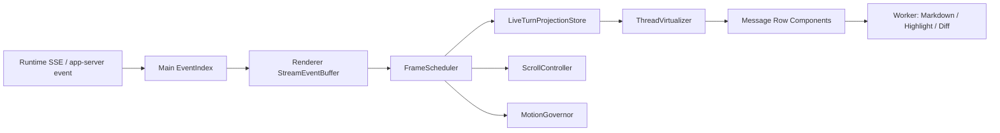

# analytix desktop architecture closure plan

> Status: Reference / historical migration and decision ledger. This document
> is not a direct source of current implementation truth. Start with
> `AGENTS.md`, `docs/analytix/README.md`, accepted specs `01` through `11` in
> `docs/analytix/specs/`, accepted scoped requirements in `openspec/specs/`,
> current code/tests, and fresh evidence.
> The 2026-08-26 Agent Platform target makes
> `docs/analytix/specs/11-agent-platform-brand-and-architecture.md` authoritative
> for current brand, one Go Agent Harness, Plugins and Privacy Layer ownership.
> Historical `/goal`, TypeScript-oracle, Go-shadow and stage-priority text below
> is preserved as a dated ledger and is not current controller guidance.
> Pre-rewrite Analytix commit identifiers cited by historical sections resolve
> through `docs/analytix/history-rewrite-provenance-2026-07-10.json`; upstream
> repository identifiers never use that local mapping.
>
> Current-readiness note (2026-07-10): this document began as a historical
> architecture audit of the former Kun codebase. Sections that describe `Kun`,
> `window.kunGui`, `agents.kun`, `kun serve`, old release paths, or old asset
> names are preserved as migration analysis and forbidden-current-state
> evidence, not as current analytix product identity. Numbered stage updates,
> including statements dated later than a completed cutover, preserve what a
> particular gate believed at that time; file order and date alone do not make
> them authoritative. When this ledger conflicts with accepted product or
> scoped requirements, or with the current worktree, report the drift and
> follow the active authority described in `docs/analytix/README.md`.
>
> 2026-07-02 governance note: upstream roles are default research lenses, not
> exclusive capability boundaries. Historical `reject`, forbidden-route, or
> absent-entry records mean "not approved in that batch/current surface"; they
> must not be read as permanent bans. Future analytix-native capabilities may
> compare all registered upstreams, current analytix, and later admitted
> sources, then absorb the strongest proven design through license/provenance
> admission, explicit specs, contracts, UX rationale, tests, desktop QA, and
> sovereignty scan updates.
>
> 2026-07-10 provenance correction: every older instruction to copy Codex
> Desktop code, extracted assets, prompts, chunks, icons, or binaries is
> superseded. CodexDesktop-Rebuild has no project-wide license at the reviewed
> commit and its `src/*` extracts are ignored/generated. Absent a recorded
> material-specific written authorization, it is clean-room behavior reference
> only. Older TypeScript executable rollback and five-source intake guidance is
> likewise superseded by the Go-only production boundary and nine-source
> manifest.
>
> 2026-07-11 active incident-hardening note: the unified OpenSpec change
> `case-evidence-publication-gate` is implementing signed AcceptedFinalV2
> authority, private/disposition persistence, boundary-only case history,
> authority-aware SSE/search/fork/resume/compaction projection, mandatory
> private-root denial, and committed-final rewind rejection. This is an active
> implementation slice, not P1 or release completion. The current follow-up
> adds canonical non-overlapping persistence roots, a two-pass strict raw-state
> scan, a hierarchical CLI/embedded-factory composite lease with frozen-root
> binding and case-insensitive alias keys, inventory-wide dry-run accepted-final
> event repair, atomic final-event bundle persistence before SSE, closed
> token-free READY, loopback-only insecure mode, cold-user ephemeral runtime
> authentication, and host-secret child-environment isolation. Semantic
> zero-mutation preflight across every legacy migration, deterministic recovery
> of unresolved private publication attempts, a non-replaceable long-running
> lease under same-user namespace tampering, trusted factual receipt
> rehydration, and signed legacy cutover inventory remain open. A newly exposed
> packaging P1 also showed that the ignored flat `runtime/` directory could put
> arm64 Rust data helpers into an x64 macOS package. The active fix replaces
> that path with a frozen four-component data-plane registry, explicit Cargo
> target triples, locked per-target stages, manifest schema v4 plus receipt schema v5,
> immutable source snapshots, frozen Rust 1.94.1, isolated `--frozen` Cargo
> targets, per-component effective-environment hashes, raw-build/signing-invariant
> payload receipts, strict executable parsing, live helper probes, and
> target-only Electron/Python resolution. The prior schema-v3 arm64/x64 build
> evidence is now deliberately stale; fresh v4-manifest/v5-receipt dual-architecture build,
> re-sign, post-sign, and package evidence is being regenerated. The earlier x64
> packaged-resource check stopped on the independently missing Analytix Computer
> Use macOS artifact and is not treated as current release proof.
> Windows/Linux native execution and a complete signed desktop package remain
> unverified; current code and fresh tests remain the implementation evidence.

## 0. 结论摘要

初始审计时，`/Users/sun/Projects/analytix` 是 former Kun `v0.2.13` 源码，项目技术栈是 `Electron + React + TypeScript + Zustand + bundled TypeScript runtime`。现有功能和样式不需要被删除或换皮，真正要升级的是高频聊天热路径、状态粒度、时间线渲染、Workbench 组件边界、运行时事件协议和资源体系。

2026-06-25 最终发布闭环更新：当前真实代码状态已进入 Go runtime
default。`src/main/runtime/analytix-adapter.ts` 在
`ANALYTIX_RUNTIME_BACKEND` 未设置，或设置为 `analytix` / `go` /
`go-runtime` / `go-runtime-default` 时解析为 `go-runtime-default`，并启动
`packages/runtime-go/cmd/runtime-server`。TypeScript runtime 不再是默认双轨；
当前 adapter 已将 `ANALYTIX_RUNTIME_BACKEND=typescript` 视为 retired backend 并拒绝启动。D-0248 严格
deterministic gate、D-0250C code-stage Reasonix absorption、Go deterministic
core 和 Reasonix code-stage absorption 已完成。D-0251/D-0252/D-0253 中的
provider/MCP/packaged/operator/soak evidence 只代表 post-cutover live
validation 与未来 fallback physical retirement 证据，不阻塞 Go runtime 默认
上线；缺少外部 provider API key、MCP 命令、packaged app runtime 或 operator
approval 不得再被写成 Go core cutover blocker。Reasonix 仍只作为
engine/runtime 强能力来源；Analytix/Kun 产品入口、UI、桌面体验、top-level
`runtime` settings、`window.analytix` bridge、多模型 provider、附件、多模态、
审批、user-input、MCP、goal/plan 等基线保持权威，未新增 Reasonix 顶级
Workflow/Create Loop/Subagent/AutoResearch/MCP-indexer 产品入口。

当前状态必须按证据类别拆开解读，不能把 fixture proof 写成 product parity：

| 类别 | 真实状态 | 边界 |
| --- | --- | --- |
| `fixtureProof` | D-024x/D-0250C deterministic/local proof 可作为回归证据 | 不等同于真实用户路径或 live provider/MCP parity。 |
| `codeAbsorbed` | Go provider endpoint 族、usage/cost、附件 payload、Reasonix 部分 engine 思路已吸收；provider usage 现在把 `priceConfigured` 贯穿 Go usage event 与 `/v1/usage`，renderer usage chip 对未配置 provider price 显示未配置，同时保留显式 0 价格配置 | MCP/tool 执行仍依赖真实 configured servers，不能用 D0244 fixture 代替。 |
| `productParity` | partial | 正常 `/v1/threads/{id}/turns` 已移除硬编码 `Ship`/`Choose direction` 假等待和 D0244/MCP lifecycle fixture timeline 事件；`/v1/runtime/tools` 已有 `analytix_prod` HTTP gate 证明空 production MCP 配置保持 unavailable/empty，且不暴露 `mcpLocalProof`、`contractProof`、`upstreamAbsorption`、fake、fixture 标记；MCP refresh 后 `/v1/runtime/info` capabilities 也已覆盖 configured production MCP availability、server/tool counts 与 tools surface 一致；完整 packaged/live parity 继续验证。 |
| `liveProviderParity` | partial | OpenAI-compatible、Anthropic messages、自定义 full endpoint request shape、stream parsing、usage parsing、DeepSeek-scoped cache telemetry、error handling 由当前 `scripts/runtime-go-live-validation.mjs` / `scripts/runtime-go-live-evidence-collector.mjs` gate 覆盖；真实外部 key/provider matrix 与 operator validation 仍是独立 release evidence。 |
| `packagedSoak` | partial | packaged native `runtime-go/bin/runtime-server` startup、D-0251 runtime health/thread/turn/SSE replay、本地 credentialed MCP HTTP list/call/reconnect/redaction、同轮 TypeScript rollback proof 及 rollback redaction proof、多轮 packaged runtime durable-restart/history/usage soak、packaged Electron `window.analytix` GUI bridge restart/health/runtime-info smoke 已有本地 physical-package 证据；当前重建的 macOS arm64 unpacked app 已通过 `npm run runtime:go:packaged-gui-smoke -- --json --gate`，且 `scripts/d0251-live-evidence-collector.mjs` 已把 GUI smoke 记录为 `packagedGui`、把多轮 packaged durable/history/usage/redaction soak 记录为 `packagedSoak` component/evidence path；D-0252 candidate readiness 必须验证 `packagedGui`、`packagedSoak` 与 packaged TypeScript rollback status/path/digest/redaction proof/operator review 全部 passed 后才允许 `go-runtime-default` candidate；旧包仍可能因旧 readiness 门槛阻塞；operator release review 仍是独立验收项。 |
| `rollbackRetired` | true for production adapter selection | 当前 adapter 已拒绝 `ANALYTIX_RUNTIME_BACKEND=typescript`；rollback-retirement evidence 仍是审计材料，不是当前生产启动说明。 |

下列 2026-06-23 D-0238 至 D-0243 记录保留为迁移历史和 gate 演进说明；其中
“TypeScript 仍默认”“Go 仍默认关闭”等阶段性表述已被上面的 2026-06-25 当前
结论覆盖，不能作为当前发布阻塞项解读。

packaged default startup canary 只验证 health、runtime info、thread
CRUD/resume/fork cleanup 以及 Go/proof route hidden；不得在启动门禁里创建
真实 model turn 或要求外部 provider 凭证。

2026-06-23 D-0238 更新：Electron main 的
`src/main/runtime/analytix-adapter.ts` 已建立 backend-neutral runtime gate。
TypeScript `analytix serve` 仍是默认 backend；Go 只能通过
`ANALYTIX_RUNTIME_BACKEND=go-conformance` 与
`ANALYTIX_GO_RUNTIME_CONFORMANCE=1` 的 internal/test/conformance gate 启动。
Go sidecar 支持 `--runtime-token`，main gate 会创建临时 durable root，并用
`/health`、`/v1/threads?limit=1`、`/v1/conformance/loop/boundary` 和
`/v1/runtime/go -> 404` 做 canary；失败则停止 Go、清理临时 durable 状态并
回退启动 TypeScript runtime。该阶段不改变 `window.analytix`、top-level
`runtime` settings、renderer/preload/main public contract 或 Kun-derived UI
入口，也不声明 G6/default Go backend/live provider superiority。

2026-06-23 D-0239 更新：`packages/runtime-go` 新增
`/v1/conformance/kernel/*` live-local kernel scaffold，使用
`go-kernel-live-scaffold-oracle.json` 汇总 D-0236 durable event sink、D-0237
minimal loop controller、G3 provider-aware cache accounting、G4
approval/user-input gate、MCP catalog recovery，以及 Reasonix
`internal/jobs` / `subagent_store` 吸收后的 job/sub-agent orchestration
fixture。该 scaffold 只作为 internal/test/conformance 证据，不执行 live job
或 subagent，不暴露 Reasonix SessionAPI/config/public routes，不新增
Workflow/Create Loop/Subagent/AutoResearch/MCP-indexer 顶级入口，不改变
renderer/preload/settings/UI contract，也不声明 G6。

2026-06-23 D-0240 更新：D-0239 kernel scaffold 新增
`/v1/conformance/kernel/g6-retirement-cleanup`，把 G6 前必须保留的
TypeScript runtime、main process supervisor、backend-neutral adapter，G6 后应
删除的 internal conformance gate、`/v1/conformance/*` fixture routes、
kernel/minimal-loop oracle、shadow-only G5 replay，以及禁止出现的 deprecated
bridge alias、duplicate settings schema、renderer-visible Go route、UI runtime
switcher、Reasonix public protocol 写入 executable fixture。该 proof 明确
`g6Ready:false`、`noImmediateProductionDelete:true`、`tsRuntimeRetained:true`
与 `presentForbiddenRedundancyCount:0`，所以它是去冗余计划证据，不是
TypeScript runtime retirement 或 Go default backend 切换。

2026-06-23 D-0241 更新：`packages/runtime-go` 新增
`/v1/internal/go-production-candidate/*` production-candidate parity slice。
该 slice 仍为 internal gate，默认关闭，需要
`ANALYTIX_RUNTIME_BACKEND=go-production-candidate` 与
`ANALYTIX_GO_RUNTIME_PRODUCTION_CANDIDATE=1` 才能由 main adapter 进入 canary。
Go 侧已从 fixture/scaffold 推进到 local fake live server 驱动的 provider
client、durable event/session replay、approval/user-input manager、fake MCP
manager、parent goal/thread lineage job manager 与 single-baseline cleanup
checklist。DeepSeek/OpenAI-compatible/Anthropic-compatible request shape、
stream parsing、usage/cache telemetry 和 DeepSeek prefix/cache 稳定性均通过
fake HTTP/SSE 测试覆盖；denied tool 不执行，submitted user input answer 不写
入 replay event。main canary 失败会停止 Go、清理 temp state 并回退 TypeScript
 runtime。D-0241 不改变 renderer/preload/main public contract、top-level
`runtime` settings、`window.analytix`、Kun-derived UI 入口或默认 backend。

2026-06-23 D-0242 更新：`packages/runtime-go` 新增真实 Go runtime
contract server binary：`cmd/runtime-server`。该 binary 不再只暴露
`/v1/internal/go-production-candidate/*` proof route，而是在
`go-runtime-candidate` internal gate 后提供 analytix runtime HTTP/SSE 子集：
`/health`、`/v1/runtime/info`、thread list/read/patch/fork、session
resume、thread events replay、turn create、approval decision 与 user-input
resolve。server 把 D-0241 的 fake live provider client、durable
event/session sink、approval/user-input manager、fake MCP manager、parent
goal/thread-bound job lineage 接入 turn contract；turn replay 可机器验证
provider usage/cache telemetry、DeepSeek prefix/cache 稳定性、answer-free
user-input replay、denied approval no-execute、MCP call result 与 job lineage。
Electron main 新增 `ANALYTIX_RUNTIME_BACKEND=go-runtime-candidate` +
`ANALYTIX_GO_RUNTIME_CANDIDATE=1` 的 gate，并用真实 contract endpoints 做
canary；失败仍停止 Go、清理 temp state、回退 TypeScript runtime。D-0242
仍默认关闭，不改变 `window.analytix`、renderer/preload/main public
contract、settings schema、Kun-derived UI 入口或默认 TypeScript backend。
D-0241 internal production-candidate proof route 中的 provider-live、
durable-replay、approval-user-input、mcp-manager 与 job-lineage 证明已被
D-0242 runtime server contract 覆盖，标记为 D-0242 后/G6 删除候选；保留
仅用于迁移期回归对照。

2026-06-25 packaged runtime 更新：开发态可继续通过 `go run -tags
analytix_prod ./cmd/runtime-server` 启动 Go runtime server；打包态不得依赖
用户机器的 Go toolchain 或随包 Go 源码。Electron `afterPack` 会为目标平台/
架构构建 production-tagged `runtime-server` 原生二进制到
`Resources/runtime-go/bin/`，主进程 packaged 路径只启动该二进制。

2026-06-29 更新：runtime-server 当前验证入口使用
`--runtime-durable-root`。retired candidate durable-root CLI alias 不再是
production/runtime-server 入口；残留 candidate durable-root API 仅限
non-`analytix_prod` compatibility tests。durable root drill 仍需验证
`events.jsonl`、`highestSeq`、thread/session replay、pending approval/user-input
恢复和 turn sequence 续接。`src/main/runtime/analytix-adapter.ts` 的 readiness
status，默认 `ready:false`；即使 `go-runtime-candidate` gate 打开，canary 也
必须看到 durable restart proof、credentialed provider matrix status、
credentialed MCP matrix status 与 packaged QA status 全部 passed，否则回退
TypeScript runtime。`packages/runtime-go/g6_readiness.go` 提供
DeepSeek、OpenAI-compatible、Anthropic-compatible、自定义 endpoint 的
provider matrix scaffold，真实凭证缺失时明确 skipped；DeepSeek cache
hit/prefix stability 有固定 benchmark record format。MCP matrix scaffold
包含 fake 必跑和 credentialed env-gated skip，覆盖 connect/search/call/
reconnect/approval/credential-redaction。`scripts/d0243-packaged-go-runtime-qa.mjs`
提供可执行 packaged desktop QA checklist，默认缺少外部 app/runtime 状态时
skipped，不当作 pass。D-0243 仍不改变 `window.analytix`、renderer/preload/
main public contract、settings schema、Kun-derived UI 入口或默认 TypeScript
backend；它只让 G6 前硬门槛可测、可回滚、可删除。

目标不是把 analytix 改成 Codex 的复制品，而是在保留现有 Code / Write / SDD / Connect phone / Plan / Preview / Terminal / Settings / MCP / Skills / 审批 / user-input / usage / 更新发布能力的基础上，借鉴 Codex Desktop 的体感架构：

- 多 feature chunk、壳层轻量化。
- App-server 风格的稳定协议边界。
- 更细粒度的 signal/query 状态模型。
- thread virtualizer。
- runtime worker / markdown worker / highlight worker。
- composer 输入与 streaming 渲染分离。
- 按帧调度和背压，而不是来多少 token 就同步渲染多少。
- 统一、可维护的图标资源 registry。

最重要的判断：丝滑体感优先来自 renderer 架构，而不是立刻引入 Rust。Rust 可以作为后续 native helper，用在 Windows sandbox、PTY、仓库索引、diff/tree-sitter、文件监控等 CPU 或 OS 边界，不应作为第一阶段 UI 重构的主线。

## 1. 本次分析范围和依据

分析的本地项目：

- analytix（原 Kun）源码：`/Users/sun/Projects/analytix`
- CodexDesktop-Rebuild：`/Users/sun/Projects/CodexDesktop-Rebuild`

初始审计时的 analytix 关键事实：

- 根包名仍是 `kun-gui`，产品名仍是 `Kun`。
- runtime 目录仍是 `kun/`，runtime 包名仍是 `kun`。
- preload 仍暴露 `window.kunGui`。
- Electron builder 仍输出 `Kun-*` artifact。
- 项目内约有 `363` 个文件包含 `Kun/kun/KUN_/kunGui/kun-` 命名面。
- `window.kunGui` 相关引用约 `411` 处。
- renderer 中 `useChatStore(...)` 约 `113` 处。
- renderer 中 `blocks/liveAssistant/liveReasoning` 相关引用约 `606` 处。

analytix 热路径文件体量：

| 文件 | 行数 | 现状判断 |
| --- | ---: | --- |
| `src/renderer/src/components/Workbench.tsx` | 2552 | 主工作台过重，承载路由、聊天、写作、SDD、Claw、预览、快捷键、布局协调 |
| `src/renderer/src/components/chat/FloatingComposer.tsx` | 2252 | composer 功能完整但边界过大，应拆 controller / view / attachments / command menu |
| `src/renderer/src/components/chat/MessageTimeline.tsx` | 571 | 有分页隐藏旧 turn，但还不是真正 virtualizer |
| `src/renderer/src/store/chat-store-runtime.ts` | 1162 | 高频 runtime event、blocks、live text、tool cards 都进入一个 store 更新面 |
| `src/renderer/src/agent/kun-runtime.ts` | 873 | renderer runtime adapter 过大，应协议 client 化 |
| `src/renderer/src/agent/kun-mapper.ts` | 1213 | event mapper 过大，应拆 runtime event -> transcript projection |
| `kun/src/loop/agent-loop.ts` | 2673 | agent loop 能力集中，后续需要阶段性拆 service，但不是丝滑体感第一瓶颈 |

CodexDesktop-Rebuild 关键事实：

- 它不是 OpenAI 官方完整桌面源码，而是把官方 app 包同步、提取 `_asar` 后重新打包的项目。
- 同步出的 Codex Desktop renderer 位于 `src/mac-arm64/_asar/webview/assets`。
- Codex webview 下约有 `1636` 个 JS chunk。
- 可见的 `composer` 相关 chunk 约 `15` 个，`thread` 相关 chunk 约 `37` 个，`app-server` 相关 chunk 约 `6` 个，worker asset 约 `4` 个。
- 存在 `thread-virtualizer-*`、`thread-scroll-layout-*`、`thread-scroll-controller-context-value-*`、`runtime.worker-*`、`app-server-manager-signals-*`、`persisted-signal-*`、`sidebar-thread-list-signals-*`、`use-composer-controller-*` 等编译后模块名。
- webview 中可直接找到的 `.svg` 文件很少，核心 Codex logo 多数以内联 SVG、PNG 或编译进 JS 的 React 组件形式存在。

## 2. 必须坚持的产品和工程原则

1. 不删除任何功能点。
2. 不换皮式重做 UI。
3. 保留现有界面风格、信息密度、布局逻辑和功能入口。
4. 所有重构都应通过 adapter / facade 控制风险，但最终不保留旧命名 alias。
5. 先改热路径，再改底层 runtime。
6. 先测量，再引入 Rust 或 native helper。
7. Windows、macOS、Linux 都是正式目标，必须建立三端验证链路。
8. CodexDesktop-Rebuild 资产已确认可用；迁移时仍应避免机械搬运，优先吸收更好的图标结构、阴影、动效和交互节奏。

## 3. 当前架构主要问题

### 3.1 高频 streaming 更新进入全局 chat store

当前流式文本路径大致是：

```text
kun serve SSE
  -> src/main/runtime-sse-ipc.ts
  -> src/preload/index.ts
  -> src/renderer/src/agent/kun-runtime.ts
  -> src/renderer/src/agent/kun-mapper.ts
  -> src/renderer/src/store/chat-store-runtime.ts
  -> useChatStore subscribers
  -> Workbench / MessageTimeline / Markdown / Tool cards
```

`runtime-sse-ipc.ts` 已经按 network chunk 批量 IPC，这是正确方向；`kun-mapper.ts` 也已把连续文本 delta 合并成一次 `sink.onDeltas`。但它们只解决了“每 token 一次 IPC/store update”的低层问题，没有解决 renderer 中更重的同步渲染链：

- `liveAssistant` 和 `liveReasoning` 是大字符串累加。
- 高频更新仍会进入 `useChatStore`。
- `Workbench.tsx` 订阅了 `blocks/liveAssistant/liveReasoning`。
- `MessageTimeline.tsx` 每次变化都要重新计算 turns、scroll key、visible turns。
- live Markdown 仍可能牵动 Streamdown、code block、link validation、file reference 等组件。

这就是中间聊天区域“不丝滑”的根因之一：不是某个函数特别慢，而是每一帧叠加了 store 更新、组件 memo 比较、timeline 分组、Markdown/代码块渲染、滚动定位。

### 3.2 时间线不是严格 virtualizer

`MessageTimeline` 当前通过 `TURN_PAGE_SIZE` 和 `AUTO_COLLAPSE_THRESHOLD` 隐藏早期 turn，这是有帮助的，但不是 Codex 风格的真正 virtualizer。

问题：

- 历史 turn 一旦展开，DOM 数量仍会增长。
- 复杂 tool card、review card、generated files panel、diff summary 仍可能挂载在同一条时间线里。
- variable height 和 bottom anchoring 没有独立 virtualizer 模型。
- scroll restore、jump rail、streaming bottom stickiness 混在组件逻辑里。

### 3.3 Workbench 过重

`Workbench.tsx` 同时负责：

- 顶层布局。
- route/mode 切换。
- Code/Write/SDD/Claw/Plan 协调。
- side panel。
- dev preview。
- keyboard shortcut。
- composer 操作。
- write/sdd draft sync。
- runtime banner。
- terminal/right panel lazy load。

这会让聊天 streaming 更新更容易影响非聊天区域。Codex 的结构更像 `AppShell -> ThreadShell -> ComposerIsland -> TimelineIsland -> SidePanelIsland`，每个 island 只订阅自己需要的信号。

### 3.4 FloatingComposer 功能完整但边界过大

`FloatingComposer.tsx` 体量超过 2200 行，包含输入、附件、模型选择、命令、快捷键、文件上下文、图片粘贴、执行配置等。composer 是体感最敏感区域，输入延迟必须永远优先于 streaming 渲染。

当前需要拆成：

- `ComposerController`
- `ComposerTextInput`
- `ComposerAttachments`
- `ComposerModelControls`
- `ComposerCommandMenu`
- `ComposerExecutionSettings`
- `ComposerFileContext`

拆分目标不是改样式，而是让输入框订阅最少状态，避免被时间线 streaming 拖慢。

### 3.5 命名面仍是 Kun

用户目标是把项目名称改为 `analytix`，项目内 `kun` 改为 `analytix`。这不是单纯替换字符串，原因是项目内存在多层命名：

- 品牌名：`Kun`
- npm package：`kun-gui`、`kun`
- runtime command：`kun serve`
- 目录：`kun/`
- TS 类型：`KunRuntimeProvider`、`KunGuiApi`
- IPC/world API：`window.kunGui`
- HTTP/runtime settings：`agents.kun`
- env：`KUN_*`
- artifact：`Kun-*.zip`、`Kun-*.exe`
- app data：`Application Support/Kun`
- docs/locales/README/release links
- compatibility key：旧 `DeepSeek-GUI`、`deepseekgui`、`agents.kun`

直接全局替换会破坏 release、构建配置、runtime 启动和功能引用。正确做法是分阶段重命名，但最终产物不保留旧命名 alias，也不保留旧数据迁移逻辑。

## 4. 目标架构

### 4.1 总体目标图

```text
Electron Main
  App lifecycle / windows / native services / runtime host
        |
        | preload typed bridge
        v
Renderer AppShell
  route shell only
        |
        +-- ThreadShell
        |     +-- ComposerIsland
        |     +-- VirtualTimelineIsland
        |     +-- SidePanelIsland
        |
        +-- WriteShell
        +-- SddShell
        +-- ConnectPhoneShell
        +-- SettingsShell

Runtime Boundary
  analytix app-server facade
        |
        +-- compatibility HTTP/SSE v1
        +-- JSON-RPC style method/notification model
        +-- event projection stream
        +-- bounded queues / backpressure

Workers
  timeline projection worker
  markdown/code highlight worker
  diff parse worker
```

### 4.2 renderer 状态目标

把一个大 `chat-store` 拆为多个 store/signal/query 层：

| 目标 store | 职责 | 高频程度 | 订阅者 |
| --- | --- | --- | --- |
| `threadIndexStore` | thread 列表、搜索、归档、当前 thread id | 中 | sidebar、route |
| `transcriptStore` | 已稳定的 blocks/items，normalized by id | 中低 | timeline virtualizer |
| `liveTurnStore` | 当前 streaming turn 的 delta、reasoning、status | 极高 | live message row only |
| `composerStore` | 输入框文本、附件、模型选择、执行设置 | 极高 | composer only |
| `panelStore` | right panel、preview、terminal、plan、diff tab | 中 | panel host |
| `settingsStore` | app settings、theme、font、provider | 低 | settings、shell |
| `runtimeConnectionStore` | runtime ready/error/reconnect | 中 | banners/status |

技术选型：

- 第一阶段可以继续用 Zustand，但必须拆 store，并使用 `subscribeWithSelector` / `useShallow` / vanilla store。
- 如果要更接近 Codex 的细粒度体感，可引入 signal 层，例如 `@preact/signals-react` 或自研 tiny signal，用在 `liveTurnStore`、sidebar row、connection state。
- query/cache 类请求可引入 TanStack Query，替代手写 fetch + global store 混合逻辑。

### 4.3 runtime 协议目标

保留当前 HTTP/SSE API 作为兼容面，同时新增 app-server 风格 facade：

```text
analytix app-server
  initialize
  thread/list
  thread/start
  thread/resume
  thread/fork
  thread/archive
  turn/start
  turn/steer
  turn/interrupt
  approval/resolve
  userInput/resolve
  usage/query

notifications
  thread/updated
  turn/started
  item/started
  item/delta
  item/completed
  tool/progress
  approval/requested
  userInput/requested
  usage/updated
  turn/completed
```

设计要求：

- 有初始化握手，客户端声明版本和 capabilities。
- JSON schema / TypeScript types 可生成。
- notification method 稳定，不让 renderer 猜 runtime 原始事件。
- 支持 bounded queue，UI 忙时丢弃可重建的中间 projection，不丢最终事件。
- 保留 `since_seq` / replay 能力。
- 支持将当前 HTTP/SSE `/v1/*` 路由映射到新 facade，避免一次性迁移所有 UI。

注意：这里不要求立刻照搬 Codex 的 app-server 实现。第一步可以在 TypeScript runtime 内做 `analytix app-server facade`，等稳定后再决定是否 Rust 化。

### 4.4 timeline 渲染目标

引入真正 virtualized timeline：

- 每个 turn/block 有 stable id。
- transcript 是 normalized data：`byId + order`。
- live turn 单独渲染，不进入历史 blocks 数组。
- variable height measurement。
- bottom anchoring 独立于 React rerender。
- 历史展开不挂载全部 DOM。
- tool card / diff / review / generated files 详情默认 lazy mount。
- timeline jump rail 从 virtualizer index 读取，而不是扫描全部 mounted DOM。

推荐库：

- `@tanstack/react-virtual`，优先。
- 若需要极致控制，可自研 `ThreadVirtualizer`，但要有 Playwright 性能测试兜底。

### 4.5 Markdown / code / diff 目标

把重渲染从主线程移走：

- Markdown block cache：`blockId + contentHash -> parsed tree/render model`。
- live streaming 期间使用轻量 Markdown 或 plain text progressive renderer。
- turn completed 后再升级为完整 Streamdown render。
- Shiki highlight 移到 worker 或 idle queue。
- 大代码块先 fallback HTML，再 idle highlight。
- diff parse 移到 worker。
- file reference validation 做缓存，不在每次文本 delta 时重复校验。

### 4.6 composer 目标

composer 必须独立成高优先级交互岛：

- 输入框不订阅 timeline blocks。
- 输入变化不触发 Workbench rerender。
- 发送消息时只提交 snapshot。
- slash command / file mention / attachment list 用局部 store。
- 大文件索引、目录展开、图片处理走 worker 或 main service。
- streaming 期间 composer 输入仍保持 60fps。

### 4.7 Workbench 目标

将 `Workbench.tsx` 拆成：

```text
src/renderer/src/workbench/
  WorkbenchShell.tsx
  routes/
    ChatRoute.tsx
    WriteRoute.tsx
    SddRoute.tsx
    ConnectPhoneRoute.tsx
    SettingsRoute.tsx
  layout/
    AppTopBar.tsx
    LeftSidebarHost.tsx
    RightPanelHost.tsx
    BottomPanelHost.tsx
  controllers/
    useWorkbenchCommands.ts
    useWorkbenchShortcuts.ts
    useRouteState.ts
```

保持视觉不变，但壳层只关心布局和 route。聊天内容由 `ThreadShell` 承载，写作由 `WriteShell` 承载，SDD 由 `SddShell` 承载。

## 5. 项目命名迁移方案：Kun -> analytix

### 5.1 命名迁移原则

1. 外部品牌先改，内部兼容后改。
2. 新名称统一用：
   - 产品名：`analytix`
   - npm package：`analytix-desktop`
   - runtime package：`analytix-runtime`
   - CLI：`analytix`
   - preload API：`window.analytix`
   - settings key：`agents.analytix`
   - env prefix：`ANALYTIX_*`
3. 旧名称不保留兼容 alias：
   - `window.kunGui` -> 移除，改为 `window.analytix`
   - `agents.kun` -> 移除，改为 `agents.analytix`
   - `KUN_*` -> 移除，改为 `ANALYTIX_*`
   - `kun serve` -> 移除，改为 `analytix serve`
   - old data dirs -> one-time migration

### 5.2 分层迁移清单

| 层 | 当前 | 目标 | 策略 |
| --- | --- | --- | --- |
| App product | `Kun` | `analytix` | `package.json`、builder、locale、README、release notes |
| Root package | `kun-gui` | `analytix-desktop` | 先改 package name，lockfile 随 `npm install` 更新 |
| Runtime dir | `kun/` | `runtime/` 或 `analytix-runtime/` | 推荐先改 package name，再阶段性移动目录 |
| Runtime package | `kun` | `analytix-runtime` | 只保留 `bin.analytix`，不提供旧 CLI alias |
| CLI | `kun serve` | `analytix serve` | CLI parser 只接受新命令和新 usage 文案 |
| Preload API | `window.kunGui` | `window.analytix` | 只暴露新 bridge，不保留旧 bridge alias |
| IPC namespace | `kun:*` | `analytix:*` | 主进程只注册新 channel |
| Settings | `agents.kun` | `agents.analytix` | 新 schema，不读旧写新 |
| Env | `KUN_*` | `ANALYTIX_*` | 只支持 `ANALYTIX_*` |
| Artifact | `Kun-*` | `analytix-*` | builder artifactName / scripts / publish patterns |
| Data dir | `~/.deepseekgui/kun`、`Application Support/Kun` | `~/.analytix/runtime`、`Application Support/analytix` | 新数据线，不首启迁移 |
| Docs | `Kun` / `kun` | `analytix` | docs、README、AGENTS 更新 |

### 5.3 不应盲目替换的词

以下名称不应机械替换：

- `DeepSeek`：它是 provider 名，不是 Kun 品牌。
- `claw`：Connect phone 的内部兼容命名，需单独评估。
- GitHub 历史链接、release 旧链接：可保留迁移说明，不一定全删。
- 旧 settings migration 中的历史 key：必须保留读取能力。
- 数据库/JSONL 中已持久化的旧 thread metadata：通过 migration 转换，不直接改用户文件。

## 6. 按 Codex Desktop 借鉴的具体调整点

### 6.1 可以直接借鉴的架构模式

| Codex Desktop 可见模式 | analytix 调整 |
| --- | --- |
| `app-server-*` chunk 和 app-server protocol | 增加 `analytix app-server facade`，把 HTTP/SSE 原始事件封装成 typed methods / notifications |
| `thread-virtualizer-*` | 引入 `ThreadVirtualizer`，替换目前“隐藏早期 turn”的半虚拟方案 |
| `thread-scroll-layout-*` / `thread-scroll-controller-*` | 抽出 `ThreadScrollController`，独立处理 bottom anchoring、prepend restore、jump rail |
| `use-composer-controller-*` / `composer-controller-*` | 把 `FloatingComposer` 拆为 controller + view，输入框不受 streaming 更新影响 |
| `app-server-manager-signals-*` / `persisted-signal-*` | 用 signal 或拆分 Zustand store，让细粒度状态单独更新 |
| `runtime.worker-*` | 增加 worker 层做 projection、Markdown/code/diff 重任务 |
| 大量 route / feature chunks | 拆 Workbench，按 Code/Write/SDD/Settings/Panel lazy import |

### 6.2 不建议照搬的点

- 不建议直接把 analytix 改成 CodexDesktop-Rebuild 的打包方式。该项目是重建官方包，不是面向二开维护的完整源码结构。
- 不建议直接复制 OpenAI/Codex 商标资产作为 analytix app icon。技术上可替换，发布前要解决授权和品牌风险。
- 不建议立刻把整个 runtime 改 Rust。先用 TypeScript facade 和 renderer 重构拿到 80% 体感收益。
- 不建议删除 Kun 原有需求驱动、Write、SDD、Connect phone、低成本 provider 等功能。Codex 体感可以学，产品定位不用丢。

## 7. 图标与 SVG 迁移方案

### 7.1 现实情况

CodexDesktop-Rebuild 的 webview 中可直接找到的 `.svg` 很少，主要包括：

- `webview/assets/dots-*.svg`
- `webview/assets/android_dots-*.svg`
- `webview/assets/corners-*.svg`
- `webview/apps/webstorm.svg`

核心 Codex logo 在 `webview/index.html` 中是内联 SVG / mask-image，另有 `icon-codex-light.png`、`icon-codex-dark.png`、`icon.png`、`icon.icns` 等 PNG/ICNS 资源。大量 UI 图标是编译进 JS chunk 的 React SVG 组件，例如 `file-*`、`folder-*`、`copy-*`、`markdown-*`、`chat-*`、`settings.cog-*` 等。

因此“全面改为 CodexDesktop 的 SVG 对应元素”不能理解为“直接拷贝一堆 `.svg` 文件”。正确做法是建立图标 registry：

```text
src/renderer/src/icons/
  analytix-icon-registry.tsx
  codex-compatible-icons.tsx
  icon-types.ts
  Icon.tsx

src/asset/codex-reference/
  extracted/
  README.md
```

### 7.2 图标替换步骤

1. 盘点 analytix 当前图标来源：
   - `lucide-react`
   - 自定义 SVG
   - PNG app asset
   - CSS mask
   - plugin icon
   - provider logo

2. 建立语义 icon map：

```ts
type AnalytixIconName =
  | 'send'
  | 'stop'
  | 'copy'
  | 'file'
  | 'folder'
  | 'diff'
  | 'terminal'
  | 'settings'
  | 'thread'
  | 'composer'
  | 'approval'
```

3. 从 CodexDesktop-Rebuild 中抽取可合法使用的 SVG path / mask / PNG：
   - 只抽取和功能语义匹配的图标。
   - 不在运行时引用 `/Users/sun/Projects/CodexDesktop-Rebuild/...` 绝对路径。
   - 拷贝到 analytix repo 内受控目录。
   - 记录来源、hash、用途、授权状态。

4. 所有组件改用 `<Icon name="..." />`：
   - UI 组件不直接 import 某个 Codex chunk。
   - 未来换图标只改 registry。
   - 保持尺寸、stroke、fill、currentColor、accessibility 一致。

5. app icon 单独处理：
   - `src/asset/img/kun.png`
   - `src/asset/img/kun_mac.png`
   - `src/asset/img/kun_tray.png`
   - `electron-builder.config.cjs` icon 配置
   - Windows `.ico`、macOS `.icns`、Linux PNG

### 7.3 图标迁移注意事项

- 如果目标是“Codex 体感”，优先学习图标尺寸、对齐、currentColor、hover state、pressed state、tooltip，而不是照搬品牌图形。
- 若直接使用 Codex/OpenAI logo 或高度识别性的图形，应作为内部测试资源，发布前替换为 analytix 自有视觉。
- 图标迁移必须配合视觉回归截图，防止按钮尺寸抖动、文本挤压、Retina 模糊。

## 8. Rust / native helper 取舍

### 8.1 不需要 Rust 的部分

以下问题用 React/Electron 架构就能解决：

- 聊天 streaming 不丝滑。
- composer 输入延迟。
- timeline DOM 过多。
- Markdown/code block 渲染重。
- Workbench 大组件重渲染。
- Zustand 订阅面过大。

### 8.2 适合 Rust 的部分

后续如果 profiling 证明需要，可以用 Rust 做：

- Windows native sandbox / ACL / process isolation。
- ConPTY wrapper 或更稳的 PTY 会话管理。
- repo indexer：ripgrep、ignore parser、file watching、symbol index。
- tree-sitter parse / diff parse / large patch analysis。
- app-server 核心协议层，提供 JSON-RPC、bounded queues、schema generation。
- 大型本地数据处理。

### 8.3 推荐路线

第一阶段不要 Rust 化 UI，也不要把 Electron 换 Tauri。Electron + React 已能达到目标体感。Rust 应作为 `packages/native-*` 或 `crates/analytix-*` 的 isolated helper，而不是重写整个桌面端。

## 9. 详细分阶段实施路线

### Phase 0：基线与防护

目标：建立“不能删功能、不能退化样式、能证明变快”的基线。

任务：

- 新增性能脚本：
  - 长会话 100 turns。
  - 10k token streaming。
  - 100 个 tool cards。
  - 大 diff。
  - composer 连续输入。
- Playwright/Electron trace：
  - input latency。
  - long task。
  - FPS。
  - timeline node count。
  - commit count。
- 加 `performance.mark`：
  - SSE received。
  - event mapped。
  - store updated。
  - live row rendered。
  - markdown completed。
- 冻结 UI 截图 baseline：
  - chat empty。
  - chat streaming。
  - long thread。
  - tool approval。
  - Write。
  - SDD。
  - Settings。
  - Connect phone。

验收：

- `npm run typecheck`
- `npm test`
- `git diff --check`
- baseline trace 可复现。

### Phase 1：analytix 命名重制第一阶段

目标：建立 analytix 新命名骨架，应用身份、构建产物、runtime 命令、preload API、settings schema 全部切到新结构；不保留旧命名 alias。

任务：

- `package.json`
  - `name: "analytix-desktop"`
  - `productName: "analytix"`
  - description 改为 analytix。
- `electron-builder.config.cjs`
  - `productName: "analytix"`
  - artifactName 改为 `analytix-${version}-${os}-${arch}.${ext}`。
  - icon 指向 analytix 资产。
  - env 只使用 `ANALYTIX_*`。
- `src/shared`
  - 新增 `analytix-gui-api.ts`，移除旧命名 API 类型。
- preload
  - 新增 `window.analytix`。
  - 不暴露旧 bridge alias。
- settings schema
  - `agents.kun` -> `agents.analytix`。
  - 新 schema 只读写 `agents.analytix`。
- 文案
  - 用户可见 `Kun` 改为 `analytix`。
  - provider `DeepSeek` 不改。

验收：

- 全新配置能创建、保存和重启后恢复。
- 新配置不再写 `agents.kun`。
- `window.analytix` 是唯一 renderer bridge。

### Phase 2：事件消费按帧调度

目标：不改 UI 样式，先让 streaming 不再压垮主线程。

任务：

- 新增：

```text
src/renderer/src/runtime-stream/
  EventBuffer.ts
  FrameScheduler.ts
  LiveTurnStore.ts
  event-priority.ts
```

- `kun-runtime.ts` 收到 SSE batch 后先进 `EventBuffer`。
- `FrameScheduler` 每帧 flush：
  - 文本 delta 合并。
  - 非紧急事件用 `startTransition`。
  - user input / approval / completion 事件立即处理。
  - backlog 超阈值时分片消费。
- live 文本进入 `liveTurnStore`，不直接更新全局 `blocks`。
- `chat-store-runtime.ts` 只处理稳定事件和 turn boundary。

验收：

- streaming 中 composer 输入无明显延迟。
- 单帧 event flush 不超过预算。
- 断线重连、since_seq replay 不丢事件。

### Phase 3：拆 chat store 和 transcript projection

目标：让历史 transcript、live turn、thread list、composer 分离。

任务：

- 建立 normalized transcript：

```ts
type TranscriptState = {
  order: string[]
  byId: Record<string, ChatBlock>
  turnOrder: string[]
  blockToTurn: Record<string, string>
}
```

- `kun-mapper.ts` 拆分：

```text
src/renderer/src/runtime-events/
  mapRuntimeEvent.ts
  applyTranscriptProjection.ts
  applyLiveTurnDelta.ts
  runtime-event-types.ts
```

- `blocks: ChatBlock[]` 改为 selector 输出，而不是主存储结构。
- 旧组件先通过 compatibility selector 继续拿 `blocks`，逐步迁移。

验收：

- 所有旧 UI 功能可用。
- 单个 live delta 只触发 live row 相关订阅。
- thread list/sidebar 不因 streaming 每帧 rerender。

### Phase 4：Thread virtualizer

目标：长会话和复杂工具卡不再导致 DOM/布局爆炸。

任务：

- 引入 `@tanstack/react-virtual`。
- 新增：

```text
src/renderer/src/components/thread/
  ThreadTimelineVirtualizer.tsx
  ThreadScrollController.ts
  TurnVirtualRow.tsx
  LiveTurnRow.tsx
  TimelineJumpRail.tsx
```

- `MessageTimeline.tsx` 变为 thin adapter 或被替换。
- 保留现有样式 class 和视觉结构。
- tool card / review / generated files / diff 详情 lazy mount。
- bottom anchoring 和 prepend restore 由 `ThreadScrollController` 管理。

验收：

- 100 turns 以上 DOM 数量稳定。
- 展开历史不造成整页重排。
- streaming 到底部稳定，不出现跳动。

### Phase 5：Markdown/code/diff worker 化

目标：主线程不再被 Markdown、Shiki、diff parse 抢帧。

任务：

- 新增 workers：

```text
src/renderer/src/workers/
  markdown.worker.ts
  code-highlight.worker.ts
  diff.worker.ts
```

- `StreamdownAssistant` 拆为：
  - live lightweight renderer。
  - stable markdown renderer。
  - cached rendered block。
- `StreamdownCode` highlight 改 worker/idle。
- 大 code block 完成前使用 fallback render。

验收：

- 大代码块出现时 composer 仍可输入。
- 大 diff 打开不阻塞 timeline scroll。
- Markdown 完成后视觉与旧样式一致。

### Phase 6：Workbench / Composer 岛屿化

目标：主壳层轻，输入区和聊天区互不拖累。

任务：

- `Workbench.tsx` 拆为 `WorkbenchShell`。
- `FloatingComposer.tsx` 拆 controller/view。
- route 级 lazy chunks：
  - Chat。
  - Write。
  - SDD。
  - Connect phone。
  - Settings。
  - Plugin marketplace。
  - Terminal。
  - Preview。
- 把 keyboard shortcuts、route state、layout state 单独 hook 化。

验收：

- route 切换不加载无关大模块。
- streaming 不触发 Write/SDD 组件 rerender。
- composer commit count 明显下降。

### Phase 7：analytix app-server facade

目标：向 Codex app-server 体验靠拢，但不破坏现有 HTTP/SSE。

任务：

- runtime 增加 `app-server` 入口：

```text
analytix app-server --listen stdio://
analytix app-server --listen ws://127.0.0.1:<port>
```

- 新增协议包：

```text
packages/app-server-protocol/
  schema/
  generated/
  src/
```

- 主进程通过 app-server client 连接 runtime。
- 旧 `runtimeRequestViaHost` 继续保留。
- renderer 消费 app-server notifications，不直接关心 raw runtime events。

验收：

- HTTP/SSE 和 app-server 两条路径输出等价 transcript。
- bounded queue 在压力下不会拖死 renderer。
- app-server schema 可生成 TypeScript 类型。

### Phase 8：图标和视觉资源 registry

目标：系统性替换图标，不散落改组件。

任务：

- 建立 `Icon` 组件和 `AnalytixIconName`。
- 盘点所有 `lucide-react` import。
- 将 CodexDesktop-Rebuild 中可用 SVG/PNG 抽取到 repo 内。
- 建立 source manifest：

```text
src/asset/codex-reference/manifest.json
```

- 替换 UI 中按钮、toolbar、side panel、thread actions、composer actions 图标。
- app icon 单独生成 `.png/.icns/.ico`。

验收：

- 所有 icon 尺寸稳定。
- Retina 不糊。
- hover/active/disabled state 一致。
- 截图对比不出现布局漂移。

### Phase 9：Windows-first native polish

目标：面向 Windows 用户群体验稳定。

任务：

- Windows 11 真机测试。
- PowerShell / CMD / Git Bash / WSL path 测试。
- `node-pty` / ConPTY 稳定性测试。
- NSIS installer、shortcut、uninstall display name 改为 analytix。
- app data migration。
- GPU acceleration、font rendering、window controls、drag region 验证。
- 如 profiling 证明必要，再引入 Rust helper。

验收：

- `npm run dist:win`。
- 安装、启动、更新、卸载路径正常。
- runtime 能启动、停止、恢复。
- 大会话 streaming 体感接近 Codex。

## 10. 文件级调整建议

### 10.1 第一批必须动的文件

| 文件/目录 | 调整 |
| --- | --- |
| `package.json` | 改 package/product/scripts 名称，使用 `build:runtime`，移除 `build:kun` |
| `electron-builder.config.cjs` | productName、artifactName、icon、env prefix、publish pattern |
| `src/preload/index.ts` | 新增 `window.analytix`，移除旧 bridge |
| `src/preload/index.d.ts` | 新增类型声明 |
| `src/shared/kun-gui-api.ts` | 迁移为 `analytix-gui-api.ts`，移除旧命名文件 |
| `src/main/runtime/kun-adapter.ts` | 迁移为 `analytix-adapter.ts`，移除旧命名 wrapper |
| `src/main/runtime-sse-ipc.ts` | 统一到 analytix runtime/channel 命名 |
| `src/renderer/src/agent/kun-runtime.ts` | 拆为 protocol client + compatibility provider |
| `src/renderer/src/agent/kun-mapper.ts` | 拆 projection 层 |
| `src/renderer/src/store/chat-store.ts` | 拆 store |
| `src/renderer/src/components/Workbench.tsx` | 拆 shell/routes/islands |
| `src/renderer/src/components/chat/FloatingComposer.tsx` | 拆 controller/view |
| `src/renderer/src/components/chat/MessageTimeline.tsx` | 替换为 virtualizer |
| `kun/package.json` | 改 `analytix-runtime`，bin 增加 `analytix` |
| `kun/src/cli/*` | CLI usage 和 alias |
| `kun/src/server/routes/events.ts` | 后续增加 projection/coalesced stream |

### 10.2 第二批命名和文档文件

| 文件/目录 | 调整 |
| --- | --- |
| `README.md` | Kun -> analytix，保留历史迁移说明 |
| `AGENTS.md` | 项目事实更新为 analytix |
| `docs/AGENTS.md` | runtime ID 改 `analytix`，旧 `kun` 作为 migration key |
| 旧架构文档 | 移入 `docs/legacy/kun/`，不再作为当前 docs 根架构入口 |
| `scripts/*release*` | artifact pattern、release name、env prefix |
| `scripts/publish-r2.mjs` | PRODUCT_NAME、asset pattern、GitHub release URL |
| `scripts/zip-mac-app.cjs` | appName/artifactName |
| `scripts/generate-mac-latest.cjs` | artifact regex |
| `.github/workflows/*` | artifact name、release env |
| `src/renderer/src/locales/*` | 用户可见文案 |

## 11. 功能保留矩阵

| 功能 | 保留方式 | 重构关注点 |
| --- | --- | --- |
| Code chat | 保留 | streaming 从全局 store 移到 liveTurnStore |
| Write workspace | 保留 | route lazy，写作 store 独立 |
| SDD | 保留 | route lazy，草稿 store 独立 |
| Connect phone | 保留 | 内部 `claw` 兼容评估，不盲目替换 |
| Plan panel | 保留 | right panel island |
| Terminal | 保留 | lazy mount，输出虚拟化 |
| Dev preview / browser | 保留 | side panel lazy |
| MCP / Skills | 保留 | runtime protocol 事件化，不进 Workbench 主组件 |
| Approvals | 保留 | urgent event，绕过普通 frame backlog |
| request_user_input | 保留 | urgent event，gate 状态独立 |
| Usage | 保留 | query store / cached selectors |
| Settings | 保留 | `agents.analytix` migration |
| Auto update / release | 保留 | artifact、appId、data migration 谨慎处理 |

## 12. 性能目标

| 场景 | 目标 |
| --- | --- |
| composer 连续输入 | 无明显卡顿，输入响应优先级最高 |
| streaming 10k tokens | 主线程 long task 显著减少，delta 按帧合并 |
| 100 turns 长会话 | DOM node count 稳定，滚动无明显掉帧 |
| 100 tool cards | 默认摘要不挂载全部详情 |
| 大代码块 | fallback 立即显示，highlight idle/worker 完成 |
| 大 diff | parse worker 化，展开才渲染 |
| Windows 真机 | PowerShell/ConPTY/路径/字体/窗口控制全部冒烟 |

## 13. 测试与验收体系

基础命令：

```bash
npm run typecheck
npm test
npm run build
npm run lint
git diff --check
```

重构后新增：

```bash
npm run test:perf
npm run test:e2e
npm run test:e2e:electron
npm run test:windows-smoke
```

建议新增测试文件：

```text
src/renderer/src/runtime-stream/EventBuffer.test.ts
src/renderer/src/runtime-stream/FrameScheduler.test.ts
src/renderer/src/store/live-turn-store.test.ts
src/renderer/src/components/thread/ThreadTimelineVirtualizer.test.tsx
src/renderer/src/icons/icon-registry.test.tsx
src/main/settings-schema-analytix.test.ts
analytix/src/cli/analytix-cli.test.ts
```

手动冒烟：

1. 全新 analytix 配置启动，按新 schema 创建 userData、settings、threads、logs。
2. 新建 Code thread，streaming、interrupt、approval 正常。
3. 发送大量输出，composer 可继续输入。
4. 展开历史、跳转 turn、折叠历史正常。
5. Write inline completion 正常。
6. SDD draft 正常。
7. Connect phone task 正常。
8. Terminal 正常。
9. Settings 只显示 analytix runtime 配置。
10. Windows 安装包启动、卸载、重启后数据仍在。

## 14. 主要风险

1. 全局替换 `kun` 破坏功能引用。
   - 应对：先建立功能矩阵和旧名扫描规则，按层替换；最终不保留旧 alias 或旧数据迁移逻辑。

2. Codex 资产授权风险。
   - 应对：建立 manifest，区分参考资产、可用资产、自有重绘资产。

3. store 拆分导致功能回归。
   - 应对：compatibility selector，让旧组件先工作，再逐步迁移。

4. virtualizer 破坏底部吸附和历史展开。
   - 应对：先为 scroll controller 写测试，再替换 UI。

5. worker 化导致闪烁或顺序错乱。
   - 应对：render model 带 version/contentHash，过期结果丢弃。

6. Windows、macOS、Linux 行为不一致。
   - 应对：三端都作为发布门槛，分别覆盖安装、窗口、托盘、通知、终端和文件打开。

## 15. 推荐执行顺序

最稳的顺序：

1. Phase 0：性能基线。
2. Phase 1：analytix 品牌/命名第一阶段。
3. Phase 2：streaming frame scheduler。
4. Phase 3：store 拆分和 transcript projection。
5. Phase 4：thread virtualizer。
6. Phase 5：Markdown/code/diff worker。
7. Phase 6：Workbench/Composer 岛屿化。
8. Phase 8：图标 registry 和视觉资源迁移。
9. Phase 7：app-server facade。
10. Phase 9：Rust/native helper 与 Windows polish。

其中 Phase 7 可以和 Phase 4/5 并行设计，但不建议先做。因为用户体感最直接的瓶颈在 renderer；先把 UI 热路径打通，app-server facade 才能承接更干净的事件模型。

## 16. 最小可落地版本（MVP）

如果只做一轮最小升级，建议包含：

- 外部产品名、包名、runtime 命令、IPC、settings schema 全部改为 `analytix`。
- `window.analytix` 是唯一 renderer bridge。
- `liveTurnStore` + `FrameScheduler`。
- `MessageTimeline` 引入 virtualizer。
- `FloatingComposer` 拆出 controller。
- icon registry 建立，但不急着替换全部图标。
- 性能 trace 和截图基线。

这轮完成后，即使 runtime 仍是 TypeScript、协议仍是 HTTP/SSE，聊天中间区域的体感也会明显接近 Codex Desktop。

## 17. 完成定义

重构不能以“代码已经拆了”为完成标准，必须满足：

- 所有原有功能入口仍存在。
- 视觉截图无非预期差异。
- 全新 analytix 数据 schema 能完整创建、读写、备份和清理。
- 新落盘不再写旧项目主命名。
- streaming 中 composer 输入不卡。
- 长会话滚动稳定。
- tool card / code block / diff 不阻塞主线程。
- Windows 真机可用。
- 性能 trace 证明 long task、rerender、DOM 数量下降。

达到这些条件后，analytix 才算从“Kun 改名版本”升级成“架构上接近 Codex Desktop 体感的 analytix 桌面端”。

## 18. 二次源码审计：问题、隐患和修正结论

本次继续审计 `/Users/sun/Projects/analytix` 后，结论需要比第一版更明确：

- analytix 当前不是“版本低导致不丝滑”的单点问题，而是 renderer 热路径、状态模型、事件投影、命名兼容、后台任务和桌面壳边界共同造成的体感差距。
- 现有代码已经有一些正确优化，例如 SSE IPC 批处理、`MemoMessageTurn`、历史分页、主窗口 sandbox、webview 白名单、`kun serve` 的 event log。这些要保留，不应推倒重写。
- 真正要向 Codex Desktop 体感靠近，优先改 renderer 和事件投影，其次改 backend event index，再考虑 app-server facade 和 native helper。
- 不建议先大规模改名或替换图标。命名和图标是产品层，聊天丝滑是架构层。先做性能基线和热路径隔离，再做可见品牌迁移。

### 18.1 命名迁移风险高于第一版估计

源码显示 Kun 命名不是单纯 UI 文案：

- `src/main/app-identity.ts` 明确说明 `appId` 不建议随品牌升级修改，因为 macOS 更新签名、NSIS 升级 GUID、Windows 通知和任务栏分组依赖它。
- `src/main/index.ts` 继续固定 `APP_USER_MODEL_ID = 'com.xingyuzhong.deepseekgui'`。
- `electron-builder.config.cjs` 仍包含 `appId: 'com.xingyuzhong.deepseekgui'`、`productName: 'Kun'`、`artifactName: 'Kun-*'`、R2 release prefix、asarUnpack 的 `kun/` 路径、Windows shortcut/uninstall 名称。
- `src/shared/app-settings-kun.ts`、`src/shared/app-settings.ts`、`src/main/index.ts` 和 IPC schema 都围绕 `agents.kun`。
- 项目内 `AGENTS.md` 和 `docs/AGENTS.md` 明确要求 saved settings 只能包含 `agents.kun`，旧 provider 只能在 migration 中折叠到 `agents.kun`。

因此命名要分三层处理：

1. 外部产品层：窗口标题、菜单、托盘、安装器、图标、文案全部改为 `analytix`。
2. 协议和工程层：`window.kunGui`、`agents.kun`、`kun serve`、`kun/` 包名全部迁移为 analytix 命名。
3. 新命名层：新增 `window.analytix`、`agents.analytix`、`ANALYTIX_*` env、`analytixRuntimeSettings`，不读旧写新，不做双写，不保留旧 alias。

采用方案 B 后，新 `appId`、新数据目录和新 runtime 命令都属于目标形态。需要明确：

- 旧用户自动更新链路会断。
- Windows AppUserModelID、通知、任务栏分组、卸载注册表会变化。
- macOS userData、TCC 权限、登录项、自动更新签名校验都有迁移风险。
- 不提供数据导入向导或自动迁移，验收重点改为全新 analytix 数据线和三端安装链路。

建议默认发布线：直接启用 clean analytix app identity，旧版本只作为历史项目，不进入新版本兼容链路。

### 18.2 renderer 全局 store 是中间聊天区不丝滑的核心风险

当前主界面在 `src/renderer/src/components/Workbench.tsx` 中一次性订阅大量 `useChatStore` 字段，包括 `threads`、`blocks`、`liveReasoning`、`liveAssistant`、`busy`、route、side panel、composer、runtime 状态等。即使用了 `useShallow`，只要 `liveAssistant` 或 `liveReasoning` 高频变化，上层 `Workbench` 仍容易重新计算大量派生状态，再传给 `MessageTimeline`、`FloatingComposer`、右侧面板、顶部栏等。

`MessageTimeline` 内又执行：

- `groupTurns(blocks)` 按全部 blocks 分组。
- `scrollContentKey` 包含 `live.length` 和 `liveReasoning.length`。
- `useTimelineScroll` 在 contentKey 变化时 `requestAnimationFrame` 后 `scrollIntoView`。
- `MessageTurn` 内 `deriveTurnSections`、`groupProcessSections`、review plan、diff/file change 派生都依赖 turn/block 引用。

这说明现有优化只做到“组件级 memo”，还没有做到 Codex 式的“投影级增量更新”。目标应是：

- 高频 token 不进入全局大 store。
- 当前 live turn 使用独立 `liveTurnStore` 或 signal store。
- 历史 transcript 使用不可变 projection，按 turnId/blockId 建索引。
- UI 只订阅自己需要的最小片段。
- composer、topbar、side panels 不因 token streaming 重新渲染。

推荐新结构：

```text
Runtime SSE
  -> EventBuffer
  -> FrameScheduler
  -> TranscriptProjectionStore
       - threadMeta
       - turnIndex
       - blockIndex
       - liveTurn
       - derivedArtifacts
  -> UI selectors by id
```

### 18.3 当前已有“批量事件”但缺“帧调度”

`src/main/runtime-sse-ipc.ts` 已经把同一网络 chunk 内的 SSE event 聚合成一个 IPC：`runtime:sse-event` payload 是 `{ streamId, events: batch }`。

`src/renderer/src/agent/kun-mapper.ts` 也已经把连续 `assistant_text_delta` / `assistant_reasoning_delta` 合并为一次 `sink.onDeltas`。

这是正确方向，但还不够。因为 `chat-store-runtime.ts` 的 `onDeltas` 仍会直接 `set()` 更新 `liveReasoning/liveAssistant`。如果网络 chunk 很密集，React 仍然会在全局 store 层收到高频更新。

需要新增 `FrameScheduler`：

- 事件到达先进入内存 buffer。
- 每帧最多 flush 一次 UI projection，目标 30 或 60 FPS 可配置。
- 如果 renderer 忙，合并更多 delta，而不是逐批落 Zustand。
- 非文本事件如 tool started、approval、user_input 优先级高于 token delta。
- composer input、scroll、点击、resize 使用更高优先级，不能被 streaming 抢帧。

这一步对体感影响最大，应放在重构最前面。

### 18.4 历史分页不是完整虚拟化

`MessageTimeline` 现在有 `TURN_PAGE_SIZE = 18` 和 `AUTO_COLLAPSE_THRESHOLD = 24`，会折叠历史 turn。这是有价值的优化，但和 Codex 的 thread virtualizer 不同。

CodexDesktop-Rebuild 的提取产物中存在：

- `thread-virtualizer-BXZxCeeP.js`
- `thread-scroll-layout-DayuVsMp.js`
- `thread-scroll-controller-context-value-EzlTADgA.js`
- `thread-user-message-navigation-rail-BfOVlOIT.js`
- `scroll-to-bottom-buton-*.js/css`

这说明 Codex 的丝滑体感高度依赖 thread virtualizer 和独立 scroll controller，而不是简单隐藏旧消息。

analytix 需要将 `MessageTimeline` 改为：

- 固定高度估算 + 动态测量的 turn virtualizer。
- bottom anchor 独立维护，不依赖每次 `scrollIntoView`。
- 历史 prepend 保留 scrollTop 差值。
- 当前 live turn 永远独立渲染，不参与历史列表重排。
- jump rail 只消费 virtualizer index，不扫描 DOM ref map。

目标不是删除历史折叠，而是将折叠作为 virtualizer 的策略之一。

### 18.5 右侧面板和顶部功能从 `blocks` 里重复扫描

`DevBrowserPanel` 接收完整 `blocks`，并在 `useMemo` 中执行 `extractDetectedDevPreviewUrls(blocks)`。Work plan、change summary、review card、file changes 等也存在类似“从全部 blocks 派生视图”的模式。

这些扫描在短会话里不明显，但长线程 + streaming 时会叠加：

- chat 中心每次更新会影响右侧浏览器 URL 检测。
- plan panel 可能重新寻找 latest successful plan block。
- change inspector 可能重新解析 diff/file_change。
- composer 的 changed files 和 review entry 可能被迫重新计算。

改造方向：

- Runtime event reducer 生成 `derivedArtifacts`：
  - `latestDevPreviewUrls`
  - `latestPlanBlock`
  - `changeSummaryByTurn`
  - `generatedFilesByTurn`
  - `pendingApprovals`
  - `pendingUserInputs`
- side panel 订阅这些小对象，不再接收完整 `blocks`。
- heavy 派生按 `block.contentHash` 缓存。

### 18.6 Markdown、code、diff 和附件预览需要 worker 化或延迟化

当前依赖中包含 `streamdown`、`react-markdown`、`remark-gfm`、`shiki`、`DiffView`、`pdfjs-dist`、Tiptap 等。它们功能完整，但容易在 streaming 中阻塞主线程。

建议分层：

- streaming 中只做 lightweight markdown，代码块不实时高亮或按 idle time 高亮。
- 完整 Shiki 高亮放到 worker，按 language + contentHash 缓存。
- diff 解析、diff stats、large patch 折叠放到 worker。
- PDF/image/attachment metadata 只在可见区域加载。
- 代码块和 diff block 增加 `content-visibility: auto` 与固定尺寸占位。

这类改造不改功能，只改变计算时机。

### 18.7 装饰动画和定时器会偷帧

`AnimatedWorkLogo.tsx` 中存在多个定时器：

- `useWorkLogoSwimMode` 每 4200ms 切换工作姿态。
- `IkunCameoLayer` 用随机 timeout 展示 cameo。
- `KunCelebrationLayer` 在 turn 完成后播放庆祝。
- `SidebarMascot` 每 10000ms 切换形象。
- `useIkunWorkLogoVariant` 每 2800ms 切换形象。

这些不是主要瓶颈，但在 streaming、高亮、scroll 同时发生时会偷 frame budget。建议：

- 全局 `MotionController` 管理装饰动画。
- streaming 时暂停非必要装饰，只保留最小进度反馈。
- `prefers-reduced-motion` 已部分支持，应扩展到所有装饰动画。
- 图片 sprite 或 CSS animation 代替频繁 React state 切换。
- 图标替换和动画升级不要与 thread virtualizer 同时做，避免难以定位卡顿来源。

### 18.8 Terminal 和 Dev Browser 应成为隔离 island

`TerminalPanel` 使用 xterm、ResizeObserver、MutationObserver、rAF 和 PTY IPC。它已经做了懒加载和 renderer dispose，这很好。但它仍挂在 Workbench 树下，终端打开时容易和 chat streaming 共享 React 更新通道。

`DevBrowserPanel` 使用 Electron `webview` 或 iframe，且从 `blocks` 里抽取 preview URL。`webviewTag: true` 在主窗口开启，主进程用 `will-attach-webview` 做白名单和 sandbox，这是必要的安全基础。

改造建议：

- TerminalPanel 用独立 store 和 memo shell，父组件只传 `workspaceRoot`、`open`、`height`。
- xterm output 只走 xterm buffer，不进入 React state。
- DevBrowserPanel 不接收完整 `blocks`，只接收 `latestDevPreviewUrls`。
- 未打开的 browser/terminal 不挂载任何 observer、listener、webview。
- bottom panel/right panel 的 resize 使用独立 raf scheduler，不触发 transcript 重新计算。

### 18.9 preload/API 面积过大，需要按域拆桥

`src/preload/index.ts` 把大量能力挂到 `window.kunGui`，包括 settings、runtime、worktree、file、write、speech、terminal、update、log、notification、shell、skill、ui-plugin 等。

这在功能上可用，但长期问题是：

- renderer 任意位置都能调用所有能力，边界难以治理。
- 新 `analytix` 命名如果直接全局替换，风险非常高。
- IPC handler 集中在 `register-app-ipc-handlers.ts`，单文件过大，新增能力容易继续堆叠。

升级方向：

```text
window.analytix.runtime
window.analytix.settings
window.analytix.files
window.analytix.worktree
window.analytix.terminal
window.analytix.write
window.analytix.system
```

主进程也按域拆：

- `ipc/runtime-ipc.ts`
- `ipc/settings-ipc.ts`
- `ipc/file-ipc.ts`
- `ipc/worktree-ipc.ts`
- `ipc/terminal-ipc.ts`
- `ipc/write-ipc.ts`
- `ipc/system-ipc.ts`

注意：拆 bridge 不是为了性能第一收益，而是为了后续可维护性和安全边界。不要把它排在 FrameScheduler 和 virtualizer 前面。

### 18.10 backend event store 会在长线程下成为恢复瓶颈

`kun/src/services/runtime-event-recorder.ts` 每个 runtime event 都先 `sessionStore.appendEvent()` 再 publish，这是正确的可靠性设计。

但文件实现里：

- `FileSessionStore.appendEvent()` 每条 event 都 `appendFile(events.jsonl)`。
- `FileSessionStore.loadEventsSince()` 读取整个 `events.jsonl` 后 filter/sort。
- `FileSessionStore.highestSeq()` 读取整个 `events.jsonl` 后 reduce。
- `HybridSessionStore.highestSeq()` 可以从 SQLite index 读 high water，但 `loadEventsSince()` 仍回落到文件全量读取。

短线程没问题，长线程、高 token 输出、频繁恢复时会变慢。建议：

- SQLite 只做 index 不够，event log 也需要 page index。
- 保留 JSONL 作为可移植原始日志，但新增 SQLite event table：
  - `thread_id`
  - `seq`
  - `kind`
  - `timestamp`
  - `payload_json`
- `loadEventsSince(threadId, sinceSeq, limit)` 支持分页。
- SSE replay 分页读取，避免一次读完整文件。
- 对 token delta 做可配置持久化批量 flush，但不能破坏 persist-before-publish 的可靠性。可采用“先入 durable queue，再批量 fsync，再 publish projection”的实现，而不是直接跳过持久化。

这一步会提升长会话恢复、线程切换和 app 重启后的体感。

### 18.11 `kun serve` 是源码，但它是 runtime source，不是 GUI source

`kun/` 目录是 TypeScript runtime 源码，包含：

- HTTP routes：`kun/src/server/routes/`
- event contract：`kun/src/contracts/events.ts`
- runtime composition root：`kun/src/server/runtime-factory.ts`
- agent loop：`kun/src/loop/agent-loop.ts`
- storage adapters：`kun/src/adapters/`
- recorder/reducer：`kun/src/services/runtime-event-recorder.ts`、`kun/src/domain/runtime-event-reducer.ts`

GUI source 在：

- `src/main`
- `src/preload`
- `src/renderer`
- `src/shared`

所以要做到 Codex 桌面端体感，主要不是改 `kun serve` 的业务逻辑，而是改 GUI renderer、main/preload 边界和 runtime event projection。`kun serve` 需要配合做 event index、事件压缩和 app-server facade。

## 19. 对照 CodexDesktop-Rebuild 的架构差距

`/Users/sun/Projects/CodexDesktop-Rebuild` 不是官方完整源码，而是从官方 Codex Desktop 包中提取、同步和重打包。它仍然提供了很强的架构证据。

已确认的 Codex Desktop 提取包特征：

- 包名：`openai-codex-electron`
- 版本：`26.611.62324`
- main：`.vite/build/bootstrap.js`
- Electron devDependency：`42.1.0`
- Vite：`8.0.3`
- webview assets 约 1853 个文件，其中 JS chunk 约 1636 个，说明拆包非常细。
- 关键依赖包括 `app-server-types`、`better-sqlite3`、`node-pty`、`ws`、`zod`。
- 包含 native/binary：`codex`、`codex_chronicle`、`rg`、`node-pty`、权限/设备相关 `.node` helper、Sparkle updater helper。
- renderer chunk 中可见 `thread-virtualizer`、`thread-scroll-layout`、`persisted-signal`、`app-server-manager-signals`、`runtime.worker`、`composer-controller` 等。

这说明 Codex Desktop 的丝滑不是单一 Electron 版本带来的，而是几类设计叠加：

1. 细粒度状态：signals/persisted-signal，而不是一个大 store 承载所有高频状态。
2. Thread virtualizer：长线程 DOM 数量受控，scroll controller 独立。
3. Worker：runtime/markdown/复杂解析不直接阻塞主 UI。
4. App-server boundary：主进程和 renderer 之间不是杂乱 IPC，而是更协议化的 app server manager。
5. Native helper：PTY、权限、搜索、CLI 等放在 native/binary 侧，减少 JS 主线程负担。
6. 代码拆包：composer、thread、side panel、settings、diff、browser 等按 feature chunk 拆开。

analytix 和 Codex 的直接差距：

| 维度 | analytix 当前 | CodexDesktop 证据 | 升级目标 |
| --- | --- | --- | --- |
| Electron | Electron 34.2.0 | Electron 42.1.0 | 可升级，但不是第一性能瓶颈 |
| 状态模型 | Zustand 大 store | persisted-signal / feature signals | 高频状态从全局 store 分离 |
| 聊天列表 | 历史分页 + memo | thread virtualizer + scroll controller | 引入真正 virtualizer |
| streaming | SSE batch + onDeltas | app-server + runtime worker + signals | 增加 FrameScheduler 和 liveTurnStore |
| IPC | `window.kunGui` 大桥 | app-server manager / typed APIs | 分域 bridge + app-server facade |
| 后端事件 | JSONL event log + SQLite 部分 index | better-sqlite3 + app server | event table/page index |
| native | node-pty + better-sqlite3 | node-pty + 多 native helper + rg + codex binary | 只在热点引入 native/Rust |
| 图标资产 | Kun PNG + lucide | 大量 PNG/WebP/compiled icons，SVG 很少 | 不做机械 SVG 全替换，做 icon registry |

## 20. 要做到 Codex 桌面端体感，推荐重构顺序修订

第一版方案中把品牌迁移排在 Phase 1。二次审计后建议调整：品牌迁移可以并行准备，但丝滑体感的主线应先走性能热路径。

### Phase 0：性能基线和回归样本

必须先建立基线，否则后续会变成凭感觉重构。

记录场景：

1. 新线程 streaming 1000、5000、20000 token。
2. 长线程 50、200、500 turns。
3. streaming 时连续输入 composer。
4. streaming 时打开/关闭 terminal。
5. streaming 时打开 dev browser。
6. 大 diff、大 code block、大 markdown 表格。
7. Windows 真机高 DPI 和低配 CPU。

记录指标：

- React commit 次数。
- Long task 数量和最长耗时。
- FPS / dropped frames。
- DOM node 数量。
- `MessageTimeline` rerender 次数。
- composer keypress latency。
- SSE event 到 UI paint 的延迟。
- thread switch 到可交互耗时。

### Phase 1：FrameScheduler + liveTurnStore

这是最影响聊天丝滑的第一刀。

做法：

- 新增 `src/renderer/src/runtime-ui/frame-scheduler.ts`。
- 新增 `src/renderer/src/runtime-ui/live-turn-store.ts`。
- `buildThreadEventSink.onDeltas` 不直接写 `useChatStore` 的 `liveAssistant/liveReasoning`。
- delta 进入 scheduler，按 frame 合并后只更新当前 live turn signal/store。
- `MessageTimeline` 只让当前 live turn 订阅 live store。
- turn 完成或 tool event 到来时再 flush 到 transcript projection。

验收：

- streaming 时 Workbench、FloatingComposer、Sidebar 不随 token 高频 rerender。
- composer 输入延迟稳定。
- scroll 不抖。

### Phase 2：ThreadVirtualizer + ScrollController

做法：

- 新增 `ThreadVirtualizer`，按 turn 作为最小虚拟化单位。
- live turn 单独固定在 virtualizer 尾部。
- `useTimelineScroll` 拆成：
  - `useBottomAnchor`
  - `usePrependScrollRestore`
  - `useUserScrollIntent`
  - `useScrollToTurn`
- 避免每个 `live.length` 变化都 `scrollIntoView`。
- 对不可见 turn 的 markdown/code/diff 不渲染。

验收：

- 500 turns DOM 数量仍受控。
- 历史展开不卡。
- 跳转 turn 稳定。
- 底部吸附准确。

### Phase 3：TranscriptProjectionStore

做法：

- 将 `blocks: ChatBlock[]` 从唯一事实源升级为兼容 view。
- 新事实源为：
  - `threadsById`
  - `turnsById`
  - `blocksById`
  - `blockIdsByTurnId`
  - `liveTurn`
  - `derivedArtifacts`
- 旧组件仍可通过 selector 得到 `blocks`，但新组件按 id 订阅。
- `groupTurns`、`deriveTurnSections`、`extractDetectedDevPreviewUrls` 变成 projection 层产物。

验收：

- side panel 不因 token streaming rerender。
- DevBrowserPanel 不再接收完整 `blocks`。
- change summary 和 plan card 有缓存。

### Phase 4：Workbench/Composer/Side Panel island 化

做法：

- Workbench 只管理布局、route、panel open 状态。
- Composer 拥有独立 controller，发送状态只订阅必要字段。
- Terminal、DevBrowser、Plan、Changes、SideConversation 全部成为隔离 island。
- right/bottom panel resize 不触发 transcript 计算。

验收：

- streaming 时打开 terminal/browser 不导致 timeline 重算。
- composer 一直可输入。

### Phase 5b：Markdown/code/diff worker 化

做法：

- Markdown streaming 轻量渲染。
- Shiki 高亮 worker 化。
- diff parse/stats worker 化。
- 大 code block 延迟高亮。
- 可见区域外只显示占位。

验收：

- 大 markdown/code/diff 不阻塞 composer。
- Worker 结果按 contentHash 校验，过期丢弃。

### Phase 6：backend event index 和 replay 分页

做法：

- 扩展 `HybridSessionStore`，新增 event table。
- `highestSeq()` 全走 index。
- `loadEventsSince()` 支持 limit/page。
- SSE route 分页 replay。
- JSONL 保留为原始日志或 fallback。

验收：

- 长线程恢复时间不随 `events.jsonl` 线性恶化。
- app 重启后 thread switch 更快。

### Phase 7：分域 preload 和 app-server facade

做法：

- 新增 `window.analytix.*` 分域 API。
- IPC handler 按域拆文件。
- 在 main 侧引入 app-server facade，先包装现有 IPC 和 runtime HTTP，不强改所有功能。
- renderer 调用统一切到 typed app API。

验收：

- 旧 API 测试仍通过。
- 新 API 有 zod schema。
- renderer 功能调用路径可追踪。

### Phase 8：品牌命名和图标资源迁移

做法：

- 外部显示名、窗口标题、菜单、托盘、安装包显示全部改为 analytix。
- `appId`、bundle id、AppUserModelID 使用 clean analytix identity。
- 内部旧命名不通过 alias 保留，按功能矩阵分层替换。
- 建立 `src/renderer/src/icons/icon-registry.tsx`。
- CodexDesktop-Rebuild 中真正独立 SVG 很少，主要是 `dots`、`android_dots`、`corners`、`webstorm.svg`，大量图标是 JS chunk 或 PNG/WebP。不要机械“全 SVG 替换”。
- CodexDesktop-Rebuild 资产已确认可用；迁移时记录 source/target/usage，避免失控复制。

验收：

- 无功能回归。
- Windows、macOS、Linux 安装/卸载/启动身份正确。
- 全新 analytix 数据线可完整创建、读写和清理。

### Phase 9：Windows polish 和 native/Rust helper

Rust/native 不是必须前置。建议只在明确热点使用：

- 文件搜索/index：可用 `rg` 或 Rust helper。
- 大 diff/patch parse：可用 Rust/WASM helper。
- Windows shell integration：AppUserModelID、JumpList、notification、pty/ConPTY polish 可用 native helper。
- SQLite event index：`better-sqlite3` 已足够，未必需要 Rust。

不建议把整个 runtime 改 Rust。当前 `kun/` TypeScript runtime 架构清楚，端口/adapter 分层较好。大改语言会引入更高风险，且不直接解决 renderer 卡顿。

## 21. 新增架构隐患清单

### 21.1 全局替换 `kun` 会破坏功能

风险最高。`kun` 同时代表品牌、runtime 包、settings key、HTTP endpoint helper、IPC channel、asset path、legacy migration 和项目规范。必须先做命名清单：

| 类别 | 是否立即改 | 原因 |
| --- | --- | --- |
| UI 文案 Kun | 可改 | 用户可见品牌 |
| productName / artifactName | 可改但要测更新 | 安装器和分发名 |
| appId / AppUserModelID | 立即纳入重制 | 方案 B 要 clean analytix identity |
| `window.kunGui` | 必须改 | 最终只保留 `window.analytix` |
| `agents.kun` | 必须改 | 最终只保留 `agents.analytix` |
| `kun/` runtime 目录 | 必须改 | 最终目录和 package 都使用 analytix 命名 |
| HTTP path helper `kunThreadPath` | 必须改 | endpoint helper 和 contract 使用 analytix 命名 |

### 21.2 Electron 升级不能当作性能灵丹

Codex 用 Electron 42，analytix 用 Electron 34。升级可以获得 Chromium 性能、安全和 bugfix，但不是“聊天不丝滑”的根因。

建议 Electron 升级放在 FrameScheduler/virtualizer 之后或并行小步验证：

- 先跑 Electron 34 下性能基线。
- 再做 Electron 42 spike。
- 对比同一场景的 FPS、long task、input latency。
- Windows 真机重点测 node-pty、webview、NSIS、auto updater。

### 21.3 `webviewTag: true` 是能力，也是安全和性能负担

当前主进程已经用 `will-attach-webview` 限制 dev preview URL，并设置 webview sandbox。这是正确基础。

隐患：

- 主窗口全局启用 `webviewTag`。
- DevBrowserPanel 和 chat 同树，可能互相影响渲染节奏。
- webview 页面本身如果很重，会抢 GPU/CPU。

建议：

- 将 dev browser 做成独立 island。
- 只有右侧面板打开时挂载 webview。
- 对 webview 加入性能观测和 unload 策略。

### 21.4 JSONL 原始日志长期增长需要治理

事件日志保留原始 JSONL 是好事，但需要：

- event index。
- compaction。
- 分页 replay。
- thread archive 后的冷存储策略。
- `events.jsonl` 损坏恢复策略。

否则长线程用户会越来越卡，尤其是 Windows 磁盘和杀软环境下。

### 21.5 UI 插件和装饰资产会扩大渲染变量

`AnimatedWorkLogo` 支持 UI 插件覆盖图像，这意味着真实运行时图片大小、解码成本、动画帧率都不可控。后续性能基线要覆盖：

- 默认 Kun 图。
- iKun 模式。
- UI plugin figure。
- streaming + decoration。

如果某些插件资产过大，应在 plugin install/load 时做尺寸和字节限制。

## 22. 修订后的“Codex 体感”目标架构

推荐最终目标不是“复制 CodexDesktop-Rebuild”，而是把 analytix 改成同类型架构：

```text
Electron Main
  - Window lifecycle
  - App identity/update
  - Domain IPC registration
  - Runtime supervisor
  - Terminal/native helpers
  - App-server facade

Preload
  - window.analytix.runtime
  - window.analytix.files
  - window.analytix.worktree
  - window.analytix.terminal
  - window.analytix.settings

Runtime
  - analytix serve
  - event recorder
  - event index
  - HTTP/SSE compatibility
  - future app-server protocol adapter

Renderer
  - UI shell store
  - transcript projection store
  - live turn signal/store
  - frame scheduler
  - thread virtualizer
  - markdown/code/diff workers
  - composer controller
  - terminal/browser side islands
```

关键原则：

- 保留功能，不删入口。
- 保留现有样式基调，不做换皮式重构。
- 命名重制和性能热路径都属于核心工程，不能把命名迁移当成最后的皮肤任务。
- 最终源码、包名、配置、IPC、数据结构、文档中的工程命名都应统一到 analytix。
- Rust/native 只解决 JS 不擅长的热点，不替代整个 TypeScript 架构。

## 23. 新增验收门槛

完成“接近 Codex 桌面端体感”必须新增这些验收，而不是只看 build 通过：

1. Streaming 输入验收：模型持续输出时，composer 连续输入 30 秒无明显掉字、延迟、卡顿。
2. 长线程验收：500 turns 打开、滚动、跳转、回到底部都稳定。
3. 大输出验收：单条 assistant 20000 token，UI 不冻结。
4. 大 diff 验收：1000 文件 patch 或超大 diff 默认折叠，展开时异步解析。
5. Terminal 并发验收：终端持续输出时，chat streaming 不受明显影响。
6. Dev Browser 验收：webview 打开重页面时，composer 仍可输入。
7. Windows 验收：Win 11 x64 真机，高 DPI、ConPTY、安装/卸载/重启/自动更新路径通过。
8. 全新数据验收：analytix userData、settings、threads、logs、runtime data 按新 schema 完整创建、读写、备份和清理；旧数据自动迁移不属于目标。
9. 图标验收：icon registry 覆盖主要入口，缺失图标有 fallback，不直接依赖 minified Codex chunk。
10. 性能验收：关键场景 long task 数量下降，React commit 次数下降，DOM 节点数量受控。

## 24. 最终建议

如果目标是“analytix 保留原有全功能和样式，但达到 Codex Desktop 的丝滑体感”，最稳路线是：

1. 不先重写 runtime，不先 Rust 化。
2. 先做命名重制清单和性能基线。
3. 先建立 analytix 命名骨架、构建入口、三端打包身份和测试护栏。
4. 再改 streaming frame scheduler。
5. 再做 thread virtualizer。
6. 再做 transcript projection store。
7. 再拆 Workbench/Composer/Terminal/Browser island。
8. 再 worker 化 markdown/code/diff。
9. 再做 event index 和 app-server facade。
10. 同步做 Codex 风格图标、阴影、动效和视觉资产迁移。

这样做的好处是：每一阶段都能保留现有功能，每一阶段都能测出体感提升，也能让全量 analytix 命名迁移在测试护栏下完成，而不是靠一次不可控的大替换完成。

## 25. 最新确认后的 analytix 全新重制总方案

本章覆盖前文中“长期保留内部旧命名兼容层”的建议。最新目标是：在原有功能和样式不被打坏的前提下，把项目升级为全新 analytix 桌面端；最终源码、包名、配置、IPC、构建、资源、文档中的工程命名都统一为 analytix，不保留原项目命名结构。

### 25.1 已确认的重制约束

1. 产品身份：项目、应用、包名、构建产物、运行时、IPC、配置、数据目录、安装器、菜单、托盘、日志等全部命名为 analytix。
2. 视觉资产：没有可审计证据证明 CodexDesktop-Rebuild 的代码、下载应用、提取物或资产已获全权使用。未登记材料级书面授权前，只能观察行为和视觉结构并 clean-room 重实现；禁止直接复制 SVG/PNG/WebP、图标、sprite、chunk、prompt 或二进制。
3. 视觉策略：不机械全量替换，而是分析 CodexDesktop-Rebuild 更好的图标、阴影、布局密度、状态反馈、动画节奏和交互模式，迁移到 analytix。
4. 原有视觉角色：原有吉祥物、插画、特殊模式先保留，后期再替换；当前阶段只保证它们不阻塞性能、不破坏信息层级。
5. 平台目标：Windows、macOS、Linux 都是正式目标；不能只按 Windows 做架构，三端都要纳入构建和验收。
6. 功能底线：不删除、不精简、不换掉原有功能逻辑；重制必须在测试护栏下推进。
7. 命名底线：最终源码中不能存在原项目命名结构，所有工程命名迁移到 analytix。

### 25.2 已确认：采用方案 B，全新 analytix 数据结构

最终确认采用方案 B：完全不允许任何旧命名出现在项目内，包括迁移工具。因此重制后的 analytix 不做旧数据自动迁移，不读取旧 userData、旧 settings、旧 threads、旧 logs，也不在项目内保留旧 key、旧目录、旧 IPC、旧 package 名识别逻辑。

这代表 analytix 是全新的产品数据线：

1. 新 app identity。
2. 新 userData 目录。
3. 新 settings schema。
4. 新 runtime data schema。
5. 新 logs/cache/plugin/session/thread 存储结构。
6. 新 IPC bridge。
7. 新 runtime command。

工程后果：

- 可以彻底消除旧命名结构，代码更干净。
- 不能承诺旧安装用户自动无损升级。
- 不能在项目内放置 `migration-legacy/` 或一次性旧数据转换脚本。
- 如果未来确实需要旧数据转入，只能作为项目外部的人工/临时操作，不进入 analytix 仓库和正式构建链路。

### 25.3 analytix 重制后的目标架构

目标架构应是“Electron 三进程 + runtime service + app-server facade + renderer islands”的新版本：

```text
analytix desktop
  Electron Main
    - app identity / updater / installer identity
    - analytix runtime supervisor
    - app-server facade
    - domain IPC
    - terminal / filesystem / native helpers

  Preload
    - window.analytix.runtime
    - window.analytix.settings
    - window.analytix.files
    - window.analytix.worktree
    - window.analytix.terminal
    - window.analytix.write
    - window.analytix.system

  Runtime
    - analytix serve
    - HTTP/SSE or app-server protocol
    - event recorder
    - event index
    - tool execution
    - model/provider adapters

  Renderer
    - app shell store
    - transcript projection store
    - live turn store
    - frame scheduler
    - thread virtualizer
    - composer controller
    - markdown/code/diff workers
    - terminal/browser/write side islands
    - Analytix-owned visual system informed by independently specified behavior
```

这不是换皮，而是把原有桌面端拆成更清晰的边界：

- 功能逻辑保留在等价模块中。
- 名称和外部身份全部升级到 analytix。
- UI 热路径按可测量的滚动、流式和交互不变量重建。
- 视觉系统使用 Analytix 自有资产，并以 clean-room 方式重实现经验证的交互模式。

### 25.4 命名重制方案

命名迁移不能用一次全局替换完成，必须按层推进：

1. 项目层：
   - `package.json` name、description、scripts 文案。
   - README、AGENTS、docs、release 文档。
   - GitHub workflow、release 文件名、构建脚本。

2. 应用身份层：
   - Electron productName。
   - appId / bundle identifier / AppUserModelID。
   - Windows shortcut、uninstallDisplayName、toast identity。
   - macOS bundle display name、dock、menu、notarization metadata。
   - Linux desktop file、AppImage metadata、icon name。

3. runtime 层：
   - `analytix/` runtime package。
   - `analytix serve`。
   - endpoint helper、contract、runtime adapter、supervisor。
   - env 从旧前缀升级到 `ANALYTIX_*`。

4. preload / IPC 层：
   - `window.analytix` 成为唯一 renderer bridge。
   - IPC channel 使用 `analytix:*` 或 domain channel。
   - shared API 类型改为 `AnalytixDesktopApi`。

5. settings / data 层：
   - settings key 改为 `agents.analytix`。
   - userData 目录改为 analytix。
   - logs、runtime data、session data、plugin data、cache data 全部改 analytix 命名。

6. renderer 层：
   - provider id、display name、store action、component name、CSS token、localStorage key。
   - i18n key 与 UI 文案。
   - 图标和视觉资源 registry。

7. 测试层：
   - 单测 fixtures。
   - e2e selectors。
   - snapshot。
   - packaging 验收脚本。

命名完成标准：

- `rg -i "kun|deepseek-gui|deepseek_gui|dsGui|codewhale|reasonix"` 不应在正式源码、构建配置、用户可见文档中命中。
- 项目内不设置旧数据迁移工具目录，不保留旧数据兼容读取逻辑。

### 25.5 CodexDesktop-Rebuild 视觉参考与 clean-room 实现方案

历史审计在本机提取目录中观察到 app icon、WebView PNG/WebP、SVG、
compiled JS icon 和 CSS/chunk 等材料，但这些 `src/*` 输出被 Git 忽略，
固定提交没有仓库级项目许可证。它们不属于当前允许复制的“可用资源”。
当前允许记录的是布局、状态、动效和性能行为，不是材料本身：

- app icons：`icon-codex-dark.png`、`icon-codex-light.png`、`icon.png`、`app.icns`。
- webview PNG/WebP：dialog artwork、page artwork、spritesheet、feature illustrations。
- SVG：`dots`、`android_dots`、`corners`、`webstorm.svg` 等。
- compiled JS icons：大量图标被打进 JS chunk，不能当普通 SVG 文件直接搬运，需要抽象成 icon registry 或重新导出。
- CSS/chunk：composer、thread、scroll、diff、terminal 等 feature 样式结构可作为交互和阴影参考。

实现原则：

1. 只建立 `assets/analytix/`，使用 Analytix 自有或已登记许可的源资产；不得创建暗示 Codex 派生所有权的目录，也不得从本机提取目录复制材料。
2. 建立 `IconRegistry`，统一图标尺寸、stroke、hover、active、disabled、loading 状态。
3. 建立 `ShadowTokens`，把 Codex 风格阴影拆成：
   - surface shadow
   - popover shadow
   - composer shadow
   - sidebar shadow
   - floating action shadow
   - modal shadow
4. 建立 `MotionTokens`：
   - hover transition
   - panel open/close
   - scroll-to-bottom
   - streaming progress
   - toast
   - modal
5. 建立 `AssetManifest`：
   - admitted source/provenance id
   - target path
   - usage
   - replacement priority
   - render size
   - dark/light mode support

禁止直接复制 Codex 的 minified chunk 或提取资产到 renderer。正确做法是
记录可观察行为，独立编写 Analytix 组件和测试；若未来取得书面授权，先
登记授权主体、范围、期限、材料哈希、允许用途和 notice 义务。

### 25.6 原有吉祥物/插画保留策略

当前阶段保留原有吉祥物、插画和特殊模式，但需要做三件事：

1. 资产重命名：文件名、组件名、CSS class、i18n key 统一为 analytix，不保留旧工程命名。
2. 性能降级：streaming 时暂停非关键装饰动画，避免影响聊天体感。
3. 后期替换预留：所有角色图统一进入 `VisualCharacterRegistry`，后期可以替换为新 analytix 角色，不改业务组件。

也就是说，视觉角色可以保留，但它们不能继续以旧工程命名存在，也不能阻塞 Codex 式主体验。

### 25.7 三端一致架构要求

Windows、macOS、Linux 都要作为正式产品目标，因此架构要避免只为某个平台写死。

Windows：

- NSIS / MSIX 路径明确。
- AppUserModelID 改为 analytix。
- Toast、JumpList、taskbar grouping 正常。
- ConPTY / node-pty 正常。
- 高 DPI、窗口拖拽、标题栏按钮正常。

macOS：

- bundle id 改为 analytix。
- dock/menu/about/update metadata 正常。
- notarization/signing 路径明确。
- arm64/x64 都可构建。

Linux：

- AppImage metadata 改 analytix。
- desktop file、icon、category 正常。
- Wayland/X11 输入法和窗口行为正常。
- terminal、file open、external URL 正常。

### 25.8 不打坏功能逻辑的护栏

重制前必须先建功能矩阵，覆盖：

- Chat thread create/list/search/archive/delete。
- streaming、interrupt、approval、request_user_input。
- fork、resume、compact、goal、todos。
- model provider settings、API key、base URL、endpoint format。
- attachments、image、PDF、file reference。
- Write workspace、inline completion、export、prototype。
- Dev browser。
- Terminal。
- Worktree/git operations。
- UI plugin。
- Skills。
- Connect phone / scheduled task。
- update、notification、tray、logs。

每个功能都要有：

- 当前入口。
- 当前源码路径。
- 新 analytix 路径。
- 是否涉及 IPC。
- 是否涉及 runtime endpoint。
- 是否涉及 settings/data schema 重制。
- 自动化测试。
- 手动 smoke。

没有这张矩阵，不进入大规模 rename。

### 25.9 推荐新增方案文件

为了让重制可控，建议在当前总方案之外，再拆出四个专项方案：

1. `analytix命名重制方案.md`
   - 全项目命名清单、路径清单、旧名扫描规则、禁止旧数据迁移工具边界。

2. `Codex视觉资产迁移方案.md`
   - 可复制资产列表、IconRegistry、ShadowTokens、MotionTokens、组件替换优先级。

3. `analytix三端打包与身份方案.md`
   - Windows/macOS/Linux 的 appId、bundle id、installer、update、icon、签名与验收。

4. `analytix功能保真回归矩阵.md`
   - 原功能完整映射、自动化测试、手动 smoke、禁止删除项。

这四个文档确认后，才能进入代码改造。

### 25.10 推荐执行顺序

1. 冻结功能矩阵：确认所有原功能入口和逻辑。
2. 建立旧名扫描规则：列出所有要剔除的命名，并把旧数据迁移工具列为禁止项。
3. 写命名重制方案：明确哪些文件、包、配置、IPC、数据 key 要改。
4. 写三端身份方案：确认 Windows/macOS/Linux app identity。
5. 写 Codex 视觉资产迁移方案：确认复制哪些资产、替换哪些组件。
6. 建性能基线：记录当前 streaming、scroll、composer、terminal、browser 指标。
7. 建测试护栏：typecheck、unit、runtime、packaging、manual smoke。
8. 先做命名骨架改造：构建产物和 API 命名切到 analytix。
9. 再做 renderer 热路径：FrameScheduler、liveTurnStore、virtualizer。
10. 再做视觉替换：icon、shadow、motion、panel、composer、thread row。
11. 再做 runtime/event index 和 app-server facade。
12. 最后做三端完整打包验收。

### 25.11 方案 B 的实施边界

方案 B 已确认，后续所有专项方案和代码改造都按这个边界执行：

1. 不做旧数据迁移。
2. 不做旧配置读取。
3. 不做旧 app identity 兼容。
4. 不做旧 IPC alias。
5. 不做旧 runtime command alias。
6. 不做旧 package/directory alias。
7. 不保留旧命名 fixtures。
8. 不在项目内提供旧数据转换脚本。

因此，功能保真只针对“原有功能逻辑和交互能力”本身，而不是针对旧安装、旧数据或旧命名的兼容升级。analytix 重制完成后的验收标准是：在全新 analytix 数据结构下，原有能力完整可用，三端打包完整可用，Codex 式体感和视觉系统落地。

## 26. 第三轮系统审计：Codex 对照下的视觉和底层体感重制清单

本轮重新结合 `/Users/sun/Projects/analytix` 源码、当前方案文档和 `/Users/sun/Projects/CodexDesktop-Rebuild` 进行对照。结论是：analytix 当前不是“完全错误的架构”，它已经具备 Electron + React + runtime SSE + Streamdown + 局部分页时间线的基础，但离 Codex 桌面端体感还差一层明确的“帧调度、虚拟滚动、稳定视觉 token、资产 registry、后台事件索引、隔离化 app bridge”。这次升级不能靠换图标或换 CSS 完成，必须把聊天热路径和壳层视觉系统一起重制。

### 26.1 本轮源码确认到的关键事实

analytix 当前源码中的关键入口如下：

- `src/renderer/src/components/Workbench.tsx` 是主工作台聚合层，`Workbench` 从 `useChatStore` 一次性订阅大量状态，聊天区、侧栏、右侧面板、terminal、Dev Browser、composer、iKun cameos、celebration 都挂在同一个主视图树附近。这个结构功能完整，但 streaming 时容易让非聊天热路径跟着更新。
- `src/renderer/src/components/chat/MessageTimeline.tsx` 已有 `TURN_PAGE_SIZE = 18`、`AUTO_COLLAPSE_THRESHOLD = 24`，能隐藏旧 turn，但它仍然是“分页渲染”，不是 Codex 式真实 virtualizer。当前 `visibleTurns.map(...)` 仍会把可见 turn 的完整 DOM、Markdown、tool、diff、generated files 一起挂载。
- `src/renderer/src/components/chat/use-timeline-scroll.ts` 已有 stick-to-bottom、prepend 位置恢复和 `requestAnimationFrame`，方向正确；但核心仍依赖 `scrollIntoView`，缺少基于测量高度、anchor、overscan、用户滚动意图的 scroll controller。
- `src/renderer/src/components/chat/StreamdownAssistant.tsx` 已经用 `Streamdown` 和 `useTypewriterText` 做了字符级 pacing，这一块应保留并升级成统一 `FrameScheduler` 的消费者，而不是各组件自己开 rAF。
- `src/renderer/src/styles/base-shell.css` 是超大壳层样式文件，集中了 design token、shell、sidebar、composer、runtime wake、work logo、Kun/iKun 动画、celebration、focus mode 等大量规则。它能快速交付视觉，但现在是体感和维护风险的集中点。
- TSX 内大量存在 `rounded-*`、`shadow-*`、`border-*`、自定义 `shadow-[...]`、`backdrop-blur`，例如 composer、marketplace、settings、schedule dialog、model picker、message bubble 等。说明视觉系统并未通过一组稳定的 surface/elevation/radius/motion token 收口。
- `src/preload/index.ts` 仍以 `contextBridge.exposeInMainWorld('kunGui', api)` 暴露单体 bridge，且包含 settings/runtime/file/write/speech/SSE/terminal/update/log 等全部能力。方案 B 下这必须重制为 `window.analytix`，并按 domain 拆分。
- `src/renderer/src/components/workbench-layout.ts` 仍使用 `kun.layout.*` localStorage key；`src/renderer/src/store/chat-store-helpers.ts`、`src/renderer/src/plan/plan-store.ts`、`src/renderer/src/lib/ikun-mode.ts` 等仍有 `kun.*` key。方案 B 下不能保留这些 key，也不能做旧 key 迁移。
- `src/renderer/src/lib/legacy-local-storage-migration.ts` 是从 `deepseekgui.` 到 `kun.` 的历史迁移逻辑。全新 analytix 数据结构下，这类迁移文件应删除或被全新 schema 初始化逻辑替代。
- `package.json`、`README.md`、`src/shared/kun-gui-api`、`src/renderer/src/agent/kun-mapper*`、测试名、CSS class、i18n 文案仍广泛包含 Kun 命名。这不只是品牌文本问题，还涉及 API 类型、事件映射、runtime 语义和测试 fixture。

### 26.2 CodexDesktop-Rebuild 可直接吸收的资产和结构

`CodexDesktop-Rebuild` 的可用资产主要集中在：

- `src/mac-arm64/_asar/webview/assets/dots-C_RDKh-6.svg`
- `src/mac-arm64/_asar/webview/assets/android_dots-DRyTPpXA.svg`
- `src/mac-arm64/_asar/webview/assets/corners-CORZq1o5.svg`
- `src/mac-arm64/_asar/webview/assets/icon-codex-dark-D8KT2uyH.png`
- `src/mac-arm64/_asar/webview/assets/icon-codex-light-D796s3iU.png`
- `src/mac-arm64/_asar/webview/assets/icon-chatgpt-D0-PxdGO.png`
- `src/mac-arm64/_asar/webview/assets/dialog-artwork-*.png`
- `src/mac-arm64/_asar/webview/assets/page-artwork-*.png`
- `src/mac-arm64/_asar/webview/assets/remote-control-authorization-dialog-artwork-*.png`
- `src/mac-arm64/_asar/webview/assets/*-spritesheet-v4-*.webp`
- `src/mac-arm64/_asar/webview/apps/*.png` 和 `webstorm.svg`
- `src/mac-arm64/_asar/webview/assets/realtime-start-*.wav`
- `src/mac-arm64/_asar/webview/assets/realtime-end-*.wav`

这些资产可以进入 analytix 的新资产层，但不能机械散落到组件中。建议建立：

```text
src/renderer/src/assets/codex/
  icons/
  artwork/dialog/
  artwork/page/
  spritesheets/
  app-icons/
  audio/

src/renderer/src/design/assets/codex-asset-manifest.ts
src/renderer/src/design/icons/IconRegistry.tsx
src/renderer/src/design/characters/VisualCharacterRegistry.ts
```

Codex CSS chunk 里值得吸收的是结构思想，不是直接复制 minified chunk：

- `composer-3h6OKnTX.css`：composer 用 `--composer-border-radius`、container query、`corner-shape: superellipse(1.5)` 控制输入框外观。analytix 应吸收为 composer surface token。
- `composer-controller-BuS6Xjko.css`：ProseMirror placeholder 与输入态隔离。analytix 如果后续把 textarea 升级成富输入，可参考这个控制器边界。
- `local-conversation-thread-DvcoHYpZ.css`：loading surface、`prefers-reduced-motion`、容器单位动画。可用于“受控 loading surface”，不建议泛化为全局装饰背景。
- `scroll-to-bottom-buton-H4NGgmRi.css`：小幅 wave dot loading，适合替换当前一些大面积 loading 动画。
- `diff-unified-updTK7TW.css`：diff/loading shimmer 的 token 化方式，适合替换当前 diff 卡片里的重阴影和散落 loading。
- `thread-page-bottom-panel-state-kHJ-D0s7.css`：底部面板状态可独立 CSS module 化，适合重制 terminal/dev panel bottom drawer。

### 26.3 SVG、阴影、边框、圆角的替换原则

本次视觉升级目标不是“把所有图标都换成 Codex 图标”，而是把 analytix 的视觉材质从散落 Tailwind class 升级为统一设计系统。

必须新增 5 类 token：

1. `SurfaceTokens`
   - `app`
   - `sidebar`
   - `thread`
   - `composer`
   - `popover`
   - `modal`
   - `terminal`
   - `browser`
   - `diff`

2. `ElevationTokens`
   - `flat`
   - `raised`
   - `floating`
   - `overlay`
   - `critical`

3. `BorderTokens`
   - `hairline`
   - `muted`
   - `interactive`
   - `focus`
   - `danger`

4. `RadiusTokens`
   - `control`
   - `panel`
   - `popover`
   - `composer`
   - `pill`
   - `superellipse`

5. `MotionTokens`
   - `instant`
   - `hover`
   - `panel`
   - `stream`
   - `decorative`
   - `reduced`

替换矩阵：

| 当前区域 | 当前问题 | Codex 对照升级方向 | 保留约束 |
|---|---|---|---|
| 主工作台壳层 | `base-shell.css` 过大，token、布局、动画混在一起 | 拆成 `tokens.css`、`shell.css`、`thread.css`、`composer.css`、`motion.css`、`mascot.css` | 主布局和功能入口不删 |
| TopBar | 渐变、阴影和按钮样式散落 | 使用 `surface.topbar` + `border.hairline` + 低阴影，按钮走 IconButton | 保留现有入口 |
| Sidebar | hover/active/shadow 与主题强绑定 | 对照 Codex thread row，做稳定 row height、selected rail、轻 hover | 线程搜索、归档、删除、重命名不删 |
| MessageTimeline | 分页隐藏，不是真虚拟列表 | 引入 measured virtualizer、anchor scroll、overscan、scroll controller | turn 分组、fork、goal、plan、review、dev preview 不删 |
| User bubble | 当前 bubble 质感偏重 | user bubble 用轻 fill + hairline，hover 操作低扰动 | rewind/edit/copy/meta 不删 |
| Assistant markdown | Markdown、code、diff 可能占主线程 | Streamdown 保留，code highlight/diff parse 迁入 worker | 文件链接、预览、双击打开不删 |
| Work process row | tool/reasoning 卡片较多 | 对照 Codex 工作过程折叠/展开节奏，减少卡片阴影，增强行内状态 | approval、user_input、tool detail 不删 |
| FloatingComposer | 功能丰富但视觉层级重，按钮/菜单各写阴影 | 对照 Codex composer：superellipse shell、container query、统一 popover elevation、底部 footer 收敛 | 模型、reasoning、语音、附件、文件引用、goal、slash 不删 |
| Model picker/popover | 固定阴影值、圆角值散落 | 改用 `PopoverSurface` 和 `MenuItem` primitives | provider/model/group/reasoning 能力不删 |
| Dev Browser | 与 chat 主树共享 block 扫描和重绘压力 | 独立 panel store，只接收 derived preview url signal | 自动打开 preview、导航、刷新、URL 输入不删 |
| Terminal | bottom drawer 和 chat 同树联动 | 迁入 bottom panel controller，xterm 输出节流 | create/write/resize/dispose/onData 不删 |
| Dialog/Settings | 多处 `rounded-xl shadow-sm` | 全部走 ModalSurface/FormControl/Button primitives | 所有设置项不删 |
| Kun/iKun 动画 | CSS animation 多、命名旧、streaming 时可能扰动 | 保留视觉角色但接入 MotionGovernor，streaming/low power/focus mode 自动降级 | 原有吉祥物/插画/iKun 模式保留 |

### 26.4 图标和 SVG 的正确替换方式

现状里 `lucide-react` 被大量直接导入，例如 `FloatingComposer.tsx`、`message-timeline-bubbles.tsx`、`WorkbenchTopBar.tsx`、settings 和 marketplace。这样会导致图标线宽、尺寸、hover 状态、暗色模式、可替换性不可控。

建议重制为三层：

```text
IconRegistry
  -> semantic icon name
  -> provider: codex asset / lucide fallback / analytix custom svg
  -> size + stroke + color + active state
```

第一阶段不要求所有 lucide 立刻消失，但业务组件不得继续直接 import icon。业务组件只用语义名：

- `send`
- `stop`
- `attach`
- `mic`
- `plan`
- `goal`
- `thread`
- `terminal`
- `browser`
- `diff`
- `settings`
- `plugin`
- `phone`
- `workspace`
- `file`
- `folder`

Codex 的 `dots`、`android_dots`、`corners` 更适合放在：

- 空状态局部装饰。
- mobile/connect phone 页面。
- runtime waiting/loading 页面。
- dialog artwork 背景边角。
- app shell 细节，不作为全局大面积背景。

Codex 的 `apps/*.png` 应替换当前编辑器/终端/文件管理器图标映射，形成跨平台 known app icon registry：

- Windows：VS Code、Cursor、Windsurf、WebStorm、IntelliJ、Windows Terminal、File Explorer。
- macOS：Finder、Terminal、iTerm2、Ghostty、Xcode、Zed。
- Linux：VS Code、Cursor、Terminal、JetBrains 系列。

### 26.5 Codex 体感不是单点动画，而是热路径架构

要做到 Codex 桌面端“丝滑”，analytix 需要把 streaming 和滚动路径从普通 React 页面重制为专门的数据管线：



这条管线里的核心模块：

- `Main EventIndex`
  - main process 维护 thread event index、last seq、resume cursor。
  - renderer 切 thread 时先拿轻量 summary，再按 viewport/turn 读取 detail。
  - 避免大线程每次全量 JSONL replay。

- `StreamEventBuffer`
  - SSE event 进入 renderer 后不直接写全局 store。
  - 按 threadId/turnId/blockId 聚合，合并短时间内的 token/tool delta。

- `FrameScheduler`
  - 每一帧最多提交一次 UI patch。
  - streaming、scroll、composer resize、motion 都注册到同一个 scheduler。
  - 目标是输入、滚动和 token reveal 不互相抢帧。

- `LiveTurnProjectionStore`
  - 把 live reasoning、live assistant、tool delta 从全局 chat store 中拆出。
  - 只有最新 turn 订阅 live projection。
  - 历史 turn 永远稳定，避免长会话跟着 streaming 重渲染。

- `ThreadVirtualizer`
  - 替代当前 `visibleTurns.map`。
  - 基于 turn height measurement、overscan、sticky bottom、anchor restore。
  - 需要支持 variable height，因为 tool、diff、markdown、image、PDF、generated files 高度都不同。

- `ScrollController`
  - 替代散落 `scrollIntoView`。
  - 区分用户主动滚动、程序跟随、prepend restore、jump rail、new turn snap。
  - streaming 时默认 `auto`，非 streaming 才允许 smooth。

- `MotionGovernor`
  - streaming / terminal burst / low battery / reduced motion / focus mode 时，自动暂停非关键装饰动画。
  - Kun/iKun 角色保留，但不允许在热路径持续触发布局和 paint。

- `Worker: Markdown / Highlight / Diff`
  - Markdown 解析、代码高亮、diff parse、large generated file preview 应迁出主线程。
  - 小文本仍可同步，超过阈值进入 worker。

### 26.6 analytix 当前“错误/隐患”清单

这里的“错误”不是功能已经坏，而是按目标架构看会阻碍 analytix 成为全新版本。

1. 产品身份不一致
   - 仍有 `Kun`、`kun`、`kunGui`、`@shared/kun-gui-api`、`kun.layout.*`、`kun.*` storage key。
   - 方案 B 下这是阻塞项：最终源码、配置、包名、IPC、runtime 命令、测试 fixture 都不能保留旧命名。

2. 旧迁移逻辑与方案 B 冲突
   - `legacy-local-storage-migration.ts` 代表历史兼容迁移思路。
   - 全新 analytix 数据结构不做旧数据迁移，因此应改为新 schema 初始化和 schema version 校验。

3. Preload bridge 太宽
   - `window.kunGui` 暴露所有能力，renderer 任意位置可直接调用。
   - 应升级为 `window.analytix`，并按 `settings`、`runtime`、`workspace`、`write`、`terminal`、`updates`、`logs`、`shell` 分 domain。

4. Workbench 聚合过重
   - `Workbench` 同时订阅和渲染线程、聊天、composer、side panel、runtime、插件、写作、Claw、SDD、terminal。
   - Codex 式体感要求热路径隔离：chat streaming 不应带动 settings、sidebar、dev browser、terminal 重渲染。

5. 时间线只是分页，不是真虚拟列表
   - 当前隐藏早期 turns 能减少一部分 DOM，但长 turn、大 diff、大 markdown 仍会卡。
   - 必须换成 measured virtualizer。

6. 直播文本还是全局 state 驱动
   - `liveReasoning` 和 `liveAssistant` 经过主 store 进入 `MessageTimeline`。
   - 应拆为 live turn projection，只更新最新 assistant row。

7. scroll 机制仍偏 DOM imperative
   - 当前 `scrollIntoView` 在多处使用。
   - 大量内容 prepend、streaming、jump rail、terminal 开合时可能产生滚动跳跃。

8. CSS 巨石化
   - `base-shell.css` 同时承担 token、壳层、动效、角色、runtime wake、focus mode。
   - 后续任何视觉调整都可能误伤功能页面。

9. 阴影/圆角/边框散落
   - 大量 `shadow-sm`、`shadow-[...]`、`rounded-xl`、`rounded-full` 写在 TSX。
   - 不利于做 Codex 式统一质感，也难以做平台差异和暗色调优。

10. 动画缺少统一预算
   - Kun/iKun、runtime wake、celebration、loading、typing、wave 等动画分散。
   - streaming 时应只保留语义加载动画，暂停装饰动画。

11. Dev Browser 和 preview 信号耦合太重
   - 当前通过 blocks 派生 preview URL，live assistant 拼进 `devPreviewBlocks`。
   - 应在 runtime event 阶段派生 preview signal，Dev Browser 只订阅 signal。

12. Terminal 输出没有进入统一帧预算
   - terminal burst 与聊天 streaming 同时发生时可能抢主线程。
   - xterm 写入需要分片和可见性节流。

13. 视觉资产没有 manifest
   - Codex 资产如果直接散落复制，会再次形成不可控依赖。
   - 必须有 asset manifest、license/source note、usage map、fallback。

### 26.7 保留功能/样式的重制边界

“保留现有功能/样式”不等于不改变 CSS 实现，而是保留用户能识别的产品结构、功能入口和工作流：

- 左侧线程/工作区结构保留。
- 中间聊天工作流保留。
- 底部 composer 功能保留。
- 右侧 Todo/Changes/Browser/File panel 保留。
- Terminal 保留。
- Settings/Plugins/Write/Claw/Schedule/Phone/Update/Logs 保留。
- Kun/iKun 角色和插画语义暂时保留，但源码命名改 analytix，后期可换资产。

允许升级的地方：

- SVG、PNG、WebP 资产来源。
- 图标绘制方式。
- 阴影、边框、圆角、hover、active、focus ring。
- loading、streaming、typing、panel open/close 动效。
- CSS 文件组织。
- 状态和事件流。
- 渲染策略。
- 数据结构。
- IPC 名称。
- app identity。

禁止发生的事情：

- 删除功能入口。
- 删除现有工作流。
- 用 Codex 资产覆盖掉所有 analytix 业务语义。
- 为了丝滑牺牲 approval、request_user_input、diff、terminal、write、plugin、schedule 等复杂能力。
- 保留旧 Kun API alias 或旧数据兼容通道。

### 26.8 具体重构模块建议

建议新增这些模块，按源码 ownership 逐步迁移：

```text
src/shared/analytix-api/
  bridge.ts
  runtime.ts
  settings.ts
  workspace.ts
  terminal.ts

src/main/event-index/
  thread-event-index.ts
  thread-summary-cache.ts
  runtime-stream-router.ts

src/renderer/src/runtime/
  stream-event-buffer.ts
  live-turn-projection-store.ts
  frame-scheduler.ts

src/renderer/src/thread/
  ThreadVirtualizer.tsx
  ScrollController.ts
  TurnMeasurementCache.ts
  ThreadRow.tsx

src/renderer/src/design/
  tokens.css
  surfaces.css
  elevation.css
  motion.css
  icons/
  assets/

src/renderer/src/shell/
  WorkbenchShell.tsx
  LeftSidebarShell.tsx
  RightPanelShell.tsx
  BottomPanelController.tsx

src/renderer/src/motion/
  MotionGovernor.ts
  useMotionBudget.ts
```

对应旧模块迁移：

| 旧模块 | 新模块 | 迁移方式 |
|---|---|---|
| `src/shared/kun-gui-api` | `src/shared/analytix-api` | 类型重建，不留 alias |
| `window.kunGui` | `window.analytix` | preload domain 拆分 |
| `chat-store-runtime.ts` live 字段 | `live-turn-projection-store.ts` | streaming 热路径拆出 |
| `MessageTimeline.tsx` | `ThreadVirtualizer.tsx` + `ThreadRow.tsx` | 保留 turn 渲染语义，替换列表机制 |
| `use-timeline-scroll.ts` | `ScrollController.ts` | anchor/measurement 替代 scrollIntoView |
| `base-shell.css` | design + shell + motion CSS | 拆文件并 token 化 |
| 直接 lucide import | `IconRegistry` | 语义图标替换 |
| `KunCelebrationLayer` / `IkunCameoLayer` | `VisualCharacterLayer` | 保留表现，改命名并接 MotionGovernor |
| `kun.layout.*` | `analytix.layout.*` | 新 schema，不迁移 |
| `kun serve` | `analytix serve` | runtime 命令重建，不保留旧 alias |

### 26.9 Rust / Native 是否需要

不建议为了“像 Codex 一样丝滑”优先引入 Rust。当前最影响体感的是 renderer 热路径、虚拟列表、帧调度、worker 化、状态隔离和 CSS token，不是 Rust 缺失。

Rust 可以作为后期增强项，只在这些场景考虑：

- 超大仓库文件索引。
- 超大 diff 解析。
- 高性能搜索。
- 跨平台本地 daemon。
- Windows 下更强的 shell/PTY 边界控制。

第一阶段应优先使用：

- Electron main process。
- Node worker / Web Worker。
- IndexedDB 或轻量本地索引。
- node-pty / ConPTY。
- React memo + selector store + virtualizer。

### 26.10 按 Codex 体感的实施顺序修订

建议按下面顺序做，避免一上来就全项目替换导致功能打坏：

1. 建立功能保真基线
   - 对 Chat、Write、Settings、Plugins、Terminal、Dev Browser、Worktree、Phone、Schedule、Update 做 smoke 清单。
   - 截图保存当前主界面、设置页、composer、message timeline、diff、terminal、browser、write 页面。

2. 建立视觉资产 manifest
   - 复制 Codex 可用资产到 `src/renderer/src/assets/codex/`。
   - 建 `codex-asset-manifest.ts`，记录用途、尺寸、暗色支持、fallback。

3. 建 design token v2
   - 新增 surface/elevation/border/radius/motion/icon token。
   - 先让旧组件能通过 token class 使用新材质，不立即大改布局。

4. 命名骨架重制
   - package、productName、appId、bundle id、window title、README、shared API、preload bridge、IPC、settings schema、localStorage key 全部切 analytix。
   - 不保留旧 alias，不写迁移。

5. Bridge domain 拆分
   - `window.analytix.runtime`
   - `window.analytix.settings`
   - `window.analytix.workspace`
   - `window.analytix.write`
   - `window.analytix.terminal`
   - `window.analytix.updates`
   - `window.analytix.shell`

6. renderer 热路径重制
   - `StreamEventBuffer`
   - `FrameScheduler`
   - `LiveTurnProjectionStore`
   - latest turn row 独立订阅。

7. ThreadVirtualizer 上线
   - 先只替换 chat route。
   - 再覆盖 Write assistant、SDD assistant、side conversation。
   - 保留原 turn 组件作为 row renderer，降低风险。

8. Composer 视觉与交互升级
   - 引入 Codex 式 superellipse composer shell。
   - popover/menu/model picker 统一 surface。
   - textarea 后续可评估 ProseMirror，但不作为第一阶段必须项。

9. Side panel / bottom panel 解耦
   - Dev Browser、Terminal、Changes、Todo 改为独立 panel store。
   - terminal 输出写入节流。

10. Markdown / Diff / Code worker 化
    - 超过阈值的高亮、diff parse 进 worker。
    - 首屏先显示 skeleton/shimmer。

11. MotionGovernor 上线
    - streaming 时暂停 cameo/celebration/rich decorative animation。
    - reduced motion、focus mode、低性能模式统一。

12. 三端打包验收
    - Windows 优先，但 macOS/Linux 同步保持 product identity、icon、terminal、file open、update、notification 正常。

### 26.11 性能验收指标

Codex 式体感要有可测指标，不能只靠主观感受：

- streaming 时输入框打字 p95 延迟小于 16ms，极端 burst 小于 32ms。
- streaming 时滚动不丢 anchor，用户离开底部后不强行拉回。
- 长线程 500 turns 下，DOM 中实际挂载 turn 数不超过 virtualizer overscan 预算。
- 大 diff 首次打开不阻塞主线程超过 50ms。
- terminal 高速输出时 composer 仍可输入。
- Dev Browser 打开/关闭不触发整条 timeline 重渲染。
- focus mode/reduced motion 下无装饰动画持续运行。
- Windows/macOS/Linux 高 DPI 下边框、阴影、圆角无糊边。

建议新增自动化检查：

```text
npm run typecheck
npm run test -- MessageTimeline FloatingComposer chat-store
npm run test -- analytix-api bridge settings
npm run test -- thread-virtualizer scroll-controller
npm run test -- motion-governor
npm run build
```

并新增 Playwright/Electron 手动脚本：

- 打开 500-turn fixture。
- 触发快速 streaming fixture。
- 打开大 diff。
- 同时打开 terminal 输出。
- 打开 Dev Browser preview。
- 切换 dark/light/focus/iKun。
- 截图对比 composer、timeline、sidebar、panel、dialog。

### 26.12 最终判断

analytix 当前架构能承载功能，但不适合作为“Codex 体感”的最终架构。它的问题不是 Electron 本身，也不是一定缺 Rust，而是：

- 主工作台聚合过重。
- streaming 数据和 React 渲染耦合过重。
- 时间线没有真实虚拟化。
- scroll controller 不够强。
- CSS 和视觉材质没有稳定 token。
- 图标/资产没有 registry。
- 旧 Kun 命名仍是架构边界的一部分。

因此本次升级应定义为“保留产品能力和信息架构的全新 analytix 重制”，而不是 Kun 的常规改名或换皮。正确目标是：保留用户看到的能力和工作流，重建数据结构、命名结构、视觉系统、渲染热路径和三端 app identity，最终让 analytix 成为一个没有旧 Kun 命名、没有旧数据兼容负担、但功能完整且具备 Codex 桌面端体感的新版本。

## 27. Superpowers 方法论审计：是否安装，以及如何用于 analytix 全新重构

本轮额外研究了 `obra/superpowers`。结论：建议安装和使用，但它应该作为“重构治理插件 / agent 工作流约束”，不能作为 analytix 架构升级本身的技术依赖。它能帮助我们把这次重构拆成可验收、可测试、可审查的长期工程；但它不会自动带来 Codex 桌面端的丝滑体感，也不会替代我们要做的 `ThreadVirtualizer`、`FrameScheduler`、`LiveTurnProjectionStore`、`ScrollController`、`MotionGovernor`、worker 化和 design token v2。

### 27.1 对 Superpowers 的判断

`superpowers` 的 Codex 插件清单显示它是一个 skills framework，核心能力是：

- brainstorming
- writing-plans
- test-driven-development
- systematic-debugging
- using-git-worktrees
- requesting-code-review
- subagent-driven-development
- executing-plans
- verification-before-completion
- finishing-a-development-branch

它强调的流程是：先澄清和设计，再写详细实施计划，再 TDD，再按任务实施，再逐任务 review，再完成分支。这与 analytix 当前目标高度匹配，因为 analytix 不是小改名，而是跨命名、数据结构、preload bridge、renderer 热路径、视觉系统、三端打包的全新重制。

但要注意两点：

1. 当前会话里 `tool_search` 没有暴露 `superpowers` skill，当前可安装插件列表也没有返回精确的 `Superpowers` 条目。因此这次没有直接安装或激活它。
2. 即使安装，它也只是“执行纪律”和“计划模板”，不是 Electron/React 性能优化插件。架构判断仍要基于 analytix 源码和 CodexDesktop-Rebuild 对照。

### 27.2 是否建议安装

建议安装，条件是把它用于后续重构阶段，而不是当前分析阶段。

适合安装的理由：

- 这次重构范围大，容易在“命名替换、视觉替换、性能重构、功能保真”之间互相打架。Superpowers 的 spec -> plan -> TDD -> review 流程可以强制把每一阶段收口。
- 方案 B 明确“不保留旧数据、不保留旧 alias、不保留旧 Kun 命名”，这种强约束适合写进 Superpowers plan 的 `Global Constraints`，每个子任务都继承。
- analytix 当前存在大量热路径和命名边界风险，适合用 systematic-debugging 的方式先做性能基线和根因验证，而不是直接凭感觉改 UI。
- 后续真正改代码时，任务会天然分成多个相对独立子系统：命名重制、bridge 重制、视觉 token、composer、timeline virtualizer、terminal、Dev Browser、三端打包。适合 subagent-driven-development 或按 task 执行。
- 它要求 review early/review often，可以降低“大规模重构最后才发现功能打坏”的风险。

不适合依赖它的地方：

- 不要让它生成一个过细到无法执行的超长计划后直接全自动改完整个项目。
- 不要让它的 TDD 铁律机械套到纯配置、资产复制、截图基线这类工作上；这些可用 smoke/visual regression 作为替代。
- 不要让它创建不必要的 worktree。如果当前 Codex 工作区已经隔离，或者用户明确要求在当前目录推进，就不用强行 worktree。
- 不要把 `docs/superpowers/*` 变成项目主要方案源。当前总方案仍以 `重构升级方案.md` 为主；Superpowers 文档可以作为后续执行计划和任务拆解。

最终建议：

```text
安装建议：建议安装，但不是立即必须。
使用位置：进入实际代码重构前安装。
使用方式：作为 analytix 重构治理流程，不作为 runtime 或 app 依赖。
项目依赖：不要加入 package.json，不要进入 Electron 运行时，不影响打包。
```

### 27.3 如果安装，推荐使用边界

安装后建议只用这些技能来治理 analytix：

| 阶段 | 推荐 Superpowers 能力 | analytix 对应工作 |
|---|---|---|
| 设计确认 | `brainstorming` | 把本方案拆成多个可确认 specs |
| 执行计划 | `writing-plans` | 为每个子系统写细计划 |
| 隔离开发 | `using-git-worktrees` | 大改前建立独立分支/工作区 |
| 行为改动 | `test-driven-development` | bridge、settings schema、event buffer、virtualizer、scroll controller |
| 性能问题 | `systematic-debugging` | streaming 卡顿、scroll jump、terminal burst、Dev Browser 重绘 |
| 大任务执行 | `subagent-driven-development` | 独立模块逐任务实现和 review |
| 质量门禁 | `requesting-code-review` | 每个 task 后 review，整分支最终 review |
| 收尾验收 | `verification-before-completion` | build/test/smoke/截图/三端打包验收 |

不建议使用的方式：

- 不要让 Superpowers 直接决定产品视觉风格。
- 不要让它替代对 CodexDesktop-Rebuild 的源码对照。
- 不要让它把“保留功能/样式”理解成不允许改架构。
- 不要让它把所有任务都切成过度碎片化 commit；跨文件接口任务要保持原子性。

### 27.4 Superpowers 视角下，analytix 还缺的执行文档

当前 `重构升级方案.md` 已经覆盖总体方向，但如果采用 Superpowers 工作流，还需要新增 6 个更可执行的 spec/plan 文档：

1. `docs/analytix/specs/01-product-identity-and-schema-reset.md`
   - 全部 Kun -> analytix 命名。
   - package/productName/appId/bundle id/IPC/localStorage/settings schema/runtime command。
   - 明确无旧数据迁移、无 alias、无旧命名 fixture。

2. `docs/analytix/specs/02-bridge-and-runtime-boundary.md`
   - `window.analytix` domain bridge。
   - settings/runtime/workspace/write/terminal/update/log/shell 分域。
   - main process IPC handler 重命名和 typed client。

3. `docs/analytix/specs/03-thread-performance-architecture.md`
   - `StreamEventBuffer`。
   - `FrameScheduler`。
   - `LiveTurnProjectionStore`。
   - `ThreadVirtualizer`。
   - `ScrollController`。
   - Markdown/Diff/Code worker 化。

4. `docs/analytix/specs/04-analytix-visual-system-v2.md`
   - Codex 资产 manifest。
   - `IconRegistry`。
   - `SurfaceTokens`、`ElevationTokens`、`BorderTokens`、`RadiusTokens`、`MotionTokens`。
   - composer/sidebar/timeline/dialog/panel 替换矩阵。

5. `docs/analytix/specs/05-panel-terminal-browser-isolation.md`
   - Dev Browser signal 化。
   - Terminal output scheduler。
   - bottom panel controller。
   - right panel store。

6. `docs/analytix/specs/06-cross-platform-packaging-and-smoke.md`
   - Windows/macOS/Linux app identity。
   - icon、installer、update、notification、terminal、file open、external URL。
   - smoke 和截图验收。

这些文档应该从当前方案派生，不要反过来覆盖当前方案。

### 27.5 按 Superpowers 思路重新拆分重构总路线

推荐把全新 analytix 重制拆成 8 个可独立验收的工程包：

#### 包 1：冻结基线和功能保真矩阵

目标：

- 在任何代码改动前，记录现有功能入口、截图、测试命令、手动 smoke。
- 建立 “不能打坏任何功能” 的硬门槛。

必须覆盖：

- Chat/thread。
- streaming/interrupt/approval/request_user_input。
- model providers/settings。
- attachments/image/PDF/file reference。
- Write。
- Dev Browser。
- Terminal。
- Worktree/git。
- Plugins/Skills。
- Claw/Connect phone/Schedule。
- Update/log/notification。

验收：

- 生成 `analytix功能保真回归矩阵.md`。
- 每个功能有当前源码路径、新目标路径、测试或 smoke 方法。

#### 包 2：产品身份和全新数据结构

目标：

- 全项目从 Kun 切为 analytix。
- 删除旧迁移思路。
- 全新 schema 从第一天起就是 analytix。

当前证据：

- `window.kunGui` 至少出现在 74 个源码文件。
- `@shared/kun`、`agents.kun`、`kun.*` 等至少涉及 63 个文件。
- `src/renderer/src/lib/legacy-local-storage-migration.ts` 仍在 `main.tsx` 被导入。
- `package.json`、`README.md`、settings tests、runtime tests、CSS、asset 名称都有旧命名。

验收：

- `rg -n "Kun|kunGui|agents\\.kun|kun\\.|@shared/kun|ds-kun|ds-ikun"` 只允许出现在历史说明文档中，源码不允许出现。
- 新数据结构只写 `analytix.*`。
- 不存在旧 alias、旧迁移脚本、旧 fixture。

#### 包 3：Preload bridge 和 runtime facade

目标：

- 将 `window.kunGui` 单体 bridge 重制为 `window.analytix` domain API。
- renderer 不再散落直接调用 IPC 能力。

当前证据：

- `src/preload/index.ts` 约 264 行，把 settings/runtime/file/write/SSE/terminal/update/log 全暴露在一个对象里。
- renderer 多处直接判断 `typeof window.kunGui?.xxx === 'function'`。

目标结构：

```text
window.analytix.settings
window.analytix.runtime
window.analytix.workspace
window.analytix.write
window.analytix.terminal
window.analytix.updates
window.analytix.logs
window.analytix.shell
```

验收：

- 业务组件不直接调用 raw IPC。
- API 类型在 `src/shared/analytix-api`。
- preload 只做桥接和输入校验，不承担业务逻辑。

#### 包 4：Codex 式 thread/render 热路径

目标：

- 把“聊天卡顿”的根因从 React 树、状态更新、scroll、Markdown/diff 解析几个层面拆开。
- 引入真正 virtualizer 和帧调度。

当前证据：

- `Workbench.tsx` 约 2552 行，同时订阅 blocks、liveReasoning、liveAssistant 和大量 UI 状态。
- `MessageTimeline.tsx` 用 `TURN_PAGE_SIZE = 18`、`AUTO_COLLAPSE_THRESHOLD = 24`，但仍通过 `visibleTurns.map(...)` 渲染。
- `use-timeline-scroll.ts` 仍用 `scrollIntoView`。
- `chat-store-runtime.ts` 约 1162 行，SSE delta 直接更新 `liveReasoning` / `liveAssistant`。

Codex 对照：

- CodexDesktop-Rebuild 中存在 `thread-virtualizer-*`、`thread-scroll-layout-*`、`thread-scroll-controller-context-value-*`、`persisted-signal-*`、`runtime.worker-*`、`app-server-manager-signals-*`、`sidebar-thread-row-signals-*`。
- 这些模块说明 Codex 的体感来自“信号化状态 + 虚拟滚动 + worker + app-server facade + 独立 panel state”，不是单纯 CSS。

验收：

- 500 turns 下 DOM 挂载量受 overscan 控制。
- streaming 只更新最新 row。
- 用户离开底部时不被强制拉回。
- 大 diff/Markdown 不阻塞主线程。

#### 包 5：Codex 视觉系统 v2

目标：

- 保留现有信息架构和样式语义，但替换视觉材料层。
- SVG、PNG、WebP、图标、阴影、边框、圆角、hover、focus、loading、motion 统一。

当前证据：

- `base-shell.css` 约 4738 行。
- `FloatingComposer.tsx` 约 2252 行，功能和视觉耦合重。
- `lucide-react` 至少在 74 个 renderer 文件中直接导入。

Codex 可用资产：

- `dots`、`android_dots`、`corners`。
- dialog/page artwork。
- spritesheets。
- app icons。
- realtime audio。

验收：

- 所有业务组件通过 `IconRegistry` 使用语义图标。
- 所有高频 surface 使用 token class，不散落 `shadow-[...]`。
- composer/sidebar/timeline/dialog/panel 的视觉稳定且跨 light/dark/focus/iKun。

#### 包 6：Panel、Terminal、Dev Browser 解耦

目标：

- right panel 和 bottom panel 不再被 chat streaming 拖着重绘。
- terminal burst 不影响 composer 输入。
- Dev Browser 不再通过扫描 blocks 获取 preview。

验收：

- `DevPreviewSignalStore` 从 runtime event 派生 URL。
- `TerminalOutputScheduler` 分片写 xterm。
- `BottomPanelController` 独立管理 terminal/dev bottom 状态。
- 打开/关闭 Dev Browser 不触发整条 timeline 重渲染。

#### 包 7：Worker 化和性能基线

目标：

- 大 Markdown、大 code fence、大 diff、大 generated file preview 进入 worker 或 lazy pipeline。

建议阈值：

- Markdown text > 24KB 进入 worker/lazy parse。
- diff files > 25 或 changed lines > 2000 进入摘要优先显示。
- code fence > 400 lines 延迟高亮。
- generated file/image/pdf preview 只在进入 viewport 后加载。

验收：

- 大 diff 首次打开主线程阻塞小于 50ms。
- streaming 时输入 p95 小于 16ms，burst 小于 32ms。

#### 包 8：三端打包和最终验收

目标：

- Windows、macOS、Linux 都以 analytix 新身份发布。

验收：

- Windows：AppUserModelID、NSIS/MSIX、toast、taskbar grouping、ConPTY、高 DPI。
- macOS：bundle id、dock/menu/about、notarization、arm64/x64。
- Linux：AppImage desktop file、icon、Wayland/X11、terminal/file open/external URL。

### 27.6 再次对照 CodexDesktop-Rebuild 后的新增架构建议

之前方案已经提出 `FrameScheduler`、`ThreadVirtualizer`、`MotionGovernor`。本轮对照 CodexDesktop-Rebuild 的文件结构后，再补充 7 个更具体的方向：

1. Signal 层优先于全局 store
   - Codex 有大量 `*-signals` chunk。
   - analytix 应在 hot path 引入细粒度 signal/store，而不是只靠一个大 `useChatStore`。

2. App-server facade 要独立成层
   - Codex 有 `app-server-manager-signals`、`app-server-manager-hooks`、`app-server-connection-state`。
   - analytix 的 runtime client 应从 UI store 中拆出，成为独立 facade：连接状态、请求、SSE、重连、错误都归它。

3. Thread row 与 thread list 要信号化
   - Codex 有 `sidebar-thread-list-signals`、`sidebar-thread-row-signals`。
   - analytix 左侧 sidebar 不应在 streaming 时重绘整列表。

4. Composer controller 与 view state 分离
   - Codex 有 `composer-controller`、`composer-view-state`、`use-composer-controller`。
   - analytix 的 `FloatingComposer.tsx` 应拆成 controller、view model、surface、menus、attachments、footer。

5. Bottom panel scroll sync 单独治理
   - Codex 有 `app-shell-bottom-panel-scroll-sync` 和 `thread-page-bottom-panel-state`。
   - analytix terminal/dev/browser panel 不应只靠 Workbench 局部 state 控制。

6. Diff 解析和展示分层
   - Codex 有 `parse-diff`、`diff-stats`、`diff-summary`、`diff-unified`、`file-diff`。
   - analytix diff 应分为 parse/stat/summary/view 四层，便于 worker 化和懒加载。

7. Runtime worker 是必要方向
   - Codex 有多个 `runtime.worker-*`。
   - analytix 不一定需要 Rust，但需要 worker 边界承担重解析和批处理。

### 27.7 建议的下一步

如果用户确认进入执行阶段，建议顺序如下：

1. 安装 Superpowers 插件或在当前 Codex 环境启用它。
2. 不立即改代码，先创建 `docs/analytix/specs/01-product-identity-and-schema-reset.md`。
3. 从命名和数据结构开始，因为方案 B 要求最终源码不能有 Kun 命名。
4. 然后写 `03-thread-performance-architecture.md`，把 Codex 体感的核心模块定死。
5. 再写 `04-codex-visual-system-v2.md`，明确哪些 Codex 资产复制，哪些只是借鉴结构。
6. 每个 spec 经确认后再写 plan。
7. 代码实施阶段严格按 TDD/review/smoke 走，避免一次性大爆炸重构。

最终判断：

```text
Superpowers：建议安装，用来管理这次大重构。
安装时机：准备进入实际代码改造前。
安装收益：减少跑偏、强制计划、强制测试、强制 review、适合长周期重构。
安装风险：会增加流程重量；不适合拿来替代架构判断。
对 analytix 的作用：工程治理强，性能架构本身仍要按本方案落地。
```

## 28. 第四轮架构补全审计：更优方案、完整性缺口与待确认事项

本轮重新对照了：

- `/Users/sun/Projects/analytix`
- `/Users/sun/Projects/analytix/AGENTS.md`
- `/Users/sun/Projects/analytix/docs/AGENTS.md`
- `/Users/sun/Projects/analytix/docs/legacy/kun/kun-architecture.md`
- `/Users/sun/Projects/CodexDesktop-Rebuild/src/mac-arm64/_asar`
- `/Users/sun/Projects/CodexDesktop-Rebuild/src/mac-arm64/_asar/webview/assets`

结论先说清楚：

```text
上一版方案方向是对的，但还不够“可执行”。

analytix 不应该把原 Kun runtime 全部推倒重写。
真正该激进重构的是：
1. 产品身份和数据结构
2. preload/IPC/app-server facade
3. renderer hot path
4. thread scroll/virtualizer
5. composer/panel/terminal/browser 的状态边界
6. 视觉 token、图标注册、阴影边框和动效治理
7. 三端发布身份

runtime 内核应做“保留能力 + 改名 + 协议化 + 索引化 + 可观测化”，而不是盲目 Rust 重写。
```

### 28.1 当前方案是否完整

当前 `重构升级方案.md` 已经覆盖了：

- analytix 全量命名目标。
- 方案 B：全新数据结构，不保留 Kun 旧兼容。
- 保留现有功能和信息架构。
- CodexDesktop-Rebuild 的视觉资产、图标、动效和底层体感参考。
- Superpowers 是否安装和使用边界。
- renderer、runtime、preload、settings、packaging 的大方向。

但还缺 9 个必须补齐的执行级决策：

1. `kun/` 运行时目录最终改成什么结构。
2. `kun serve` 命令最终是否只保留 `analytix serve`。
3. Electron Builder 是否继续保留，还是迁移 Electron Forge。
4. 新应用的 appId、bundle id、Windows AppUserModelID、更新通道、R2 prefix。
5. 新数据目录是 `~/.analytix/data`，还是使用 Electron `app.getPath('userData')` 下的 runtime data。
6. Codex 资产用于“最终品牌资产”还是“内部 UI 素材和结构参考”。
7. iKun/吉祥物内部命名是否允许短期保留，还是源码中也必须先改成 analytix mascot。
8. telemetry/Sentry/product logger 是否引入，还是只做本地性能 tracing。
9. 视觉验收以哪些截图作为“保留现有样式”的基准。

这些不确认，代码阶段仍能开始，但容易出现返工。

### 28.2 更好的总方案：不是一次大爆炸，而是 6 层重制

更优方案建议改成“6 层重制”，每层都有清晰边界：

```text
Layer 1: Identity Reset
  package/appId/dataDir/schema/env/release/docs 全部 analytix

Layer 2: Runtime Contract
  保留 TypeScript runtime 的 ports/adapters/server/loop/services
  但将 kun 命名、settings、contracts、CLI、data schema 重置为 analytix

Layer 3: App Server Facade
  main/preload/renderer runtime client 重制为 analytix app-server facade
  不让 UI 组件散落直接调用 window.kunGui

Layer 4: Thread Experience Core
  Analytix-derived bottom-distance virtualizer
  参考 CodexDesktop-Rebuild 的 scroll layout 和 bottom-distance 思路
  column-reverse scroll layout
  frame scheduler
  live block projection
  worker/lazy parse

Layer 5: Product Surface Isolation
  composer、right panel、bottom terminal、Dev Browser、side chat、write/sdd assistant
  不再跟主聊天 streaming 共享大 store 热更新

Layer 6: Visual System v2
  token、IconRegistry、Codex 资产、阴影、边框、hover/focus/motion
  按语义替换，不机械全量替换
```

这比“先全局替换 Kun，再到处修 bug”更稳。原因是 analytix 的卡顿和命名不是同一类问题，应该分层切开。

### 28.3 analytix 当前架构边界：哪些应保留，哪些应重制

当前 analytix 的大架构是：

```text
Electron main
  -> preload bridge: window.kunGui
  -> renderer React/Zustand
  -> main runtime adapter
  -> bundled kun TypeScript runtime
  -> local HTTP + SSE
  -> thread/session/tool/model/memory/cache/services
```

这个边界本身是正确的：

- renderer 不直接跑 agent loop。
- runtime 用 HTTP/SSE 暴露协议。
- main 负责启动子进程、端口、auth header、SSE 转发。
- `kun/src` 内部已经有 `contracts`、`ports`、`adapters`、`loop`、`server/routes`、`services`、`domain`、`telemetry`。

因此底层不建议改成“React 里直接跑 runtime”，也不建议为了丝滑体感直接上 Rust 重写 agent loop。

真正的问题是：

- 产品身份还没有重置。
- `window.kunGui` 是大而散的 bridge。
- renderer 仍把很多 hot path 压在 `useChatStore` 和大组件里。
- timeline 不是 Codex 式虚拟滚动。
- terminal/browser/right panel 还会和 chat streaming 互相影响。
- 视觉系统有 token 雏形，但直接 `lucide-react` 分散导入太多。
- 旧 DeepSeek/Kun 兼容逻辑和方案 B 冲突。

### 28.4 重要发现：当前本地规范和方案 B 冲突

`/Users/sun/Projects/analytix/AGENTS.md` 和 `/Users/sun/Projects/analytix/docs/AGENTS.md` 仍然规定：

- 产品名是 Kun。
- runtime 是 `kun/`。
- bridge 是 `window.kunGui`。
- 设置只保留 `agents.kun`。
- 旧 provider/legacy settings 迁移到 `agents.kun`。
- 当时的 `docs/kun-architecture.md` 被当作当前架构规范；第三轮已移入 `docs/legacy/kun/`，只作历史背景。

但你的最新目标是：

```text
产品身份全部 analytix
源码中不能存在 Kun 命名结构
方案 B：全新 analytix 数据结构
不保留旧 Kun 数据兼容
```

所以执行前必须先把项目内规范一起重写，否则后续任何代码改动都会和本地 AGENTS 规则冲突。

建议新增：

```text
/Users/sun/Projects/analytix/docs/analytix-architecture.md
/Users/sun/Projects/analytix/docs/analytix-rebrand-map.md
/Users/sun/Projects/analytix/docs/analytix-performance-architecture.md
```

并将旧架构文档移出 docs 根目录，只在历史目录中保留迁移背景。

### 28.5 命名重制不是普通 rename：需要一个映射表

当前粗略扫描结果显示：

```text
Kun exact:       869
kun/KUN/bridge: 4157
deepseek legacy:1356
```

这说明不能靠 IDE 全局替换。

建议先写 `docs/analytix-rebrand-map.md`，至少覆盖：

| 当前 | 目标 | 备注 |
|---|---|---|
| `package.json:name = kun-gui` | `analytix` 或 `analytix-desktop` | 需确认最终 npm/package 名 |
| `productName = Kun` | `analytix` | 用户已确认 |
| `kun/` | 待确认：`runtime/` / `analytix-runtime/` / `packages/runtime/` | 最重要待确认 |
| `kun/package.json:name = kun` | `analytix-runtime` | 若采用独立 runtime 包 |
| `bin.kun` | `bin.analytix` | 方案 B 不保留 `kun` alias |
| `window.kunGui` | `window.analytix` | 需拆 domain API |
| `@shared/kun-gui-api` | `@shared/analytix-api` | preload contract |
| `@shared/kun-endpoints` | `@shared/analytix-endpoints` | HTTP route helpers |
| `KunRuntimeProvider` | `AnalytixRuntimeProvider` | renderer provider |
| `kunRuntimeAdapter` | `analytixRuntimeAdapter` | main runtime adapter |
| `agents.kun` | `agents.analytix` 或去掉 provider 层 | 方案 B 建议直接 `runtime` |
| `~/.kun/data` | `~/.analytix/data` 或 app userData | 需确认 |
| `KUN_*` env | `ANALYTIX_*` | 不保留 legacy fallback |
| `DeepSeek-GUI` legacy | 删除或只在历史文档中保留 | 方案 B 不迁移 |

注意：

- `DeepSeek` 作为模型 provider 名称可以保留。
- `deepseek-compat-model-client.ts` 如果表示 OpenAI-compatible/DeepSeek provider 兼容层，不一定必须删除；但文件名是否包含产品旧身份要重新判断。
- `claw` 是连接手机/IM 功能内部名，不等同 Kun；是否要改名需要你确认。

### 28.6 Runtime：不建议推倒重写，但要做协议和索引升级

`/Users/sun/Projects/analytix/kun/src/server/runtime-factory.ts` 是 runtime composition root，当前把 event bus、thread/session stores、runtime event recorder、model client、tool providers、skill runtime、memory、image/speech/music/video providers、delegation、usage 等都集中接起来。

这说明 runtime 内核不是“低质拼接”，而是已经有边界。

建议：

```text
保留：
  contracts/ports/adapters/domain/loop/server/routes/services

重制：
  package name
  CLI name
  settings schema
  data dir
  event schema naming
  server route helper naming
  runtime event index
  thread projection cache
  startup/health/diagnostics contract
```

新增两个结构：

```text
runtime event index
  threadId -> seq -> event
  支持 since_seq 快速续流
  支持 renderer replay 和断线恢复

thread projection cache
  threadId -> turn summaries / block ids / latest live state
  renderer 请求历史时不必每次 flatMap turns/items
```

这样能保留现有能力，同时减少 renderer 在 `getThreadDetail` 里反复 flatten 和 mapping 的压力。

### 28.7 Codex 丝滑体感的核心：bottom-distance virtualizer

CodexDesktop-Rebuild 的 `thread-virtualizer-BXZxCeeP.js` 非常关键。它不是简单套一个列表库，而是用聊天产品需要的“距离底部”模型：

```text
input:
  entries
  gapPx
  measuredHeightsByKey

layout:
  bottomOffsetsPx
  topOffsetsPx
  heightsPx
  totalHeightPx
  turnIndexByKey
  turnKeys

range:
  distanceFromBottomPx
  viewportHeightPx
  overscanCount
  -> startIndex / endIndex
```

它的默认估高是 280px，并通过二分查找计算可见 turn。

analytix 当前 `MessageTimeline.tsx` 的做法是：

- `TURN_PAGE_SIZE = 18`
- `AUTO_COLLAPSE_THRESHOLD = 24`
- `visibleTurns = turns.slice(hiddenTurnCount)`
- `visibleTurns.map(...)`
- `useTimelineScroll` 用 `scrollIntoView`

这已经比全量渲染好，但不是 Codex 级别。

建议重制为：

```text
ThreadScrollLayout
  flex column-reverse
  scrollTop 使用负距离或 bottom-distance 统一抽象
  用户滚动、wheel、pointerdown 单独记录
  footer ResizeObserver 保持视口不跳
  content-visibility:auto
  scrollbar gutter stable

ThreadVirtualizer
  measuredHeightsByTurnKey
  estimatedHeightPx
  bottomOffsetsPx/topOffsetsPx
  binary-search visible range
  overscan
  scrollToDistanceFromBottom
  centerTurnByKey

ThreadTurnRow
  每个 turn 独立 memo
  只订阅该 turn 需要的数据
  latest live row 单独更新
```

这比直接引入 `@tanstack/react-virtual` 更贴近目标。不是不能用库，而是 Codex 的底部锚定和 footer 联动更适合自研一个很小的 virtualizer。

### 28.8 Codex scroll layout 还启发了底部 composer/footer 方案

Codex 的 `thread-scroll-layout-DayuVsMp.js` 有几个值得照搬结构的点：

- `flex flex-col-reverse`
- `[overflow-anchor:none]`
- `[scroll-padding-bottom:var(--thread-scroll-padding-bottom,0px)]`
- `electron:[scrollbar-gutter:stable_both-edges]`
- `content-visibility:auto`
- footer 用 `data-thread-scroll-footer="true"`
- footer 通过 `ResizeObserver` 写入 `--thread-scroll-padding-bottom`
- 用户 `pointerdown` / `wheel` / `scroll` 会改变“是否自动回到底部”
- 暴露 `scrollToBottom`、`getLastScrollDistanceFromBottomPx`、`scrollToDistanceFromBottomPx`

analytix 当前 composer 是在 timeline 外部：

```text
MessageTimeline
FloatingComposer
TerminalPanel
```

这会让底部 composer、goal floater、queued messages、terminal 打开关闭时，需要各自补 padding、scrollIntoView、bottom offset。

建议升级为：

```text
ChatThreadPage
  ThreadScrollLayout
    virtualized thread content
    footer slot:
      queued messages
      goal floater
      composer
  BottomPanelHost
    terminal/dev tools
```

这样聊天滚动和底部输入区成为一个协调系统，而不是分散修补。

### 28.9 renderer state：从大 Zustand store 改成 hot path signals

当前 `Workbench.tsx` 在一个 `useChatStore(useShallow(...))` 中订阅大量字段：

- threads
- blocks
- liveReasoning
- liveAssistant
- busy
- route
- workspaceRoot
- runtimeConnection
- composerModel
- sideConversations
- sidePanel
- clawChannels
- settings/actions

`MessageTimeline` 又通过 `useTimelineStores` 继续订阅 route、workspaceRoot、clawChannels、busy、turn timing、activeThreadGoal、activeThread。

CodexDesktop-Rebuild 中有大量：

- `app-server-manager-signals`
- `persisted-signal`
- `sidebar-thread-row-signals`
- `sidebar-project-group-signals`
- `thread-scroll-controller-context-value`
- `composer-controller`
- `composer-view-state`

建议 analytix 建立：

```text
AnalytixRuntimeSignalStore
  connection
  active stream
  runtime status
  last error

ThreadIndexStore
  thread ids
  thread metadata by id
  activeThreadId

ThreadProjectionStore
  block ids by thread
  turn ids by thread
  turn row projection by turn id
  latest live text atom

ComposerController
  draft
  attachments
  model picker
  slash commands
  queue
  voice

PanelStateStore
  right panel
  bottom panel
  dev browser
  side conversation

PersistedSignalStore
  layout width
  panel mode
  dev browser preference
  reduced motion / focus mode
```

Zustand 可以继续留给普通业务状态，但 streaming hot path 不应通过一个大 store 推动整棵树更新。

### 28.10 当前已具备的流式优化，不能误删

analytix 当前不是完全没有优化：

- `runtime-sse-ipc.ts` 已经把同一个 network chunk 中解析出的 SSE events 合并成一个 IPC message。
- `kun-mapper.ts` 的 `dispatchKunRuntimeEvents` 已经把连续 `assistant_text_delta` / `assistant_reasoning_delta` 合并成一次 `sink.onDeltas`。
- `StreamdownAssistant.tsx` 已经有 typewriter pacing，让文本 reveal 和 SSE chunk 解耦。
- `StreamdownCode.tsx` 已使用 `contentVisibility: auto` 和 `containIntrinsicSize`。
- `message-timeline-process.tsx` / `message-timeline-cards.tsx` 已经对部分重卡片使用 `content-visibility:auto`。

这些要保留。

升级的重点是：

```text
主进程已有 batch
mapper 已有 delta coalescing

下一步要补的是：
renderer FrameScheduler
bottom-distance virtualizer
fine-grained turn row projection
worker/lazy parse
panel/terminal/browser 隔离
```

### 28.11 Markdown、code highlight、diff 的重活需要 worker/lazy pipeline

当前情况：

- `StreamdownAssistant` 每次文本变化仍会走 Markdown/Streamdown 解析。
- `StreamdownCode` 调 `highlightCodeHtml`，内部动态 import `shiki` 后在 renderer 侧执行。
- `DiffView` 自己解析 diff，并把所有行 map 成 table row。

建议：

```text
Markdown:
  streaming 中只解析最新可见 live row
  历史 row 静态缓存 AST 或 rendered segments
  超过 24KB 的 assistant block 进入 lazy parse

Code:
  code fence 超过 400 行先显示 plain fallback
  进入 viewport 后再高亮
  大于 24KB 或语言加载慢时进入 worker

Diff:
  parse -> stats -> summary -> view 四层
  changed lines > 2000 时先显示 summary
  完整 unified view 按文件/section 懒加载
```

这里不一定要 Rust。Shiki/Markdown/diff 这类 renderer 计算，优先用 Web Worker 更直接。

### 28.12 terminal 和 Dev Browser 也要进入“体感治理”

terminal 当前路径：

```text
main node-pty pty.onData
  -> sender.send('terminal:data')
  -> preload onTerminalData
  -> renderer term.write(payload.data)
```

这在输出爆发时可能抢 renderer 主线程。

建议：

```text
TerminalOutputScheduler
  main: 8-16ms window 内合并 terminal chunks
  renderer: queue + requestAnimationFrame 分片 term.write
  hidden/collapsed panel 降频或只保留 ring buffer
  active tab 优先，非 active tab 延迟 flush
```

Dev Browser 当前通过 `blocks` 提取 URL：

```text
Workbench devPreviewBlocks
  -> extractLatestTurnDevPreviewUrls
  -> DevBrowserPanel blocks
  -> extractDetectedDevPreviewUrls(blocks)
```

建议：

```text
DevPreviewSignalStore
  runtime event -> detected URL
  active thread -> latest preview URL
  browser panel 只订阅 URL signal
```

这样打开 Dev Browser 不再要求扫描整个 `blocks`。

### 28.13 Composer：不是换皮，是 controller/view 分离

`FloatingComposer.tsx` 当前约 2000+ 行，承担：

- 输入草稿
- slash command
- model picker
- reasoning effort
- attachments
- file references
- execution settings
- changed files
- skill commands
- voice dictation
- goal floater
- queued messages
- context capacity
- command buttons
- drag/drop
- menus/popovers

Codex 对照里有：

- `composer-controller`
- `composer-view-state`
- `use-composer-controller`
- `composer-footer`
- `composer-top-menu`
- `queued-message-list`

建议拆成：

```text
ComposerController
  submit/interrupt/queue/attachments/model/commands

ComposerViewState
  menu open state
  popover placement
  drag state
  capacity popover

ComposerSurface
  shell + textarea + footer slots

ComposerMenus
  model picker
  execution picker
  command palette

ComposerAttachments
  attachments/file refs/changed files

ComposerGoalAndQueue
  goal floater + queued messages
```

保持外观和功能不变，但让输入体验不被整个 Workbench 的 streaming 更新拖慢。

### 28.14 视觉升级：从 ds token 迁移到 analytix token，不机械替换

当前 `base-shell.css` 已经有大量 `--ds-*` token：

- `--ds-shadow-shell`
- `--ds-shadow-panel`
- `--ds-shadow-composer`
- `--ds-card-*`
- `--ds-border-*`
- `--ds-sidebar-*`
- `--ds-code-*`
- `--ds-diff-*`

这说明视觉层已经有 token 雏形。

升级不应先大面积改组件 class，而应：

```text
Phase 1:
  建立 --ax-* token
  让 --ds-* 临时映射到 --ax-*，减少一次性风险

Phase 2:
  替换高频 shell/composer/sidebar/timeline/dialog/panel token
  阴影、边框、radius、hover、focus、motion 统一

Phase 3:
  组件内散落 shadow-[...]、rounded-[...]、颜色值收敛到 surface classes

Phase 4:
  删除 ds 命名
```

Codex 可以参考的视觉元素：

- `button-BtdINRU0.js` 的 button size/color/radius 分层。
- `dialog-layout-B-CrG7B3.js` 的 overlay、blur、ring、height transition。
- `thread-scroll-layout-DayuVsMp.js` 的 scroll surface 和 footer gradient。
- `dots-C_RDKh-6.svg`、`corners-CORZq1o5.svg` 可用于空状态/等待态/局部纹理。
- `icon-codex-dark/light`、`codex-spritesheet`、`page-artwork-*` 需要按品牌策略选择使用范围。

不建议：

- 把所有 lucide 图标机械替换成 Codex svg。
- 把所有页面都换成 Codex 视觉导致原功能样式被破坏。
- 直接复制 Codex 的大 CSS chunk 而不建立 token 映射。

建议建立：

```text
src/renderer/src/design/tokens.css
src/renderer/src/design/surfaces.css
src/renderer/src/design/motion.css
src/renderer/src/design/IconRegistry.tsx
src/renderer/src/design/icons/
src/renderer/src/design/assets/
```

### 28.15 图标替换要用 IconRegistry

当前 renderer 里 `lucide-react` 直接导入约 75 处。

目标不是“禁止 lucide”，而是：

```text
业务组件不直接 import lucide-react
业务组件使用语义图标：
  <AnalytixIcon name="send" />
  <AnalytixIcon name="terminal" />
  <AnalytixIcon name="settings" />
  <AnalytixIcon name="approval" />

IconRegistry 决定：
  用 Codex svg
  用 Codex png/webp
  用 lucide fallback
  用 analytix 自有资产
```

这样 Codex 资产可以逐步替换，不打坏功能。

### 28.16 Electron Builder vs Forge：不建议现在强行迁移

CodexDesktop-Rebuild 使用 Electron Forge，当前 analytix 使用 Electron Builder。

仅从“丝滑体感”角度看：

```text
Forge/Builder 不是聊天丝滑的根因。
```

Electron Builder 当前已经覆盖：

- mac dmg/zip arm64/x64
- Windows NSIS
- Linux AppImage
- signing/notarize hooks
- electron-updater generic publish
- asarUnpack native modules/runtime

但它当前的发布身份与方案 B 冲突：

- `appId: com.xingyuzhong.deepseekgui`
- `productName: Kun`
- `artifactName: Kun-*`
- `R2_RELEASE_PREFIX` 默认 `deepseek-gui`
- `KUN_*` + `DEEPSEEK_GUI_*` fallback
- icon 指向 `kun.png` / `kun_mac.png`

建议：

```text
第一阶段：保留 Electron Builder，完成 analytix 身份重置和性能重构。
第二阶段：如果要接近 Codex 的发布工程，再评估 Forge。
```

除非你明确要重做安装器、自动更新、签名和发布流水线，否则现在迁移 Forge 会扩大风险。

### 28.17 Electron 版本升级要单独成包

当前 analytix 使用 Electron `^34.2.0`。
CodexDesktop-Rebuild 包中看到 Electron 42 系列。

Electron 升级可能带来：

- Chromium 性能提升。
- WebView 行为变化。
- node-pty/native module rebuild 风险。
- security defaults 变化。
- macOS/Windows 打包签名差异。

建议单独成包：

```text
Package: electron-runtime-upgrade

内容：
  Electron 34 -> 目标版本
  electron-vite compatibility
  node-pty/better-sqlite3 rebuild
  webview smoke
  terminal smoke
  Windows/macOS/Linux package smoke
```

不要把 Electron 大版本升级和命名/视觉/virtualizer 混在一个 PR。

### 28.18 Rust 是否需要

结论：

```text
为了做到 Codex 桌面端体感，不需要先上 Rust。
```

Rust 适合的边界：

- 大型 diff 解析。
- 文件索引。
- 搜索。
- 大量 token/文本统计。
- native file watcher。
- 未来高性能 local runtime host。

但当前 analytix 更紧急的是：

- renderer hot path。
- scroll/virtualizer。
- worker/lazy parse。
- store/signals。
- terminal/browser/panel scheduler。

建议：

```text
第一轮不引入 Rust。
第二轮如果性能 profile 证明 diff/search/index 是瓶颈，再引入 Rust sidecar/native module。
```

### 28.19 Windows 优先下的三端结构

用户目标是 Windows 优先，但 Windows、macOS、Linux 都需要。

Windows 优先必须补：

- AppUserModelID。
- installer/uninstaller display name。
- toast notification identity。
- taskbar grouping。
- ConPTY output burst。
- path separator 和 drive letter。
- DPI scaling。
- code signing。
- auto update channel。

当前 terminal 代码已考虑 Windows：

- PowerShell 7 -> Windows PowerShell -> cmd fallback。
- `useConpty: true`。

但发布身份还不对。方案 B 下应该重置为：

```text
appId: 待确认
productName: analytix
artifactName: analytix-${version}-${os}-${arch}.${ext}
R2 prefix: analytix
env: ANALYTIX_*
userData: analytix
runtime data: analytix
```

### 28.20 建议新增的执行文档

在真正改代码前，建议先补这 8 份执行文档：

```text
docs/analytix/specs/01-identity-reset.md
docs/analytix/specs/02-runtime-contract-reset.md
docs/analytix/specs/03-app-server-facade.md
docs/analytix/specs/04-thread-scroll-virtualizer.md
docs/analytix/specs/05-composer-panel-isolation.md
docs/analytix/specs/06-visual-system-v2.md
docs/analytix/specs/07-cross-platform-release.md
docs/analytix/specs/08-performance-baseline-and-smoke.md
```

其中 `04-thread-scroll-virtualizer.md` 最重要，因为它直接决定“Codex 桌面端体感”能不能做出来。

### 28.21 性能验收基线必须先建

否则“丝滑”会变成主观争论。

建议基线：

```text
fixtures:
  20 turns
  100 turns
  500 turns
  1000 turns
  1MB markdown
  100KB code fence
  2000 changed lines diff
  terminal burst 5MB output
  Dev Browser auto-detect URL

metrics:
  input latency p95 < 16ms
  streaming frame p95 < 16ms
  burst frame p95 < 32ms
  long task > 50ms 次数
  mounted DOM nodes
  visible turn row count
  time to first token render
  time to thread switch interactive
```

工具：

- Playwright Electron smoke。
- React Profiler。
- Chrome Performance trace。
- 自定义 `performance.mark/measure`。
- long task observer。

### 28.22 是否还有更好的方案

有。最推荐的“更好方案”是：

```text
把 analytix 重制成 Codex 式 Shell + App Server + Thread Runtime Projection 架构。
```

具体不是复制 Codex，而是吸收它的核心结构：

```text
Shell:
  app layout / sidebar / panels / composer / scroll controller

App Server Facade:
  runtime connection
  request
  SSE
  persisted signals
  platform bridge

Thread Runtime Projection:
  runtime events
  thread index
  turn projections
  latest live projection
  virtualizer layout

Workers:
  markdown/code/diff/indexing

Visual System:
  tokenized surfaces
  IconRegistry
  motion governor
```

这比“Electron + React + Zustand + local HTTP runtime”这个描述更准确。

analytix 仍然可以基于 Electron + React + TypeScript + TypeScript runtime，但体感要靠上面这些中间层。

### 28.23 需要你确认的点

进入代码执行前，建议你确认这些点：

1. `kun/` 顶层目录最终改成哪个？
   - 推荐：`packages/runtime`
   - 次选：`analytix-runtime`
   - 不推荐：继续叫 `kun`

2. CLI 是否只保留 `analytix serve`？
   - 按方案 B 推荐：只保留 `analytix`，不保留 `kun` alias。

3. 设置结构用哪种？
   - 推荐：去掉单 provider 包裹，使用 `runtime`。
   - 例如：`settings.runtime`，而不是 `agents.analytix`。

4. 新数据目录用哪种？
   - 推荐：runtime 数据 `~/.analytix/data`，Electron userData 使用系统默认 `analytix`。
   - 也可全部放在 Electron userData 下，便于卸载/备份。

5. 新 appId / bundle id 是什么？
   - 示例：`com.analytix.desktop`
   - 需要最终确认，因为会影响 Windows/macOS 安装身份和更新。

6. 更新通道和发布域名是什么？
   - 示例：`https://.../analytix/channels/stable/latest/`
   - 方案 B 不建议继续 `deepseek-gui` prefix。

7. 是否允许源码中短期存在 `claw`？
   - `claw` 目前代表连接手机/IM 能力，不完全等同 Kun。
   - 如果你要求“所有非 analytix 内部命名都清掉”，这会扩大重构范围。

8. iKun/吉祥物源码命名是否第一阶段也必须改？
   - 你之前要求保留 iKun 模式，后期替换。
   - 但又要求源码不能有 Kun 命名。
   - 需要确认：`iKun` 是否作为历史功能名短期保留，还是立即改成 `mascot` / `cameo`。

9. Codex 资产使用范围是什么？
   - 只用于 UI icon/surface/artwork。
   - 还是 app icon、启动图、空状态也直接采用。

10. 是否引入 telemetry/Sentry？
    - Codex 有 product logger/Sentry 方向。
    - analytix 如果面向用户发布，建议至少有本地 perf trace；是否远端上报需要确认。

11. Electron 是否本轮升级？
    - 推荐：不和第一轮架构重制混在一起。
    - 先完成 virtualizer/signals/identity，再单独升级 Electron。

12. 是否接受 custom virtualizer？
    - 推荐：接受，按 Codex bottom-distance 思路写小型自研 virtualizer。
    - 如果强制用库，需要重新评估 bottom anchored chat 的实现成本。

13. “保留现有样式”的验收截图有哪些？
    - 推荐先固定 8 个页面截图：
      - chat empty
      - active streaming chat
      - long thread
      - composer menus
      - settings agents/providers
      - write workspace
      - terminal open
      - Dev Browser open

14. license/author/repository 怎么改？
    - 当前仍是 Kun Contributors、KunAgent/Kun、PolyForm-Noncommercial。
    - analytix 新项目需要确认最终 license 和 repository。

### 28.24 最终建议

下一步不要直接开始改源码。

建议先做两个最小但关键的方案确认文件：

```text
1. docs/analytix/specs/01-identity-reset.md
2. docs/analytix/specs/04-thread-scroll-virtualizer.md
```

确认后再进入代码阶段。代码阶段第一批不要碰视觉资产，先做：

```text
身份/schema/bridge 命名重置
ThreadScrollLayout + ThreadVirtualizer
ThreadProjectionStore + FrameScheduler
性能基线
```

等聊天中间区域的体感起来后，再做视觉资产替换。

原因很简单：

```text
视觉替换能让 analytix 看起来像新版本；
scroll/signals/virtualizer/scheduler 才能让 analytix 用起来像 Codex 桌面端。
```

## 29. 第五轮方案冻结：用户确认后的 analytix 架构重制基线

本节基于用户最新确认，作为当前最高优先级方案基线。凡是前文出现的旧建议与本节冲突，以本节为准。

核心冻结结论：

```text
项目身份：analytix
原 Kun runtime 目录：packages/runtime
CLI：只保留 analytix serve
settings：runtime 顶层结构，不再使用 agents 包裹
appId / bundle id / Windows AppUserModelID：com.analytix.desktop
artifactName：analytix-${version}-${os}-${arch}.${ext}
env prefix：ANALYTIX_*
update prefix：analytix
channels：stable / beta
iKun：第一阶段源码命名清掉，改 mascot / cameo，素材和模式保留
claw：第一阶段内部模块名可保留，用户可见统一 analytix / Connect Phone
Electron：本轮不升级
ThreadVirtualizer：Analytix-derived bottom-distance virtualizer，不从零重写
```

### 29.1 已冻结决策表

| 决策项 | 最终方案 | 执行含义 |
|---|---|---|
| 顶层 runtime 目录 | `packages/runtime` | 原 `kun/` 移入 monorepo-style packages，所有脚本、asarUnpack、tsconfig、测试路径同步更新 |
| CLI | `analytix serve` | `bin` 只暴露 `analytix`，不保留 `kun` alias |
| settings | `runtime` | 新 schema 是 `settings.runtime`，不再 `agents.kun` / `agents.analytix` |
| bridge | `window.analytix` | 分域 API，不保留 `window.kunGui` alias |
| app id | `com.analytix.desktop` | mac bundle id、Windows AppUserModelID、electron-builder appId 统一 |
| artifact | `analytix-${version}-${os}-${arch}.${ext}` | 不再输出 `Kun-*` / `DeepSeek-GUI-*` |
| env | `ANALYTIX_*` | 不再读取 `KUN_*` / `DEEPSEEK_GUI_*` fallback |
| update prefix | `analytix` | 不再沿用 `deepseek-gui` prefix |
| update channels | `stable` / `beta` | 前文 `frontier` 改为 `beta` |
| iKun | `mascot` / `cameo` | 源码命名清掉 iKun/Kun，素材和功能先保留 |
| claw | 第一阶段内部保留 | 用户可见改为 `Connect Phone`，第二阶段再决定内部重命名 |
| Codex assets | 可用于 SVG/PNG/WebP/icon 结构、阴影、边框、空状态、启动图 | 最终输出必须是 analytix 品牌，不出现 Codex 命名 |
| Electron | 本轮不升级 | Electron 34 维持，升级单独拆包 |
| virtualizer | Analytix-derived | 移植 Codex bottom-distance 思路和可用代码，适配 analytix turn 数据 |

### 29.2 最新目标架构

新的 analytix 架构应该收敛为：

```text
analytix desktop
  Electron main
    app identity / update / tray / window / platform services
    RuntimeSupervisor
      -> packages/runtime
      -> analytix serve
      -> local HTTP + SSE
    TerminalHost
    Workspace/File/Write/Connect Phone services

  preload
    window.analytix
      settings
      runtime
      workspace
      write
      terminal
      updates
      logs
      shell
      connectPhone

  renderer
    Shell
      Sidebar
      ThreadPage
        ThreadScrollLayout
        AnalytixThreadVirtualizer
        ThreadProjectionStore
        LiveTurnProjection
        ComposerController
      RightPanelHost
      BottomPanelHost
      VisualSystemV2

  packages/runtime
    contracts
    ports
    adapters
    domain
    loop
    server/routes
    services
    telemetry
```

这不是“换目录 + 改名字”，而是一次架构边界重划：

- runtime 变成明确 package。
- desktop shell 只通过 app-server facade 访问 runtime。
- renderer hot path 不再依赖大 store 全量刷新。
- visual system 不再由散落的 CSS 和图标 import 控制。

### 29.3 对比 CodexDesktop-Rebuild 后的最终借鉴清单

CodexDesktop-Rebuild 中最值得移植/借鉴的模块分为 7 类：

| Codex 结构 | analytix 落地 |
|---|---|
| `thread-virtualizer-*` | `AnalytixThreadVirtualizer` 纯函数模块 |
| `thread-scroll-layout-*` | `ThreadScrollLayout`，支持 bottom-distance、column-reverse、footer resize |
| `thread-scroll-controller-context-value-*` | `ThreadScrollControllerContext` |
| `app-shell-bottom-panel-scroll-sync-*` | `BottomPanelScrollSync`，terminal/browser 打开关闭不扰动聊天视口 |
| `persisted-signal-*` | `analytix:persisted-signal:`，替代散落 localStorage key |
| `composer-controller-*` / `composer-view-state-*` | `ComposerController` + `ComposerViewState` |
| `app-server-manager-signals/hooks` | `AnalytixRuntimeFacade` + connection signals |
| `button-*` / `dialog-layout-*` / `thinking-shimmer-*` | Visual System v2 的 button/dialog/loading/motion 参考 |
| `diff-unified-*` / `runtime.worker-*` | diff/markdown/code worker 化参考 |

优先级排序：

```text
P0: thread-virtualizer + thread-scroll-layout
P0: app-server facade + window.analytix
P0: settings.runtime + packages/runtime
P1: persisted signals + projection store
P1: composer controller/view split
P1: terminal output scheduler
P2: visual token + IconRegistry + Codex assets
P2: worker 化 markdown/code/diff
```

### 29.4 Analytix-derived ThreadVirtualizer 的实现原则

用户已确认：不是从零自研，而是基于 CodexDesktop-Rebuild 复用/移植 Codex 的 bottom-distance virtualizer 和 scroll layout。

落地原则：

```text
命名：
  AnalytixThreadVirtualizer
  ThreadScrollLayout
  ThreadScrollController

数据粒度：
  turn 作为虚拟化最小单位
  block 在 turn 内部保持现有渲染逻辑

核心 layout：
  measuredHeightsByTurnKey
  estimatedHeightPx 默认参考 Codex 280px
  topOffsetsPx
  bottomOffsetsPx
  heightsPx
  totalHeightPx
  turnIndexByKey
  turnKeys

range：
  distanceFromBottomPx
  viewportHeightPx
  overscanCount
  startIndex / endIndex

scroll：
  column-reverse
  overflow-anchor:none
  scroll-padding-bottom
  footer ResizeObserver
  pointer/wheel/scroll 用户意图识别
```

不要直接把 Codex minified chunk 原样塞进项目。正确做法是：

1. 提取算法语义。
2. 改成 analytix 可读 TypeScript。
3. 写单元测试覆盖 range、anchor、height measure、prepend、bottom lock。
4. 用 Playwright/Electron smoke 验证长线程和 streaming。
5. 保留来源说明和内部注释，避免后续维护者误以为是普通 list virtualization。

### 29.5 settings.runtime 的新结构建议

既然不再使用 `agents` 包裹，新设置结构建议：

```json
{
  "schemaVersion": 1,
  "workspaceRoot": "...",
  "runtime": {
    "binaryPath": "",
    "port": 8899,
    "autoStart": true,
    "apiKey": "",
    "baseUrl": "",
    "providerId": "",
    "endpointFormat": "openai-chat",
    "runtimeToken": "",
    "dataDir": "~/.analytix/data",
    "model": "...",
    "approvalPolicy": "on-request",
    "sandboxMode": "workspace-write",
    "tokenEconomyMode": false,
    "tokenEconomy": {},
    "mcpSearch": {},
    "storage": {},
    "contextCompaction": {},
    "runtimeTuning": {},
    "imageGeneration": {},
    "speechToText": {},
    "textToSpeech": {},
    "musicGeneration": {},
    "videoGeneration": {},
    "modelProfiles": {},
    "memoryEnabled": false
  },
  "connectPhone": {},
  "write": {},
  "schedule": {},
  "shortcuts": {},
  "ui": {}
}
```

方案 B 下不做旧 schema 迁移：

```text
不读取 agents.kun
不读取 agents.analytix
不读取 deepseek legacy
不读取 KUN_* env
不读取 DEEPSEEK_GUI_* env
不创建旧 key fallback
```

但模型 provider 名称中的 `DeepSeek` 可以作为第三方模型服务名保留，不属于产品身份残留。

### 29.6 packages/runtime 迁移要注意的点

`kun/` 迁移到 `packages/runtime` 后，需要同步这些路径：

```text
package.json scripts:
  build:runtime
  npm --prefix packages/runtime run build

electron-builder:
  asarUnpack:
    **/packages/runtime/dist/**/*
    **/packages/runtime/package*.json
    **/packages/runtime/node_modules/**/*

main runtime resolver:
  resolveAnalytixExecutable
  buildAnalytixServeArgs
  packages/runtime/dist/cli/serve-entry.js

runtime package:
  name: analytix-runtime
  bin:
    analytix: ./dist/cli/serve-entry.js

tests:
  runtime-adapter
  runtime-supervisor
  process ready line
  server routes
  runtime factory
```

运行时 ready line 也要改：

```text
旧: KUN_READY {"service":"kun","mode":"serve","port":8899}
新: ANALYTIX_READY {"service":"analytix","mode":"serve","port":8899}
```

### 29.7 app identity 和发布配置冻结

最新发布身份：

```text
appId: com.analytix.desktop
bundle id: com.analytix.desktop
Windows AppUserModelID: com.analytix.desktop
productName: analytix
artifactName: analytix-${version}-${os}-${arch}.${ext}
env prefix: ANALYTIX_*
update prefix: analytix
update channels: stable / beta
```

需要删除：

```text
com.xingyuzhong.deepseekgui
Kun artifactName
DeepSeek-GUI artifact cleanup
deepseek-gui R2 prefix
KUN_* fallback
DEEPSEEK_GUI_* fallback
frontier channel
```

由于本轮不保留旧客户端升级兼容，新 app 会作为全新应用身份安装。

### 29.8 mascot / cameo 命名策略

用户确认：

- iKun 第一阶段源码命名清掉。
- 原吉祥物素材和模式保留。
- 命名改成 `mascot` / `cameo`。

建议命名：

| 旧名 | 新名 |
|---|---|
| `iKun` | `mascot` 或 `cameo` |
| `IkunCameoLayer` | `MascotCameoLayer` |
| `KunCelebrationLayer` | `MascotCelebrationLayer` |
| `KunHeroStage` | `MascotHeroStage` 或 `AnalytixHeroStage` |
| `AnimatedWorkLogo` 中的 iKun variant | `mascotVariant` |
| `ikun-ui-plugin.*` | `mascot-ui-plugin.*` |
| `kun_*.png` | `mascot_*.png` 或 `analytix_mascot_*.png` |

注意：

- 用户可见文案不出现 Kun/iKun。
- CSS class 和 data attribute 也要清理。
- asset 文件名也要清理，否则不满足“源码中不能有 Kun 命名结构”。

### 29.9 claw 第一阶段保留策略

用户确认：

- `claw` 第一阶段可以保留内部模块名。
- 因为它代表连接手机/IM 能力，不等同 Kun。
- 用户可见名称统一为 `analytix` / `Connect Phone`。
- 第二阶段再考虑内部重命名。

执行边界：

```text
允许第一阶段保留：
  src/main/claw-*.ts
  claw route/internal key
  openclaw dependency
  @tencent-weixin/openclaw-weixin

必须第一阶段改掉：
  用户可见 Claw/Kun 文案
  设置页标题
  错误信息
  onboarding 文案
  docs 中把 Claw 当产品名的描述
```

### 29.10 Visual System v2 的最终方向

用户确认 Codex 资产可用于：

- SVG。
- PNG。
- WebP。
- icon 结构。
- 阴影。
- 边框。
- 空状态。
- 启动图。
- app icon 结构参考/复用，但最终必须输出 analytix 品牌。

因此 Visual System v2 应该分三层：

```text
assets/analytix-derived
  仅存可复用的基础素材、形态、纹理、图标结构

assets/analytix
  输出后的 analytix 品牌素材
  app icon / splash / empty state / mascot / illustration

design system
  tokens
  surface classes
  motion
  IconRegistry
```

不能保留 `Codex` 命名到产品输出中。源码内部最终也不要使用 `codexDerived`、`codexInspired`、`CodexButton`、`CodexIcon` 这类名字。推荐把参考来源只写进 manifest/provenance 字段，把实现命名落到 analytix：

```text
AnalytixThreadVirtualizer
AnalytixIconRegistry
AnalytixSurfaceTokens
assets/analytix-derived
sourceReference: CodexDesktop-Rebuild
```

也就是说，`CodexDesktop-Rebuild` 只是 clean-room 行为研究来源，不是代码
或资产来源；外部资产只有在材料级书面授权与哈希/用途/notice 登记完成后
才能成为来源。

### 29.11 方案完整性复评

在用户确认后，方案完整度明显提高：

```text
产品身份：已确认
runtime 目录：已确认
CLI：已确认
settings schema：已确认
app identity：已确认
更新 prefix/channel：已确认
iKun/claw 边界：已确认
Codex 资产范围：已确认
Electron 升级时机：已确认
virtualizer 实现方式：已确认
```

还不完整的地方只剩执行细节，而不是架构方向：

- release base URL 未确认。
- license/author/repository 未确认。
- app icon 最终视觉稿未确认。
- telemetry/Sentry 是否使用未确认。
- Windows 是否只发 x64，还是同时 arm64 未确认。
- Linux 是否只发 AppImage x64，还是 deb/rpm/arm64 未确认。
- macOS 是否继续 dmg+zip、arm64+x64 未确认。
- 新数据目录是否固定 `~/.analytix/data` 未明确确认，但本方案建议采用。
- 是否先更新 AGENTS/docs，再开始代码，建议采用。

### 29.12 是否还有更好的方案

当前更好的方案已经不是“再换一种技术栈”，而是把执行顺序再优化。

最终推荐顺序：

```text
Stage 0: 文档冻结
  更新 AGENTS.md
  更新 docs/AGENTS.md
  新建 docs/analytix-architecture.md
  新建 docs/analytix-rebrand-map.md
  新建 specs/01 与 specs/04

Stage 1: Identity + Schema Reset
  package/appId/env/artifact/update prefix
  settings.runtime
  packages/runtime
  analytix serve
  删除旧 alias/fallback

Stage 2: Bridge + Runtime Facade
  window.analytix
  domain API
  rendererRuntimeClient -> AnalytixRuntimeFacade
  SSE / request / status signals

Stage 3: Analytix-derived Thread Core
  ThreadScrollLayout
  AnalytixThreadVirtualizer
  ThreadProjectionStore
  FrameScheduler
  LiveTurnProjection

Stage 4: Composer / Panel / Terminal Isolation
  ComposerController
  PanelStateStore
  BottomPanelScrollSync
  TerminalOutputScheduler
  DevPreviewSignalStore

Stage 5: Visual System v2
  --ax-* tokens
  IconRegistry
  Analytix-derived assets
  mascot/cameo rename
  shadows/borders/motion

Stage 6: Worker + Deep Performance
  markdown/code/diff worker
  large diff summary-first
  viewport lazy preview

Stage 7: Cross-platform packaging smoke
  Windows first
  macOS
  Linux
```

这个顺序比先视觉替换更好，因为它先保证功能和体感，再做外观升级。

### 29.13 现在仍需要确认的点

本节问题已由 `30. 第六轮发布与品牌资产冻结` 大部分回答；后续以第 `30` 章为准。本节保留作为第五轮讨论时的上下文记录。

以下是最新剩余确认项，已经比 28.23 大幅收敛：

1. 新数据目录是否采用推荐值？
   - 推荐：`~/.analytix/data`。
   - Electron userData 使用系统默认 `analytix`。

2. release base URL 是什么？
   - 例如：`https://www.analytix.ai/api/r2` 或其他域名。
   - update prefix 已确认是 `analytix`，但 base URL 还需要定。

3. license / author / repository 怎么写？
   - 当前仍是 `Kun Contributors`、`KunAgent/Kun`、`PolyForm-Noncommercial-1.0.0`。

4. app 展示名称大小写是否严格小写？
   - 你目前说“analytix”，建议所有产品可见名统一小写 `analytix`。
   - 如果需要窗口标题写 `Analytix`，要明确。

5. Windows 架构和安装包类型：
   - 是否第一阶段只做 `nsis x64`？
   - 是否需要 Windows arm64 / MSIX？

6. macOS/Linux 产物：
   - macOS 是否继续 `dmg + zip`，`arm64 + x64`？
   - Linux 是否继续 `AppImage x64`？

7. telemetry：
   - 是否只做本地 performance trace？
   - 是否接入 Sentry 或远端 product analytics？

8. app icon 最终怎么产出？
   - 可基于 Codex 资产结构，但需要 analytix 品牌输出。
   - 需要确定是手工设计、生成、还是先占位。

9. 是否先更新项目规范文件？
   - 推荐先改 `AGENTS.md` / `docs/AGENTS.md`，并把旧架构文档隔离到历史目录，再开始源码重构。

10. beta channel 的更新策略：
    - `stable` 和 `beta` 是否同一 base URL 下不同 channel 目录？
    - 是否允许 beta 自动升级到 stable，还是互相独立？

### 29.14 下一步建议

本节建议已由 `30.9 第一阶段源码改造顺序更新` 扩展为四份 spec；后续以第 `30` 章为准。

建议下一步先生成两份 spec，而不是直接改代码：

```text
docs/analytix/specs/01-identity-runtime-schema-reset.md
docs/analytix/specs/04-analytix-derived-thread-virtualizer.md
```

第一份冻结命名、目录、settings、CLI、packaging、AGENTS/docs 改造。

第二份冻结 Analytix-derived virtualizer、scroll layout、projection store、scheduler、测试基线。

这两份确认后，再进入代码阶段，能最大程度避免“命名重构”和“性能重构”互相打架。

## 30. 第六轮发布与品牌资产冻结：release、channel、telemetry、logo/icon

本节覆盖 `29.13` 中尚未确认的发布、品牌、渠道、license、repo、telemetry、icon 事项。结论以本节为准，后续源码阶段按这里执行。

核心原则不变：

- 项目身份是全新的 `analytix`，不再沿用 `KunAgent/Kun`、`deepseek-gui`、`kun-agent` 的发布身份。
- 现有功能和现有样式逻辑不删除、不精简；重构目标是把底层身份、打包、runtime、bridge、滚动/渲染热路径升级到新架构。
- CodexDesktop-Rebuild 的资产和结构可以作为视觉系统、图标结构、阴影、边框、动效、空状态参考，但 analytix 主品牌必须来自 analytix 自己的 logo 体系。

### 30.1 本轮冻结决策

| 项目 | 冻结结论 |
| --- | --- |
| release base URL | 使用新的 analytix 发布路径：`https://<release-domain>/analytix/channels/<channel>/latest/` |
| release prefix | `analytix` |
| update channel | 只支持 `stable` / `beta`；默认 `stable` |
| beta 策略 | `beta` 用于内部测试和早期用户；不继续使用 `frontier`，除非后续重新定义 |
| license | 第一阶段保留当前 license：`PolyForm-Noncommercial-1.0.0` |
| author | `Analytix Contributors` |
| repository | 暂写 `TBD`，不再指向 `KunAgent/Kun` |
| app 展示名 | 统一小写 `analytix` |
| package / artifact / installer / shortcut | 全部统一小写 `analytix` |
| appId / bundle id | `com.analytix.desktop` |
| Windows AppUserModelID | `com.analytix.desktop` |
| artifactName | `analytix-${version}-${os}-${arch}.${ext}` |
| env 前缀 | `ANALYTIX_*` |
| Windows 产物 | 第一阶段 `NSIS x64`；后续再加 `arm64` / `MSIX` |
| macOS 产物 | `dmg + zip`，`arm64 + x64` |
| Linux 产物 | 第一阶段 `AppImage x64`；后续再考虑 `deb` / `rpm` |
| telemetry | 第一阶段不接远端 telemetry / Sentry |
| tracing / log | 只做本地 performance tracing、本地日志、本地 crash/error log |
| app icon | 基于 analytix-logo 体系重新导出 `png` / `ico` / `icns` |
| Codex 资产边界 | 可使用 CodexDesktop-Rebuild 的 UI 图标结构、视觉细节、阴影、边框、动效、部分插画/空状态参考；不直接替代 analytix 主 logo |

### 30.2 当前源码与冻结决策的冲突点

当前 `/Users/sun/Projects/analytix` 仍是原 Kun 源码形态，发布和品牌层存在这些必须改造的点：

1. `package.json`
   - 当前 `name` 是 `kun-gui`，需要改为 `analytix`。
   - 当前 `productName` 是 `Kun`，需要改为 `analytix`。
   - 当前 `description` 仍描述 `Kun runtime`，需要改为 analytix runtime / workbench。
   - 当前 `author` 是 `Kun Contributors`，需要改为 `Analytix Contributors`。
   - 当前 `homepage` / `repository.url` 指向 `https://github.com/KunAgent/Kun`，第一阶段应移除或改为 `TBD` 占位，不再指向 Kun。
   - 当前 license 是 `PolyForm-Noncommercial-1.0.0`，本轮确认先保留。

2. `electron-builder.config.cjs`
   - 当前 env 仍是 `KUN_*` 并兼容 `DEEPSEEK_GUI_*`，需要重置为 `ANALYTIX_*`，第一阶段不再保留 `KUN_*` alias。
   - 当前 release 默认 `https://www.kun-agent.com/api/r2`，prefix 默认 `deepseek-gui`，需要改为新的 analytix release URL 规则。
   - 当前 channel 只接受 `stable` / `frontier`，需要改为 `stable` / `beta`。
   - 当前 `appId` 是 `com.xingyuzhong.deepseekgui`，需要改为 `com.analytix.desktop`。
   - 当前 `productName` 是 `Kun`，需要改为 `analytix`。
   - 当前 `artifactName` 是 `Kun-${artifactVersion}-${os}-${arch}.${ext}`，需要改为 lowercase `analytix-${version}-${os}-${arch}.${ext}`。
   - 当前 `asarUnpack` 和 `files` 引用 `kun/dist`、`kun/package.json`、`kun/node_modules`，需要迁移到 `packages/runtime`。
   - 当前 macOS 麦克风权限文案含 `Kun uses...`，需要改为 `analytix uses...`。
   - 当前 mac icon 指向 `src/asset/img/kun_mac.png`，Linux icon 指向 `src/asset/img/kun.png`，需要切换到 analytix icon set。
   - 当前 NSIS `shortcutName` / `uninstallDisplayName` 是 `Kun`，需要改为 `analytix`。

3. 发布脚本和构建脚本
   - 当前 `dist:mac` / `dist:mac:signed` 会清理 `dist/Kun-*` 和 `dist/DeepSeek-GUI-*`，需要改为 `dist/analytix-*`。
   - 当前 `build:kun`、`ensure-kun-install.cjs`、`kun/` runtime 路径要随 `packages/runtime` 一起重构。
   - `generate-mac-latest.cjs`、`publish-r2.mjs`、`release-mac.sh`、`release-win.ps1` 需要统一读取 `ANALYTIX_*`。

### 30.3 release URL 与 channel 重构方案

目标 URL：

```text
https://<release-domain>/analytix/channels/<channel>/latest/
```

第一阶段实现建议：

1. 用 `ANALYTIX_RELEASE_BASE_URL` 表示完整 base，例如：

```text
ANALYTIX_RELEASE_BASE_URL=https://<release-domain>/analytix
```

2. 用 `ANALYTIX_UPDATE_CHANNEL` 表示 channel，只允许：

```text
stable
beta
```

3. `electron-builder` 内部拼接：

```text
${ANALYTIX_RELEASE_BASE_URL}/channels/${ANALYTIX_UPDATE_CHANNEL}/latest/
```

4. 默认值：

```text
ANALYTIX_UPDATE_CHANNEL=stable
```

5. 真实域名未确认前，代码里不要继续使用 `kun-agent.com` 或 `deepseek-gui` 作为 fallback。

6. `frontier` 从第一阶段移除，避免新版本同时承载旧 channel 语义。

这一点和原 Kun 升级路径不同：我们不再考虑旧 deepseek-gui / Kun 客户端的自动升级兼容，而是把 analytix 作为新 app identity、新 release channel、新数据结构来做。

### 30.4 app identity 与平台产物

`analytix` 作为全新应用身份处理：

```text
appId: com.analytix.desktop
bundle id: com.analytix.desktop
Windows AppUserModelID: com.analytix.desktop
```

平台产物冻结为：

```text
Windows: analytix-${version}-win-x64.exe        NSIS x64
macOS:   analytix-${version}-mac-arm64.dmg     dmg
macOS:   analytix-${version}-mac-arm64.zip     zip
macOS:   analytix-${version}-mac-x64.dmg       dmg
macOS:   analytix-${version}-mac-x64.zip       zip
Linux:   analytix-${version}-linux-x64.AppImage
```

注意：

- Windows 第一阶段只做 `NSIS x64`，因为这是当前配置已经覆盖且风险最小的 Windows 主流路径。
- `arm64` / `MSIX` 后续单独拆包，避免第一阶段把 Windows 打包、签名、升级路径一次性复杂化。
- macOS 保留 `dmg + zip`，同时保留 `arm64 + x64`。
- Linux 第一阶段保留 `AppImage x64`，`deb` / `rpm` 后续再评估。

### 30.5 analytix-logo 品牌资产来源

主品牌来源固定为：

```text
/Users/sun/Downloads/analytix-logo
```

当前已定位到的文件：

```text
/Users/sun/Downloads/analytix-logo/analytix-logo-system-readme.md
/Users/sun/Downloads/analytix-logo/analytix-capital-wordmark-logo-x.png
/Users/sun/Downloads/analytix-logo/analytix-capital-wordmark-logo-x-transparent.png
/Users/sun/Downloads/analytix-logo/analytix-exact-complete-logo-system.png
/Users/sun/Downloads/analytix-logo/analytix-exact-symbol-color.png
/Users/sun/Downloads/analytix-logo/analytix-exact-symbol-mono-black.png
/Users/sun/Downloads/analytix-logo/analytix-exact-symbol-mono-white.png
/Users/sun/Downloads/analytix-logo/analytix-exact-symbol-reversed.png
/Users/sun/Downloads/analytix-logo/analytix-exact-app-icon-16.png
/Users/sun/Downloads/analytix-logo/analytix-exact-app-icon-32.png
/Users/sun/Downloads/analytix-logo/analytix-exact-app-icon-64.png
/Users/sun/Downloads/analytix-logo/analytix-exact-app-icon-128.png
/Users/sun/Downloads/analytix-logo/analytix-exact-app-icon-256.png
/Users/sun/Downloads/analytix-logo/analytix-exact-app-icon-512.png
/Users/sun/Downloads/analytix-logo/analytix-exact-app-icon-1024.png
/Users/sun/Downloads/analytix-logo/analytix-image2-logo-lockup-system.png
/Users/sun/Downloads/analytix-logo/analytix-image2-exact-logo-suite-presentation.png
/Users/sun/Downloads/analytix-logo/analytix-image2-brand-application-system.png
```

第一阶段不再使用 Kun icon 作为 app icon、dock icon、tray icon、installer icon、启动图或空状态品牌露出。

建议导入后的项目资产结构：

```text
src/asset/brand/
  analytix-logo-system-readme.md
  analytix-logo.png
  analytix-logo-transparent.png
  analytix-symbol-color.png
  analytix-symbol-mono-black.png
  analytix-symbol-mono-white.png
  analytix-symbol-reversed.png
  analytix-app-icon-16.png
  analytix-app-icon-32.png
  analytix-app-icon-64.png
  analytix-app-icon-128.png
  analytix-app-icon-256.png
  analytix-app-icon-512.png
  analytix-app-icon-1024.png
  analytix-splash.png

build/
  icon.ico
  icon.icns
```

是否保留 `src/asset/img/` 作为兼容路径，需要在源码改造时按引用量决定：

- 若引用少，直接迁移到 `src/asset/brand/`。
- 若引用多，第一阶段可以保留 `src/asset/img/` 目录，但文件名必须改为 `analytix*`，不再保留 `kun*` 文件名。

### 30.6 CodexDesktop-Rebuild 资产使用边界

CodexDesktop-Rebuild 的资产使用方式分为三类：

1. 可以直接复用或移植的结构
   - SVG 图标组织方式。
   - 图标尺寸、stroke、hover/active state 规则。
   - 边框、阴影、空状态的层级表达。
   - 启动图和空状态的布局思路。
   - Analytix-derived bottom-distance virtualizer 和 scroll layout 的可用代码与思路。

2. 可以参考但需要 analytix 化的内容
   - app icon 的输出规格、mask、透明边距、跨平台尺寸。
   - dock/tray/installer icon 的导出方式。
   - 空状态插画的构图、阴影、边框、动效节奏。
   - 对话区滚动、输入区固定、composer 高度变化、pending 状态的动画策略。

3. 不应直接替代的内容
   - Codex 主 logo。
   - Codex app name。
   - Codex 产品身份。
   - 任何会让用户认为 analytix 是 Codex 的品牌露出。

因此，图标和视觉升级不是机械“全 SVG 替换”。正确做法是：

- 保留 analytix 原有功能入口和信息架构。
- 把 Kun 原本粗糙、重复、阴影不统一、边框不统一的元素，按 CodexDesktop-Rebuild 的视觉规则重建。
- 对已有 Kun 吉祥物/插画/iKun 模式，第一阶段源码命名改为 `mascot` / `cameo`，素材和模式保留，后期再替换视觉资产。
- 对 `claw`，第一阶段内部模块名可以保留，因为它表示手机/IM 连接能力，不等同 Kun；用户可见名称统一为 `analytix` / `Connect Phone`。

### 30.7 telemetry 与本地 tracing

第一阶段冻结为：

- 不接远端 telemetry。
- 不接 Sentry。
- 不上传 product analytics。
- 只记录本地 performance tracing、本地运行日志、本地 crash/error log。

本地 tracing 建议覆盖：

1. renderer 首屏：
   - app mount。
   - thread list ready。
   - active thread ready。
   - first message paint。
   - composer interactive。

2. 聊天热路径：
   - SSE token receive。
   - message projection update。
   - virtualizer measure。
   - scroll anchor correction。
   - React commit duration。
   - Markdown/code block render duration。

3. runtime 热路径：
   - `analytix serve` 启动耗时。
   - HTTP/SSE 首包耗时。
   - tool call / terminal / file operation 的主进程桥接耗时。
   - SQLite 查询耗时。

4. crash/error：
   - main process uncaught error。
   - renderer unhandled rejection。
   - runtime process exit code。
   - preload bridge error。

日志落点建议使用 Electron `userData` 下的 analytix 专属目录，不写入旧 Kun / deepseek-gui 目录。

### 30.8 对 Codex 桌面端丝滑体感的影响

这轮决策直接影响 Codex-like 体感的部分是：

1. 全新 app identity
   - 让 `userData`、cache、logs、release channel、AppUserModelID 从旧 Kun / deepseek-gui 中切开。
   - 避免历史兼容 fallback 继续污染启动、更新和配置读取路径。

2. 全新 runtime 路径
   - `kun/` 改为 `packages/runtime` 后，主进程和 renderer 可以用更清晰的 runtime contract 通讯。
   - `analytix serve` 成为唯一 CLI 入口，减少 alias 和兼容分支。

3. bridge 收敛
   - `window.kun` / `kun:*` IPC / `KUN_*` env 要统一替换为 `window.analytix` / `analytix:*` / `ANALYTIX_*`。
   - preload bridge 需要显式类型化，减少 renderer 直接猜主进程行为。

4. Analytix-derived ThreadVirtualizer
   - 消息区使用 bottom-distance anchoring，而不是靠 DOM 自然滚动和频繁 reflow。
   - token streaming 时按 frame budget 合并更新，避免每个 token 都触发重排。
   - 大消息、代码块、Markdown 渲染采用 projection store + measured cache，降低 React commit 压力。

5. 本地 tracing
   - 没有本地 trace，就无法判断“不丝滑”来自 React commit、Markdown 渲染、IPC 抖动、runtime SSE、SQLite 查询，还是滚动 anchor。
   - 第一阶段本地 tracing 足够支持性能重构，不需要远端 telemetry。

### 30.9 第一阶段源码改造顺序更新

建议第一阶段按这个顺序进入代码，不直接把所有改动混在一起：

1. 规范与 spec 先落地
   - `docs/analytix/specs/01-identity-runtime-schema-reset.md`
   - `docs/analytix/specs/02-release-packaging-channels.md`
   - `docs/analytix/specs/03-brand-assets-visual-system.md`
   - `docs/analytix/specs/04-analytix-derived-thread-virtualizer.md`

2. 身份和发布层
   - `package.json`
   - `electron-builder.config.cjs`
   - release scripts
   - env schema
   - appId / productName / artifactName / channel

3. runtime 目录和 CLI
   - `kun/` -> `packages/runtime`
   - `build:kun` -> `build:runtime`
   - `kun serve` -> `analytix serve`
   - 不保留 `kun` alias

4. settings 数据结构
   - `agents.kun` -> `runtime`
   - 不再使用 `agents` 包裹 runtime 设置。
   - 需要 migration，但 migration 不能让新源码继续保留 `kun` 命名结构。

5. preload / IPC / bridge
   - `window.kun` -> `window.analytix`
   - IPC channel 统一 `analytix:*`
   - 类型定义同步更新。

6. 品牌资产和 UI 视觉系统
   - 导入 analytix-logo。
   - 生成 `png` / `ico` / `icns`。
   - 替换 app icon、tray icon、dock icon、installer icon、启动图、空状态品牌露出。
   - 按 CodexDesktop-Rebuild 的视觉规则重建 SVG 结构、阴影、边框、状态动效。

7. 聊天性能热路径
   - 引入 Analytix-derived ThreadVirtualizer。
   - 建 projection store。
   - 建 streaming scheduler。
   - 建 measured row cache。
   - 拆分 Markdown/code block 渲染。

8. 本地 tracing 和性能基线
   - 加本地 trace。
   - 记录重构前后的滚动帧率、React commit、token flush、message measure。
   - 对 Windows 优先做验证，再覆盖 macOS / Linux。

### 30.10 第一阶段不做的事

为避免打坏现有功能，第一阶段明确不做：

- 不升级 Electron。
- 不接远端 telemetry。
- 不接 Sentry。
- 不做 Windows arm64。
- 不做 MSIX。
- 不做 Linux deb/rpm。
- 不删除原有功能入口。
- 不删除原吉祥物/插画/iKun 模式，只做源码命名归一。
- 不把 Codex logo 当作 analytix 主 logo。
- 不继续为旧 `KunAgent/Kun` 或 `deepseek-gui` 发布路径做兼容。

### 30.11 仍需后续确认的少量事项

本轮之后，大方向已经可以进入 spec 阶段。剩余需要后续确认的事项缩小为：

1. 真实 release domain
   - 当前先写 `https://<release-domain>/analytix/channels/<channel>/latest/`。

2. repository 最终地址
   - 第一阶段写 `TBD`，不要再指向 `KunAgent/Kun`。

3. license 是否最终调整
   - 当前保留 `PolyForm-Noncommercial-1.0.0`。

4. Windows / macOS 代码签名证书
   - NSIS、macOS notarization、dmg/zip 发布前仍需要签名细节。

5. 数据目录最终命名
   - 建议使用 analytix 新 `userData` 和 runtime 数据目录。
   - 若需要手动迁移旧 Kun 数据，需要单独设计一次 one-shot migration。

6. icon 最终视觉版本
   - 目前 Downloads 中已有 app icon 多尺寸资源。
   - 源码阶段建议先按现有 analytix-logo set 生成 `ico` / `icns`，后续视觉定稿时再替换源图。

### 30.12 本轮后的完整性判断

结合前面 `29` 章和本轮确认，analytix 重构方案已经具备进入代码前 spec 的条件：

- 产品身份已冻结为 lowercase `analytix`。
- 发布路径已从 Kun / deepseek-gui 切换到 analytix 独立路径。
- channel 已冻结为 `stable` / `beta`。
- env 已冻结为 `ANALYTIX_*`。
- appId / bundle id / AppUserModelID 已冻结为 `com.analytix.desktop`。
- 跨平台第一阶段产物范围已冻结。
- telemetry 第一阶段边界已冻结为本地 tracing/log/crash。
- 主品牌资产来源已冻结为 `/Users/sun/Downloads/analytix-logo`。
- CodexDesktop-Rebuild 资产使用边界已明确。

下一步不建议直接大面积改源码，而是先把 `docs/analytix/specs/` 里的四份 spec 生成出来。spec 确认后，再进入身份层、runtime 层、bridge 层、视觉层、性能热路径的分批改造。

## 31. 第七轮架构复盘：对照 CodexDesktop-Rebuild 后的 B+ 升级路线

本轮在第 `30` 章确认发布/品牌/渠道后，继续对 `/Users/sun/Projects/analytix` 和 `/Users/sun/Projects/CodexDesktop-Rebuild` 做了一次源码结构对照。

已经生成四份代码前 spec：

```text
docs/analytix/specs/01-identity-runtime-schema-reset.md
docs/analytix/specs/02-release-packaging-channels.md
docs/analytix/specs/03-brand-assets-visual-system.md
docs/analytix/specs/04-analytix-derived-thread-virtualizer.md
```

### 31.1 CodexDesktop-Rebuild 的参考边界

`/Users/sun/Projects/CodexDesktop-Rebuild` 不是一个普通的、完整未编译 Codex 源码仓库。它更像 Codex App 的重建/提取包：

- 顶层用 Electron Forge 构建。
- `package.json` 显示 Electron `42.x`、Vite `8.x`、Electron Forge、Fuses、native modules。
- `src/mac-arm64/_asar/package.json` 显示真实 Codex App 包内依赖，包括 `app-server-types`、`protocol`、`commands`、`shared-node`、`better-sqlite3`、`node-pty`、Sentry 等。
- `src/mac-arm64/_asar/webview/assets/` 里是构建后的 Vite chunks，不是原始 TSX 源码。
- 能观察到 `runtime.worker-*`、`markdown-surface-*`、`composer-*`、`thread-app-shell-chrome-*`、`scroll-to-bottom-button`、`app-shell-bottom-panel-scroll-sync`、trace recording 文案等模块边界。

因此后续不能把 CodexDesktop-Rebuild 当成“直接复制源码结构”的对象。正确使用方式是：

- 独立重实现可识别的视觉层级和图标输出规格，使用 Analytix 自有或已登记授权的资产。
- 把 bottom-distance virtualizer、scroll layout、worker/chunk 拆分、trace tooling 的可观察行为写成测试，再 clean-room 实现；不移植提取片段。
- 不照搬 Codex 的 app-server/repo layout。
- 不引入 Codex 产品身份。

### 31.2 analytix 当前架构判断

当前 analytix（原 Kun）是：

```text
Electron + React + TypeScript
main/preload/renderer 三层
bundled kun/ runtime
runtime 通过 HTTP + SSE 与 GUI 通讯
renderer 使用 Zustand store
聊天区使用 MessageTimeline + useTimelineScroll
```

这套架构本身不是错误架构，问题主要在重构目标下暴露：

1. 产品身份污染非常深
   - `package.json`、`electron-builder.config.cjs`、scripts、AGENTS/docs、assets、IPC、settings、runtime package、tests 都还保留 `Kun` / `kun`。
   - 不能靠一次全局替换解决，因为 settings migration、runtime CLI、IPC、assets 和测试 fixture 的语义不同。

2. runtime contract 仍以 `kun/` 为中心
   - `kun/` 目录是 bundled runtime。
   - `build:kun`、`resolve-kun-binary`、`kun-process`、`kun-runtime-supervisor`、`kun-base-url`、`kun-health` 等 main 模块都围绕旧 runtime 命名。
   - 打包规则也显式包含 `kun/dist`、`kun/package.json`、`kun/node_modules`。

3. settings schema 不符合新目标
   - 当前是 `agents.kun`。
   - 用户已确认要升级为顶层 `runtime`，不再使用 `agents` 包裹。
   - 这会影响 shared types、settings-store、IPC schema、renderer settings、provider resolver、claw/schedule/write 的运行时模型读取。

4. bridge 过大且命名旧
   - 当前 preload 暴露 `window.kunGui`。
   - API 是一个平铺大对象，覆盖 settings、runtime、claw、schedule、workspace、file、write、speech、terminal、update、log 等。
   - 后续应升级为 `window.analytix` 并按 domain 分组。

5. 聊天丝滑瓶颈在 renderer 热路径
   - 当前 main process 已有 SSE batch。
   - `dispatchKunRuntimeEvents` 已 coalesce delta。
   - 但 Zustand store 仍在每批 delta 更新 `liveAssistant` / `liveReasoning`。
   - `MessageTimeline` 仍会随 streaming 做 turns/block 派生和 React render。
   - `useTimelineScroll` 是 scrollIntoView + scrollHeight 修正，不是 measured virtualizer。

6. 视觉系统有可升级空间
   - 当前有大量局部 shadow/border/backdrop 写法。
   - Windows 上多层 blur/shadow 和大 DOM 滚动容易放大卡顿。
   - Codex-like 体感需要更轻的边框/阴影/动效规则，而不是增加更多动画。

### 31.3 更好的方案：B+ 分层重制，而不是全盘重写

原“方案 B 激进，全新 analytix 数据结构”是对的，但需要升级成 B+：

```text
B+ = 全新 analytix identity
   + 全新 runtime/settings contract
   + anti-corruption migration
   + Analytix-derived ThreadVirtualizer
   + 本地 tracing
   + 保留现有功能/样式语义
```

B+ 的核心是“换地基，不炸楼”：

- 新 runtime contract 不再叫 Kun。
- 新 settings 不再是 `agents.kun`。
- 新 bridge 不再是 `window.kunGui`。
- 新 package/release 不再兼容 deepseek-gui / kun-agent。
- 旧数据只在 migration/import 层读取一次。
- UI 功能入口保留，视觉细节逐步 Codex-like。
- 聊天区优先重构 projection/virtualizer/scheduler，而不是先做外观替换。

### 31.4 是否需要 Rust

第一阶段不建议用 Rust 重写。

原因：

- 当前最明显的“不丝滑”发生在 renderer：React commit、Markdown/code block、DOM 高度变化、scroll anchor、Zustand 热更新。
- Rust 无法直接解决 DOM reflow、React render、Markdown highlight 触发频率。
- main/preload 已经有 SSE batching，瓶颈不是单纯文本读取或 socket。

Rust 后续可考虑的方向：

- 大文件索引。
- diff/patch 解析。
- repo search。
- 二进制/媒体处理。
- native performance probe。
- Windows 特定 native integration。

但第一阶段要先做：

- projection store。
- streaming scheduler。
- measured row cache。
- bottom-distance virtualizer。
- local tracing。

### 31.5 Codex-like 体感的真正升级点

不是只升级 Electron，也不是只换 SVG。

更关键的是：

1. 事件流分层
   - SSE events 不直接驱动全局 UI 重渲染。
   - 先进入 streaming buffer，再按 frame budget flush。

2. projection store
   - runtime event -> thread row projection。
   - `groupTurns(blocks)` 不应在 timeline render 中反复做。
   - row model 要稳定、可测量、可增量更新。

3. measured virtualizer
   - 当前按 turn count 隐藏历史不够。
   - 需要按 row height 和 viewport window 渲染。
   - 高度变化通过 ResizeObserver batch 进入 measured cache。

4. bottom-distance anchor
   - 接近底部时保持 bottom distance。
   - 用户读历史时不被新 token 拉回底部。
   - prepend 历史时保持 first visible row 的视觉位置。

5. Markdown 分阶段渲染
   - streaming 时轻量 text surface。
   - finalized 后再 rich Markdown / syntax highlight。
   - 大代码块按可见区或 idle queue 处理。

6. 本地 trace
   - 没有本地 trace，就无法判断卡顿来自哪个层。
   - 第一阶段不需要远端 telemetry，但必须有本地 perf jsonl。

### 31.6 新 spec 的定位

四份 spec 的分工：

1. `01-identity-runtime-schema-reset.md`
   - 负责 `kun/` -> `packages/runtime`。
   - 负责 `kun serve` -> `analytix serve`。
   - 负责 `agents.kun` -> `runtime`。
   - 负责 `window.kunGui` -> `window.analytix`。
   - 负责 IPC / migration / dataDir 边界。

2. `02-release-packaging-channels.md`
   - 负责 appId、artifact、env、release URL、stable/beta、platform artifacts。
   - 明确不再保留 `KUN_*` / `DEEPSEEK_GUI_*` fallback。
   - 明确不再使用 `frontier`。

3. `03-brand-assets-visual-system.md`
   - 负责 analytix-logo 导入。
   - 负责 png/ico/icns。
   - 负责 Codex 资产参考边界。
   - 负责 Kun/iKun 资产命名升级为 mascot/cameo。
   - 负责 shadow/border/motion/token 方向。

4. `04-analytix-derived-thread-virtualizer.md`
   - 负责聊天丝滑体感。
   - 负责 row projection、streaming scheduler、measured cache、bottom-distance anchor。
   - 明确第一阶段不靠 Rust、不靠 Electron 升级。

### 31.7 方案是否完整

目前方案已经覆盖代码前需要冻结的主要架构面：

- 产品身份。
- 发布身份。
- runtime 目录。
- CLI。
- settings schema。
- env。
- bridge。
- IPC 命名。
- 数据目录建议。
- legacy migration 边界。
- Codex 资产使用边界。
- icon/logo 来源。
- chat performance architecture。
- telemetry/tracing 边界。
- 平台产物范围。

还不完整但可以后续决策的部分：

1. 数据目录是否最终采用 `~/.analytix/data`
   - 这是当前唯一仍会影响 migration 行为的架构问题。

2. 旧 Kun 数据如何处理
   - 只做手动导入，还是首次启动 one-shot 自动迁移。

3. 真实 release domain
   - 当前只有 placeholder。

4. repository 最终地址
   - 当前为 `TBD`。

5. 代码签名
   - Windows NSIS x64 和 macOS dmg/zip 发布前需要证书策略。

6. 是否允许历史文档保留 Kun
   - 用户要求源码中不能有 Kun 命名结构。
   - 建议生产源码、配置、assets、当前 docs 全部清掉；legacy migration 和历史迁移测试可用 `legacy-kun` 描述旧来源。

### 31.8 还需要你确认的点

建议你只需要再确认这 4 个点，之后就可以进入第一批代码重构：

1. runtime dataDir
   - 是否确认使用 `~/.analytix/data`？

2. 旧数据迁移策略
   - 推荐：不自动搬旧数据，只提供 `Import legacy Kun sessions/settings` 手动入口。
   - 如果你希望用户无感迁移，需要单独设计 one-shot migration。

3. Kun 字样在历史迁移中的允许范围
   - 推荐允许 `legacy-kun` 出现在 migration/import/test fixture 中。
   - 生产运行路径、用户可见 UI、当前配置、assets、package/release 不允许出现。

4. spec 确认后是否开始第一批代码
   - 推荐第一批只做 `01 + 02` 中的 identity/settings/runtime/package 相关改造。
   - 聊天 virtualizer 放第二批，避免命名/schema 大改和渲染热路径大改同时发生。

### 31.9 推荐下一步

如果确认上述 4 点，代码阶段建议这样切：

```text
Batch 1: identity/settings/runtime/package
  package.json / electron-builder / scripts
  kun/ -> packages/runtime
  agents.kun -> runtime
  window.kunGui -> window.analytix
  analytix serve

Batch 2: brand assets
  import analytix-logo
  generate png/ico/icns
  replace app/tray/dock/installer/splash/empty state
  mascot/cameo rename

Batch 3: chat smoothness
  projection store
  streaming scheduler
  measured row cache
  bottom-distance virtualizer
  local tracing

Batch 4: visual polish
  Analytix-derived SVG/icon structure
  CodexDesktop-Rebuild reference mapping
  shadow/border/motion tokens
  Windows-first smoothness QA
```

这个顺序比“先换图标/动画”更稳，因为它先把旧身份和数据结构切干净，再做用户能感知的丝滑体感升级。

## 32. 第八轮复盘：Analytix-derived 命名归属与架构代码升级清单

本轮根据用户纠正，进一步冻结一条关键规则：

```text
CodexDesktop-Rebuild = clean-room 行为参考 / 体感对照（非代码或资产来源）
analytix = 最终产品身份 / 源码模块身份 / 架构归属
```

因此，类似旧派生 ThreadVirtualizer 的表达最终都应改为：

```text
Analytix-derived ThreadVirtualizer
AnalytixThreadVirtualizer
Analytix-derived bottom-distance virtualizer
AnalytixIconRegistry
AnalytixSurfaceTokens
assets/analytix-derived
```

只有在说明行为研究来源、对照对象或一份已经登记的材料级授权时，才保留 `CodexDesktop-Rebuild` / `Codex reference`。最终源码、类型、目录、组件名、资产目录不应使用以 Codex 为实现归属的模块名、组件名或资产目录名。

### 32.1 更好的方案是否存在

继续对照 `/Users/sun/Projects/analytix` 和 `/Users/sun/Projects/CodexDesktop-Rebuild` 后，结论仍然是：最佳方案不是全盘重写，也不是只换 SVG/阴影，而是把原“方案 B 激进，全新 analytix 数据结构”升级为更明确的 `B+`：

```text
B+ = Analytix-owned architecture reset
   + 全新 identity / settings / runtime contract
   + packages/runtime
   + window.analytix bridge
   + Analytix-derived ThreadVirtualizer
   + design token v2
   + local tracing
   + 功能/样式语义不删不减
```

不建议的路线：

- 不建议直接把 analytix 改成 CodexDesktop-Rebuild 的 repo layout。
- 不建议直接搬 minified Codex chunk 当源码。
- 不建议为了丝滑第一阶段上 Rust 或换 Tauri。
- 不建议先升级 Electron；Electron 升级应单独拆包。
- 不建议先做视觉换皮，因为旧 identity / settings / bridge 没切干净时，视觉升级会掩盖真实架构债。

### 32.2 目前方案是否完整

目前方案已经覆盖这些必须冻结的方向：

- 产品名、appId、artifact、release channel、env prefix。
- runtime 目录从 `kun/` 到 `packages/runtime`。
- CLI 从 `kun serve` 到 `analytix serve`。
- settings 从 `agents.kun` 到 `runtime`。
- bridge 从 `window.kunGui` 到 `window.analytix`。
- CodexDesktop-Rebuild 资产使用边界。
- analytix logo / app icon / tray / dock / installer / splash / empty state 的品牌来源。
- iKun 改为 mascot/cameo，素材和模式保留。
- claw 第一阶段可保留内部模块名，用户可见名称改为 `Connect Phone`。
- Electron 本轮不升级。
- 第一阶段不接远端 telemetry，只做本地 tracing。
- 聊天中间区采用 Analytix-derived ThreadVirtualizer。

本轮新增了更细的代码升级清单：

```text
docs/analytix/specs/05-architecture-code-upgrade-inventory.md
```

这份清单把需要升级的源码区域拆成 14 个部分：identity/release、runtime package、settings schema、preload/IPC、runtime provider、chat hot path、visual system、composer/panels、assets/mascot、logging/tracing、build/worker、tests、待确认点、执行顺序。

### 32.3 还存在的问题和隐患

结合源码扫描，目前 analytix 最大的隐患不是单一 Electron 版本，而是旧命名、旧 bridge、旧 settings 和聊天热路径绑在一起：

1. identity 仍然旧
   - `src/main/app-identity.ts` 仍有 `APP_PRODUCT_NAME = 'Kun'`。
   - `src/main/index.ts` 仍有旧 `APP_USER_MODEL_ID`。
   - `electron-builder.config.cjs` 仍有旧 appId、artifact、publish prefix、env fallback。

2. runtime contract 仍然旧
   - shared types 从 `../../kun/src/contracts/...` 导入。
   - main/runtime 相关模块仍围绕 `kun-process`、`kun-runtime-supervisor`、`kun-health`、`kun-base-url`。
   - GUI 仍以 bundled `kun serve` 为事实 runtime。

3. settings schema 仍然旧
   - `AppSettingsV1` 仍是 `agents.kun`。
   - 默认目录仍有 `~/.kun/data`、`~/.kun/write_workspace`。
   - `KunRuntimeSettingsV1` 等类型还没有升级为 analytix runtime 结构。

4. bridge 仍然旧
   - renderer 通过 `window.kunGui` 调用 main。
   - `@shared/kun-gui-api` 还没有拆成 analytix domain API。
   - runtime/settings/thread/files/updates/diagnostics 还没有清楚分组。

5. 聊天中间区还不是真正丝滑架构
   - `MessageTimeline + useTimelineScroll` 仍然是局部分页和 sentinel scroll，不是 measured virtualizer。
   - `groupTurns(blocks)` / `deriveTurnSections` 仍在热路径派生。
   - streaming text 仍容易驱动全局 store 更新。
   - Markdown/code block finalization 还没有和 streaming 分阶段。

6. 视觉系统还没有 token 化
   - `base-shell.css`、`markdown-code.css`、`write-editor.css`、`surfaces-write.css` 等文件里有多处 shadow、blur、filter、will-change、transition。
   - Windows 上这些效果叠加容易放大滚动卡顿。
   - 需要 `AnalytixSurfaceTokens` / `ElevationTokens` / `MotionTokens` 管住它们。

### 32.4 按 CodexDesktop-Rebuild 对照后，仍建议升级的架构代码

第一优先级：

- `package.json`
- `electron-builder.config.cjs`
- `src/main/app-identity.ts`
- `src/main/index.ts`
- `src/main/logger.ts`
- `kun/` -> `packages/runtime/`
- `src/shared/app-settings-types.ts`
- `src/preload/*`
- `src/shared/kun-gui-api*`
- `src/renderer/src/agent/runtime-client.ts`

第二优先级：

- `src/main/resolve-kun-binary*`
- `src/main/kun-process*`
- `src/main/kun-runtime-supervisor*`
- `src/main/kun-health*`
- `src/main/kun-base-url*`
- `src/main/runtime-sse-ipc.ts`
- `src/renderer/src/agent/kun-runtime.ts`
- `src/renderer/src/agent/kun-mapper.ts`
- runtime event contract / mapper / endpoint 命名。

第三优先级：

- `src/renderer/src/components/chat/MessageTimeline.tsx`
- `src/renderer/src/components/chat/useTimelineScroll*`
- `src/renderer/src/components/chat/StreamdownAssistant*`
- `src/renderer/src/components/chat/StreamdownCode*`
- `derive-turn-sections` / `groupTurns` 相关逻辑。
- 新增 `src/renderer/src/thread/projection`、`virtualizer`、`streaming`、`tracing`。

第四优先级：

- `src/renderer/src/styles/base-shell.css`
- `src/renderer/src/styles/markdown-code.css`
- `src/renderer/src/styles/write-editor.css`
- `src/renderer/src/styles/surfaces-write.css`
- icon registry、asset manifest、brand asset export pipeline。

第五优先级：

- Workbench / FloatingComposer / TerminalPanel / DevBrowserPanel / Write / SDD。
- 目标是把它们改成 panel islands，不跟主聊天 streaming 热路径共享大 store 更新。

### 32.5 还需要确认的点

现在真正还需要你定夺的是这些点：

1. 是否确认 runtime dataDir 使用 `~/.analytix/data`。
2. 旧数据策略：手动导入旧 Kun 数据，还是首次启动 one-shot migration。
3. `legacy-kun` 是否允许只存在于 migration/import/test fixture。
4. release domain 何时填真实域名。
5. repo 最终地址。
6. Windows/macOS code signing 策略。
7. 后续是否接远端 telemetry / Sentry。
8. Electron 升级放在第几阶段。

我的建议：

- dataDir 使用 `~/.analytix/data`。
- 旧数据第一阶段做手动导入，不做无感自动迁移。
- 允许 `legacy-kun` 只出现在 migration/import/test fixture。
- 代码第一批先做 identity + release + settings + runtime package + bridge。
- `Analytix-derived ThreadVirtualizer` 放第二批或第三批，不和大规模命名/schema 重构混在同一个 PR。

### 32.6 下一步执行顺序

推荐从文档阶段进入代码阶段时，按这个顺序：

```text
Batch 1: identity / release / settings / runtime package
Batch 2: preload / IPC / window.analytix / runtime provider
Batch 3: brand assets / analytix icon set / visual token baseline
Batch 4: Analytix-derived ThreadVirtualizer / projection / scheduler / tracing
Batch 5: composer / panels / terminal / dev browser / write island isolation
Batch 6: worker / lazy chunks / markdown finalization / diff parse
Batch 7: Electron upgrade evaluation
```

这条路线的核心不是“像 Codex”，而是让 analytix 拥有自己的新地基：旧 Kun 命名清掉、runtime contract 重置、bridge 收口、聊天热路径重建、视觉系统 token 化。CodexDesktop-Rebuild 继续作为高质量对照，但最终产物必须是 analytix 自己的架构。

## 33. 2026-06-18 闭环执行记录

本节记录当时实现闭环的阶段口径。前文第 32 节仍保留当时审计状态；当前判断应先按 `docs/analytix/README.md` 分类，再对照 specs `01` 至 `10`、`openspec/specs/` 中已接受的 scoped requirements、当前代码与 fresh evidence。

### 33.1 执行边界

- `AGENTS.md`、README、旧 Kun 架构文档只作为旧状态、构建命令和安全护栏参考。
- accepted specs `01` 至 `10`、`openspec/specs/` 中已接受的 scoped
  requirements、根 `AGENTS.md` 和 `docs/analytix/README.md` 是当前规范/执行
  入口；本文件保留迁移决策背景。
- 旧 Kun 信息只用于 migration、legacy import、兼容测试和历史说明。
- 当前产品身份统一为 `analytix`；当前 UI、示例、release、settings、bridge、runtime CLI、assets 不继续使用 Kun / DeepSeek GUI / 星夜 / Codex-derived 作为产品身份。

### 33.2 本轮已落地的闭环策略

- `window.analytix` 收口为 domain facade：`settings`、`runtime`、`connectPhone`、`schedule`、`workspace`、`files`、`write`、`speech`、`terminal`、`updates`、`logs`、`app`、`diagnostics`。
- preload 内部可保留 flat IPC map 作为实现细节，但 renderer 不允许直接调用 `window.analytix.xxx()`。
- `DeepseekConfig*` 类型和 `resolveDeepseekConfigPath` 这类旧产品命名不再作为当前 API 暴露。
- UI 插件示例从“星夜”当前露出改为 `Analytix Cameo`。
- `claw` schedule MCP marker 改成 analytix marker；旧 `claw_schedule` server 仅作为迁移输入被清理。
- openclaw shim 默认临时目录改为 `analytix-openclaw-shim`。
- Write 文档和测试里的旧产品示例改为中性 `Project GUI` 示例。
- 旧 release notes 归档到 `release/legacy/`，并标明 pre-analytix historical release note。
- `MessageTimeline` + `useTimelineScroll` 已接入 `ThreadScrollLayout` bottom-distance anchor，并记录 `thread.scroll.anchor_corrected`。
- React Profiler 已接入 `thread.react.commit_sample`，只记录耗时、行数、virtualized 状态等非隐私数据。

### 33.3 命名 allowlist

剩余旧名只允许出现在以下边界中：

| 边界 | 文件 | 允许原因 | 清理条件 |
| --- | --- | --- | --- |
| 重构规格 | `docs/analytix/specs/` specs `01` 至 `10` | 描述从旧架构迁移到 analytix、桌面验收、上游吸收、Go runtime、benchmark 与 control plane 的要求和历史 | 以各 spec 顶部 lifecycle/currentness note 解释 |
| 旧架构历史文档 | `docs/legacy/kun/` | 已有 historical legacy-kun banner，只作迁移背景，不在 docs 根目录作为当前架构入口 | 迁移窗口结束后删除 |
| 旧发布说明 | `release/legacy/release-v0.2.*.md` | pre-analytix release archaeology | 不再需要历史发布考古时删除 |
| legacy data migration | `src/main/legacy-data-migration.ts`、`.test.ts` | 必须匹配旧 userData 目录名 `Kun` / `DeepSeek GUI` | 旧数据导入/迁移窗口结束后删除 |
| legacy settings fallback | `src/main/settings-store.ts` | 迁移失败/跳过时读取旧设置目录 | migration cleanup 阶段删除 |
| legacy plan prompt compatibility | `src/renderer/src/plan/plan-prompts.ts` 与相关测试 | 识别旧线程里存过的内部 plan prompt，避免误当用户请求 | 旧线程 prompt 重写或兼容期结束后删除 |
| provider/model | DeepSeek provider/model/endpoint 相关文件 | DeepSeek 是 provider/model/protocol 名，不是产品身份 | 保留 provider 支持期间继续允许 |
| Connect Phone internals | `claw` 模块名 | 第一阶段允许的内部实现名，用户可见必须是 Connect Phone/analytix | 后续单独做 Connect Phone internals rename |

除此之外，当前产品路径、UI、测试、示例、脚本、release、package、assets 中出现旧名都算 bug。

### 33.4 验收命令

最终闭环必须执行：

```bash
npm run test
npm run typecheck
npm run build
npm run lint
git diff --check
git ls-files --others --exclude-standard
```

还必须执行命名/bridge 扫描：

```bash
rg -n "window\\.analytix\\.(?!settings|runtime|connectPhone|schedule|workspace|files|write|speech|terminal|updates|logs|app|diagnostics)\\b|window\\.analytix\\?\\.(?!settings|runtime|connectPhone|schedule|workspace|files|write|speech|terminal|updates|logs|app|diagnostics)\\b" src/renderer/src src/preload src/shared --pcre2
rg -n "\\bKun\\b|kunGui|agents\\.kun|agents\\.analytix|kun serve|kun_|KUN_|DEEPSEEK_GUI_|DeepSeek GUI|DeepSeek-GUI|deepseek-gui|KunAgent/Kun|Codex-derived|codex-derived|iKun|ikun|星夜|DeepseekConfig|DeepSeekConfig" src packages scripts examples electron-builder.config.cjs package.json package-lock.json .github docs README.md README.en.md DESIGN.md DESIGN.zh-CN.md AGENTS.md release vendor --glob '!node_modules/**' --glob '!dist/**' --glob '!out/**' --glob '!.agents/**'
```

命名扫描允许命中必须逐项归入 33.3 的 allowlist；任何 current-product bug 必须先修复。

### 33.5 未完成项与阻塞说明

本轮目标下没有通过删除功能、精简入口或换皮来规避问题。若最终验证中 Electron/Playwright 长线程 smoke 因本机 GUI 环境、端口或签名阻塞不能执行，必须在最终报告中写明阻塞，并用类型检查、构建、全量测试、trace wiring、命名扫描和源码证据替代。release domain、最终 repo 地址、code signing 属于 specs 已列出的发布前配置项，不阻塞源码架构闭环，但发布前必须补齐。

## 34. 2026-06-18 第三轮闭环审计记录

本节记录基于 `3921dd9 feat: complete analytix architecture closure` 的第三轮收口。前文旧章节中仍有“旧架构文档曾是当前规范”等历史推演；当前执行口径以本节和 `docs/analytix/specs/06` 第 23 节为准。

### 34.1 文件结构与 allowlist

- `docs/kun-architecture*.md`、`docs/kun-cache-optimization*.md`、`docs/kun-contributing*.md`、`docs/kun-hooks*.md` 已移入 `docs/legacy/kun/`。
- `docs/legacy/kun/README.md` 明确这些文件只作 historical legacy background，不是当前 analytix 架构说明。
- README / README.en 的文档地图只把 `docs/legacy/kun/README.md` 标为迁移背景，不作为当前开发入口。
- 当前旧名 allowlist：`docs/analytix/specs/` specs `01` 至 `10`、`docs/analytix/upstreams/`、`docs/analytix/benchmarks/`、`docs/legacy/kun/`、`release/legacy/`、legacy migration/import/test fixture、provider/model、Connect Phone 内部 `claw`、legacy plan prompt compatibility。

### 34.2 热路径与 bundle 结果

- Workbench 顶层不再为 composer change summary 订阅 `blocks`；该订阅收进 `FloatingComposerIsland`。
- Write / SDD 主视图、右侧 assistant panel、Write sidebar 已成为 lazy islands。
- `MarkdownFinalizationQueue` 升级为共享 `MarkdownFinalizationScheduler`，每轮按 frame/idle budget finalize；streaming 阶段继续使用轻量 text surface，finalized 后再 rich markdown/syntax highlight。
- Terminal panel 和 Write empty-state 重阴影改用 `--ax-shadow-*` token。

bundle 对比：

| 构建点 | Workbench chunk |
| --- | ---: |
| `3921dd9` 基线 | `4,727.51 kB` |
| 第三轮后 | `1,354.50 kB` |

新增/拆出的关键 lazy chunks：`WriteWorkspaceView` `911.01 kB`、`WriteMarkdownEditor` `2,236.17 kB`、`WriteAssistantPanel` `14.31 kB`、`SddAssistantPanel` `15.01 kB`、`SddDraftEditorView` `41.77 kB`、`WriteSidebar` `32.74 kB`。这说明体感优化来自 route/island 拆分和订阅隔离，不是删功能。

### 34.3 长线程 smoke / trace 证据

新增 `src/renderer/src/thread/thread-long-thread-smoke.test.ts`，构造 120 turns，包含：

- long markdown / code fence；
- tool、approval、user_input、file_change、review block；
- live streaming delta；
- virtualizer window；
- bottom-distance resize anchor；
- history prepend offset；
- trace sanitizer。

该测试验证用户接近底部时能保持 bottom distance，用户离开底部时 resize 不强制拉回，prepend 保持视觉位置，trace 只保留尺寸/计数/耗时/布尔值，不保留 prompt/output。

### 34.4 发布与仓库安全

- `package.json`：`name/productName` 为 `analytix`，author 为 `Analytix Contributors`，repo/homepage 仍为 `TBD`。
- `electron-builder.config.cjs`：`appId` 为 `com.analytix.desktop`，artifact 为 `analytix-${version}-${os}-${arch}.${ext}`，channel 只允许 `stable` / `beta`，env 前缀为 `ANALYTIX_*`。
- `.github/workflows/release.yml`：产物 pattern 使用 `analytix-*`，mac dmg+zip、Windows NSIS x64、Linux AppImage x64 仍在。
- release base URL 仍是 `https://release-domain.invalid/analytix` 占位；发布前必须替换为真实域名。
- 当前 remote 仍是 `https://github.com/KunAgent/Kun.git`，第三轮只允许本地 commit，不允许 push。

### 34.5 第三轮验证命令

本轮最终收口仍必须执行并汇报：

```bash
npm run test
npm run typecheck
npm run build
npm run lint
git diff --check
git ls-files --others --exclude-standard
rg -n 'window\.analytix\.(?!settings|runtime|connectPhone|schedule|workspace|files|write|speech|terminal|updates|logs|app|diagnostics)\b|window\.analytix\?\.(?!settings|runtime|connectPhone|schedule|workspace|files|write|speech|terminal|updates|logs|app|diagnostics)\b' src/renderer/src src/preload src/shared --pcre2
rg -n "\bKun\b|kunGui|agents\.kun|agents\.analytix|kun serve|kun_|KUN_|DEEPSEEK_GUI_|DeepSeek GUI|DeepSeek-GUI|deepseek-gui|KunAgent/Kun|Codex-derived|codex-derived|iKun|ikun|星夜|DeepseekConfig|DeepSeekConfig" src packages scripts examples electron-builder.config.cjs package.json package-lock.json .github docs README.md README.en.md DESIGN.md DESIGN.zh-CN.md AGENTS.md release vendor --glob '!node_modules/**' --glob '!dist/**' --glob '!out/**' --glob '!.agents/**'
```

命名扫描命中必须全部归入 34.1 allowlist；任何 current-product bug 必须先修。

## 35. 2026-06-18 最终桌面 QA 与发布就绪补充

本节承接 `docs/analytix/specs/07-desktop-qa-release-readiness.md`。第 34
节中的 renderer smoke 仍然是必要的自动化证据，但不能再替代最终 GUI
实测。最终交付必须启动真实 Electron 桌面进程，覆盖 preload、main、
runtime HTTP/SSE、窗口标题栏、dock/tray/app icon、长线程滚动、streaming、
Markdown/code finalization、composer、sidebar、settings、terminal、Dev Browser、
Write、SDD、plugin marketplace、Connect Phone、schedule、logs/update、focus、
dark/light、mascot/cameo 和打包配置。

### 35.1 新增 spec

新增：

```text
docs/analytix/specs/07-desktop-qa-release-readiness.md
```

该 spec 冻结三条最终验收规则：

- renderer smoke 只能作为辅助证据；
- 没有真实 Electron GUI 启动和功能 walkthrough，不能声称最终闭环完成；
- Windows NSIS 必须在 Windows 机器验证，非 Windows 环境只能记录为待验证。

### 35.2 兼容层隔离

以下保留项是隔离兼容层，不是当前产品身份：

- `src/main/legacy-data-migration.ts`：只用于定位旧 `Kun` / `DeepSeek GUI`
  userData。
- `src/main/settings-store.ts`：只用于 legacy settings fallback，新保存必须写
  analytix 顶层 `runtime`。
- `src/renderer/src/plan/plan-prompts.ts`：只用于识别旧内部 plan prompt，
  避免它们被误当用户请求。
- DeepSeek provider/model 文件：DeepSeek 仅作为 provider/model/protocol 名。
- Connect Phone 的 `claw` internals：第一阶段允许内部名，用户可见必须是
  Connect Phone / analytix。

### 35.3 发布前阻断项

源码架构闭环不等于公开发布。以下事项在最终报告中必须明确标注：

- release base URL 仍是 placeholder 时，不能发布真实 auto-update；
- repository/homepage 仍是 `TBD` 时，不能发布公开仓库元数据；
- remote 仍指向 `https://github.com/KunAgent/Kun.git` 时，禁止 push；
- macOS/Windows code signing 未配置时，打包产物只能作为本地验证；
- Windows NSIS 不能在 macOS 上伪造通过。

## 36. 2026-06-20 长期上游吸收与 Go runtime 演进方案

本节记录用户进一步确认后的长期路线：analytix 不只是完成一次 Kun
迁移或 Reasonix 吸收，而是要建立一个可持续升级体系。未来 Kun 和
Reasonix 持续升级时，analytix 必须能长期吸收有价值能力，同时保持自己
的 UI、协议、settings、runtime、发布身份和桌面 QA 主权。

详细规则已新增为：

```text
docs/analytix/specs/08-upstream-absorption-and-go-runtime.md
```

长期台账目录：

```text
docs/analytix/upstreams/
  README.md
  kun-sync.md
  reasonix-sync.md
  absorption-targets.md
  conflict-decisions.md
  absorption-ledger.md
  go-runtime-conformance.md
```

冻结判断：

```text
analytix specs/contracts 是主线。
Kun 是产品工作流能力源。
Reasonix 是 agent/runtime 能力源。
CodexDesktop-Rebuild 是桌面体感和架构参考源。
Go runtime 必须 contract-first，不得成为第二套产品。
```

以后每次上游升级都必须先完成分类和裁决：

```text
must absorb
should absorb
optional
reject
needs redesign
defer pending evidence
```

冲突默认裁决：

| 冲突领域 | 裁决 |
| --- | --- |
| 产品身份、settings、bridge、runtime contract、release | analytix specs 胜出 |
| UI、布局、视觉、交互入口 | analytix 当前 UI 胜出 |
| Code / Write / SDD / Connect Phone / Schedule 产品能力 | 吸收 Kun 能力，但用 analytix UI 与协议落地 |
| agent loop、tool calling、DeepSeek/cache、Go runtime | 吸收 Reasonix 能力，但适配 analytix runtime contract |
| thread virtualizer、streaming、worker、桌面丝滑体感 | analytix specs 与 CodexDesktop-Rebuild 参考共同裁决 |
| 安全、权限、审批、user input、trace privacy | 更严格和更可控者胜出 |
| 性能优化 | analytix benchmark、trace 和真实 Electron QA 决定 |

Go runtime 路线采用 golden-oracle + conformance：

```text
TypeScript runtime 先作为当前行为 oracle
  -> 捕获稳定 fixtures
  -> Go runtime 分阶段实现同一 contract
  -> health/session/events/tool/approval/user-input/agent-loop 逐步过门
  -> renderer 永远不感知 TS/Go 差异
  -> Go backend 通过桌面 QA 后再成为默认
```

最终目标不是“合并更多上游代码”，而是让 analytix 每次吸收后都更强：

```text
产品体验强于 Kun
agent/runtime 能力强于 Reasonix
桌面体感接近 Codex 级别
架构主权属于 analytix 自己
```

## 37. 2026-06-20 benchmark 与“强于上游”证明方案

第 36 节和 `spec 08` 解决的是“怎么正确吸收，不打坏 analytix”。但要实现
“长期比 Kun 和 Reasonix 都强”，还需要第二层证据：吸收之后必须能证明
analytix 变强，而不是只证明行为没有漂移。

详细规则已新增为：

```text
docs/analytix/specs/09-agent-quality-product-benchmark.md
```

benchmark 工作区：

```text
docs/analytix/benchmarks/
  README.md
  upstream-scorecard.md
  benchmark-scenarios.md
  quality-gates.md
```

两层关系：

```text
spec 08: upstream absorption + Go runtime conformance
  目标：正确吸收，不打坏架构，不让上游反向控制 analytix。

spec 09: agent quality + product benchmark
  目标：证明吸收之后 analytix 在产品、runtime、桌面体感、安全和维护性上更强。
```

基于 2026-06-20 的公开上游快照：

| 上游 | analytix 应吸收 | analytix 不应继承 |
| --- | --- | --- |
| Kun | Code / Write / SDD / Connect Phone / Schedule / GUI workflow / provider presets / desktop bugfix | 旧 UI 结构、旧产品身份、旧 settings/bridge/runtime 命名 |
| Reasonix | Go runtime 思路、DeepSeek prefix-cache、plugin/MCP、tool loop、single binary、provider/cache/stream parsing、benchmarks | Reasonix-native CLI/settings/event shape、terminal-only产品边界、绕过 analytix renderer contract |
| CodexDesktop-Rebuild | ThreadVirtualizer、scroll layout、worker/chunk、signals、app-server 边界、视觉体感、trace/QA 思路 | Codex 产品身份、不可维护的 minified chunk、直接覆盖 analytix 产品结构 |

以后每次同步上游都必须回答两类问题：

```text
1. spec 08 问题：
   是否正确吸收？
   是否冲突已裁决？
   是否没有打坏 analytix contract/UI/settings/runtime？

2. spec 09 问题：
   哪些 benchmark 维度变强？
   和 Kun / Reasonix / 前一版 analytix 相比提升在哪里？
   有自动化测试、desktop QA、trace 或 scorecard 证据吗？
```

只有 conformance 通过，不能宣称“更强”。必须至少在相关维度 scorecard 中
达到以下条件：

```text
产品工作流：目标面强于 Kun baseline
agent/runtime：吸收的 engine 面至少达到 Reasonix parity，再逐步超过
桌面体感：长线程 GUI 强于两个上游
安全与隐私：无已知回退
维护性：ledger、conflict decision、conformance 和 benchmark 都可追踪
```

最终发布报告如果要写“analytix 比 Kun 和 Reasonix 更强”，必须引用：

```text
docs/analytix/upstreams/*
docs/analytix/benchmarks/upstream-scorecard.md
docs/analytix/benchmarks/benchmark-scenarios.md
docs/analytix/benchmarks/quality-gates.md
docs/analytix/qa/
```

## 38. 2026-06-20 具体吸收目标和证明矩阵

第 36 节解决治理，第 37 节解决 benchmark。为了避免“吸收什么”停留在抽象
层，新增具体目标矩阵：

```text
docs/analytix/upstreams/absorption-targets.md
```

该矩阵把两个上游拆成可执行吸收目标：

| 上游 | 吸收重点 | 证明方式 |
| --- | --- | --- |
| Reasonix | Go runtime、DeepSeek prefix-cache、provider/config registry、two-model planner/executor、MCP/plugin、tool schema、sandbox/permissions、checkpoint/rewind、context compaction、CLI/package/benchmark discipline | conformance、provider/cache/cost benchmark、tool lifecycle fixture、safety benchmark、Go G0-G6 gate、desktop QA |
| Kun | Code workbench、Write、SDD、Connect Phone、Schedule、MCP/Skills、多模态/media、provider presets、HTTP/SSE runtime workflow、GUI command details、legacy import lessons | product workflow benchmark、desktop QA、settings/runtime tests、attachment path tests、thread/replay tests、no old identity/schema regression |

以后同步上游时，必须先回答：

```text
这个变化属于 absorption-targets 的哪一项？
如果不属于，是否新增目标，还是 reject/defer？
证明它更好的 benchmark 是哪个？
有没有破坏 analytix UI、settings、bridge、runtime contract、QA gate？
```

## 39. 2026-06-20 代码级吸收蓝图

前面的 spec 和矩阵回答了“方向”和“证明”，但用户进一步要求：不要只做思想借鉴，
在完全可授权复用代码的前提下，明确 Kun 和 Reasonix 到底哪些代码可以吸收、
怎样吸收、怎样不打坏 analytix。为此新增代码级蓝图：

```text
docs/analytix/upstreams/code-level-absorption-blueprint.md
```

本轮代码审计基于 2026-06-20 上游快照：

| 上游 | 分支 | 审计 commit | analytix 定位 |
| --- | --- | --- | --- |
| `esengine/DeepSeek-Reasonix` | `main-v2` | `33545f6` 初始审计；P2.1 历史刷新到 `6d404d8`；P3A 当前复核为 `be67a498` | agent/runtime engine、Go backend、provider/cache/tool/plugin/checkpoint/session-list |
| `KunAgent/Kun` | `master` | `8602476` | 当前稳定桌面产品工作流差异补齐基线；用于校验 analytix 对 Kun 0.2.13 的基线保真、0.2.14/8602476 差异补齐，以及升级过程中打坏能力的回归修复 |
| `KunAgent/Kun` | `develop` | `ab24a77` | 已并入 master `8602476` 的历史预审线；后续除非 develop 再前进，否则不作为独立实现源 |

代码级复用不等于整仓合并。以下历史模式只有在固定材料的许可证、
provenance、notice 目的地和授权范围通过当前准入门后才能使用；否则只能
clean-room 重实现或拒绝：

| 模式 | 用法 |
| --- | --- |
| `copy-with-rename` | 仅对已准入的自包含测试、fixture、纯 helper、benchmark harness 保留 notice 后复制并改 Analytix 命名 |
| `port-and-adapt` | 对 provider、tool、agent loop、routes、compaction 等逻辑复用实现思想和代码结构，但适配 analytix 类型、事件、settings、storage、error |
| `wrap-behind-contract` | 对未来 Go backend，内部可保留上游结构，但只暴露 `analytix serve` contract |
| `contract-reimplement` | 对 UI、bridge、settings、release identity，参考行为但用 analytix 原生实现 |
| `reject` | 对产品身份、旧桥接、旧 settings、冲突 UI、削弱权限和 QA 的实现直接拒绝 |

Reasonix 重点代码吸收范围：

| Reasonix 源码范围 | 吸收内容 | analytix 落点 |
| --- | --- | --- |
| `internal/control` / `internal/serve` | controller、approval、input、attachment、SSE、runtime status、rewind orchestration | runtime controller facade、HTTP/SSE adapter、desktop runtime supervisor |
| `internal/agent` | cache shape、compaction、coordinator、parallel tasks、subagent、usage、storm/repeat guards | agent loop、Go runtime stages、agent benchmark fixtures |
| `internal/provider/*` | OpenAI/Anthropic 兼容、stream parsing、retry、model fetch、usage/cache、schema canonicalization | shared provider contract、runtime model adapter |
| `internal/plugin` / `internal/tool` / `internal/tool/builtin` | MCP/plugin lifecycle、stdio/http transport、built-in tools、edit/read/search/bash/webfetch | analytix tool providers、approval/sandbox、tool result propagation |
| `internal/permission` / `internal/sandbox` / `internal/checkpoint` | 权限、sandbox、checkpoint/rewind | approval policy、restore/review/generated files/history |
| `internal/bot` / `internal/botruntime` | Feishu/Lark/WeChat bot runtime ideas | Connect Phone 和 schedule 的远程执行稳定性 |
| `benchmarks` / `cmd/e2ebench` / packaging | e2e benchmark、single static Go binary、cross compile | benchmark 工作区、`analytix serve` Go backend packaging |

Reasonix 最新增量也必须吸收：

| Reasonix commit | 吸收内容 | 为什么重要 |
| --- | --- | --- |
| `249a4f8` | session list 的 turn count / preview 写入 `.meta` sidecar，避免每次列表解码完整 `.jsonl` | 直接提升长历史桌面侧栏和 session picker 性能 |
| `73e2025` | fork/branch 创建时写入 sidecar counts/previews，goal-state 持久化失败写日志 | 提升 fork/branch 可靠性和持久化可观测性 |
| `5db1d0b` | 删除冗余 project-session disk cache，依赖 sidecar-only list 和内存 cache | 降低一致性风险，避免 active session 刷新导致目录 cache 失效 |

Kun 重点代码吸收范围：

| Kun 源码范围 | 吸收内容 | analytix 落点 |
| --- | --- | --- |
| `kun/src/contracts` / `server/routes` / `services` | runtime contract、routes、event recorder、thread/turn/usage/review service | `packages/runtime` 和 `src/shared` contract |
| `kun/src/loop` | cache-first loop、append-only log、compaction、history healing、tool-call repair、storm breaker | 当前 TS oracle 和 Go conformance fixtures |
| `kun/src/adapters/model` / `adapters/tool` | endpoint format、retry、pricing、MCP、Skills、media、computer-use、sandbox、file mutation | provider/tool/runtime adapter |
| `src/renderer/src/agent` | runtime client、event mapper、thread timing | analytix renderer agent adapter，不保留旧命名 |
| `src/renderer/src/components/write` / `src/renderer/src/write` / `docs/WRITE_*` | Write workspace、inline completion/edit、RAG、recent edits、exports、image paste | analytix Write 工作区 |
| `src/renderer/src/components/sdd` / `src/renderer/src/sdd` | 需求草稿、设计、计划、验证、trace、history | analytix SDD 工作流 |
| schedule / Connect Phone / `claw` 相关实现 | recurring task、thread reuse、IM/webhook/relay、stream reconciliation | analytix Schedule 和 Connect Phone |
| Kun `develop` workflow/runtime/UI | Dify-style workflow builder、typed variables、node output descriptors、hook triggers、workflow runtime | 高价值但必须先做 analytix-native redesign，不能直接覆盖 UI |
| Kun `develop` provider/preload/Git/tray 改动 | `thread.providerId`、per-provider HTTP clients、GLM endpoint、preload sandbox、git checkpoint、tray session menu | 按 provider、preload、review safety、desktop utility 拆批吸收 |

冲突裁决在代码层进一步明确：

| 冲突 | 裁决 |
| --- | --- |
| UI / 产品入口 | analytix 当前 UI 胜出；Kun 只提供工作流能力，Reasonix UI 不进入 |
| engine 内核 | Reasonix 的 Go/agent/tool/provider 能力优先，但必须通过 analytix conformance |
| 当前 TS runtime 行为 | Kun / analytix 现有 TS runtime 是迁移 oracle，不被 Go 重写直接跳过 |
| provider 行为 | 以 analytix shared provider contract 和 URL/body/stream/usage/error fixture 为准 |
| 权限和 sandbox | 更严格、更可控、可审计者胜出 |
| packaging | 可以吸收 Reasonix single binary 纪律，但产品身份仍是 `analytix` / `analytix serve` |

最优先的代码级实施顺序：

```text
1. 补齐 Kun master `8602476` stable critical fixes：provider endpoints/models、per-provider runtime routing、preload sandbox guard、composer/worktree/sidebar/tray fixes，并保留 Write/SDD/Connect Phone/Schedule/provider presets 的产品 parity 验证。
2. 吸收 Reasonix provider/cache/tool schema fixtures，提高 engine 正确性和成本表现。
3. 吸收 Reasonix MCP/plugin lifecycle 与 tool cancel/sandbox 语义。
4. 吸收 Reasonix checkpoint/rewind，并接到 analytix review/generated files/history UI。
5. 建 Go runtime scaffold：health/sessions/events/approvals/replay 先过 conformance。
6. 用 Reasonix Go internals + Kun TS oracle fixtures 推进 Go agent-loop parity。
7. 用 Kun Connect Phone 工作流 + Reasonix bot runtime ideas 强化远程任务、审批、定时和流式一致性。
```

最终审核结论：

```text
方向是对的，但前提不是“把 Kun + Reasonix 粘在一起”。
正确路线是：Kun 产品广度 + Reasonix engine 深度 + analytix UI/identity/contracts/QA 主权。
只有通过 conformance、benchmark、desktop QA 和 upstream ledger 的吸收，才能宣称 analytix 更强。
```

## 40. 2026-06-20 新线程施工方案和 /goal 使用决策

因为后续会在新线程施工，本轮新增详细施工方案：

```text
docs/analytix/upstreams/code-level-implementation-plan.md
```

本轮不启用 `/goal`。原因是当前任务是方案、spec、审计和施工文档闭环，不是跨多轮
代码施工。新线程开始实现时建议按阶段启用 `/goal`，不要用一个巨大 goal 覆盖全部
吸收工作。

推荐新线程第一阶段：

```text
/goal Complete P0 baseline and P2 Reasonix session-sidecar absorption planning for analytix.
```

推荐第一批真正施工内容：

```text
1. 刷新 Kun / Reasonix 上游 HEAD，并更新 sync ledger。
2. 建 analytix session list sidecar fixtures。
3. 吸收 Reasonix 249a4f8：session preview / turn count sidecar 缓存。
4. 吸收 Reasonix 73e2025：fork/branch sidecar seed 和 goal-state persistence warning。
5. 吸收 Reasonix 5db1d0b：移除冗余 project-session disk cache 的思路，保留更简单的一致性模型。
6. 更新 benchmark scorecard，证明长历史 session list / fork / branch 行为变强。
7. 跑最小相关测试、git diff --check、必要时 desktop QA。
```

Kun `develop` 不建议作为第一批整包吸收。它要拆成：

```text
must absorb: preload sandbox、provider routing、关键 endpoint/model preset 修复
should absorb: Telegram Connect、git checkpoint、tray session menu、worktree grouping
needs redesign: workflow/Loop builder 和大面积 UI
```

不建议新线程第一步就做完整 Go runtime 重写。更优路线是：

```text
先用低风险 Reasonix engine wins 提升 analytix 当前 runtime
再补齐 Kun 产品 delta
再推进 Go G0-G6 conformance
最后才讨论 Go backend 默认化或 TypeScript runtime 退役
```

## 41. 2026-06-20 架构/spec v1 冻结与 Kun master 8602476 drift 审计

本节记录本轮闭环校准：Kun `develop` 的大批内容已经通过 PR #444 进入
Kun `master`。因此后续不能再把 Workflow/Create Loop、Telegram runtime、
provider routing、preload sandbox、git checkpoint、tray/session/worktree
改动只视为候选线；它们已经是 Kun stable-master drift，但仍必须通过
analytix 主权边界落地。

本轮前置复核结果：

| 上游 | 分支 | HEAD |
| --- | --- | --- |
| `KunAgent/Kun` | `master` | `8602476c5c449b4561473ad5f31081ee93dc782e` |
| `KunAgent/Kun` | `develop` | `ab24a77f0f68fcb1b2c160361e4c50cd92b02928` |
| `esengine/DeepSeek-Reasonix` | `main-v2` | `6d404d80094bb4153bbaec4d7a2739e875d5c8c7` |

Kun drift 审计范围：

```text
8f2040349fba47fcd8e8b94f50b131943af839b2..8602476c5c449b4561473ad5f31081ee93dc782e
```

确认结果：

```text
ab24a77 是 8602476 的祖先。
Create Loop / Workflow 已从 develop 进入 master。
Telegram Connect runtime 已进入 master。
provider fixes / multi-provider runtime 已进入 master。
preload sandbox fix 已进入 master。
composer/worktree/sidebar/tray/git checkpoint fixes 已进入 master。
```

### 41.1 v1 冻结判断

架构/spec/upstream ledger 的 v1 可以冻结为后续施工基线：

```text
analytix specs/contracts 是主权边界。
public runtime CLI 仍是 analytix serve。
renderer 只能通过 window.analytix。
active settings 仍是 top-level runtime。
Kun stable master 8602476 是当前产品工作流差异补齐基线。
Reasonix main-v2 6d404d8 是当时 engine/runtime 吸收基线。
```

冻结不等于实现完成。冻结的含义是：下一批实现可以严格按这些 checkpoint、
分类、拒绝项和 QA/benchmark gate 开工；任何新上游 HEAD 变化都必须先更新
`docs/analytix/upstreams/*` 台账。

### 41.2 Kun master 8602476 分类

| 内容 | 分类 | 结论 |
| --- | --- | --- |
| GLM coding endpoint custom full path、deprecated Xiaomi `mimo-v2-flash` 移除、custom endpoint exact URL test、context compaction tail repair | `must absorb` | P1.1 Kun stable critical fixes。当前 analytix 仍有 Xiaomi deprecated model，GLM endpoint 也需跟进。 |
| `thread.providerId` + `MultiProviderModelClient` per-provider runtime routing | `must absorb` | 当前 analytix 已有 providerId 设置/UI/任务传递，但 runtime composition 仍是单 default client；需通过 analytix runtime contract 落地。 |
| preload sandbox node-builtin startup fix | `already covered` / guard | 当前 analytix preload 不 require `node:os`，但需保留 sandbox preload startup regression test。若未来要传 home dir，必须使用 analytix 命名而不是 `--kun-home-dir`。 |
| Telegram runtime + Connect Phone settings/UI | `should absorb` | P1.2；用户可见只说 analytix / Connect Phone，`claw` 只可作内部兼容名。 |
| Workflow / Create Loop builder、runtime、typed variables、node descriptors、hook triggers、human approval node、run history | `redesign` | P1.3；高价值，但必须先做 analytix-native workflow automation 方案，不能整包搬 Kun UI。 |
| Git turn rollback checkpoint | `should absorb` | P3；必须改掉 `refs/kun/checkpoints/*` 等 Kun identity，并接入 analytix review/history/generated-files 安全边界。 |
| Dynamic tray session menu、worktree/project grouping、composer/model picker/sidebar/terminal fixes | `should absorb` | P1.1 或 P3 desktop utility slice；只吸收行为，UI 按 analytix patterns 重写。 |
| Kun release-note backfill、README workflow copy | `optional` / `already covered` | 仅作为上游考古和能力说明，不导入当前产品 identity。 |
| `window.kunGui`、`agents.kun`、`kun serve`、Kun UI shell、Kun product identity | `reject` | 不允许恢复。 |

### 41.3 已完成与不能宣称完成

已完成：

```text
identity / settings / bridge / runtime CLI 主权边界已冻结。
Reasonix session-sidecar P2/P2.1 局部吸收已完成并有测试证据。
Kun master 8602476 drift 已审计并写入 upstream ledger。
v1 架构/spec/ledger 基线可以作为下一批施工入口。
```

不能宣称完成：

```text
不能宣称已吸收 Kun master 8602476。
不能宣称已完成 Create Loop / Workflow。
不能宣称已完成 Telegram runtime。
不能宣称已完成 per-provider runtime routing。
不能宣称已完成 GLM endpoint / Xiaomi deprecated model cleanup。
不能宣称已完成 git checkpoint / tray session menu。
不能宣称 Go runtime 已开始或完成。
不能宣称 analytix 整体强于 Kun 和 Reasonix；只能宣称已验证的局部。
```

### 41.4 下一批施工顺序

```text
P1.1 Kun stable critical fixes
  - GLM custom full endpoint + Xiaomi deprecated model removal
  - per-provider runtime routing fixtures and implementation
  - context compaction tail repair
  - preload sandbox startup guard
  - composer/worktree/sidebar/tray small stable fixes that fit current UI

P1.2 Connect Phone / Telegram
  - Telegram runtime/settings adapted into Connect Phone
  - provider/model selection, pairing, approval, streaming reconciliation
  - schedule/remote task thread reuse QA

P1.3 Workflow / Create Loop analytix redesign
  - product/UX proposal first
  - analytix workflow contract, storage, hook, runtime and UI boundaries
  - then port selected Kun runtime/tests without copying UI shell

P2.2 Reasonix provider/cache
  - provider URL/body/header/stream/usage/cache fixtures
  - cache/cost benchmark evidence

P3 Tool/MCP/checkpoint
  - Reasonix tool/MCP lifecycle and Kun git checkpoint safety
  - approval/sandbox/review/history integration

G0-G6 Go runtime
  - G0 TypeScript oracle fixtures
  - G1 health/readiness/config/capabilities
  - G2 read/list/search/archive/fork/session/SSE replay
  - G3 model stream/event/usage
  - G4 tools/approvals/user input/MCP
  - G5 full agent loop/cache/compaction/resume/interrupt
  - G6 default backend decision only after desktop QA and rollback
```

### 41.5 本轮验证

本轮只做闭环和规划校准，不做大代码实现。验证要求：

```text
git status --short --branch
git ls-remote https://github.com/KunAgent/Kun.git refs/heads/master refs/heads/develop
git ls-remote https://github.com/esengine/DeepSeek-Reasonix.git refs/heads/main-v2
git fetch legacy-origin master develop
git log / diff / diff --stat / diff --name-status for 8f20403..8602476
git diff --check
```

## 42. 2026-06-20 P3A：Kun 基线保真审计 + Reasonix Tool/MCP/Safety 边界切片

本节修正第 41 节之后的当前复核状态。第 41 节中的 Reasonix `6d404d8`
是历史冻结点，不再作为本轮最终当前基线。

P3A 远端复核结果：

| 上游 | 分支 | HEAD |
| --- | --- | --- |
| `KunAgent/Kun` | `master` | `8602476c5c449b4561473ad5f31081ee93dc782e` |
| `KunAgent/Kun` | `develop` | `ab24a77f0f68fcb1b2c160361e4c50cd92b02928` |
| `esengine/DeepSeek-Reasonix` | `main-v2` | `be67a498adcaed6e33dcf3cbd25395e9cbccd6fa` |

Kun 侧表述从本节起统一为：

```text
Kun 0.2.13 基线保真校验；
Kun 0.2.14 / master 8602476 差异补齐判断；
升级为 analytix 过程中打坏能力的回归修复。
```

Kun 侧不得脱离 lineage/baseline/delta/regression 语义。当前 analytix 仍以自身 UI、identity、
`window.analytix`、top-level `runtime` settings、`analytix serve` 和
Electron/React/TypeScript runtime 为主权边界。

Reasonix 侧表述统一为：

```text
engine/runtime 能力的代码级吸收与升级。
```

P3A 对 `be67a498` 的复核确认：`6d404d8..be67a498` 只包含
`desktop/tabs.go` 与 `desktop/tabs_topic_test.go` 的旧 topic migration marker
漂移；没有改变 `internal/tool`、`internal/plugin`、`internal/permission`、
`internal/sandbox`、`internal/checkpoint`、`internal/control`。因此本轮
Reasonix engine 边界继续聚焦：

- MCP/tool schema canonicalization、malformed schema 防护、tool lifecycle；
- denied approval、user input、sandbox/protected-path 安全证明；
- stdio/HTTP MCP cancellation 和 reconnect 语义；
- checkpoint/rewind 设计边界，但不在 P3A 实现完整 rewind。

P3A 代码切片冻结为：

```text
TypeScript runtime + focused fixtures only。
不做完整 Workflow builder。
不做完整 checkpoint/rewind。
不做 Go scaffold。
不做 Rust helper 或 Tauri。
```

本轮新增 Go oracle 的方向是：把 TypeScript runtime 中 MCP malformed schema
归一化和 denied approval 不执行工具体的测试固定下来，后续 Go G4/G5 必须
复现这些边界。

Go/Rust 决策补充：

- Go：future analytix runtime backend，必须走 G0-G6 conformance；renderer 不
  感知 TypeScript/Go；public CLI 仍是 `analytix serve`。
- Rust：只作为后期 native helper 候选，用于 diff/search/index/file watcher/
  PTY/sandbox/perf probe；不得用于第一阶段 UI/runtime 重写，不引入 Tauri。
- 当前 P3A：继续以 TypeScript runtime + Electron/React 为主，先补 Go oracle
  fixtures 和 scorecard 证明。

## 43. 2026-06-20 P4C 当前状态覆盖说明

本节覆盖第 41、42 节中的历史施工顺序描述。第 41 节列出的 P1.1、P1.2、
P1.3、P2.2、P3A、P4A、P4B、P4C 不再表示“尚未开始”，而应以后续
`docs/analytix/upstreams/*` 台账、`docs/analytix/specs/` specs `01` 至 `10` 和
`openspec/specs/` 中已接受的 scoped requirements 为准。
旧段落保留为历史快照，不作为当前完成状态判断。

截至 P4C，本地台账中的 scoped closures 为：

| 阶段 | 当前状态 | 不能过度宣称 |
| --- | --- | --- |
| P1.1 Kun stable critical provider/runtime | scoped code slice closed | 不是完整 Kun UI/desktop parity |
| P1.2 Connect Phone / Telegram | scoped code slice closed | live Telegram desktop QA 仍是 release gate |
| P1.3 Workflow / Create Loop | superseded by P0 product-entry correction | Create Loop internals retained as unexposed future capability; the top-level Workflow route/sidebar/workbench entry is not current 0.2.13/0.2.14 baseline parity |
| P2.2 Reasonix cache/tool lifecycle | scoped code slice closed | 不是完整 Reasonix provider/plugin/runtime parity |
| P3A Tool/MCP/Safety boundary | scoped code slice closed | 不是完整 sandbox/plugin/checkpoint closure |
| P4A Checkpoint oracle | scoped oracle closed | 不执行文件恢复 |
| P4B Rewind plan/review UI | scoped plan-only closed | 不执行 destructive apply |
| P4C Confirmed rewind apply | scoped code slice + desktop smoke closed | 不是 final release/live apply/crash-restart/package QA closure |

P4C 当前正确口径：

```text
analytix 已有基于 P4B plan 的 confirmed rewind apply contract/service/route/UI。
destructive apply 必须显式确认，必须基于当前 checkpoint plan，必须 rescue-before-mutation。
modified/deleted 内容恢复必须有 snapshot evidence，且 snapshot content hash 必须重新计算验证。
父目录 symlink、最终 symlink、path escape、absolute path、staged/untracked/manual/blocked 均必须阻断。
conversation rewind 只写 append-only audit event，不静默重写 events.jsonl/messages.jsonl。
当前 desktop QA 是 smoke，不是 live rewind apply fixture。
```

仍然不能宣称：

```text
不能宣称 analytix 已最终完成。
不能宣称已完全吸收 Kun 0.2.14 / master 8602476 的所有产品能力。
不能宣称已完全吸收 Reasonix 的完整 Go/runtime/provider/plugin 能力。
不能宣称 Go runtime 已开始或可默认。
不能宣称 Rust/Tauri 是当前路线。
不能宣称 release ready。
```

P4C 之后的下一步应进入 G0/G5 conformance inventory，而不是直接 Go rewrite：

```text
G0: freeze TypeScript oracle fixtures and contract inventory.
G5 checkpoint/rewind/apply: record P4A/P4B/P4C as Go future parity fixtures.
Do not scaffold or default a Go backend until G0-G2 gates are explicit and renderer/preload remain unchanged.
```

P4C 及后续所有 closure 报告必须继承 Spec 07 blockers：

```text
legacy-origin still points to https://github.com/KunAgent/Kun.git and is a push blocker.
release base URL / repository metadata placeholders are not publish-ready.
macOS/Windows signing and notarization remain release blockers until configured and verified.
Windows NSIS must be verified on Windows.
packaged app QA, live rewind apply fixture, and crash/restart apply recovery remain release gates.
```

## 44. 2026-06-20 G0/G5 conformance inventory runtime baseline

本节覆盖第 43 节之后的当前状态。P4C 仍按第 43 节口径关闭为 scoped code
behavior + desktop smoke；本阶段只关闭 G0/G5 conformance inventory baseline，
不开始 Go backend scaffold。

本阶段 runtime suite 基线归因：

| `packages/runtime/tests/loop.test.ts` 红灯 | 本阶段处理 | 归因 |
| --- | --- | --- |
| `persists toolKind from the advertised tool metadata` | 更新测试，让 `file_change` 工具后模型返回 final assistant text。 | 当前 loop contract 认为 file-change 后空 final answer 不安全，会 recovery 后失败；`toolKind` 持久化本身不是代码问题。 |
| `uses reported prompt tokens as a compaction pressure signal` | 更新 fixture，使本地估算低于 soft threshold 但 provider `promptTokens` 仍在 trust factor 内。 | 当前 compaction contract 会忽略超过本地估算 6x 的 inflated `prompt_tokens`，避免累计 cache read 被误当上下文压力。 |
| `plans normal, aggressive, and force compaction levels` | 同步更新 normal/aggressive/force fixture。 | mode 期望正确，旧 fixture 与 prompt-token anti-inflation contract 冲突。 |

G0 当前冻结的 TypeScript runtime 合同面：

```text
thread/session
SSE replay
checkpoint/rewind plan/apply
safety audit
tool calls
approvals
user input
plan/goal
model-history repair
cache accounting
usage
provider request/stream parsing
```

能力矩阵口径：

| 来源 | 实际吸收 / 保持 | 为什么更好 | 证明方式 | 冲突按谁 |
| --- | --- | --- | --- | --- |
| Kun 0.2.13 baseline | 保持 Code/Write/SDD/Connect Phone/schedule、review/file_change/provider 等产品基线。 | 确保 analytix identity/runtime 迁移没有打坏继承来的桌面产品能力。 | P1.1-P4C regressions、renderer/main focused tests、desktop QA 记录。 | specs `01` 至 `10`、D-0001、D-0002。 |
| Kun 0.2.14/current `8602476` | 已按 analytix contract scoped 吸收 provider/runtime routing、Telegram Connect Phone、checkpoint safety，并保留 Create Loop internals 作为未暴露未来能力；顶级 Workflow/Create Loop 入口已由 P0 纠偏撤回。 | 跟上 Kun stable drift，同时不恢复 Kun identity、bridge、settings、UI shell，也不把后续/current 能力伪装成 0.2.13/0.2.14 顶级入口。 | Kun sync、absorption ledger、scorecard、runtime suite、identity scan、D-0012。 | D-0006、D-0008、D-0009、D-0012。 |
| Reasonix `main-v2` `be67a498` | 吸收 engine idea：cache diagnostics、provider parsing、MCP/tool/approval safety、checkpoint/rewind semantics、future Go lock guidance。 | 把 Reasonix engine 强项落到 analytix backend-neutral contracts，而不是暴露 Reasonix protocol。 | Reasonix sync、model/cache/MCP/tool/checkpoint fixtures、未来 cross-backend oracle。 | D-0003、D-0004、D-0007、D-0009、D-0010。 |

G5 golden/oracle 清单：

```text
先冻结：
- packages/runtime/tests/loop.test.ts
- packages/runtime/tests/hybrid-store.test.ts
- packages/runtime/tests/file-session-store.test.ts
- packages/runtime/tests/runtime-event-recorder.test.ts
- packages/runtime/tests/model-client.test.ts
- packages/runtime/tests/context-compactor.test.ts
- packages/runtime/tests/model-history-repair.test.ts
- packages/runtime/tests/builtin-tools.test.ts
- packages/runtime/tests/mcp-tool-provider.test.ts
- packages/runtime/tests/usage-service.test.ts
- packages/runtime/tests/checkpoint-rewind-oracle.test.ts
- packages/runtime/tests/checkpoint-rewind-plan.test.ts
- packages/runtime/tests/checkpoint-rewind-apply.test.ts
```

```text
仍需新增：
- TS/Go shared HTTP route fixtures for resume/interrupt/fork/archive/search
- approval and user-input endpoint fixtures
- provider request/stream golden snapshots
- cache/usage golden snapshots
- checkpoint apply SSE/audit replay comparison
- crash/restart apply recovery fixture
```

```text
仍缺生产证据：
- live desktop rewind apply fixture
- crash/restart apply QA
- packaged app QA
- live provider credential matrix
- verified analytix remote
- release URL/repository metadata
- macOS/Windows signing and notarization
- Windows NSIS verification
```

本阶段正确结论：

```text
G0/G5 conformance inventory baseline 可以关闭。
P4C 仍是 scoped closure。
Go runtime、Rust helper、Reasonix/Kun full parity、release readiness、analytix
final completion 都不能宣称完成。
legacy-origin 仍指向 https://github.com/KunAgent/Kun.git 时不得 push。
```

## 45. 2026-06-20 Reasonix goal/control delta oracle

本节覆盖 G0/G5 inventory 之后的下一轮闭环。本轮从
`codex/g0-g5-conformance-inventory-runtime-baseline` 的 `96b43ed` 开始，
切到 `codex/reasonix-goal-control-delta-oracle`。

上游重新校验：

| 来源 | ref | 当前解析 |
| --- | --- | --- |
| Kun | `master` | `8602476c5c449b4561473ad5f31081ee93dc782e` |
| Kun | `develop` | `ab24a77f0f68fcb1b2c160361e4c50cd92b02928` |
| Kun | `v0.2.13` tag / peeled | `201a1469ffbd911f6b95d450b78471e51b42acae` / `2ba8decc2f56862e7f677fcf89bbc3d402ec3a23` |
| Kun | `v0.2.14` tag / peeled | `06be05d76223208724c07301fa0f830641a06e6f` / `8f2040349fba47fcd8e8b94f50b131943af839b2` |
| Reasonix | `main-v2` | `bc8249c307b261ef7ad05a0d2d1409c7b83b95ff` |

注意：目标中提到的 Reasonix `c23d40f` 已不是远端 HEAD；本轮按真实
HEAD `bc8249c3` 记录，同时覆盖 `be67a498..c23d40f` 的目标 delta。

Reasonix delta 分类：

| commit | 本轮结论 | analytix 落地 |
| --- | --- | --- |
| `dbaea843` goal FSM extraction | 吸收 | 新增 `packages/runtime/src/loop/goal-control-machine.ts`，把 goal continuation、blocked audit 文案、no-tool recovery、file_change 后空 final answer recovery/failure、goal 工具 non-progress 判定从主 loop 拆出来。 |
| `bb06f5b4` inspect/package-lock cleanup | 只分类 | analytix 没有 Reasonix `internal/inspect` 包，也没有同类冗余 frontend lockfile；root `package-lock.json` 仍是 Electron app 权威锁文件。 |
| `726036bd` approvalManager extraction | 记录并延后 | 这是 Reasonix HEAD 后新增 drift；analytix 已有 approval gate/routes/events/renderer cards 和 denied no-execute oracle，本轮不扩成 approval rewrite。 |

新增 runtime oracle：

| oracle | 覆盖 |
| --- | --- |
| `file_change` 工具后空 final answer | `loop.test.ts` 直接证明：第一次空 final 触发 `Tool continuation recovery:`，第二次仍为空则产生 `empty_post_tool_continuation` item/event/`turn_failed`，turn status 为 `failed`。 |
| inflated `promptTokens` | `loop.test.ts` 直接证明：超过 `PROMPT_TOKEN_TRUST_FACTOR` 的 provider prompt token 报告被忽略，不会因累计 cache-read token 误触发 compaction。 |

本轮保持不变的 canonical domain：

```text
Renderer -> window.analytix -> preload -> main -> analytix runtime HTTP/SSE
settings schema: top-level runtime + provider profiles
runtime CLI: analytix serve
environment prefix: ANALYTIX_*
UI owner: Electron + React + TypeScript
```

本轮明确不做：

```text
不暴露 Reasonix-native protocol。
不引入 Reasonix goal marker / goal-state sidecar public shape。
不恢复 Kun identity、kun serve、window.kunGui、agents.kun、KUN_*。
不开始 Go scaffold。
不开始 Rust helper。
不把 approvalManager drift 混进 goal/control batch。
不 push，因为 legacy-origin 仍指向 https://github.com/KunAgent/Kun.git。
```

provider/settings schema 口径：

```text
provider 是模型服务配置域，不是产品身份。
top-level runtime 仍是当前 runtime 设置域。
baseUrl、endpointFormat、custom full endpoint、headers、body、stream parsing、
usage parsing、reasoning fields 必须按 shared provider contract 分别验证。
空 baseUrl 仍回落 provider default；custom full endpoint 不能再追加路径。
```

bridge canonical domains：

```text
renderer 只依赖 window.analytix。
preload 不增加 deprecated alias。
main 通过 analytix runtime adapter / HTTP/SSE 管理 runtime。
renderer provider 仍是 AnalytixRuntimeProvider。
Reasonix/Kun upstream 只能作为内部实现/文档输入，不能成为 renderer-visible protocol。
```

Kun `8602476` umbrella partial 状态：

```text
Kun master 8602476 仍是已部分吸收：
- P1.1 provider/runtime routing scoped closure
- P1.2 Connect Phone Telegram scoped closure
- P1.3 Create Loop internals retained, with the incorrect top-level Workflow entry later removed/hidden by P0 product-entry correction
- P3/P4 checkpoint/review/rewind safety scoped closures

仍不能宣称 full Kun 0.2.14/current parity、完整 Workflow builder、完整桌面
utility parity、release ready。
```

scorecard 当前汇总：

```text
Runtime contract reliability: 4/4 scoped
Provider/cache/cost: 4/4 scoped
Tool/MCP reliability: 4/4 scoped
Safety/privacy: 4/4 scoped
Maintainability: 4/4 scoped

这些分数只证明本轮 runtime governance 更强：两个隐含合同变成直接 oracle，
Reasonix goal FSM separation 以 analytix-owned helper 吸收。它不等于 release
strength、Go parity、完整 Reasonix approval/control parity 或完整 Kun parity。
```

## 46. 2026-06-21 长期吸收方法论与阶段闭环执行规则

本节覆盖前面历史段落中所有与 Workflow 顶级入口、Reasonix cache 证明、
Go/Rust 启动顺序冲突的旧表述。后续新线程和 `/goal` 必须按本节执行。

### 46.1 产品来源和能力来源

analytix 的长期路线不是把 Kun 和 Reasonix 粘在一起，而是建立可持续吸收
体系：

```text
Kun 0.2.13 是 analytix 起步重构的产品 lineage 基线。
Kun 0.2.14 是首先需要保持和吸收的目标版本。
Kun master/current 是后续产品能力来源之一，必须按目标版本入口层级和触发路径分类。
Reasonix 是默认 engine/runtime 能力来源，可在授权范围内代码级复用，但必须落在 analytix contracts 后面。
OpenCode、Hermes Agent、CodexDesktop-Rebuild 和后续来源也可参与任何相关能力比较。
analytix 是产品、架构、UI、settings、bridge、runtime contract、release identity 的最终 owner。
```

因此后续任何上游吸收都必须先判断：

```text
这是哪个 analytix 能力？相关上游包括 Kun、Reasonix、OpenCode、Hermes Agent、CodexDesktop-Rebuild 或其他来源中的哪些？
它属于 Kun 0.2.13/0.2.14 基线，还是 Kun current/master 后续能力？
它能否保持目标版本的入口层级和触发路径？
如果要改变入口层级，是否已有独立 spec、UX rationale、renderer tests 和 benchmark？
```

### 46.2 Kun 产品入口硬约束

Kun 产品能力吸收必须保持目标版本的产品位置、入口层级和触发路径。不能把
后续、实验或 current/master 能力擅自升级成 analytix 顶级导航。

Workflow/Create Loop 是历史纠偏反例，不是未来永久禁令：

```text
Kun 0.2.13/0.2.14 没有同等顶级 Workflow 入口。
analytix 顶级 Workflow route/sidebar/workbench entry 是产品位置错误。
P0 纠偏必须移除/隐藏该顶级入口。
Create Loop internals 可以保留为未暴露未来能力。
未来若要公开 Workflow automation，必须新开 spec，不能用 0.2.13/0.2.14 parity 名义进入。
```

这个约束必须同步到：

```text
docs/analytix/specs/08-upstream-absorption-and-go-runtime.md
docs/analytix/specs/09-agent-quality-product-benchmark.md
docs/analytix/upstreams/conflict-decisions.md
docs/analytix/upstreams/kun-sync.md
docs/analytix/upstreams/absorption-ledger.md
```

### 46.3 Reasonix engine/cache 吸收硬约束

Reasonix 能力可以代码级复用，但它只进入 engine/runtime 层，不进入产品入口
和 renderer-visible protocol。允许优先吸收：

```text
cache shape / prefix stability
provider usage parsing and cache hit/miss accounting
schema canonicalization
provider request/stream parsing
agent loop helpers
tool/MCP/plugin lifecycle
approval/user-input control improvements
checkpoint/rewind safety
Go runtime implementation discipline
benchmark harness ideas
```

禁止直接吸收：

```text
Reasonix public protocol
Reasonix CLI/settings identity
reasonix.toml as analytix user configuration root
terminal-only product boundary
renderer-visible Reasonix event shapes
Go/Rust implementation details that bypass analytix HTTP/SSE contracts
```

Reasonix cache/prefix-cache 吸收必须证明至少达到 Reasonix，目标是更强：

```text
同一任务第二轮 stable prefix hash 不抖动。
tool schema canonicalization 不受顺序噪音影响。
provider/model/endpointFormat 变化可归因。
DeepSeek 或兼容 provider 的 cache hit/miss 可解析或可诊断。
OpenAI、Anthropic、OpenAI-compatible/custom endpoint 不支持 cache hit/miss 时 graceful unsupported。
cache 优化不改变其他 provider 的 request body、headers、stream parsing、usage parsing。
diagnostics 不记录 prompt、tool args、tool output、file contents、API key、完整 provider response。
```

仓库已有 P2.2 scoped cache diagnostics，不得把下一阶段误写成“从零开始吸收
cache”。后续应复核已有实现并补 benchmark/live-provider/conformance 证明：

```text
packages/runtime/src/cache/prefix-cache-diagnostics.ts
packages/runtime/src/cache/immutable-prefix.ts
packages/runtime/src/cache/tool-catalog-fingerprint.ts
packages/runtime/src/loop/agent-loop.ts
packages/runtime/src/adapters/model/compat-model-client.ts
packages/runtime/tests/cache.test.ts
packages/runtime/tests/loop.test.ts
```

2026-06-21 first proof update：

```text
packages/runtime/tests/provider-cache-proof.test.ts 已成为 TypeScript oracle 的
fixture-backed 证明：stable prefix hash、canonical tool schema hash、
provider/model/endpointFormat attribution、DeepSeek / Responses / Anthropic
cache parsing、unsupported-provider no-guess fallback 已有可重复测试。
live provider credentials / live cost reconciliation / desktop release QA
仍是最终 Reasonix cache superiority claim 的缺口。
```

### 46.3.1 Reasonix agent-kernel 五批次吸收路线

Reasonix 不能只按 sub-agent 或 DeepSeek cache 理解。它更强的核心是
agent/runtime kernel：权限、任务闭环、长期任务、工具经济、协作执行和未来
Go runtime 化。后续施工必须按以下五批次推进，不能跳级，也不能把它们做成
新的顶级 UI 入口。

| 批次 | 优先级 | 必须吸收/证明 | analytix 落点 | 禁止项 |
| --- | --- | --- | --- | --- |
| 1. 任务闭环与权限内核 | must first | `permission Gate`；approval posture：`ask` / `auto` / `yolo`；plan approval 与 tool approval 分离；`complete_step` + evidence ledger；Goal 状态机；blocked-state 检测；headless/subagent approval 规则。 | 现有 chat / goal / runtime approval 体系和 analytix-owned runtime contracts。 | 不先打开 sub-agent/parallel 表面能力；不跳过 evidence ledger 和 Goal 完成证明。 |
| 2. 长期任务系统 | must after batch 1 | `/goal --research`；AutoResearch project-local state；`task_spec.md`；`progress.json`；`findings.jsonl`；`directions_tried.json`；`iteration_log.jsonl`；requirement-by-requirement evidence audit。 | analytix-owned project-local state，进入 goal/runtime 治理，不进入 stable system prefix。 | 不污染 `REASONIX.md`、`AGENTS.md`、stable system prefix、tool schema 或 renderer-visible Reasonix protocol。 |
| 3. 工具面和上下文经济 | should after batch 1/2 | token economy mode；`connect_tool_source`；dynamic tools；stable tool schema；history/memory 按需检索；compaction archive；cache diagnostics。 | 多 provider runtime/provider/tool contracts，继续使用 `window.analytix`、top-level `runtime` settings 和 `analytix serve`。 | 不把 analytix 做成 DeepSeek-only；不把 unsupported cache telemetry 误判为 0% hit 或全 miss。 |
| 4. 协作执行模型 | should after evidence/tool economy | `task`；`parallel_tasks`；background jobs；planner/executor Coordinator；subagent transcript continuation/fork；nested event rendering。 | 现有 chat / goal / runtime / settings 体系内的产品级执行层。 | 不只打开 `subagents.enabled` 或 `delegate_task` 就宣称完整吸收；不新增 AutoResearch/Workflow/Subagent 顶级入口。 |
| 5. Go runtime 化 | defer until TS oracle stable | Provider Registry；Tool Registry；Controller；Session；Event Sink；Job Manager；Permission Gate；MCP Client；Memory/History Retrieval；Goal Runtime。 | backend-neutral Go runtime evolution behind analytix contracts and TS oracle G0-G6。 | 不改变 renderer/preload/main bridge；不引入 Reasonix public protocol；不新建默认 Go backend。 |

第一批必须优先于 sub-agent、`parallel_tasks` 和 Go scaffold。原因很简单：
没有权限、证据、Goal 状态和完成证明，sub-agent/parallel 一旦开启，只会把
不可控的执行面放大成多进程问题。analytix 不能先追求多智能体表面能力，
必须先把 `permission Gate`、approval posture、`complete_step`、
evidence ledger、Goal 状态机和 blocked-state 检测做扎实。

长期任务系统的目标是解决长期吸收 Kun/Reasonix 时最容易出现的问题：做了
很多，但无法证明“完成、正确、没打坏”。因此 `/goal --research` 和
AutoResearch 的状态必须是 analytix-owned project-local state，只能服务于
goal/runtime 治理和 evidence audit，不能成为 renderer-visible Reasonix
protocol、settings root、terminal-only product shape 或 stable prefix 内容。

最终路线：

```text
Kun/analytix UI + desktop workflow 是产品主权。
Reasonix agent kernel 是 runtime 强化来源。
Go 承接长期 runtime，但只在 TS oracle/conformance 稳定后推进。
Rust 只做 profiling-backed shell/sandbox/file-watcher/native helper。
每个吸收点必须有 spec、代码、测试、benchmark、scorecard 证明。
```

负面约束：

```text
不要照搬 Reasonix terminal 产品形态。
不要把 analytix 变成 DeepSeek-only。
不要新增 Kun 0.2.13/0.2.14 没有的顶级导航入口承载 Reasonix 概念。
不要把 AutoResearch、Workflow、Subagent 做成新的顶级 UI 入口。
不要只打开 subagents.enabled 或 delegate_task 就宣称完整吸收。
不要跳过 spec、代码、测试、benchmark、scorecard 证明。
不要把 Reasonix public protocol、settings root、CLI identity、
terminal-only product shape 或 renderer-visible event semantics 带进 analytix。
不要把 Kun identity、kun serve、window.kunGui、agents.kun、KUN_* 带回生产代码。
```

### 46.4 Go/Rust 启动顺序

Go 的方向是 runtime shadow/conformance，不是直接替换当前主 runtime：

```text
G0: TypeScript runtime oracle and golden fixtures.
G1: Go health/readiness/config/capabilities/provider/cache shape shadow runtime.
G2: TS/Go 同 fixtures 对比 thread/session/SSE/usage。
G3-G5: provider/tool/approval/user-input/agent-loop/checkpoint 分阶段 parity。
G6: 只有 desktop QA、release QA 和 rollback 都通过，才允许默认化。
```

2026-06-21 当前阶段已从 G0/G1 TS-only conformance gate 前进到隔离的
Go G1 shadow scaffold：`packages/runtime-go` 仅实现 `/health`、
`/v1/runtime/info`、`/v1/runtime/tools` 的 conformance-only handler，并用
TypeScript oracle fixture 对照字段、状态码、JSON shape、tool registry 和
capability registry 语义。它不得被解释成默认 Go backend、Electron main 接线、
`analytix serve` 替换、renderer-visible Go route 或 Reasonix public protocol。

Rust 不做 UI/runtime 重写，不做 Tauri。Rust 只作为 profiling 证明后的 helper
候选：

```text
diff/search/index
file watcher
PTY/sandbox helper
large file scan
tokenizer/cache hash acceleration
```

### 46.5 阶段闭环执行方式

后续线程不应每做完一个小点就回来要下一条提示词。应使用一个完整 `/goal`
持续推进到阶段闭环，中途只在以下情况停下：

```text
需要用户产品决策。
需要外部凭据、Windows 机器、签名证书、真实发布权限。
遇到会破坏 analytix 主权边界的冲突。
验证出现无法安全归因的红灯。
阶段闭环已经完成。
```

一个阶段闭环必须至少包含：

```text
1. git status --short --branch。
2. upstream currentness recheck。
3. Kun/Reasonix capability classification。
4. conflict decision if needed。
5. implementation or explicit record-only decision。
6. tests / benchmark / scans。
7. docs/spec/ledger/scorecard update。
8. commit or explicit no-commit reason。
9. next-stage gate decision。
```

Sub-agent 可以用于并行审查：

```text
Agent A: Kun 产品入口和版本基线。
Agent B: Reasonix engine/cache/provider。
Agent C: tests/benchmark/identity scans。
Agent D: Go/Rust conformance readiness。
```

Superpowers 可以作为可选方法论辅助，但不是必要依赖，也不能成为新的权威
方案源。当前规范入口是 `docs/analytix/README.md`、specs `01` 至 `10` 及
`openspec/specs/` 中已接受的 scoped requirements；本文件和 upstream ledgers
提供阶段背景与证据索引。

## 47. 2026-06-21 Reasonix 最新 currentness、parity hardening 与 G2 shadow replay

本节记录本阶段闭环：Reasonix 最新漂移已分类，approval/user-input/provider-cache
与 MCP/tool lifecycle fixture 已补强，Go G2 shadow route replay 已以 TS oracle
和 Go package 测试通过。它不是 release readiness 结论，也不是默认 Go backend
授权。

### 47.1 upstream currentness 结果

| Source | Ref | 结果 |
| --- | --- | --- |
| Kun | `master` | `8602476c5c449b4561473ad5f31081ee93dc782e` |
| Kun | `develop` | `247076f297170c3d0c558baffb073c629894faea` |
| Kun | `v0.2.13` | `201a1469ffbd911f6b95d450b78471e51b42acae` |
| Kun | `v0.2.14` | `06be05d76223208724c07301fa0f830641a06e6f` |
| Reasonix | `main-v2` | `91fe06db6177bb052fc8ae1a3081d60bfc104a4e` |

Reasonix 从 D-0014 governance baseline `49c14762` 前进到 `91fe06db`。
本轮 diff 的实质提交是：

| Commit | 主题 | analytix 分类 |
| --- | --- | --- |
| `45367085` | codebase-memory MCP auto-indexing | `wrap-behind-contract` / future MCP indexer policy；本阶段只补 generic MCP/tool lifecycle oracle，不暴露 Reasonix plugin protocol |
| `d9e453a1` | migrate MiMo built-ins to custom providers | `reject` 删除 analytix Xiaomi/MiMo 当前 presets；legacy/custom-provider migration idea 记为 future `contract-reimplement` |
| `85ff9865` / `91fe06db` | merge commits | `record` currentness only |

### 47.2 本阶段吸收与不做的事

```text
已新增 G2 shadow route replay oracle 和 Go shadow-only replay handler/tests。
已新增 approval/user-input route oracle、provider-cache oracle、MCP/tool lifecycle oracle。
已更新 specs / ledgers / scorecard / release evidence。
不移除 Xiaomi/MiMo 当前产品 presets。
不加入顶级 Workflow / AutoResearch / Subagent / MCP indexer UI。
不加入默认 Go backend。
不改变 Electron main / preload / renderer / window.analytix。
不改变 `analytix serve`。
不声称 live provider matrix 闭环。
```

Kun 0.2.13 -> 0.2.14 产品入口基线保持不变。Reasonix 的 MCP/provider hardening
不能被用来隐式恢复或新增 Kun 0.2.13/0.2.14 没有的顶级 Workflow/Create Loop 入口。
未来若 Workflow/Create Loop、Subagent、AutoResearch 或 MCP indexer 被作为
analytix-native 产品能力重新提出，必须走独立 spec、UX rationale、route-surface
tests、desktop QA 和 scan 更新，不能借某个上游漂移自动进入。

### 47.3 Go G2 shadow route replay

G2 当前完成范围只允许是 shadow replay：

| Surface | TypeScript oracle | G2 通过条件 |
| --- | --- | --- |
| thread/session list/read | `go-g2-route-replay-oracle.json` + `go-runtime-conformance.test.ts` | status/schema/metadata/error shape 与 TS 一致 |
| search/archive | 同一 G2 oracle | search/archive semantics 与 TS 一致 |
| fork/session lineage | 同一 G2 oracle | parent/child lineage、workspace metadata、summary 一致 |
| resume-thread | 同一 G2 oracle | response status/body 与 TS route 一致 |
| SSE replay | 同一 G2 oracle + Go `shadow_g2.go` | event frames、`since_seq` 与 TS 一致 |
| product boundary | manifest + Go tests | `defaultGoBackendAllowed=false`、`rendererVisibleGoRoutesAllowed=false`、`analytixServeContractUnchanged=true` |

G2 不允许改变 product route、renderer protocol、release identity、settings schema、
default backend 或 `analytix serve`。

### 47.4 生产扫描结果

| Gate | 命令/证据 | 结果 |
| --- | --- | --- |
| bridge domain scan | spec 06 `window.analytix` domain-regex scan | pass: no hits |
| forbidden identity/protocol scan | `window.kunGui`, `agents.kun`, `kun serve`, `KUN_`, Reasonix-native, Cargo/Rust/Tauri terms | pass: no hits |
| product-entry scan | Sidebar / Workbench / AppRoute / store action files for `workflow` / `openWorkflow` | pass: no hits |
| route-surface tests | `Sidebar.test.ts`, `Workbench.route-surface.test.ts`, `chat-store-app-actions.test.ts` | pass: 3 files / 9 tests |
| G1/G2 TS oracle | `npm --prefix packages/runtime run test -- tests/go-runtime-conformance.test.ts tests/approval-user-input-route-oracle.test.ts tests/provider-cache-proof.test.ts tests/mcp-tool-lifecycle-oracle.test.ts --no-file-parallelism --maxWorkers=1` | pass: 4 files / 10 tests |
| G1/G2 Go package | official temporary `go1.26.4.darwin-arm64` from `go.dev`, SHA256 verified, then `cd packages/runtime-go && go test ./...` | pass；临时 toolchain 已删除 |
| G2 shadow replay scan | `packages/runtime-go` and shared fixture reviewed | accepted as shadow-only conformance；未接 Electron，未改 `analytix serve` |
| provider/release env scan | checked presence only for provider keys, release URL, signing vars | blocked: checked vars missing |
| release metadata scan | release URL / package homepage / repository | blocker: placeholder release URL and `TBD` metadata remain |
| whitespace | `git diff --check` | pass before docs edits; rerun after docs edits |

### 47.5 结论

本阶段可以关闭“Reasonix 最新 currentness + parity hardening + Go G2 shadow replay”
这一阶段闭环，但不能关闭：

```text
Reasonix latest full code parity
codebase-memory MCP auto-index product behavior
MiMo/provider live parity
Go default backend readiness
Go backend readiness
live provider matrix
packaged release QA
Windows NSIS verification
signing/notarization
verified analytix remote
```

## 48. 2026-06-21 Reasonix P0 Engine Parity + Kun Desktop Hardening 闭环

本节记录下一阶段闭环结果：在保持 `window.analytix`、top-level `runtime`
settings、`analytix serve`、Renderer -> preload -> main -> runtime HTTP/SSE
不变的前提下，吸收 Reasonix P0 engine/runtime/cache/tool 证据，并吸收 Kun
develop 中本阶段安全可落地的桌面稳定性 hardening。它不是 release readiness
结论，也不是默认 Go backend 授权。

### 48.1 dirty baseline 处理

开始阶段前的独立 Write toolbar hover 残留已审查、补 focused test，并作为
独立提交处理。后续又出现一组 renderer dirty baseline，经审查归类为独立
desktop shell hardening：统一 workbench shell 层 sidebar/back/forward/new-chat
控件，移除 Write / Connect Phone / Plugin 内部重复 sidebar toggle，并补本地化
与 focused tests。该组也已单独提交，之后 runtime/docs 施工在干净 baseline
上继续。

### 48.2 Reasonix 吸收结果

| Area | analytix 吸收 | 拒绝 / 未做 |
| --- | --- | --- |
| Provider/cache | DeepSeek top-level cache hit/miss、OpenAI/Responses nested cached tokens、Anthropic cache read/create、reasoning tokens、canonical tool schema hash、tool schema order stability、sanitized provider/model/endpoint/request URL attribution。 | 不做 DeepSeek-only 行为，不删除 Xiaomi/MiMo current presets，不声称 live provider superiority。 |
| Task / parallel / background / planner-executor | 新增 analytix-owned task job contract/oracle 和 durable job manager skeleton，证明 foreground/background/wait/output/kill、parallel dependency/cycle、nested event、permission inheritance、transcript continue/fork、planner read-only toolset。 | 不新增顶级 Workflow/Subagent/AutoResearch route，不暴露 Reasonix public task protocol。 |
| MCP/codebase-memory | codegraph/codebase-memory known override：stdio 无显式 cwd 时用 workspace root，保留显式 cwd，支持 low-priority/background-start metadata、schema cache/cancel/timeout/secret-safe diagnostics。 | 不暴露 Reasonix plugin protocol，不新增 MCP/indexer 顶级 UI。 |
| Go conformance | G3 provider streaming/usage/cache oracle 和 G4 tools/approval/user-input/MCP oracle 已加为 shadow-only；Go 输出匹配 TS-owned fixtures。 | 不接 Electron main，不改 `analytix serve`，不让 renderer 感知 Go。 |

### 48.3 Kun 吸收结果

| Area | analytix 吸收 | 拒绝 / 未做 |
| --- | --- | --- |
| SSE IPC throttle | 吸收 Kun develop 的 runtime SSE IPC reconnect/throttle 思路：100ms pending-event batch、renderer destroyed safe stop、reconnect `since_seq` 不丢。 | 不改变 runtime public protocol，不恢复 Kun bridge/identity。 |
| Shell desktop hardening | 统一 shell-level navigation controls，减少 collapsed sidebar 下各页面重复 toggle，保留 Code/Write/Settings/Plugins/Connect Phone/Schedule 入口基线。 | 不新增 Kun Workflow/Create Loop 顶级入口。 |
| Local Whisper / tray session menu | 本阶段未引入大资源、打包体积或 tray 行为变更；保留为后续 spec/oracle/import-boundary 工作。 | 不冒进引入资源包、签名/权限风险或额外 release surface。 |

### 48.4 验证与边界

已通过的阶段验证包括 focused provider/cache、MCP lifecycle、task job oracle、
Kun SSE IPC、Go G3/G4 conformance、renderer shell hardening，以及临时官方
Go `go1.26.4.darwin-arm64` toolchain 的 SHA256 校验和 `go test ./...`。
最终闭环仍需在提交 docs 后重新跑全量 gate：

```text
git diff --check
npm --prefix packages/runtime test
npm run test
npm run typecheck
npm run build:runtime
cd packages/runtime-go && go test ./... (使用 SHA 校验后的临时官方 Go)
Workflow 顶级入口生产扫描
Kun/Reasonix identity/protocol 生产扫描
Go/Rust/Tauri/default backend 扫描
docs/spec/ledger/scorecard 一致性扫描
```

### 48.5 阶段结论

本阶段达到 Reasonix 对应 P0 能力的 fixture/oracle 层最低闭环，并在以下点
强于 Reasonix 的原始形态：

```text
multi-provider cache/usage 矩阵同时覆盖 DeepSeek、OpenAI-compatible /
Responses、Anthropic/MiMo-style 与 unsupported telemetry unknown fallback；
diagnostics 带 sanitized provider/model/endpoint/request URL attribution；
MCP known override 保留显式 cwd 并记录 secret-safe lifecycle diagnostics；
task/background/planner proof 落在 analytix durable thread/store/SSE replay
边界内，而不是引入新的产品入口；
Go G3/G4 先由 TS-owned fixtures 约束输出，再允许 Go shadow conformance。
```

仍未关闭：live provider/MCP QA、desktop packaged QA、Windows/签名/发布环境、
Go G5/full loop、默认 Go backend、release readiness。

## 49. 2026-06-21 Reasonix 9e56 Currentness + Real Runtime Route Parity Addendum

本节记录 `91fe06db6177bb052fc8ae1a3081d60bfc104a4e..9e56c3276880ced538b3375329b8a0ebbe63a67b`
的阶段闭环增量。它延续第 48 节边界：不改变 `window.analytix`、
top-level `runtime` settings、`analytix serve`、Renderer -> preload -> main
-> runtime HTTP/SSE，不恢复顶级 Workflow/Create Loop，不暴露 Reasonix public
protocol，不启用默认 Go backend。

### 49.1 Reasonix 9e56 drift 分类

| Commit | 上游主题 | 分类 | analytix 决策 |
| --- | --- | --- | --- |
| `dffb6973` | preserve cleared todo state on reload | `record` | analytix todo 是结构化 `ThreadTodoList`，空 `todo_write` 通过 `ThreadService.setTodos` 持久为空列表；记录“空列表是显式清空”的 invariant，不复制 Reasonix transcript rebuild 逻辑。 |
| `02b25d8b` | bounded archived todo args after clear | `record` | analytix todo 面板不依赖 Reasonix frontend archived tool-args compaction；记录 future regression guard，不搬 UI archive 逻辑。 |
| `7ba42955` | remove lazy MCP startup mode | `wrap-behind-contract` | analytix 不引入 Reasonix `tier/lazy/background/eager` 配置模型；继续用 `McpServerConfig.enabled/backgroundStart/trustScope`，所有 enabled MCP 走并行启动和后台重连。 |
| `e5a48d9c` | retry all available MCP servers | `contract-reimplement` | 用 analytix runtime provider builder 重实现“所有失败 server 都重试”：后台 reconnect 覆盖多个失败 server，不新增 Reasonix CapabilitiesPanel / SessionAPI。 |
| `315c95b3` | startup retry review feedback | `contract-reimplement` | `CapabilityRegistry` 增加 `suspendToolSource` / `resumeToolSource`，防止禁用后的 late MCP provider 悄悄重新安装工具。 |
| `027e7dc0` | MCP background autostart merge | `record` | 合并提交无独立吸收项；记录为 7ba/e5a/315 的 currentness 汇总。 |

### 49.2 本阶段代码闭环

| Area | 本阶段吸收 | 仍不能宣称 |
| --- | --- | --- |
| MCP startup parity | `mcp-tool-provider` 的 background reconnect callback 可返回 `false`；`runtime-factory` 用 `connectToolSource` 接入 late provider；测试覆盖 retry every failed MCP server、suspended source 不被重启、known override workspace cwd / explicit cwd / low priority / secret-safe diagnostics。 | 不宣称 live MCP/indexer parity，不暴露 Reasonix plugin protocol，不新增 MCP/indexer 顶级 UI。 |
| Task/background jobs | `DurableTaskJobManager.wait()` 支持有界等待；serve runtime 注入持久 `task-jobs` store；新增内部 authenticated routes `/v1/runtime/task-jobs/wait|output|kill`；测试覆盖 auth、partial output、bounded wait completion、kill、404。 | 仍未实现 Reasonix first-class `task` / `parallel_tasks` tool、planner/executor Coordinator、restart crash drill、desktop nested-card QA。 |
| Provider/cache guard | 保留离线 provider-cache oracle；`probeModelProvider` 对 request URL、HTTP body excerpt、network error 做 secret redaction；测试覆盖 model-list/probe secret-safe diagnostics。 | 不宣称 live provider superiority；write-inline/scheduled/probe 仍需 credentialed live matrix 和 cost reconciliation。 |
| Kun shell safe-area | 先审查并单独提交 dirty baseline `fix(shell): keep navigation clear of native titlebar controls`，覆盖 native titlebar controls safe-area 与 shell navigation。 | 不吸收 Local Whisper 大资源，不吸收 tray session menu，不新增 Workflow/Create Loop 顶级入口。 |
| Go G5 | 仅更新 TS-owned oracle inventory/文档口径；本阶段未改 Go。 | 不接 Electron main，不替换 `analytix serve`，不让 renderer 感知 Go，不宣称 G5/full-loop parity。 |

### 49.3 本阶段验证

已通过 focused checks：

```text
npm run test -- src/renderer/src/components/WindowsTitleBar.test.ts src/renderer/src/AppShell.test.ts src/renderer/src/components/Workbench.route-surface.test.ts src/shared/window-chrome.test.ts
npm --prefix packages/runtime test -- capability-registry.test.ts mcp-tool-provider.test.ts task-job-orchestration-oracle.test.ts
npm run test -- src/main/provider-connection.test.ts
git diff --check
```

最终 stage gate 仍需在所有 docs/code 提交前后执行：

```text
npm --prefix packages/runtime test
npm run test
npm run typecheck
npm run build:runtime
Workflow 顶级入口生产扫描
Kun/Reasonix identity/protocol 生产扫描
Go/Rust/Tauri/default backend 扫描
docs/spec/ledger/scorecard 一致性扫描
```

### 49.4 阶段结论

本阶段可以宣称：

```text
Reasonix 91fe..9e56 currentness 已分类；
MCP startup fixture parity 已从 known override 进一步补到 retry-all + late-provider suspend；
task job 从 oracle/manager skeleton 进一步补到 authenticated internal runtime routes；
provider probe/model-list diagnostics 已补 secret-safe guard；
Kun 0.2.13 -> 0.2.14 产品入口基线仍保持；
Workflow 顶级入口、Kun identity、Reasonix public protocol、默认 Go backend 仍不存在。
```

本阶段仍不能宣称：

```text
Reasonix full task/parallel/planner parity；
live MCP/indexer parity；
live provider/cache superiority；
Local Whisper/tray parity；
Go G5/full loop parity；
release readiness。
```

## 248. 2026-06-23 Go Minimal Agent Loop Skeleton

本批复核 D-0236 temp durable store / SSE replay / TS sidecar conformance 后，
推进 D-0237：在 `packages/runtime-go` 内新增 conformance-only minimal agent
loop skeleton，把现有 G2 route state、G3 provider/cache fixture、G4
approval/user-input/MCP manager fixture 和 D-0236 temp durable event/session
store 串成一次可执行、可回放、可验证的 Go loop proof。

| Delta / idea | 分类 | analytix 决策 |
| --- | --- | --- |
| TS-owned loop oracle | contract-reimplement | 新增 `go-minimal-agent-loop-oracle.json`，覆盖 single-turn user input、stable prefix / tool catalog fingerprint、DeepSeek request shape、DeepSeek/OpenAI/Anthropic cache telemetry、assistant reasoning/text、tool call/result、approval deny、submitted/cancelled user-input、MCP catalog、step limit、cancel、resume 和 durable recovered state。 |
| Go minimal loop routes | code-port-and-adapt | 新增 `live_local_loop.go`，只暴露 `/v1/conformance/loop/*`，用 fixture model script 驱动，不读取真实 API key，不发外网请求。 |
| Durable event sink | contract-reimplement | loop events 全部通过 D-0236 temp durable store 写入，再由 JSON replay / SSE route 回放，证明 `persist -> publish` 顺序。 |
| G3/G4 sidecar loading | contract-reimplement | `cmd/conformance-sidecar` 现在加载 G3 provider/cache、G4 approval/user-input/MCP、approval route、MCP lifecycle 和 loop oracle，TS conformance 真实启动 Go sidecar 调 HTTP/SSE。 |
| Boundary clarification | contract-reimplement | 通用 G2/G3/G4 sidecar boundary 保持 `tempDurableStorePrototype:false`；durable/loop routes 返回 route-specific boundary，明确 durable/loop proof 为 enabled，避免误读。 |
| Production runtime / Electron / settings | reject | 不改变 `analytix serve`、`window.analytix`、top-level `runtime` settings、renderer navigation、active TS runtime route table 或 default backend。 |
| Live provider/MCP/gate parity / G6 | defer | 继续留给后续 backend-neutral adapter、internal switch gate、rollback 和 packaged QA 阶段。 |

代码证据：

```text
packages/runtime-go/live_local_loop.go
packages/runtime-go/live_local_loop_test.go
packages/runtime-go/live_local.go
packages/runtime-go/cmd/conformance-sidecar/main.go
packages/runtime/src/conformance/fixtures/go-minimal-agent-loop-oracle.json
packages/runtime/src/conformance/runtime-parity-fixtures.ts
packages/runtime/tests/go-minimal-agent-loop-conformance.test.ts
packages/runtime/tests/go-runtime-conformance.test.ts
```

验证证据：

```text
cd packages/runtime-go && /tmp/analytix-go-toolchain/go/bin/go test -count=1 ./...
npm --prefix packages/runtime test -- tests/go-minimal-agent-loop-conformance.test.ts --no-file-parallelism --maxWorkers=1
npm --prefix packages/runtime test -- tests/go-runtime-conformance.test.ts --no-file-parallelism --maxWorkers=1
```

结论：

```text
Go runtime 已获得 D-0237 conformance-only minimal agent loop proof：它能在
fixture-only 范围内证明 loop controller、event sink、provider-aware cache
accounting、approval/user-input gate replay、MCP catalog recovery、step/cancel/
resume boundary 和 durable recovered state 一致。

这支撑 Reasonix agent-kernel 能力吸收，但仍不是 production Go backend、
live provider superiority、live MCP parity、approval/user-input execution
parity、Electron integration、renderer-visible Go route、default backend、G6、
packaged restart QA、Reasonix SessionAPI/public protocol、Kun identity 或
release readiness。
```

## 247. 2026-06-23 Go Temp Durable Event/Session Store + SSE Replay

本批复核 D-0235 / G4 manager prototype 后，推进 D-0236：在
`packages/runtime-go` 内新增 explicit opt-in temp-dir durable
event/session store 和 SSE replay harness。目标不是替换生产 runtime，也不接
Electron main/preload/renderer；它只为 Go runtime 后续 live loop/G6 提供隔离、
可测试、可回滚的 durable 底座。

| Delta / idea | 分类 | analytix 决策 |
| --- | --- | --- |
| Temp durable `events.jsonl` store | contract-reimplement | 新增 `live_local_durable_store.go`，只允许 caller-provided temp dir，append newline-terminated JSONL，按 thread 分配稳定 `seq`。 |
| Durable replay / diagnostics | contract-reimplement | `highestSeq()` 从持久化日志取最大 seq；`loadEventsSince(afterSeq)` 过滤、排序、跳过坏行，并返回 line/path/error/preview 诊断。 |
| Persist-before-publish / concurrency | contract-reimplement | Go 单测证明 record 顺序是 `persist -> publish`，并发写入不会产生重复或倒退 seq。 |
| SSE replay | contract-reimplement | `/v1/conformance/durable/threads/:id/events` 支持 caught-up replay、`since_seq` 与 `Last-Event-ID` 等价行为。 |
| Thread/session durable state | code-port-and-adapt | Durable conformance routes 覆盖 thread list/search/archive/fork、session resume 的 temp 状态，不写真实 workspace。 |
| Usage/cache/gate/MCP recovered state | contract-reimplement | 新 oracle 覆盖 DeepSeek/OpenAI/Anthropic cache telemetry、approval denial、user-input submitted without persisted answers、MCP tool catalog recovery。 |
| TS calls Go sidecar | contract-reimplement | 新增 `cmd/conformance-sidecar` 和 `go-durable-sidecar-conformance.test.ts`，Vitest 启动真实 Go sidecar 并打 HTTP/SSE routes。 |
| Production runtime / Electron / settings | reject | 不改变 `analytix serve`、`window.analytix`、top-level `runtime` settings、renderer navigation、active TS route table 或 default backend。 |

代码证据：

```text
packages/runtime-go/live_local_durable_store.go
packages/runtime-go/live_local_durable.go
packages/runtime-go/cmd/conformance-sidecar/main.go
packages/runtime-go/live_local_durable_test.go
packages/runtime/src/conformance/fixtures/go-durable-sidecar-oracle.json
packages/runtime/tests/go-durable-sidecar-conformance.test.ts
packages/runtime/tests/go-runtime-conformance.test.ts
```

验证证据：

```text
cd packages/runtime-go && /tmp/analytix-go-toolchain/go/bin/go test -count=1 ./...
npm --prefix packages/runtime test -- tests/go-durable-sidecar-conformance.test.ts --no-file-parallelism --maxWorkers=1
npm --prefix packages/runtime test -- tests/go-runtime-conformance.test.ts --no-file-parallelism --maxWorkers=1
```

结论：

```text
Go runtime 已获得 D-0236 temp durable event/session store + SSE replay
evidence：newline JSONL、stable seq、malformed recovery、caught-up replay、
Last-Event-ID/since_seq equivalence、thread/session temp durable state、
usage/cache/gate/MCP replay recovery 均由 Go 与 TS conformance 证明。

这支撑 Reasonix durable agent-kernel recovery、cache accounting、approval /
user-input gate replay、MCP manager/catalog recovery 能力吸收；但仍不是
production Go runtime、live Go agent loop、live provider/MCP backend、Electron
integration、renderer-visible Go route、default backend、G6、packaged restart
QA、Reasonix SessionAPI/public protocol、Kun identity 或 release readiness。
```

## 246. 2026-06-23 Go Live-Local G4 Approval/User-Input/MCP Manager Prototype

本批复核 D-0234 的 G3 provider/cache streaming prototype 后，推进 D-0235：
Go live-local sidecar 在 test/conformance-only 范围内新增 G4 isolated
approval/user-input/MCP manager replay。所有行为都来自 TS-owned oracle 和
fixture，不执行真实工具，不连接真实 MCP server，不读取凭据，不写真实
workspace 或 `events.jsonl`，也不接 Electron main/preload/renderer。

| Delta / idea | 分类 | analytix 决策 |
| --- | --- | --- |
| G4 manager conformance routes | code-port-and-adapt | 新增 `packages/runtime-go/live_local_g4.go`，只暴露 `/v1/conformance/g4/manager/*` 测试专用路由。 |
| Approval deny no-execute | contract-reimplement | 复放 approval deny body/status、pendingBefore/pendingAfter、second decision `409`、replay kinds，并保持 approval/tool execution attempts 为 `0`。 |
| User-input cancel/submit/validation | contract-reimplement | 复放 cancel/submit route body/status、structured choice invalid cases、invalid 不开 gate、HTTP response 可 echo answers、resolved event 不泄露 answers、remote `disableUserInput` preserved。 |
| MCP lifecycle/search/reconnect/diagnostics | contract-reimplement | 复放 connect/reload/disconnect/cancel/error、approval annotation deny no-execute、search meta-tools、trusted/untrusted workspace boundary、unknown tool error、transport retry/protocol no-retry、background reconnect、known override diagnostics 和 secret redaction。 |
| Snapshot isolation counters | contract-reimplement | `LiveLocalSidecarSnapshot` 增加 G4 stub replay counters，并证明 `ApprovalExecutionAttempts`、`ToolExecutionAttempts`、`MCPConnectionAttempts`、`CredentialReadAttempts`、`FileMutationAttempts`、`RealWorkspaceWriteAttempts` 等保持 `0`。 |
| Default backend / Electron connection / renderer-visible Go route | reject | 继续保持 `electronMainConnected:false`、`defaultGoBackendEnabled:false`、`rendererVisibleGoRoutesAllowed:false`，不替换 `analytix serve`。 |

代码证据：

```text
packages/runtime-go/live_local_g4.go
packages/runtime-go/live_local.go
packages/runtime-go/live_local_store.go
packages/runtime-go/shadow_g3g4.go
packages/runtime-go/shadow_g5.go
packages/runtime-go/shadow_test.go
packages/runtime/src/conformance/fixtures/go-g4-tools-approval-user-input-mcp-oracle.json
packages/runtime/src/conformance/fixtures/approval-user-input-route-oracle.json
packages/runtime/src/conformance/fixtures/mcp-tool-lifecycle-oracle.json
```

验证证据：

```text
cd packages/runtime-go && /tmp/analytix-go-toolchain/go/bin/go test -count=1 ./...
```

结论：

```text
Go live-local 已从 D-0234 G3 provider/cache prototype 推进到 D-0235 G4
isolated manager evidence improved；这仍不是真实 MCP parity、approval
execution parity、user-input backend parity、G6、default backend、Electron
integration、renderer-visible Go route、Reasonix SessionAPI/public protocol、
MCP-indexer product entry、credentialed MCP matrix、packaged desktop QA 或
release readiness。
```

## 50. 2026-06-21 Dirty Shell Closure + Reasonix Collaborative/Cache/MCP/Go G5 Oracle Addendum

本节记录 `9e56c3276880ced538b3375329b8a0ebbe63a67b` currentness 之后的
闭环增量。开工前再次发现 dirty shell baseline，并按规则先审查、验证、单独
提交；runtime 施工只在干净工作区继续。产品边界仍不变：
`window.analytix`、top-level `runtime` settings、`analytix serve`、Renderer
-> preload -> main -> runtime HTTP/SSE。

### 50.1 dirty baseline 处理

本阶段先处理两组 shell/native titlebar safe-area 收尾：

```text
fix(shell): finish native titlebar safe area
```

确认内容包括 macOS traffic-light y 坐标、56px safe block、Workbench shell
根层 `ds-no-drag`、stage-level drag 保留、shell navigation button pointer
events，以及 route-surface/native titlebar guards。已跑：

```text
git diff --check
npm run test -- src/shared/window-chrome.test.ts src/main/window-chrome-config.test.ts src/renderer/src/components/Workbench.route-surface.test.ts
npm run typecheck
```

### 50.2 Reasonix collaborative execution 吸收

| Area | 本阶段吸收 | 仍拒绝 / 不宣称 |
| --- | --- | --- |
| first-class task contract | 新增 analytix-owned `TASK_TOOL_CONTRACT` 和 `PARALLEL_TASKS_TOOL_CONTRACT`，固定 `prompt`、`run_in_background`、`continue_from`、`fork_from`、`depends_on`、internal-only、permission gate、parent Goal evidence、planner read-only 等字段。 | 不暴露 Reasonix public task protocol，不新增顶级 Subagent/Workflow/AutoResearch route。 |
| parallel dependency guard | `normalizeParallelTaskPlan` 支持 `depends_on` -> `dependsOn`；`validateParallelTaskPlan` 现在拒绝少于两项、duplicate id、self dependency、unknown dependency、cycle。 | 不声明完整 Reasonix planner/executor parity；这仍是 runtime contract/oracle，不是产品 UI。 |
| background job proof | `task-job-orchestration-oracle.json` 扩展到 task/parallel tool contract、nested SSE metadata fields、parent Goal evidence keys、transcript continue/fork constraints。 | restart/crash drill、desktop nested-card QA、真实 planner Coordinator 仍未关闭。 |

### 50.3 Provider/cache 和 MCP/indexer 吸收

| Area | 本阶段吸收 | 仍拒绝 / 不宣称 |
| --- | --- | --- |
| Reasonix cache curve | provider-cache oracle 增加 offline release guard：plain/no-reasoning/mixed/tool-loop/long-tool-loop 需达到 90% tail threshold；too-small-window 可作为唯一 allowed-low，且 collapse 次数受限。 | 不做外部压测；不宣称 live provider/cache superiority。 |
| multi-provider cache | 继续覆盖 DeepSeek hit/miss、OpenAI Responses cached tokens、Anthropic read/create、reasoning tokens、unsupported fallback。 | write-inline/scheduled/probe 仍需 credentialed live matrix 才能宣称 live parity。 |
| MCP retry/indexer | lifecycle oracle 现在同时覆盖 codegraph/codebase-memory known override、workspace cwd / explicit cwd、low-priority/backgroundStart、retry-all failed startup servers、late suspended provider 不被重新安装。 | 不暴露 Reasonix plugin protocol，不新增 MCP-indexer 顶级 UI，不宣称 live MCP/indexer parity。 |

### 50.4 Kun desktop delta

Kun refs 本阶段重新确认仍为：

```text
v0.2.13 201a1469ffbd911f6b95d450b78471e51b42acae
v0.2.14 06be05d76223208724c07301fa0f830641a06e6f
master 8602476c5c449b4561473ad5f31081ee93dc782e
develop 247076f297170c3d0c558baffb073c629894faea
```

本阶段只把 Kun desktop delta 作为产品入口边界继续推进：shell/native
titlebar safe-area 已代码收口；composer/dropdown/jump rail 仍由现有 focused
tests 保护；tray session menu 和 Local Whisper 记录为 future import boundary /
desktop QA 工作，不引入大资源、权限、打包体积或额外主入口。

### 50.5 Go G5

新增 `go-g5-full-loop-oracle.json` 和 manifest 绑定，冻结 TS-owned G5 oracle
inventory：full loop、job manager、cache/compaction、resume/interrupt、MCP
indexer。该 fixture 明确：

```text
electronMainConnected: false
defaultGoBackendEnabled: false
rendererVisibleGoRoutesAllowed: false
reasonixPublicProtocolAllowed: false
```

本阶段未改 `packages/runtime-go`，未接 Electron main，未替换
`analytix serve`，renderer 不感知 Go。

### 50.6 当前结论

可以宣称：dirty shell baseline 已处理；Reasonix collaborative execution 的
runtime-owned contract/oracle 比 9e56 前更完整；DeepSeek cache 证据最低齐平
Reasonix release-guard 思路且 multi-provider oracle 更宽；MCP retry/indexer
fixture 覆盖范围超过 Reasonix 单点 startup 修复；Go G5 有 TS-owned oracle
inventory。

仍不能宣称：完整 Reasonix `task` / `parallel_tasks` / planner-executor parity、
live provider/cache superiority、live MCP/indexer parity、Local Whisper/tray
parity、Go G5/full-loop parity、release readiness、default Go backend。

## 51. 2026-06-21 Reasonix 881 Control / Step-Limit / G5 Shadow Addendum

本节关闭第 50 节之后的 scoped Reasonix control-parity 吸收批次。范围必须
严格：本轮请求目标 `881b2f2fda2b1617038296ffdd1a5244a576c53c` 已不是
Reasonix `main-v2` 最新 head；复核时验证的 current head 是
`9ada14176629b1d59d7ed78446951b2bb5954904`。本轮只吸收
`bfe398cc..881b2f2f` 控制窗口，后续 auto-plan 变化只登记为下一轮
currentness drift，不宣称完整 Reasonix-current parity。

产品主权仍不变：

- Kun 仍是产品基线与迁移权威：
  `v0.2.13=201a146975a81e617ba44e171a7f65b9108c3d5c`、
  `v0.2.14=06be05d61d75c81a96ab0db0845c820a261dd6f1`、
  `master=86024765405a650e54cd92ec1990dd836a9bb900`、
  `develop=247076f125739e3793ca455f21b1a4d73e24ba90`。
- Kun later / Reasonix later / any upstream 能力不能擅自变成 analytix 顶级导航入口。
  Workflow、Create Loop、Subagent、AutoResearch、MCP indexer 必须保持
  runtime/internal surface，除非已有 analytix-native spec、UX rationale、
  tests、desktop QA 和 conflict decision 明确批准。
- analytix identity、settings、bridge、runtime command 与 release identity
  继续固定为 `window.analytix`、top-level `runtime` settings、
  `analytix serve`、`ANALYTIX_*`、`com.analytix.desktop`。
- 两个既有 stash
  `codex-preserve-workbench-preload-before-reasonix-parity` 与
  `codex-preserve-loading-page-before-reasonix-parity` 已复核为语义被 HEAD
  覆盖但不是 byte-identical，必须继续保留，直到后续显式 stash audit
  决定是否清理。

本轮接受吸收：

| Upstream area | Analytix decision | Required analytix result |
| --- | --- | --- |
| Running turn cancellation / escape after cancel (`53d515bb`) | contract-reimplement | 运行中 turn 可取消且不破坏 model history；取消后仍要保持 analytix SSE lifecycle、tool-call/tool-result pairing、task jobs/planner/delegation 停止、approval/user-input 兼容。 |
| Cancelled batch result preservation (`f9461704`) | port-and-adapt | 同一 provider batch 内已完成工具结果按 provider call order 保留；aborted/unstarted call 生成确定性 synthetic cancellation result。 |
| User-global/default/session/turn step limits (`62180a99`) | contract-reimplement | step budgets 属于 analytix runtime tuning，不能进入 stable prompt prefix；覆盖 default、user-global、session、turn、planner/headless/delegation budget 与 `0` unlimited。 |
| Go G5 control replay shadow | shadow oracle only | Go 只能镜像 analytix control semantics 和 golden fixtures；G6 门禁前不得成为默认 backend，不得替换 TypeScript runtime。 |

本轮拒绝或延后：

- 不导入 Reasonix public SessionAPI、TUI cancel UX、config root、merge
  semantics，也不导入 `881b2f2f` 之后的 auto-plan classifier drift。
- 不宣称 live provider/cache superiority。DeepSeek cache-hit 提升必须继续用
  provider-native cache accounting、stable-prefix discipline、multi-model
  compatibility 和 non-regression evidence 证明。
- 不宣称 live MCP/indexer parity、release readiness、default Go backend、
  Rust/Tauri rewrite 或完整 Reasonix-current parity。

本节保持关闭所需证据：

```text
git diff --check
npm --prefix packages/runtime test
npm run test
npm run typecheck
npm run build:runtime
packages/runtime-go go test ./...
forbidden-surface scans
```

当宿主 Go 版本低于 `go 1.25+` 时，Go 验证必须使用官方临时 Go toolchain。
forbidden-surface scans 必须证明没有顶级 Workflow/Create Loop/Subagent/
AutoResearch/MCP-indexer UI entry、没有 deprecated bridge alias、没有旧
runtime settings 写路径、没有 Kun/Reasonix public identity 泄露。

下一批吸收必须以已验证 current head
`9ada14176629b1d59d7ed78446951b2bb5954904` 为起点，先分类
`881b2f2f..9ada1417` 的 auto-plan 变化，再逐项决定
contract-reimplement、code-port-and-adapt、document-only、reject 或 defer。
任何 Reasonix control/cache/planning 增益都必须证明增强 analytix，同时不打破
Kun-derived desktop UX、settings、bridge、runtime contracts、provider
compatibility 和产品入口层级。

## 52. 2026-06-21 Post-881 Currentness / Go G5 Executable Control / Kun Context Closure

本节承接第 51 节的下一批要求，范围是 Reasonix
`881b2f2f2644d1873c7867f29c64cae7be7d9c24..9ada14176629b1d59d7ed78446951b2bb5954904`
以及 Kun 0.2.14 provider 默认 context window 漏吸收纠偏。

Reasonix post-881 分类：

| Delta | Classification | analytix decision |
| --- | --- | --- |
| `01d9b173` auto-plan user-level only | document-only / defer | Analytix 当前不新增 public auto-plan setting；未来若做，必须是 top-level `runtime` 和 `window.analytix` 合同。 |
| `01d9b173` reject local/project auto-plan | reject | 不引入 Reasonix CLI/config root、本地项目 override、`reasonix config auto-plan`。 |
| `2db7acf6` rebuild classifier on enable | contract-reimplement | 用 analytix auto-model-router classifier fingerprint 表达“classifier contract 变更必须重建/失效 cache”的工程值。 |
| `9ada1417` merge | record-only | 只作为 current head merge context 记录。 |

本轮吸收：

- `packages/runtime/src/loop/auto-model-router.ts` 新增
  `AUTO_MODEL_ROUTER_FINGERPRINT`，由 classifier model、prompt、timeout、
  response shape、max tokens、temperature、reasoning effort 组成。
- `AgentLoop.resolveTurnModel` 的 auto route cache key 纳入 classifier
  fingerprint，避免未来同一 turn 复用旧 classifier contract 的路由结果。
- `packages/runtime-go` 从 `controlReplay` passthrough 推进到
  `controlExecutableCases` 纯内存执行，覆盖 cancel、task-job cancellation、
  step-limit resolution；仍不接 Electron、不替换 `analytix serve`。
- shared provider 默认未知文本模型 context window 从 `24_000` 纠偏为
  `128_000`，与 Kun 0.2.14 和 runtime 默认齐平，显式 profile 值仍优先。

本轮拒绝或延后：

- 不宣称 Reasonix post-881 auto-plan parity。
- 不暴露 Reasonix public protocol、SessionAPI、controller API、CLI/config
  root。
- 不新增顶级 Workflow/Create Loop/Subagent/AutoResearch/MCP-indexer 入口。
- 不默认 Go backend，不做 Electron-to-Go routing，不暴露 renderer-visible
  Go route。
- 不宣称 live provider/cache superiority、live MCP/indexer parity、release
  readiness、Rust/Tauri rewrite。

Focused validation:

```text
npm --prefix packages/runtime test -- tests/auto-model-router.test.ts tests/go-runtime-conformance.test.ts --no-file-parallelism --maxWorkers=1
npm --prefix packages/runtime test -- tests/loop.test.ts --no-file-parallelism --maxWorkers=1
npm run test -- src/shared/app-settings-provider.test.ts --no-file-parallelism --maxWorkers=1
/tmp/analytix-go-toolchain/go/bin/go test ./...   # run from packages/runtime-go
```

Go toolchain:

```text
Official temporary go1.25.11.darwin-arm64 from go.dev/dl.
SHA256 cd8d4920e7930d55da1a5a57ba43a64b1305f71cdf2ca3c76cd8c549272b1680 verified.
Toolchain is not committed.
```

阶段结论：

Analytix 对 Reasonix `881..9ada` 的可吸收价值已完成分类，并吸收了
classifier lifecycle guard；Go G5 control 证据从 shadow summary 加深为
executable shadow；Kun 0.2.14 provider default 已纠偏。当前仍只能宣称 scoped
fixture/oracle/内部 runtime 证据增强，不能宣称完整 Reasonix current parity、
live superiority、default Go backend 或 release readiness。

## 53. 2026-06-21 Approval / User-Input Abort Cleanup Closure

本节承接第 52 节遗留的 approval abort/replay hardening。来源是此前在
D-0011/D-0014 里 deferred 的 Reasonix approvalManager/control 分离价值；
本轮只吸收“取消后 pending GUI gate 必须关闭”的 runtime invariant，不导入
Reasonix SessionAPI、frontend ask protocol、controller API 或任何新顶级入口。

吸收分类：

| Delta / idea | Classification | analytix decision |
| --- | --- | --- |
| pending approval cleanup owned by approval manager | contract-reimplement | 新增 analytix-owned `ApprovalGate.expire()`，turn abort 等待 approval 时把 gate 状态标为 `expired` 并拒绝 pending promise。 |
| late approval after abort must not execute | contract-reimplement | `AgentLoop` 记录 `approval_resolved: expired`；晚到 HTTP allow/deny 返回 conflict，不能复活旧 tool call。 |
| user-input abort replay closure | contract-reimplement | `request_user_input` 在 abort 时记录 `user_input_resolved: cancelled`，SSE replay 不再只看到 pending request。 |
| Reasonix public approval/session protocol | reject | 继续使用 analytix HTTP/SSE、`window.analytix`、top-level `runtime` settings 和 existing renderer projection。 |

实现结果：

- `packages/runtime/src/adapters/in-memory-approval-gate.ts` 支持
  `expire()`，pending approval 不再只能通过 GUI decision 或测试 resolve
  清理。
- `packages/runtime/src/loop/agent-loop.ts` 的 approval wait 监听 turn
  `AbortSignal`，abort 后先 expire gate、记录 `approval_resolved: expired`，
  再走 existing synthetic `tool_call_cancelled` result path。
- `request_user_input` abort 后会更新 item、记录
  `user_input_resolved: cancelled`，然后继续让 turn 按 abort 收口。
- renderer live mapper 处理 `approval_resolved: expired`，把现有 approval
  card 收口到 error 状态，不等 reload 才纠正。
- `approval-user-input-route-oracle.json` 固定 late approval 409、
  late user-input 404、cleanup replay kinds。

本轮拒绝或延后：

- 不把 abort 当成 user denial。
- 不暴露 Reasonix SessionAPI、public approval/user-input protocol 或
  renderer-visible Reasonix route。
- 不新增 Workflow/Create Loop/Subagent/AutoResearch/MCP-indexer 顶级入口。
- 不宣称 full Reasonix approval-manager parity、live provider/cache
  superiority、live MCP/indexer parity、Go runtime parity、default Go backend、
  release readiness 或 Rust/Tauri rewrite。

Focused validation:

```text
npm --prefix packages/runtime test -- tests/ports.test.ts tests/loop.test.ts tests/approval-user-input-route-oracle.test.ts --no-file-parallelism --maxWorkers=1
npm run test -- src/renderer/src/agent/analytix-mapper.test.ts --no-file-parallelism --maxWorkers=1
npm --prefix packages/runtime test -- tests/go-runtime-g3-g4-conformance.test.ts tests/go-runtime-conformance.test.ts --no-file-parallelism --maxWorkers=1
git diff --check
```

阶段结论：

Analytix 的 approval/user-input abort cleanup 现在有 fixture-backed
runtime 与 route oracle 证据：取消 turn 会关闭 GUI gate、SSE replay 有 resolved
状态、晚到 GUI action 不能执行取消后的工作。这增强了 Reasonix control value，
但仍不是 full Reasonix parity，也不是 release-ready/live-provider/live-MCP/Go
backend parity。

## 54. 2026-06-21 Renderer Approval Live-Card Evidence Closure

本节承接第 53 节的 renderer live mapper 证据。上一节已经证明
`approval_resolved: expired` 可以从 runtime/SSE 映射到 approval block；本轮
补齐 store 层证明，确认主线程与 side conversation 的 live sink 都会更新同一张
approval card，而不是留下 pending 卡或新增重复卡。

吸收分类：

| Delta / idea | Classification | analytix decision |
| --- | --- | --- |
| Reasonix approval/card lifecycle cleanup | contract-reimplement | 只吸收“resolved approval 必须更新 live card”的 invariant；仍使用 analytix `ThreadEventSink` / store state。 |
| Reasonix frontend ask/session protocol | reject | 不导入 Reasonix SessionAPI、ask protocol、controller route 或新的 renderer navigation。 |
| Desktop side/nested card proof | code-port-and-adapt inside analytix tests | 通过主线程 sink 和 side conversation sink 单测证明现有 renderer state path 可以收口 approval card。 |

实现结果：

- `src/renderer/src/store/chat-store-runtime.test.ts` 新增主线程 live
  `onApprovalStatus` 用例，证明 existing approval card 会被更新为 error
  状态并保留错误信息。
- `src/renderer/src/store/chat-store-side-actions.test.ts` 新增 side
  conversation 用例，证明 side SSE sink 的 approval status 只更新 side blocks，
  不污染主线程 blocks。
- 生产代码无新增 public route、bridge、settings schema 或 UI entry；本轮只是把
  第 53 节已有实现落到 renderer store 级证据。

本轮仍拒绝或延后：

- 不宣称完整桌面点击流、packaged app、crash/restart live-card QA 已完成。
- 不宣称 full Reasonix approval-manager parity 或 Reasonix SessionAPI parity。
- 不新增 Workflow/Create Loop/Subagent/AutoResearch/MCP-indexer 顶级入口。
- 不改变 provider request body/URL、Go backend、Rust/Tauri、Kun identity 或
  deprecated bridge/settings fallback。

Focused validation:

```text
npm run test -- src/renderer/src/store/chat-store-runtime.test.ts src/renderer/src/store/chat-store-side-actions.test.ts --no-file-parallelism --maxWorkers=1
```

阶段结论：

Analytix 对 approval/user-input abort cleanup 的桌面证明从 mapper 级增强到
renderer store 主/side live-card 级。它证明 SSE resolved state 能更新现有卡片，
但仍不是 packaged desktop release QA 或完整 Reasonix frontend parity。

## 55. 2026-06-21 User-Input Live-Card Store Closure

本节承接第 54 节。上一节已经补齐 approval live-card store 证据；本轮把同一条
renderer store 证明扩展到 `request_user_input`，修正 side conversation 在真实
`itemId` resolved event 下可能找不到原 user-input card 的问题。

吸收分类：

| Delta / idea | Classification | analytix decision |
| --- | --- | --- |
| user-input resolved must close live card | contract-reimplement | 主线程与 side conversation 都用 analytix `ThreadEventSink` / store state 收口 existing user-input card。 |
| side conversation item identity | code-port-and-adapt | side user-input card 使用 runtime `req.itemId` 作为 stable block id，并允许 status event 按 `itemId` 或 `requestId` 匹配。 |
| Reasonix ask/session frontend protocol | reject | 不导入 Reasonix SessionAPI、ask protocol、controller route 或新 renderer navigation。 |

实现结果：

- `src/renderer/src/store/chat-store-runtime.ts` 的 `onUserInputStatus` 现在可按
  block `id` 或 `requestId` 匹配 status event，兼容 runtime event `itemId`
  与 replay/fallback `inputId`。
- `src/renderer/src/store/chat-store-side-actions.ts` 的 side user-input card 使用
  `req.itemId`，并按 `id` 或 `requestId` 匹配 resolved status，同时保留
  `answers` / `errorMessage`。
- `src/renderer/src/store/chat-store-runtime.test.ts` 证明主线程可用 input id
  fallback 把 user-input card 收口为 `cancelled`。
- `src/renderer/src/store/chat-store-side-actions.test.ts` 证明 side conversation
  按真实 item id 收口 user-input card，且不污染主线程 blocks。

本轮仍拒绝或延后：

- 不宣称 full Reasonix ask/user-input frontend parity。
- 不宣称 packaged desktop click-through、crash/restart QA 或 release readiness。
- 不新增 Workflow/Create Loop/Subagent/AutoResearch/MCP-indexer 顶级入口。
- 不改变 provider request body/URL、Go backend、Rust/Tauri、Kun identity 或
  deprecated bridge/settings fallback。

Focused validation:

```text
npm run test -- src/renderer/src/store/chat-store-runtime.test.ts src/renderer/src/store/chat-store-side-actions.test.ts --no-file-parallelism --maxWorkers=1
```

阶段结论：

Analytix 的 approval/user-input abort cleanup 现在在 renderer store 主/side
live-card 两条 GUI gate 上都有证据：resolved 状态会更新现有卡片，不依赖 reload
或 final text 修正。它仍是 scoped desktop-store proof，不是 packaged release QA。

## 56. 2026-06-21 Planner Gating For Internal Task Tools

本节承接第 50/52 节的 Reasonix task/parallel/planner 吸收。已有
`task` / `parallel_tasks` internal runtime contracts 和 task-job oracle；本轮补齐
planner gating 证据，证明这些 internal child-job tools 不会进入 Plan mode 的
read-only tool surface，也不会被 forged tool call 执行。

吸收分类：

| Delta / idea | Classification | analytix decision |
| --- | --- | --- |
| Reasonix planner/executor task orchestration | contract-reimplement | 保留 analytix-owned internal `task` / `parallel_tasks` contracts，但 Plan mode 只允许 read-only tools + `create_plan`。 |
| planner forbidden task tools | code-port-and-adapt into oracle | `task-job-orchestration-oracle.json` 记录 `plannerForbiddenToolset: ["task", "parallel_tasks"]`。 |
| Reasonix public task/planner protocol | reject | 不暴露 Reasonix task protocol、SessionAPI、Workflow/Subagent route 或新顶级导航。 |

实现结果：

- `packages/runtime/tests/loop.test.ts` 新增 forged `task` plan-mode 测试：
  即使 tool host 注册了 `task` / `parallel_tasks`，Plan mode 请求也不广告它们；
  forged `task` call 只得到 `tool_dispatch_rejected`，不会执行 child-job tool。
- `packages/runtime/src/conformance/fixtures/task-job-orchestration-oracle.json`
  新增 `permissions.plannerForbiddenToolset`。
- `packages/runtime/src/conformance/runtime-parity-fixtures.ts` 和
  `task-job-orchestration-oracle.test.ts` 校验 forbidden toolset 不属于
  `PLANNER_READ_ONLY_TOOLSET`。

本轮仍拒绝或延后：

- 不宣称 full Reasonix planner/executor Coordinator parity。
- 不把 `task` / `parallel_tasks` 做成 renderer 顶级入口或 Reasonix public protocol。
- 不改变 provider cache、settings、bridge、Go backend、Rust/Tauri、Kun identity。
- 不宣称 packaged desktop nested-card QA、live provider/MCP parity 或 release readiness。

Focused validation:

```text
npm --prefix packages/runtime test -- tests/loop.test.ts -t "keeps internal task tools out of plan mode" --no-file-parallelism --maxWorkers=1
npm --prefix packages/runtime test -- tests/task-job-orchestration-oracle.test.ts --no-file-parallelism --maxWorkers=1
npm --prefix packages/runtime test -- tests/go-runtime-g3-g4-conformance.test.ts tests/go-runtime-conformance.test.ts --no-file-parallelism --maxWorkers=1
```

阶段结论：

Analytix 的 planner gating 现在能证明 internal child-job tools 不会破坏 Plan mode
read-only 边界；这比单纯拥有 task/parallel 工具更强，因为 forged tool call 也不能绕
过 active tool policy。

## 57. 2026-06-21 Go G5 Planner-Forbidden Shadow Replay

本节承接第 56 节。上一节把 `plannerForbiddenToolset` 写入 TS-owned
task-job oracle；本轮只推进 Go G5 shadow consumption，证明 Go shadow 输出也
复放同一条 planner-forbidden gate。它不实现 Go planner/executor，也不改变默认
backend。

吸收分类：

| Delta / idea | Classification | analytix decision |
| --- | --- | --- |
| planner forbidden task tools in cross-backend oracle | code-port-and-adapt | `packages/runtime-go/shadow_g5.go` 读取 `plannerForbiddenToolset` 并写入 G5 `jobReplay` shadow output。 |
| TS oracle and fixture drift guard | contract-reimplement | `go-g5-full-loop-oracle.json`、schema、TS conformance test 都从同一个 task-job oracle 派生/校验 forbidden toolset。 |
| live Go planner/executor or default backend | reject | 不新增 Electron-to-Go route、renderer-visible Go route、`analytix serve` 替代路径或 default Go backend。 |

实现结果：

- `packages/runtime-go/shadow_g5.go` 的 `TaskPermissions` 现在包含
  `PlannerForbiddenToolset`，`BuildG5ShadowSlicesOutput` 将其写入
  `shadowSlicesExpectedOutput.jobReplay`。
- `packages/runtime/src/conformance/fixtures/go-g5-full-loop-oracle.json` 的
  G5 expected output 记录 `["task", "parallel_tasks"]`。
- `packages/runtime/src/conformance/runtime-parity-fixtures.ts` 和
  `packages/runtime/tests/go-runtime-conformance.test.ts` 校验 Go shadow output 与
  TS task-job oracle 的 forbidden toolset 一致。

本轮仍拒绝或延后：

- 不宣称 full Reasonix planner/executor Coordinator parity。
- 不实现 live Go Job Manager、Go loop、provider/cache/MCP runtime、Electron
  integration、rollback/default-backend plan 或 packaged QA。
- 不暴露 Reasonix public protocol、Workflow/Create Loop/Subagent/AutoResearch/
  MCP-indexer 顶级入口、Kun identity、deprecated bridge/settings fallback 或
  Rust/Tauri rewrite。

Focused validation:

```text
npm --prefix packages/runtime test -- tests/go-runtime-conformance.test.ts --no-file-parallelism --maxWorkers=1
cd packages/runtime-go && /tmp/analytix-go-toolchain/go/bin/go test ./...
```

阶段结论：

Go G5 shadow 从“可复放 job/cache/session/MCP slices”进一步推进到可复放
planner-forbidden task-tool gate。Analytix 的默认运行面仍是 TypeScript runtime；
Go 仍是 G5 shadow-only 证据面。

## 58. 2026-06-21 Write-Inline Provider Request-Surface Proof

本节承接 provider/cache 证明矩阵。Reasonix 的 provider/cache 价值不能只看
runtime agent loop；analytix 还有 write-inline、scheduled detector、provider
probe/model-list 等入口。本轮补齐 write-inline 对 OpenAI Responses 与 Anthropic
Messages 的显式 URL/body/header/parser 测试，证明 provider request body/URL 未因
cache/Reasonix 吸收而退化。

吸收分类：

| Delta / idea | Classification | analytix decision |
| --- | --- | --- |
| endpoint format affects URL/body/header | contract-reimplement | 用 analytix write-inline service 测试锁住 `responses` 与 `messages` 请求形状。 |
| provider/cache evidence beyond runtime loop | code-port-and-adapt | 将 Reasonix provider discipline 映射到 desktop write-inline 入口，不复制 Reasonix provider protocol。 |
| live provider/cache superiority | defer | 没有外部凭据，不宣称 live cache superiority、cost reconciliation 或 credentialed matrix。 |

实现结果：

- `src/main/services/write-inline-completion-service.test.ts` 新增
  OpenAI Responses 用例：URL 为 `/v1/responses`，body 使用 `input` 与
  `max_output_tokens`，且不带 Anthropic `x-api-key` / `anthropic-version`。
- 同文件新增 Anthropic Messages 用例：URL 为 `/v1/messages`，body 使用
  `system` / `messages` / `max_tokens`，headers 包含 messages 所需 auth/version，
  并验证 Anthropic-style response parser 输出 `LONG` action。
- 生产代码无改动；本轮只是把已有 write-inline endpointFormat 行为固定成
  regression proof。

本轮仍拒绝或延后：

- 不宣称 live provider/cache superiority、cost superiority、credentialed provider
  matrix 或 release readiness。
- 不改变 runtime provider request body/URL、settings schema、bridge、Go backend、
  Rust/Tauri、Kun identity 或 deprecated fallback。
- 不暴露 Reasonix public protocol 或新增 Workflow/Create Loop/Subagent/
  AutoResearch/MCP-indexer 顶级入口。

Focused validation:

```text
npm run test -- src/main/services/write-inline-completion-service.test.ts --no-file-parallelism --maxWorkers=1
```

阶段结论：

Analytix 对 provider request-surface 的证明从 runtime/provider-probe/scheduled
扩展到 write-inline 的 Responses 与 Messages 路径；这增强了“provider/cache 吸收不
打坏其他 provider”的工程证据，但仍不是 live provider superiority。

## 59. 2026-06-21 Go G5 Planner Tool-Policy Executable Shadow

本节承接第 57 节。上一轮 Go G5 已能在 `jobReplay` 中携带
`plannerForbiddenToolset`；本轮把它推进到 `controlExecutableCases.planner`，
由 Go 纯内存计算 Plan mode step 0 / step 1 的 advertised tools，并验证 forged
`task` call 被判定为 `tool_dispatch_rejected` 且不执行。

吸收分类：

| Delta / idea | Classification | analytix decision |
| --- | --- | --- |
| planner read-only + create_plan tool policy | code-port-and-adapt | Go G5 executable shadow 复放 analytix Plan mode tool filter：step 0 为 read-only + `create_plan`，step 1 仅 `create_plan`。 |
| forged internal task rejection | contract-reimplement | Fixture 记录 `task` forged call 的 `failed` / `tool_dispatch_rejected` / `executed:false` 期望，Go 纯内存计算并校验。 |
| live Go planner/executor | reject | 不实现 Go planner/executor、Job Manager、Electron routing、renderer-visible Go route 或 default backend。 |

实现结果：

- `packages/runtime-go/shadow_g5.go` 新增 planner executable structs 与
  `replayG5PlannerPolicy()`，只对 fixture tool list 做 deterministic filtering。
- `packages/runtime-go/shadow_test.go` 校验 Go 输出的 step 0 / step 1 advertised
  tools 和 forged task rejection 等于 TS-owned fixture。
- `packages/runtime/src/conformance/fixtures/go-g5-full-loop-oracle.json`、
  `runtime-parity-fixtures.ts`、`go-runtime-conformance.test.ts` 将 planner
  executable case 绑定到 `task-job-orchestration-oracle.json` 的
  `plannerReadOnlyToolset` / `plannerForbiddenToolset`。

本轮仍拒绝或延后：

- 不宣称 Go runtime parity、full Reasonix planner/executor parity、default Go
  backend readiness、release readiness 或 live provider/MCP parity。
- 不暴露 Reasonix public protocol、Workflow/Create Loop/Subagent/AutoResearch/
  MCP-indexer 顶级入口、Kun identity、deprecated bridge/settings fallback 或
  Rust/Tauri rewrite。

Focused validation:

```text
npm --prefix packages/runtime test -- tests/go-runtime-conformance.test.ts --no-file-parallelism --maxWorkers=1
cd packages/runtime-go && /tmp/analytix-go-toolchain/go/bin/go test ./...
```

阶段结论：

Go G5 control shadow 现在不仅能执行 cancel/taskJobs/stepLimits，也能执行
planner tool-policy gating 的最小纯内存模型。它仍是 G5 shadow-only 证据面，不是
默认 backend。

## 60. 2026-06-21 Structured User-Input Choice Validation

本节承接 approval/user-input/control 吸收线。Reasonix 的 ask/user-input 价值不是
复制其 public protocol，而是把 GUI gate 的输入契约变成 analytix-owned runtime
tool 约束：模型请求结构化选择时，坏请求必须在打开用户输入 gate 之前失败。

吸收分类：

| Delta / idea | Classification | analytix decision |
| --- | --- | --- |
| malformed structured ask/input choices should not open a GUI gate | contract-reimplement | `request_user_input` 在 analytix runtime tool host 内校验 structured choices，并返回稳定错误码。 |
| user-input validation belongs in conformance evidence | code-port-and-adapt | G4 oracle/Go shadow 输出记录 invalid cases、错误码和 `opensGateOnInvalid:false`。 |
| Reasonix ask/session protocol | reject | 不复制 Reasonix SessionAPI、ask protocol、controller route 或 renderer entry。 |

实现结果：

- `packages/runtime/src/adapters/tool/local-tool-host.ts` 保留 free-form
  user input，但 structured choices 必须满足最多三问、提供 options 时每问
  二到三个选项、label 去空白后大小写不重复。
- 错误请求返回 `invalid_user_input_request`，且不会调用 `awaitUserInput`。
- `packages/runtime/src/conformance/fixtures/go-g4-tools-approval-user-input-mcp-oracle.json`
  记录 `too_many_questions`、`single_option`、`too_many_options`、
  `duplicate_labels_case_insensitive` 四类无效 case。
- `packages/runtime-go/shadow_g3g4.go` 回放同一 G4 输出，保持 Go shadow-only。

本轮仍拒绝或延后：

- 不宣称完整 Reasonix ask/user-input frontend parity、desktop live QA、release
  readiness、default Go backend、Reasonix public protocol、Kun identity 或
  Rust/Tauri rewrite。
- 不新增 Workflow/Create Loop/Subagent/AutoResearch/MCP-indexer 顶级入口。

Focused validation:

```text
npm --prefix packages/runtime test -- tests/builtin-tools.test.ts tests/go-runtime-g3-g4-conformance.test.ts --no-file-parallelism --maxWorkers=1
cd packages/runtime-go && /tmp/analytix-go-toolchain/go/bin/go test ./...
```

阶段结论：

Analytix 现在有 runtime-level 和 G4 shadow-level 证据证明 malformed
structured GUI input 不会污染 pending gate 生命周期；这是 control safety 证据，
不是 Reasonix public protocol 复制。

## 61. 2026-06-21 Write-Inline Custom Full Endpoint Proof

本节补强 provider request-surface 证据。第 58 节已证明 write-inline 对显式
`responses` / `messages` endpointFormat 的 body/header/parser；本轮补上
`custom_endpoint` 的完整路径模式，证明用户提供 `/responses` 或 `/messages`
完整 URL 时不会被追加路径，且 body shape 按 endpoint suffix 解析。

吸收分类：

| Delta / idea | Classification | analytix decision |
| --- | --- | --- |
| custom full endpoint path is explicit mode | contract-reimplement | 用 write-inline 测试锁住 `/responses` 与 `/messages` 完整路径不被追加 `/v1/...`。 |
| provider body/header/parser follows resolved endpoint suffix | code-port-and-adapt | `custom_endpoint` 通过 suffix 解析为 Responses 或 Messages，并使用相应 body/header/parser。 |
| live provider/cache superiority | defer | 无外部凭据，不宣称 live cache/cost superiority。 |

实现结果：

- `src/main/services/write-inline-completion-service.test.ts` 新增 custom
  `/responses` 用例：请求 URL 等于完整 Base URL，body 使用 `input` /
  `max_output_tokens`，且不发送 Anthropic headers。
- 同文件新增 custom `/messages` 用例：请求 URL 等于完整 Base URL，body 使用
  `system` / `messages` / `max_tokens`，headers 包含 Anthropic-style auth/version，
  并验证 Messages response parser。
- 生产代码无改动；本轮把已有解析行为固定为 regression proof。

本轮仍拒绝或延后：

- 不宣称 live provider/cache superiority、credentialed provider matrix、full
  Reasonix provider parity 或 release readiness。
- 不改变 settings schema、bridge、runtime route、provider defaults、Go backend、
  Rust/Tauri、Kun identity 或 deprecated fallback。
- 不暴露 Reasonix public protocol 或新增 Workflow/Create Loop/Subagent/
  AutoResearch/MCP-indexer 顶级入口。

Focused validation:

```text
npm run test -- src/main/services/write-inline-completion-service.test.ts --no-file-parallelism --maxWorkers=1
```

阶段结论：

Analytix 的 write-inline provider 证据现在覆盖 OpenAI/Anthropic 显式模式和
custom full endpoint 模式，进一步证明自定义 provider 不会因 Reasonix/cache
吸收而退化。

## 62. 2026-06-21 Auto-Model Route Cache Lifecycle Proof

本节承接 post-881 Reasonix auto-plan currentness drift。前序已把
`2db7acf6` 的 classifier rebuild 价值吸收为 `AUTO_MODEL_ROUTER_FINGERPRINT`
和 route-cache key；本轮把 helper-level 证明推进到真实 `AgentLoop` 多步 turn：
同一 turn 的第二个 model step 复用 auto route，下一 turn 重新路由。

吸收分类：

| Delta / idea | Classification | analytix decision |
| --- | --- | --- |
| classifier route cache must be current and turn-scoped | contract-reimplement | 用 `AgentLoop` 测试证明同一 multi-step turn 只调用一次 `_auto_router`，跨 turn 不复用。 |
| Reasonix auto-plan user-level setting | document-only / defer | 不新增 public auto-plan setting；若未来实现必须走 top-level `runtime` settings。 |
| Reasonix local/project auto-plan override or controller API | reject | 不复制 Reasonix config root、desktop controller API 或 auto-plan public protocol。 |

实现结果：

- `packages/runtime/tests/loop.test.ts` 新增真实 loop 用例：`model:"auto"` 的第一步
  经 `_auto_router` 选择 `deepseek-v4-pro/max`，随后工具调用让同一 turn 进入第二步。
- 第二步继续使用同一个 auto route，断言 router call count 仍为 1。
- 同 thread 的下一 turn 再次触发 router，断言 route cache 不跨 turn 复用。
- 生产代码无改动；本轮把既有 `AgentLoop.resolveTurnModel` 行为固定成 regression proof。

本轮仍拒绝或延后：

- 不新增 Reasonix auto-plan setting、project/local config、controller API、public
  planner/task protocol、top-level Workflow/Create Loop/Subagent/AutoResearch/
  MCP-indexer 入口。
- 不把 classifier/step/cache 动态状态放入 stable prefix。
- 不宣称完整 Reasonix auto-plan parity、Go runtime parity、default Go backend、
  Rust/Tauri rewrite 或 release readiness。

Focused validation:

```text
npm --prefix packages/runtime test -- tests/loop.test.ts -t "auto model" --no-file-parallelism --maxWorkers=1
```

阶段结论：

Analytix 现在有真实 loop-level 证据证明 auto-router classifier route cache 是
turn-scoped 的：同一 turn 避免重复 classifier 调用，跨 turn 保持 currentness。

## 63. 2026-06-21 Provider Request-Shape Oracle Matrix

本节承接 provider/cache 证明矩阵。前序已经分别证明 provider usage/cache telemetry、
write-inline endpointFormat、custom full endpoint；本轮把 runtime provider request
URL/header/body shape 收进 `provider-cache-oracle.json`，使 Go G3/G5 shadow 也能
追踪这些 TS-owned request-shape case ids。

吸收分类：

| Delta / idea | Classification | analytix decision |
| --- | --- | --- |
| provider request URL/body/header must stay stable across cache work | contract-reimplement | `provider-cache-oracle.json` 新增 `requestShapeCases`，用真实 `CompatModelClient` mock fetch 验证。 |
| DeepSeek/OpenAI/Anthropic/custom provider must not regress differently | code-port-and-adapt | Matrix 覆盖 DeepSeek official chat、OpenAI-compatible chat、Responses、Anthropic Messages、custom full Responses。 |
| Go provider client implementation | defer | Go 只回放 request-shape case ids；不实现 live Go provider client。 |

实现结果：

- `packages/runtime/src/conformance/fixtures/provider-cache-oracle.json` 新增
  `requestShapeCases`，记录 expected URL、required/forbidden headers、
  required/forbidden body fields 和 tool schema shape。
- `packages/runtime/tests/provider-cache-proof.test.ts` 遍历这些 case，使用 mocked
  `fetch` 捕获真实 `CompatModelClient` 请求，验证 DeepSeek-only `thinking` 不泄露到
  OpenAI-compatible/custom Responses，Anthropic headers/body 只出现在 Messages 路径。
- `go-g3-provider-streaming-usage-cache-oracle.json`、`go-g5-full-loop-oracle.json`、
  TS schema/tests、Go shadow 输出同步 request-shape case ids。

本轮仍拒绝或延后：

- 不宣称 live provider/cache superiority、credentialed provider matrix、cost
  reconciliation、Go provider parity、default Go backend 或 release readiness。
- 不改变 provider defaults、settings schema、bridge、runtime route、Kun identity、
  Rust/Tauri 或 top-level Workflow/Create Loop/Subagent/AutoResearch/MCP-indexer。

Focused validation:

```text
npm --prefix packages/runtime test -- tests/provider-cache-proof.test.ts tests/go-runtime-g3-g4-conformance.test.ts tests/go-runtime-conformance.test.ts --no-file-parallelism --maxWorkers=1
cd packages/runtime-go && /tmp/analytix-go-toolchain/go/bin/go test ./...
```

阶段结论：

Analytix 的 provider/cache 证据现在不仅证明 cache usage/diagnostics，也集中证明
request URL/header/body shape 不退化；Go 仍是 shadow-only 消费这些 TS-owned ids。

## 64. 2026-06-21 Kun Top-Level Route-Surface Oracle

本节把 Kun 0.2.13 -> 0.2.14 产品入口边界从人工 scan 进一步固化为
renderer unit tests。目标不是新增功能，而是证明后续吸收 Reasonix orchestration
或 Kun current 能力时，不会把目标版本没有的入口悄悄升级成 analytix 顶级导航。

吸收分类：

| Delta / idea | Classification | analytix decision |
| --- | --- | --- |
| Workflow/Create Loop/Subagent/AutoResearch/MCP-indexer as top-level route | reject for current surface | 不作为 Kun 0.2.13/0.2.14 target baseline 的顶级入口；未来若作为 analytix-native 能力公开，必须独立 spec、UX rationale、route-surface tests、desktop QA 和 scan 更新。 |
| Internal orchestration code behind analytix contracts | contract-reimplement / defer | 允许 task、planner、research、MCP、Create Loop internals 继续作为内部 runtime/tool 能力，但不能暴露 Reasonix public protocol 或新顶级 renderer route。 |
| Product-entry boundary proof | contract-reimplement | 用 `Workbench.route-surface.test.ts` 和 `chat-store-app-actions.test.ts` 固定 AppRoute、app actions、Workbench stage、shell/sidebar surface。 |

实现结果：

- `src/renderer/src/components/Workbench.route-surface.test.ts` 新增 route-surface
  oracle，覆盖 Workbench、Sidebar、ShellNavigationControls、`AppRoute` 和
  app actions 源码，禁止 forbidden route tokens / entrypoint symbols。
- `src/renderer/src/store/chat-store-app-actions.test.ts` 用运行时 action 对象和
  `AppRoute` 类型断言，证明没有 `openWorkflow`、`openCreateLoop`、`openSubagent`、
  `openAutoResearch` 或 MCP-indexer opener。
- 生产代码无改动；本轮只把已有产品边界转为可运行 regression proof。

本轮仍拒绝或延后：

- 不新增 Workflow/Create Loop/Subagent/AutoResearch/MCP-indexer 顶级入口。
- 不暴露 Reasonix SessionAPI、task/planner public protocol、ask protocol。
- 不改变 `window.analytix`、top-level `runtime` settings、provider defaults、
  Go backend、Rust/Tauri、Kun identity 或 deprecated bridge/settings fallback。

Focused validation:

```text
npm run test -- src/renderer/src/components/Workbench.route-surface.test.ts src/renderer/src/store/chat-store-app-actions.test.ts
```

阶段结论：

Analytix 现在有 executable route-surface evidence 证明 Kun-target-absent
orchestration features 没有顶级入口；内部能力吸收仍必须落到 analytix-owned
contracts，并在需要公开产品入口时另开 spec/conflict decision。

## 65. 2026-06-21 Auto-Route Step/Cancel Control Composition Oracle

本节把 post-881 Reasonix 的 auto-route currentness、step limits、cancelled batch
results 三条线从单点证明提升为组合证明。目标是防止真实 turn 中出现组合退化：
auto-route cache 遮蔽 currentness、step-limit/control state 污染 stable prefix，或
cancel 丢失已经接受的 tool call 结果。

吸收分类：

| Delta / idea | Classification | analytix decision |
| --- | --- | --- |
| auto-route cache under step limit | contract-reimplement | 新增真实 `AgentLoop` 测试：`model:"auto"` 同一 turn 只路由一次，两个 model steps 复用 route，然后 user-global step limit 截停。 |
| dynamic control state and cache determinism | contract-reimplement | 测试断言 step-limit/control state 不进入 system prompt、stable prefix 或 context instructions。 |
| cancel/step/cache combined G5 evidence | code-port-and-adapt | `go-g5-full-loop-oracle.json` 新增 combined executable case；Go shadow 计算 route-cache reuse、next-turn reroute、step-limit error、cancelled result code、completed/unstarted result 状态。 |
| live Go runtime / Reasonix protocol | defer / reject | Go 仍是 G5 shadow-only；不复制 Reasonix control/session/task/planner protocol。 |

实现结果：

- `packages/runtime/tests/loop.test.ts` 新增组合回归：auto router 只调用一次，
  两个真实 model requests 都使用 `deepseek-v4-pro/max`，第三步前触发
  `turn_step_limit_exceeded`，且 prefix/context 不包含 step-limit 控制文本。
- `packages/runtime/src/conformance/fixtures/go-g5-full-loop-oracle.json` 新增
  `controlReplay.combined` 与 `controlExecutableCases.combined`。
- `packages/runtime/src/conformance/runtime-parity-fixtures.ts`、`go-runtime-conformance.test.ts`
  和 `packages/runtime-go/shadow_g5.go` / `shadow_test.go` 同步 schema、TS 断言和
  Go shadow 纯计算。

本轮仍拒绝或延后：

- 不新增 Reasonix auto-plan setting、project/local config、controller API 或 public
  control/session/task/planner protocol。
- 不把 classifier/step/cancel 动态状态放入 stable prefix。
- 不实现 live Go AgentLoop、provider/session/MCP runtime、Electron-to-Go routing、
  renderer-visible Go route 或 default Go backend。
- 不新增 Workflow/Create Loop/Subagent/AutoResearch/MCP-indexer 顶级入口。
- 不宣称 live provider/cache superiority、live MCP/indexer parity 或 release readiness。

Focused validation:

```text
npm --prefix packages/runtime test -- tests/loop.test.ts -t "auto route|step limit" --no-file-parallelism --maxWorkers=1
npm --prefix packages/runtime test -- tests/go-runtime-conformance.test.ts --no-file-parallelism --maxWorkers=1
cd packages/runtime-go && /tmp/analytix-go-toolchain/go/bin/go test ./...
```

阶段结论：

Analytix 现在不仅有单点 auto-route、step limit、cancel preservation 证据，也有
组合 runtime/G5 shadow 证据证明这些控制面不会破坏 cache determinism 或
tool-result auditability。Go 仍严格停留在 shadow-only 门禁内。

## 66. 2026-06-21 Preload Bridge/API Sovereignty Oracle

本节把 renderer bridge 主权边界从人工 scan 提升为可运行 source oracle。目标不是新增
bridge，而是证明继续吸收 Kun/Reasonix 时，公共 renderer 入口仍只有
`window.analytix`，shared public facade 也不回退到 Kun、Reasonix、DeepSeek 或旧 GUI
命名。

吸收分类：

| Delta / idea | Classification | analytix decision |
| --- | --- | --- |
| Reasonix SessionAPI / frontend protocol as renderer public bridge | reject | 不暴露 Reasonix public protocol、SessionAPI 或 frontend-driving facade。 |
| Kun/deprecated GUI bridge alias | reject | 不恢复 `window.kun`、`window.kunGui`、旧 GUI facade 或 old runtime-shaped settings fallback。 |
| Analytix-owned bridge sovereignty proof | contract-reimplement | 用 `preload-sandbox.test.ts` 解析 preload exposure、`Window` 类型和 shared public API exports，固定 analytix-owned contract。 |

实现结果：

- `src/preload/preload-sandbox.test.ts` 现在解析 `contextBridge.exposeInMainWorld(...)`
  并断言唯一公开 bridge 名称是 `analytix`。
- 同一测试解析 `src/preload/index.d.ts` 的 `interface Window`，断言唯一 app bridge
  property 是 `analytix`。
- 同一测试要求 `AnalytixApi` 保持导出，同时拒绝 `KunApi`、`KunGuiApi`、
  `ReasonixApi`、`ReasonixSessionAPI`、`DeepSeekApi`、`AnalytixGuiApi` 等公共 facade
  名称。

本轮仍拒绝或延后：

- 不暴露 Reasonix SessionAPI、frontend protocol 或 public task/planner/session
  protocol。
- 不恢复 Kun/deprecated bridge alias、old settings fallback 或 Kun identity。
- 不改变 provider defaults、runtime route、default Go backend、renderer-visible Go route、
  Rust/Tauri 或 top-level Workflow/Create Loop/Subagent/AutoResearch/MCP-indexer。
- 不宣称 packaged desktop QA、live provider/runtime parity 或 release readiness。

Focused validation:

```text
npm run test -- src/preload/preload-sandbox.test.ts
```

阶段结论：

Analytix 现在有 executable preload/API evidence 证明公共 renderer bridge 仍是
`window.analytix` only；Reasonix/Kun 能力继续只能通过 analytix-owned contracts 吸收。

## 67. 2026-06-21 Renderer Thread Lifecycle HTTP Oracle

本节把 renderer runtime adapter 的线程生命周期证明补齐一层：bridge 主权已由第 66 节
固定，本轮继续证明 renderer 侧 list/search/archive/restore/rename/workspace/delete
不会绕开 analytix HTTP contract，也不会回退到 Reasonix SessionAPI、Kun public
protocol 或旧 bridge 习惯。

吸收分类：

| Delta / idea | Classification | analytix decision |
| --- | --- | --- |
| Reasonix SessionAPI / thread lifecycle protocol in renderer | reject | 不暴露 Reasonix public thread/session protocol。 |
| Kun/deprecated thread lifecycle bridge behavior | reject | 不恢复 Kun public protocol、deprecated bridge alias 或 old settings fallback。 |
| Analytix-owned renderer lifecycle proof | contract-reimplement | 用 `analytix-runtime.test.ts` 固定 `/v1/threads` list/search/archive/mutation contract。 |
| Packaged desktop thread-list QA | defer | 本轮是 renderer adapter oracle；真实桌面点击/视觉 QA 仍归 release readiness。 |

实现结果：

- `src/renderer/src/agent/analytix-runtime.test.ts` 新增线程生命周期用例：
  `listThreads({ limit, search, includeArchived, archivedOnly })` 必须调用
  `/v1/threads?limit=25&search=archive+match&include_archived=true&archived_only=true`。
- 同一用例证明 archive、restore、rename、workspace update、delete 都走
  `/v1/threads/:id`，使用 `PATCH` / `DELETE` 和 analytix-owned JSON body。
- 既有测试继续覆盖 `/v1/threads/:id/fork`、`/v1/sessions/:id/resume-thread` 和
  runtime SSE subscription。

本轮仍拒绝或延后：

- 不暴露 Reasonix SessionAPI、frontend protocol、thread/session public protocol。
- 不恢复 Kun/deprecated bridge alias、Kun public protocol 或 old settings fallback。
- 不改变 provider defaults、runtime route shape、default Go backend、renderer-visible Go
  route、Rust/Tauri 或 top-level Workflow/Create Loop/Subagent/AutoResearch/MCP-indexer。
- 不宣称 packaged desktop QA、live Go route readiness 或 release readiness。

Focused validation:

```text
npm run test -- src/renderer/src/agent/analytix-runtime.test.ts
```

阶段结论：

Analytix 现在不只证明 public bridge 名称是 `window.analytix`，也有 renderer adapter
evidence 证明核心 thread lifecycle actions 继续落在 analytix HTTP/SSE contract 上。

## 68. 2026-06-21 Settings/Provider EndpointFormat Persistence Oracle

本节把 provider request-shape 证明的 settings 侧补齐：前序已经证明 runtime request
URL/header/body shape，本轮证明 endpoint-format 选择不会只停留在内存里，也不会写回
Reasonix/Kun/旧 agent settings envelope。

吸收分类：

| Delta / idea | Classification | analytix decision |
| --- | --- | --- |
| Reasonix config root / CLI provider setting protocol | reject | 不新增 Reasonix config root、public settings names 或 CLI config protocol。 |
| Kun/deprecated agent settings envelope | reject | 不写回 `agentProvider`、`agents` 或 Kun settings identity。 |
| EndpointFormat persistence in analytix settings | contract-reimplement | `runtime.endpointFormat` 写在 top-level `runtime`，custom provider endpoint format 写在 `provider.providers`。 |
| Live provider/cache superiority | defer | 仍需 credentialed provider matrix 和 live cost/cache comparison。 |

实现结果：

- `src/main/settings-store.test.ts` 新增写盘/重载测试：patch 后
  `runtime.providerId`、`runtime.model`、`runtime.endpointFormat` 持久化在
  `analytix-settings.json` 的 top-level `runtime`。
- 同一测试证明 custom provider 的 full `/messages` URL 和
  `endpointFormat: "custom_endpoint"` 持久化在 `provider.providers`。
- 同一测试证明保存后的 settings 不包含 top-level `agentProvider` 或 `agents`。

本轮仍拒绝或延后：

- 不复制 Reasonix provider/config protocol、controller API 或 settings root。
- 不恢复 Kun/deprecated agent settings envelope、Kun identity 或 old runtime settings write
  path。
- 不改变 provider defaults、runtime request-shape logic、default Go backend、
  renderer-visible Go route、Rust/Tauri 或 top-level Workflow/Create Loop/Subagent/
  AutoResearch/MCP-indexer。
- 不宣称 live provider/cache superiority、credentialed matrix、Go provider readiness 或
  release readiness。

Focused validation:

```text
npm run test -- src/main/settings-store.test.ts
```

阶段结论：

Analytix 现在有 settings-store evidence 证明 endpoint-format choices 持久化在
analytix-owned settings schema；它和 provider request-shape oracle 拼在一起，能更好地证明
OpenAI/Anthropic/custom provider 不会因设置落盘而退化。

## 69. 2026-06-21 Runtime Provider-Selection Request-Shape Oracle

本节把 provider request-shape 证明的 runtime 分发侧补齐：settings 侧已经证明
endpointFormat 能落盘，本轮证明 thread provider selection 会进入正确的
`MultiProviderModelClient` / `CompatModelClient` 请求形状。

吸收分类：

| Delta / idea | Classification | analytix decision |
| --- | --- | --- |
| Reasonix provider/session/control protocol | reject | 不暴露 Reasonix public provider protocol、config root 或 SessionAPI。 |
| Thread provider selection -> request shape | contract-reimplement | 用 analytix runtime client 证明 providerId 选择 custom endpoint，并产生对应 URL/header/body。 |
| Missing provider fallback | contract-reimplement | 缺失 provider 回退到默认 OpenAI-compatible `/chat/completions`，不泄露上游协议状态。 |
| Live provider/cache superiority | defer | 仍需 credentialed provider matrix 和 live cost/cache comparison。 |

实现结果：

- `packages/runtime/src/adapters/model/multi-provider-model-client.test.ts` 新增 runtime fake-fetch
  oracle：thread `providerId: "custom-messages"` 使用精确配置的
  `https://gateway.example/custom/messages?tenant=west`，不会追加 `/v1/...`。
- 同一测试证明 custom `/messages` endpoint 走 Messages request shape：带
  `x-api-key`、`anthropic-version`、`Authorization`，body 包含 `model`、`system`、
  `messages`，不包含 Responses `input` 或 chat `stream_options`。
- 同一测试证明缺失 provider 会回退默认 OpenAI-compatible
  `https://default.example/v1/chat/completions`，使用 bearer auth 和 chat body。
- `diagnosticsForRequest` 继续只报告 analytix runtime fields：provider id、base URL、
  endpoint format、configured model。

本轮仍拒绝或延后：

- 不复制 Reasonix provider protocol、settings root、controller API、SessionAPI 或 renderer route。
- 不恢复 Kun/deprecated agent settings envelope、Kun identity、old runtime settings write path
  或 Kun public protocol。
- 不改变 provider defaults、default Go backend、renderer-visible Go route、Rust/Tauri 或
  top-level Workflow/Create Loop/Subagent/AutoResearch/MCP-indexer。
- 不宣称 live provider/cache superiority、credentialed matrix、Go provider readiness 或
  release readiness。

Focused validation:

```text
npm --prefix packages/runtime test -- src/adapters/model/multi-provider-model-client.test.ts
```

阶段结论：

Analytix 现在同时有 settings persistence、request-shape fixture、runtime provider-selection
fake-fetch evidence，能更完整地证明 provider request URL/body/header 不因吸收 Reasonix
能力而偏离 analytix-owned contracts。

## 70. 2026-06-21 Scheduled Detector Custom Endpoint Inference Oracle

本节补齐 Schedule 后台模型消费者的 provider request-shape 证据：custom full endpoint
模式不能只在 chat/write 生效，scheduled reminder detector 也必须使用精确 URL 并按端点末尾推断
body/header/parser family。

吸收分类：

| Delta / idea | Classification | analytix decision |
| --- | --- | --- |
| Reasonix provider/session/control protocol | reject | 不暴露 Reasonix public provider protocol、config root 或 SessionAPI。 |
| Scheduled detector custom endpoint inference | contract-reimplement | `/messages` 和 `/chat/completions` custom full endpoint 使用精确 URL，并推断对应 request/response family。 |
| Kun/deprecated provider identity | reject | 不恢复 Kun public provider identity、deprecated bridge 或 old agent settings envelope。 |
| Live scheduled-task provider matrix | defer | 仍需 credentialed provider matrix 和 packaged Schedule QA。 |

实现结果：

- `src/main/claw-scheduled-task-detector.test.ts` 新增 custom `/messages` 覆盖：
  `https://gateway.example/custom-path/messages?tenant=west` 被精确使用，不追加路径，body
  使用 Messages shape，headers 包含 `x-api-key`、`anthropic-version`、`Authorization`。
- 同一文件新增 custom `/chat/completions` 覆盖：
  `https://gateway.example/custom-path/chat/completions` 被精确使用，body 使用 chat
  `messages` 和 `response_format: { type: "json_object" }`。
- 两条 fake-fetch 响应分别走 Messages 和 chat-completions parser family，证明 detector
  不只构造 URL，也按推断端点读取响应。

本轮仍拒绝或延后：

- 不复制 Reasonix provider protocol、settings root、controller API、SessionAPI 或 renderer route。
- 不恢复 Kun/deprecated agent settings envelope、Kun identity、old runtime settings write path
  或 Kun public protocol。
- 不改变 provider defaults、default Go backend、renderer-visible Go route、Rust/Tauri 或
  top-level Workflow/Create Loop/Subagent/AutoResearch/MCP-indexer。
- 不宣称 live scheduled-task provider parity、credentialed matrix、Go provider readiness 或
  release readiness。

Focused validation:

```text
npm run test -- src/main/claw-scheduled-task-detector.test.ts
```

阶段结论：

Analytix 现在把 provider request-shape evidence 扩展到 Schedule 后台检测路径，进一步证明
custom full endpoint 的 URL/body/header/parser 行为是 analytix-owned contract，而不是
Reasonix/Kun public protocol。

## 71. 2026-06-21 Forbidden Public Runtime Route Oracle

本节把产品主权的 forbidden-surface 规则落到 runtime HTTP router：不仅静态扫描和 renderer
route-surface 要守住，HTTP 层也必须证明 Reasonix public protocol、renderer-visible Go route、
Workflow/Create Loop/Subagent/AutoResearch/MCP-indexer 顶级 route 不存在。

吸收分类：

| Delta / idea | Classification | analytix decision |
| --- | --- | --- |
| Reasonix public `/v1/reasonix/*` protocol | reject | 不暴露 Reasonix SessionAPI、thread/session/provider public protocol 或 route names。 |
| Renderer-visible Go runtime route before G5/G6 | reject | `/v1/runtime/go` 和 `/v1/runtime/go/health` 保持 404，Go 继续 shadow-only。 |
| Workflow/Create Loop/Subagent/AutoResearch/MCP-indexer public routes | reject | 能力只能藏在 analytix-owned internal contracts 后，不做 top-level HTTP route。 |
| Runtime negative route oracle | contract-reimplement | 用 `http-server.test.ts` 把 forbidden route absence 变成可执行 404 证据。 |

实现结果：

- `packages/runtime/tests/http-server.test.ts` 新增 forbidden route table：`/v1/reasonix/sessions`、
  `/v1/reasonix/threads/thr_1` 返回 structured 404。
- 同一测试证明 `/v1/runtime/go`、`/v1/runtime/go/health` 返回 structured 404，Go backend
  未公开。
- 同一测试证明 `/v1/workflow`、`/v1/workflows`、`/v1/create-loop`、`/v1/subagents`、
  `/v1/autoresearch`、`/v1/mcp-indexer` 返回 structured 404。

本轮仍拒绝或延后：

- 不复制 Reasonix SessionAPI、provider protocol、settings root、controller API 或 renderer route。
- 不恢复 Kun public protocol、Kun identity、deprecated bridge 或 old agent settings write path。
- 不启用 default Go backend、renderer-visible Go route、Rust/Tauri 或 native backend rewrite。
- 不宣称 live Go parity、Reasonix/Kun public protocol parity、packaged desktop QA 或 release
  readiness。

Focused validation:

```text
npm --prefix packages/runtime test -- tests/http-server.test.ts
```

阶段结论：

Analytix 现在有 runtime HTTP negative-route evidence 证明 forbidden upstream public surfaces
不会被吸收到公开协议；这和 renderer route-surface、preload bridge、settings/provider 证据一起，
进一步巩固 analytix-owned contract。

## 72. 2026-06-21 Rehydrated Task-Job Route Oracle

本节把 Reasonix 风格 sub-agent/job orchestration 的 restart continuity 证明推进到 runtime
HTTP route 层：已有 durable manager 证明 rehydrate 后 job 可恢复，本轮证明 GUI 依赖的
authenticated internal routes 在 rehydrate 后仍可 output、wait、kill。

吸收分类：

| Delta / idea | Classification | analytix decision |
| --- | --- | --- |
| Reasonix public sub-agent/job protocol | reject | 不暴露 Reasonix job/session route names 或 public orchestration API。 |
| Rehydrated jobs via analytix task-job routes | contract-reimplement | 通过 `/v1/runtime/task-jobs/output|wait|kill` 证明 rehydrated jobs 仍可操作。 |
| Top-level Subagent/Workflow route | reject | task/sub-agent 能力继续藏在 authenticated internal runtime routes 后。 |
| Packaged desktop restart QA | defer | 仍需真实 desktop restart 与 live child-agent execution QA。 |

实现结果：

- `packages/runtime/tests/task-job-orchestration-oracle.test.ts` 的 rehydrate drill 现在把
  restarted `DurableTaskJobManager` 接入 HTTP harness。
- 同一测试通过 `/v1/runtime/task-jobs/wait` 轮询 rehydrated running job，直到达到 oracle
  completion status。
- 同一测试通过 `/v1/runtime/task-jobs/output` 读取 pre-restart 与 post-restart 合并输出。
- 同一测试通过 `/v1/runtime/task-jobs/kill` 取消 rehydrated queued job，再用 wait 证明 killed
  status/error 可见。

本轮仍拒绝或延后：

- 不复制 Reasonix public sub-agent/job protocol、SessionAPI、provider protocol 或 renderer route。
- 不新增 top-level Subagent、Workflow、Create Loop、AutoResearch、MCP-indexer route 或导航。
- 不启用 default Go backend、renderer-visible Go route、Rust/Tauri 或 native backend rewrite。
- 不宣称 packaged desktop restart QA、live child-agent execution parity、Go backend readiness 或
  release readiness。

Focused validation:

```text
npm --prefix packages/runtime test -- tests/task-job-orchestration-oracle.test.ts
```

阶段结论：

Analytix 现在不只证明 durable task jobs 能在 manager 层 rehydrate，也证明 rehydrate 后的 jobs
仍可通过 authenticated analytix runtime routes 控制。这比只保留 Reasonix public job protocol
更符合 analytix 产品主权。

## 73. 2026-06-21 Task-Job Approval Deny No-Execute Oracle

本节补齐 task/sub-agent orchestration 的 permission gate 证据：已有 generic tool denial
证明还不够，真实 `task` / `parallel_tasks` providers 必须证明 GUI deny 发生在 durable job
或 child run 创建之前。

吸收分类：

| Delta / idea | Classification | analytix decision |
| --- | --- | --- |
| Approval gate before child-job side effects | contract-reimplement | `task` / `parallel_tasks` 被拒绝时返回 approval item，不创建 job 或 child run。 |
| Reasonix public sub-agent/job protocol | reject | 不暴露 Reasonix job/session route names 或 public orchestration API。 |
| Top-level Subagent/Workflow route | reject | task/sub-agent 能力继续藏在 permission-gated internal runtime contracts 后。 |
| Packaged approval-card QA | defer | 仍需真实 desktop approval-card 点击 QA。 |

实现结果：

- `packages/runtime/tests/task-job-orchestration-oracle.test.ts` 新增真实 task-job provider deny
  测试：`task` 在 `awaitApproval: deny` 下返回 `approval` item，`approved: false`。
- 同一测试证明 `parallel_tasks` 在 `awaitApproval: deny` 下同样返回 `approval` item。
- 同一测试证明 `DurableTaskJobManager.list()` 为空，`DelegationRuntime.diagnostics()` 没有
  child runs。

本轮仍拒绝或延后：

- 不复制 Reasonix public sub-agent/job protocol、SessionAPI、provider protocol 或 renderer route。
- 不新增 top-level Subagent、Workflow、Create Loop、AutoResearch、MCP-indexer route 或导航。
- 不启用 default Go backend、renderer-visible Go route、Rust/Tauri 或 native backend rewrite。
- 不宣称 packaged desktop approval QA、live child-agent approval flow、Go approval manager readiness
  或 release readiness。

Focused validation:

```text
npm --prefix packages/runtime test -- tests/task-job-orchestration-oracle.test.ts
```

阶段结论：

Analytix 现在有真实 task-job provider 级别的 approval deny no-execute proof，证明
Reasonix 风格 orchestration 能力必须先经过 analytix permission gate，且 deny 时没有 durable
side effects。

## 74. 2026-06-21 Go G5 Task-Job Approval Deny Shadow Replay

本节承接第 73 节：TS runtime 已证明真实 `task` / `parallel_tasks` provider 在 GUI
deny 时不创建 durable job 或 child run；本轮只把同一证据接入 Go G5 shadow slice，确保未来
Go job/approval manager 不能绕过 analytix permission gate。

吸收分类：

| Delta / idea | Classification | analytix decision |
| --- | --- | --- |
| Task approval deny no-execute in Go G5 shadow | contract-reimplement | `go-g5-full-loop-oracle.json` 的 `jobReplay.approvalDenyNoExecute` 从 TS task-job oracle 派生并由 Go shadow builder 复放。 |
| Go approval manager / Go job manager implementation | defer | G5/G6 前不实现为 live backend，不接 Electron main，不暴露 renderer-visible Go route。 |
| Reasonix public sub-agent/job protocol | reject | 不暴露 Reasonix SessionAPI、job route names 或 public orchestration protocol。 |

实现结果：

- `task-job-orchestration-oracle.json` 新增 `approvalDenyNoExecute`，记录 deny 的
  tool names、approval ids，以及 `createsDurableJobs: false` / `createsChildRuns: false`。
- `runtime-parity-fixtures.ts` 和 `go-g5-full-loop-oracle.json` 要求 G5
  `jobReplay` 携带同一段 approval-before-side-effect 证据。
- `go-runtime-conformance.test.ts` 从 TS task-job oracle 派生 expected output，避免
  Go G5 fixture 与 runtime oracle 分叉。
- `packages/runtime-go/shadow_g5.go` 读取 `approvalDenyNoExecute` 并在
  `BuildG5ShadowSlicesOutput` 中输出，证明 shadow slice 可执行生成。

本轮仍拒绝或延后：

- 不实现 Go approval manager、Go Job Manager、Go HTTP server、live Go loop、renderer-visible
  Go route、default Go backend、Electron integration 或 G6 rollback。
- 不复制 Reasonix public sub-agent/job protocol、SessionAPI、provider protocol 或 renderer route。
- 不新增 top-level Subagent、Workflow、Create Loop、AutoResearch、MCP-indexer route 或导航。
- 不宣称 packaged desktop approval QA、live child-agent approval flow、Go G5 parity 或 release
  readiness。

Focused validation:

```text
npm --prefix packages/runtime test -- tests/go-runtime-conformance.test.ts
cd packages/runtime-go && /tmp/analytix-go-toolchain/go/bin/go test ./...
```

阶段结论：

Analytix 的 approval-before-side-effect 证据现在不仅存在于 TS runtime provider
oracle，也被 Go G5 shadow replay 消费；这提高未来 Go G5/G6 门禁质量，但不提升默认 backend
或 live Go parity 声明。

## 75. 2026-06-21 Go G5 Task Approval Deny Executable Control

本节承接第 74 节：上一轮 Go G5 只能 replay `approvalDenyNoExecute`；本轮把它推进为
`controlExecutableCases.approvalDeny`，让 Go shadow 纯函数计算 denied approval items、
approval count、以及 no durable-job / no child-run side effects。

吸收分类：

| Delta / idea | Classification | analytix decision |
| --- | --- | --- |
| Executable approval-before-side-effect control | code-port-and-adapt | `BuildG5ControlExecutableOutput` 新增 `replayG5ApprovalDeny`，从 fixture 计算 denied tool names、approval ids/count 和 no-side-effect booleans。 |
| TS oracle ownership | contract-reimplement | `go-runtime-conformance.test.ts` 要求 G5 executable case 从 TS task-job oracle 的 `approvalDenyNoExecute` 派生。 |
| Live Go approval/job manager | defer | 不实现 live Go approvals/jobs，不接 Electron main，不启用 renderer-visible Go route 或 default backend。 |
| Reasonix public sub-agent/job protocol | reject | 不暴露 Reasonix SessionAPI、job route names 或 public orchestration protocol。 |

实现结果：

- `go-g5-full-loop-oracle.json` 新增 `controlReplay.approvalDeny` 和
  `controlExecutableCases.approvalDeny`。
- `runtime-parity-fixtures.ts` 校验 denied tool names、approval ids、
  `approvalItemCount`、`createsDurableJobs: false`、`createsChildRuns: false`。
- `packages/runtime-go/shadow_g5.go` 新增 `G5ApprovalDenyCase` /
  `G5ApprovalDenyOutput` 与 `replayG5ApprovalDeny`。
- `packages/runtime-go/shadow_test.go` 明确比较 Go executable output 与 oracle expected。

本轮仍拒绝或延后：

- 不实现 Go approval manager、Go Job Manager、Go HTTP server、live Go loop、renderer-visible
  Go route、default Go backend、Electron integration 或 G6 rollback。
- 不复制 Reasonix public sub-agent/job protocol、SessionAPI、provider protocol 或 renderer route。
- 不新增 top-level Subagent、Workflow、Create Loop、AutoResearch、MCP-indexer route 或导航。
- 不宣称 packaged desktop approval QA、live child-agent approval flow、Go G5 parity 或 release
  readiness。

Focused validation:

```text
npm --prefix packages/runtime test -- tests/go-runtime-conformance.test.ts
cd packages/runtime-go && /tmp/analytix-go-toolchain/go/bin/go test ./...
```

阶段结论：

Go G5 现在不仅能复放 task approval denial fixture，还能在 executable control shadow 中计算
approval-before-side-effect 结果；这继续提高 G5/G6 gate 质量，但不改变 TypeScript runtime
authority 或默认 backend 状态。

## 76. 2026-06-21 Go G3/G5 Provider Cache Accounting Shadow

本节补齐 provider cache accounting 证据：已有 TS provider-cache oracle 能证明 DeepSeek
prompt cache、OpenAI Responses `cached_tokens`、Anthropic cache fields、unsupported provider
unknown semantics；本轮让 Go G3/G5 shadow 不再只 replay case ids，而是从同一 fixture 计算
cache accounting 汇总。

吸收分类：

| Delta / idea | Classification | analytix decision |
| --- | --- | --- |
| Provider cache accounting summary | code-port-and-adapt | `BuildG3ProviderConformanceOutput` 和 `BuildG5ShadowSlicesOutput` 从 `providerUsageMatrix.expectedUsage` / provider-cache oracle 计算 telemetry-supported/unsupported case ids、hit/miss totals、aggregate hit rate。 |
| DeepSeek cache precedence evidence | contract-reimplement | `deepseek-native-cache-precedence` 继续证明 DeepSeek native `prompt_cache_*` 优先于 OpenAI-compatible `cached_tokens` fallback。 |
| OpenAI/Anthropic/custom non-regression | contract-reimplement | G3 accounting 继续覆盖 OpenAI Responses cache、Anthropic cache fields；custom endpoint 仍由 request-shape case ids 守住。 |
| Live provider superiority | defer | 不使用外部凭证，不宣称 live cache superiority 或 release readiness。 |

实现结果：

- `go-g3-provider-streaming-usage-cache-oracle.json` 和 `go-g5-full-loop-oracle.json`
  新增 `cacheAccounting`，记录
  `telemetrySupportedCaseIds`、`unsupportedUnknownCaseIds`、provider family case ids、
  `totalCacheHitTokens: 2930`、`totalCacheMissTokens: 720`、aggregate hit rate，以及
  `unsupportedProvidersCountedAsMisses: false`。
- `runtime-parity-fixtures.ts` 为 G3 oracle/expected output 增加 `GoProviderCacheAccounting`
  schema。
- `go-runtime-g3-g4-conformance.test.ts` 从 `provider-cache-oracle.json` 派生 expected
  accounting，防止 G3 fixture 与 TS provider-cache oracle 分叉。
- `packages/runtime-go/shadow_g3g4.go` / `shadow_g5.go` 新增 accounting 计算，Go shadow
  纯函数计算 G3 expected output 与 G5 `cacheReplay` provider cache accounting。

本轮仍拒绝或延后：

- 不宣称 live DeepSeek/OpenAI/Anthropic/custom provider superiority、credentialed matrix、
  release readiness 或 packaged provider settings QA。
- 不引入 Reasonix provider protocol、Kun/deprecated settings identity、default Go backend、
  renderer-visible Go route、Rust/Tauri 或顶级 hidden capability 入口。

Focused validation:

```text
npm --prefix packages/runtime test -- tests/go-runtime-g3-g4-conformance.test.ts tests/go-runtime-conformance.test.ts tests/provider-cache-proof.test.ts
cd packages/runtime-go && /tmp/analytix-go-toolchain/go/bin/go test ./...
```

阶段结论：

Analytix 的 provider cache accounting 现在不仅在 TypeScript runtime/fake provider 侧有证据，
也在 Go G3 expected output 和 G5 cache replay 中可计算；这加强 “DeepSeek cache 不低于
Reasonix、OpenAI/Anthropic/custom 不退化” 的离线工程证据，但不替代 live credential QA。

## 77. 2026-06-21 Auto-Router Failure Usage Isolation

本节补齐 Reasonix post-881 auto-plan classifier/currentness drift 的一条运行时证据：分类器
可以失败并回落到 heuristic，但它作为 internal `_auto_router` 调用，不能把自己的 usage/cache
telemetry 计入主 turn，也不能污染主 turn stable prefix / tool surface。

吸收分类：

| Delta / idea | Classification | analytix decision |
| --- | --- | --- |
| Classifier failure fallback | contract-reimplement | `AgentLoop` 级测试证明 auto-router 失败时回落到 concrete heuristic model。 |
| Router usage/cache isolation | contract-reimplement | 即使 router stream 先发 usage/cache telemetry 再失败，runtime 不记录主 thread usage event，也不累计到 `UsageService`。 |
| Reasonix user-level/project auto-plan config | reject / document-only | 不引入 `reasonix config auto-plan`、project/local auto-plan override 或 Reasonix settings shape。 |
| Managed runtime provider/settings rebuild lifecycle | document-only | 后续 Managed Runtime Provider Currentness 章节已用 settings key 与 managed child env snapshot 证明 provider/settings rebuild currentness；本节只做交叉引用，不导入 Reasonix controller rebuild protocol。 |

实现结果：

- `packages/runtime/tests/loop.test.ts` 扩展 auto-router failure 用例：router request 仍使用
  `_auto_router` turn、`tools: []`、`prefix: []`。
- 同一测试模拟 router usage/cache telemetry 后失败，断言 session events 没有 `usage`，
  `UsageService` 仍为零值，主 request 使用 heuristic `deepseek-v4-flash`。

本轮仍拒绝或延后：

- 不新增用户可见 auto-plan 设置、Reasonix CLI/config、project/local override、Reasonix public
  protocol、默认 Go backend、renderer-visible Go route 或顶级 Workflow/Create Loop/Subagent/
  AutoResearch/MCP-indexer。
- 不宣称 Reasonix controller rebuild protocol、用户可见 auto-plan 设置或 project/local override；
  provider/settings rebuild currentness 由后续 Managed Runtime Provider Currentness 章节闭环。

Focused validation:

```text
npm --prefix packages/runtime test -- tests/loop.test.ts -t 'falls back to a concrete heuristic model without recording router usage'
```

阶段结论：

Analytix 的 auto-router 现在有更强的失败隔离证据：Reasonix 风格 classifier 可以影响模型选择，
但它的 usage/cache telemetry 不会污染主 turn accounting 或 stable prefix 证明。

## 78. 2026-06-21 Task-Job Stale Restart Reconciliation Oracle

本节补齐 Reasonix tool/sub-agent/job orchestration 可吸收能力中的 restart reconciliation
证据：analytix 已有 `DurableTaskJobManager.reconcileRunningJobs()`，但原测试只真实覆盖
running job；本轮把 queued 与 running 两种 stale job 都落到 TS oracle 和 Go G5 executable
shadow，证明 runtime restart 后不会留下幽灵任务或错误的 public job surface。

吸收分类：

| Delta / idea | Classification | analytix decision |
| --- | --- | --- |
| Restart stale queued/running reconciliation | contract-reimplement | `task-job-orchestration-oracle.json` 新增 `durableRunner.staleReconcile`，测试直接写入 queued/running stale records 并断言两条都变为 `failed`。 |
| Go G5 executable restart shadow | code-port-and-adapt | `go-g5-full-loop-oracle.json` 新增 `controlExecutableCases.taskJobs.staleReconcile`，Go shadow 纯函数计算 stale jobs -> failed。 |
| Reasonix public sub-agent/job protocol | reject | 不暴露 Reasonix job/session route、SessionAPI 或 public orchestration protocol。 |
| Live Go job manager/default backend | defer / reject | Go 仍只作为 G5 shadow evidence；不接默认 backend，不暴露 renderer route。 |

实现结果：

- `TaskJobOrchestrationOracle` schema 和 fixture 记录 `task_orphan_running` /
  `task_orphan_queued`、restart reason、expected failed status 与 reconciled count。
- `task-job-orchestration-oracle.test.ts` 不再只创建 running job，而是显式写入 queued +
  running stale records，验证两条都被 restart reconciliation 标记为 failed。
- `GoG5FullLoopOracle` 的 control replay 增加
  `staleRestartReconcileFailsQueuedAndRunning: true`。
- `packages/runtime-go/shadow_g5.go` 新增 `replayG5TaskJobStaleReconcile`，Go test 对比
  TS-owned expected oracle。

本轮仍拒绝或延后：

- 不新增顶级 Subagent/Workflow/Create Loop/AutoResearch/MCP-indexer 入口。
- 不引入 Reasonix public job protocol、Kun/deprecated settings identity、default Go backend、
  renderer-visible Go route、Rust/Tauri 或 packaged desktop release claim。

Focused validation:

```text
npm --prefix packages/runtime test -- tests/task-job-orchestration-oracle.test.ts tests/go-runtime-conformance.test.ts
cd packages/runtime-go && /tmp/analytix-go-toolchain/go/bin/go test ./...
```

阶段结论：

Analytix 现在能证明 task/job orchestration 在 restart 边界上比单纯 fixture replay 更强：
queued 与 running stale jobs 都会收敛到明确 failed 状态，同时 Go 证据仍停留在 G5 shadow
门禁内，不改变 TypeScript runtime authority 或产品入口层级。

## 79. 2026-06-21 MCP Annotation Approval No-Execute Oracle

本节补齐 Reasonix MCP/tool lifecycle 可吸收能力中的 annotation-driven approval gate：
MCP tool descriptor 的 `destructiveHint` / `openWorldHint` 可以影响审批姿态，但拒绝审批必须发生在
`client.callTool` 之前，且不能把 MCP-indexer 或 Reasonix MCP public protocol 提升成产品入口。

吸收分类：

| Delta / idea | Classification | analytix decision |
| --- | --- | --- |
| MCP annotation approval gate | contract-reimplement | `mcp-tool-lifecycle-oracle.json` 新增 `approvalAnnotations`，测试证明 destructive/openWorld MCP tool 在 denied approval 下返回 approval item 且不调用 `callTool`。 |
| G4 MCP approval shadow | code-port-and-adapt | `go-g4-tools-approval-user-input-mcp-oracle.json` 新增 `mcpApprovalAnnotatedNoExecute`，Go G4 shadow 从 fixture 计算该布尔结果。 |
| Reasonix MCP public protocol / MCP-indexer top-level entry | reject | 不暴露 Reasonix MCP protocol、MCP-indexer 顶级入口或 public route。 |
| Live MCP credential matrix | defer | 本轮只做 fake-client lifecycle proof，不宣称真实 MCP server 兼容矩阵。 |

实现结果：

- `McpToolLifecycleOracle` schema/fixture 增加 `approvalAnnotations`：server id、原始 tool
  name、normalized tool name、annotations、approval id、deny decision、result kind、executed false。
- `mcp-tool-lifecycle-oracle.test.ts` 构造 fake MCP client，descriptor 带 destructive/openWorld
  annotations；在 `approvalPolicy: "on-request"` 且 GUI decision 为 deny 时，断言返回
  `approval` item、approval id 匹配、`callTool` 执行次数为 0。
- G4 conformance fixture/test/Go shadow 输出 `mcpApprovalAnnotatedNoExecute: true`，证明 Go
  shadow 只复算安全结论。

本轮仍拒绝或延后：

- 不新增顶级 Workflow/Create Loop/Subagent/AutoResearch/MCP-indexer 入口。
- 不引入 Reasonix MCP public protocol、Kun/deprecated settings identity、default Go backend、
  renderer-visible Go route、Rust/Tauri 或 live MCP credential matrix claim。

Focused validation:

```text
npm --prefix packages/runtime test -- tests/mcp-tool-lifecycle-oracle.test.ts tests/go-runtime-g3-g4-conformance.test.ts
cd packages/runtime-go && /tmp/analytix-go-toolchain/go/bin/go test ./...
```

阶段结论：

Analytix 的 MCP tool lifecycle 现在明确证明 annotation-driven approval 是执行前边界：
危险 MCP 工具被拒绝时不会触发 MCP client side effect；这比单纯 catalog/reconnect proof 更完整，
同时仍保持 MCP 能力在 analytix-owned runtime/tool contracts 内。

## 80. 2026-06-21 User-Input Submitted Route Oracle

本节补齐 Reasonix user-input lifecycle 可吸收能力中的 submitted path：此前 analytix route oracle
主要覆盖 cancel、abort cleanup、resume pending gates；本轮新增 answers submitted 证据，证明 GUI
提交 answers 后 HTTP response 和 runtime gate resolution 保留答案，但 SSE replay 只记录
`submitted` 状态，不扩散 answers 到事件历史。

吸收分类：

| Delta / idea | Classification | analytix decision |
| --- | --- | --- |
| User-input submitted answers route | contract-reimplement | `approval-user-input-route-oracle.json` 新增 `submittedUserInput`，测试证明 answers 经 `/v1/user-inputs/:id` 回传并解析到 pending gate。 |
| User-input replay privacy boundary | contract-reimplement | SSE `user_input_resolved` 只携带 `status: "submitted"`，不包含 answers。 |
| Go G4 submitted-route shadow | code-port-and-adapt | G4 fixture/Go shadow 输出 `userInputSubmittedAnswersEchoed` 与 `userInputResolvedEventOmitsAnswers`。 |
| Reasonix public user-input protocol | reject | 不暴露 Reasonix public protocol 或额外 public route。 |

实现结果：

- `ApprovalUserInputRouteOracle` schema/fixture 增加 `submittedUserInput`：thread/input/item、
  question、answers request、expected resolution、expected HTTP response、resolved event boundary。
- `approval-user-input-route-oracle.test.ts` 新增 submitted route 用例，验证 HTTP response echo
  answers、`InMemoryUserInputGate` pending promise resolves 为 submitted answers、SSE replay 的
  resolved event 不含 answers。
- `go-g4-tools-approval-user-input-mcp-oracle.json`、`go-runtime-g3-g4-conformance.test.ts` 和
  `packages/runtime-go/shadow_g3g4.go` 同步该边界为 G4 shadow evidence。

本轮仍拒绝或延后：

- 不新增 Reasonix public user-input protocol、default Go backend、renderer-visible Go route、
  deprecated bridge/settings fallback、Kun identity、Rust/Tauri 或顶级 Workflow/Create Loop/Subagent/
  AutoResearch/MCP-indexer。
- 不宣称 packaged GUI live-card QA 或跨设备 user-input delivery 已闭环。

Focused validation:

```text
npm --prefix packages/runtime test -- tests/approval-user-input-route-oracle.test.ts tests/go-runtime-g3-g4-conformance.test.ts
cd packages/runtime-go && /tmp/analytix-go-toolchain/go/bin/go test ./...
```

阶段结论：

Analytix 现在不仅证明 user-input cancel/abort/resume，还证明 submitted answers 的 HTTP/gate
contract 与 SSE replay privacy boundary；这提高了 user-input 生命周期证据强度，同时继续落在
analytix-owned runtime HTTP/SSE contracts 内。

## 81. 2026-06-21 Task-Job Route Auth Matrix Oracle

本节补齐 Reasonix sub-agent/job orchestration 可吸收能力中的 HTTP auth 边界：task-job
wait/output/kill 是 analytix 内部 runtime routes，必须要求 runtime token；它们不能变成无鉴权
public job API。

吸收分类：

| Delta / idea | Classification | analytix decision |
| --- | --- | --- |
| Task-job route auth matrix | contract-reimplement | `task-job-orchestration-oracle.json` 新增 `routeContract.authMatrix`，覆盖 wait/output/kill 三条内部 runtime routes 的 unauthorized 401。 |
| Reasonix public job protocol | reject | 不暴露 Reasonix job/session route names 或 public orchestration API。 |
| Go route auth parity | defer | 本轮没有 Go runtime route；Go 仍不暴露 renderer-visible route，不接默认 backend。 |

实现结果：

- `TaskJobOrchestrationOracle` schema/fixture 增加 `authMatrix.protectedRoutes` 与
  `unauthorizedStatus: 401`。
- `task-job-orchestration-oracle.test.ts` 将原先单点 wait unauthorized proof 扩展为
  wait/output/kill 矩阵，所有未带 token 的请求都返回 401。

本轮仍拒绝或延后：

- 不新增 Reasonix public job protocol、default Go backend、renderer-visible Go route、
  deprecated bridge/settings fallback、Kun identity、Rust/Tauri 或顶级 Workflow/Create Loop/
  Subagent/AutoResearch/MCP-indexer。

Focused validation:

```text
npm --prefix packages/runtime test -- tests/task-job-orchestration-oracle.test.ts
```

阶段结论：

Analytix 的 task-job orchestration 现在不仅证明功能路径和 restart recovery，也证明 wait/output/kill
控制面都是 authenticated internal runtime routes；这继续强化“不把 Reasonix sub-agent/job protocol
外露”的产品主权边界。

## 82. 2026-06-21 Connect Phone Product Copy Sovereignty

本节收口 Kun baseline 中的用户可见命名边界：`claw` 仍可作为 Connect Phone/IM 兼容内部模块名，
但 renderer locale、IM 命令回显、webhook/runtime 错误和模型可见提示不得继续把旧内部代号暴露给用户
或模型自然语言上下文。

吸收分类：

| Delta / idea | Classification | analytix decision |
| --- | --- | --- |
| Connect Phone user-visible copy | contract-reimplement | renderer locale 中新增 `connect-phone-product-copy.test.ts`，扫描中英文用户可见字符串禁止独立 `Claw`。 |
| IM command/runtime reply copy | contract-reimplement | `/help`、`/model`、scheduled-task retired reply、webhook disabled reply 和 IPC mirror init error 改为 `Connect Phone`。 |
| Connect Phone model-visible tool hints | contract-reimplement | `buildClawRuntimePrompt` 的自然语言提示改为 `Connect Phone agent`，同时保留旧/new skill-policy marker 的 display unwrap。 |
| Internal `claw` contract names | document-only | 保留 `claw` types、IPC channels、settings keys、managed prompt markers 和旧 thread-title recovery 规则作为兼容内部名。 |
| Kun/Reasonix public identity or route import | reject | 不引入 Kun identity、Reasonix public protocol、deprecated bridge/settings fallback 或新顶级入口。 |

实现结果：

- 中英文 renderer locale 的 Connect Phone 新增/管理向导、会话清空、模型切换、无活跃 IM 等文案不再出现
  独立 `Claw`。
- main runtime 的 IM `/help` 和 `/model` 回显、retired scheduled-task reply、webhook disabled reply、
  IPC mirror runtime-not-initialized message 使用 Connect Phone copy。
- shared prompt 自然语言从 `Claw agent` 改为 `Connect Phone agent`；`unwrapClawRuntimePromptForDisplay`
  继续识别旧 `Claw skill policy:` 和新 `Connect Phone skill policy:`，不破坏旧会话展示。
- 新增 locale 产品文案测试，和 `claw-runtime.test.ts`、`app-settings.test.ts` 断言一起证明用户可见/
  模型可见自然语言不回退。

本轮仍拒绝或延后：

- 不重命名内部 `claw` schema/type/file/IPC/settings keys；这是后续单独 internals rename 议题。
- 不新增 Workflow/Create Loop/Subagent/AutoResearch/MCP-indexer 顶级入口，不暴露 Kun/Reasonix identity，
  不启用 default Go backend，也不引入 Rust/Tauri。

Focused validation:

```text
npm run test -- src/main/claw-runtime.test.ts src/shared/app-settings.test.ts src/renderer/src/locales/connect-phone-product-copy.test.ts
```

阶段结论：

Analytix 现在把 Connect Phone 的用户可见与模型可见自然语言统一到 analytix-owned 产品命名，同时保留
必要内部 `claw` 兼容契约；这补强了 Kun baseline 的产品主权证据，而不是导入新的 Kun/Reasonix public
surface。

## 83. 2026-06-21 Managed Runtime Provider Currentness And Identity Guard

本节补齐 Reasonix post-881 auto-plan classifier/currentness drift 中此前仍标记为
`Managed runtime settings rebuild lifecycle proof` 的一部分：不是引入 Reasonix
`auto_plan` 设置，而是把 analytix managed runtime 的 provider/endpoint/model-profile
currentness 纳入同一个 runtime-affecting settings key，并证明 child runtime env snapshot 会刷新。

吸收分类：

| Delta / idea | Classification | analytix decision |
| --- | --- | --- |
| Reasonix classifier rebuild-on-enable invariant | contract-reimplement | `buildAnalytixRuntimeSettingsKey` 由 `resolveAnalytixRuntimeSettings` 生成，主进程 `ensureRuntime` fingerprint 和 settings-apply changed check 共用它；provider endpoint/model-profile drift 会触发 managed runtime rebuild 边界。 |
| Provider snapshot currentness | contract-reimplement | `buildRuntimeModelProvidersEnv` 测试证明 selected provider 的 base URL、endpoint format、model profile/reasoning drift 会刷新 `ANALYTIX_MODEL_PROVIDERS`。 |
| Model-visible product identity | contract-reimplement | `ANALYTIX_SYSTEM_PROMPT` 改为 Connect Phone wording，并新增 runtime prompt test 禁止模型可见 `Claw/Kun/Reasonix`。 |
| Kun legacy agent fallback | reject | `agentProvider: "kun"` / `agents.kun` 不会迁移成 active runtime fallback，写回时也不保留旧 envelope。 |
| Public bridge/facade upstream domains | reject | `window.analytix` 仍是唯一 bridge；public facade 顶层 domain 不允许 `claw` / `kun` / `reasonix`。 |
| Reasonix public auto-plan setting/config/controller API | reject / defer | 不新增 user-visible auto-plan setting、project/local override、Reasonix CLI/config root 或 controller API；未来若做必须走 top-level `runtime` 和 analytix contracts。 |
| Live credentialed provider/cache matrix | defer | 继续不宣称 live provider/cache superiority。 |

实现结果：

- 新增 shared `buildAnalytixRuntimeSettingsKey` / `analytixRuntimeSettingsEqual`，
  主进程 runtime fingerprint 和 settings apply changed check 使用同一 canonical runtime key。
- `app-settings-provider.test.ts` 证明 UI-only settings 不改变 runtime key，而 selected provider
  endpointFormat/baseUrl 和 model-profile/reasoning drift 会改变 runtime key。
- `analytix-process.test.ts` 证明 provider currentness drift 会刷新 managed child runtime 的
  `ANALYTIX_MODEL_PROVIDERS` env JSON。
- `ANALYTIX_SYSTEM_PROMPT` 的模型可见自然语言使用 Connect Phone；新增 prompt test 禁止
  `Claw/Kun/Reasonix` 泄露。
- `preload-sandbox.test.ts` 继续证明只暴露 `window.analytix`，并新增 public facade 顶层 domain
  负向 guard；`settings-store.test.ts` 新增 `agents.kun` 负向迁移/落盘 guard。

本轮仍拒绝或延后：

- 不新增 Reasonix auto-plan user setting、project/local config、controller API、SessionAPI、
  public task/planner protocol 或 Reasonix provider protocol。
- 不重命名内部 `claw` schema/type/IPC/settings keys；这些仍是 Connect Phone 兼容实现细节。
- 不新增 Workflow/Create Loop/Subagent/AutoResearch/MCP-indexer 顶级入口，不启用 default Go backend，
  不引入 Rust/Tauri。
- 不宣称 live credentialed provider/cache superiority 或 packaged desktop QA 已闭环。

Focused validation:

```text
npm --prefix packages/runtime test -- tests/analytix-system-prompt.test.ts tests/auto-model-router.test.ts --no-file-parallelism --maxWorkers=1
npm run test -- src/shared/app-settings-provider.test.ts src/main/analytix-process.test.ts src/preload/preload-sandbox.test.ts src/main/settings-store.test.ts --no-file-parallelism --maxWorkers=1
```

阶段结论：

Analytix 现在把 Reasonix 的“classifier/config currentness 不得复用旧状态”价值落到了
analytix-owned runtime settings key 与 managed provider env snapshot，且补上模型可见产品主权和
Kun legacy fallback 负向证据；这关闭的是 settings/provider rebuild lifecycle proof，不是
Reasonix auto-plan public product parity。

## 84. 2026-06-21 Provider Endpoint URL Builder Parity

本节补齐 provider request safety 中的一处辅助消费者差异：runtime 和 write-inline 已经覆盖更多
endpoint URL 形态，但 scheduled task detector 仍有本地简化 URL builder，只识别 `/v1` 和
`/beta`，并可能在 `/v2/responses` 或 `/v3/messages` 这类 base URL 上重复追加路径。

吸收分类：

| Delta / idea | Classification | analytix decision |
| --- | --- | --- |
| Versioned endpoint bases (`/v2`, `/v3`, arbitrary `vN`) | code-port-and-adapt | 新增 shared `upstreamOpenAiModelEndpointUrl`，responses/messages 支持 versioned base，不强行追加 `/v1`。 |
| Known endpoint path strip for auxiliary consumers | contract-reimplement | responses/messages 会识别并保留或替换已存在的 `/responses` / `/messages` / `/chat/completions` endpoint path，避免 duplicated URL。 |
| Scheduled detector provider URL parity | code-port-and-adapt | scheduled detector 改用 shared helper；fake-fetch 测试覆盖 `/v2/responses?tenant=west` 和 `/v3/messages/`。 |
| Write-inline non-regression | contract-reimplement | write-inline 也改用 shared helper，保留既有 custom endpoint 和 chat-completions 行为；focused tests 通过。 |
| Live provider/cache superiority | defer | 仍不使用外部凭据，不宣称 live provider/cache superiority。 |

实现结果：

- `src/shared/openai-compat-url.ts` 新增 `upstreamOpenAiModelEndpointUrl`，复用既有 chat/custom helper，
  并为 responses/messages 增加 versioned base 和 known endpoint path 处理。
- `src/main/claw-scheduled-task-detector.ts` 和
  `src/main/services/write-inline-completion-service.ts` 统一使用 shared helper。
- `openai-compat-url.test.ts` 直接覆盖 `/v2`、`/v3`、`/beta` 和 known endpoint path stripping。
- `claw-scheduled-task-detector.test.ts` 证明 scheduled detector 对 versioned responses/messages
  endpoint 不再重复追加路径；`write-inline-completion-service.test.ts` 作为非回归一起运行。

本轮仍拒绝或延后：

- 不新增 Reasonix provider protocol、Kun public protocol、deprecated bridge/settings fallback、
  default Go backend、renderer-visible Go route、Rust/Tauri path或顶级 Workflow/Create Loop/Subagent/
  AutoResearch/MCP-indexer。
- 不宣称 credentialed provider matrix、live cache/cost superiority、packaged Schedule QA 或 release readiness。

Focused validation:

```text
npm run test -- src/shared/openai-compat-url.test.ts src/main/claw-scheduled-task-detector.test.ts src/main/services/write-inline-completion-service.test.ts --no-file-parallelism --maxWorkers=1
```

阶段结论：

Analytix 的 scheduled detector 与 write-inline 现在共享 provider endpoint URL builder，对
versioned base 和 known endpoint path 的处理更一致，补强了 OpenAI/Anthropic/custom provider
不退化证据，但仍是离线 fake-fetch/unit proof。

## 85. 2026-06-22 Go G5 User-Input Gate Executable Shadow

本节把 Reasonix approval/user-input/control 生命周期中“提交答案只进等待 gate，replay 不泄露答案”
的价值，推进到 analytix G5 shadow-only 可执行证明。它复用现有
`approval-user-input-route-api-gates-v1` TS oracle，不新增 Reasonix ask protocol、Go HTTP route
或 renderer-visible backend surface。

吸收分类：

| Delta / idea | Classification | analytix decision |
| --- | --- | --- |
| Submitted user-input answers reach waiting gate | code-port-and-adapt | `go-g5-full-loop-oracle.json` 新增 `controlExecutableCases.userInput`，记录 submitted/cancelled 两类 gate 输入和期望输出。 |
| SSE replay omits submitted answers | contract-reimplement | G5 fixture 和 Go shadow 输出只记录 `resolvedEventIncludesAnswers:false`，答案只允许出现在 HTTP/gate response 证据中。 |
| Cancelled input second resolve is rejected | contract-reimplement | G5 executable case pin 住 cancelled status、`secondResolveStatus:404`、pending-after 为 0。 |
| Reasonix public ask/session protocol | reject | 不导入 Reasonix SessionAPI、ask route、public protocol 或 renderer route。 |
| Live Go user-input manager/default backend | defer | Go 仍只做 shadow-only 纯计算，真实运行时仍由 TypeScript runtime 合约权威控制。 |

实现结果：

- `runtime-parity-fixtures.ts` 扩展 G5 schema，要求 `controlReplay.userInput`、
  `controlExecutableCases.userInput` 和 `shadowSlicesExpectedOutput.approvalUserInputReplay`。
- `go-g5-full-loop-oracle.json` 把 submitted answer echo、resolved-event answer omission、cancelled
  second resolve rejection 纳入 G5 控制 fixture。
- `packages/runtime-go/shadow_g5.go` 新增 `replayG5UserInput` 和
  `buildG5ApprovalUserInputReplay`，从同一个 TS-owned approval/user-input oracle 计算输出。
- `go-runtime-conformance.test.ts` 和 `packages/runtime-go/shadow_test.go` 同时绑定 TS fixture 与
  Go shadow expected output。

本轮仍拒绝或延后：

- 不实现 Go user-input manager、Go HTTP user-input route、Electron main 到 Go 的切换或 default Go backend。
- 不暴露 Reasonix ask/user-input public protocol、SessionAPI、Kun identity、deprecated bridge/settings
  fallback、Rust/Tauri path 或顶级 Workflow/Create Loop/Subagent/AutoResearch/MCP-indexer。
- 不宣称 packaged desktop live-card QA、live Go runtime parity、G6 readiness 或 release readiness。

Focused validation:

```text
npm --prefix packages/runtime test -- tests/go-runtime-conformance.test.ts tests/go-runtime-g3-g4-conformance.test.ts
cd packages/runtime-go && /tmp/analytix-go-toolchain/go/bin/go test ./...
```

阶段结论：

Analytix G5 现在不仅重放 approval/user-input route oracle，还能在 Go shadow 中纯计算 submitted/cancelled
gate 结果；这提高 Go G5 门禁证据质量，但不会把 Go 或 Reasonix ask 协议升格成默认运行时能力。

## 86. 2026-06-22 Go G5 AutoResearch Project-Local State Shadow

本节把已落地的 `/goal --research` project-local state 合约纳入 G5 shadow-only 可执行证明。目标是补强
Reasonix long-running task / AutoResearch 类能力的工程证据，同时继续拒绝顶级 AutoResearch 入口。

吸收分类：

| Delta / idea | Classification | analytix decision |
| --- | --- | --- |
| Project-local research state | code-port-and-adapt | `controlExecutableCases.autoResearch` 记录 `.analytix/autoresearch/<threadId>/` 和五个 state 文件。 |
| Unknown requirement evidence rejection | contract-reimplement | TS conformance 用真实 `AutoResearchProjectStore` 证明未知 `requirement_id` 被拒绝且不写 findings。 |
| Stable prefix/tool schema isolation | contract-reimplement | G5 shadow expected output pin 住 project-local state 不进入 stable prefix 或 tool schema。 |
| Top-level AutoResearch route | reject | 不新增顶级 AutoResearch 导航或公共 HTTP route。 |
| Live Go AutoResearch/runtime backend | defer | Go 只做 shadow-only 计算，不接 Electron main，不替代 `analytix serve`。 |

实现结果：

- `go-g5-full-loop-oracle.json` 新增 `controlExecutableCases.autoResearch`。
- `go-runtime-conformance.test.ts` 用 `AutoResearchProjectStore` 真实创建 project-local state，并验证
  `REASONIX.md` / `AGENTS.md` 未被写入、未知 requirement 不写 findings。
- `packages/runtime-go/shadow_g5.go` 新增 `replayG5AutoResearch`，输出 state path、file count、unknown
  requirement rejection、prefix/tool-schema isolation 和 top-level route rejection。
- `shadow_test.go` 比对 Go shadow output 与 TS-owned G5 oracle。

本轮仍拒绝或延后：

- 不新增 AutoResearch 顶级入口、Reasonix project protocol、Reasonix public routes、Go live state store、
  default Go backend、renderer-visible Go route、Rust/Tauri path 或 Kun identity。
- 不宣称 live long-running task parity、G6 readiness、packaged desktop QA 或 release readiness。

Focused validation:

```text
npm --prefix packages/runtime test -- tests/go-runtime-conformance.test.ts tests/autoresearch-store.test.ts
cd packages/runtime-go && /tmp/analytix-go-toolchain/go/bin/go test ./...
```

阶段结论：

Analytix 现在把 AutoResearch project-local state 的路径、文件、证据审计和 prefix 隔离纳入 G5 shadow
门禁；这证明 long-running task state 比 Kun/Reasonix 的 public surface 更受控，但仍不是用户可见
AutoResearch 产品入口或 Go backend parity。

## 87. 2026-06-22 Go G5 MCP Lifecycle Executable Shadow

本节把 MCP lifecycle/indexer 现有 TS oracle 中的 retry-all、tombstone/resume、redaction 语义推进到
G5 shadow-only 可执行证明。它仍使用 fake/local fixture，不连接外部 MCP 凭据，也不新增 MCP-indexer
顶级入口。

吸收分类：

| Delta / idea | Classification | analytix decision |
| --- | --- | --- |
| Retry-all failed MCP startup servers | code-port-and-adapt | `controlExecutableCases.mcpLifecycle` 记录 failed servers、connected/error server、attempts-per-server。 |
| Live-local indexer tombstone/resume | code-port-and-adapt | G5 fixture 记录 initial/resume paths 与 late tombstone，Go shadow 计算 active paths 和 tombstone count。 |
| Secret-safe diagnostics | contract-reimplement | Go shadow 输出 `Authorization=<redacted>` 并 pin `leaksSecret:false`。 |
| MCP-indexer public route/UI | reject | 不新增顶级 MCP-indexer 导航、public route 或 Reasonix MCP protocol。 |
| Live credentialed MCP matrix / Go MCP client | defer | 保持 fake/local fixture 和 TS runtime 权威，Go 仍为 shadow-only。 |

实现结果：

- `runtime-parity-fixtures.ts` 增加 `controlReplay.mcpLifecycle` 与
  `controlExecutableCases.mcpLifecycle` schema。
- `go-g5-full-loop-oracle.json` 记录 MCP retry、live-local tombstone/resume 和 redaction expected output。
- `go-runtime-conformance.test.ts` 从 `mcp-tool-lifecycle-oracle.json` 派生 G5 MCP case，并调用
  `runLiveLocalIndexerProof` 对齐 active paths / tombstone / redaction。
- `packages/runtime-go/shadow_g5.go` 新增 `replayG5MCPLifecycle`，`shadow_test.go` 比对 Go output 与
  TS-owned oracle。

本轮仍拒绝或延后：

- 不新增 Reasonix MCP public protocol、MCP-indexer 顶级入口、Go MCP HTTP route、default Go backend、
  renderer-visible Go route、Kun identity 或 Rust/Tauri path。
- 不宣称 credentialed MCP compatibility、live MCP parity、G6 readiness、packaged desktop QA 或 release readiness。

Focused validation:

```text
npm --prefix packages/runtime test -- tests/go-runtime-conformance.test.ts tests/mcp-tool-lifecycle-oracle.test.ts
cd packages/runtime-go && /tmp/analytix-go-toolchain/go/bin/go test ./...
```

阶段结论：

Analytix G5 现在能纯计算 MCP retry/tombstone/resume/redaction 边界，证明 MCP lifecycle 能力继续落在
analytix-owned fake/local oracle 和 Go shadow 门禁里；这增强工程证据，但不把 MCP-indexer 或 Go MCP
client 变成产品/默认后端能力。

## 88. 2026-06-22 Go G5 Checkpoint/Rewind Executable Shadow

本节把 P4A/P4B/P4C 已有 checkpoint/rewind 安全合约推进到 G5 shadow-only 可执行证明。目标是证明
Reasonix checkpoint/rewind engine 的可吸收价值已落到 analytix-owned ids、path guards、confirmation
和 append-only audit，而不是 Reasonix public protocol 或 Kun git-ref checkpoint 语义。

吸收分类：

| Delta / idea | Classification | analytix decision |
| --- | --- | --- |
| Checkpoint/rewind executable safety | code-port-and-adapt | `controlExecutableCases.checkpointRewind` 记录 `axcp_` / `axrp_` / `axra_` / `axrr_`、path risks、confirmation 和 audit event kinds。 |
| Analytix checkpoint oracle source of truth | contract-reimplement | TS conformance 从 `buildAuditableCheckpointRewindPlan` 计算 ready/blocked files 和 conversation audit。 |
| Reasonix checkpoint/rewind protocol | reject | 不暴露 upstream route/API names、SessionAPI fields 或 renderer-visible checkpoint protocol。 |
| Kun git-ref checkpoint behavior | reject | 不采用 `refs/kun/checkpoints`、直接 `git reset` 或直接 `git checkout` restore semantics。 |
| Live Go checkpoint store/routes | defer | TypeScript checkpoint/rewind services 在 G5/G6 前继续是权威运行时。 |

实现结果：

- `go-g5-full-loop-oracle.json` 新增 `controlExecutableCases.checkpointRewind`。
- `go-runtime-conformance.test.ts` 从 analytix checkpoint events 和 path risks 构建真实 combined
  `CheckpointRewindPlan`，验证 path escape、symlink、合法 `..name` 与 append-only conversation audit。
- `packages/runtime-go/shadow_g5.go` 新增 `replayG5CheckpointRewind`，纯计算 id prefix、blocked/ready
  counts、explicit confirmation、no transcript rewrite、no git refs、no Reasonix protocol 和 no public route。
- `shadow_test.go` 比对 Go shadow output 与 TS-owned G5 oracle。

本轮仍拒绝或延后：

- 不实现 Go checkpoint store、Go checkpoint HTTP route、live Go file mutation、Electron main 到 Go 的切换
  或 default Go backend。
- 不暴露 Reasonix checkpoint/rewind public protocol、Kun git-ref checkpoint contract、Kun identity、
  deprecated bridge/settings fallback、Rust/Tauri path 或顶级 Workflow/Create Loop/Subagent/AutoResearch/
  MCP-indexer。
- 不宣称 packaged desktop rewind QA、live Go runtime parity、G6 readiness 或 release readiness。

Focused validation:

```text
npm --prefix packages/runtime test -- tests/go-runtime-conformance.test.ts
cd packages/runtime-go && /tmp/analytix-go-toolchain/go/bin/go test ./...
```

阶段结论：

Analytix G5 现在能纯计算 checkpoint/rewind 安全边界，证明恢复能力比 Kun/Reasonix public surface 更受控；
这增强 Go G5 门禁证据，但不把 Go 或 upstream checkpoint protocol 升格成默认运行时能力。

## 89. 2026-06-22 Go G5 Remote-Entry Boundary Executable Shadow

本节把 Reasonix SessionAPI/control-port review 中可吸收的端口隔离价值推进到 G5 shadow-only 可执行证明。
目标是证明 remote/bot-like entry 只能获得 lifecycle、turn、approval、user-input 控制，而不能触达
goal、checkpoint、memory、storage、thread service/store 或 tool host。

吸收分类：

| Delta / idea | Classification | analytix decision |
| --- | --- | --- |
| Remote-entry narrow port boundary | code-port-and-adapt | `controlExecutableCases.remoteEntry` 记录 allowed ports、forbidden control planes 和 rejected override keys。 |
| Analytix route oracle source of truth | contract-reimplement | G5 case 从 `approval-user-input-route-oracle.json` 派生，而不是 Reasonix SessionAPI。 |
| Reasonix SessionAPI/public control protocol | reject | 不暴露 upstream route/API names 或 full runtime-controller access。 |
| Goal/checkpoint/memory/storage/tool-host access | reject | remote entries 保持 lifecycle、turn、approval、user-input 的窄端口。 |
| Live Go remote-entry route | defer | G5/G6 前继续由 TypeScript runtime control ports 权威控制。 |

实现结果：

- `runtime-parity-fixtures.ts` 和 `go-g5-full-loop-oracle.json` 新增 `controlReplay.remoteEntry` 与
  `controlExecutableCases.remoteEntry`。
- `go-runtime-conformance.test.ts` 绑定现有 `approval-user-input-route-oracle.json`，证明 allowed/forbidden
  keys 和 policy override rejection。
- `packages/runtime-go/shadow_g5.go` 新增 `replayG5RemoteEntry`，纯计算 forbidden controls absent、
  rejected override not accepted、no goal/checkpoint/memory/storage/tool-host access、no Reasonix protocol 和
  no public route。
- `shadow_test.go` 比对 Go shadow output 与 TS-owned G5 oracle。

本轮仍拒绝或延后：

- 不实现 Go remote-entry HTTP route、live Go turn control、Electron main 到 Go 的切换或 default Go backend。
- 不暴露 Reasonix SessionAPI/control protocol、renderer-visible Go route、Kun identity、deprecated
  bridge/settings fallback、Rust/Tauri path 或顶级 Workflow/Create Loop/Subagent/AutoResearch/MCP-indexer。
- 不宣称 packaged desktop remote-entry QA、live Go runtime parity、G6 readiness 或 release readiness。

Focused validation:

```text
npm --prefix packages/runtime test -- tests/go-runtime-conformance.test.ts
cd packages/runtime-go && /tmp/analytix-go-toolchain/go/bin/go test ./...
```

阶段结论：

Analytix G5 现在能纯计算 remote-entry 窄端口边界，证明远程/机器人入口比 Reasonix SessionAPI 更受控；
这补强工程证据，但不新增 public protocol、renderer route 或默认 Go backend。

## 90. 2026-06-22 Go G5 Resume Pending Gates Executable Shadow

本节把 approval/user-input route oracle 中的 session resume pending gate 安全语义推进到 G5 shadow-only
可执行证明。目标是证明 resume 既保留审计可见性，又不会把 pending GUI gate 继续保持为可操作状态。

吸收分类：

| Delta / idea | Classification | analytix decision |
| --- | --- | --- |
| Resume pending gate executable safety | code-port-and-adapt | `controlExecutableCases.resumePendingGates` 记录 source pending 和 resumed expired/cancelled statuses。 |
| Analytix route oracle source of truth | contract-reimplement | G5 case 从 `approval-user-input-route-oracle.json` 派生，而不是 Reasonix ask/session protocol。 |
| Reasonix ask/session public protocol | reject | 不暴露 upstream route/API names 或 SessionAPI fields。 |
| Actionable resumed gates / copied answers | reject | resumed approval 为 expired，resumed user input 为 cancelled，answers 不复制。 |
| Live Go resume/gate managers | defer | G5/G6 前继续由 TypeScript runtime session resume 和 gate managers 权威控制。 |

实现结果：

- `runtime-parity-fixtures.ts` 与 `go-g5-full-loop-oracle.json` 新增 `controlReplay.resumePendingGates`
  和 `controlExecutableCases.resumePendingGates`。
- `go-runtime-conformance.test.ts` 绑定现有 `approval-user-input-route-oracle.json` 的
  `resumePendingGates` fixture。
- `packages/runtime-go/shadow_g5.go` 新增 `replayG5ResumePendingGates`，纯计算 source/resumed statuses、
  `pendingAfterResume:0`、`answersCopiedToResume:false`、no Reasonix protocol 和 no public route。
- `shadow_test.go` 比对 Go shadow output 与 TS-owned G5 oracle。

本轮仍拒绝或延后：

- 不实现 Go session-resume route、Go approval/user-input managers、Electron main 到 Go 的切换或
  default Go backend。
- 不暴露 Reasonix ask/session protocol、renderer-visible Go route、Kun identity、deprecated
  bridge/settings fallback、Rust/Tauri path 或顶级 Workflow/Create Loop/Subagent/AutoResearch/MCP-indexer。
- 不宣称 packaged desktop resume QA、live Go runtime parity、G6 readiness 或 release readiness。

Focused validation:

```text
npm --prefix packages/runtime test -- tests/go-runtime-conformance.test.ts
cd packages/runtime-go && /tmp/analytix-go-toolchain/go/bin/go test ./...
```

阶段结论：

Analytix G5 现在能纯计算 resume pending gate 安全边界，证明 resumed threads 不会遗留可操作的 approval/
user-input gate；这补强 thread resume + approval/user-input 证据，但不新增 Reasonix ask protocol 或默认
Go backend。

## 91. 2026-06-22 Go G5 Provider Cache Release Guard Executable Shadow

本节把 provider-cache oracle 中的 offline release guard 推进到 G5 shadow-only 可执行证明。目标是证明
TypeScript 与 Go 对同一 fixture 的 tail average、collapse count、allowed-low budget 和 overall pass/fail
计算一致，但不把它包装成 live provider/cache superiority。

吸收分类：

| Delta / idea | Classification | analytix decision |
| --- | --- | --- |
| Offline provider cache release guard | code-port-and-adapt | `cacheReplay.releaseGuard` 记录 tail averages、statuses、collapse counts、low-tail allowance 和 overall pass。 |
| Analytix TS guard source of truth | contract-reimplement | G5 expected output 从 `evaluateOfflineCacheCurveGuard(providerCache.releaseGuard)` 派生。 |
| Reasonix provider/cache public protocol | reject | 不暴露 upstream provider/cache route names 或 public protocol fields。 |
| Live provider/cache superiority | reject | fixture 和 shadow evidence 不能宣称 DeepSeek/OpenAI/Anthropic live superiority。 |
| Credentialed provider matrix / Go provider client | defer | live provider QA 和 Go provider implementation 留到 G5/G6 后续门禁。 |

实现结果：

- `runtime-parity-fixtures.ts` 为 `cacheReplay` 新增 `releaseGuard` schema。
- `go-g5-full-loop-oracle.json` 新增 release guard expected output。
- `go-runtime-conformance.test.ts` 使用 TS cache guard helper 派生 expected output。
- `packages/runtime-go/shadow_g5.go` 纯计算 tail averages、collapse counts、case statuses、low-tail count 和
  overall pass。

本轮仍拒绝或延后：

- 不宣称 live provider/cache superiority、credentialed provider matrix、packaged provider QA 或 release readiness。
- 不实现 Go provider client、renderer-visible Go route、Electron main 到 Go 的切换或 default Go backend。
- 不暴露 Reasonix provider protocol、Kun identity、deprecated bridge/settings fallback、Rust/Tauri path 或顶级
  Workflow/Create Loop/Subagent/AutoResearch/MCP-indexer。

Focused validation:

```text
npm --prefix packages/runtime test -- tests/go-runtime-conformance.test.ts tests/provider-cache-proof.test.ts
cd packages/runtime-go && /tmp/analytix-go-toolchain/go/bin/go test ./...
```

阶段结论：

Analytix G5 现在能纯计算 provider cache offline release guard，证明 Go shadow 的 cache 曲线门禁至少与
TypeScript oracle 一致；这补强 cache/prefix 工程证据，但不新增 live provider claim 或默认 Go backend。

## 92. 2026-06-22 Auto-Route Step/Cancel AgentLoop Composition Proof

本节补齐 Reasonix 881 后 agent-kernel 组合稳定性证据：不引入 Reasonix auto-plan setting 或 controller
API，而是在 analytix TypeScript AgentLoop 中证明 auto-route cache、step-limit metadata、parallel tool
cancel/result preservation 可以同场景成立。

吸收分类：

| Delta / idea | Classification | analytix decision |
| --- | --- | --- |
| Auto-route cache plus step/cancel composition | contract-reimplement | 新增真实 AgentLoop test，`model:"auto"` route 一次，第二个 model step 复用 routed model/reasoning，然后在 parallel tool batch 中断。 |
| Step-limit metadata isolation | contract-reimplement | `runtimeStepLimits.currentMaxModelSteps` 进入 tool context，但不进入 stable prefix 或 model-visible context。 |
| Reasonix classifier/controller rebuild semantics | defer | product auto-plan setting、planner enable/disable 和 live controller rebuild 留到后续设计。 |
| Reasonix public controller/SessionAPI | reject | 不暴露 upstream route/API names 或 public protocol fields。 |
| Default Go backend / Go controller parity | reject | 本批只补 TypeScript AgentLoop proof。 |

实现结果：

- `packages/runtime/tests/loop.test.ts` 新增组合用例：先 warmup 进入第二步，再在 parallel tool batch 中断。
- 断言 `_auto_router` 只运行一次，两个真实 model requests 都使用 `deepseek-v4-pro` / `max`。
- 断言 step-limit metadata 到达 tools，但 stable prefix/context 不含 step budget 文案。
- 断言 completed tool results 保留，interrupted/not-started calls 记录为 cancelled。

本轮仍拒绝或延后：

- 不实现 Reasonix auto-plan config parity、controller/SessionAPI protocol、planner enable/disable product settings。
- 不把 step/cancel 动态状态写入 stable prefix。
- 不实现 default Go backend、renderer-visible Go route、Rust/Tauri path、Kun identity 或顶级
  Workflow/Create Loop/Subagent/AutoResearch/MCP-indexer。
- 不宣称 packaged desktop interruption QA、live provider/cache superiority 或 release readiness。

Focused validation:

```text
npm --prefix packages/runtime test -- tests/loop.test.ts -t "reuses the auto route across a step before preserving cancelled parallel tool results"
```

阶段结论：

Analytix 现在有真实 AgentLoop 组合证明：auto-route cache 能跨 step 复用，同时 step-limit metadata 保持
runtime-only，cancelled parallel tool results 也保持可审计；这比单点 fixture 更接近 Reasonix agent-kernel
能力，但仍不暴露 Reasonix public protocol。

## 93. 2026-06-22 Planner Step-Limit AgentLoop Proof

本节补齐 Reasonix 881 后 planner gating/currentness 证据的一块：不引入 Reasonix planner setting 或
controller API，而是在 analytix TypeScript AgentLoop 中证明 `plannerMaxModelSteps` 只约束 plan-mode turn，
并且不进入 stable prefix 或 model-visible context。

吸收分类：

| Delta / idea | Classification | analytix decision |
| --- | --- | --- |
| Planner-specific step gating | contract-reimplement | 新增真实 AgentLoop plan-mode test，`plannerMaxModelSteps: 2` 在 higher default/user-global limits 下生效。 |
| Planner budget prompt/cache isolation | contract-reimplement | planner budget state 不进入 stable prefix 或 model-visible context。 |
| Reasonix planner enable/disable product controls | defer | product planner toggles 和 live controller rebuild 留到后续设计。 |
| Reasonix public controller/SessionAPI | reject | 不暴露 upstream route/API names 或 public protocol fields。 |
| Default Go backend / Go planner parity | reject | 本批只补 TypeScript AgentLoop proof。 |

实现结果：

- `packages/runtime/tests/loop.test.ts` 新增 plan-mode step-limit 用例。
- 断言真实 plan turn 在两次 model request 后触发 `turn_step_limit_exceeded`，event details 记录
  `maxModelSteps: 2`。
- 断言 `create_plan` 仍按 plan-mode tool surface 广告。
- 断言 stable prefix 长度不变，context 不含 `plannerMaxModelSteps` / `maxModelSteps` / step budget 文案。

本轮仍拒绝或延后：

- 不实现 Reasonix planner enable/disable product controls、controller/SessionAPI protocol 或 project/local
  auto-plan overrides。
- 不把 planner budget 动态状态写入 stable prefix。
- 不实现 default Go backend、renderer-visible Go route、Rust/Tauri path、Kun identity 或顶级
  Workflow/Create Loop/Subagent/AutoResearch/MCP-indexer。
- 不宣称 packaged desktop plan-mode QA、Go planner parity 或 release readiness。

Focused validation:

```text
npm --prefix packages/runtime test -- tests/loop.test.ts -t "uses the planner step limit for plan-mode turns"
```

阶段结论：

Analytix 现在有真实 AgentLoop 证明：planner-specific step limit 会约束 plan-mode turn，同时 planner budget
不污染 prompt/cache surface；这补强 planner gating 证据，但不暴露 Reasonix planner protocol。

## 94. 2026-06-22 Auto-Router Classifier Request Contract Proof

本节继续补齐 Reasonix 881 后 auto-plan classifier/currentness drift 证据：不引入 Reasonix auto-plan
setting、project/local override 或 controller API，而是在 analytix auto-router 单元层直接锁住 classifier
request shape 和 timeout fallback。

吸收分类：

| Delta / idea | Classification | analytix decision |
| --- | --- | --- |
| Classifier request isolation | contract-reimplement | `_auto_router` request 使用独立 turn、短 JSON response path、`tools: []`、`prefix: []`、`stream:false` 和 `reasoningEffort:"off"`。 |
| Classifier timeout fallback | contract-reimplement | classifier 超时回落到 heuristic concrete model/reasoning，不提升为 user-visible failure。 |
| Classifier contract fingerprint | contract-reimplement | timeout/model/prompt 等 classifier contract drift 继续进入 `AUTO_MODEL_ROUTER_FINGERPRINT`。 |
| Reasonix auto-plan config / controller protocol | reject | 不导入 `reasonix config auto-plan`、project/local override、SessionAPI 或 public controller protocol。 |
| Product planner/auto-plan toggles | defer | user-visible planner enable/disable controls 和 live controller rebuild 留到后续设计。 |

实现结果：

- `packages/runtime/tests/auto-model-router.test.ts` 扩展 request-shape 用例，断言 classifier request 的
  `turnId`、model、system prompt、history prompt、JSON response format、token/temperature/reasoning 控制、
  空工具和空 prefix。
- 新增 timeout fallback 用例，证明 slow classifier 会被内部 abort，并回落到 `deepseek-v4-pro` / `max`
  heuristic route。
- 断言 timeout override 会改变 classifier fingerprint，避免 future classifier contract drift 复用旧 route
  cache。

本轮仍拒绝或延后：

- 不实现 Reasonix auto-plan config parity、project/local auto-plan override、controller/SessionAPI protocol 或
  user-visible planner toggles。
- 不把 classifier prompt/request shape 暴露为 public protocol。
- 不实现 default Go backend、renderer-visible Go route、Rust/Tauri path、Kun identity 或顶级
  Workflow/Create Loop/Subagent/AutoResearch/MCP-indexer。
- 不宣称 live provider/cache superiority、packaged desktop QA 或 release readiness。

Focused validation:

```text
npm --prefix packages/runtime test -- tests/auto-model-router.test.ts --no-file-parallelism --maxWorkers=1
```

阶段结论：

Analytix 现在有 auto-router 单元级证据证明 classifier 是 internal short-json side path：它不携带主 turn
工具/prefix/context 指令，失败或超时会安全回落，同时 contract drift 仍由 fingerprint 管住；这补强
Reasonix classifier/currentness 吸收证据，但不暴露 Reasonix public protocol。

## 95. 2026-06-22 Planner-Executor Transcript Propagation Proof

本节补齐 Reasonix task/sub-agent transcript continuation/fork 的一条 internal orchestration 证据：不新增
Subagent/Workflow 顶级入口，不暴露 Reasonix SessionAPI，而是让 analytix `runPlannerExecutorCoordinator`
可把已解析的 `TaskJobTranscriptRef` 写入 durable executor job。

吸收分类：

| Delta / idea | Classification | analytix decision |
| --- | --- | --- |
| Executor transcript ref propagation | code-port-and-adapt | `runPlannerExecutorCoordinator` 新增可选 `transcriptFor(task)`，只传播 analytix-owned `TaskJobTranscriptRef`。 |
| Transcript identity boundary | contract-reimplement | runtime oracle 使用 `resolveTranscriptOperation` 先校验 same identity，再把 fork ref 持久化到 executor jobs。 |
| Go G5 shadow replay | code-port-and-adapt | G5 fixture/schema/Go shadow 复放 `requiresTranscriptPropagation` 和 `transcriptPropagationMode`。 |
| Reasonix public sub-agent/session protocol | reject | 不暴露 upstream SessionAPI、job route names 或 public transcript protocol。 |
| Product Subagent/Workflow route | reject | 不新增顶级 Subagent、Workflow、Create Loop、AutoResearch 或 MCP-indexer 入口。 |

实现结果：

- `planner-executor-coordinator.ts` 支持可选 `transcriptFor`，默认行为不变。
- `task-job-orchestration-oracle.test.ts` 在 planner executor failure propagation 用例中证明两个实际 executor
  jobs 都持久化同一个 fork transcript ref，skipped dependency 不创建 job。
- `task-job-orchestration-oracle.json`、`runtime-parity-fixtures.ts`、`go-g5-full-loop-oracle.json`、
  `go-runtime-conformance.test.ts` 和 `packages/runtime-go/shadow_g5.go` 同步 G5 shadow-only 证据。

本轮仍拒绝或延后：

- 不实现 Reasonix public sub-agent/job/session protocol、SessionAPI、renderer-visible route 或顶级导航入口。
- 不实现 live Go Job Manager、renderer-visible Go route、default Go backend 或 Rust/Tauri path。
- 不宣称 packaged desktop sub-agent QA、full Reasonix planner/executor parity 或 release readiness。

Focused validation:

```text
npm --prefix packages/runtime test -- tests/task-job-orchestration-oracle.test.ts tests/go-runtime-conformance.test.ts --no-file-parallelism --maxWorkers=1
cd packages/runtime-go && /tmp/analytix-go-toolchain/go/bin/go test ./...
```

阶段结论：

Analytix planner/executor 现在能把已验证身份的 transcript fork/continue ref 作为 durable job metadata
传播，并由 G5 shadow-only evidence 复放；这吸收 Reasonix transcript orchestration 价值，但仍完全留在
analytix internal runtime contract 内。

## 96. 2026-06-22 MCP Search Meta-Tool Trust Boundary Proof

本节补齐 Reasonix MCP/indexer 生命周期里“工具发现必须可控”的一块：不新增顶级 MCP-indexer，不暴露
Reasonix MCP protocol，而是在 analytix MCP search meta-tools 中证明 search/describe/call 只对可信
workspace 生效，未知或不可信 `toolId` 不执行底层 MCP client，`mcp_call` 仍走 approval gate。

吸收分类：

| Delta / idea | Classification | analytix decision |
| --- | --- | --- |
| MCP search meta-tool trust boundary | contract-reimplement | `mcp_search` 只搜索可信 workspace 的 records；untrusted workspace 返回 0 searched tools。 |
| MCP meta-call no-execute | contract-reimplement | untrusted/unknown `toolId` 返回 tool error，不调用 MCP client。 |
| `mcp_call` approval gate | code-port-and-adapt | search-mode 的 `mcp_call` 保持 `on-request`，denied approval 不执行底层 MCP tool。 |
| Go G4 shadow replay | code-port-and-adapt | G4 fixture/schema/Go shadow 复放 meta-tools advertised、untrusted hidden、denied no-execute。 |
| Top-level MCP-indexer / Reasonix MCP protocol | reject | 不新增 renderer route、HTTP public route 或 Reasonix MCP-indexer protocol。 |

实现结果：

- `mcp-tool-provider.test.ts` 扩展 search-mode 用例：可信 workspace 可 search/describe/call；不可信
  workspace search 为 0，`mcp_call` 返回 unknown MCP tool 且 call count 不变；denied `mcp_call` 返回
  approval item 且不执行。
- `mcp-tool-lifecycle-oracle.json`、`go-g4-tools-approval-user-input-mcp-oracle.json`、
  `runtime-parity-fixtures.ts`、`go-runtime-g3-g4-conformance.test.ts` 和 `packages/runtime-go/shadow_g3g4.go`
  同步 G4 shadow-only 证据。

本轮仍拒绝或延后：

- 不实现 Reasonix MCP public protocol、top-level MCP-indexer、renderer-visible Go route、default Go backend 或
  Rust/Tauri path。
- 不宣称 credentialed MCP server matrix、packaged desktop MCP QA、Go MCP client readiness 或 release readiness。

Focused validation:

```text
npm --prefix packages/runtime test -- tests/mcp-tool-provider.test.ts tests/go-runtime-g3-g4-conformance.test.ts --no-file-parallelism --maxWorkers=1
cd packages/runtime-go && /tmp/analytix-go-toolchain/go/bin/go test ./...
```

阶段结论：

Analytix MCP search discovery 现在有运行时证据证明：工具发现和 meta-call 仍受 workspace trust 与
approval gate 约束，底层 MCP client 不会因 untrusted/denied meta-call 被执行；这吸收 Reasonix MCP/indexer
工具发现价值，但不新增 MCP-indexer 产品入口。

## 97. 2026-06-22 Custom Messages Full Endpoint Request-Shape Proof

本节补齐 provider/cache 非退化证据的一条小缝：custom full endpoint 不能只覆盖 `/responses`，也要证明
自定义 `/messages` full endpoint 不追加路径，并使用 Anthropic Messages header/body/tool shape。

吸收分类：

| Delta / idea | Classification | analytix decision |
| --- | --- | --- |
| Custom `/messages` full endpoint | contract-reimplement | `custom_endpoint` baseUrl 以 `/messages` 结尾时，request URL 必须保持 exact URL，不再 append `/v1/messages`。 |
| Anthropic Messages body/header shape | contract-reimplement | custom `/messages` 使用 `system`、`messages`、`max_tokens`、Anthropic tool `input_schema`、`x-api-key` 和 `anthropic-version`。 |
| OpenAI body fallback for custom messages | reject | 不把 custom `/messages` 错发为 OpenAI chat/responses body。 |
| Live provider/cache superiority | defer | fixture 只能证明 request-shape 非退化；credentialed live provider matrix 仍是 release gate。 |

实现结果：

- `provider-cache-oracle.json` 新增 `custom-messages-full-endpoint-request-shape` case。
- 现有 `provider-cache-proof.test.ts` request-shape loop 自动验证 exact URL、headers、body required/forbidden
  fields 和 Anthropic tool shape。

本轮仍拒绝或延后：

- 不暴露 Reasonix provider protocol、Kun/deprecated settings identity、renderer-visible Go route、default Go
  backend 或 Rust/Tauri path。
- 不宣称 live OpenAI/Anthropic/custom provider superiority、credentialed provider matrix、packaged provider QA 或
  release readiness。

Focused validation:

```text
npm --prefix packages/runtime test -- tests/provider-cache-proof.test.ts --no-file-parallelism --maxWorkers=1
```

阶段结论：

Analytix provider/cache oracle 现在同时覆盖 custom full `/responses` 和 `/messages` endpoint：custom URL 不被
二次拼接，body/header/tool shape 按 endpoint family 切换；这补强 OpenAI/Anthropic/custom provider 非退化证据。

## 98. 2026-06-22 Custom Chat Full Endpoint Request-Shape Proof

本节把 custom full endpoint request-shape oracle 补到第三个 endpoint family：`/chat/completions`。此前
custom full endpoint 已覆盖 `/responses` 和 `/messages`；本轮证明自定义完整 `/chat/completions` URL 也不追加路径，
并保持 OpenAI-compatible chat body/header/tool shape。

吸收分类：

| Delta / idea | Classification | analytix decision |
| --- | --- | --- |
| Custom `/chat/completions` full endpoint | contract-reimplement | `custom_endpoint` baseUrl 以 `/chat/completions` 结尾时，request URL 必须保持 exact URL，不再 append `/v1/chat/completions`。 |
| OpenAI-compatible chat body/header shape | contract-reimplement | custom chat 使用 `messages`、`tools`、`reasoning_effort` 和 Bearer `Authorization`，并禁止 Responses/Messages 专属字段。 |
| Go G3/G5 shadow request-shape id | code-port-and-adapt | G3/G5 fixture 只复放 TS-owned request-shape id，不实现 live Go provider client 或 default backend。 |
| Reasonix provider protocol / live superiority | reject / defer | 不暴露 Reasonix public protocol；credentialed provider matrix 仍是 release gate。 |

实现结果：

- `provider-cache-oracle.json` 新增 `custom-chat-full-endpoint-request-shape` case。
- `go-g3-provider-streaming-usage-cache-oracle.json` 和 `go-g5-full-loop-oracle.json` 同步该 request-shape id。
- 现有 `provider-cache-proof.test.ts` request-shape loop 自动验证 exact URL、headers、body required/forbidden
  fields 和 OpenAI tool shape。

本轮仍拒绝或延后：

- 不暴露 Reasonix provider protocol、Kun/deprecated settings identity、renderer-visible Go route、default Go
  backend 或 Rust/Tauri path。
- 不宣称 live OpenAI/Anthropic/custom provider superiority、credentialed provider matrix、packaged provider QA 或
  release readiness。

Focused validation:

```text
npm --prefix packages/runtime test -- tests/provider-cache-proof.test.ts tests/go-runtime-g3-g4-conformance.test.ts tests/go-runtime-conformance.test.ts --no-file-parallelism --maxWorkers=1
cd packages/runtime-go && /tmp/analytix-go-toolchain/go/bin/go test ./...
```

阶段结论：

Analytix provider/cache oracle 现在覆盖 custom full `/responses`、`/messages`、`/chat/completions` 三个 endpoint
family：custom URL 不被二次拼接，body/header/tool shape 按 endpoint family 切换；这进一步证明 custom provider
request surface 最低齐平 Reasonix 的 endpoint-shape discipline，但 live provider credential matrix 仍未闭环。

## 99. 2026-06-22 Auto-Router Request Contract Fingerprint Currentness

本节继续吸收 Reasonix `2db7acf6` 的核心工程价值：开启/切换 auto-plan classifier 时不能复用旧 controller 或旧
classifier cache。Analytix 不引入 Reasonix `config auto-plan` 或项目级 auto-plan；本轮把该价值落到
`AUTO_MODEL_ROUTER_FINGERPRINT`，确保 classifier request contract 的关键字段漂移会换 route-cache key。

吸收分类：

| Delta / idea | Classification | analytix decision |
| --- | --- | --- |
| Classifier request contract drift | contract-reimplement | `buildAutoModelRouterFingerprint` 显式纳入 router model、system prompt、timeout、response format、max tokens、temperature、reasoning effort。 |
| Route cache rebuild/currentness | code-port-and-adapt | 同 turn route cache key 继续使用 `AUTO_MODEL_ROUTER_FINGERPRINT`；classifier request shape 漂移不会复用旧 key。 |
| Reasonix user/project auto-plan setting | reject / document-only | 不引入 `reasonix config auto-plan`、local/project override、Reasonix controller API 或 public protocol。 |
| Live desktop auto-plan toggle parity | defer | 若未来做产品设置，必须落在 top-level `runtime` settings 和 analytix bridge/runtime contract。 |

实现结果：

- `auto-model-router.ts` 新增 `AutoModelRouterFingerprintInput`，默认 fingerprint 不变。
- `auto-model-router.test.ts` 证明默认 fingerprint 稳定，同时 `maxTokens`、`temperature`、`reasoningEffort`
  漂移会改变 fingerprint。

本轮仍拒绝或延后：

- 不新增 Reasonix auto-plan config、project/local override、controller/SessionAPI protocol、renderer-visible Go route、
  default Go backend、Kun identity、Rust/Tauri path 或顶级 Workflow/Create Loop/Subagent/AutoResearch/MCP-indexer 入口。
- 不宣称 live desktop auto-plan setting parity、packaged desktop controller QA、credentialed provider matrix 或 release readiness。

Focused validation:

```text
npm --prefix packages/runtime test -- tests/auto-model-router.test.ts --no-file-parallelism --maxWorkers=1
```

阶段结论：

Analytix auto-router 的 classifier currentness guard 比上一层更完整：不仅 model/prompt/timeout，连 request-shape
预算与推理字段也进入 fingerprint。它吸收 Reasonix rebuild-on-enable 的 stale-classifier 防护思想，但继续拒绝
Reasonix public settings/protocol。

## 100. 2026-06-22 Connect Phone Copy Sovereignty Proof

本节处理 Kun/Reasonix 吸收过程里的产品主权边界：Connect Phone 兼容代码内部可继续使用 `claw` 命名，但新生成的
用户可见、模型可见、日志可见文案不能再说 `Claw IM` 或旧 prompt heading。

吸收分类：

| Delta / idea | Classification | analytix decision |
| --- | --- | --- |
| Connect Phone product copy sovereignty | contract-reimplement | 新生成的 scheduled-task MCP schema、incoming IM thread title、runtime prompt headings、webhook log message 使用 `Connect Phone`。 |
| Legacy Claw prompt/title compatibility | code-port-and-adapt | renderer/thread recognizer 和 prompt unwrap 继续识别旧 `[Claw:]`、`[Claw IM:]`、旧 prompt headings，用于历史会话显示。 |
| Internal `claw` field/file names | document-only | `claw_channel_id`、`clawChannelId` 和文件名仍是兼容 contract/internal implementation，不作为用户文案。 |
| New Claw/Kun/Reasonix product identity | reject | 不新增 Kun/Reasonix/Claw public identity、bridge alias、settings fallback 或顶级入口。 |

实现结果：

- `app-settings-prompts.ts` 的 managed prompt headings 改为 `[Connect Phone managed instructions]` 和
  `[Connect Phone agent instructions]`，并保留旧 heading unwrap 兼容。
- `claw-runtime.ts` 新建线程标题和 webhook log 文案改为 `Connect Phone`。
- `claw-schedule-mcp-server.ts` 和 `app-settings-types.ts` 的 channel description/comment 改为 Connect Phone。
- renderer thread recognizer 支持新 `[Connect Phone:...]` 标题，同时保留旧 `[Claw:]` / `[Claw IM:]` 历史标题。

Focused validation:

```text
npm run test -- src/shared/app-settings.test.ts src/main/schedule-runtime.test.ts src/renderer/src/components/chat/MessageTimeline.tool-summary.test.ts src/renderer/src/store/chat-store-helpers.test.ts src/renderer/src/store/chat-store-claw-actions.test.ts --no-file-parallelism --maxWorkers=1
```

阶段结论：

Analytix 保留 Connect Phone 兼容实现，但新生成的用户/模型/日志可见文案回到 analytix 产品主权；旧 Claw 标题只作为
历史解析兼容存在。

## 101. 2026-06-22 Go G5 Durable Runner Restart Executable Shadow

本节推进 Go G5 control shadow：把已有 TypeScript task-job restart drill 从 `jobReplay` 摘要提升为
`controlExecutableCases.taskJobs.restartDrill` 可执行影子。Go 仍只做 fixture replay，不接默认 backend，不暴露
renderer route。

吸收分类：

| Delta / idea | Classification | analytix decision |
| --- | --- | --- |
| Durable task-job restart continuity | code-port-and-adapt | G5 executable shadow 计算 rehydrated running/queued jobs 的 wait/output/kill 结果。 |
| Analytix task-job route contract | contract-reimplement | Expected output 绑定 TS-owned `task-job-orchestration-oracle.json`，包括 combined output、`nextOffset: 2`、queued kill status/error。 |
| Live Go Job Manager / default backend | defer / reject | 不实现 live Go task-job manager，不接 Electron main，不暴露 renderer-visible Go route。 |
| Reasonix public sub-agent/job protocol | reject | 不新增 Reasonix SessionAPI、Subagent route、Workflow/Create Loop/AutoResearch/MCP-indexer 顶级入口。 |

实现结果：

- `go-g5-full-loop-oracle.json` 新增 `controlExecutableCases.taskJobs.restartDrill`。
- `runtime-parity-fixtures.ts` 和 `go-runtime-conformance.test.ts` 绑定该 case 到 TS task-job oracle。
- `packages/runtime-go/shadow_g5.go` 新增 pure Go `replayG5TaskJobRestartDrill`，`shadow_test.go` 校验输出。

Focused validation:

```text
npm --prefix packages/runtime test -- tests/task-job-orchestration-oracle.test.ts tests/go-runtime-conformance.test.ts --no-file-parallelism --maxWorkers=1
cd packages/runtime-go && /tmp/analytix-go-toolchain/go/bin/go test ./...
```

阶段结论：

Analytix 的 G5 gate 现在不仅知道 task-job restart drill 存在，还能在 Go shadow 中复放 restart-visible job 的
rehydrate/output/kill 结果；这补强 Reasonix sub-agent/job orchestration 吸收证据，但仍不是 Go backend readiness。

## 102. 2026-06-22 Go G5 Approval/User-Input Abort Cleanup Executable Shadow

本节承接第 53、85、90 节：approval/user-input abort cleanup 已经有 TypeScript route oracle、renderer store
证据和 Go user-input/resume shadow；本轮把同一语义提升为 Go G5 `controlExecutableCases.abortCleanup`
可执行影子，证明未来 Go runtime 必须同时处理 approval 过期、user-input 取消、late GUI action 拒绝和 SSE replay。

吸收分类：

| Delta / idea | Classification | analytix decision |
| --- | --- | --- |
| Approval abort cleanup lifecycle | code-port-and-adapt | G5 executable shadow 从 `approval-user-input-route-oracle.json` 读取 `appr_abort_cleanup_1`，输出 `expired` 和 late decision `409`。 |
| User-input abort cleanup lifecycle | code-port-and-adapt | 同一 case 读取 `input_abort_cleanup_1`，输出 `cancelled`、late resolve `404` 和 `pendingAfterCleanup: 0`。 |
| Replay event sequence | contract-reimplement | G5 fixture pin 住 `approval_requested`、`approval_resolved`、`user_input_requested`、`user_input_resolved`，确保 abort cleanup 可被 SSE replay 验证。 |
| Reasonix approval/ask public protocol | reject | 不暴露 Reasonix SessionAPI、public approval/user-input protocol、renderer-visible Go route 或顶级 Subagent/Workflow/Create Loop/AutoResearch/MCP-indexer 入口。 |
| Live Go approval/user-input manager | defer | G5/G6 前继续由 TypeScript runtime 权威处理 approval/user-input；Go 只做 shadow-only 纯函数复放。 |

实现结果：

- `go-g5-full-loop-oracle.json` 新增 `controlExecutableCases.abortCleanup`。
- `runtime-parity-fixtures.ts` 和 `go-runtime-conformance.test.ts` 绑定该 case 到
  `approval-user-input-route-oracle.json` 的 `abortCleanup` fixture。
- `packages/runtime-go/shadow_g5.go` 新增 `G5AbortCleanupCase` / `G5AbortCleanupOutput` 和
  `replayG5AbortCleanup`。
- `packages/runtime-go/shadow_test.go` 比对 Go executable output 与 TS-owned expected oracle。

本轮仍拒绝或延后：

- 不实现 live Go approval manager、user-input manager、Go task/job route、renderer-visible Go route 或 default Go
  backend。
- 不暴露 Reasonix ask/session protocol、Kun identity、deprecated bridge/settings fallback、Rust/Tauri path 或顶级隐藏能力入口。
- 不宣称 packaged desktop approval-card QA、credentialed provider/MCP matrix、Go G5 parity、G6 readiness 或 release readiness。

Focused validation:

```text
npm --prefix packages/runtime test -- tests/approval-user-input-route-oracle.test.ts tests/go-runtime-conformance.test.ts --no-file-parallelism --maxWorkers=1
cd packages/runtime-go && /tmp/analytix-go-toolchain/go/bin/go test ./...
```

阶段结论：

Analytix G5 现在能在 Go shadow 中纯计算 abort cleanup 后的 approval/user-input 状态、late GUI action HTTP
语义和 replay event 顺序；这把 Reasonix approvalManager 的有用安全值收进 analytix-owned contracts，同时继续拒绝
Reasonix public protocol 和默认 Go backend。

## 103. 2026-06-22 Go G5 Abort Cleanup Replay Summary Closure

本节收尾 D-0074 的 replay 证据面：上一节已经让 Go executable shadow 计算 abort cleanup；本轮把同一
abort-cleanup 状态同步进 G5 `controlReplay.abortCleanup` 和 `shadowSlicesExpectedOutput.approvalUserInputReplay`，
防止未来 summary/replay 报告遗漏 late GUI action 和 SSE replay 顺序。

吸收分类：

| Delta / idea | Classification | analytix decision |
| --- | --- | --- |
| Abort cleanup summary replay | contract-reimplement | G5 `controlReplay` 现在记录 `expired`、`cancelled`、late `409`/`404`、`pendingAfterCleanup:0` 和 replay kinds。 |
| Approval/user-input replay slice | code-port-and-adapt | Go `BuildG5ShadowSlicesOutput` 从 `approval-user-input-route-oracle.json` 计算 abort cleanup summary 字段。 |
| Live Go approval/user-input manager | defer | 仍不实现 live Go gate manager；TypeScript runtime 继续是执行权威。 |
| Reasonix ask/session protocol | reject | 不新增 Reasonix public protocol、renderer-visible Go route、default Go backend 或顶级隐藏能力入口。 |

Focused validation:

```text
npm --prefix packages/runtime test -- tests/approval-user-input-route-oracle.test.ts tests/go-runtime-conformance.test.ts --no-file-parallelism --maxWorkers=1
cd packages/runtime-go && /tmp/analytix-go-toolchain/go/bin/go test ./...
```

阶段结论：

Analytix G5 的 abort cleanup 现在同时有 route oracle、executable shadow 和 replay-summary shadow 三层证据；
这提高未来 Go G5/G6 门禁质量，但不改变 runtime backend、preload bridge、settings schema 或 UI 入口。

## 104. 2026-06-22 Go G5 MCP Search Meta-Tool Replay

本节把已在 G4 证明的 MCP search meta-tool trust/no-execute 边界升入 G5 `mcpReplay`。目标是让 G5
MCP lifecycle 不只覆盖 retry/tombstone/live-local indexer，还能证明 search-mode meta-tools 仍受 workspace trust
和 approval gate 约束。

吸收分类：

| Delta / idea | Classification | analytix decision |
| --- | --- | --- |
| MCP search meta-tool advertised set | code-port-and-adapt | G5 `mcpReplay.searchMetaToolNames` 从 `mcp-tool-lifecycle-oracle.json` 复放 `mcp_search`、`mcp_describe`、`mcp_call`、`mcp_refresh_catalog`。 |
| Untrusted workspace hidden search | contract-reimplement | G5 replay 记录 `searchUntrustedSearchedTools: 0`，证明 untrusted workspace 不读取 indexed tools。 |
| MCP call approval no-execute | contract-reimplement | G5 replay 记录 `searchCallPolicy: on-request` 和 `searchCallDeniedNoExecute: true`，denied meta-call 不触发 MCP client。 |
| Live Go MCP client / MCP-indexer product surface | defer / reject | 不实现 live Go MCP client，不新增 renderer-visible Go route 或顶级 MCP-indexer 入口。 |

Focused validation:

```text
npm --prefix packages/runtime test -- tests/mcp-tool-lifecycle-oracle.test.ts tests/go-runtime-g3-g4-conformance.test.ts tests/go-runtime-conformance.test.ts --no-file-parallelism --maxWorkers=1
cd packages/runtime-go && /tmp/analytix-go-toolchain/go/bin/go test ./...
```

阶段结论：

Analytix G5 MCP lifecycle 现在覆盖 retry/tombstone/live-local indexer 之外的 search meta-tool trust/no-execute
边界；这提高 MCP/indexer 吸收证据，但仍不声明 live MCP credential matrix、Go MCP client readiness 或 MCP-indexer
产品入口。

## 105. 2026-06-22 Go G5 Parallel Task Dependency Validation Replay

本节补强 Reasonix sub-agent/job orchestration 吸收证据：`parallel_tasks` 的依赖排序和非法依赖拒绝已经由
TypeScript task-job oracle 证明，本轮把这些依赖校验结果同步进 G5 `jobReplay.parallelValidation`，并由 Go shadow
从同一 source oracle 复放。

吸收分类：

| Delta / idea | Classification | analytix decision |
| --- | --- | --- |
| Parallel dependency order | code-port-and-adapt | G5 replay 记录 `validOrder: ["a","b","c"]` 和 `dependencyField: depends_on`。 |
| Invalid dependency rejection | contract-reimplement | G5 replay 记录 single task、duplicate id、self dependency、cycle、unknown dependency 五类错误文本。 |
| Live Go Job Manager | defer | 不实现 Go task/job manager；G5 只做 shadow replay。 |
| Reasonix public sub-agent/job protocol | reject | 不暴露 Reasonix SessionAPI、public job route、顶级 Subagent/Workflow/Create Loop 入口。 |

Focused validation:

```text
npm --prefix packages/runtime test -- tests/task-job-orchestration-oracle.test.ts tests/go-runtime-conformance.test.ts --no-file-parallelism --maxWorkers=1
cd packages/runtime-go && /tmp/analytix-go-toolchain/go/bin/go test ./...
```

阶段结论：

Analytix G5 job replay 现在覆盖 `parallel_tasks` 的合法 DAG 顺序和五类非法依赖拒绝；这把 sub-agent/job
orchestration 的安全边界推进到 Go shadow，但不新增任何 public sub-agent/job protocol 或顶级导航入口。

## 106. 2026-06-22 Go G5 Task Job Lifecycle Replay

本节继续补强 Reasonix sub-agent/job orchestration 的可吸收部分，但只落在 analytix-owned G5 shadow 证据里：
`task-job-orchestration-oracle.json` 已经证明 `task` 的前台完成、后台跨 turn 输出/最终完成，以及
wait/output/kill 的取消状态。本轮把这些基础 lifecycle 字段同步进 `jobReplay.lifecycle`，并由 Go shadow
从同一 source oracle 复放。

吸收分类：

| Delta / idea | Classification | analytix decision |
| --- | --- | --- |
| Foreground task completion | code-port-and-adapt | G5 replay 记录 `kind: task`、`status: completed`、`result: foreground complete`。 |
| Background task cross-turn lifecycle | contract-reimplement | G5 replay 记录 `statusAcrossTurn: running`、partial output、`finalStatus: completed` 和 final result。 |
| Wait/output/kill cancellation result | contract-reimplement | G5 replay 记录 killed status 和 cancellation error，作为 task-job route safety 的 summary evidence。 |
| Live Go Job Manager | defer | 不实现 Go task/job manager；G5 只做 shadow replay。 |
| Reasonix public sub-agent/job protocol | reject | 不暴露 Reasonix SessionAPI、public job route、顶级 Subagent/Workflow/Create Loop/AutoResearch 入口。 |

Focused validation:

```text
npm --prefix packages/runtime test -- tests/task-job-orchestration-oracle.test.ts tests/go-runtime-conformance.test.ts --no-file-parallelism --maxWorkers=1
cd packages/runtime-go && /tmp/analytix-go-toolchain/go/bin/go test ./...
```

阶段结论：

Analytix G5 job replay 现在覆盖基础 `task` lifecycle 与 `parallel_tasks` dependency validation 两层证据；这提高
未来 Go G5/G6 门禁质量，但不改变 runtime backend、preload bridge、settings schema、provider request path 或 UI 入口。

## 107. 2026-06-22 Go G5 Task Job Route Boundary Replay

本节闭合 task/job shadow 证据中的 route boundary：`task-job-orchestration-oracle.json` 已经证明
wait/output/kill 是 internal runtime routes 且需要 runtime token，同时 `/v1/workflow`、`/v1/create-loop`、
`/v1/autoresearch` 不能成为吸收 Reasonix/Kun 后的顶级 public surface。本轮把这些 route/auth 边界同步进
G5 `jobReplay.routeBoundary`。

吸收分类：

| Delta / idea | Classification | analytix decision |
| --- | --- | --- |
| Task-job protected route ids | contract-reimplement | G5 replay 记录 protected routes: `wait`、`output`、`kill`。 |
| Unauthorized route status | contract-reimplement | G5 replay 记录 unauthorized status `401`，保持 runtime token boundary。 |
| Forbidden top-level route list | code-port-and-adapt | G5 replay 记录 `/v1/workflow`、`/v1/create-loop`、`/v1/autoresearch`，防止 job protocol 变成产品入口。 |
| Live Go task-job routes | defer | 不实现 Go task/job HTTP routes；G5 只做 shadow replay。 |
| Reasonix public sub-agent/job protocol | reject | 不暴露 Reasonix SessionAPI、public job route、顶级 Subagent/Workflow/Create Loop/AutoResearch 入口。 |

Focused validation:

```text
npm --prefix packages/runtime test -- tests/task-job-orchestration-oracle.test.ts tests/go-runtime-conformance.test.ts --no-file-parallelism --maxWorkers=1
cd packages/runtime-go && /tmp/analytix-go-toolchain/go/bin/go test ./...
```

阶段结论：

Analytix G5 `jobReplay` 现在同时覆盖 task lifecycle、parallel dependency validation、route auth 和 forbidden
top-level route boundary；这更完整地证明了可吸收 Reasonix orchestration 能力，但不暴露 Reasonix public protocol
或改变 analytix 的 UI/backend 主权。

## 108. 2026-06-22 Go G5 MCP Core Lifecycle Replay

本节把 Reasonix MCP lifecycle 中已经由 analytix TS oracle 证明的基础生命周期字段升入 G5 `mcpReplay.lifecycle`：
connect/disconnect/reload/cancel/error 的工具列表、可用性、tool count、disconnect reason、schema order、cancel
no-execute 和 approved error code 都由 Go shadow 从 `mcp-tool-lifecycle-oracle.json` 复放。

吸收分类：

| Delta / idea | Classification | analytix decision |
| --- | --- | --- |
| MCP connect/disconnect diagnostics | code-port-and-adapt | G5 replay 记录 connect/disconnect tool names、availability、tool count 和 disconnect reason。 |
| MCP reload schema order stability | contract-reimplement | G5 replay 记录 reload tool names 和 `schemaOrderStable: true`。 |
| MCP cancel no-execute | contract-reimplement | G5 replay 记录 cancel error substring 和 `cancelExecuted: false`。 |
| Approved MCP tool error shape | contract-reimplement | G5 replay 记录 `tool_execution_failed` 和 `approved: true`，区分 approved execution failure 与 denied approval no-execute。 |
| Live Go MCP client / MCP-indexer route | defer / reject | 不实现 live Go MCP client，不新增 renderer-visible Go route 或顶级 MCP-indexer 入口。 |

Focused validation:

```text
npm --prefix packages/runtime test -- tests/mcp-tool-lifecycle-oracle.test.ts tests/go-runtime-g3-g4-conformance.test.ts tests/go-runtime-conformance.test.ts --no-file-parallelism --maxWorkers=1
cd packages/runtime-go && /tmp/analytix-go-toolchain/go/bin/go test ./...
```

阶段结论：

Analytix G5 MCP replay 现在覆盖基础 lifecycle、retry/tombstone/live-local indexer、search meta-tool trust/no-execute
三层证据；这证明 MCP lifecycle 能力继续吸收进 analytix contracts，但仍不声明 live MCP credential matrix、Go MCP
client readiness 或 MCP-indexer 产品入口。

## 109. 2026-06-22 Go G5 Approval Decision Route Replay

本节补齐 approval/user-input route oracle 中尚未进入 G5 replay summary 的 approval decision 侧证据：
approval id、deny decision、denied status、pending-after cleanup、重复决策 `409`、replay `sinceSeq` 和 replay kinds
都由 Go shadow 从 `approval-user-input-route-oracle.json` 复放。

吸收分类：

| Delta / idea | Classification | analytix decision |
| --- | --- | --- |
| Approval decision route replay | contract-reimplement | G5 `approvalUserInputReplay` 记录 approval id、deny decision、denied status 和 pending-after cleanup。 |
| Late approval decision rejection | contract-reimplement | G5 replay 记录 second decision status `409`。 |
| Approval/user-input replay order | code-port-and-adapt | G5 replay 记录 `sinceSeq: 0` 和 approval/user-input requested/resolved 顺序。 |
| Live Go approval manager | defer | 不实现 live Go approval manager；TypeScript runtime 继续是执行权威。 |
| Reasonix ask/session protocol | reject | 不新增 Reasonix public protocol、renderer-visible Go route、default Go backend 或顶级隐藏能力入口。 |

Focused validation:

```text
npm --prefix packages/runtime test -- tests/approval-user-input-route-oracle.test.ts tests/go-runtime-conformance.test.ts --no-file-parallelism --maxWorkers=1
cd packages/runtime-go && /tmp/analytix-go-toolchain/go/bin/go test ./...
```

阶段结论：

Analytix G5 approval/user-input replay 现在覆盖 approval decision、submitted/cancelled user input、abort cleanup 三层；
这提高未来 Go gate parity 证据质量，但不暴露 Reasonix ask/session protocol 或改变 renderer/preload/main/runtime contract。

## 110. 2026-06-22 Offline Provider/Cache Parity Seal

本节补齐 Runtime/cache 证明线：以 `provider-cache-oracle.json` 为唯一事实源，在 G5 `cacheReplay.offlineParitySeal`
中记录 fixture-only 的 DeepSeek prefix/cache 与 multi-provider non-regression evidence。该 seal 明确只支持
fixture/live-local parity claim，不支持 live provider superiority claim。

吸收分类：

| Delta / idea | Classification | analytix decision |
| --- | --- | --- |
| DeepSeek stable prefix equivalence | contract-reimplement | G5 replay 记录 first/equivalent prefix hash 相同、prefix items hash 稳定、tools hash 稳定。 |
| DeepSeek cache hit proof | contract-reimplement | G5 replay 记录 stable prefix cache hit/miss/rate `80/20/0.8`，并保持 diagnostics prefix unchanged + telemetry supported。 |
| Multi-provider usage/request coverage | code-port-and-adapt | G5 replay 记录 5 个 usage cases、7 个 request-shape cases，以及 chat/responses/messages/custom endpoint families。 |
| Release cache guard | contract-reimplement | G5 replay 记录 release guard `pass`、threshold `90`、tail window `4`。 |
| Live provider superiority | defer / reject | 保持 `fixtureOnly: true`、`mayClaimLiveSuperiority: false`，不做 credentialed provider matrix。 |

Focused validation:

```text
npm --prefix packages/runtime test -- tests/provider-cache-proof.test.ts tests/go-runtime-g3-g4-conformance.test.ts tests/go-runtime-conformance.test.ts --no-file-parallelism --maxWorkers=1
cd packages/runtime-go && /tmp/analytix-go-toolchain/go/bin/go test ./...
```

阶段结论：

Analytix 现在有更直观的 offline provider/cache parity seal：DeepSeek cache/prefix 最低齐平 Reasonix-style fixture
证据，OpenAI Responses、Anthropic Messages、custom endpoint request/usage 行为被 oracle 钉住防退化；但仍不声明
live provider/cache superiority 或 credentialed provider readiness。

## 111. 2026-06-22 Go G5 Cache Drift Attribution Replay

本节承接第 110 节：offline parity seal 证明稳定 DeepSeek prefix 可以复放；本轮进一步把
`provider-cache-oracle.json` 的 `driftAttribution` 接入 G5 `cacheReplay` 和 Go shadow，证明 cache drift
只能归因于工具/provider/model/endpoint family 变化，而不是把动态上下文、文件片段、时间戳或密钥放进 stable
prefix。

吸收分类：

| Delta / idea | Classification | analytix decision |
| --- | --- | --- |
| Cache drift reason replay | contract-reimplement | G5 `cacheReplay.driftAttribution` 记录 previous/current prefix hash，并复放 `tools`、`provider`、`model` 三类 expected reasons。 |
| Stable system/prefixItems proof | contract-reimplement | G5 replay 记录 `systemHashStable: true` 和 `prefixItemsHashStable: true`，证明 drift 不是 stable system prefix 污染。 |
| Tool/provider/model/endpoint drift flags | code-port-and-adapt | Go shadow 从 TS provider-cache oracle 计算 `toolsHashChanged`、`providerChanged`、`modelChanged`、`endpointFormatChanged`。 |
| Dynamic context in stable prefix | reject | 不允许把 workspace snippets、timestamps、selected text、credentials 或 Reasonix sidecar material 放进 stable prefix。 |
| Live provider superiority | defer / reject | `telemetrySupported: false` / `cacheHitRateKnown: false` 保持 fixture-only drift attribution，不声明 live credentialed cache superiority。 |

Focused validation:

```text
npm --prefix packages/runtime test -- tests/provider-cache-proof.test.ts tests/go-runtime-g3-g4-conformance.test.ts tests/go-runtime-conformance.test.ts --no-file-parallelism --maxWorkers=1
cd packages/runtime-go && /tmp/analytix-go-toolchain/go/bin/go test ./...
```

阶段结论：

Analytix 现在不仅能证明 DeepSeek stable prefix/cache 最低齐平 Reasonix-style fixture，还能解释 cache drift 的
允许原因；这补强 provider cache accounting 与 prefix stability 证据，但仍不改变默认 TypeScript runtime、
`window.analytix` bridge、top-level runtime settings、`analytix serve` 或 G5/G6 backend gate。

## 112. 2026-06-22 Go G3 Cache Drift Attribution Replay

本节把第 111 节的 drift attribution 从 G5 cache summary 下沉到 G3 provider gate：G3 fixture 保存
provider-cache oracle 的原始 previous/current shapes，Go G3 shadow 输出计算后的 compact attribution。这样
provider streaming/usage/cache 阶段本身也能证明 drift 归因，而不是只依赖 G5 汇总层。

吸收分类：

| Delta / idea | Classification | analytix decision |
| --- | --- | --- |
| G3 provider cache drift attribution | contract-reimplement | `go-g3-provider-streaming-usage-cache-oracle.json` 新增 `cacheDriftAttribution` 原始输入和 expected output。 |
| Go G3 drift computation | code-port-and-adapt | `BuildG3ProviderConformanceOutput` 从 raw shapes 计算 previous/current prefix、stable system/prefixItems 和 changed flags。 |
| TS provider-cache authority | contract-reimplement | `go-runtime-g3-g4-conformance.test.ts` 从 `ProviderCacheOracle` 派生并比对 G3 drift input/output。 |
| Runtime provider behavior change | reject | 不改 provider URL/body、usage parsing、streaming parser 或 live provider matrix。 |
| Default Go backend | defer / reject | G3 仍是 shadow-conformance-only，不接 Electron main 或 renderer route。 |

Focused validation:

```text
npm --prefix packages/runtime test -- tests/provider-cache-proof.test.ts tests/go-runtime-g3-g4-conformance.test.ts tests/go-runtime-conformance.test.ts --no-file-parallelism --maxWorkers=1
cd packages/runtime-go && /tmp/analytix-go-toolchain/go/bin/go test ./...
```

阶段结论：

Analytix 的 provider/cache 证明现在分两层闭合：G3 证明 streaming/usage/cache gate 能解释 cache drift，G5
证明 full-loop shadow summary 能复放同一归因；两者都不允许 dynamic context 进入 stable prefix，也不声明 live
provider superiority。

## 113. 2026-06-22 Go G3 Provider Request Shape Replay

本节补齐 provider request body/URL 证明线：`provider-cache-oracle.json` 已经通过 TS fake-fetch 测试精确覆盖
OpenAI chat completions、OpenAI Responses、Anthropic Messages、custom full endpoint 三类 URL/body/tool shape；本轮把
同一 request-shape matrix 接入 G3 Go shadow，让 provider conformance 输出直接证明 exact URL、endpoint family、
full endpoint、tool-shape、required/forbidden body fields 的覆盖。

吸收分类：

| Delta / idea | Classification | analytix decision |
| --- | --- | --- |
| G3 request-shape matrix | contract-reimplement | `go-g3-provider-streaming-usage-cache-oracle.json` 新增 `requestShapeMatrix`，逐项绑定 expected URL、headers、body fields 和 tool shape。 |
| Go G3 request-shape summary | code-port-and-adapt | `BuildG3ProviderConformanceOutput` 计算 case count、exact URL count、endpoint/tool-shape families、custom full endpoint ids 和 required/forbidden body-field family counts。 |
| TS provider-cache authority | contract-reimplement | `go-runtime-g3-g4-conformance.test.ts` 从 `ProviderCacheOracle.requestShapeCases` 派生 matrix 和 summary。 |
| Runtime provider URL/body change | reject | 不改 `CompatModelClient`、provider URL append、headers、request body、stream parser 或 usage parser。 |
| Live provider/default Go readiness | defer / reject | 保持 offline fixture proof；不声明 credentialed provider matrix、live Go provider client、Go G5/G6 parity 或 release readiness。 |

Focused validation:

```text
npm --prefix packages/runtime test -- tests/provider-cache-proof.test.ts tests/go-runtime-g3-g4-conformance.test.ts tests/go-runtime-conformance.test.ts --no-file-parallelism --maxWorkers=1
cd packages/runtime-go && /tmp/analytix-go-toolchain/go/bin/go test ./...
```

阶段结论：

Analytix 对 provider request surface 的证明现在有两层：TS runtime fake-fetch 证明真实请求构造，Go G3 shadow
证明同一 oracle matrix 可被 future Go provider gate 复放；这加强 OpenAI/Anthropic/custom provider 不退化证据，
但不改变任何 live runtime 行为。

## 114. 2026-06-22 Go G5 Provider Request Shape Replay

本节承接第 113 节：G3 已经能复放 provider request-shape matrix；本轮把 compact summary 接入
G5 `cacheReplay.requestShapeReplay`，让 full-loop shadow summary 也能证明 exact URL、endpoint family、custom full
endpoint、tool-shape、required/forbidden body fields 的覆盖。

吸收分类：

| Delta / idea | Classification | analytix decision |
| --- | --- | --- |
| G5 request-shape replay summary | contract-reimplement | `go-g5-full-loop-oracle.json` 新增 `cacheReplay.requestShapeReplay`，与 G3 summary 同源同形。 |
| Go G5 request-shape computation | code-port-and-adapt | `BuildG5ShadowSlicesOutput` 从 `ProviderCacheOracle.requestShapeCases` 计算 request-shape summary。 |
| OpenAI/Anthropic/custom non-regression | contract-reimplement | G5 full-loop summary 复放 endpoint/tool-shape families、custom endpoint ids 和 body-field family counts。 |
| Runtime provider URL/body change | reject | 不改 provider request URL/body/header/stream/usage 行为。 |
| Live provider/default Go readiness | defer / reject | 保持 fixture-only shadow proof；不声明 credentialed provider matrix、live Go provider client、G5/G6 parity 或 release readiness。 |

Focused validation:

```text
npm --prefix packages/runtime test -- tests/provider-cache-proof.test.ts tests/go-runtime-g3-g4-conformance.test.ts tests/go-runtime-conformance.test.ts --no-file-parallelism --maxWorkers=1
cd packages/runtime-go && /tmp/analytix-go-toolchain/go/bin/go test ./...
```

阶段结论：

Provider request surface 现在有三层证明：TS fake-fetch 钉住真实 runtime request，G3 provider gate 复放 raw matrix，
G5 full-loop summary 复放 compact summary；这继续增强 analytix 对 Reasonix provider/cache 能力的吸收证据，但不改变
analytix-owned provider contract。

## 115. 2026-06-22 Go G5 Session Route Status Replay

本节补齐 thread/session HTTP/SSE 证明线：G2 已经有 read/list/archive/search/update/fork/resume/SSE 的 route
oracle；此前 G5 `sessionReplay` 只复放 route id 分类。本轮新增 `routeStatusReplay`，把 status code、archive/search
结果、read/update、fork lineage、resume summary、SSE replay/caught-up frame counts 和 replay event names 都接入
G5 full-loop shadow summary。

吸收分类：

| Delta / idea | Classification | analytix decision |
| --- | --- | --- |
| Thread archive/search route semantics | contract-reimplement | G5 `sessionReplay.routeStatusReplay.archive` 复放 archived status、archived-only/search counts。 |
| Read/update/fork/resume route semantics | contract-reimplement | G5 summary 复放 latest seq、updated workspace、fork side relation/parent lineage、resume session/message summary。 |
| SSE replay/caught-up semantics | code-port-and-adapt | Go shadow 从 G2 SSE frames 计算 replay/caught-up frame counts 和 event names。 |
| Renderer-visible Go route/default backend | reject | 不新增 Go route、renderer route、preload bridge、default backend 或替换 `analytix serve`。 |
| Packaged desktop restart/resume QA | defer | 仍保持 offline route oracle/shadow proof；packaged app QA 和 live Go G5/G6 parity 另行门禁。 |

Focused validation:

```text
npm --prefix packages/runtime test -- tests/go-runtime-conformance.test.ts --no-file-parallelism --maxWorkers=1
cd packages/runtime-go && /tmp/analytix-go-toolchain/go/bin/go test ./...
```

阶段结论：

Analytix 的 thread fork/resume/archive/search/SSE replay 现在不仅在 G2 HTTP/SSE oracle 中有真实 TypeScript route
验证，也在 G5 full-loop shadow summary 中复放关键语义；这加强“不打坏 analytix runtime contract”的证据，但仍不把
Go 接入默认 backend。

## 116. 2026-06-22 Go G5 Provider Streaming Usage Replay

本节把 G3 provider streaming/usage oracle 接入 G5 full-loop shadow summary。此前 G5 `cacheReplay`
已经覆盖 provider-cache、request-shape、drift attribution 和 offline parity seal；本轮新增
`providerStreamingReplay`，从 G3 SSE frames 解析 `usage` event，并与 `deepseek-prompt-cache` usage case
逐字段比对，证明 streaming event 顺序、usage payload、cache telemetry 和 product boundary 可以在 future Go
G5 gate 中复放。

吸收分类：

| Delta / idea | Classification | analytix decision |
| --- | --- | --- |
| G3 streaming usage event replay | contract-reimplement | G5 `providerStreamingReplay` 复放 `item_delta` -> `usage` -> `turn_completed` event order。 |
| Usage payload/current cache telemetry | code-port-and-adapt | Go shadow 从 SSE `data` payload 解析 prompt/completion/reasoning/total/cache hit/miss/rate，并与 provider usage case 比对。 |
| DeepSeek cache evidence in full-loop summary | contract-reimplement | G5 summary 现在能看见 `deepseek-prompt-cache` hit/miss/rate 与 telemetry support。 |
| Live provider/client behavior change | reject | 不改 provider request/stream parser、settings、bridge、preload/main 或 `analytix serve` 行为。 |
| Credentialed provider matrix/default Go readiness | defer / reject | 保持 fixture-only shadow proof；不声明 live provider superiority、Go provider client、G5/G6 parity 或 release readiness。 |

Focused validation:

```text
npm --prefix packages/runtime test -- tests/go-runtime-conformance.test.ts --no-file-parallelism --maxWorkers=1
cd packages/runtime-go && /tmp/analytix-go-toolchain/go/bin/go test ./...
```

阶段结论：

Analytix 的 provider/cache 证明现在不仅覆盖 request-shape 和 cache accounting，也能在 G5 full-loop shadow
中复放 provider streaming usage event；这增强 DeepSeek cache/currentness 不退化证据，同时保持 OpenAI/
Anthropic/custom provider 路径不被本轮改动触碰。

## 117. 2026-06-22 Go G5 Task-Job Route Executable Replay

本节推进 G5 Job Manager 证据：此前 `jobReplay.routeBoundary` 只证明 wait/output/kill 是受保护 internal
route，`controlExecutableCases.taskJobs.restartDrill` 证明 restart 后可 output/wait/kill。本轮新增
`task-job-orchestration-oracle.routeExecutable` 和 G5 `jobReplay.routeExecutable`，把真实 TS route test 里的
unauthorized、output offset、wait completed、kill、missing output 404、rehydrated output/wait/kill 语义固化
到 oracle，并让 Go shadow 复放同一摘要。

吸收分类：

| Delta / idea | Classification | analytix decision |
| --- | --- | --- |
| Internal task-job route executable evidence | contract-reimplement | TS route test 绑定 `routeExecutable` oracle，覆盖 wait/output/kill 关键响应。 |
| Go G5 route executable replay summary | code-port-and-adapt | `BuildG5ShadowSlicesOutput` 输出 `jobReplay.routeExecutable`，复放 status、offset、missing 404 和 rehydrated 结果。 |
| Reasonix sub-agent/job lifecycle value | contract-reimplement | 只吸收内部 task-job route 行为，不暴露 Reasonix SessionAPI 或 public job protocol。 |
| Live Go task-job route server/default backend | reject | 不新增 Go HTTP route server、renderer route、preload bridge、default backend 或替换 `analytix serve`。 |
| Packaged sub-agent/task-job QA | defer | 仍保持 offline oracle/shadow proof；packaged QA、Go G5/G6 parity 和 release readiness 另行门禁。 |

Focused validation:

```text
npm --prefix packages/runtime test -- tests/task-job-orchestration-oracle.test.ts tests/go-runtime-conformance.test.ts --no-file-parallelism --maxWorkers=1
cd packages/runtime-go && /tmp/analytix-go-toolchain/go/bin/go test ./...
```

阶段结论：

Analytix 的 task/job orchestration 证明现在不仅有 TS runtime route test，也有 G5 full-loop shadow summary
复放关键 route 响应语义；这继续推进 Go G5 control shadow 到更完整 executable shadow，但仍不让 Go 成为默认
backend。

## 118. 2026-06-22 Provider Live-Local HTTP Executable Proof

本节补强 provider/cache 证据：此前 provider-cache oracle 已有 fake-fetch request-shape proof 和单个 DeepSeek
live-local proof。本轮把 `providerUsageCases` 5 个 usage case 与 `requestShapeCases` 7 个 request-shape case
全部通过本地 HTTP provider 执行。测试保留原始 provider `baseUrl`/host 参与 request construction，再由
`fetchImpl` 转发到 local server，因此 DeepSeek host-derived `thinking`、OpenAI Responses、Anthropic Messages、
custom full endpoint path/header/body 都能在真实 HTTP POST 中验证。

吸收分类：

| Delta / idea | Classification | analytix decision |
| --- | --- | --- |
| Provider usage executable proof | contract-reimplement | `provider-cache-proof.test.ts` 对所有 usage oracle cases 走 live-local HTTP，并校验 prompt/completion/reasoning/cache 字段。 |
| Request URL/header/body live-local proof | contract-reimplement | 7 个 request-shape cases 保留原始 provider URL 构造，再转发到本地 HTTP server 校验 path/header/body/tool shape。 |
| DeepSeek/OpenAI/Anthropic/custom non-regression | code-port-and-adapt | 同一测试覆盖 DeepSeek native cache、OpenAI Responses cached tokens、Anthropic cache fields 和 custom full endpoint exact path。 |
| Credentialed live provider superiority | reject | 仍不使用真实凭证、不做外部压测、不声明 live superiority。 |
| Provider behavior/default Go change | reject | 不改 provider client、settings、bridge、runtime server、Go backend 或 renderer route。 |

Focused validation:

```text
npm --prefix packages/runtime test -- tests/provider-cache-proof.test.ts --no-file-parallelism --maxWorkers=1
```

阶段结论：

Analytix provider/cache 证明从 fixture/fake-fetch 进一步增强为 live-local HTTP executable proof；这证明现有
provider URL/body/usage 逻辑在本地可执行层面覆盖 DeepSeek、OpenAI-compatible、OpenAI Responses、Anthropic
Messages 和 custom full endpoints，但仍不把 fixture proof 扩大成外部 live-provider claim。

## 119. 2026-06-22 G5 Provider Live-Local Proof Summary Replay

本节把上一节的 live-local HTTP 证明固化为可复放 oracle 元数据：
`provider-cache-oracle.json` 新增 `liveLocalHttpProof`，记录 fixture-only、local-http transport、
不使用真实凭证、保留原始 provider base URL、5 个 usage cases、7 个 request-shape cases、12 个预期
POST、endpoint format 覆盖、provider family 覆盖，以及不得声明 live superiority。G5
`cacheReplay.liveLocalHttpProof` 由 TS oracle 推导并由 Go shadow 复放摘要。

吸收分类：

| Delta / idea | Classification | analytix decision |
| --- | --- | --- |
| Live-local proof metadata | contract-reimplement | 将 D-0090 证明范围写入 provider-cache oracle，并用测试校验 metadata 与 cases 同步。 |
| G5 summary replay | code-port-and-adapt | Go shadow 只计算 counts/formats/flags，不执行 provider HTTP。 |
| Credentialed provider matrix | defer | 真实凭证与外部 provider/cache 行为仍在本阶段外。 |
| Live Go provider parity | reject | 不实现 Go provider client，不声明 G5/G6 parity 或 release readiness。 |

Focused validation:

```text
npm --prefix packages/runtime test -- tests/provider-cache-proof.test.ts tests/go-runtime-conformance.test.ts --no-file-parallelism --maxWorkers=1
cd packages/runtime-go && /tmp/analytix-go-toolchain/go/bin/go test ./...
```

阶段结论：

Analytix 现在不仅有 live-local HTTP executable proof，也有 TS/G5 shadow 共同复放的 proof summary。
这提升了工程证据的可审计性，但 Go 仍只处于 shadow-only；provider 行为、settings、bridge、runtime route、
renderer surface 和默认 backend 均未改变。

## 121. 2026-06-22 G5 MCP Approval Annotation Replay

本节补强 MCP/tool approval 证据：`mcp-tool-lifecycle-oracle.json` 已经记录 destructive/open-world MCP tool
在 deny 后不执行；本轮把该证据纳入 G5 `mcpReplay.approvalAnnotations`。摘要包括 server id、原始 tool
name、normalized tool name、destructive/open-world flags、approval id、deny decision、approval result kind、
`executed:false` 和 `deniedNoExecute:true`。

吸收分类：

| Delta / idea | Classification | analytix decision |
| --- | --- | --- |
| MCP approval annotation replay | code-port-and-adapt | `BuildG5ShadowSlicesOutput` 从 TS MCP lifecycle oracle 计算 approval annotation summary。 |
| Denied no-execute evidence | contract-reimplement | 高风险 MCP tool 被 deny 后保持 `executed:false`，并在 G5 摘要中显示 `deniedNoExecute:true`。 |
| Live Go approval manager / MCP client | reject | 不实现 live Go approval manager，不接管 MCP execution。 |
| Credentialed MCP matrix | defer | 真实 MCP server/packaged approval QA 仍在本阶段外。 |

Focused validation:

```text
npm --prefix packages/runtime test -- tests/go-runtime-conformance.test.ts --no-file-parallelism --maxWorkers=1
cd packages/runtime-go && /tmp/analytix-go-toolchain/go/bin/go test ./...
```

阶段结论：

Analytix 的高风险 MCP approval 证据现在能被 G5 shadow 复放；这证明 Go shadow 能消费同一个 TS-owned
approval safety oracle，但不会把 Go 升级为默认 backend，也不会暴露 Reasonix MCP-indexer protocol。

## 120. 2026-06-22 G5 MCP Live-Local Indexer Summary Replay

本节补强 MCP/indexer 生命周期证据：此前 `mcpReplay` 只暴露 live-local indexer 的 active paths、
late tombstone 和 redacted diagnostic；本轮新增 `mcpReplay.liveLocalIndexer`，把 server/cwd、
low-priority/background-start、retry attempts、active paths、tombstone count、snapshot restart、
late tombstone、secret-safe diagnostic、`leaksSecret:false` 和 `topLevelRouteExposed:false` 一并纳入
G5 shadow summary。

吸收分类：

| Delta / idea | Classification | analytix decision |
| --- | --- | --- |
| MCP live-local indexer replay summary | code-port-and-adapt | `BuildG5ShadowSlicesOutput` 从 TS MCP lifecycle oracle 计算 nested summary。 |
| Secret-safe diagnostics replay | contract-reimplement | `go-runtime-conformance.test.ts` 用 `runLiveLocalIndexerProof` 验证 redaction/no-leak。 |
| Live Go MCP client / MCP-indexer route | reject | 不实现 live Go MCP client，不暴露 renderer-visible Go route 或顶级 MCP-indexer。 |
| Credentialed MCP matrix | defer | 真实 MCP server QA、packaged MCP lifecycle QA 仍在本阶段外。 |

Focused validation:

```text
npm --prefix packages/runtime test -- tests/go-runtime-conformance.test.ts --no-file-parallelism --maxWorkers=1
cd packages/runtime-go && /tmp/analytix-go-toolchain/go/bin/go test ./...
```

阶段结论：

Analytix 的 MCP/indexer 证据现在不仅有 TS live-local fixture，也能被 G5 shadow 复放为可审计摘要；
这继续推进 Go G5 executable shadow，但仍不让 Go 接管 MCP lifecycle，也不创建 Reasonix MCP-indexer public
protocol 或 top-level navigation。

## 122. 2026-06-22 G5 Task Parent Goal Evidence Replay

本节补强 sub-agent/task-job orchestration 证据：`task-job-orchestration-oracle.json` 已经记录
`parentGoalEvidence`，要求 parent goal 存在，并通过 `evidenceLedgered` / `evidenceLedgerError`
事件键表达子任务证据回灌结果。本轮把该证据纳入 G5 `jobReplay.parentGoalEvidence`，并由 Go shadow
复放 `usesReasonixProtocol:false` 与 `topLevelRouteExposed:false`。

吸收分类：

| Delta / idea | Classification | analytix decision |
| --- | --- | --- |
| Parent goal evidence replay | code-port-and-adapt | `BuildG5ShadowSlicesOutput` 从 TS task-job oracle 计算 parent-goal evidence summary。 |
| Analytix-owned evidence keys | contract-reimplement | 保留 `evidenceLedgered` / `evidenceLedgerError`，不采用 Reasonix public sub-agent/job protocol。 |
| Reasonix public sub-agent/job protocol | reject | 不暴露 SessionAPI/job routes，不创建顶级 Subagent/Workflow/Create Loop/AutoResearch 入口。 |
| Live Go Job Manager | defer | TS runtime 继续作为 task/job orchestration authority，Go 只做 G5 shadow。 |

Focused validation:

```text
npm --prefix packages/runtime test -- tests/go-runtime-conformance.test.ts --no-file-parallelism --maxWorkers=1
cd packages/runtime-go && /tmp/analytix-go-toolchain/go/bin/go test ./...
```

阶段结论：

Analytix 的 task/sub-agent parent goal evidence 现在能被 G5 shadow 复放，证明它通过 analytix-owned
runtime evidence metadata 工作；这不会把 Go 变成默认 backend，也不会暴露 Reasonix sub-agent/job public
protocol、Kun identity、deprecated bridge/settings fallback、Rust/Tauri path 或新的顶级产品入口。

## 123. 2026-06-22 G5 Planner-Executor Detail Replay

本节补强 planner-executor orchestration 证据：`task-job-orchestration-oracle.json` 已经记录 planner
失败传播、取消传播、output offset 和 transcript propagation 的细节。本轮把 `skippedReason`、
`cancelReason`、`outputOffsetJobCount`、`transcriptPropagationJobCount` 纳入 G5
`jobReplay.plannerExecutor`，并由 Go shadow 复放。

吸收分类：

| Delta / idea | Classification | analytix decision |
| --- | --- | --- |
| Planner-executor detail replay | code-port-and-adapt | `BuildG5ShadowSlicesOutput` 从 TS task-job oracle 计算 planner-executor detail summary。 |
| Dependency failure/cancel propagation evidence | contract-reimplement | 保留 `dependency failed: b` 和 `planner executor cancelled` 作为 analytix-owned oracle evidence。 |
| Reasonix public planner/sub-agent protocol | reject | 不暴露 SessionAPI/job routes，不创建顶级 Subagent/Workflow/Create Loop/AutoResearch 入口。 |
| Live Go Job Manager | defer | TS runtime 继续作为 task/job orchestration authority，Go 只做 G5 shadow。 |

Focused validation:

```text
npm --prefix packages/runtime test -- tests/go-runtime-conformance.test.ts --no-file-parallelism --maxWorkers=1
cd packages/runtime-go && /tmp/analytix-go-toolchain/go/bin/go test ./...
```

阶段结论：

Analytix 的 planner-executor detail evidence 现在能被 G5 shadow 复放，补齐 planner/sub-agent
orchestration 的 failure/cancel/count 证明；这不会改变 planner runtime 行为，不会把 Go 变成默认
backend，也不会暴露 Reasonix public protocol、Kun identity、deprecated bridge/settings fallback、
Rust/Tauri path 或新的顶级产品入口。

## 124. 2026-06-22 G5 Task Tool Contract Boundary Replay

本节补强 task/sub-agent tool contract 边界证据：`task-job-orchestration-oracle.json` 已经记录 `task`
和 `parallel_tasks` 的字段名与 gating 语义。本轮把这些字段纳入 G5
`jobReplay.toolContractBoundary`，包括 `prompt`、`run_in_background`、`continue_from`、`fork_from`、
`tasks`、`depends_on`、`internalRuntimeOnly:true`、permission gate、dependency validation、
planner read-only toolset requirement，以及 `usesReasonixProtocol:false` / `topLevelRouteExposed:false`。

吸收分类：

| Delta / idea | Classification | analytix decision |
| --- | --- | --- |
| Task/parallel tool contract replay | code-port-and-adapt | `BuildG5ShadowSlicesOutput` 从 TS task-job oracle 计算 tool contract boundary summary。 |
| Internal runtime gates | contract-reimplement | 保留 internal-runtime-only、permission gate、dependency validation、planner read-only requirement。 |
| Reasonix public task/sub-agent protocol | reject | 不暴露 SessionAPI/job routes，不创建顶级 Subagent/Workflow/Create Loop/AutoResearch 入口。 |
| Live Go Job Manager | defer | TS runtime 继续作为 task/job orchestration authority，Go 只做 G5 shadow。 |

Focused validation:

```text
npm --prefix packages/runtime test -- tests/go-runtime-conformance.test.ts --no-file-parallelism --maxWorkers=1
cd packages/runtime-go && /tmp/analytix-go-toolchain/go/bin/go test ./...
```

阶段结论：

Analytix 的 task/parallel_tasks tool contracts 现在能被 G5 shadow 复放为内部边界证据，证明它们不是
Reasonix public protocol 或顶级产品入口；这不会改变 runtime 行为，不会把 Go 变成默认 backend，也不会暴露
Kun identity、deprecated bridge/settings fallback、Rust/Tauri path 或新的顶级导航。

## 125. 2026-06-22 G5 Approval/User-Input Route Body And Prompt Replay

本节补强 approval/user-input route 证据：`approval-user-input-route-oracle.json` 已经验证 deny、cancel、
submit、SSE replay 和 abort cleanup。本轮把 route body 与 structured prompt shape 纳入 G5
`approvalUserInputReplay`，并由 Go shadow 从 TS-owned oracle 复放。

吸收分类：

| Delta / idea | Classification | analytix decision |
| --- | --- | --- |
| Approval deny body replay | contract-reimplement | G5 `approvalRoute` 记录 deny request body、denial response body、summary/tool name 和 pending counts。 |
| User-input submit prompt/body replay | code-port-and-adapt | G5 `userInputSubmitRoute` 记录 prompt、question option labels、answer request body、HTTP response body 和 SSE answer redaction。 |
| User-input cancel body replay | contract-reimplement | G5 `userInputCancelRoute` 记录 cancel request body、response body、late `404` 和 pending cleanup。 |
| Reasonix public ask/session protocol | reject | 不暴露 SessionAPI/public approval-user-input protocol，不创建 renderer-visible Go route。 |
| Live Go approval/user-input manager | defer | TypeScript runtime 继续作为 live gate authority；Go 只做 G5 shadow。 |

Focused validation:

```text
npm --prefix packages/runtime test -- tests/go-runtime-conformance.test.ts tests/approval-user-input-route-oracle.test.ts --no-file-parallelism --maxWorkers=1
cd packages/runtime-go && /tmp/analytix-go-toolchain/go/bin/go test ./...
```

阶段结论：

Analytix 的 approval/user-input route body、prompt option shape、HTTP answer echo 与 SSE answer redaction
现在能被 G5 shadow 复放；这加强“不打坏 analytix runtime contract”的证据，但不会把 Go 变成默认
backend，也不会暴露 Reasonix public protocol、Kun identity、deprecated bridge/settings fallback、
Rust/Tauri path 或新的顶级导航。

## 126. 2026-06-22 G5 MCP Lifecycle Detail Replay

本节补强 MCP/tool lifecycle 证据：`mcp-tool-lifecycle-oracle.json` 已经记录 background reconnect、
known override variants、search trust boundary 和 live-local indexer。本轮把 reconnect、known override
和 search workspace boundary 纳入 G5 `mcpReplay`，并由 Go shadow 从 TS-owned oracle 复放。

吸收分类：

| Delta / idea | Classification | analytix decision |
| --- | --- | --- |
| MCP background reconnect detail | contract-reimplement | G5 `backgroundReconnect` 记录 failed/suspended/connected/error server ids、retry attempts 和 no-restart requirement。 |
| Known override variants | code-port-and-adapt | G5 `knownOverrideDiagnostics` 记录 codegraph/codebase-memory effective cwd、priority、background-start、workspace root、daemon timeout/explicit cwd。 |
| MCP search workspace boundary | contract-reimplement | G5 `searchWorkspaceBoundary` 记录 trusted/untrusted workspace、query、unknown-tool error、on-request policy 和 denied no-execute。 |
| Reasonix MCP-indexer public lifecycle | reject | 不暴露 public lifecycle protocol，不创建顶级 MCP-indexer 入口或 renderer-visible Go route。 |
| Live Go MCP client/indexer | defer | TypeScript runtime 继续作为 live MCP authority；Go 只做 G5 shadow。 |

Focused validation:

```text
npm --prefix packages/runtime test -- tests/mcp-tool-lifecycle-oracle.test.ts tests/go-runtime-conformance.test.ts --no-file-parallelism --maxWorkers=1
cd packages/runtime-go && /tmp/analytix-go-toolchain/go/bin/go test ./...
```

阶段结论：

Analytix 的 MCP reconnect、known override 和 search trust boundary 现在能被 G5 shadow 复放；这加强
MCP lifecycle 证明，但不会把 Go 变成默认 backend，也不会暴露 Reasonix MCP-indexer public protocol、
Kun identity、deprecated bridge/settings fallback、Rust/Tauri path 或新的顶级导航。

## 127. 2026-06-22 G5 Provider Usage Parser Precedence Replay

本节补强 provider/cache 证明：`provider-cache-oracle.json` 已经记录 raw provider response body 与
expected usage。本轮把 unsupported absence、DeepSeek native precedence、OpenAI responses cached tokens、
Anthropic cache fields 纳入 G5 `cacheReplay.usageParserReplay`，并由 Go shadow 从 TS-owned oracle 复放。

吸收分类：

| Delta / idea | Classification | analytix decision |
| --- | --- | --- |
| DeepSeek native cache precedence | contract-reimplement | G5 replay 证明 `prompt_cache_hit_tokens` / `prompt_cache_miss_tokens` 优先于 `prompt_tokens_details.cached_tokens`。 |
| OpenAI responses cached tokens | contract-reimplement | G5 replay 证明 `input_tokens_details.cached_tokens` 生成 hit/miss，并保留 reasoning tokens。 |
| Anthropic cache fields | contract-reimplement | G5 replay 证明 `cache_read_input_tokens` / `cache_creation_input_tokens` 计入 prompt/cache accounting。 |
| G5 provider parser summary | code-port-and-adapt | `BuildG5ShadowSlicesOutput` 从 TS provider-cache oracle 计算 usage parser summary。 |
| Reasonix provider public protocol | reject | 不暴露 upstream provider protocol，不改变 analytix provider contract。 |
| Live provider matrix / Go provider client | defer | 仍保持 fixture-only proof；credentialed matrix 和 Go provider client 另行门禁。 |

Focused validation:

```text
npm --prefix packages/runtime test -- tests/provider-cache-proof.test.ts tests/go-runtime-conformance.test.ts tests/go-runtime-g3-g4-conformance.test.ts --no-file-parallelism --maxWorkers=1
cd packages/runtime-go && /tmp/analytix-go-toolchain/go/bin/go test ./...
```

阶段结论：

Analytix 的 provider usage parser precedence 现在能被 G5 shadow 复放，证明 DeepSeek/OpenAI/Anthropic/
unsupported provider cache accounting 语义不会漂；这不会把 Go 变成默认 backend，也不会暴露 Reasonix
provider protocol、Kun identity、deprecated bridge/settings fallback、Rust/Tauri path 或新的顶级导航。

## 128. 2026-06-22 G5 Auto-Router Classifier Currentness Replay

本节补强 post-881 Reasonix auto-plan classifier/currentness 证据：不引入 Reasonix auto-plan setting、
project/local override 或 controller API，而是把 analytix auto-router classifier contract 纳入 G5
`controlExecutableCases.autoRouterClassifier`，并由 Go shadow 从 TS-owned fixture 复放。

吸收分类：

| Delta / idea | Classification | analytix decision |
| --- | --- | --- |
| Classifier fingerprint currentness | contract-reimplement | G5 fixture 绑定 live `AUTO_MODEL_ROUTER_FINGERPRINT`，证明 classifier contract 变化会失效 route-cache contract。 |
| Classifier isolated request shape | contract-reimplement | 复放 no prefix/tools/context-instruction carryover 的 short JSON side path。 |
| Timeout fallback | contract-reimplement | 复放 timeout abort -> heuristic concrete model/reasoning fallback。 |
| G5 executable replay | code-port-and-adapt | `BuildG5ControlExecutableOutput` 计算 auto-router classifier expected booleans。 |
| Reasonix auto-plan user setting / controller API | reject / defer | 不导入 public auto-plan settings、project override、SessionAPI 或 controller protocol；未来若做必须走 top-level `runtime` 与 `window.analytix`。 |

Focused validation:

```text
npm --prefix packages/runtime test -- tests/auto-model-router.test.ts tests/go-runtime-conformance.test.ts --no-file-parallelism --maxWorkers=1
cd packages/runtime-go && /tmp/analytix-go-toolchain/go/bin/go test ./...
```

阶段结论：

Analytix 的 auto-router classifier currentness、request isolation 和 timeout fallback 现在能被 G5 shadow
复放；这直接吸收 Reasonix `2db7acf6` 的 rebuild-on-enable 工程价值，但不暴露 Reasonix public
auto-plan protocol、不新增 Kun 不具备的顶级导航、不改变默认 Go backend。

## 129. 2026-06-22 Reasonix Auto-Plan Config Boundary Guard

本节吸收 Reasonix `01d9b173` 的边界价值：auto-plan 不应成为 project/local override，也不应以
Reasonix public settings shape 进入 analytix。

吸收分类：

| Delta / idea | Classification | analytix decision |
| --- | --- | --- |
| Project/local auto-plan override rejection | contract-reimplement | `normalizeAppSettings`、`mergeAnalytixRuntimeSettings` 和 settings store 落盘都剥离 `agent.auto_plan` / `autoPlan` / `auto_plan`。 |
| `analytix serve` config boundary | contract-reimplement | `AnalytixConfigSchema` 拒绝 `agent.auto_plan`、`runtime.auto_plan` 和 `serve.autoPlan`。 |
| Reasonix user auto-plan setting | document-only / defer | 本批不新增产品 auto-plan 开关；未来如做必须落到 top-level `runtime` 与 `window.analytix`。 |
| Reasonix config CLI/controller protocol | reject | 不导入 `reasonix config auto-plan`、`--local`、SessionAPI 或 controller rebuild protocol。 |

Focused validation:

```text
npm run test -- src/shared/app-settings.test.ts src/main/settings-store.test.ts --no-file-parallelism --maxWorkers=1
npm --prefix packages/runtime test -- src/config/analytix-config.test.ts --no-file-parallelism --maxWorkers=1
```

阶段结论：

Analytix 现在有工程证据证明 Reasonix auto-plan public config shape 不会污染 GUI settings、
runtime settings key、`analytix-settings.json` 或 `analytix serve` config；这不实现产品 auto-plan
parity，不暴露 Reasonix controller protocol，不改变 Go 默认 backend。

## 130. 2026-06-22 G5 Task Parent Goal Evidence Executable Replay

本节把 D-0094 已有的 task/sub-agent parent-goal evidence summary 推进到 G5 executable shadow。

吸收分类：

| Delta / idea | Classification | analytix decision |
| --- | --- | --- |
| Parent-goal evidence executable replay | code-port-and-adapt | `controlExecutableCases.taskJobs.parentGoalEvidence` 记录 active/missing goal metadata，并由 Go shadow 计算。 |
| Analytix evidence event keys | contract-reimplement | 继续使用 `evidenceLedgered` / `evidenceLedgerError`，不暴露 Reasonix job protocol。 |
| Missing active goal error path | contract-reimplement | Go shadow 复放 missing goal 时 evidence 不 ledger 且产生 error 的边界。 |
| Reasonix public sub-agent/job protocol | reject | 不暴露 SessionAPI、public job routes 或 top-level Subagent navigation。 |
| Live Go Job Manager | defer | TS task/job orchestration 仍是 live authority，Go 只保留 G5 shadow。 |

Focused validation:

```text
npm --prefix packages/runtime test -- tests/task-job-orchestration-oracle.test.ts tests/go-runtime-conformance.test.ts --no-file-parallelism --maxWorkers=1
cd packages/runtime-go && /tmp/analytix-go-toolchain/go/bin/go test ./...
```

阶段结论：

Analytix 现在能用 G5 executable shadow 证明 task parent-goal evidence metadata 的 active/missing
goal 行为；这不实现 live Go Job Manager、不暴露 Reasonix public sub-agent/job protocol、不新增 Kun
没有的顶级导航入口。

## 131. 2026-06-22 Product Sovereignty Scan Engineering

本节把 release evidence 中长期重复执行的 forbidden-surface grep 固化为
`npm run scan:product-sovereignty`，作为每个上游吸收批次都能复用的产品主权门禁。它覆盖顶级产品入口、
Kun/Reasonix identity/protocol 泄露、deprecated bridge/settings fallback、Go/Rust/Tauri 默认启用、
Rust/Tauri 文件、Connect Phone locale copy，并把 `PluginMarketplaceView.tsx` 纳入
`Workbench.route-surface.test.ts` 的顶级入口扫描。

吸收分类：

| Delta / idea | Classification | analytix decision |
| --- | --- | --- |
| Reusable forbidden-surface scan | contract-reimplement | 用 analytix-owned `scan:product-sovereignty` 脚本表达 release gate 的产品主权规则。 |
| Plugin Marketplace route-surface coverage | contract-reimplement | 将 `PluginMarketplaceView.tsx` 纳入 route-surface forbidden-token oracle。 |
| Reasonix public protocol / Kun identity exposure | reject | 扫描明确拒绝 `window.kun`、Kun public identity、Reasonix protocol/SessionAPI 进入生产 surface。 |
| Default Go backend / Rust or Tauri path | reject | 扫描明确拒绝默认 Go backend、renderer-visible Go route、Rust/Tauri 文件或启用路径。 |
| Packaged desktop QA / release readiness | defer | 本批只固化工程门禁；打包、签名、公证、安装器和桌面 walkthrough 仍走 release gate。 |

Focused validation:

```text
npm run scan:product-sovereignty
npm run test -- src/renderer/src/components/Workbench.route-surface.test.ts --no-file-parallelism --maxWorkers=1
```

阶段结论：

Analytix 现在有一个可重复执行的产品主权 scan gate，能证明继续吸收 Kun/Reasonix 时没有引入
Kun identity、Reasonix public protocol、deprecated bridge/settings fallback、默认 Go backend、Rust/Tauri
路径或 Kun 目标版本没有的顶级 Workflow/Create Loop/Subagent/AutoResearch/MCP-indexer 入口；这不等同于
packaged desktop QA 或 release readiness。

## 132. 2026-06-22 Go G5 Parallel Task Dependency Executable Shadow

本节把 D-0077 的 `parallel_tasks` dependency validation summary replay 推进到
`controlExecutableCases.taskJobs.parallelValidation` 可执行 shadow：Go 不再只是搬运
`jobReplay.parallelValidation` 字段，而是用 fixture 输入重算合法 DAG 顺序和五类非法依赖错误。

吸收分类：

| Delta / idea | Classification | analytix decision |
| --- | --- | --- |
| `parallel_tasks` valid DAG order | code-port-and-adapt | 接受为 G5 executable shadow，输入仍由 analytix TS-owned fixture 控制。 |
| single-task / duplicate-id / self-dependency / cycle / unknown-dependency rejection | contract-reimplement | Go shadow 计算 exact expected error strings，并由 Go test 对齐 TS oracle。 |
| Reasonix public sub-agent/job protocol | reject | 不暴露 SessionAPI、public job routes、Subagent 顶级入口或 Workflow/Create Loop 入口。 |
| live Go Job Manager / default backend | defer / reject | TypeScript runtime 继续是真实执行权威；Go 只按 G5/G6 门禁推进。 |

Focused validation:

```text
npm --prefix packages/runtime test -- tests/task-job-orchestration-oracle.test.ts tests/go-runtime-conformance.test.ts --no-file-parallelism --maxWorkers=1
cd packages/runtime-go && /tmp/analytix-go-toolchain/go/bin/go test ./...
```

阶段结论：

Analytix G5 executable shadow 现在能证明 `parallel_tasks` dependency validation 的合法排序和
五类拒绝语义；这增强了 Reasonix sub-agent/job orchestration 的工程证据，但不实现 live Go Job Manager、
不暴露 Reasonix public sub-agent/job protocol、不新增 Kun 目标版本没有的顶级入口，也不声明 G6 readiness
或 release readiness。

## 133. 2026-06-22 Write Sidebar and Connect Phone Placeholder Sovereignty

本节收尾产品主权小缺口：Write 模式侧边栏、workspace mode tabs、sidebar projects section 纳入
route-surface / `scan:product-sovereignty` 检查；新生成的 Connect Phone mapped conversation placeholder
不再使用 `[Claw:...]`，改为 `[Connect Phone:...]`。

吸收分类：

| Delta / idea | Classification | analytix decision |
| --- | --- | --- |
| Write/sidebar entry-surface coverage | contract-reimplement | 接受为产品主权 gate，防止 Workflow/Create Loop/Subagent/AutoResearch/MCP-indexer 进入顶级入口面。 |
| Connect Phone transient placeholder copy | contract-reimplement | 新生成 placeholder 使用 Connect Phone copy。 |
| legacy `[Claw:]` / `[Claw IM:]` recognizers | code-port-and-adapt | 仅作为历史会话恢复兼容保留。 |
| Kun/Reasonix public identity or deprecated bridge/settings fallback | reject | 不暴露 Kun identity、Reasonix public protocol、旧 bridge alias 或旧 settings path。 |

Focused validation:

```text
npm run test -- src/renderer/src/store/chat-store-claw-actions.test.ts src/renderer/src/locales/connect-phone-product-copy.test.ts src/renderer/src/components/Workbench.route-surface.test.ts --no-file-parallelism --maxWorkers=1
npm run scan:product-sovereignty
git diff --check
```

阶段结论：

Analytix 的产品主权 gate 现在覆盖 Write/sidebar 入口面，并证明新 Connect Phone placeholder 不再生成
`[Claw:...]` 标题；这不移除内部兼容命名、不删除历史 Claw 会话恢复能力，也不等同于 packaged desktop QA
或 release readiness。

## 134. 2026-06-22 HTTP Auto-Plan Payload Boundary Guard

本节补强 Reasonix post-881 auto-plan enable/disable 边界：Analytix 不接受 Reasonix-shaped
`autoPlan` / `auto_plan` start-turn payload 作为 Plan mode 触发器。Plan mode 只能通过
analytix-owned `mode: "plan"` / `guiPlan` 显式进入。

吸收分类：

| Delta / idea | Classification | analytix decision |
| --- | --- | --- |
| Reasonix `autoPlan` / `auto_plan` payload shape | reject | HTTP `StartTurnRequest` 会剥离/忽略这些字段，不进入 turn record。 |
| Analytix explicit Plan mode | contract-reimplement | 仅 `mode: "plan"` / `guiPlan` 可以广告 `create_plan`。 |
| Reasonix user/project auto-plan setting | document-only / defer | 不新增产品开关；未来如做必须落到 top-level `runtime` 与 `window.analytix`。 |
| Reasonix controller rebuild / SessionAPI | reject | 不暴露 public protocol、local override 或 controller API。 |

Focused validation:

```text
npm --prefix packages/runtime test -- tests/http-server.test.ts -t "auto-plan payload" --no-file-parallelism --maxWorkers=1
```

阶段结论：

Analytix 现在有 HTTP/loop 级负向证据：请求体携带 `autoPlan: true` / `auto_plan: true` 时，
turn 仍是 agent turn、没有 `guiPlan`，model request 不广告 `create_plan`。这吸收了 Reasonix
auto-plan currentness 的边界价值，但不实现 Reasonix auto-plan config parity、不新增 Kun 目标版本没有的
顶级入口、不改变 Go 默认 backend，也不声明 release readiness。

## 135. 2026-06-22 Plan Step Cancel/Cache Boundary Guard

本批吸收 Reasonix 881 之后 planner step/cancel/cache 的稳定性要求，但不吸收
Reasonix public protocol。落点是 analytix 自有 AgentLoop Plan mode：

| Delta / idea | 分类 | analytix 决策 |
| --- | --- | --- |
| Plan step tool narrowing | contract-reimplement | 显式 `mode: "plan"` 的 step 0 只允许只读工具 + `create_plan`；未完成 `create_plan` 的后续 step 只允许 `create_plan`。 |
| Cancelled follow-up cache baseline | contract-reimplement | 后续 step 被 interrupt 且没有 provider usage 时，不推进 `cachePrefixShapes` 基线。 |
| DeepSeek cache accounting | contract-reimplement | usage event 保留 provider-native hit/miss/rate、provider、endpoint format、model。 |
| Reasonix auto-plan controller/config protocol | reject | 不暴露 auto-plan setting、SessionAPI、controller rebuild protocol、public planner route。 |
| Packaged Plan mode QA/live provider matrix | defer | 本批只做 deterministic loop fixture。 |
| Go backend involvement | defer | Go 不变，继续只按 G5/G6 shadow gate 推进。 |

代码证据：

```text
packages/runtime/tests/loop.test.ts
npm --prefix packages/runtime test -- tests/loop.test.ts -t "aborted plan follow-up" --no-file-parallelism --maxWorkers=1
```

结论：

```text
analytix 现在证明了显式 Plan mode 在 step narrowing、interrupt abort、
DeepSeek-style cache diagnostics 三者组合下不会把取消中的 create-plan-only
工具面误写成下一轮 cache baseline。
```

## 136. 2026-06-22 MCP Stdio Execution-Error Redaction

本批吸收 Reasonix MCP/indexer lifecycle 的隐私安全要求，落点是 analytix 自有
`mcp-tool-provider` 和本地 executable stdio MCP oracle，不暴露 Reasonix public protocol。

| Delta / idea | 分类 | analytix 决策 |
| --- | --- | --- |
| MCP protocol-level `isError` payload redaction | contract-reimplement | MCP result 在进入 model-visible `tool_result.output` 前走 shared secret redactor。 |
| MCP thrown error redaction | contract-reimplement | 非 abort MCP call failure 重新抛 redacted message，避免 `LocalToolHost` 持久化 raw secret。 |
| Executable fake indexer failure path | code-port-and-adapt | `mcp_codegraph_index_fail_diagnostic` 证明 stdio MCP 工具失败路径不泄露 secret。 |
| Reasonix MCP-indexer public lifecycle | reject | 不暴露 public route、top-level MCP-indexer entry 或 upstream protocol。 |
| Credentialed MCP matrix / packaged QA | defer | 本批只做 deterministic local stdio proof。 |
| Go backend involvement | defer | Go 不变，TS MCP provider 继续是真实执行权威。 |

代码证据：

```text
packages/runtime/src/adapters/tool/mcp-tool-provider.ts
packages/runtime/src/conformance/fixtures/mcp-tool-lifecycle-oracle.json
packages/runtime/tests/mcp-tool-lifecycle-oracle.test.ts
npm --prefix packages/runtime test -- tests/mcp-tool-lifecycle-oracle.test.ts --no-file-parallelism --maxWorkers=1
```

结论：

```text
analytix 现在证明了 MCP thrown errors 和 MCP protocol-level `isError`
payloads 在成为模型可见 tool_result 前都会脱敏。
```

## 137. 2026-06-22 Workflow/Create Loop Quarantine Scan

本批补强 Kun/Reasonix 吸收时的产品主权证明：仓库里仍存在 dormant
Workflow/Create Loop 实现；在没有 analytix-native spec、UX rationale、
route-surface tests、desktop QA 和 scan 更新前，它必须继续隔离，不能进入顶级入口、菜单、preload API 或 public protocol。

| Delta / idea | 分类 | analytix 决策 |
| --- | --- | --- |
| Dormant Workflow/Create Loop quarantine proof | contract-reimplement | `Workbench.route-surface.test.ts` 和 `scan:product-sovereignty` 显式禁止未批准的 dormant workflow symbols 进入入口面。 |
| Existing isolated workflow runtime code | document-only / defer | 保留为隔离代码，不挂载、不暴露。 |
| Kun-absent top-level Workflow/Create Loop/Subagent/AutoResearch/MCP-indexer | reject for current surface | 当前不新增导航、路由、菜单、shortcut 或 marketplace top-level entry；未来 analytix-native 能力需重新立项。 |
| Reasonix public workflow protocol | reject | 不暴露 SessionAPI、public route 或 upstream protocol。 |

代码证据：

```text
src/renderer/src/components/Workbench.route-surface.test.ts
scripts/scan-product-sovereignty.cjs
npm run test -- src/renderer/src/components/Workbench.route-surface.test.ts --no-file-parallelism --maxWorkers=1
npm run scan:product-sovereignty
```

结论：

```text
analytix 现在不只“没有挂载” Workflow/Create Loop，还用可重复扫描证明 dormant symbols
不能出现在 Workbench/Sidebar/Write/Plugins/store/preload/tray/settings shortcut 等入口面。
```

## 138. 2026-06-22 MCP Refresh Catalog Drift Replay

本批吸收 Reasonix MCP/indexer currentness 的可取部分，但只落到 analytix 自有
MCP search meta-tool 合约与 Go G5 shadow replay，不暴露 MCP-indexer public protocol。

| Delta / idea | 分类 | analytix 决策 |
| --- | --- | --- |
| MCP catalog refresh drift | contract-reimplement | fake MCP catalog 从 `search_issues` 扩展到 `search_issues` + `create_issue` 后，`mcp_refresh_catalog` 必须返回 `catalogDrift: true` 和 `totalIndexed: 2`。 |
| MCP currentness fixture | contract-reimplement | `mcp-tool-lifecycle-oracle.json` 成为初始/扩展 catalog 与 expected drift 的 owned source。 |
| Go G5 shadow summary | code-port-and-adapt | `mcpReplay.searchRefreshDrift` 从 TS fixture 映射到 Go shadow，只做 conformance output。 |
| Reasonix MCP-indexer public lifecycle | reject | 不暴露 public route、top-level MCP-indexer entry 或 upstream protocol。 |
| Live Go MCP client/default backend | defer / reject | Go 继续只按 G5/G6 shadow gate 推进，不接默认 backend。 |
| Credentialed MCP matrix / packaged QA | defer | 本批只做 deterministic fake-client oracle。 |

代码证据：

```text
packages/runtime/src/conformance/fixtures/mcp-tool-lifecycle-oracle.json
packages/runtime/tests/mcp-tool-lifecycle-oracle.test.ts
packages/runtime/src/conformance/fixtures/go-g5-full-loop-oracle.json
packages/runtime/tests/go-runtime-conformance.test.ts
packages/runtime-go/shadow_g5.go
npm --prefix packages/runtime test -- tests/mcp-tool-lifecycle-oracle.test.ts tests/go-runtime-conformance.test.ts --no-file-parallelism --maxWorkers=1
cd packages/runtime-go && /tmp/analytix-go-toolchain/go/bin/go test ./...
```

结论：

```text
analytix 现在证明 MCP search catalog refresh 能检测 catalog currentness drift，
并让 Go G5 shadow 复述该证据；这不等同于 Reasonix MCP-indexer protocol parity、
live Go MCP client readiness、default Go backend、credentialed MCP matrix、
packaged desktop QA 或 release readiness。
```

## 139. 2026-06-22 Thread/SSE Route Auth Replay

本批补强 thread/session/SSE 的 runtime contract 证据：G2 route replay 不只覆盖
list/search/archive/fork/resume/SSE 成功路径，也覆盖缺少 runtime token 时的拒绝路径。

| Delta / idea | 分类 | analytix 决策 |
| --- | --- | --- |
| Thread SSE missing-token rejection | contract-reimplement | `/v1/threads/:id/events` 在 `auth: none` 下必须返回结构化 401 JSON。 |
| G5 session replay auth summary | code-port-and-adapt | `routeStatusReplay.auth` 记录 protected route id/path/status/body code 和 `sseFrameCount: 0`。 |
| Reasonix SessionAPI/thread protocol | reject | 不暴露 public SessionAPI、thread protocol 或 renderer-visible Go route。 |
| Live Go HTTP serving/default backend | reject | Go 继续只做 G5 shadow，不接默认 backend。 |
| Packaged desktop route QA | defer | 本批只做 deterministic oracle。 |

代码证据：

```text
packages/runtime/src/conformance/fixtures/go-g2-route-replay-oracle.json
packages/runtime/src/conformance/fixtures/go-g5-full-loop-oracle.json
packages/runtime/tests/go-runtime-conformance.test.ts
packages/runtime-go/shadow_test.go
packages/runtime-go/shadow_g5.go
npm --prefix packages/runtime test -- tests/go-runtime-conformance.test.ts --no-file-parallelism --maxWorkers=1
cd packages/runtime-go && /tmp/analytix-go-toolchain/go/bin/go test ./...
```

结论：

```text
analytix 现在证明 thread SSE replay 必须经过 runtime-token 授权，
且 Go G5 shadow 只复述该 auth boundary；这不等同于 Reasonix SessionAPI parity、
live Go HTTP route readiness、default Go backend、packaged desktop QA 或 release readiness。
```

## 140. 2026-06-22 Runtime Settings Legacy-Agent Pollution Guard

本批补强 settings 主权：Reasonix/Kun-shaped agent 配置可以作为显式迁移/import 输入被读取，
但不能作为 active `runtime` 设置保存或从 IPC patch 写入。

| Delta / idea | 分类 | analytix 决策 |
| --- | --- | --- |
| Runtime-contained upstream agent fields | contract-reimplement | `runtime` 内的 `agent`、`agentProvider`、`agents`、`deepseek`、`reasonix` 在 normalize/merge 前剥离。 |
| IPC runtime patch old fields | contract-reimplement | settings patch 内 runtime 混入 `autoPlan` / `agentProvider` / `agents` / `reasonix` 时直接拒绝。 |
| Reasonix project/local config parity | reject / defer | 不复用 upstream config root；未来如做必须落到 analytix-owned top-level `runtime` 字段。 |
| Legacy Kun/DeepSeek active settings envelope | reject | 不恢复旧 agent settings envelope 或 deprecated bridge/settings fallback。 |

代码证据：

```text
src/shared/app-settings-runtime.ts
src/shared/app-settings.test.ts
src/main/ipc/app-ipc-schemas.test.ts
npm run test -- src/shared/app-settings.test.ts -t "Reasonix auto-plan" --no-file-parallelism --maxWorkers=1
npm run test -- src/main/ipc/app-ipc-schemas.test.ts -t "legacy.*settings|agent-shaped" --no-file-parallelism --maxWorkers=1
```

结论：

```text
analytix 现在证明 active runtime settings 不会持久化 Reasonix/Kun-shaped agent
配置；这不等同于 Reasonix config parity、user-visible auto-plan settings、
deprecated settings fallback、packaged settings QA 或 release readiness。
```

## 141. 2026-06-22 Task-Job Route Executable Control Shadow

本批把已有 `jobReplay.routeExecutable` summary 证据推进到 Go G5
`controlExecutableCases.taskJobs.routeExecutable`：Go shadow 现在会 typed
计算 task-job route 的 unauthorized/output/wait/kill/missing/rehydrated 状态输出。

| Delta / idea | 分类 | analytix 决策 |
| --- | --- | --- |
| Task-job route executable control replay | code-port-and-adapt | 在 G5 control executable 中复放 route status/offset/rehydration 结果。 |
| Internal task-job route contract | contract-reimplement | 继续以 analytix-owned TS oracle 为源，不暴露 Reasonix public protocol。 |
| Reasonix SessionAPI/job protocol | reject | 不提供 public job/session protocol 或 renderer-visible Go route。 |
| Live Go Job Manager/default backend | defer / reject | Go 仍只按 G5 shadow 门禁推进，不成为默认 backend。 |

代码证据：

```text
packages/runtime/src/conformance/fixtures/go-g5-full-loop-oracle.json
packages/runtime/src/conformance/runtime-parity-fixtures.ts
packages/runtime/tests/go-runtime-conformance.test.ts
packages/runtime-go/shadow_g5.go
packages/runtime-go/shadow_test.go
npm --prefix packages/runtime test -- tests/go-runtime-conformance.test.ts --no-file-parallelism --maxWorkers=1
cd packages/runtime-go && /tmp/analytix-go-toolchain/go/bin/go test ./...
```

结论：

```text
analytix 现在证明 Go G5 shadow 可以 executable-replay task-job route status
行为；这不等同于 live Go task-job route readiness、Reasonix SessionAPI parity、
default Go backend、renderer-visible Go route、packaged desktop QA 或 release
readiness。
```

## 142. 2026-06-22 Task-Job Lifecycle Control Shadow

本批把已有 `jobReplay.lifecycle` summary 证据推进到 Go G5
`controlExecutableCases.taskJobs.lifecycle`：Go shadow 现在会 typed 计算
foreground/background/wait-output-kill 生命周期输出。

| Delta / idea | 分类 | analytix 决策 |
| --- | --- | --- |
| Task-job lifecycle control replay | code-port-and-adapt | 在 G5 control executable 中复放 foreground/background/wait-output-kill 生命周期结果。 |
| Internal task-job lifecycle contract | contract-reimplement | 继续以 analytix-owned TS oracle 为源，不暴露 Reasonix public protocol。 |
| Reasonix SessionAPI/lifecycle protocol | reject | 不提供 public lifecycle/session protocol 或 renderer-visible Go route。 |
| Live Go Job Manager/default backend | defer / reject | Go 仍只按 G5 shadow 门禁推进，不成为默认 backend。 |

代码证据：

```text
packages/runtime/src/conformance/fixtures/go-g5-full-loop-oracle.json
packages/runtime/src/conformance/runtime-parity-fixtures.ts
packages/runtime/tests/go-runtime-conformance.test.ts
packages/runtime-go/shadow_g5.go
packages/runtime-go/shadow_test.go
npm --prefix packages/runtime test -- tests/go-runtime-conformance.test.ts --no-file-parallelism --maxWorkers=1
cd packages/runtime-go && /tmp/analytix-go-toolchain/go/bin/go test ./...
```

结论：

```text
analytix 现在证明 Go G5 shadow 可以 executable-replay task-job lifecycle
行为；这不等同于 live Go task-job lifecycle readiness、Reasonix SessionAPI
parity、default Go backend、renderer-visible Go route、packaged desktop QA 或
release readiness。
```

## 143. 2026-06-22 Planner-Executor Control Shadow

本批把已有 `jobReplay.plannerExecutor` summary 证据推进到 Go G5
`controlExecutableCases.taskJobs.plannerExecutor`：Go shadow 现在会 typed 计算
planner/executor failure、cancellation、output-offset 和 transcript propagation 输出。

| Delta / idea | 分类 | analytix 决策 |
| --- | --- | --- |
| Planner/executor control replay | code-port-and-adapt | 在 G5 control executable 中复放 failure/cancellation/output-offset/transcript propagation 结果。 |
| Internal planner/executor job contract | contract-reimplement | 继续以 analytix-owned TS oracle 为源，不暴露 Reasonix public protocol。 |
| Reasonix SessionAPI/planner/job protocol | reject | 不提供 public planner/job protocol 或 renderer-visible Go route。 |
| Live Go Job Manager/default backend | defer / reject | Go 仍只按 G5 shadow 门禁推进，不成为默认 backend。 |

代码证据：

```text
packages/runtime/src/conformance/fixtures/go-g5-full-loop-oracle.json
packages/runtime/src/conformance/runtime-parity-fixtures.ts
packages/runtime/tests/go-runtime-conformance.test.ts
packages/runtime-go/shadow_g5.go
packages/runtime-go/shadow_test.go
npm --prefix packages/runtime test -- tests/go-runtime-conformance.test.ts --no-file-parallelism --maxWorkers=1
cd packages/runtime-go && /tmp/analytix-go-toolchain/go/bin/go test ./...
```

结论：

```text
analytix 现在证明 Go G5 shadow 可以 executable-replay planner/executor
propagation；这不等同于 live Go planner/job readiness、Reasonix SessionAPI
parity、default Go backend、renderer-visible Go route、packaged desktop QA 或
release readiness。
```

## 144. 2026-06-22 Provider Cache Release Guard Control Shadow

本批把已有 provider/cache `releaseGuard` summary 证据推进到 Go G5
`controlExecutableCases.providerCacheReleaseGuard`：Go shadow 现在会 typed 计算
fixture-only cache-hit tail average、allowed-low case 数量和 collapse guard 输出。

| Delta / idea | 分类 | analytix 决策 |
| --- | --- | --- |
| Provider cache release guard control replay | code-port-and-adapt | 在 G5 control executable 中复放 release guard pass/allowed-low/collapse 结果。 |
| Offline cache curve guard contract | contract-reimplement | 继续以 analytix-owned provider/cache oracle 为源，证明 DeepSeek/cache fixture 至少不低于 Reasonix 离线证据口径。 |
| Reasonix provider protocol/default Go backend | reject | 不暴露 Reasonix provider protocol，不启用 live Go provider client 或 renderer-visible Go route。 |
| Credentialed live provider superiority matrix | defer | 本批不声明 live OpenAI/Anthropic/custom/DeepSeek 凭证矩阵或生产优越性。 |

代码证据：

```text
packages/runtime/src/conformance/fixtures/go-g5-full-loop-oracle.json
packages/runtime/src/conformance/runtime-parity-fixtures.ts
packages/runtime/tests/go-runtime-conformance.test.ts
packages/runtime-go/shadow_g5.go
packages/runtime-go/shadow_test.go
npm --prefix packages/runtime test -- tests/provider-cache-proof.test.ts tests/go-runtime-conformance.test.ts --no-file-parallelism --maxWorkers=1
cd packages/runtime-go && /tmp/analytix-go-toolchain/go/bin/go test ./...
```

结论：

```text
analytix 现在证明 Go G5 shadow 可以 executable-replay provider cache release
guard；这不等同于 live provider superiority、credentialed provider matrix、
default Go backend、renderer-visible Go route、Reasonix public protocol、
packaged desktop QA 或 release readiness。
```

## 145. 2026-06-22 Provider Usage Parser Control Shadow

本批把已有 provider/cache `usageParserReplay` summary 证据推进到 Go G5
`controlExecutableCases.providerUsageParser`：Go shadow 现在会 typed 计算
DeepSeek native cache precedence、OpenAI Responses cached tokens、Anthropic
cache fields 和 unsupported fallback 输出。

| Delta / idea | 分类 | analytix 决策 |
| --- | --- | --- |
| Provider usage parser control replay | code-port-and-adapt | 在 G5 control executable 中复放 usage parser precedence 结果。 |
| Analytix-owned provider usage contract | contract-reimplement | 继续以 provider-cache oracle 为源，覆盖 DeepSeek/OpenAI Responses/Anthropic/unsupported usage 字段。 |
| Reasonix provider protocol/default Go backend | reject | 不暴露 Reasonix provider protocol，不启用 live Go provider client 或 renderer-visible Go route。 |
| Credentialed live provider matrix | defer | 本批不声明 live OpenAI/Anthropic/custom/DeepSeek 凭证矩阵或生产优越性。 |

代码证据：

```text
packages/runtime/src/conformance/fixtures/go-g5-full-loop-oracle.json
packages/runtime/src/conformance/runtime-parity-fixtures.ts
packages/runtime/tests/go-runtime-conformance.test.ts
packages/runtime-go/shadow_g5.go
packages/runtime-go/shadow_test.go
npm --prefix packages/runtime test -- tests/provider-cache-proof.test.ts tests/go-runtime-conformance.test.ts --no-file-parallelism --maxWorkers=1
cd packages/runtime-go && /tmp/analytix-go-toolchain/go/bin/go test ./...
```

结论：

```text
analytix 现在证明 Go G5 shadow 可以 executable-replay provider usage parser
precedence；这不等同于 live provider superiority、credentialed provider
matrix、default Go backend、renderer-visible Go route、Reasonix public
protocol、packaged desktop QA 或 release readiness。
```

## 146. 2026-06-22 Provider Request Shape Control Shadow

本批把已有 provider/cache `requestShapeReplay` summary 证据推进到 Go G5
`controlExecutableCases.providerRequestShape`：Go shadow 现在会 typed 计算
provider exact URL、endpoint format、custom full endpoint ids、tool shape 和
required/forbidden body field family 输出。

| Delta / idea | 分类 | analytix 决策 |
| --- | --- | --- |
| Provider request-shape control replay | code-port-and-adapt | 在 G5 control executable 中复放 URL/body/header/tool-shape summary 结果。 |
| Analytix-owned provider request contract | contract-reimplement | 继续以 provider-cache oracle 为源，覆盖 chat completions、Responses、Messages、custom full endpoint 行为。 |
| Reasonix provider protocol/default Go backend | reject | 不暴露 Reasonix provider protocol，不启用 live Go provider client 或 renderer-visible Go route。 |
| Credentialed live provider matrix | defer | 本批不声明 live OpenAI/Anthropic/custom/DeepSeek 凭证矩阵或生产优越性。 |

代码证据：

```text
packages/runtime/src/conformance/fixtures/go-g5-full-loop-oracle.json
packages/runtime/src/conformance/runtime-parity-fixtures.ts
packages/runtime/tests/go-runtime-conformance.test.ts
packages/runtime-go/shadow_g5.go
packages/runtime-go/shadow_test.go
npm --prefix packages/runtime test -- tests/provider-cache-proof.test.ts tests/go-runtime-conformance.test.ts --no-file-parallelism --maxWorkers=1
cd packages/runtime-go && /tmp/analytix-go-toolchain/go/bin/go test ./...
```

结论：

```text
analytix 现在证明 Go G5 shadow 可以 executable-replay provider request shape；
这不等同于 live provider superiority、credentialed provider matrix、default
Go backend、renderer-visible Go route、Reasonix public protocol、packaged
desktop QA 或 release readiness。
```

## 147. 2026-06-22 Provider Cache Accounting Control Shadow

本批把已有 provider/cache `cacheAccounting` summary 证据推进到 Go G5
`controlExecutableCases.providerCacheAccounting`：Go shadow 现在会 typed 计算
supported telemetry case ids、unsupported unknown cases、provider-family case ids、
hit/miss totals 和 aggregate cache hit rate。

| Delta / idea | 分类 | analytix 决策 |
| --- | --- | --- |
| Provider cache accounting control replay | code-port-and-adapt | 在 G5 control executable 中复放 cache accounting summary 结果。 |
| Analytix-owned provider cache accounting contract | contract-reimplement | 继续以 provider-cache oracle 为源，覆盖 DeepSeek、OpenAI Responses、Anthropic 和 unsupported fallback。 |
| Reasonix provider protocol/default Go backend | reject | 不暴露 Reasonix provider protocol，不启用 live Go provider client 或 renderer-visible Go route。 |
| Credentialed live provider matrix | defer | 本批不声明 live OpenAI/Anthropic/custom/DeepSeek 凭证矩阵或生产优越性。 |

代码证据：

```text
packages/runtime/src/conformance/fixtures/go-g5-full-loop-oracle.json
packages/runtime/src/conformance/runtime-parity-fixtures.ts
packages/runtime/tests/go-runtime-conformance.test.ts
packages/runtime-go/shadow_g5.go
packages/runtime-go/shadow_test.go
npm --prefix packages/runtime test -- tests/provider-cache-proof.test.ts tests/go-runtime-conformance.test.ts --no-file-parallelism --maxWorkers=1
cd packages/runtime-go && /tmp/analytix-go-toolchain/go/bin/go test ./...
```

结论：

```text
analytix 现在证明 Go G5 shadow 可以 executable-replay provider cache accounting；
这不等同于 live provider superiority、credentialed provider matrix、default
Go backend、renderer-visible Go route、Reasonix public protocol、packaged
desktop QA 或 release readiness。
```

## 148. 2026-06-22 Release/Package Identity Sovereignty Guard

本批补齐 release/package identity 守门：`scan:product-sovereignty` 现在会扫描
`package.json`、`packages/runtime/package.json`、`electron-builder.config.cjs`、
`scripts`、`.github`、`build`，`packaging-config.test.ts` 直接断言 release identity
和 runtime CLI 均为 analytix。

| Delta / idea | 分类 | analytix 决策 |
| --- | --- | --- |
| Release/package identity scan | contract-reimplement | 扩展 forbidden identity scan 到 release/package/script/workflow/build 配置。 |
| Analytix release identity assertions | contract-reimplement | 断言 root package、appId、productName、artifactName、NSIS shortcut/uninstall 名称、runtime bin 都是 analytix。 |
| Kun/Reasonix package identity | reject | 不允许 Kun/Reasonix identity 回流到 release、package、workflow、script 或 runtime bin。 |
| Packaged Electron smoke | defer | 本批不构建 packaged app；继续用 scan/test 证明配置层不回流。 |

代码证据：

```text
scripts/scan-product-sovereignty.cjs
src/main/packaging-config.test.ts
npm run scan:product-sovereignty
npm run test -- src/main/packaging-config.test.ts --no-file-parallelism --maxWorkers=1
```

结论：

```text
analytix release/package identity 现在有源码扫描和配置断言双重守门；这不等同于
packaged Electron smoke、签名/公证验证、release readiness、或移除历史兼容源码。
```

## 149. 2026-06-22 Provider Streaming Control Shadow

本批把已有 G5 `providerStreamingReplay` summary 证据推进到
`controlExecutableCases.providerStreaming`：Go shadow 现在会 typed 解析 G3 SSE
usage frame，并计算 streaming event order、usage token/cache 字段和 product boundary。

| Delta / idea | 分类 | analytix 决策 |
| --- | --- | --- |
| Provider streaming usage replay | code-port-and-adapt | 在 G5 control executable 中复放 G3 provider streaming usage 结果。 |
| Analytix-owned SSE usage contract | contract-reimplement | 继续以 G3 provider oracle 为源，覆盖 DeepSeek prompt cache usage event。 |
| Reasonix provider protocol/default Go backend | reject | 不暴露 Reasonix provider protocol，不启用 live Go provider client 或 renderer-visible Go route。 |
| Credentialed live provider streaming matrix | defer | 本批不声明 live OpenAI/Anthropic/custom/DeepSeek streaming 凭证矩阵或生产优越性。 |

代码证据：

```text
packages/runtime/src/conformance/fixtures/go-g5-full-loop-oracle.json
packages/runtime/src/conformance/runtime-parity-fixtures.ts
packages/runtime/tests/go-runtime-conformance.test.ts
packages/runtime-go/shadow_g5.go
packages/runtime-go/shadow_test.go
npm --prefix packages/runtime test -- tests/go-runtime-g3-g4-conformance.test.ts tests/go-runtime-conformance.test.ts --no-file-parallelism --maxWorkers=1
cd packages/runtime-go && /tmp/analytix-go-toolchain/go/bin/go test ./...
```

结论：

```text
analytix 现在证明 Go G5 shadow 可以 executable-replay provider streaming usage；
这不等同于 live provider superiority、credentialed provider streaming matrix、
default Go backend、renderer-visible Go route、Reasonix public protocol、
packaged desktop QA 或 release readiness。
```

## 150. 2026-06-22 Provider Offline Parity Seal Control Shadow

本批把已有 G5 `cacheReplay.offlineParitySeal` summary 证据推进到
`controlExecutableCases.providerOfflineParitySeal`：Go shadow 现在会以最小
provider-cache oracle 输入计算稳定 prefix 等价、DeepSeek cache telemetry、request
shape 覆盖、release guard 状态和 fixture-only/live-superiority 边界。

| Delta / idea | 分类 | analytix 决策 |
| --- | --- | --- |
| Offline parity seal executable replay | code-port-and-adapt | 在 G5 control executable 中复放 provider offline parity seal。 |
| Stable prefix/cache telemetry contract | contract-reimplement | 继续以 analytix provider-cache oracle 为源，覆盖 prefix hash、cache hit/miss 和 request-shape families。 |
| Reasonix provider protocol/default Go backend | reject | 不暴露 Reasonix provider/cache protocol，不启用 live Go provider client 或 renderer-visible Go route。 |
| Credentialed live provider superiority | defer | 本批不声明 live DeepSeek/OpenAI/Anthropic/custom provider superiority。 |

代码证据：

```text
packages/runtime/src/conformance/fixtures/go-g5-full-loop-oracle.json
packages/runtime/src/conformance/runtime-parity-fixtures.ts
packages/runtime/tests/go-runtime-conformance.test.ts
packages/runtime-go/shadow_g5.go
packages/runtime-go/shadow_test.go
npm --prefix packages/runtime test -- tests/go-runtime-conformance.test.ts --no-file-parallelism --maxWorkers=1
cd packages/runtime-go && /tmp/analytix-go-toolchain/go/bin/go test ./...
```

结论：

```text
analytix 现在证明 Go G5 shadow 可以 executable-replay provider offline
parity seal；这不等同于 live provider superiority、credentialed provider
matrix、default Go backend、renderer-visible Go route、Reasonix public
protocol、packaged desktop QA 或 release readiness。
```

## 151. 2026-06-22 Session Route Status Control Shadow

本批把已有 G5 `sessionReplay.routeStatusReplay` summary 证据推进到
`controlExecutableCases.sessionRouteStatus`：Go shadow 现在会从 G2 route oracle
计算 thread list/archive/search/read/update/fork、session resume、SSE replay/
caught-up 和 missing-token auth 状态。

| Delta / idea | 分类 | analytix 决策 |
| --- | --- | --- |
| Session route status executable replay | code-port-and-adapt | 在 G5 control executable 中复放 G2 thread/session route status。 |
| Analytix route/SSE contract | contract-reimplement | 继续以 analytix-owned G2 route oracle 为源，覆盖 archive/search/fork/resume/SSE replay/auth。 |
| Reasonix SessionAPI/default Go backend | reject | 不暴露 Reasonix job/session protocol，不启用 live Go HTTP route 或 renderer-visible Go route。 |
| Packaged desktop resume/fork QA | defer | 本批不声明 packaged Electron walkthrough 或 Go backend readiness。 |

代码证据：

```text
packages/runtime/src/conformance/fixtures/go-g5-full-loop-oracle.json
packages/runtime/src/conformance/runtime-parity-fixtures.ts
packages/runtime/tests/go-runtime-conformance.test.ts
packages/runtime-go/shadow_g5.go
packages/runtime-go/shadow_test.go
npm --prefix packages/runtime test -- tests/go-runtime-conformance.test.ts --no-file-parallelism --maxWorkers=1
cd packages/runtime-go && /tmp/analytix-go-toolchain/go/bin/go test ./...
```

结论：

```text
analytix 现在证明 Go G5 shadow 可以 executable-replay thread/session route
status；这不等同于 live Go HTTP routes、default Go backend、Reasonix
SessionAPI、renderer-visible Go route、packaged desktop QA 或 release readiness。
```

## 152. 2026-06-22 Provider Live-Local HTTP Control Shadow

本批把已有 G5 `cacheReplay.liveLocalHttpProof` summary 证据推进到
`controlExecutableCases.providerLiveLocalHttpProof`：Go shadow 现在会从最小
provider-cache oracle 输入计算 local-http fixture policy、usage/request-shape
case counts、expected POST 数、endpoint formats、provider families 和
live-superiority 边界。

| Delta / idea | 分类 | analytix 决策 |
| --- | --- | --- |
| Provider live-local HTTP proof replay | code-port-and-adapt | 在 G5 control executable 中复放 fixture-only local HTTP proof。 |
| Provider URL/body family coverage | contract-reimplement | 继续以 analytix provider-cache oracle 为源，覆盖 chat/responses/messages/custom endpoint families。 |
| Live credential matrix/default Go provider backend | reject | 不声明 credentialed live provider superiority，不启用 live Go provider client 或 renderer-visible Go route。 |
| Packaged provider QA | defer | 本批不声明 packaged desktop provider walkthrough 或 release readiness。 |

代码证据：

```text
packages/runtime/src/conformance/fixtures/go-g5-full-loop-oracle.json
packages/runtime/src/conformance/runtime-parity-fixtures.ts
packages/runtime/tests/go-runtime-conformance.test.ts
packages/runtime-go/shadow_g5.go
packages/runtime-go/shadow_test.go
npm --prefix packages/runtime test -- tests/go-runtime-conformance.test.ts --no-file-parallelism --maxWorkers=1
cd packages/runtime-go && /tmp/analytix-go-toolchain/go/bin/go test ./...
```

结论：

```text
analytix 现在证明 Go G5 shadow 可以 executable-replay provider live-local HTTP
proof；这不等同于 live provider superiority、credentialed provider matrix、
default Go backend、renderer-visible Go route、Reasonix public protocol、
packaged desktop QA 或 release readiness。
```

## 153. 2026-06-22 Provider Drift Attribution Control Shadow

本批把已有 G5 `cacheReplay.driftAttribution` summary 证据推进到
`controlExecutableCases.providerDriftAttribution`：Go shadow 现在会从
provider-cache oracle 计算 previous/current prefix hash、system/prefix-items
稳定性、tools/provider/model/endpoint format 变化，以及 telemetry/cache-hit-rate
可用性。

| Delta / idea | 分类 | analytix 决策 |
| --- | --- | --- |
| Provider drift attribution replay | code-port-and-adapt | 在 G5 control executable 中复放 provider cache drift attribution。 |
| Stable prefix drift contract | contract-reimplement | 继续以 analytix provider-cache oracle 为源，证明动态 provider/model/tool 变化不会伪装成稳定 prefix 命中。 |
| Reasonix cache protocol/default Go provider backend | reject | 不暴露 Reasonix provider/cache protocol，不启用 live Go provider client 或 renderer-visible Go route。 |
| Live cache superiority | defer | 本批不声明 live provider cache superiority 或 credentialed matrix。 |

代码证据：

```text
packages/runtime/src/conformance/fixtures/go-g5-full-loop-oracle.json
packages/runtime/src/conformance/runtime-parity-fixtures.ts
packages/runtime/tests/go-runtime-conformance.test.ts
packages/runtime-go/shadow_g5.go
packages/runtime-go/shadow_test.go
npm --prefix packages/runtime test -- tests/go-runtime-conformance.test.ts --no-file-parallelism --maxWorkers=1
cd packages/runtime-go && /tmp/analytix-go-toolchain/go/bin/go test ./...
```

结论：

```text
analytix 现在证明 Go G5 shadow 可以 executable-replay provider drift
attribution；这不等同于 live provider superiority、credentialed provider
matrix、default Go backend、renderer-visible Go route、Reasonix public
protocol、packaged desktop QA 或 release readiness。
```

## 154. 2026-06-22 Approval/User-Input Route Replay Control Shadow

本批把已有 G5 `approvalUserInputReplay` summary 证据推进到
`controlExecutableCases.approvalUserInputRouteReplay`：Go shadow 现在会从
approval/user-input route oracle 计算 approval deny route、submitted
user-input route、cancelled user-input route、SSE replay order、late action
rejection、abort cleanup 和 no-pending-gates 状态。

| Delta / idea | 分类 | analytix 决策 |
| --- | --- | --- |
| Approval/user-input route replay | code-port-and-adapt | 在 G5 control executable 中复放 fixture-only approval/user-input route 行为。 |
| analytix GUI gate contract | contract-reimplement | 继续以 `request_user_input` / approval route oracle 为源，保留答案 HTTP echo 但 resolved event 不带答案。 |
| Reasonix SessionAPI/ask protocol/default Go backend | reject | 不暴露 Reasonix public protocol，不启用 live Go approval/user-input manager 或 renderer-visible Go route。 |
| Packaged approval-card QA / G6 readiness | defer | 本批不声明 packaged desktop approval QA、G5 runtime parity 或 G6 readiness。 |

代码证据：

```text
packages/runtime/src/conformance/fixtures/go-g5-full-loop-oracle.json
packages/runtime/src/conformance/runtime-parity-fixtures.ts
packages/runtime/tests/go-runtime-conformance.test.ts
packages/runtime-go/shadow_g5.go
packages/runtime-go/shadow_test.go
npm --prefix packages/runtime test -- tests/go-runtime-conformance.test.ts --no-file-parallelism --maxWorkers=1
cd packages/runtime-go && /tmp/analytix-go-toolchain/go/bin/go test ./...
```

结论：

```text
analytix 现在证明 Go G5 shadow 可以 executable-replay approval/user-input
route replay；这不等同于 live Go approval/user-input manager、Reasonix
SessionAPI/ask protocol、default Go backend、renderer-visible Go route、
packaged desktop approval-card QA、G6 readiness 或 release readiness。
```

## 155. 2026-06-22 MCP Search Refresh Drift Control Shadow

本批把已有 G5 `mcpReplay.searchRefreshDrift` summary 证据推进到
`controlExecutableCases.mcpSearchRefreshDrift`：Go shadow 现在会从
MCP lifecycle oracle 计算 refresh 前后 tool catalog、indexed count、
catalog drift 和 top-level route 禁止状态。

| Delta / idea | 分类 | analytix 决策 |
| --- | --- | --- |
| MCP search refresh drift replay | code-port-and-adapt | 在 G5 control executable 中复放 fixture-only MCP catalog refresh drift。 |
| MCP/indexer lifecycle contract | contract-reimplement | 继续以 analytix MCP lifecycle oracle 为源，保留 search/describe/call/refresh catalog 的内部工具边界。 |
| Reasonix MCP-indexer protocol/default Go backend | reject | 不暴露 Reasonix public MCP-indexer protocol，不启用 live Go MCP client 或 renderer-visible Go route。 |
| Credentialed MCP matrix / packaged MCP QA | defer | 本批不声明 credentialed MCP parity、packaged desktop MCP walkthrough 或 release readiness。 |

代码证据：

```text
packages/runtime/src/conformance/fixtures/go-g5-full-loop-oracle.json
packages/runtime/src/conformance/runtime-parity-fixtures.ts
packages/runtime/tests/go-runtime-conformance.test.ts
packages/runtime-go/shadow_g5.go
packages/runtime-go/shadow_test.go
npm --prefix packages/runtime test -- tests/go-runtime-conformance.test.ts --no-file-parallelism --maxWorkers=1
cd packages/runtime-go && /tmp/analytix-go-toolchain/go/bin/go test ./...
```

结论：

```text
analytix 现在证明 Go G5 shadow 可以 executable-replay MCP search refresh
drift；这不等同于 live Go MCP client、Reasonix MCP-indexer protocol、
top-level MCP-indexer route、default Go backend、renderer-visible Go route、
credentialed MCP matrix、packaged desktop MCP QA、G6 readiness 或 release
readiness。
```

## 156. 2026-06-22 MCP Approval Annotation Control Shadow

本批把已有 G5 `mcpReplay.approvalAnnotations` summary 证据推进到
`controlExecutableCases.mcpApprovalAnnotations`：Go shadow 现在会从 MCP
lifecycle oracle 计算 destructive/open-world tool annotation、normalized MCP
tool name、approval id、deny decision、approval result kind 和 denied
no-execute 状态。

| Delta / idea | 分类 | analytix 决策 |
| --- | --- | --- |
| MCP approval annotation replay | code-port-and-adapt | 在 G5 control executable 中复放 fixture-only MCP approval annotation 行为。 |
| Tool approval boundary | contract-reimplement | 继续以 analytix MCP lifecycle oracle 为源，证明 destructive/open-world MCP tool 被 approval gate 拦住且 deny 不执行。 |
| Reasonix MCP-indexer/approval protocol/default Go backend | reject | 不暴露 Reasonix public protocol，不启用 live Go MCP client、Go approval manager 或 renderer-visible Go route。 |
| Credentialed MCP matrix / packaged approval QA | defer | 本批不声明 credentialed MCP parity、packaged desktop MCP/approval walkthrough 或 release readiness。 |

代码证据：

```text
packages/runtime/src/conformance/fixtures/go-g5-full-loop-oracle.json
packages/runtime/src/conformance/runtime-parity-fixtures.ts
packages/runtime/tests/go-runtime-conformance.test.ts
packages/runtime-go/shadow_g5.go
packages/runtime-go/shadow_test.go
npm --prefix packages/runtime test -- tests/go-runtime-conformance.test.ts --no-file-parallelism --maxWorkers=1
cd packages/runtime-go && /tmp/analytix-go-toolchain/go/bin/go test ./...
```

结论：

```text
analytix 现在证明 Go G5 shadow 可以 executable-replay MCP approval
annotations；这不等同于 live Go MCP client、live Go approval manager、
Reasonix MCP-indexer protocol、top-level MCP-indexer route、default Go
backend、renderer-visible Go route、credentialed MCP matrix、packaged desktop
MCP/approval QA、G6 readiness 或 release readiness。
```

## 157. 2026-06-22 MCP Search Workspace Boundary Control Shadow

本批把已有 G5 `mcpReplay.searchWorkspaceBoundary` summary 证据推进到
`controlExecutableCases.mcpSearchWorkspaceBoundary`：Go shadow 现在会从 MCP
lifecycle oracle 计算 trusted/untrusted workspace、query、trusted tool id、
untrusted searched-tools count、unknown-tool error、`on-request` call policy 和
denied no-execute 状态。

| Delta / idea | 分类 | analytix 决策 |
| --- | --- | --- |
| MCP search workspace boundary replay | code-port-and-adapt | 在 G5 control executable 中复放 fixture-only MCP search workspace trust 边界。 |
| MCP/indexer trust contract | contract-reimplement | 继续以 analytix MCP lifecycle oracle 为源，证明 untrusted workspace 不搜索工具，unknown tool 不执行，`mcp_call` 仍需 approval。 |
| Reasonix MCP-indexer protocol/default Go backend | reject | 不暴露 Reasonix public protocol，不启用 live Go MCP client、Go approval manager 或 renderer-visible Go route。 |
| Credentialed MCP matrix / packaged MCP QA | defer | 本批不声明 credentialed MCP parity、packaged desktop MCP walkthrough 或 release readiness。 |

代码证据：

```text
packages/runtime/src/conformance/fixtures/go-g5-full-loop-oracle.json
packages/runtime/src/conformance/runtime-parity-fixtures.ts
packages/runtime/tests/go-runtime-conformance.test.ts
packages/runtime-go/shadow_g5.go
packages/runtime-go/shadow_test.go
npm --prefix packages/runtime test -- tests/go-runtime-conformance.test.ts --no-file-parallelism --maxWorkers=1
cd packages/runtime-go && /tmp/analytix-go-toolchain/go/bin/go test ./...
```

结论：

```text
analytix 现在证明 Go G5 shadow 可以 executable-replay MCP search workspace
boundary；这不等同于 live Go MCP client、Reasonix MCP-indexer protocol、
top-level MCP-indexer route、default Go backend、renderer-visible Go route、
credentialed MCP matrix、packaged desktop MCP QA、G6 readiness 或 release
readiness。
```

## 158. 2026-06-22 MCP Core Lifecycle Control Shadow

本批把已有 G5 `mcpReplay.lifecycle` summary 证据推进到
`controlExecutableCases.mcpCoreLifecycle`：Go shadow 现在会从 MCP lifecycle
oracle 计算 connect/disconnect/reload/cancel/error 的核心状态，包括 tool
catalog、availability、schema-order stability、cancel-before-start no-execute 和
approved error shape。

| Delta / idea | 分类 | analytix 决策 |
| --- | --- | --- |
| MCP core lifecycle replay | code-port-and-adapt | 在 G5 control executable 中复放 fixture-only MCP connect/disconnect/reload/cancel/error。 |
| MCP tool lifecycle contract | contract-reimplement | 继续以 analytix MCP lifecycle oracle 为源，证明 catalog reload 稳定、cancel 不执行、approved error shape 保持一致。 |
| Reasonix MCP-indexer protocol/default Go backend | reject | 不暴露 Reasonix public protocol，不启用 live Go MCP client 或 renderer-visible Go route。 |
| Credentialed MCP matrix / packaged MCP QA | defer | 本批不声明 credentialed MCP parity、packaged desktop MCP walkthrough 或 release readiness。 |

代码证据：

```text
packages/runtime/src/conformance/fixtures/go-g5-full-loop-oracle.json
packages/runtime/src/conformance/runtime-parity-fixtures.ts
packages/runtime/tests/go-runtime-conformance.test.ts
packages/runtime-go/shadow_g5.go
packages/runtime-go/shadow_test.go
npm --prefix packages/runtime test -- tests/go-runtime-conformance.test.ts --no-file-parallelism --maxWorkers=1
cd packages/runtime-go && /tmp/analytix-go-toolchain/go/bin/go test ./...
```

结论：

```text
analytix 现在证明 Go G5 shadow 可以 executable-replay MCP core lifecycle；
这不等同于 live Go MCP client、Reasonix MCP-indexer protocol、top-level
MCP-indexer route、default Go backend、renderer-visible Go route、credentialed
MCP matrix、packaged desktop MCP QA、G6 readiness 或 release readiness。
```

## 159. 2026-06-22 MCP Background Reconnect Control Shadow

本批把已有 G5 `mcpReplay.backgroundReconnect` summary 证据推进到
`controlExecutableCases.mcpBackgroundReconnect`：Go shadow 现在会从 MCP
lifecycle oracle 计算 failed server ids、suspended provider/reason、
connected/error server outcomes、retry attempts、all-failed retry coverage 和
no-runtime-restart state。

| Delta / idea | 分类 | analytix 决策 |
| --- | --- | --- |
| MCP background reconnect replay | code-port-and-adapt | 在 G5 control executable 中复放 fixture-only MCP reconnect/retry outcome。 |
| MCP lifecycle reconnect contract | contract-reimplement | 继续以 analytix MCP lifecycle oracle 为源，证明 failed server retry、suspended provider reason、connected/error outcomes 与 runtime restart 边界一致。 |
| Reasonix MCP-indexer protocol/default Go backend | reject | 不暴露 Reasonix public protocol，不启用 live Go MCP client 或 renderer-visible Go route。 |
| Credentialed MCP matrix / packaged MCP QA | defer | 本批不声明 credentialed MCP parity、packaged desktop MCP walkthrough 或 release readiness。 |

代码证据：

```text
packages/runtime/src/conformance/fixtures/go-g5-full-loop-oracle.json
packages/runtime/src/conformance/runtime-parity-fixtures.ts
packages/runtime/tests/go-runtime-conformance.test.ts
packages/runtime-go/shadow_g5.go
packages/runtime-go/shadow_test.go
npm --prefix packages/runtime test -- tests/go-runtime-conformance.test.ts --no-file-parallelism --maxWorkers=1
cd packages/runtime-go && /tmp/analytix-go-toolchain/go/bin/go test ./...
```

结论：

```text
analytix 现在证明 Go G5 shadow 可以 executable-replay MCP background
reconnect；这不等同于 live Go MCP client、Reasonix MCP-indexer protocol、
top-level MCP-indexer route、default Go backend、renderer-visible Go route、
credentialed MCP matrix、packaged desktop MCP QA、G6 readiness 或 release
readiness。
```

## 160. 2026-06-22 Product Boundary Control Shadow

本批把 G5 全局 product boundary 从 metadata/summary 证据推进到
`controlExecutableCases.productBoundary`：Go shadow 现在会从 TS-owned G5
oracle 计算 `window.analytix`/preload-main bridge stability、`analytix serve`
contract stability、Reasonix public protocol disabled、default Go backend
disabled、renderer-visible Go routes disabled、Electron main disconnected 和 Go
backend not enabled。

| Delta / idea | 分类 | analytix 决策 |
| --- | --- | --- |
| Product boundary executable gate | contract-reimplement | 在 G5 control executable 中把 analytix bridge/serve 主权和 Go disabled state 变成 typed oracle。 |
| Go shadow replay | code-port-and-adapt | 仅在 fixture-only Go shadow 中计算 product boundary output，不接 Electron main。 |
| Reasonix public protocol/default Go backend | reject | 不暴露 Reasonix public protocol，不启用 default Go backend 或 renderer-visible Go route。 |
| Electron integration / G6 readiness | defer | 本批不声明 Go backend readiness、packaged desktop QA 或 release readiness。 |

代码证据：

```text
packages/runtime/src/conformance/fixtures/go-g5-full-loop-oracle.json
packages/runtime/src/conformance/runtime-parity-fixtures.ts
packages/runtime/tests/go-runtime-conformance.test.ts
packages/runtime-go/shadow_g5.go
packages/runtime-go/shadow_test.go
npm --prefix packages/runtime test -- tests/go-runtime-conformance.test.ts --no-file-parallelism --maxWorkers=1
cd packages/runtime-go && /tmp/analytix-go-toolchain/go/bin/go test ./...
```

结论：

```text
analytix 现在证明 Go G5 shadow 可以 executable-replay product boundary；
这不等同于 live Go backend、Reasonix public protocol、top-level
Workflow/Create Loop/Subagent/AutoResearch/MCP-indexer route、default Go
backend、renderer-visible Go route、Electron integration、G6 readiness 或
release readiness。
```

## 161. 2026-06-22 Task-Job Tool Contract Boundary Control Shadow

本批把 G5 `jobReplay.toolContractBoundary` / `routeBoundary` summary 证据推进到
`controlExecutableCases.taskJobs.toolContractBoundary`：Go shadow 现在会从
task-job oracle 计算 `task`/`parallel_tasks` internal-runtime-only 约束、
permission/evidence/dependency/read-only requirements、runtime task-job routes、
protected route auth、unauthorized status、forbidden top-level routes、no
Reasonix protocol 和 no top-level route exposure。

| Delta / idea | 分类 | analytix 决策 |
| --- | --- | --- |
| Task/parallel task tool contract boundary | contract-reimplement | 在 G5 control executable 中证明 task tools 仍是内部 runtime 工具，不成为产品顶级入口。 |
| Go shadow replay | code-port-and-adapt | 仅在 fixture-only Go shadow 中计算 tool/route boundary output，不实现 live Go Job Manager。 |
| Reasonix public sub-agent/job protocol | reject | 不暴露 Reasonix public protocol、route names 或 top-level Subagent/Workflow/Create Loop/AutoResearch/MCP-indexer route。 |
| Live Go Job Manager / packaged sub-agent QA | defer | 本批不声明 Go task-job route readiness、renderer nested-card QA 或 release readiness。 |

代码证据：

```text
packages/runtime/src/conformance/fixtures/go-g5-full-loop-oracle.json
packages/runtime/src/conformance/runtime-parity-fixtures.ts
packages/runtime/tests/go-runtime-conformance.test.ts
packages/runtime-go/shadow_g5.go
packages/runtime-go/shadow_test.go
npm --prefix packages/runtime test -- tests/go-runtime-conformance.test.ts --no-file-parallelism --maxWorkers=1
cd packages/runtime-go && /tmp/analytix-go-toolchain/go/bin/go test ./...
```

结论：

```text
analytix 现在证明 Go G5 shadow 可以 executable-replay task-job tool
contract boundary；这不等同于 live Go Job Manager、Reasonix public
sub-agent/job protocol、top-level Workflow/Create Loop/Subagent/AutoResearch/
MCP-indexer route、default Go backend、renderer-visible Go route、G6 readiness
或 release readiness。
```

## 162. 2026-06-22 Task Transcript Identity Control Shadow

本批把 G5 `jobReplay` 中的 transcript continue/fork identity 证据推进到
`controlExecutableCases.taskJobs.transcriptIdentity`：Go shadow 现在会从
task-job oracle 计算 source id、continue target id、fork target id、
incompatible identity error、same-transcript identity requirement、
continue-preserves-target、fork-creates-distinct-target、continue-target-
matches-source、fork-target-distinct-from-source、no Reasonix protocol 和 no
top-level route exposure。

| Delta / idea | 分类 | analytix 决策 |
| --- | --- | --- |
| Transcript continue/fork identity | contract-reimplement | 在 G5 control executable 中证明 continue 保持原 transcript target，fork 生成独立 target。 |
| Go shadow replay | code-port-and-adapt | 仅在 fixture-only Go shadow 中计算 transcript identity output，不实现 live Go Job Manager。 |
| Reasonix SessionAPI/public job protocol | reject | 不暴露 Reasonix public protocol、route names 或 top-level Subagent/Workflow/Create Loop/AutoResearch/MCP-indexer route。 |
| Renderer nested-card / packaged sub-agent QA | defer | 本批不声明 renderer packaged QA、Go task-job route readiness 或 release readiness。 |

代码证据：

```text
packages/runtime/src/conformance/fixtures/go-g5-full-loop-oracle.json
packages/runtime/src/conformance/runtime-parity-fixtures.ts
packages/runtime/tests/go-runtime-conformance.test.ts
packages/runtime-go/shadow_g5.go
packages/runtime-go/shadow_test.go
npm --prefix packages/runtime test -- tests/go-runtime-conformance.test.ts --no-file-parallelism --maxWorkers=1
cd packages/runtime-go && /tmp/analytix-go-toolchain/go/bin/go test ./...
```

结论：

```text
analytix 现在证明 Go G5 shadow 可以 executable-replay task transcript
identity；这不等同于 live Go Job Manager、Reasonix SessionAPI/public job
protocol、top-level Workflow/Create Loop/Subagent/AutoResearch/MCP-indexer
route、default Go backend、renderer-visible Go route、G6 readiness 或 release
readiness。
```

## 163. 2026-06-22 Nested Child SSE Metadata Control Shadow

本批把 G5 `jobReplay` 中的 nested child SSE metadata 证据推进到
`controlExecutableCases.taskJobs.nestedSseMetadata`：Go shadow 现在会从
task-job oracle 计算 parent call id、child run id、nested SSE metadata fields、
evidence ledger metadata keys、parent/child distinctness、active-goal
requirement、no Reasonix protocol 和 no top-level route exposure。

| Delta / idea | 分类 | analytix 决策 |
| --- | --- | --- |
| Nested child SSE metadata | contract-reimplement | 在 G5 control executable 中证明 child event metadata 保留 parent/child 归因和 evidence ledger keys。 |
| Go shadow replay | code-port-and-adapt | 仅在 fixture-only Go shadow 中计算 nested SSE metadata output，不实现 live Go Job Manager。 |
| Reasonix SessionAPI/public job protocol | reject | 不暴露 Reasonix public protocol、route names 或 top-level Subagent/Workflow/Create Loop/AutoResearch/MCP-indexer route。 |
| Renderer nested-card / packaged sub-agent QA | defer | 本批不声明 renderer packaged QA、Go task-job route readiness 或 release readiness。 |

代码证据：

```text
packages/runtime/src/conformance/fixtures/go-g5-full-loop-oracle.json
packages/runtime/src/conformance/runtime-parity-fixtures.ts
packages/runtime/tests/go-runtime-conformance.test.ts
packages/runtime-go/shadow_g5.go
packages/runtime-go/shadow_test.go
npm --prefix packages/runtime test -- tests/go-runtime-conformance.test.ts --no-file-parallelism --maxWorkers=1
cd packages/runtime-go && /tmp/analytix-go-toolchain/go/bin/go test ./...
```

结论：

```text
analytix 现在证明 Go G5 shadow 可以 executable-replay nested child SSE
metadata；这不等同于 live Go Job Manager、Reasonix SessionAPI/public job
protocol、top-level Workflow/Create Loop/Subagent/AutoResearch/MCP-indexer
route、default Go backend、renderer-visible Go route、G6 readiness 或 release
readiness。
```

## 164. 2026-06-22 MCP Known Override Diagnostics Control Shadow

本批把 G5 `mcpReplay.knownOverrideDiagnostics` 中的 MCP known override
证据推进到 `controlExecutableCases.mcpKnownOverrideDiagnostics`：Go shadow
现在会从 MCP lifecycle oracle 计算 `codegraph` / `codebase-memory` override
kind、effective cwd、workspace root、explicit cwd server、daemon idle timeout
server、low priority、background start、no Reasonix protocol 和 no top-level
route exposure。

| Delta / idea | 分类 | analytix 决策 |
| --- | --- | --- |
| MCP known override diagnostics | contract-reimplement | 在 G5 control executable 中证明 known override 配置只作为 analytix 内部 MCP lifecycle diagnostic 存在，且 cwd/priority/background-start 语义稳定。 |
| Go shadow replay | code-port-and-adapt | 仅在 fixture-only Go shadow 中计算 diagnostics output，不实现 live Go MCP client。 |
| Reasonix MCP-indexer public protocol / top-level route | reject | 不暴露 Reasonix public protocol、route names 或 top-level MCP-indexer route/navigation。 |
| Live Go MCP client / credentialed MCP matrix / packaged MCP QA | defer | 本批不声明 live MCP parity、Go default backend、G6 readiness 或 release readiness。 |

代码证据：

```text
packages/runtime/src/conformance/fixtures/go-g5-full-loop-oracle.json
packages/runtime/src/conformance/runtime-parity-fixtures.ts
packages/runtime/tests/go-runtime-conformance.test.ts
packages/runtime-go/shadow_g5.go
packages/runtime-go/shadow_test.go
npm --prefix packages/runtime test -- tests/go-runtime-conformance.test.ts --no-file-parallelism --maxWorkers=1
cd packages/runtime-go && /tmp/analytix-go-toolchain/go/bin/go test ./...
```

结论：

```text
analytix 现在证明 Go G5 shadow 可以 executable-replay MCP known override
diagnostics；这不等同于 live Go MCP client、Reasonix MCP-indexer protocol、
top-level MCP-indexer route/navigation、default Go backend、renderer-visible
Go route、G6 readiness 或 release readiness。
```

## 165. 2026-06-22 MCP Live-Local Indexer Control Shadow

本批把 G5 `mcpReplay.liveLocalIndexer` 中的 live-local indexer lifecycle
证据推进到 `controlExecutableCases.mcpLiveLocalIndexer`：Go shadow 现在会从
MCP lifecycle oracle 计算 retry server ids、retry attempts、initial/resume
paths、active paths、tombstone count、snapshot restart、late tombstone、
secret-safe diagnostic、execution-error redaction、no Reasonix protocol 和 no
top-level route exposure。

| Delta / idea | 分类 | analytix 决策 |
| --- | --- | --- |
| MCP live-local indexer lifecycle | contract-reimplement | 在 G5 control executable 中证明 live-local indexer 的 retry、tombstone、restart、active path 和 redaction 语义稳定。 |
| Go shadow replay | code-port-and-adapt | 仅在 fixture-only Go shadow 中计算 live-local indexer output，不实现 live Go MCP client。 |
| Reasonix MCP-indexer public protocol / top-level route | reject | 不暴露 Reasonix public protocol、route names 或 top-level MCP-indexer route/navigation。 |
| Live Go MCP client / credentialed MCP matrix / packaged MCP QA | defer | 本批不声明 live MCP parity、Go default backend、G6 readiness 或 release readiness。 |

代码证据：

```text
packages/runtime/src/conformance/fixtures/go-g5-full-loop-oracle.json
packages/runtime/src/conformance/runtime-parity-fixtures.ts
packages/runtime/tests/go-runtime-conformance.test.ts
packages/runtime-go/shadow_g5.go
packages/runtime-go/shadow_test.go
npm --prefix packages/runtime test -- tests/go-runtime-conformance.test.ts --no-file-parallelism --maxWorkers=1
cd packages/runtime-go && /tmp/analytix-go-toolchain/go/bin/go test ./...
```

结论：

```text
analytix 现在证明 Go G5 shadow 可以 executable-replay MCP live-local indexer
lifecycle；这不等同于 live Go MCP client、Reasonix MCP-indexer protocol、
top-level MCP-indexer route/navigation、default Go backend、renderer-visible
Go route、G6 readiness 或 release readiness。
```

## 166. 2026-06-22 MCP Search Meta-Tool Control Shadow

本批把 G5 `mcpReplay.searchMetaToolNames` 和 search meta-tool trust/no-execute
证据推进到 `controlExecutableCases.mcpSearchMetaTools`：Go shadow 现在会从
MCP lifecycle oracle 计算 advertised meta-tool set、`mcp_refresh_catalog`
presence、trusted/untrusted workspace、trusted tool id、unknown-tool error、
`on-request` call policy、denied no-execute、no Reasonix protocol 和 no
top-level route exposure。

| Delta / idea | 分类 | analytix 决策 |
| --- | --- | --- |
| MCP search meta-tool advertised/trust/no-execute | contract-reimplement | 在 G5 control executable 中证明 search meta-tools 只作为 analytix 内部 MCP tools 存在，且 workspace trust 与 approval no-execute 语义稳定。 |
| Go shadow replay | code-port-and-adapt | 仅在 fixture-only Go shadow 中计算 search meta-tools output，不实现 live Go MCP client。 |
| Reasonix MCP-indexer public protocol / top-level route | reject | 不暴露 Reasonix public protocol、route names 或 top-level MCP-indexer route/navigation。 |
| Live Go MCP client / credentialed MCP matrix / packaged MCP QA | defer | 本批不声明 live MCP parity、Go default backend、G6 readiness 或 release readiness。 |

代码证据：

```text
packages/runtime/src/conformance/fixtures/go-g5-full-loop-oracle.json
packages/runtime/src/conformance/runtime-parity-fixtures.ts
packages/runtime/tests/go-runtime-conformance.test.ts
packages/runtime-go/shadow_g5.go
packages/runtime-go/shadow_test.go
npm --prefix packages/runtime test -- tests/go-runtime-conformance.test.ts --no-file-parallelism --maxWorkers=1
cd packages/runtime-go && /tmp/analytix-go-toolchain/go/bin/go test ./...
```

结论：

```text
analytix 现在证明 Go G5 shadow 可以 executable-replay MCP search meta-tool
advertised/trust/no-execute；这不等同于 live Go MCP client、Reasonix
MCP-indexer protocol、top-level MCP-indexer route/navigation、default Go
backend、renderer-visible Go route、G6 readiness 或 release readiness。
```

## 167. 2026-06-22 Provider Cache Privacy Control Shadow

本批把 G5 `cacheReplay` 中已有的 provider cache privacy 与 live credential
policy 证据推进到 `controlExecutableCases.providerCachePrivacy`：Go shadow
现在会从 TS-owned provider-cache oracle 计算 diagnostics payload 字段数、
forbidden diagnostics substring 数量、diagnostics 是否泄露稳定 prefix/tool
schema/API key/header 文本、fixture-only policy、no live credentials、no live
superiority claim、no Reasonix protocol 和 no top-level route exposure。

| Delta / idea | 分类 | analytix 决策 |
| --- | --- | --- |
| Provider cache diagnostics privacy | contract-reimplement | 在 G5 control executable 中证明 provider/cache diagnostics 只携带 bounded metadata，不泄露 stable prefix 文本、tool schema 文本、API key 或 `Authorization`。 |
| Go shadow replay | code-port-and-adapt | 仅在 fixture-only Go shadow 中扫描 diagnostics payload 并计算 privacy output，不实现 live Go provider client。 |
| Reasonix provider protocol / live superiority claim | reject | 不暴露 Reasonix provider protocol，不把 fixture-only proof 说成 live provider/cache superiority。 |
| Credentialed provider matrix / packaged provider QA | defer | 本批不声明 live provider matrix、Go default backend、G6 readiness 或 release readiness。 |

代码证据：

```text
packages/runtime/src/conformance/fixtures/go-g5-full-loop-oracle.json
packages/runtime/src/conformance/runtime-parity-fixtures.ts
packages/runtime/tests/go-runtime-conformance.test.ts
packages/runtime-go/shadow_g5.go
packages/runtime-go/shadow_test.go
npm --prefix packages/runtime test -- tests/go-runtime-conformance.test.ts --no-file-parallelism --maxWorkers=1
cd packages/runtime-go && /tmp/analytix-go-toolchain/go/bin/go test ./...
```

结论：

```text
analytix 现在证明 Go G5 shadow 可以 executable-replay provider cache privacy
和 live-superiority policy；这不等同于 live Go provider client、Reasonix
provider protocol、credentialed provider matrix、default Go backend、
renderer-visible Go route、G6 readiness 或 release readiness。
```

## 168. 2026-06-22 Provider Cache Inventory Control Shadow

本批把 G5 `cacheReplay` 中零散的 `stablePrefixHash`、`toolsHash`、
`providerUsageCaseIds` 和 `requestShapeCaseIds` 推进到
`controlExecutableCases.providerCacheInventory`：Go shadow 现在会从 TS-owned
provider-cache oracle 计算 stable prefix hash、tools hash、usage/request-shape
case id 列表与数量、prefix 等价、tools hash 稳定、no Reasonix protocol 和 no
top-level route exposure。

| Delta / idea | 分类 | analytix 决策 |
| --- | --- | --- |
| Provider cache prefix/tool inventory | contract-reimplement | 在 G5 control executable 中证明 DeepSeek-style stable prefix hash、canonical tools hash、usage matrix id 和 request-shape id inventory 稳定。 |
| Go shadow replay | code-port-and-adapt | 仅在 fixture-only Go shadow 中计算 inventory output，不实现 live Go provider client。 |
| Reasonix provider protocol / dynamic prefix material | reject | 不暴露 Reasonix provider protocol，不把 file snippets、timestamps、selected text 或 credentials 放入 stable prefix。 |
| Credentialed provider matrix / packaged provider QA | defer | 本批不声明 live provider matrix、Go default backend、G6 readiness 或 release readiness。 |

代码证据：

```text
packages/runtime/src/conformance/fixtures/go-g5-full-loop-oracle.json
packages/runtime/src/conformance/runtime-parity-fixtures.ts
packages/runtime/tests/go-runtime-conformance.test.ts
packages/runtime-go/shadow_g5.go
packages/runtime-go/shadow_test.go
npm --prefix packages/runtime test -- tests/go-runtime-conformance.test.ts --no-file-parallelism --maxWorkers=1
cd packages/runtime-go && /tmp/analytix-go-toolchain/go/bin/go test ./...
```

结论：

```text
analytix 现在证明 Go G5 shadow 可以 executable-replay provider cache
prefix/tool/case-id inventory；这不等同于 live Go provider client、Reasonix
provider protocol、credentialed provider matrix、default Go backend、
renderer-visible Go route、G6 readiness 或 release readiness。
```

## 169. 2026-06-22 Session Route Inventory Control Shadow

本批把 G2 thread/session route oracle 的 route inventory 从松散审计信息推进到
`controlExecutableCases.sessionRouteInventory`：Go shadow 现在会从 TS-owned
route oracle 计算 thread list/archive/search/read/update/fork/resume/SSE/auth
route id inventory、JSON/SSE/event route 分组、runtime-token 保护数量、
unauthorized route id、no Reasonix protocol 和 no top-level route exposure。

| Delta / idea | 分类 | analytix 决策 |
| --- | --- | --- |
| Thread/session route inventory | contract-reimplement | 在 G5 control executable 中证明 list/archive/search/read/update/fork/resume/SSE/auth route surface 仍绑定 analytix runtime HTTP/SSE contract。 |
| Go shadow replay | code-port-and-adapt | 仅在 fixture-only Go shadow 中计算 route inventory output，不实现 live Go HTTP server。 |
| Reasonix SessionAPI / public route protocol | reject | 不暴露 Reasonix SessionAPI、public route names、renderer-visible Go route 或 top-level capability route/navigation。 |
| Packaged route QA / live Go server / G6 release gate | defer | 本批不声明 packaged desktop route walkthrough、Go default backend、G6 readiness 或 release readiness。 |

代码证据：

```text
packages/runtime/src/conformance/fixtures/go-g5-full-loop-oracle.json
packages/runtime/src/conformance/runtime-parity-fixtures.ts
packages/runtime/tests/go-runtime-conformance.test.ts
packages/runtime-go/shadow_g5.go
packages/runtime-go/shadow_test.go
npm --prefix packages/runtime test -- tests/go-runtime-conformance.test.ts --no-file-parallelism --maxWorkers=1
cd packages/runtime-go && /tmp/analytix-go-toolchain/go/bin/go test ./...
```

结论：

```text
analytix 现在证明 Go G5 shadow 可以 executable-replay thread/session route
inventory；这不等同于 live Go HTTP server、Reasonix SessionAPI、renderer-visible
Go route、default Go backend、packaged desktop QA、G6 readiness 或 release
readiness。
```

## 170. 2026-06-22 Approval/User-Input Inventory Control Shadow

本批把 approval/user-input route replay 的 gate inventory 推进到
`controlExecutableCases.approvalUserInputInventory`：Go shadow 现在会从
TS-owned approval/user-input oracle 计算 approval/user-input gate ids、
approval ids、user-input ids、route kind inventory、replay kind order、abort
replay kind order、answer count、HTTP response 可回显答案但 resolved event 不带
answers、late action statuses、pending-after 总和、no Reasonix protocol 和 no
top-level route exposure。

| Delta / idea | 分类 | analytix 决策 |
| --- | --- | --- |
| Approval/user-input gate inventory | contract-reimplement | 在 G5 control executable 中证明 approval decision、user-input submit/cancel、abort cleanup 和 replay kinds 仍绑定 analytix-owned gates/events。 |
| Go shadow replay | code-port-and-adapt | 仅在 fixture-only Go shadow 中计算 inventory output，不实现 live Go approval/user-input manager。 |
| Reasonix ask/session public protocol | reject | 不暴露 Reasonix ask/session protocol、renderer-visible Go route 或 top-level capability route/navigation。 |
| Packaged approval-card QA / live Go gate manager / G6 release gate | defer | 本批不声明 packaged desktop approval-card walkthrough、Go default backend、G6 readiness 或 release readiness。 |

代码证据：

```text
packages/runtime/src/conformance/fixtures/go-g5-full-loop-oracle.json
packages/runtime/src/conformance/runtime-parity-fixtures.ts
packages/runtime/tests/go-runtime-conformance.test.ts
packages/runtime-go/shadow_g5.go
packages/runtime-go/shadow_test.go
npm --prefix packages/runtime test -- tests/go-runtime-conformance.test.ts --no-file-parallelism --maxWorkers=1
cd packages/runtime-go && /tmp/analytix-go-toolchain/go/bin/go test ./...
```

结论：

```text
analytix 现在证明 Go G5 shadow 可以 executable-replay approval/user-input
gate inventory；这不等同于 live Go approval/user-input manager、Reasonix
ask/session protocol、renderer-visible Go route、default Go backend、packaged
desktop QA、G6 readiness 或 release readiness。
```

## 171. 2026-06-22 Task Planner Toolset Inventory Control Shadow

本批把 task/sub-agent planner read-only toolset 和 forbidden task toolset 从
G5 `jobReplay` summary 推进到
`controlExecutableCases.taskJobs.plannerToolsetInventory`：Go shadow 现在会从
TS-owned task-job oracle 计算 planner read-only tools、forbidden task tools、
tool counts、read-only toolset 是否排除 `task` / `parallel_tasks`、forbidden
toolset 是否匹配 task tools、planner/executor policy、no Reasonix protocol 和
no top-level route exposure。

| Delta / idea | 分类 | analytix 决策 |
| --- | --- | --- |
| Planner toolset inventory for task/sub-agent orchestration | contract-reimplement | 在 G5 control executable 中证明 planner 只能拿 read-only tools，`task` / `parallel_tasks` 留在 forbidden toolset。 |
| Go shadow replay | code-port-and-adapt | 仅在 fixture-only Go shadow 中计算 toolset inventory，不实现 live Go planner/executor。 |
| Reasonix public sub-agent/job/planner protocol | reject | 不暴露 Reasonix SessionAPI、public job protocol、Subagent route、Workflow/Create Loop route 或 AutoResearch route。 |
| Live Go Job Manager / packaged sub-agent QA / G6 release gate | defer | 本批不声明 live Go Job Manager、Go default backend、G6 readiness 或 release readiness。 |

代码证据：

```text
packages/runtime/src/conformance/fixtures/go-g5-full-loop-oracle.json
packages/runtime/src/conformance/runtime-parity-fixtures.ts
packages/runtime/tests/go-runtime-conformance.test.ts
packages/runtime-go/shadow_g5.go
packages/runtime-go/shadow_test.go
npm --prefix packages/runtime test -- tests/go-runtime-conformance.test.ts --no-file-parallelism --maxWorkers=1
cd packages/runtime-go && /tmp/analytix-go-toolchain/go/bin/go test ./...
```

结论：

```text
analytix 现在证明 Go G5 shadow 可以 executable-replay task planner toolset
inventory；这不等同于 live Go planner/executor、Reasonix public sub-agent/job
protocol、top-level Subagent/Workflow/Create Loop/AutoResearch route、default
Go backend、packaged desktop QA、G6 readiness 或 release readiness。
```

## 172. 2026-06-22 MCP Core Lifecycle Boundary Seal Control Shadow

本批把 MCP core lifecycle 的 provider identity 和产品边界从隐含约束推进到
typed control shadow：`controlExecutableCases.mcpCoreLifecycle` 现在显式记录
`providerId: "mcp:research"` 与
`productBoundary.usesReasonixProtocol/topLevelRouteExposed`，Go shadow 会把这些
字段同 connect/disconnect/reload/cancel/error replay 一起计算到 expected output。

| Delta / idea | 分类 | analytix 决策 |
| --- | --- | --- |
| MCP provider/boundary seal | contract-reimplement | 在 G5 control executable 中证明 MCP lifecycle 使用 analytix-owned provider identity，并且不暴露 Reasonix protocol 或顶级 route。 |
| Go shadow replay | code-port-and-adapt | 仅在 fixture-only Go shadow 中计算 provider/boundary output，不实现 live Go MCP client。 |
| Reasonix MCP-indexer public protocol/top-level route | reject | 不暴露 Reasonix MCP-indexer protocol、renderer-visible Go route 或顶级 MCP-indexer navigation。 |
| Credentialed/live MCP matrix / packaged MCP QA / G6 release gate | defer | 本批不声明 live MCP parity、Go default backend、G6 readiness 或 release readiness。 |

代码证据：

```text
packages/runtime/src/conformance/fixtures/go-g5-full-loop-oracle.json
packages/runtime/src/conformance/runtime-parity-fixtures.ts
packages/runtime/tests/go-runtime-conformance.test.ts
packages/runtime-go/shadow_g5.go
packages/runtime-go/shadow_test.go
npm --prefix packages/runtime test -- tests/go-runtime-conformance.test.ts --no-file-parallelism --maxWorkers=1
cd packages/runtime-go && /tmp/analytix-go-toolchain/go/bin/go test ./...
```

结论：

```text
analytix 现在证明 Go G5 shadow 可以 executable-replay MCP core lifecycle
provider/boundary seal；这不等同于 live Go MCP client、Reasonix MCP-indexer
protocol、top-level MCP-indexer route、default Go backend、packaged desktop QA、
G6 readiness 或 release readiness。
```

## 173. 2026-06-22 Provider Request-Shape Exact Matrix Control Shadow

本批把 provider request-shape 从 summary 计数推进到 exact matrix replay：
G3/G5 shadow output 现在包含 7 个 TS-owned request-shape case 的逐项矩阵，
覆盖 `expectedUrl`、required/forbidden headers、required/forbidden body fields
和 tool shape。这样 DeepSeek chat、OpenAI-compatible chat、Responses、
Anthropic Messages，以及 custom full endpoint 的 URL/body/header 差异都进入
可执行对比。

| Delta / idea | 分类 | analytix 决策 |
| --- | --- | --- |
| Provider request-shape exact matrix | contract-reimplement | 在 G3/G5 shadow 中逐 case 证明 URL、headers、body fields 和 tool shape，避免只看 endpoint family 计数。 |
| Go G3/G5 shadow replay | code-port-and-adapt | 纯 fixture-only Go shadow 复制并比较 exact matrix；不实现 live Go provider client。 |
| Reasonix provider protocol/settings surface | reject | 不引入 Reasonix provider protocol、renderer-visible Go route、设置 schema fallback 或默认 Go backend。 |
| Credentialed provider matrix / live superiority / packaged provider QA | defer | 本批不声明 live credentialed parity、provider superiority、G6 readiness 或 release readiness。 |

代码证据：

```text
packages/runtime/src/conformance/fixtures/provider-cache-oracle.json
packages/runtime/src/conformance/fixtures/go-g3-provider-streaming-usage-cache-oracle.json
packages/runtime/src/conformance/fixtures/go-g5-full-loop-oracle.json
packages/runtime/src/conformance/runtime-parity-fixtures.ts
packages/runtime/tests/go-runtime-g3-g4-conformance.test.ts
packages/runtime/tests/go-runtime-conformance.test.ts
packages/runtime-go/shadow_g3g4.go
packages/runtime-go/shadow_g5.go
npm --prefix packages/runtime test -- tests/go-runtime-conformance.test.ts tests/go-runtime-g3-g4-conformance.test.ts --no-file-parallelism --maxWorkers=1
cd packages/runtime-go && /tmp/analytix-go-toolchain/go/bin/go test -count=1 ./...
```

结论：

```text
analytix 现在证明 Go G3/G5 shadow 可以 executable-replay provider request-shape
exact matrix；这不等同于 live Go provider client、credentialed provider
matrix、Reasonix provider protocol、default Go backend、packaged desktop QA、G6
readiness 或 release readiness。
```

## 174. 2026-06-22 Combined Step/Cancel/Cache Trace Control Shadow

本批把 combined auto-route cache / step-limit / cancel evidence 从少量布尔值推进到
trace replay：`controlExecutableCases.combined.expected` 现在显式记录 same-turn
router calls、main/max model steps、next-turn router calls、classifier/step-limit
stable-prefix flags、accepted/cancel result counts，以及 3 条 cancel result 轨迹。

| Delta / idea | 分类 | analytix 决策 |
| --- | --- | --- |
| Combined step/cancel/cache trace | contract-reimplement | 在 G5 control executable 中证明同一 turn 只路由一次、step limit 命中前复用 route、下一 turn 重新路由、cancel 结果仍成对且 completed 结果保留。 |
| Go shadow replay | code-port-and-adapt | 纯 fixture-only Go shadow 计算 trace 和 counts；不实现 live Go agent loop。 |
| Reasonix controller/session protocol | reject | 不暴露 Reasonix controller/session protocol、renderer-visible Go route、auto-plan 顶级入口或默认 Go backend。 |
| Packaged long-running cancel/cache QA / live Go loop / G6 release gate | defer | 本批不声明 packaged desktop walkthrough、live Go executor、G6 readiness 或 release readiness。 |

代码证据：

```text
packages/runtime/src/conformance/fixtures/go-g5-full-loop-oracle.json
packages/runtime/src/conformance/runtime-parity-fixtures.ts
packages/runtime/tests/go-runtime-conformance.test.ts
packages/runtime-go/shadow_g5.go
npm --prefix packages/runtime test -- tests/go-runtime-conformance.test.ts --no-file-parallelism --maxWorkers=1
cd packages/runtime-go && /tmp/analytix-go-toolchain/go/bin/go test -count=1 ./...
```

结论：

```text
analytix 现在证明 Go G5 shadow 可以 executable-replay combined step/cancel/cache
trace；这不等同于 live Go agent loop、Reasonix controller/session protocol、
default Go backend、packaged desktop QA、G6 readiness 或 release readiness。
```

## 175. 2026-06-22 Step-Limit Override/Delegate Matrix Control Shadow

本批把 step-limit evidence 从标量推进到 override/delegate matrix：
`controlExecutableCases.stepLimits.expected.matrix` 现在逐行记录 default、
userGlobal、session、turn、planner、headless、zeroDefault、delegate 和
delegateFloor 的 configured/fallback/effective/source，以及 dynamic stable-prefix、
disable guard 和 delegate min-floor flags。

| Delta / idea | 分类 | analytix 决策 |
| --- | --- | --- |
| Step-limit override/delegate matrix | contract-reimplement | 在 G5 control executable 中证明 user/session/turn/planner/headless override、zero default disable guard、delegate parent-half 和 min-floor 规则。 |
| Go shadow replay | code-port-and-adapt | 纯 fixture-only Go shadow 计算 override/delegate matrix；不实现 live Go loop 或调度器。 |
| Reasonix controller/session protocol | reject | 不暴露 Reasonix controller/session protocol、renderer-visible Go route、public auto-plan setting 或默认 Go backend。 |
| Packaged step-limit QA / live Go loop / G6 release gate | defer | 本批不声明 packaged desktop walkthrough、live Go executor、G6 readiness 或 release readiness。 |

代码证据：

```text
packages/runtime/src/conformance/fixtures/go-g5-full-loop-oracle.json
packages/runtime/src/conformance/runtime-parity-fixtures.ts
packages/runtime/tests/go-runtime-conformance.test.ts
packages/runtime-go/shadow_g5.go
npm --prefix packages/runtime test -- tests/go-runtime-conformance.test.ts --no-file-parallelism --maxWorkers=1
cd packages/runtime-go && /tmp/analytix-go-toolchain/go/bin/go test -count=1 ./...
```

结论：

```text
analytix 现在证明 Go G5 shadow 可以 executable-replay step-limit
override/delegate matrix；这不等同于 live Go loop、Reasonix controller/session
protocol、default Go backend、packaged desktop QA、G6 readiness 或 release
readiness。
```

## 176. 2026-06-22 History Repair Pair-Integrity Control Shadow

本批把 model-history repair / tool-call-result pair integrity 推进到 G5
control executable：`controlExecutableCases.historyRepair` 现在用简化 history
items 证明完整 multi-tool block 保留、orphan result 丢弃、missing-result call
丢弃、duplicate result 丢弃、assistant/approval/user-input bridge items 保留，
并明确 repair bookkeeping 不进入 stable prefix。

| Delta / idea | 分类 | analytix 决策 |
| --- | --- | --- |
| Tool-call/result pair integrity | contract-reimplement | 在 G5 control executable 中证明 `repairModelHistoryItems` 的 provider-legal history 语义。 |
| Go shadow replay | code-port-and-adapt | 纯 fixture-only Go shadow 计算 repaired/dropped ids、kept call/result ids 和 product-boundary flags；不实现 live Go history manager。 |
| Dynamic repair state in stable prefix | reject | repair bookkeeping 不进入 immutable prefix/provider cache key。 |
| Reasonix SessionAPI/controller protocol | reject | 不暴露 Reasonix SessionAPI/controller protocol、renderer-visible Go route、public auto-plan setting 或默认 Go backend。 |
| Packaged long-history QA / live Go loop / G6 release gate | defer | 本批不声明 packaged desktop walkthrough、live Go executor、G6 readiness 或 release readiness。 |

代码证据：

```text
packages/runtime/src/conformance/fixtures/go-g5-full-loop-oracle.json
packages/runtime/src/conformance/runtime-parity-fixtures.ts
packages/runtime/tests/go-runtime-conformance.test.ts
packages/runtime-go/shadow_g5.go
packages/runtime-go/shadow_test.go
npm --prefix packages/runtime test -- tests/go-runtime-conformance.test.ts --no-file-parallelism --maxWorkers=1
cd packages/runtime-go && /tmp/analytix-go-toolchain/go/bin/go test -count=1 ./...
```

结论：

```text
analytix 现在证明 Go G5 shadow 可以 executable-replay history repair
pair-integrity；这不等同于 live Go loop、live Go history manager、Reasonix
SessionAPI/controller protocol、default Go backend、packaged desktop QA、G6
readiness 或 release readiness。
```

## 177. 2026-06-22 Context Compaction Boundary Control Shadow

本批把 long-thread compaction boundary 从普通 loop 行为提升到 G5 control
executable：`controlExecutableCases.compactionBoundary` 现在用简化 history
items 证明最新 `replacedTokens > 0` 的 compaction item 是模型历史边界，
older/noop compaction 与边界前 items 被丢弃，边界后的 user/assistant items
保留，并明确 compaction runtime state 不进入 stable prefix。

| Delta / idea | 分类 | analytix 决策 |
| --- | --- | --- |
| Latest compaction effective-history boundary | contract-reimplement | 用 TS-owned `effectiveHistoryAfterLatestCompaction` 生成 oracle expected，证明模型历史从最新有效 compaction item 开始。 |
| Go shadow replay | code-port-and-adapt | 纯 fixture-only Go shadow 独立计算 effective/dropped ids 和 product-boundary flags；不实现 live Go history manager。 |
| Noop/older compaction leakage | reject | `replacedTokens: 0` 的 noop compaction 与 older compaction 不得成为最新模型边界。 |
| Dynamic compaction state in stable prefix | reject | compaction control state 不进入 immutable prefix/provider cache key。 |
| Reasonix SessionAPI/controller protocol | reject | 不暴露 Reasonix SessionAPI/controller protocol、renderer-visible Go route、public auto-plan setting 或默认 Go backend。 |
| Packaged long-history QA / live Go loop / G6 release gate | defer | 本批不声明 packaged desktop walkthrough、live Go executor、G6 readiness 或 release readiness。 |

代码证据：

```text
packages/runtime/src/conformance/fixtures/go-g5-full-loop-oracle.json
packages/runtime/src/conformance/runtime-parity-fixtures.ts
packages/runtime/tests/go-runtime-conformance.test.ts
packages/runtime-go/shadow_g5.go
packages/runtime-go/shadow_test.go
npm --prefix packages/runtime test -- tests/go-runtime-conformance.test.ts --no-file-parallelism --maxWorkers=1
cd packages/runtime-go && /tmp/analytix-go-toolchain/go/bin/go test -count=1 ./...
```

结论：

```text
analytix 现在证明 Go G5 shadow 可以 executable-replay context compaction
latest-boundary；这不等同于 live Go loop、live Go history manager、Reasonix
SessionAPI/controller protocol、default Go backend、packaged desktop QA、G6
readiness 或 release readiness。
```

## 178. 2026-06-22 User-Input Structured Validation Control Shadow

本批把 Reasonix AskTool 中可吸收的结构化选择验证语义提升到 G5 control
executable，但仍落在 analytix-owned `request_user_input` 合约上：
`controlExecutableCases.userInput.structuredChoiceValidation` 现在从 G4 oracle
继承 max questions、option count bounds、case-insensitive duplicate-label
dedupe、`invalid_user_input_request` code、invalid cases 和 invalid 不开 gate 的
证据。

| Delta / idea | 分类 | analytix 决策 |
| --- | --- | --- |
| Structured `request_user_input` choice validation | contract-reimplement | 用 analytix `request_user_input` 合约证明 too-many questions、single option、too-many options、case-insensitive duplicate labels 都拒绝。 |
| Go shadow replay | code-port-and-adapt | 纯 fixture-only Go shadow 计算 invalid case count 和四个 reject booleans；不实现 live Go user-input manager。 |
| Reasonix `ask` public protocol / naming | reject | 不暴露 Reasonix `ask` protocol、CLI/settings/event 协议或 public route。 |
| Invalid request opening a gate | reject | invalid structured input 不创建 pending user-input gate。 |
| Packaged approval/user-input QA / live Go gate manager / G6 release gate | defer | 本批不声明 packaged desktop walkthrough、live Go user-input manager、G6 readiness 或 release readiness。 |

代码证据：

```text
packages/runtime/src/conformance/fixtures/go-g5-full-loop-oracle.json
packages/runtime/src/conformance/runtime-parity-fixtures.ts
packages/runtime/tests/go-runtime-conformance.test.ts
packages/runtime/tests/go-runtime-g3-g4-conformance.test.ts
packages/runtime-go/shadow_g5.go
npm --prefix packages/runtime test -- tests/go-runtime-conformance.test.ts tests/go-runtime-g3-g4-conformance.test.ts --no-file-parallelism --maxWorkers=1
cd packages/runtime-go && /tmp/analytix-go-toolchain/go/bin/go test -count=1 ./...
```

结论：

```text
analytix 现在证明 Go G5 shadow 可以 executable-replay structured
request_user_input validation；这不等同于 live Go gate manager、Reasonix ask
protocol、default Go backend、packaged desktop QA、G6 readiness 或 release
readiness。
```

## 179. 2026-06-22 Planner Gate Matrix Control Shadow

本批把 Reasonix planner gating 中可吸收的“启用/禁用与 forged tool 拒绝”语义提升到
G5 control executable，但仍落在 analytix Plan mode 和 `create_plan` 合约上：
`controlExecutableCases.planner` 现在记录 normal agent mode 不暴露 `create_plan`、
Plan capability gate、step 0 read-only + `create_plan`、step >0 仅 `create_plan`，
以及 forged `task` / `parallel_tasks` / `bash` / `edit` / `write` / `echo`
全部拒绝且不执行。

| Delta / idea | 分类 | analytix 决策 |
| --- | --- | --- |
| Planner enable/disable tool gate | contract-reimplement | 用 analytix Plan mode 证明 normal agent 隐藏 `create_plan`，Plan mode 分阶段只暴露允许工具。 |
| Forged blocked-tool rejection matrix | code-port-and-adapt | Go G5 shadow 计算 blocked tool matrix，拒绝 internal task tools 与 mutating/default non-plan tools。 |
| Reasonix planner/session public protocol | reject | 不暴露 Reasonix SessionAPI、planner/task protocol、auto-plan config 或 public route。 |
| Top-level Workflow/Create Loop/Subagent/AutoResearch/MCP-indexer | reject | planner 能力只保留为 internal runtime/tool policy，不新增顶级导航入口。 |
| Live Go planner/executor / packaged Plan QA / G6 release gate | defer | 本批不声明 live Go planner、default backend、packaged desktop QA 或 release readiness。 |

代码证据：

```text
packages/runtime/src/conformance/fixtures/go-g5-full-loop-oracle.json
packages/runtime/src/conformance/runtime-parity-fixtures.ts
packages/runtime/tests/go-runtime-conformance.test.ts
packages/runtime-go/shadow_g5.go
packages/runtime-go/shadow_test.go
npm --prefix packages/runtime test -- tests/go-runtime-conformance.test.ts --no-file-parallelism --maxWorkers=1
cd packages/runtime-go && /tmp/analytix-go-toolchain/go/bin/go test -count=1 ./...
```

结论：

```text
analytix 现在证明 Go G5 shadow 可以 executable-replay planner gate matrix；
这不等同于 live Go planner/executor、Reasonix planner/session protocol、
public auto-plan setting、top-level Workflow/Create Loop/Subagent/AutoResearch/
MCP-indexer route、default Go backend、packaged desktop QA、G6 readiness 或
release readiness。
```

## 180. 2026-06-22 Desktop Bridge/Settings Sovereignty Control Shadow

本批把 desktop bridge 与 settings schema 主权提升到 G5 control executable：
`controlExecutableCases.desktopSovereignty` 现在由 TS conformance 读取真实
`src/preload/index.ts`、`src/preload/index.d.ts`、`src/shared/analytix-api.ts`、
`src/main/settings-store.test.ts` 和 `src/shared/app-settings-runtime.ts`，再交由
Go G5 shadow 计算 single `window.analytix` bridge、`Window.analytix` 类型、
analytix-owned facade domains、Reasonix `autoPlan`/`auto_plan` 丢弃、
legacy `agentProvider`/`agents` envelope 丢弃，以及 top-level `runtime`
endpoint-format persistence 证据。

| Delta / idea | 分类 | analytix 决策 |
| --- | --- | --- |
| Desktop bridge sovereignty | contract-reimplement | 只允许 `contextBridge.exposeInMainWorld("analytix", ...)` 与 `Window.analytix`。 |
| Settings schema sovereignty | contract-reimplement | 保留 top-level `runtime` settings；Reasonix `autoPlan`/`auto_plan` 与 legacy agent envelopes 只可读入迁移并在保存时丢弃。 |
| Go shadow replay | code-port-and-adapt | Go G5 仅计算 fixture-owned bridge/settings boundary output，不读取桌面源码或接入 Electron。 |
| Reasonix public protocol/config root | reject | 不暴露 Reasonix SessionAPI、config root、auto-plan setting、bridge alias 或 settings fallback。 |
| Live Go desktop integration / packaged settings QA | defer | 本批不声明 live Go backend、packaged desktop QA、G6 readiness 或 release readiness。 |

代码证据：

```text
packages/runtime/src/conformance/fixtures/go-g5-full-loop-oracle.json
packages/runtime/src/conformance/runtime-parity-fixtures.ts
packages/runtime/tests/go-runtime-conformance.test.ts
packages/runtime-go/shadow_g5.go
packages/runtime-go/shadow_test.go
npm --prefix packages/runtime test -- tests/go-runtime-conformance.test.ts --no-file-parallelism --maxWorkers=1
npm run test -- src/preload/preload-sandbox.test.ts src/main/settings-store.test.ts --no-file-parallelism --maxWorkers=1
cd packages/runtime-go && /tmp/analytix-go-toolchain/go/bin/go test -count=1 ./...
```

结论：

```text
analytix 现在证明 Go G5 shadow 可以 executable-replay desktop bridge/settings
sovereignty；这不等同于 live Go desktop integration、Reasonix public protocol、
deprecated bridge/settings fallback、default Go backend、packaged desktop QA、
G6 readiness 或 release readiness。
```

## 181. 2026-06-22 Auto-Router Recommendation/Currentness Control Shadow

本批继续吸收 Reasonix post-881 auto-plan classifier rebuild/currentness 的可用
工程价值，但仍落在 analytix-owned `_auto_router` 合约上：
`controlExecutableCases.autoRouterClassifier` 现在不只证明 fingerprint、request
isolation 和 timeout fallback，还从真实 `parseAutoRouteRecommendation` 与
`recentAutoRouterContext` 生成推荐解析和 recent-context 边界证据，再交由 Go G5
shadow executable-replay。

| Delta / idea | 分类 | analytix 决策 |
| --- | --- | --- |
| Classifier recommendation trust matrix | contract-reimplement | 证明 `pro/max` 与 noisy `v4-flash` 推荐可接受，`model:"auto"` 与 malformed JSON 被拒绝，不把 upstream auto-plan 状态当成可执行路由。 |
| Recent-context currentness boundary | contract-reimplement | 证明当前 active turn 不进入 classifier recent context，历史 tool result 只作为摘要行进入。 |
| Go shadow replay | code-port-and-adapt | Go G5 计算 accepted/rejected recommendation counts、pro/max acceptance、auto/malformed rejection、active-turn exclusion 和 tool-summary preservation。 |
| Reasonix controller/config/session protocol | reject | 不暴露 Reasonix SessionAPI、auto-plan setting、project override、controller route 或 public protocol。 |
| Session exact route replay / packaged desktop QA / live Go router | defer | 本批不声明 per-route HTTP/SSE exact replay、packaged desktop walkthrough、live Go auto-router、default backend、G6 readiness 或 release readiness。 |

代码证据：

```text
packages/runtime/src/conformance/fixtures/go-g5-full-loop-oracle.json
packages/runtime/src/conformance/runtime-parity-fixtures.ts
packages/runtime/tests/go-runtime-conformance.test.ts
packages/runtime/tests/auto-model-router.test.ts
packages/runtime-go/shadow_g5.go
packages/runtime-go/shadow_test.go
npm --prefix packages/runtime test -- tests/auto-model-router.test.ts tests/go-runtime-conformance.test.ts --no-file-parallelism --maxWorkers=1
cd packages/runtime-go && /tmp/analytix-go-toolchain/go/bin/go test -count=1 ./...
```

结论：

```text
analytix 现在证明 Go G5 shadow 可以 executable-replay auto-router
recommendation parsing 和 recent-context currentness boundary；这不等同于
Reasonix public auto-plan controller、renderer-visible Go route、default Go
backend、packaged desktop QA、G6 readiness 或 release readiness。
```

## 182. 2026-06-22 Exact Session Route Replay Control Shadow

本批把 Reasonix session/fork/SSE route review 的可吸收能力推进到更强的 G5
control executable：`controlExecutableCases.sessionRouteReplay` 现在从 G2 route
oracle 派生 11 行逐路由 matrix，覆盖 method、path、setup、auth、response kind、
status、request body hash、response body shape/hash、SSE frame count、SSE event
names 和 SSE frame hash。Go G5 shadow 再计算 exact JSON body route count、exact
SSE route count、runtime-token route count、unauthorized route ids，以及
archive/search/fork/resume/SSE replay 的关键 hash。

| Delta / idea | 分类 | analytix 决策 |
| --- | --- | --- |
| Thread list/archive/search/read/update exact replay | contract-reimplement | 用 analytix `/v1/threads` G2 oracle 的 method/path/status/body hash 证明路由契约，而不是只看聚合 count。 |
| Fork/resume exact replay | contract-reimplement | 固化 `/v1/threads/:id/fork` 与 `/v1/sessions/:id/resume-thread` 的 body hash、status 和 auth 边界。 |
| SSE replay/caught-up/auth exact replay | code-port-and-adapt | Go G5 计算 replay/caught-up SSE hash、event names、unauthorized body hash 和 runtime-token coverage。 |
| Reasonix SessionAPI/public route protocol | reject | 不暴露 Reasonix SessionAPI、job/session route names、renderer-visible Go route 或 public protocol。 |
| Live Go HTTP server / packaged route QA / default backend | defer | 本批仍是 shadow-only，不声明 live Go HTTP server、Electron integration、G6 readiness 或 release readiness。 |

代码证据：

```text
packages/runtime/src/conformance/fixtures/go-g5-full-loop-oracle.json
packages/runtime/src/conformance/runtime-parity-fixtures.ts
packages/runtime/tests/go-runtime-conformance.test.ts
packages/runtime-go/shadow_g5.go
packages/runtime-go/shadow_test.go
npm --prefix packages/runtime test -- tests/go-runtime-conformance.test.ts --no-file-parallelism --maxWorkers=1
cd packages/runtime-go && /tmp/analytix-go-toolchain/go/bin/go test -count=1 ./...
```

结论：

```text
analytix 现在证明 Go G5 shadow 可以 executable-replay exact thread/session
route matrix for fork/resume/archive/search/SSE；这不等同于 live Go HTTP
server、Reasonix SessionAPI、公有 route protocol、default Go backend、packaged
desktop QA、G6 readiness 或 release readiness。
```

## 183. 2026-06-22 Browser Preview Bridge / Visible Entry Sovereignty

本批不是 Go runtime 推进，而是补齐吸收 Reasonix/Kun 时最容易被绕开的产品主权证据：
Electron preload 之外的 browser preview bridge 也必须只落到 `window.analytix`，
Workbench/Sidebar 的可见入口也必须继续拒绝 Kun 0.2.13/0.2.14 没有的
Workflow/Create Loop/Subagent/AutoResearch/MCP-indexer 顶级入口。

| Delta / idea | 分类 | analytix 决策 |
| --- | --- | --- |
| Browser preview bridge sovereignty | contract-reimplement | `Workbench.route-surface.test.ts` 读取真实 `browser-analytix-bridge.ts`，证明 browser preview 只安装 `window.analytix`，并通过 analytix runtime proxy/SSE path 工作。 |
| Visible sidebar entry smoke | contract-reimplement | `Sidebar.test.ts` 真实 render sidebar，拒绝 Workflow/Create Loop/Subagent/AutoResearch/MCP-indexer visible labels。 |
| Product-sovereignty scan freshness | contract-reimplement | `scan:product-sovereignty` 增加关键 entry/bridge/schema/test 路径存在性检查，并把 browser preview bridge 纳入 Workflow/Create Loop quarantine scan。 |
| Reasonix/Kun/deprecated bridge aliases | reject | 不暴露 `window.kun`、`window.reasonix`、`window.deepseek`、`window.analytixGui`、`kunGui` 或 `reasonixGui`。 |
| Live Go/default backend/packaged desktop QA | defer / reject | 本批不推进 Go，且不声明 packaged desktop walkthrough、G6 readiness 或 release readiness。 |

代码证据：

```text
src/renderer/src/components/Workbench.route-surface.test.ts
src/renderer/src/components/chat/Sidebar.test.ts
src/renderer/src/lib/browser-analytix-bridge.test.ts
scripts/scan-product-sovereignty.cjs
npm run test -- src/renderer/src/components/Workbench.route-surface.test.ts src/renderer/src/components/chat/Sidebar.test.ts src/renderer/src/lib/browser-analytix-bridge.test.ts --no-file-parallelism --maxWorkers=1
npm run scan:product-sovereignty
```

结论：

```text
analytix 现在不仅用 preload/Go shadow 证明桌面桥接主权，也把 browser preview
bridge 和真实可见 sidebar entry surface 纳入可重复测试/扫描；这不等同于
Reasonix public protocol、Kun Workflow/Create Loop 顶级入口、default Go
backend、renderer-visible Go route、packaged desktop QA、G6 readiness 或
release readiness。
```

## 184. 2026-06-22 Browser Preview SSE Executable Bridge Proof

本批把 D-0155 的 browser preview bridge 源码主权继续推进到可执行 SSE
桥接证明：测试通过真实 `window.analytix.runtime.startSse` 启动 browser preview
SSE loop，验证它请求 analytix runtime proxy 的 `/v1/threads/:id/events`
路径、携带 `Last-Event-ID`，并把 SSE `id`/`event`/`data` 归一化为 renderer
消费的 `{ seq, kind, ...payload }` 事件。

| Delta / idea | 分类 | analytix 决策 |
| --- | --- | --- |
| Browser preview SSE proxy path | contract-reimplement | `browser-analytix-bridge.test.ts` 证明 browser preview 不走 Reasonix SessionAPI，而是走 analytix `/v1/threads/:id/events` 代理路径。 |
| SSE cursor/currentness | contract-reimplement | 测试固定 `since_seq` 与 `Last-Event-ID`，确保 browser preview 与 analytix HTTP/SSE cursor 合约一致。 |
| SSE event normalization | code-port-and-adapt | 复用 bridge 的 `id` -> `seq`、`event` -> `kind` 归一化能力，保证 renderer consumer 不需要 Reasonix event protocol。 |
| Reasonix public SSE/session protocol | reject | 不暴露 SessionAPI、public route names 或 upstream event shapes。 |
| Packaged browser walkthrough/live Go bridge | defer / reject | 本批仍是 unit-level executable proof，不声明 packaged desktop/browser QA、default Go backend、G6 readiness 或 release readiness。 |

代码证据：

```text
src/renderer/src/lib/browser-analytix-bridge.test.ts
npm run test -- src/renderer/src/lib/browser-analytix-bridge.test.ts --no-file-parallelism --maxWorkers=1
```

结论：

```text
analytix 现在证明 browser preview bridge 的 SSE path 和 event normalization
也绑定 analytix-owned runtime HTTP/SSE 合约；这不等同于 Reasonix SessionAPI、
public protocol、default Go backend、renderer-visible Go route、packaged
desktop/browser QA、G6 readiness 或 release readiness。
```

## 185. 2026-06-22 Browser Preview Settings Sovereignty Proof

本批把 D-0155/D-0156 的 browser preview bridge 主权继续补到 settings 层：
browser preview 从 localStorage 或 desktop preview patch 合并 settings 时，也必须只保留
analytix-owned top-level `runtime` schema，拒绝 Reasonix `autoPlan`/`auto_plan`
和 legacy `agentProvider`/`agents`/`deepseek`/`reasonix` envelopes。

| Delta / idea | 分类 | analytix 决策 |
| --- | --- | --- |
| Top-level rejected settings strip | contract-reimplement | `normalizeAppSettings` 现在和 runtime strip 对齐，剥离 top-level `agentProvider`、`agents`、`deepseek`、`reasonix`，保留合法 `runtime` schema。 |
| Browser preview load/re-save proof | contract-reimplement | `browser-analytix-bridge.test.ts` 种入污染 localStorage，证明 `runtime.model` / `endpointFormat` 保留，但 rejected app/runtime fields 在 load 和 re-save 后都不存在。 |
| Shared normalize proof | contract-reimplement | `app-settings.test.ts` 直接覆盖共享 normalize 合约，不只靠 browser bridge 间接证明。 |
| Reasonix config root / public auto-plan setting | reject | 不接受 Reasonix config root、project/local auto-plan override 或 legacy agent envelope fallback。 |
| Packaged settings QA / Go backend | defer / reject | 本批不声明 packaged desktop settings walkthrough、default Go backend、renderer-visible Go route、G6 readiness 或 release readiness。 |

代码证据：

```text
src/shared/app-settings-normalize.ts
src/shared/app-settings.test.ts
src/renderer/src/lib/browser-analytix-bridge.test.ts
npm run test -- src/shared/app-settings.test.ts src/renderer/src/lib/browser-analytix-bridge.test.ts --no-file-parallelism --maxWorkers=1
```

结论：

```text
analytix 现在证明 browser preview settings 也会丢弃 legacy/Reasonix agent
envelopes，只保留 analytix-owned top-level runtime settings；这不等同于
Reasonix config/auto-plan parity、deprecated settings fallback、default Go
backend、packaged settings QA、G6 readiness 或 release readiness。
```

## 186. 2026-06-22 IPC Settings Patch Sovereignty Proof

本批把 settings 主权从 shared/browser preview 补到 renderer -> preload -> main 的
IPC patch 入口：settings patch schema 会在严格校验前剥离 top-level legacy /
Reasonix 污染字段，避免合法 patch 因上游 envelope 污染失败，同时仍不写入旧结构。

| Delta / idea | 分类 | analytix 决策 |
| --- | --- | --- |
| IPC top-level rejected settings strip | contract-reimplement | `stripLegacySettingsPatchKeys` 现在剥离 `agent`、`autoPlan`、`auto_plan`，并继续剥离 `agentProvider`、`agents`、`deepseek`、`reasonix`、`quickChat`。 |
| Valid patch preservation | contract-reimplement | `app-ipc-schemas.test.ts` 证明 polluted patch 仍保留合法 `locale`、`disabledSkillIds`、provider media patch 和 runtime patch。 |
| Runtime-level rejected shapes | reject | runtime 内部 `agentProvider`/`agents`/`reasonix` 等 legacy agent-shaped keys 仍拒绝，不作为 fallback 合并。 |
| Reasonix config root / public auto-plan setting | reject | 不接受 Reasonix config root、project/local auto-plan override 或 legacy agent envelope fallback。 |
| Packaged settings QA / Go backend | defer / reject | 本批不声明 packaged desktop settings walkthrough、default Go backend、renderer-visible Go route、G6 readiness 或 release readiness。 |

代码证据：

```text
src/main/ipc/app-ipc-schemas.ts
src/main/ipc/app-ipc-schemas.test.ts
npm run test -- src/main/ipc/app-ipc-schemas.test.ts --no-file-parallelism --maxWorkers=1
```

结论：

```text
analytix 现在证明 renderer->main settings patch 入口也会丢弃 top-level
legacy/Reasonix agent envelopes，同时保留合法 analytix settings patch；这不等同于
Reasonix config/auto-plan parity、deprecated settings fallback、default Go
backend、packaged settings QA、G6 readiness 或 release readiness。
```

## 187. 2026-06-22 Settings Sovereignty Scan Freshness Proof

本批不是新增 runtime 行为，而是把 D-0155 到 D-0158 的 bridge/settings 主权入口
纳入 `scan:product-sovereignty` 路径 freshness 门禁：共享 settings normalize、
runtime settings、settings store、IPC patch schema、preload bridge、browser preview
bridge 及其核心测试都必须存在，否则产品主权扫描失败。

| Delta / idea | 分类 | analytix 决策 |
| --- | --- | --- |
| Settings chokepoint freshness scan | contract-reimplement | `settingsSovereigntyPaths` 显式覆盖 `app-settings-normalize.ts`、`app-settings-runtime.ts`、`settings-store.ts`、`app-ipc-schemas.ts`、preload 和 browser preview bridge。 |
| Guard tests freshness scan | contract-reimplement | 同一门禁要求 `app-settings.test.ts`、`settings-store.test.ts`、`app-ipc-schemas.test.ts`、`preload-sandbox.test.ts` 和 `browser-analytix-bridge.test.ts` 继续存在。 |
| Reasonix config/public auto-plan route | reject | 不把 Reasonix config root、project/local auto-plan setting 或 SessionAPI 变成 analytix public contract。 |
| Go settings bridge/default backend | defer / reject | 本批不改 Go；仍不启用 live Go bridge、renderer-visible Go route 或 default backend。 |

代码证据：

```text
scripts/scan-product-sovereignty.cjs
npm run scan:product-sovereignty
```

结论：

```text
analytix 现在把 settings/bridge 主权 chokepoints 纳入可重复 forbidden-surface
扫描的 path freshness 证据；这不等同于 packaged settings QA、Reasonix config
parity、deprecated settings fallback、default Go backend、G6 readiness 或
release readiness。
```

## 188. 2026-06-22 Workflow Singular Route Negative Proof

本批把已经存在于 task-job / G4 / G5 oracle 的 forbidden top-level route
`/v1/workflow` 补到 live TypeScript HTTP router 负向测试里，避免 public route
proof 只覆盖 plural `/v1/workflows` 而漏掉 singular Workflow surface。

| Delta / idea | 分类 | analytix 决策 |
| --- | --- | --- |
| Singular Workflow public route rejection | contract-reimplement | `http-server.test.ts` 现在证明 `/v1/workflow` 和 `/v1/workflows` 都返回 structured 404。 |
| G4/G5 oracle alignment | contract-reimplement | Live HTTP proof 与 `task-job-orchestration-oracle.json` / Go G4/G5 forbidden route list 的 `/v1/workflow` 对齐。 |
| Workflow/Create Loop public protocol | reject | 不把 internal task/job/research capabilities 变成 `/v1/workflow`、`/v1/create-loop` 或 public Workflow route。 |
| Go live route/default backend | defer / reject | Go 仍是 shadow-only；本批不新增 Go route、renderer-visible Go surface 或 default backend。 |

代码证据：

```text
packages/runtime/tests/http-server.test.ts
npm --prefix packages/runtime test -- tests/http-server.test.ts --no-file-parallelism --maxWorkers=1
```

结论：

```text
analytix 现在有 live HTTP negative-route evidence 证明 singular `/v1/workflow`
也保持 absent；这不等同于 Workflow product entry、Reasonix public protocol、
default Go backend、packaged desktop QA、G6 readiness 或 release readiness。
```

## 189. 2026-06-22 Runtime Proof Freshness Scan

本批不新增 provider/cache、approval/user-input 或 Go 行为 oracle，而是把现有
runtime conformance 证明入口纳入 `scan:product-sovereignty` path freshness：G2 route
replay、G3/G4 provider/approval/user-input replay、G5 full-loop oracle、Go shadow
source 和关键 runtime proof tests 都必须继续存在。

| Delta / idea | 分类 | analytix 决策 |
| --- | --- | --- |
| Runtime proof path freshness | contract-reimplement | `runtimeProofFreshnessPaths` 钉住 provider cache、approval/user-input、G2/G3/G4/G5 fixtures/tests 和 Go shadow source。 |
| Runtime route/client source scan | contract-reimplement | `runtimeRouteClientSourcePaths` 对 active routes、endpoint templates、renderer runtime client、IPC schema 做 forbidden public route/source scan。 |
| Go conformance currentness | document-only | `go-runtime-conformance.md` 顶部表格更新：G2 exact route replay 已闭环，provider-cache 和 approval/user-input oracle 已是 G3/G4/G5 shadow evidence。 |
| New behavior oracle / live Go backend | defer / reject | 不新增 provider credential matrix、不启用 live Go provider/client/HTTP route/default backend。 |

代码证据：

```text
scripts/scan-product-sovereignty.cjs
docs/analytix/upstreams/go-runtime-conformance.md
npm run scan:product-sovereignty
```

结论：

```text
analytix 现在把 runtime conformance proof 入口和 active route/client forbidden
surface 纳入产品主权扫描；这不等同于新的 provider/cache 行为、live Go backend、
packaged route/provider QA、G6 readiness 或 release readiness。
```

## 190. 2026-06-22 Renderer Runtime Request Surface Proof

本批把 D-0161 的 source scan 继续推进到 renderer provider 可执行路径：测试通过
真实 `AnalytixRuntimeProvider` 调用 connect/list/create/turn/steer/interrupt/
compact/goal/todos/approval/user-input/fork/resume，并统一检查捕获到的
`runtimeRequest` path 均为 analytix-owned HTTP route，且不匹配 Reasonix public
routes、renderer-visible Go routes 或 Workflow/Create Loop/Subagent/AutoResearch/
MCP-indexer public surfaces。

| Delta / idea | 分类 | analytix 决策 |
| --- | --- | --- |
| Renderer runtime path contract | contract-reimplement | `analytix-runtime.test.ts` 聚合调用常用 renderer runtime provider 方法，并断言请求路径只走 `/health` 或 `/v1/*` analytix-owned routes。 |
| Forbidden route negative assertion | contract-reimplement | 同一测试禁止 `/v1/reasonix`、`/v1/runtime/go`、`/v1/workflow(s)`、`/v1/create-loop`、`/v1/subagents?`、`/v1/autoresearch`、`/v1/mcp-indexer`。 |
| Reasonix/Kun public protocol | reject | 不暴露 SessionAPI、Kun public protocol、deprecated bridge/settings fallback 或 hidden top-level capability route。 |
| Live Go/default backend | defer / reject | 本批只验证 renderer request path；不启用 live Go route、provider client 或 default backend。 |

代码证据：

```text
src/renderer/src/agent/analytix-runtime.test.ts
npm run test -- src/renderer/src/agent/analytix-runtime.test.ts --no-file-parallelism --maxWorkers=1
```

结论：

```text
analytix 现在有 renderer-level executable proof 证明常用 runtime requests 不触碰
Reasonix/Go/Workflow public surfaces；这不等同于 packaged desktop QA、live Go
backend、G6 readiness 或 release readiness。
```

## 191. 2026-06-22 Renderer SSE Bridge Cursor Proof

本批把 D-0162 的 HTTP request path proof 补到 renderer SSE 半边：通过真实
`AnalytixRuntimeProvider.subscribeThreadEvents` 证明 renderer 订阅事件时走
`window.analytix.runtime.startSse(threadId, sinceSeq, streamId)`，保留 caller
cursor，并用同一个 generated stream id 做 event dispatch 和 cleanup。

| Delta / idea | 分类 | analytix 决策 |
| --- | --- | --- |
| Renderer SSE bridge cursor | contract-reimplement | `analytix-runtime.test.ts` 断言 `startSse('thr_1', 2, streamId)` 收到原始 thread/cursor 和非空 generated stream id。 |
| Stream cleanup continuity | contract-reimplement | 同一测试断言 abort cleanup 调用 `stopSse(streamId)`，stream id 与事件投递一致。 |
| Direct SSE side channel | reject | renderer SSE 不经 `runtimeRequest` 旁路；URL/header/reconnect 证明继续由 preload/main/browser bridge 测试承担。 |
| Reasonix public SSE / Go route | reject / defer | 不暴露 Reasonix SessionAPI/SSE protocol、renderer-visible Go route、default backend 或 packaged desktop QA claim。 |

代码证据：

```text
src/renderer/src/agent/analytix-runtime.test.ts
npm run test -- src/renderer/src/agent/analytix-runtime.test.ts --no-file-parallelism --maxWorkers=1
```

结论：

```text
analytix 现在有 renderer-level executable proof 证明 SSE subscription 仍走
window.analytix bridge/cursor contract；这不等同于 packaged desktop SSE QA、
live Go backend、G6 readiness 或 release readiness。
```

## 192. 2026-06-22 Main/Preload SSE IPC Bridge Proof

本批把 D-0163 的 renderer SSE bridge proof 向 desktop IPC 侧补齐：证明
`window.analytix.runtime.startSse/stopSse` 只映射到 `runtime:sse:*` IPC，
main IPC schema 保留 `threadId/sinceSeq/streamId`，main worker 请求
analytix-owned `/v1/threads/:id/events`，并且 stop 只作用于匹配的 stream id。

| Delta / idea | 分类 | analytix 决策 |
| --- | --- | --- |
| Preload SSE IPC facade | contract-reimplement | `preload-sandbox.test.ts` 断言 `startSse/stopSse` 只映射 `runtime:sse:start` / `runtime:sse:stop`。 |
| Main SSE start schema | contract-reimplement | `app-ipc-schemas.test.ts` 证明合法 payload trim 后保留，且 Reasonix-style extra field 被 strict schema 拒绝。 |
| Main SSE route/header/cursor | contract-reimplement | `runtime-sse-ipc.test.ts` 证明首个 fetch 走 `/v1/threads/:id/events?since_seq=...`，带 runtime auth 和初始 `Last-Event-ID`。 |
| Stream id lifecycle | contract-reimplement | 同一测试证明缺省 stream id 由 main 生成并进入 error payload，`stopSse` 错误 id 不 abort、匹配 id 才 abort。 |
| Reasonix public SSE / Go route | reject / defer | 不暴露 Reasonix SessionAPI/SSE protocol、renderer-visible Go route、default backend 或 packaged desktop QA claim。 |

代码证据：

```text
src/preload/preload-sandbox.test.ts
src/main/ipc/app-ipc-schemas.test.ts
src/main/runtime-sse-ipc.test.ts
npm run test -- src/main/runtime-sse-ipc.test.ts src/main/ipc/app-ipc-schemas.test.ts src/preload/preload-sandbox.test.ts --no-file-parallelism --maxWorkers=1
```

结论：

```text
analytix 现在有 desktop IPC 层 executable/source proof 证明 SSE bridge 从 preload
到 main 都保持 analytix-owned cursor/stream contract；这不等同于 packaged desktop
SSE QA、live Go backend、G6 readiness 或 release readiness。
```

## 193. 2026-06-22 Main Runtime Request Forbidden Route Proof

本批把 renderer runtime request surface proof 继续压到 main IPC schema/handler
入口：即使 renderer 或 preload 传入 Reasonix/Go/Workflow-style public path，
`runtime:request` 也会在 schema/handler 边界拒绝，且不会调用 runtime request
adapter。

| Delta / idea | 分类 | analytix 决策 |
| --- | --- | --- |
| Main runtime request forbidden route table | contract-reimplement | `app-ipc-schemas.test.ts` 显式拒绝 `/v1/reasonix`、`/v1/runtime/go`、Workflow/Create Loop/Subagent/AutoResearch/MCP-indexer route families。 |
| Handler no-call proof | contract-reimplement | `register-app-ipc-handlers.test.ts` 证明非法 `runtime:request` payload 抛出 `Invalid payload`，且不调用 `runtimeRequest`。 |
| Analytix allow-list ownership | contract-reimplement | main IPC runtime requests 仍只允许 `app-ipc-schemas.ts` 中 modeled analytix endpoint templates。 |
| Upstream public protocol / Go backend | reject / defer | 不暴露 Reasonix SessionAPI/runtime protocol、renderer-visible Go route、default backend 或 packaged route QA claim。 |

代码证据：

```text
src/main/ipc/app-ipc-schemas.test.ts
src/main/ipc/register-app-ipc-handlers.test.ts
npm run test -- src/main/ipc/app-ipc-schemas.test.ts src/main/ipc/register-app-ipc-handlers.test.ts --no-file-parallelism --maxWorkers=1
```

结论：

```text
analytix 现在有 main IPC executable proof 证明 runtime:request 不会把 Reasonix/
Go/Workflow public routes 送进 runtime adapter；这不等同于 packaged route QA、
live Go backend、G6 readiness 或 release readiness。
```

## 194. 2026-06-22 Preload Runtime Request IPC Bridge Proof

本批把 D-0165 的 main runtime request allow-list 继续向 preload bridge 入口补齐：
`window.analytix.runtime.runtimeRequest(path, method, body)` 必须只映射到
`runtime:request` IPC，并传递 `{ path, method, body }`，不得引入 Reasonix/Kun/
Go/Workflow-style request channel。

| Delta / idea | 分类 | analytix 决策 |
| --- | --- | --- |
| Preload runtimeRequest IPC facade | contract-reimplement | `preload-sandbox.test.ts` 断言 `runtimeRequest` 只调用 `ipcRenderer.invoke('runtime:request', { path, method, body })`。 |
| Upstream IPC channel names | reject | 同一测试拒绝 `reasonix:request`、`kun:request`、`runtime:go:request`、`workflow:request`。 |
| Main allow-list handoff | contract-reimplement | route authorization 仍由 D-0165 的 main IPC schema/handler 负责；preload 不暴露其他通道。 |
| Packaged/live route QA | defer | 本批是 preload source guard，不宣称 packaged desktop route walkthrough 或 release readiness。 |

代码证据：

```text
src/preload/preload-sandbox.test.ts
npm run test -- src/preload/preload-sandbox.test.ts --no-file-parallelism --maxWorkers=1
```

结论：

```text
analytix 现在有 preload source proof 证明 runtimeRequest bridge 只走
runtime:request analytix IPC；这不等同于 packaged route QA、live Go backend、
G6 readiness 或 release readiness。
```

## 195. 2026-06-22 Runtime Desktop Bridge Proof Freshness Scan

本批不新增 runtime 行为，而是把 D-0156 和 D-0162 到 D-0166 的 runtime
request/SSE bridge 证明纳入 `scan:product-sovereignty` path freshness：renderer
provider/client、browser preview bridge、preload bridge/types、main IPC schema/
handler、main SSE IPC、shared API/endpoints 及其 focused guard tests 都必须存在。

| Delta / idea | 分类 | analytix 决策 |
| --- | --- | --- |
| Runtime desktop bridge proof freshness | contract-reimplement | `runtimeDesktopBridgeProofPaths` 钉住 renderer/preload/main runtime request/SSE bridge source 和测试。 |
| Proof chain continuity | contract-reimplement | 同一门禁覆盖 D-0156、D-0162、D-0163、D-0164、D-0165、D-0166 的关键 source/test 文件。 |
| New runtime behavior | document-only | 本批只增强扫描门禁，不改变 runtime route、SSE、provider 或 UI 行为。 |
| Reasonix/Kun/Go public surfaces | reject / defer | 不暴露 Reasonix/Kun protocol、renderer-visible Go route、default backend 或 packaged route/SSE QA claim。 |

代码证据：

```text
scripts/scan-product-sovereignty.cjs
npm run scan:product-sovereignty
```

结论：

```text
analytix 现在把 desktop runtime bridge proof chain 纳入可重复产品主权扫描；
这不等同于 packaged route/SSE QA、live Go backend、G6 readiness 或 release
readiness。
```

## 196. 2026-06-22 Provider Cache Accounting Raw Payload Replay

本批把 provider cache accounting 从 expected-summary replay 继续推进到 raw
payload replay：G3/G5 fixtures 携带 provider 原始 `responseBody.usage`，TS
conformance 与 Go shadow 都先从 raw payload 推导 prompt/completion/reasoning/
cache hit/miss/rate，再计算 telemetry-supported ids、provider-family ids、总
hit/miss 和 aggregate hit rate。

| Delta / idea | 分类 | analytix 决策 |
| --- | --- | --- |
| Raw provider usage parsing | contract-reimplement | DeepSeek prompt/native cache、OpenAI Responses cached tokens、Anthropic read/creation cache 字段和 unsupported fallback 都从 raw fixture payload 推导。 |
| Go G3/G5 shadow replay | code-port-and-adapt | `BuildG3ProviderConformanceOutput` 和 `BuildG5ControlExecutableOutput` 只做 fixture-owned executable replay，不接默认 backend。 |
| Active provider behavior | reject | 不改变 provider URL/body/header/stream/usage runtime 行为，不暴露 Reasonix provider protocol。 |
| Live provider matrix | defer | credentialed DeepSeek/OpenAI/Anthropic/custom provider QA 仍是未来门禁。 |

代码证据：

```text
packages/runtime/src/conformance/fixtures/provider-cache-oracle.json
packages/runtime/src/conformance/fixtures/go-g3-provider-streaming-usage-cache-oracle.json
packages/runtime/src/conformance/fixtures/go-g5-full-loop-oracle.json
packages/runtime/tests/go-runtime-conformance.test.ts
packages/runtime/tests/go-runtime-g3-g4-conformance.test.ts
packages/runtime-go/shadow_g3g4.go
packages/runtime-go/shadow_g5.go
```

结论：

```text
analytix 现在有 TS/Go shadow 证据证明 provider cache accounting 来自 raw
provider usage payload，而不是只信 expected summary；这不等同于 live provider
superiority、default Go backend、renderer-visible Go route、Reasonix protocol
parity、packaged provider QA、G6 readiness 或 release readiness。
```

## 197. 2026-06-22 Provider Raw Accounting Proof Freshness

本批不改变 runtime 行为，而是把 D-0172 的 raw provider cache accounting
证据钉到更基础的 provider-cache oracle 和产品主权扫描：`provider-cache-proof`
直接从 `provider-cache-oracle.json` 的 raw `responseBody.usage` 推导 usage
snapshot 与 aggregate accounting，`scan:product-sovereignty` 要求 raw accounting
proof tokens 继续存在。

| Delta / idea | 分类 | analytix 决策 |
| --- | --- | --- |
| Direct raw accounting oracle | contract-reimplement | `provider-cache-proof.test.ts` 直接验证 raw parsed ids、telemetry-supported ids、expected-usage matches、provider-family ids、`2930/720` totals 和 aggregate hit rate。 |
| Raw accounting proof freshness | contract-reimplement | `scan-product-sovereignty.cjs` 增加 raw accounting token scan，防止证据链静默消失。 |
| Runtime/provider behavior | reject | 不改变 provider client、URL/body/header/stream/usage runtime 行为。 |
| Live provider matrix | defer | credentialed provider/cache QA 仍是未来门禁。 |

代码证据：

```text
packages/runtime/tests/provider-cache-proof.test.ts
scripts/scan-product-sovereignty.cjs
```

结论：

```text
analytix 现在把 raw provider cache accounting 作为直接 oracle invariant 和
scan freshness guard；这不等同于 live provider superiority、default Go backend、
renderer-visible Go route、Reasonix protocol parity、packaged provider QA、G6
readiness 或 release readiness。
```

## 198. 2026-06-22 Combined Step/Cancel/Cache Proof Freshness

本批不改变 runtime 行为，而是把 D-0146 的 combined step/cancel/cache trace
证据钉成更聚焦的 G5 oracle 和产品主权扫描：`go-runtime-conformance.test.ts`
单独验证 same-turn route-cache reuse、next-turn reroute、step-limit boundary、
cancel result pairing、stable-prefix isolation 和 Go/product boundary flags；
`scan:product-sovereignty` 要求 combined proof tokens 继续存在。

| Delta / idea | 分类 | analytix 决策 |
| --- | --- | --- |
| Focused combined trace oracle | contract-reimplement | 专门证明 route-cache、step-limit、cancel、stable-prefix 四者组合不互相破坏。 |
| Combined trace proof freshness | contract-reimplement | `scan-product-sovereignty.cjs` 增加 combined step/cancel/cache token scan，防止证据链静默消失。 |
| Runtime/Go loop behavior | reject / defer | 不改变 TypeScript runtime，不启用 live Go agent loop/default backend。 |
| Reasonix public controller/session protocol | reject | 不暴露 public auto-plan setting、upstream route names 或顶级隐藏入口。 |

代码证据：

```text
packages/runtime/tests/go-runtime-conformance.test.ts
scripts/scan-product-sovereignty.cjs
```

结论：

```text
analytix 现在把 combined step/cancel/cache stability 作为 focused G5 oracle 和
scan freshness guard；这不等同于 live Go loop parity、Reasonix controller
protocol parity、default Go backend、packaged cancel/cache QA、G6 readiness 或
release readiness。
```

## 199. 2026-06-22 Approval/User-Input Proof Freshness

本批不改变 runtime 行为，而是把 approval/user-input gate safety 钉成更聚焦
的 G5 oracle 和产品主权扫描：`go-runtime-conformance.test.ts` 单独验证 denied
approval no-execute、user-input answer privacy、structured validation、abort
cleanup、resume pending gates cleanup 和 Go/product boundary flags；
`scan:product-sovereignty` 要求 approval/user-input proof tokens 继续存在。

| Delta / idea | 分类 | analytix 决策 |
| --- | --- | --- |
| Focused approval/user-input gate oracle | contract-reimplement | 专门证明 denied no-execute、answer privacy、late rejection、abort cleanup、resume cleanup 不互相破坏。 |
| Approval/user-input proof freshness | contract-reimplement | `scan-product-sovereignty.cjs` 增加 approval/user-input token scan，防止证据链静默消失。 |
| Runtime/Go gate behavior | reject / defer | 不改变 TypeScript gate managers，不启用 live Go approval/user-input manager/default backend。 |
| Reasonix ask/session public protocol | reject | 不暴露 public ask/session protocol、upstream route names 或顶级隐藏入口。 |

代码证据：

```text
packages/runtime/tests/go-runtime-conformance.test.ts
scripts/scan-product-sovereignty.cjs
```

结论：

```text
analytix 现在把 approval/user-input gate safety 作为 focused G5 oracle 和 scan
freshness guard；这不等同于 live Go gate parity、Reasonix ask/session protocol
parity、default Go backend、packaged approval-card QA、G6 readiness 或 release
readiness。
```

## 200. 2026-06-22 Session Route Proof Freshness

本批不改变 runtime 行为，而是把 thread/session route replay 钉成更聚焦
的 G5 oracle 和产品主权扫描：`go-runtime-conformance.test.ts` 单独验证
archive/search、read/update、fork、resume-thread、SSE replay/caught-up、
unauthorized auth、exact body/SSE hashes、route inventory 和 Go/product
boundary flags；`scan:product-sovereignty` 要求 session route proof tokens
继续存在，并把 G2 route replay oracle 纳入 post-881 proof paths。

| Delta / idea | 分类 | analytix 决策 |
| --- | --- | --- |
| Focused thread/session route oracle | contract-reimplement | 专门证明 archive/search/fork/resume/SSE/auth 路由语义不被 planner/cache/approval 证明线稀释。 |
| Exact body/SSE hash replay | code-port-and-adapt | 从 analytix-owned G2 route oracle 复放 archive/search/fork/resume response hash、replay SSE hash 和 unauthorized body hash。 |
| Session route proof freshness | contract-reimplement | `scan-product-sovereignty.cjs` 增加 session route token scan，防止 route/SSE 证据链静默消失。 |
| Runtime/Go route behavior | reject / defer | 不改变 TypeScript HTTP/SSE routes，不启用 live Go router/default backend。 |
| Reasonix SessionAPI/public route protocol | reject | 不暴露 public SessionAPI、event protocol、upstream route names 或顶级隐藏入口。 |

代码证据：

```text
packages/runtime/tests/go-runtime-conformance.test.ts
scripts/scan-product-sovereignty.cjs
```

结论：

```text
analytix 现在把 thread/session route replay 作为 focused G5 oracle 和 scan
freshness guard；这不等同于 live Go route parity、Reasonix SessionAPI/public
event protocol parity、default Go backend、packaged route walkthrough QA、G6
readiness 或 release readiness。
```

## 201. 2026-06-22 Release Evidence Final-Gate Freshness

本批不改变 runtime 行为，而是把 post-881 final gate evidence 纳入
`scan:product-sovereignty`：扫描脚本新增 `releaseEvidenceProofPaths`，并逐项
要求 `release-evidence-gate-2026-06-21.md` 保留 D-0172 到 D-0177 的
`Final command gate` 条目，以及 runtime package tests、workspace tests、
typecheck、runtime build、non-cached Go shadow tests、product-sovereignty scan
这些完整门禁命令。

| Delta / idea | 分类 | analytix 决策 |
| --- | --- | --- |
| Final-gate evidence freshness | contract-reimplement | 把 D-0172 到 D-0177 final gate 条目变成可执行扫描要求。 |
| Required command visibility | document-only | 扫描 release evidence 中的命令记录；不替代实际运行门禁。 |
| Runtime/provider/Go behavior | reject | 不改变 TypeScript runtime、provider clients、bridge contracts 或 Go backend status。 |
| Packaged/live release QA | defer | packaged desktop walkthrough、live provider/MCP matrix、G6 readiness 和 release readiness 仍独立门禁。 |

代码证据：

```text
scripts/scan-product-sovereignty.cjs
docs/analytix/qa/release-evidence-gate-2026-06-21.md
```

结论：

```text
analytix 现在把 post-881 release evidence final gate freshness 纳入产品主权
扫描；这不等同于已重新运行所有门禁、packaged desktop QA、live provider/MCP
matrix、G6 readiness 或 release readiness。
```

## 202. 2026-06-22 Post-881 Stage Closure Snapshot

本批不改变 runtime 行为，而是新增
`docs/analytix/qa/post-881-stage-closure-2026-06-22.md`，把当前
post-881 阶段的结论整理成机器可扫描的闭环快照：当前 fixture/contract/
governance 能力地板、Reasonix 已吸收 delta 分类、Kun baseline preservation、
analytix verified stronger-than areas、remaining open gates。

| Delta / idea | 分类 | analytix 决策 |
| --- | --- | --- |
| Stage closure capability floor | contract-reimplement | 建立 `post881StageClosureCapabilityFloor` 快照，明确 provider/cache、step/cancel/cache、approval/user-input、thread/session/SSE、release evidence 的当前地板。 |
| Reasonix absorbed/open classification | document-only | 把 auto-plan/currentness、planner gating、step/cancel/cache、provider cache accounting、MCP lifecycle、task/job orchestration 分类落到同一快照。 |
| Kun baseline preservation | contract-reimplement | 快照和扫描显式保留 no top-level Workflow/Create Loop/Subagent/AutoResearch/MCP-indexer、no Kun identity、no deprecated bridge/settings fallback。 |
| Stronger-than evidence statement | document-only | 只允许声明 product sovereignty、multi-provider fixture coverage、bridge safety、forbidden-surface governance、evidence closure 这些已验证维度更强。 |
| Full live parity / release readiness | defer | live provider/cache matrix、packaged desktop QA、live Go backend、G6、signing/distribution 仍未完成。 |

代码证据：

```text
docs/analytix/qa/post-881-stage-closure-2026-06-22.md
scripts/scan-product-sovereignty.cjs
```

结论：

```text
analytix 现在有 post-881 阶段闭环快照和扫描门禁；这不等同于 live
Reasonix parity、live provider/cache superiority、packaged desktop QA、live Go
backend readiness、G6 readiness 或 release readiness。
```

## 203. 2026-06-22 Sub-Agent Review Matrix

本批不改变 runtime 行为，而是把 A-F 六路 sub-agent 复核落成
`docs/analytix/qa/post-881-subagent-review-2026-06-22.md`，并接入
`scan:product-sovereignty`。该矩阵明确 Reasonix delta 的分类，纠正 custom
provider 只能 claim request-shape/full-endpoint proof，不能 claim 独立 custom
cache telemetry；同时修正 Go conformance 文档中 D-0177 final gate 范围文字。

| Delta / idea | 分类 | analytix 决策 |
| --- | --- | --- |
| Six-lane sub-agent review | document-only | 把 Reasonix agent-kernel、Kun baseline、runtime/cache、MCP/tool/sub-agent、Go runtime、QA/docs 复核变成可扫描证据。 |
| Auto-plan/currentness、planner gating、step/cancel/cache | contract-reimplement | 继续落在 analytix-owned fixtures、G5 oracle 和 scan tokens。 |
| Provider cache accounting | code-port-and-adapt | 只对 DeepSeek/OpenAI Responses/Anthropic raw accounting 做 cache claim；custom provider 保持 request-shape-only。 |
| MCP lifecycle、sub-agent/job orchestration | code-port-and-adapt | 保持 internal runtime/tool-host 合约，不暴露顶级入口或 Reasonix public protocol。 |
| Live provider matrix、live Go managers、G6/release readiness | defer | 继续作为下一阶段 open gates。 |

代码证据：

```text
docs/analytix/qa/post-881-subagent-review-2026-06-22.md
scripts/scan-product-sovereignty.cjs
```

结论：

```text
analytix 现在有 sub-agent review matrix 和扫描门禁来证明本阶段吸收边界；
这不等同于 live Reasonix parity、live provider/cache superiority、default Go
backend、G6 readiness、packaged desktop QA 或 release readiness。
```

## 204. 2026-06-22 Custom Provider Telemetry Seal

本批把 D-0179 的 custom provider request-shape-only 边界变成可执行门禁：
`providerCacheCoverageFloor.expected` 新增
`customFullEndpointTelemetryCaseIds: []`、
`customFullEndpointRequestShapeOnly: true`、
`telemetrySupportedExcludesCustomFullEndpoints: true` 和
`customProviderCacheTelemetryClaimAllowed: false`。TypeScript conformance、
provider-cache proof 和 Go G5 shadow 都从同一个 analytix-owned oracle 计算这
条 seal。

| Delta / idea | 分类 | analytix 决策 |
| --- | --- | --- |
| Custom full endpoint request-shape proof | contract-reimplement | 保留 custom `/responses`、`/messages`、`/chat/completions` exact URL/body/header/tool shape 证明。 |
| Custom provider cache telemetry | reject | 当前 telemetry ids 必须为 `[]`，不能从 request-shape fixtures 推出 cache claim。 |
| Go G5 control shadow | code-port-and-adapt | 只作为 shadow executable output，不启用 Go backend。 |
| Live provider/cache matrix | defer | credentialed live matrix 仍是后续门禁。 |

代码证据：

```text
packages/runtime/tests/provider-cache-proof.test.ts
packages/runtime/tests/go-runtime-conformance.test.ts
packages/runtime-go/shadow_g5.go
scripts/scan-product-sovereignty.cjs
```

结论：

```text
analytix 现在明确证明 custom full endpoints 是 request-shape-only 覆盖；
这不等同于 independent custom cache telemetry、live provider/cache
superiority、default Go backend、G6 readiness、packaged provider QA 或 release
readiness。
```

## 205. 2026-06-22 Goal Persistence Off-Lock Control Shadow

本批把 Go conformance 中原本的 `future Go lock fixture needed` 缺口推进成
D-0181：`go-runtime-conformance.test.ts` 从真实
`packages/runtime/src/services/thread-service.ts` 和
`packages/runtime/tests/thread-service.test.ts` 推导
`goalPersistenceOffLock`，证明 `setGoal` / `clearGoal` 都先持久化再发
goal event，持久化失败会用 analytix 身份 warn 并抛出原始错误，同时没有
controller/status/approval lock coupling。

| Delta / idea | 分类 | analytix 决策 |
| --- | --- | --- |
| Goal persistence off controller lock | code-port-and-adapt | 作为 future Go G5/G6 conformance 证据吸收，不改 TS runtime 架构。 |
| Persist-before-event ordering | contract-reimplement | `setGoal` / `clearGoal` 顺序成为 G5 fixture 和 Go shadow proof。 |
| Reasonix controller lock protocol | reject | 不暴露 Reasonix controller API，也不为 TS runtime 引入无用 lock。 |
| Live Go goal manager | defer | 继续留在 G5/G6 live implementation gate。 |

代码证据：

```text
packages/runtime/tests/go-runtime-conformance.test.ts
packages/runtime/tests/thread-service.test.ts
packages/runtime-go/shadow_g5.go
scripts/scan-product-sovereignty.cjs
```

结论：

```text
analytix 现在有 source-derived G5 shadow proof 覆盖 goal persistence off-lock；
这不等同于 live Go goal manager、TypeScript controller-lock migration、
Reasonix controller protocol parity、default Go backend、G6 readiness、
packaged goal QA 或 release readiness。
```

## 206. 2026-06-22 Tool Result File/Image Boundary Shadow

本批把 Go conformance 中 `tool result images/files` 的 Go-result 空白推进成
D-0182：`go-runtime-conformance.test.ts` 从真实
`packages/runtime/src/loop/tool-result-image.ts`、
`packages/runtime/src/loop/tool-result-image.test.ts`、
`packages/runtime/tests/attachment-store.test.ts` 和
`src/renderer/src/agent/analytix-mapper.test.ts` 推导
`toolResultFileImageBoundary`，证明 inline image kind、旧 base64 剥离但保留
metadata、最新图像 cap、attachment `localFilePath`、text fallback `FilePath`、
DeepSeek v4 fallback routing、generated-file/attachment meta lifting 都保留在
analytix-owned contracts 中。

| Delta / idea | 分类 | analytix 决策 |
| --- | --- | --- |
| Tool-result image extraction / recent image cap | code-port-and-adapt | 作为 future Go G5/G6 conformance 证据吸收，不改 TS runtime 行为。 |
| Attachment `localFilePath` / fallback `FilePath` | contract-reimplement | 纳入 analytix attachment/model-request 契约证明。 |
| Generated-file / tool attachment meta projection | contract-reimplement | 纳入 renderer mapper 证明，不新增 UI 入口。 |
| Reasonix file/SessionAPI protocol | reject | 不暴露 Reasonix file route、controller protocol 或 renderer-visible Go route。 |
| Live Go file/image bridge | defer | 继续留在 G5/G6 live implementation gate。 |

代码证据：

```text
packages/runtime/tests/go-runtime-conformance.test.ts
packages/runtime/src/conformance/fixtures/go-g5-full-loop-oracle.json
packages/runtime/src/conformance/runtime-parity-fixtures.ts
packages/runtime-go/shadow_g5.go
scripts/scan-product-sovereignty.cjs
```

结论：

```text
analytix 现在有 source-derived G5 shadow proof 覆盖 tool result file/image
boundary；这不等同于 live Go file/image bridge、Reasonix file protocol、
default Go backend、G6 readiness、packaged attachment QA 或 release readiness。
```

## 207. 2026-06-22 Event JSONL Replay Boundary Shadow

本批把 Go conformance 中 `events.jsonl replay` 和 `malformed event recovery`
的 Go-result 空白推进成 D-0183：`go-runtime-conformance.test.ts` 从真实
`packages/runtime/src/adapters/file/file-session-store.ts`、
`packages/runtime/tests/loop.test.ts`、
`packages/runtime/tests/runtime-event-recorder.test.ts` 和
`packages/runtime/tests/file-session-store.test.ts` 推导
`eventJsonlReplayBoundary`，证明 `events.jsonl` newline append、
`loadEventsSince` filter/sort、`highestSeq` max、malformed JSONL line recovery、
persist-before-publish、concurrent seq uniqueness、persisted high-water read-once、
usage compaction carryover 和 compaction failure append-only recovery 都保留在
analytix-owned contracts 中。

| Delta / idea | 分类 | analytix 决策 |
| --- | --- | --- |
| `events.jsonl` append/replay/highestSeq | contract-reimplement | 纳入 analytix event persistence 契约证明。 |
| Runtime recorder ordering / seq uniqueness | code-port-and-adapt | 作为 future Go G5/G6 conformance 证据吸收，不改 TS runtime 行为。 |
| Malformed JSONL recovery / usage compaction carryover | contract-reimplement | 纳入 long-thread/OOM 安全证明，不改变 retention 策略。 |
| Reasonix event/SessionAPI protocol | reject | 不暴露 Reasonix event route、session protocol 或 renderer-visible Go route。 |
| Live Go event store | defer | 继续留在 G5/G6 live implementation gate。 |

代码证据：

```text
packages/runtime/tests/go-runtime-conformance.test.ts
packages/runtime/src/conformance/fixtures/go-g5-full-loop-oracle.json
packages/runtime/src/conformance/runtime-parity-fixtures.ts
packages/runtime-go/shadow_g5.go
scripts/scan-product-sovereignty.cjs
```

结论：

```text
analytix 现在有 source-derived G5 shadow proof 覆盖 event JSONL replay
boundary；这不等同于 live Go event store、Reasonix event protocol、
default Go backend、G6 readiness、packaged long-thread replay QA 或 release
readiness。
```

## 208. 2026-06-22 MCP Malformed Schema Boundary Shadow

本批把 Go conformance 中 `MCP malformed schema normalization` 的 Go-result
空白推进成 D-0184：`go-runtime-conformance.test.ts` 从真实
`packages/runtime/src/adapters/tool/mcp-tool-provider.ts` 和
`packages/runtime/tests/mcp-tool-provider.test.ts` 推导
`mcpMalformedSchemaBoundary`，证明 malformed MCP `inputSchema` array 会落到
safe object schema、invalid `properties` 会被删除、mixed `required` 只保留
string entries、normalized tool names 仍被 advertised、non-record output schema
不会暴露给 model/tool catalog。

| Delta / idea | 分类 | analytix 决策 |
| --- | --- | --- |
| Non-object MCP `inputSchema` safe default | contract-reimplement | 纳入 analytix MCP advertisement 安全证明。 |
| Invalid `properties` / mixed `required` normalization | code-port-and-adapt | 作为 future Go G5/G6 MCP catalog parity 证据吸收。 |
| Non-record output schema omission | contract-reimplement | 保持 model/catalog exposure schema-safe。 |
| Reasonix MCP-indexer protocol | reject | 不暴露 Reasonix MCP-indexer route、session protocol 或 renderer-visible Go route。 |
| Live Go MCP client / credentialed MCP QA | defer | 继续留在 G5/G6 live implementation gate。 |

代码证据：

```text
packages/runtime/tests/go-runtime-conformance.test.ts
packages/runtime/src/conformance/fixtures/go-g5-full-loop-oracle.json
packages/runtime/src/conformance/runtime-parity-fixtures.ts
packages/runtime-go/shadow_g5.go
scripts/scan-product-sovereignty.cjs
```

结论：

```text
analytix 现在有 source-derived G5 shadow proof 覆盖 MCP malformed schema
boundary；这不等同于 live Go MCP client、Reasonix MCP-indexer protocol、
default Go backend、G6 readiness、credentialed MCP QA 或 release readiness。
```

## 209. 2026-06-22 Desktop Bridge IPC Sovereignty Shadow

本批把已有 `desktopSovereignty` G5 control case 从“bridge/settings 名称”
推进到 preload runtime IPC 合同证明：`go-runtime-conformance.test.ts` 从真实
`src/preload/index.ts`、`src/preload/index.d.ts`、
`src/shared/analytix-api.ts`、`src/main/settings-store.test.ts` 和
`src/shared/app-settings-runtime.ts` 推导 `runtimeIpcChannels`、
`forbiddenRuntimeIpcChannelsExposed`、`runtimeRequestUsesAnalytixIpc`、
`runtimeSseUsesAnalytixIpc`、`publicApiTypesAnalytixOwned`。

| Delta / idea | 分类 | analytix 决策 |
| --- | --- | --- |
| Runtime request IPC bridge | contract-reimplement | 只允许 `window.analytix.runtime.runtimeRequest` -> `runtime:request` IPC。 |
| SSE IPC bridge | contract-reimplement | 只允许 `window.analytix.runtime.startSse/stopSse` -> `runtime:sse:*` IPC。 |
| Shared public API type ownership | contract-reimplement | 保持 `AnalytixApi` / facade domains，不导出 Kun/Reasonix public API。 |
| Reasonix SessionAPI/frontend protocol | reject | 不暴露 Reasonix frontend/session route、bridge 或 config root。 |
| Packaged desktop bridge walkthrough | defer | 留给 release-readiness QA，本批只做 source-derived G5 shadow proof。 |

代码证据：

```text
packages/runtime/tests/go-runtime-conformance.test.ts
packages/runtime/src/conformance/fixtures/go-g5-full-loop-oracle.json
packages/runtime/src/conformance/runtime-parity-fixtures.ts
packages/runtime-go/shadow_g5.go
scripts/scan-product-sovereignty.cjs
```

结论：

```text
analytix 现在有 source-derived G5 shadow proof 覆盖桌面 runtime request/SSE
IPC bridge ownership；这不等同于 Reasonix SessionAPI/frontend protocol、
renderer-visible Go route、default Go backend、packaged desktop bridge QA、
G6 readiness 或 release readiness。
```

## 210. 2026-06-22 Desktop Main IPC Boundary Shadow

本批把 main-process runtime request / SSE IPC 边界纳入 G5 control shadow：
`go-runtime-conformance.test.ts` 从真实 `src/main/ipc/app-ipc-schemas.ts`、
`src/main/ipc/app-ipc-schemas.test.ts`、
`src/main/ipc/register-app-ipc-handlers.ts`、
`src/main/ipc/register-app-ipc-handlers.test.ts`、
`src/main/runtime-sse-ipc.ts` 和 `src/main/runtime-sse-ipc.test.ts` 推导
`desktopMainIpcBoundary`。

| Delta / idea | 分类 | analytix 决策 |
| --- | --- | --- |
| Main runtime request allow-list | contract-reimplement | 只允许 modeled analytix routes；forbidden upstream/public routes 在 main IPC schema 层被拒绝。 |
| Runtime request handler no-execute | contract-reimplement | forbidden route 在调用 runtime adapter 之前失败。 |
| Main SSE cursor/stop/batch semantics | contract-reimplement | 保留 `/v1/threads/{id}/events`、`Last-Event-ID`、matching stream stop 和 100ms batch proof。 |
| Reasonix SessionAPI/main protocol | reject | 不暴露 Reasonix route、main IPC protocol 或 renderer-visible Go route。 |
| Packaged desktop bridge walkthrough | defer | 留给 release-readiness QA，本批只做 source-derived G5 shadow proof。 |

代码证据：

```text
packages/runtime/tests/go-runtime-conformance.test.ts
packages/runtime/src/conformance/fixtures/go-g5-full-loop-oracle.json
packages/runtime/src/conformance/runtime-parity-fixtures.ts
packages/runtime-go/shadow_g5.go
packages/runtime-go/shadow_test.go
scripts/scan-product-sovereignty.cjs
```

结论：

```text
analytix 现在有 source-derived G5 shadow proof 覆盖 Electron main runtime
request/SSE IPC boundary enforcement；这不等同于 Reasonix SessionAPI/main
protocol、renderer-visible Go route、default Go backend、packaged desktop bridge
QA、G6 readiness 或 release readiness。
```

## 211. 2026-06-22 Renderer Route-Surface Sovereignty Shadow

本批把 renderer 顶级 route surface 主权纳入 G5 control shadow：`go-runtime-
conformance.test.ts` 从真实 `src/renderer/src/components/Workbench.tsx`、
`Workbench.route-surface.test.tsx`、`chat-store-types.ts`、`Sidebar.tsx`、
`PluginMarketplaceView.tsx`、`browser-analytix-bridge.ts`、
`WorkflowCreateLoopView.tsx`、`create-loop-runtime.ts`、
`ShellNavigationControls.tsx`、`WorkbenchShell.tsx` 和 `base-shell.css` 推导
`rendererRouteSurfaceSovereignty`。

| Delta / idea | 分类 | analytix 决策 |
| --- | --- | --- |
| Top-level route union | contract-reimplement | `AppRoute` 继续只允许 `chat/write/settings/plugins/claw/schedule`。 |
| Dormant Workflow/Create Loop quarantine | contract-reimplement | 可保留 dormant 代码，但不得被 Workbench/Sidebar/插件市场/bridge 等入口导入或暴露。 |
| Browser preview bridge ownership | contract-reimplement | 只安装 `window.analytix`，不增加 Kun/Reasonix alias。 |
| Plugin marketplace / shell safe-area | code-port-and-adapt | 保留 collapsed-sidebar safe-area、no-drag titlebar 和 native safe inset 证据。 |
| Reasonix UI/session protocol / hidden navigation | reject | 不暴露 Reasonix public protocol，也不新增 Workflow/Create Loop/Subagent/AutoResearch/MCP-indexer 顶级入口。 |
| Packaged desktop route walkthrough | defer | 留给 release-readiness QA，本批只做 source-derived G5 shadow proof。 |

代码证据：

```text
packages/runtime/tests/go-runtime-conformance.test.ts
packages/runtime/src/conformance/fixtures/go-g5-full-loop-oracle.json
packages/runtime/src/conformance/runtime-parity-fixtures.ts
packages/runtime-go/shadow_g5.go
packages/runtime-go/shadow_test.go
scripts/scan-product-sovereignty.cjs
```

结论：

```text
analytix 现在有 source-derived G5 shadow proof 覆盖 renderer route-surface
sovereignty；这不等同于 Reasonix UI/session protocol、Kun/deprecated bridge
alias、top-level Workflow/Create Loop/Subagent/AutoResearch/MCP-indexer entry、
default Go backend、G6 readiness、packaged desktop route QA 或 release
readiness。
```

## 212. 2026-06-22 Package / Runtime CLI Identity Shadow

本批把 `analytix serve` / package identity / release identity 纳入 G5 control
shadow：`go-runtime-conformance.test.ts` 从真实 `package.json`、
`packages/runtime/package.json`、`electron-builder.config.cjs`、
`src/main/app-identity.ts`、`src/main/index.ts`、
`src/main/resolve-analytix-binary.ts`、
`packages/runtime/src/cli/serve-entry.ts`、`packages/runtime/src/cli/serve.ts`、
`scripts/after-pack.cjs`、`src/main/packaging-config.test.ts` 和
`.github/workflows/release.yml` 推导 `packageRuntimeIdentity`。

| Delta / idea | 分类 | analytix 决策 |
| --- | --- | --- |
| Public runtime CLI identity | contract-reimplement | runtime bin 保持 `analytix -> ./dist/cli/serve-entry.js`，usage 保持 `analytix serve [options]`。 |
| Ready handshake | contract-reimplement | GUI startup handshake 保持 `ANALYTIX_READY`、`service: analytix`、`mode: serve`。 |
| Release/package identity | contract-reimplement | root package/product、builder app id/product/artifact/NSIS、AppUserModelID 和 release env 都保持 analytix-owned。 |
| Bundled runtime validation | code-port-and-adapt | afterPack 继续验证 bundled `packages/runtime/dist/cli/serve-entry.js` 和 runtime deps。 |
| Reasonix CLI/session protocol / Kun identity | reject | 不暴露 Reasonix public CLI/session protocol，不恢复 Kun/DeepSeek public identity。 |
| Packaged artifact walkthrough | defer | 留给 release-readiness QA，本批只做 source-derived G5 shadow proof。 |

代码证据：

```text
packages/runtime/tests/go-runtime-conformance.test.ts
packages/runtime/src/conformance/fixtures/go-g5-full-loop-oracle.json
packages/runtime/src/conformance/runtime-parity-fixtures.ts
packages/runtime-go/shadow_g5.go
packages/runtime-go/shadow_test.go
scripts/scan-product-sovereignty.cjs
```

结论：

```text
analytix 现在有 source-derived G5 shadow proof 覆盖 package/runtime CLI
identity；这不等同于 Reasonix CLI/session protocol、Kun/DeepSeek public
identity、default Go backend、G6 readiness、packaged artifact QA 或 release
readiness。
```

## 213. 2026-06-22 Runtime HTTP Route Sovereignty Shadow

本批把 `analytix serve` HTTP/SSE route surface 主权纳入 G5 control shadow：
`go-runtime-conformance.test.ts` 从真实 `packages/runtime/src/server/routes/index.ts`、
`packages/runtime/src/server/router.ts`、`packages/runtime/src/server/http-server.ts`、
`src/shared/analytix-endpoints.ts` 和 `packages/runtime/tests/http-server.test.ts`
推导 `runtimeHttpRouteSovereignty`。

| Delta / idea | 分类 | analytix 决策 |
| --- | --- | --- |
| Active HTTP route table / auth / not-found | contract-reimplement | route table 精确为 44 条，`/health` 是唯一 unauthenticated route，其余保持 authenticated `/v1/*`，not-found 结构化。 |
| Thread lifecycle / SSE route | contract-reimplement | 保持 thread list/create/read/update/delete/fork/resume 以及 `/v1/threads/:id/events` SSE route。 |
| Approval/user-input routes | contract-reimplement | 保持 `/v1/approvals/:id` 和 canonical `/v1/user-inputs/:id`。 |
| Task-job wait/output/kill routes | code-port-and-adapt | 保持 authenticated internal runtime routes，不作为产品导航入口。 |
| Singular `/v1/user-input/:id` | document-only | 记录为 compatibility-only，不替代 plural shared endpoint template。 |
| Reasonix SessionAPI / hidden route protocol | reject | 不暴露 Reasonix public protocol，也不新增 Workflow/Create Loop/Subagent/AutoResearch/MCP-indexer public/top-level route。 |
| Live Go HTTP server / packaged route walkthrough | defer | 留给 G6/release-readiness gates，本批只做 source-derived G5 shadow proof。 |

代码证据：

```text
packages/runtime/tests/go-runtime-conformance.test.ts
packages/runtime/src/conformance/fixtures/go-g5-full-loop-oracle.json
packages/runtime/src/conformance/runtime-parity-fixtures.ts
packages/runtime-go/shadow_g5.go
packages/runtime-go/shadow_test.go
scripts/scan-product-sovereignty.cjs
```

结论：

```text
analytix 现在有 source-derived G5 shadow proof 覆盖 runtime HTTP/SSE route
sovereignty；这不等同于 Reasonix SessionAPI/public route protocol、live Go
HTTP server、renderer-visible Go route、default Go backend、top-level
Workflow/Create Loop/Subagent/AutoResearch/MCP-indexer entry、G6 readiness、
packaged route QA 或 release readiness。
```

## 214. 2026-06-22 Runtime HTTP Auth Matrix Proof

本批把 D-0189 的 route table 绑定到真实 TypeScript HTTP dispatch 行为：
`go-runtime-conformance.test.ts` 读取
`controlExecutableCases.runtimeHttpRouteSovereignty.routes`，对每条 route
无 auth 调用真实 router，验证 `/health` 返回 200，其余 43 条 `/v1/*`
route 都返回 canonical structured 401。

| Delta / idea | 分类 | analytix 决策 |
| --- | --- | --- |
| Auth-before-handler route matrix | contract-reimplement | 每条 registered `/v1/*` route 无 auth 时必须返回 `{ code: "unauthorized", message: "unauthorized" }`。 |
| Sensitive runtime routes | contract-reimplement | SSE、task-job wait/output/kill、approval、user-input、resume-thread 都显式纳入 401 matrix。 |
| Reasonix route/control protocol | reject | 不引入 Reasonix SessionAPI/public route protocol。 |
| Live Go HTTP server / packaged route walkthrough | defer | 留给 G6/release-readiness gates；本批只证明当前 TypeScript runtime boundary。 |

代码证据：

```text
packages/runtime/tests/go-runtime-conformance.test.ts
scripts/scan-product-sovereignty.cjs
```

结论：

```text
analytix 现在有 actual TypeScript HTTP dispatch proof 覆盖所有 registered
`/v1/*` route 的 unauthenticated rejection；这不等同于 Reasonix
SessionAPI/public route protocol、live Go HTTP server、renderer-visible Go
route、default Go backend、top-level Workflow/Create Loop/Subagent/AutoResearch/
MCP-indexer entry、G6 readiness、packaged route QA 或 release readiness。
```

## 215. 2026-06-22 Runtime Forbidden Route Dispatch Proof

本批把 D-0189 的 forbidden route token list 绑定到真实 TypeScript HTTP
dispatch 行为：`go-runtime-conformance.test.ts` 读取
`runtimeHttpRouteSovereignty.forbiddenRouteTokens`，带合法 auth 调用真实
router，验证每个 token 都返回 canonical structured 404。

| Delta / idea | 分类 | analytix 决策 |
| --- | --- | --- |
| Forbidden upstream route tokens | contract-reimplement | `/v1/reasonix`、`/session-api` 等 token 必须是 `not_found`，不是 hidden authenticated routes。 |
| Hidden capability route tokens | reject | `/v1/runtime/go`、Workflow/Create Loop/Subagent/AutoResearch/MCP-indexer route tokens 不注册。 |
| Reasonix route/control protocol | reject | 不引入 Reasonix SessionAPI/public route protocol。 |
| Live Go HTTP server / packaged route walkthrough | defer | 留给 G6/release-readiness gates；本批只证明当前 TypeScript router absence。 |

代码证据：

```text
packages/runtime/tests/go-runtime-conformance.test.ts
scripts/scan-product-sovereignty.cjs
```

结论：

```text
analytix 现在有 actual TypeScript HTTP dispatch proof 证明 forbidden
upstream/hidden route tokens 返回 structured not_found；这不等同于 Reasonix
SessionAPI/public route protocol、live Go HTTP server、renderer-visible Go
route、default Go backend、top-level Workflow/Create Loop/Subagent/AutoResearch/
MCP-indexer entry、G6 readiness、packaged route QA 或 release readiness。
```

## 216. 2026-06-22 Shared Endpoint Builder Sovereignty Proof

本批把 shared endpoint builder 纳入可执行证明：新增
`src/shared/analytix-endpoints.test.ts`，验证 thread、turn、checkpoint、
approval、user-input、session、attachment、memory 等 route id 都会经过
URL encoding，避免 `/`、query、fragment 注入额外 route segment。

| Delta / idea | 分类 | analytix 决策 |
| --- | --- | --- |
| Shared endpoint builders | contract-reimplement | `src/shared/analytix-endpoints.ts` 继续作为 renderer/main/runtime path construction 的 analytix-owned 合约。 |
| Route id encoding | contract-reimplement | 所有动态 id builder 都必须 `encodeURIComponent`，防止 path injection。 |
| Singular user-input compatibility | document-only | shared canonical endpoint 保持 plural `/v1/user-inputs/{id}`；singular 仅是 server compatibility route。 |
| Reasonix/hidden endpoint identity | reject | exported endpoint strings 不包含 Reasonix/Kun/DeepSeek/Go/Workflow/Create Loop/Subagent/AutoResearch/MCP-indexer/session-api token。 |
| Live Go HTTP server / packaged route walkthrough | defer | 留给 G6/release-readiness gates，本批只证明 shared endpoint contract。 |

代码证据：

```text
src/shared/analytix-endpoints.test.ts
scripts/scan-product-sovereignty.cjs
```

结论：

```text
analytix 现在有 shared endpoint builder proof 覆盖 route id encoding 和
exported endpoint product sovereignty；这不等同于 Reasonix SessionAPI/public
route protocol、live Go HTTP server、renderer-visible Go route、default Go
backend、top-level Workflow/Create Loop/Subagent/AutoResearch/MCP-indexer
entry、G6 readiness、packaged route QA 或 release readiness。
```

## 217. 2026-06-22 Renderer Runtime Endpoint Builder Proof

本批把 D-0192 的 shared endpoint builder 证明推进到 renderer provider：
`AnalytixRuntimeProvider` 的 health/thread root calls 使用 shared endpoint
constants，动态 thread、turn、approval、user-input、session ids 在跨
`window.analytix.runtime.runtimeRequest` bridge 前会被 URL encoding。

| Delta / idea | 分类 | analytix 决策 |
| --- | --- | --- |
| Renderer runtime root paths | contract-reimplement | connect/list/create-thread root path 使用 `ANALYTIX_HEALTH_PATH` 和 `ANALYTIX_THREADS_PATH`。 |
| Renderer dynamic route-id encoding | contract-reimplement | slash/query/fragment 形式的 thread、turn、approval、user-input、session ids 都必须编码后再调用 bridge。 |
| Reasonix route/control protocol | reject | renderer provider 不引入 Reasonix SessionAPI/public route protocol。 |
| Live Go HTTP server / packaged route walkthrough | defer | 留给 G6/release-readiness gates；本批只证明 renderer provider path construction。 |

代码证据：

```text
src/renderer/src/agent/analytix-runtime.ts
src/renderer/src/agent/analytix-runtime.test.ts
scripts/scan-product-sovereignty.cjs
```

结论：

```text
analytix 现在有 renderer provider endpoint builder proof，覆盖 GUI runtime
calls 在 bridge 前的 path ownership 和 dynamic id encoding；这不等同于
Reasonix SessionAPI/public route protocol、live Go HTTP server、
renderer-visible Go route、default Go backend、top-level Workflow/Create Loop/
Subagent/AutoResearch/MCP-indexer entry、G6 readiness、packaged route QA 或
release readiness。
```

## 218. 2026-06-22 Main IPC Endpoint Builder Allow-list Proof

本批把 D-0192/D-0193 的 endpoint builder 证明推进到 main IPC 边界：
`runtimeRequestPayloadSchema` 接受 shared endpoint builders 产出的 encoded
paths，同时拒绝 raw extra-segment dynamic ids 和 singular
`/v1/user-input/:id` compatibility path，确保 renderer -> main -> runtime
路径仍是 analytix-owned contract。

| Delta / idea | 分类 | analytix 决策 |
| --- | --- | --- |
| Encoded builder output at main IPC | contract-reimplement | thread、turn、checkpoint、approval、user-input、session、attachment、memory routes 的 encoded builder path 都必须通过 main IPC allow-list。 |
| Raw dynamic segment injection | contract-reimplement | 未编码 `/` 导致 extra route segment 的路径在 main IPC 被拒绝。 |
| Singular user-input compatibility | document-only / reject | server compatibility 可保留，main IPC/public shared contract 不暴露 singular `/v1/user-input/:id`。 |
| Reasonix route/control protocol | reject | 不引入 Reasonix SessionAPI/public route protocol 或 hidden capability route。 |
| Live Go HTTP server / packaged route walkthrough | defer | 留给 G6/release-readiness gates；本批只证明 TypeScript main IPC contract。 |

代码证据：

```text
src/main/ipc/app-ipc-schemas.test.ts
scripts/scan-product-sovereignty.cjs
```

结论：

```text
analytix 现在有 main IPC endpoint builder allow-list proof，证明 GUI 编码后
的动态运行时路径能穿过 `window.analytix.runtime.runtimeRequest` 的 main
boundary，同时 compatibility-only/raw injected paths 不会成为公共合约；这
不等同于 Reasonix SessionAPI/public route protocol、live Go HTTP server、
renderer-visible Go route、default Go backend、top-level Workflow/Create Loop/
Subagent/AutoResearch/MCP-indexer entry、G6 readiness、packaged route QA 或
release readiness。
```

## 219. 2026-06-22 Main IPC Runtime Adapter Handoff Proof

本批把 D-0194 的 schema allow-list 证明推进到真实 handler handoff：
`registerAppIpcHandlers` 的 `runtime:request` handler 会把 encoded shared
endpoint builder paths 原样交给 `runtimeRequest` adapter，并在 raw
extra-segment / singular compatibility path 进入 adapter 前拒绝。

| Delta / idea | 分类 | analytix 决策 |
| --- | --- | --- |
| Encoded path adapter handoff | contract-reimplement | handler 对 encoded thread/turn/checkpoint/approval/user-input/session/attachment/memory paths 保持 path/method/body 不改写。 |
| Invalid path no-forward | contract-reimplement | raw extra-segment dynamic ids 和 singular `/v1/user-input/:id` 在 main IPC handler 层拒绝，不调用 adapter。 |
| Reasonix route/control protocol | reject | 不引入 Reasonix SessionAPI/public route protocol 或 hidden capability route。 |
| Live Go HTTP server / packaged route walkthrough | defer | 留给 G6/release-readiness gates；本批只证明 TypeScript IPC handler handoff。 |

代码证据：

```text
src/main/ipc/register-app-ipc-handlers.test.ts
scripts/scan-product-sovereignty.cjs
```

结论：

```text
analytix 现在有 main IPC runtime adapter handoff proof，证明 encoded
analytix-owned paths 从 bridge handler 到 runtime adapter 保真，非法路径不
触达 adapter；这不等同于 Reasonix SessionAPI/public route protocol、live
Go HTTP server、renderer-visible Go route、default Go backend、top-level
Workflow/Create Loop/Subagent/AutoResearch/MCP-indexer entry、G6 readiness、
packaged route QA 或 release readiness。
```

## 220. 2026-06-22 Preload Runtime Request Bridge Proof

本批把 runtime request 链条补到 preload：新增 Electron mock 下的
`preload-runtime-request.test.ts`，实际加载 `window.analytix` facade，调用
`api.runtime.runtimeRequest`、`api.runtime.restartRuntime` 和 diagnostics
runtime request fallback，证明 encoded shared endpoint path、method、body 以
同一 payload 原样进入 `ipcRenderer.invoke('runtime:request', ...)`，显式
restart 进入 `ipcRenderer.invoke('runtime:restart')`。

| Delta / idea | 分类 | analytix 决策 |
| --- | --- | --- |
| Preload runtime request handoff | contract-reimplement | `api.runtime.runtimeRequest` 必须保持 encoded path/method/body 不改写并调用 `runtime:request`。 |
| Preload runtime restart handoff | contract-reimplement | `api.runtime.restartRuntime` 必须调用 analytix-owned `runtime:restart`，用于首启 provider 保存后的 managed runtime restart/probe。 |
| Diagnostics runtime request compatibility | contract-reimplement | diagnostics fallback 使用同一个 analytix IPC channel 和 payload shape。 |
| Bridge identity | contract-reimplement | 只暴露 `window.analytix`，不恢复 `window.kun` / `window.reasonix` / deprecated GUI aliases。 |
| Reasonix route/control protocol | reject | 不引入 Reasonix SessionAPI/public route protocol 或 hidden capability route。 |
| Live Go HTTP server / packaged route walkthrough | defer | 留给 G6/release-readiness gates；本批只证明 TypeScript preload bridge。 |

代码证据：

```text
src/preload/preload-runtime-request.test.ts
scripts/scan-product-sovereignty.cjs
```

结论：

```text
analytix 现在有 preload runtime bridge proof，覆盖 renderer-facing
`window.analytix` 到 main IPC `runtime:request` 的参数保真和
`runtime:restart` 的显式重启通道；这不等同于 Reasonix
SessionAPI/public route protocol、live Go HTTP server、
renderer-visible Go route、default Go backend、top-level Workflow/Create Loop/
Subagent/AutoResearch/MCP-indexer entry、G6 readiness、packaged route QA 或
release readiness。
```

## 221. 2026-06-22 Runtime Host URL Handoff Proof

本批把 runtime request 链条补到 main runtime adapter -> `analytix serve`
HTTP host：`analytix-adapter.test.ts` 使用真实本地 HTTP server 验证
`runtimeRequestViaHost` 发送的 URL 保持 encoded shared endpoint path 和
query string，不解码 route id，也保留 method、auth、custom header、
content-type、body。

| Delta / idea | 分类 | analytix 决策 |
| --- | --- | --- |
| Runtime host encoded path preservation | contract-reimplement | encoded thread/turn route ids 和 encoded query values 到 runtime host 时必须保持原样。 |
| Runtime host request shape | contract-reimplement | method、bearer auth、custom header、JSON content type、body 必须保留。 |
| Analytix runtime boundary | contract-reimplement | 目标仍是 top-level `runtime` settings 派生的 managed analytix base URL。 |
| Reasonix route/control protocol | reject | 不引入 Reasonix SessionAPI/public route protocol 或 hidden capability route。 |
| Live Go HTTP server / packaged route walkthrough | defer | 留给 G6/release-readiness gates；本批只证明 TypeScript runtime adapter URL handoff。 |

代码证据：

```text
src/main/runtime/analytix-adapter.test.ts
scripts/scan-product-sovereignty.cjs
```

结论：

```text
analytix 现在有 runtime host URL handoff proof，覆盖
Renderer -> preload -> main -> runtime HTTP 链条最后一跳的 encoded path
保真；这不等同于 Reasonix SessionAPI/public route protocol、live Go HTTP
server、renderer-visible Go route、default Go backend、top-level Workflow/
Create Loop/Subagent/AutoResearch/MCP-indexer entry、G6 readiness、packaged
route QA 或 release readiness。
```

## 222. 2026-06-22 Preload SSE Bridge Proof

本批把 SSE streaming 的 preload leg 变成可执行证明：新增
`preload-sse-bridge.test.ts`，实际加载 `window.analytix` facade，验证
`api.runtime.startSse` / `stopSse` 通过 analytix-owned `runtime:sse:*` IPC
channel 保留 thread id、since cursor、stream id，并验证 event/end/error
listener 只把 payload 交给 renderer handler，不泄露 Electron event。

| Delta / idea | 分类 | analytix 决策 |
| --- | --- | --- |
| Preload SSE start/stop handoff | contract-reimplement | `startSse` / `stopSse` 必须通过 `runtime:sse:start` / `runtime:sse:stop` 保留参数。 |
| SSE listener payload boundary | contract-reimplement | event/end/error wrappers 只转发 payload，并在 unsubscribe 时 remove listener。 |
| Bridge identity | contract-reimplement | 只暴露 `window.analytix`，不恢复 `window.kun` / `window.reasonix` / deprecated GUI aliases。 |
| Reasonix SSE protocol | reject | 不引入 Reasonix SessionAPI/public SSE protocol 或 hidden capability route。 |
| Live Go SSE server / packaged walkthrough | defer | 留给 G6/release-readiness gates；本批只证明 TypeScript preload SSE bridge。 |

代码证据：

```text
src/preload/preload-sse-bridge.test.ts
scripts/scan-product-sovereignty.cjs
```

结论：

```text
analytix 现在有 preload SSE bridge proof，覆盖 renderer-facing
`window.analytix` 到 main IPC `runtime:sse:*` 的参数和 payload 保真；这不
等同于 Reasonix SessionAPI/public SSE protocol、live Go SSE server、
renderer-visible Go route、default Go backend、top-level Workflow/Create Loop/
Subagent/AutoResearch/MCP-indexer entry、G6 readiness、packaged route QA 或
release readiness。
```

## 223. 2026-06-22 Main SSE Host URL Encoding Proof

本批把 SSE streaming 链条推进到 main SSE IPC -> managed runtime host：
`runtime-sse-ipc.test.ts` 验证带 `/`、query、fragment 的 thread id 会在
fetch `/v1/threads/{id}/events` 前被 URL encoding，同时保留 `since_seq`、
`Last-Event-ID`、`Accept: text/event-stream` 和 bearer auth。

| Delta / idea | 分类 | analytix 决策 |
| --- | --- | --- |
| Main SSE thread-id encoding | contract-reimplement | dangerous thread id 必须编码成 analytix-owned `/v1/threads/{id}/events` route。 |
| SSE cursor/header preservation | contract-reimplement | `since_seq`、`Last-Event-ID`、`Accept`、auth header 必须保留。 |
| Reasonix SSE protocol | reject | 不引入 Reasonix SessionAPI/public SSE protocol 或 hidden capability route。 |
| Live Go SSE server / packaged walkthrough | defer | 留给 G6/release-readiness gates；本批只证明 TypeScript main SSE host URL。 |

代码证据：

```text
src/main/runtime-sse-ipc.test.ts
scripts/scan-product-sovereignty.cjs
```

结论：

```text
analytix 现在有 main SSE host URL encoding proof，覆盖 main IPC 到
`analytix serve` event stream 的 thread route encoding 和 cursor/header
保真；这不等同于 Reasonix SessionAPI/public SSE protocol、live Go SSE
server、renderer-visible Go route、default Go backend、top-level Workflow/
Create Loop/Subagent/AutoResearch/MCP-indexer entry、G6 readiness、packaged
route QA 或 release readiness。
```

## 224. 2026-06-22 Renderer Runtime Client Bridge Proof

本批把 runtime request/restart/SSE chain 的 renderer client facade 纳入
可执行证明：
`runtime-client.test.ts` 验证 `rendererRuntimeClient.runtimeRequest` 通过
`window.analytix.runtime` 原样转发 path、method、body，验证
`restartRuntime`、`startSse`、`stopSse` 和 SSE listener registration 原样
转发，并用会抛错的
`window.kun` / `window.reasonix` getter 证明不会读取 legacy bridge alias。

| Delta / idea | 分类 | analytix 决策 |
| --- | --- | --- |
| Renderer runtime request facade | contract-reimplement | `runtimeRequest` 只能走 `window.analytix.runtime` 并保留参数。 |
| Renderer runtime restart facade | contract-reimplement | `restartRuntime` 只能走 `window.analytix.runtime`，配合首启 required setup 在保存 provider key 后重启 managed runtime 再 probe。 |
| Renderer SSE facade | contract-reimplement | `startSse` / `stopSse` / listeners 只能走 `window.analytix.runtime` 并保留参数/handler。 |
| Legacy bridge aliases | reject | 不读取 `window.kun` / `window.reasonix` / deprecated GUI aliases。 |
| Reasonix bridge protocol | reject | 不引入 Reasonix SessionAPI/public bridge protocol 或 hidden capability route。 |
| Packaged walkthrough | defer | 留给 release-readiness gates；本批只证明 renderer runtime client。 |

代码证据：

```text
src/renderer/src/agent/runtime-client.test.ts
scripts/scan-product-sovereignty.cjs
```

结论：

```text
analytix 现在有 renderer runtime client bridge proof，覆盖 renderer client
到 `window.analytix.runtime` 的 runtime request / SSE 参数保真；这不等同于
Reasonix SessionAPI/public bridge protocol、live Go bridge、renderer-visible
Go route、default Go backend、top-level Workflow/Create Loop/Subagent/
AutoResearch/MCP-indexer entry、G6 readiness、packaged route QA 或 release
readiness。
```

## 225. 2026-06-22 Renderer Settings Bridge Proof

本批把 renderer settings client facade 纳入可执行证明：`runtime-client.test.ts`
验证 `rendererRuntimeClient.setSettings` 通过 `window.analytix.settings`
原样转发 top-level `runtime` patch，保留 `runtime.model` 和
`runtime.approvalPolicy`，并用会抛错的 `window.kun` / `window.reasonix`
getter 证明不会读取 legacy bridge alias。

| Delta / idea | 分类 | analytix 决策 |
| --- | --- | --- |
| Renderer settings facade | contract-reimplement | `setSettings` 只能走 `window.analytix.settings` 并保留 patch。 |
| Top-level runtime settings | contract-reimplement | runtime 字段保持在顶层 `runtime` settings，不引入旧 runtime-shaped fallback。 |
| Legacy bridge aliases | reject | 不读取 `window.kun` / `window.reasonix` / deprecated GUI aliases。 |
| Reasonix settings protocol | reject | 不引入 Reasonix config root、SessionAPI/public settings protocol 或 hidden capability route。 |
| Packaged settings walkthrough | defer | 留给 release-readiness gates；本批只证明 renderer settings client。 |

代码证据：

```text
src/renderer/src/agent/runtime-client.test.ts
scripts/scan-product-sovereignty.cjs
```

结论：

```text
analytix 现在有 renderer settings bridge proof，覆盖 renderer client 到
`window.analytix.settings` 的 top-level runtime settings patch 保真；这不
等同于 Reasonix config/public settings protocol、old runtime-shaped settings
fallback、live Go bridge、renderer-visible Go route、default Go backend、
top-level Workflow/Create Loop/Subagent/AutoResearch/MCP-indexer entry、G6
readiness、packaged settings QA 或 release readiness。
```

## 226. 2026-06-22 Renderer Runtime Provider Alias Guard

本批把 `AnalytixRuntimeProvider` 的测试桥 helper 加上 legacy alias guard：
所有通过 `installDsGui` 安装的 renderer provider 测试都会带着会抛错的
`window.kun` / `window.reasonix` getter 运行。现有测试已经覆盖
analytix-owned HTTP routes、thread lifecycle archive/search、approval/
user-input submit/cancel、fork/resume 和 dynamic route id encoding，因此这批
把这些用户实际触达的 provider 路径也纳入“不读取 legacy alias”的证明。

| Delta / idea | 分类 | analytix 决策 |
| --- | --- | --- |
| Renderer provider alias guard | contract-reimplement | provider test helper 必须安装 throwing `window.kun` / `window.reasonix` getter。 |
| Approval/user-input/fork/resume provider paths | contract-reimplement | 复用现有 route tests，在 alias guard 下证明仍走 analytix-owned `/v1/*` routes。 |
| Reasonix bridge protocol | reject | 不引入 Reasonix SessionAPI/public bridge protocol 或 hidden capability route。 |
| Legacy bridge aliases | reject | 不读取或暴露 `window.kun` / `window.reasonix` / deprecated GUI aliases。 |
| Packaged renderer walkthrough | defer | 留给 release-readiness gates；本批只证明 renderer provider unit paths。 |

代码证据：

```text
src/renderer/src/agent/analytix-runtime.test.ts
scripts/scan-product-sovereignty.cjs
```

结论：

```text
analytix 现在有 renderer runtime provider alias guard，覆盖 provider 层
thread lifecycle、approval/user-input、fork/resume、route encoding 测试路径
不读取 legacy bridge alias；这不等同于 Reasonix SessionAPI/public bridge
protocol、live Go bridge、renderer-visible Go route、default Go backend、
top-level Workflow/Create Loop/Subagent/AutoResearch/MCP-indexer entry、G6
readiness、packaged renderer QA 或 release readiness。
```

## 248. 2026-06-23 Side Conversation Relation G5 Shadow

本批把 D-0204 的 side conversation relation provider/store proof 提升进 Go
G5 `desktopSovereignty` executable shadow：fixture 记录 provider method
`updateThreadRelation`、store action `promoteSideConversation`、relation
`primary`、optional provider contract proof、provider implementation through
runtime client、store provider-call proof、refresh/close proof、direct bridge
rejection、unit proof，以及 scan guard proof。Go shadow 纯函数计算
`sideConversationRelationContractOptionalProvider`、
`sideConversationRelationPromotesThroughProvider`、
`sideConversationRelationRefreshesAndCloses`、
`sideConversationRelationRejectsDirectBridge`、
`sideConversationRelationScanGuardPresent` 和
`sideConversationRelationUnitProofPresent`。

| Delta / idea | 分类 | analytix 决策 |
| --- | --- | --- |
| Side relation executable replay | code-port-and-adapt | 接收到 `controlExecutableCases.desktopSovereignty`，由 Go G5 shadow 复放。 |
| Optional provider relation contract | contract-reimplement | `AgentProvider.updateThreadRelation?` 继续是 analytix-owned provider contract。 |
| Side promotion through provider | contract-reimplement | `promoteSideConversation` 继续调用 `provider.updateThreadRelation(sideId, 'primary')`，随后 refresh threads 并关闭 side state。 |
| Direct side-store bridge bypass | reject | side-store production source 继续禁止直接调用 `window.analytix.runtime.runtimeRequest`。 |
| Live Go desktop bridge/default backend | defer / reject | Go 仍是 shadow-only，不接 Electron renderer/main，不暴露 renderer-visible Go route。 |

代码证据：

```text
packages/runtime/src/conformance/runtime-parity-fixtures.ts
packages/runtime/src/conformance/fixtures/go-g5-full-loop-oracle.json
packages/runtime/tests/go-runtime-conformance.test.ts
packages/runtime-go/shadow_g5.go
src/renderer/src/agent/types.ts
src/renderer/src/agent/analytix-runtime.ts
src/renderer/src/store/chat-store-side-actions.ts
src/renderer/src/store/chat-store-side-actions.test.ts
scripts/scan-product-sovereignty.cjs
```

结论：

```text
analytix 现在可由 Go G5 shadow executable-replay side conversation relation
evidence；这不等同于 Reasonix side/session public protocol、direct side-store
runtime bridge permission、live Go desktop bridge、renderer-visible Go route、
default Go backend、top-level Workflow/Create Loop/Subagent/AutoResearch/
MCP-indexer entry、G6 readiness、packaged side QA 或 release readiness。
```

## 247. 2026-06-23 Renderer Provider Facade Seal G5 Shadow

本批把 D-0203 的 renderer provider runtime-client facade seal proof 提升进
Go G5 `desktopSovereignty` executable shadow：fixture 记录
`rendererRuntimeClient.runtimeRequest`、forbidden
`window.analytix.runtime.runtimeRequest`、sealed provider methods、
source-only runtime client proof、archive/restore source proof、relation PATCH
source proof、lifecycle unit proof、direct-bypass scan guard，以及 provider
facade token scan proof。Go shadow 纯函数计算
`rendererProviderFacadeSealUsesRuntimeClient`、
`rendererProviderFacadeSealRejectsDirectBridge`、
`rendererProviderFacadeSealCoversArchiveRestore`、
`rendererProviderFacadeSealCoversRelationPatch`、
`rendererProviderFacadeSealScanGuardPresent` 和
`rendererProviderFacadeSealUnitProofPresent`。

| Delta / idea | 分类 | analytix 决策 |
| --- | --- | --- |
| Renderer provider facade executable replay | code-port-and-adapt | 接收到 `controlExecutableCases.desktopSovereignty`，由 Go G5 shadow 复放。 |
| Archive/restore facade seal | contract-reimplement | `archiveThread` 继续通过 `rendererRuntimeClient.runtimeRequest` 发送 analytix thread PATCH。 |
| Relation PATCH facade seal | contract-reimplement | `updateThreadRelation` 继续通过同一 provider/runtime-client contract。 |
| Direct renderer bridge bypass | reject | renderer production source 继续禁止直接调用 `window.analytix.runtime.runtimeRequest`。 |
| Live Go desktop bridge/default backend | defer / reject | Go 仍是 shadow-only，不接 Electron renderer/main，不暴露 renderer-visible Go route。 |

代码证据：

```text
packages/runtime/src/conformance/runtime-parity-fixtures.ts
packages/runtime/src/conformance/fixtures/go-g5-full-loop-oracle.json
packages/runtime/tests/go-runtime-conformance.test.ts
packages/runtime-go/shadow_g5.go
src/renderer/src/agent/analytix-runtime.ts
src/renderer/src/agent/analytix-runtime.test.ts
scripts/scan-product-sovereignty.cjs
```

结论：

```text
analytix 现在可由 Go G5 shadow executable-replay renderer provider facade
seal evidence；这不等同于 direct renderer runtime bridge permission、live Go
desktop bridge、renderer-visible Go route、default Go backend、Reasonix
SessionAPI/public bridge protocol、top-level Workflow/Create Loop/Subagent/
AutoResearch/MCP-indexer entry、G6 readiness、packaged provider QA 或 release
readiness。
```

## 246. 2026-06-23 Renderer Provider Alias Guard G5 Shadow

本批把 D-0202 的 renderer provider alias guard proof 提升进 Go G5
`desktopSovereignty` executable shadow：fixture 记录 `installDsGui` helper、
forbidden `kun` / `reasonix` aliases、guarded provider tests、route/lifecycle/
approval-user-input/fork-resume/dynamic-encoding coverage、source-only
analytix proof，以及 forbidden-route guard proof。Go shadow 纯函数计算
`rendererProviderAliasGuardInstallsThrowingAliases`、
`rendererProviderAliasGuardCoversRuntimeRoutes`、
`rendererProviderAliasGuardCoversLifecycleAndGates`、
`rendererProviderAliasGuardCoversForkResumeAndEncoding`、
`rendererProviderAliasGuardRejectsForbiddenRoutes` 和
`rendererProviderAliasGuardUnitProofPresent`。

| Delta / idea | 分类 | analytix 决策 |
| --- | --- | --- |
| Renderer provider alias guard executable replay | code-port-and-adapt | 接收到 `controlExecutableCases.desktopSovereignty`，由 Go G5 shadow 复放。 |
| Throwing legacy aliases | contract-reimplement | provider tests 继续安装会抛错的 `window.kun` / `window.reasonix` getter。 |
| Provider route/lifecycle/gate/fork-resume coverage | contract-reimplement | thread lifecycle、approval/user-input、fork/resume、dynamic route id encoding 继续走 analytix-owned `/v1/*` routes。 |
| Reasonix/Kun bridge protocol | reject | 不导入 Reasonix SessionAPI/public bridge protocol、`window.kun` 或 `window.reasonix`。 |
| Live Go desktop bridge/default backend | defer / reject | Go 仍是 shadow-only，不接 Electron renderer/main，不暴露 renderer-visible Go route。 |

代码证据：

```text
packages/runtime/src/conformance/runtime-parity-fixtures.ts
packages/runtime/src/conformance/fixtures/go-g5-full-loop-oracle.json
packages/runtime/tests/go-runtime-conformance.test.ts
packages/runtime-go/shadow_g5.go
src/renderer/src/agent/analytix-runtime.test.ts
scripts/scan-product-sovereignty.cjs
```

结论：

```text
analytix 现在可由 Go G5 shadow executable-replay renderer provider alias
guard evidence；这不等同于 live Go desktop bridge、renderer-visible Go
route、default Go backend、Reasonix SessionAPI/public bridge protocol、
top-level Workflow/Create Loop/Subagent/AutoResearch/MCP-indexer entry、G6
readiness、packaged provider QA 或 release readiness。
```

## 245. 2026-06-23 Renderer Settings Bridge G5 Shadow

本批把 D-0201 的 renderer settings bridge proof 提升进 Go G5
`desktopSovereignty` executable shadow：fixture 记录 top-level `runtime`
patch values、settings cache expectations、analytix settings API source
proof、cache/write refresh proof、unit proof，以及 legacy alias unread proof。
Go shadow 纯函数计算 `rendererSettingsBridgeUsesAnalytixSettingsApi`、
`rendererSettingsBridgeCachesReads`、
`rendererSettingsBridgeRefreshesCacheAfterWrite`、
`rendererSettingsBridgePreservesTopLevelRuntimePatch`、
`rendererSettingsBridgeLegacyAliasesUnread` 和
`rendererSettingsBridgeUnitProofPresent`。

| Delta / idea | 分类 | analytix 决策 |
| --- | --- | --- |
| Renderer settings bridge executable replay | code-port-and-adapt | 接收到 `controlExecutableCases.desktopSovereignty`，由 Go G5 shadow 复放。 |
| Settings read cache/write refresh | contract-reimplement | renderer client 继续缓存 settings reads，并在 `setSettings` 后刷新缓存。 |
| Top-level runtime patch preservation | contract-reimplement | `runtime.model` 和 `runtime.approvalPolicy` patch 继续经 `window.analytix.settings.setSettings`。 |
| Reasonix/Kun settings or bridge alias | reject | 不导入 Reasonix settings root、legacy agent envelope、`window.kun` 或 `window.reasonix`。 |
| Live Go desktop bridge/default backend | defer / reject | Go 仍是 shadow-only，不接 Electron renderer/main，不暴露 renderer-visible Go route。 |

代码证据：

```text
packages/runtime/src/conformance/runtime-parity-fixtures.ts
packages/runtime/src/conformance/fixtures/go-g5-full-loop-oracle.json
packages/runtime/tests/go-runtime-conformance.test.ts
packages/runtime-go/shadow_g5.go
scripts/scan-product-sovereignty.cjs
```

结论：

```text
analytix 现在可由 Go G5 shadow executable-replay renderer settings bridge
evidence；这不等同于 live Go desktop bridge、renderer-visible Go route、
default Go backend、Reasonix settings/config protocol、top-level Workflow/
Create Loop/Subagent/AutoResearch/MCP-indexer entry、G6 readiness、packaged
settings QA 或 release readiness。
```

## 227. 2026-06-22 Renderer Provider Runtime Client Facade Seal

本批把 renderer provider 中最后一个 direct runtime request bridge bypass
收敛到 `rendererRuntimeClient`：`archiveThread` 不再直接调用
`window.analytix.runtime.runtimeRequest`，而是和其他 provider runtime request
一样通过 `rendererRuntimeClient.runtimeRequest`。同时
`scan:product-sovereignty` 增加负向检查，禁止 `analytix-runtime.ts` 重新出现
direct bridge bypass。

| Delta / idea | 分类 | analytix 决策 |
| --- | --- | --- |
| Archive-thread provider facade | code-port-and-adapt | `archiveThread` 通过 `rendererRuntimeClient.runtimeRequest` 发送 PATCH。 |
| Direct bridge bypass scan | contract-reimplement | product-sovereignty scan 禁止 provider source 直接调用 `window.analytix.runtime.runtimeRequest`。 |
| Thread lifecycle route ownership | contract-reimplement | archive/restore 保持 `analytixThreadPath(threadId)` 和现有 body，不改变协议。 |
| Reasonix bridge protocol | reject | 不引入 Reasonix SessionAPI/public bridge protocol 或 hidden capability route。 |
| Packaged renderer walkthrough | defer | 留给 release-readiness gates；本批只证明 renderer provider source/unit paths。 |

代码证据：

```text
src/renderer/src/agent/analytix-runtime.ts
src/renderer/src/agent/analytix-runtime.test.ts
scripts/scan-product-sovereignty.cjs
```

结论：

```text
analytix 现在把 renderer provider runtime requests sealed behind
`rendererRuntimeClient`，包括 archive/restore；这不等同于 Reasonix
SessionAPI/public bridge protocol、live Go bridge、renderer-visible Go route、
default Go backend、top-level Workflow/Create Loop/Subagent/AutoResearch/
MCP-indexer entry、G6 readiness、packaged renderer QA 或 release readiness。
```

## 228. 2026-06-22 Side Conversation Relation Provider Contract

本批把 side conversation promotion 也收敛到 provider/runtime client contract：
新增可选 `AgentProvider.updateThreadRelation`，由 `AnalytixRuntimeProvider`
通过 `rendererRuntimeClient.runtimeRequest` 发送 `{ relation }` PATCH；
`promoteSideConversation` 不再直接调用 `window.analytix.runtime.runtimeRequest`，
而是调用 `provider.updateThreadRelation(sideId, 'primary')` 后刷新线程列表并关闭
side panel。product-sovereignty scan 同时禁止 provider 和 side-store source
重新出现 direct runtime request bridge bypass。

| Delta / idea | 分类 | analytix 决策 |
| --- | --- | --- |
| Thread relation provider contract | contract-reimplement | 用 `AgentProvider.updateThreadRelation` 表达 relation PATCH，不暴露 Reasonix side/session protocol。 |
| Side promotion path | code-port-and-adapt | `promoteSideConversation` 通过 provider contract 清除 side relation。 |
| Direct bridge bypass scan | contract-reimplement | scan 禁止 provider/source store 直接调用 `window.analytix.runtime.runtimeRequest`。 |
| Reasonix side/session protocol | reject | 不引入 Reasonix SessionAPI/public bridge protocol 或 hidden capability route。 |
| Packaged side-conversation walkthrough | defer | 留给 release-readiness gates；本批只证明 renderer store/provider source/unit paths。 |

代码证据：

```text
src/renderer/src/agent/types.ts
src/renderer/src/agent/analytix-runtime.ts
src/renderer/src/store/chat-store-side-actions.ts
src/renderer/src/agent/analytix-runtime.test.ts
src/renderer/src/store/chat-store-side-actions.test.ts
scripts/scan-product-sovereignty.cjs
```

结论：

```text
analytix 现在把 side conversation promotion 也纳入 provider/runtime client
boundary；这不等同于 Reasonix SessionAPI/side-conversation public protocol、
live Go bridge、renderer-visible Go route、default Go backend、top-level
Workflow/Create Loop/Subagent/AutoResearch/MCP-indexer entry、G6 readiness、
packaged side-conversation QA 或 release readiness。
```

## 229. 2026-06-22 Renderer Usage Runtime Client Facade Seal

本批把 renderer production 中 generic runtime HTTP requests 收敛到
`rendererRuntimeClient.runtimeRequest`：thread/day/model usage hooks、settings
里的 token economy savings、LLM debug rounds 都不再直接调用
`window.analytix.runtime.runtimeRequest`。同时 product-sovereignty scan 扩展为
全 renderer production source 禁止 direct generic runtime request bridge
bypass。配置文件读写、provider probe、restart、fetch upstream models 等仍作为
具名 preload API 保留，不混入 generic `/v1/*` runtime HTTP request contract。

| Delta / idea | 分类 | analytix 决策 |
| --- | --- | --- |
| Usage hooks transport | code-port-and-adapt | `loadThreadUsage` / `loadDailyUsage` / `loadModelUsage` 通过 `rendererRuntimeClient.runtimeRequest`。 |
| Settings diagnostics transport | code-port-and-adapt | token economy savings 和 LLM debug requests 通过同一 facade。 |
| Renderer-wide direct runtimeRequest scan | contract-reimplement | scan 禁止 renderer production source 直接调用 `window.analytix.runtime.runtimeRequest`。 |
| Reasonix usage/debug protocol | reject | 不引入 Reasonix SessionAPI/usage public protocol 或 hidden capability route。 |
| Packaged usage/dashboard walkthrough | defer | 留给 release-readiness gates；本批只证明 renderer usage/settings source/unit paths。 |

代码证据：

```text
src/renderer/src/hooks/use-thread-usage.ts
src/renderer/src/hooks/use-daily-usage.ts
src/renderer/src/hooks/use-model-usage.ts
src/renderer/src/components/settings-section-agents.tsx
src/renderer/src/components/settings-section-llm-debug.tsx
scripts/scan-product-sovereignty.cjs
```

结论：

```text
analytix 现在把 renderer generic runtime HTTP requests sealed behind
`rendererRuntimeClient`；这不等同于 Reasonix SessionAPI/usage public protocol、
live Go bridge、renderer-visible Go route、default Go backend、top-level
Workflow/Create Loop/Subagent/AutoResearch/MCP-indexer entry、G6 readiness、
packaged usage/dashboard QA 或 release readiness。
```

## 229a. 2026-06-23 Renderer Usage Runtime Client Facade G5 Shadow

本批把 D-0205 的 renderer usage/debug facade seal 提升到 G5 desktop
sovereignty shadow：TS 仍是 live renderer 行为来源，Go 只复放 source/fixture
证据并计算布尔门禁。

| Delta / idea | 分类 | analytix 决策 |
| --- | --- | --- |
| Usage facade shadow replay | code-port-and-adapt | `desktopSovereignty.rendererUsageRuntimeClientFacadeMatrix` 记录 thread/day/model usage loaders 通过 `rendererRuntimeClient.runtimeRequest`。 |
| Settings diagnostics shadow replay | code-port-and-adapt | token economy savings 和 LLM debug diagnostics 作为同一 facade 的 diagnostics evidence。 |
| Direct runtime bridge bypass | reject | renderer production source 仍禁止直接调用 `window.analytix.runtime.runtimeRequest`。 |
| Go backend promotion | defer / reject | G5 shadow 不能推出 renderer-visible Go route 或 default Go backend。 |

代码证据：

```text
packages/runtime/tests/go-runtime-conformance.test.ts
packages/runtime/src/conformance/runtime-parity-fixtures.ts
packages/runtime/src/conformance/fixtures/go-g5-full-loop-oracle.json
packages/runtime-go/shadow_g5.go
scripts/scan-product-sovereignty.cjs
```

结论：

```text
analytix 现在可以用 G5 shadow 证明 renderer usage/debug facade seal；这不等同于
Reasonix SessionAPI/usage public protocol、live Go bridge、renderer-visible Go
route、default Go backend、top-level Workflow/Create
Loop/Subagent/AutoResearch/MCP-indexer entry、G6 readiness、packaged
usage/dashboard QA 或 release readiness。
```

## 230. 2026-06-22 Renderer Settings Read Facade Seal

本批把 renderer production 中普通 settings reads 收敛到
`rendererRuntimeClient.getSettings`：keyboard shortcut settings、speech-to-text
settings、initial usage model label 都不再直接调用
`window.analytix.settings.getSettings`。现有 `analytix:settings-changed` 事件同步
保持不变；`setSettings` / `saveSettingsSilent` 作为具名写入合同继续保留。
product-sovereignty scan 增加全 renderer production source 的 direct settings
read bypass 禁止项。

| Delta / idea | 分类 | analytix 决策 |
| --- | --- | --- |
| Renderer settings read transport | code-port-and-adapt | 普通 settings reads 通过 `rendererRuntimeClient.getSettings`。 |
| Renderer-wide direct settings read scan | contract-reimplement | scan 禁止 renderer production source 直接调用 `window.analytix.settings.getSettings`。 |
| Settings write APIs | document-only | `setSettings` / `saveSettingsSilent` 仍作为明确写入/静默保存合同保留。 |
| Reasonix settings protocol | reject | 不引入 Reasonix config root、SessionAPI/public settings protocol 或 hidden capability route。 |
| Packaged settings walkthrough | defer | 留给 release-readiness gates；本批只证明 renderer settings-read source/unit paths。 |

代码证据：

```text
src/renderer/src/lib/keyboard-shortcut-settings.ts
src/renderer/src/components/chat/use-voice-dictation.ts
src/renderer/src/components/chat/InitialSessionUsageHeatmap.tsx
scripts/scan-product-sovereignty.cjs
```

结论：

```text
analytix 现在把 renderer settings reads sealed behind `rendererRuntimeClient`；
这不等同于 Reasonix settings public protocol、live Go bridge、renderer-visible
Go route、default Go backend、top-level Workflow/Create Loop/Subagent/
AutoResearch/MCP-indexer entry、G6 readiness、packaged settings QA 或 release
readiness。
```

## 230a. 2026-06-23 Renderer Settings Read Facade G5 Shadow

本批把 D-0206 的 renderer settings-read facade seal 提升到 G5 desktop
sovereignty shadow：TS 仍是 live renderer 行为来源，Go 只复放 source/fixture
证据并计算布尔门禁。

| Delta / idea | 分类 | analytix 决策 |
| --- | --- | --- |
| Settings-read shadow replay | code-port-and-adapt | `desktopSovereignty.rendererSettingsReadFacadeMatrix` 记录 keyboard shortcut、speech-to-text、usage model-label reads 通过 `rendererRuntimeClient.getSettings`。 |
| Settings-changed event proof | contract-reimplement | settings hooks 保留 `analytix:settings-changed` event sync；usage model-label 为 one-shot settings read 证明。 |
| Direct settings read bypass | reject | renderer production source 仍禁止直接调用 `window.analytix.settings.getSettings`。 |
| Go backend promotion | defer / reject | G5 shadow 不能推出 renderer-visible Go route 或 default Go backend。 |

代码证据：

```text
packages/runtime/tests/go-runtime-conformance.test.ts
packages/runtime/src/conformance/runtime-parity-fixtures.ts
packages/runtime/src/conformance/fixtures/go-g5-full-loop-oracle.json
packages/runtime-go/shadow_g5.go
scripts/scan-product-sovereignty.cjs
```

结论：

```text
analytix 现在可以用 G5 shadow 证明 renderer settings-read facade seal；这不等同于
Reasonix settings public protocol、live Go bridge、renderer-visible Go route、
default Go backend、top-level Workflow/Create Loop/Subagent/AutoResearch/
MCP-indexer entry、G6 readiness、packaged settings QA 或 release readiness。
```

## 230b. 2026-06-23 AutoResearch Direction Tracking G5 Shadow

本批把已有 AutoResearch direction tracking 提升到 G5 full-loop shadow：TS
仍是 live runtime 行为来源，Go 只复放 source/fixture 证据并计算布尔门禁。

| Delta / idea | 分类 | analytix 决策 |
| --- | --- | --- |
| Direction tracking replay | code-port-and-adapt | `controlExecutableCases.autoResearch` 记录 direction、outcome、summary 和 `record_research_direction` tool name。 |
| Durable audit files | contract-reimplement | conformance 创建 `.analytix/autoresearch/<threadId>/`，写 `directions_tried.json`，并在 `iteration_log.jsonl` 追加 `direction_recorded`。 |
| Active research-goal guard | contract-reimplement | `ThreadService.recordResearchDirection` 必须有 active research goal；unknown requirement evidence 仍被拒绝且不写 findings。 |
| Reasonix project protocol / top-level AutoResearch | reject | 不暴露 Reasonix SessionAPI、project protocol 或顶层 AutoResearch navigation。 |
| Go backend promotion | defer / reject | G5 shadow 不能推出 renderer-visible Go route 或 default Go backend。 |

代码证据：

```text
packages/runtime/tests/go-runtime-conformance.test.ts
packages/runtime/src/conformance/runtime-parity-fixtures.ts
packages/runtime/src/conformance/fixtures/go-g5-full-loop-oracle.json
packages/runtime-go/shadow_g5.go
scripts/scan-product-sovereignty.cjs
```

结论：

```text
analytix 现在可以用 G5 shadow 证明 AutoResearch direction tracking；这不等同于
Reasonix project/session protocol、live Go AutoResearch backend、renderer-visible
Go route、default Go backend、top-level Workflow/Create Loop/Subagent/
AutoResearch/MCP-indexer entry、G6 readiness、packaged long-task QA 或 release
readiness。
```

## 230c. 2026-06-23 MCP Call-Time Reconnect G5 Shadow

本批把已有 MCP call-time reconnect classification 提升到 G5 full-loop
shadow：TS MCP provider 仍是 live 行为来源，Go 只复放 source/fixture 证据并
计算布尔门禁。

| Delta / idea | 分类 | analytix 决策 |
| --- | --- | --- |
| Stale connection retry | code-port-and-adapt | transport-looking MCP tool-call failure 允许一次 reconnect + retry。 |
| Protocol validation no-retry | contract-reimplement | deterministic MCP protocol/validation error 返回 `tool_execution_failed`，不重连健康 session。 |
| MCP call reconnect G5 replay | code-port-and-adapt | `mcpCallReconnect` 记录 attempts、close count、success/error code，并由 Go shadow 复放。 |
| Reasonix MCP protocol / MCP-indexer route | reject | 不暴露 Reasonix SessionAPI、MCP public protocol 或顶层 MCP-indexer navigation。 |
| Go backend promotion | defer / reject | G5 shadow 不能推出 renderer-visible Go route 或 default Go backend。 |

代码证据：

```text
packages/runtime/src/conformance/fixtures/mcp-tool-lifecycle-oracle.json
packages/runtime/tests/mcp-tool-lifecycle-oracle.test.ts
packages/runtime/tests/go-runtime-conformance.test.ts
packages/runtime-go/shadow_g5.go
scripts/scan-product-sovereignty.cjs
```

结论：

```text
analytix 现在可以用 G5 shadow 证明 MCP call-time reconnect classification；
这不等同于 Reasonix MCP/session protocol、live Go MCP client、renderer-visible
Go route、default Go backend、top-level Workflow/Create Loop/Subagent/
AutoResearch/MCP-indexer entry、credentialed MCP matrix、G6 readiness、packaged
MCP QA 或 release readiness。
```

## 230d. 2026-06-23 Plan Step/Cancel/Cache G5 Shadow

本批把已有 explicit Plan-mode step/cancel/cache boundary guard 提升到 G5
full-loop shadow：TS loop 仍是 live 行为来源，Go 只复放 source/fixture 证据并
计算 planner gating、cancel/retry/cache telemetry 门禁。

| Delta / idea | 分类 | analytix 决策 |
| --- | --- | --- |
| Plan step-0 tool inventory | contract-reimplement | explicit Plan mode 暴露 `create_plan` + read-only `ls`，继续排除 `bash`。 |
| Forced plan follow-up | contract-reimplement | follow-up request 只允许 `create_plan`，不打开 shell/tool 扩散路径。 |
| Aborted follow-up cache baseline | code-port-and-adapt | aborted follow-up 不推进 cache prefix baseline；retry 复用原 baseline。 |
| DeepSeek cache telemetry | code-port-and-adapt | 保留两个 usage events 以及 `80/20` hit/miss 证据。 |
| Reasonix controller / public auto-plan | reject | 不暴露 Reasonix SessionAPI、controller protocol、config root 或 public auto-plan setting。 |
| Go backend promotion | defer / reject | G5 shadow 不能推出 renderer-visible Go route 或 default Go backend。 |

代码证据：

```text
packages/runtime/tests/loop.test.ts
packages/runtime/tests/go-runtime-conformance.test.ts
packages/runtime/src/conformance/runtime-parity-fixtures.ts
packages/runtime/src/conformance/fixtures/go-g5-full-loop-oracle.json
packages/runtime-go/shadow_g5.go
scripts/scan-product-sovereignty.cjs
```

结论：

```text
analytix 现在可以用 G5 shadow 证明 Plan step/cancel/cache stability；
这不等同于 Reasonix controller/session protocol、public auto-plan setting、
live Go loop、renderer-visible Go route、default Go backend、top-level
Workflow/Create Loop/Subagent/AutoResearch/MCP-indexer entry、G6 readiness、
packaged Plan QA 或 release readiness。
```

## 230e. 2026-06-23 Plan/Auto-Route State Reset G5 Shadow

本批把 cancelled Plan turn state reset 和 post-cancel auto-route currentness
提升到 G5 full-loop shadow：TS loop 仍是 live 行为来源，Go 只复放
source/fixture 证据并计算 no-leak、reroute、router isolation 和 product boundary
门禁。

| Delta / idea | 分类 | analytix 决策 |
| --- | --- | --- |
| Reasonix classifier rebuild/currentness | contract-reimplement | 映射为 analytix turn-scoped Plan/auto-route 状态隔离，不复制 controller。 |
| Cancelled Plan no-leak | code-port-and-adapt | cancelled Plan 后的 normal/auto turn 不继承 `modeInstruction`、`requiredToolName` 或 `create_plan`。 |
| Post-cancel auto reroute | code-port-and-adapt | 下一次 `model: "auto"` 重新走 `_auto_router`，router request 保持无 tools、无 prefix、无 Plan mode instruction。 |
| Public auto-plan / project override | reject / defer | 不新增 Reasonix config root、controller protocol、public auto-plan setting 或 project/local override。 |
| Go backend promotion | defer / reject | G5 shadow 不能推出 renderer-visible Go route 或 default Go backend。 |

代码证据：

```text
packages/runtime/tests/loop.test.ts
packages/runtime/tests/go-runtime-conformance.test.ts
packages/runtime/src/conformance/runtime-parity-fixtures.ts
packages/runtime/src/conformance/fixtures/go-g5-full-loop-oracle.json
packages/runtime-go/shadow_g5.go
scripts/scan-product-sovereignty.cjs
```

结论：

```text
analytix 现在可以用 G5 shadow 证明 Plan/auto-route state reset after
cancellation；这不等同于 Reasonix controller/session protocol、public
auto-plan setting、project override、live Go loop、renderer-visible Go route、
default Go backend、top-level Workflow/Create Loop/Subagent/AutoResearch/
MCP-indexer entry、G6 readiness、packaged Plan/auto-route QA 或 release
readiness。
```

## 230f. 2026-06-23 MCP Search Refresh Drift Evidence Closure

本批不改 runtime 行为；它把已经存在的 MCP catalog refresh/currentness drift
证据纳入 post-881 closure 和 `scan:product-sovereignty` 必扫项，防止
`mcpSearchRefreshDrift` 证明链静默消失。

| Delta / idea | 分类 | analytix 决策 |
| --- | --- | --- |
| MCP catalog refresh/currentness drift | contract-reimplement | 作为 analytix-owned internal MCP search/tool invariant 保留。 |
| D-0231 scan/docs closure | document-only | 不改 runtime；把现有 `mcp_refresh_catalog`、`catalogDrift`、`totalIndexed` 证据设为 scan-required。 |
| Reasonix MCP protocol / MCP-indexer route | reject | 不暴露 Reasonix SessionAPI、MCP public protocol 或顶层 MCP-indexer navigation。 |
| Live Go MCP client / default backend | defer / reject | 继续留给 G5/G6 和 credentialed MCP QA。 |

代码证据：

```text
packages/runtime/src/conformance/fixtures/mcp-tool-lifecycle-oracle.json
packages/runtime/tests/mcp-tool-lifecycle-oracle.test.ts
packages/runtime/src/conformance/fixtures/go-g5-full-loop-oracle.json
packages/runtime/tests/go-runtime-conformance.test.ts
packages/runtime-go/shadow_g5.go
scripts/scan-product-sovereignty.cjs
```

结论：

```text
analytix 现在把 MCP search refresh drift currentness 纳入阶段闭环和 scan；
这不等同于 Reasonix MCP/session protocol、live Go MCP client、
renderer-visible Go route、default Go backend、top-level Workflow/Create Loop/
Subagent/AutoResearch/MCP-indexer entry、credentialed MCP matrix、G6 readiness、
packaged MCP QA 或 release readiness。
```

## 231. 2026-06-22 Renderer Named Bridge API Allow-list

本批把 renderer production 中剩余的 direct
`window.analytix.runtime.*` / `window.analytix.settings.*` 调用收敛为显式命名
preload contracts。普通 runtime HTTP requests 和 settings reads 继续分别由
`rendererRuntimeClient.runtimeRequest` / `rendererRuntimeClient.getSettings`
承接；scan 会拒绝任何未列入白名单的 direct window bridge API。

| Delta / idea | 分类 | analytix 决策 |
| --- | --- | --- |
| Named renderer runtime APIs | contract-reimplement | 只允许 config file get/set/open、provider probe、runtime restart、upstream model fetch、runtime status subscription。 |
| Named renderer settings write APIs | contract-reimplement | 只允许 `setSettings` / `saveSettingsSilent` 作为 direct settings writes。 |
| Generic runtime/settings bypass | reject | `runtimeRequest` / `getSettings` 不允许在 renderer production 直接调用。 |
| Reasonix/Kun bridge aliases 或 public protocol | reject | 不引入 SessionAPI、Reasonix config roots、Kun bridge alias 或 hidden capability protocol。 |
| Packaged bridge walkthrough | defer | 留给 release-readiness gates；本批只证明源码扫描边界。 |

代码证据：

```text
scripts/scan-product-sovereignty.cjs
docs/analytix/upstreams/conflict-decisions.md
docs/analytix/upstreams/absorption-ledger.md
```

结论：

```text
analytix 现在把 direct renderer window bridge API 限制在显式命名 preload
contracts；这不等同于 Reasonix SessionAPI/bridge public protocol、live Go
bridge、renderer-visible Go route、default Go backend、top-level Workflow/Create
Loop/Subagent/AutoResearch/MCP-indexer entry、G6 readiness、packaged bridge QA 或
release readiness。
```

## 232. 2026-06-23 Renderer Optional Bridge Bypass Seal

本批修正 D-0207 后发现的 scanner blind spot：optional chaining 的
`window.analytix?.runtime?.*` / `window.analytix?.settings?.*` 也必须按 direct
bridge access 管理。Connect Phone dialog 不再直接调用
`window.analytix?.settings?.getSettings`，改走 `rendererRuntimeClient.getSettings`；
Plugin Marketplace 不再探测 generic `window.analytix?.runtime?.runtimeRequest`。
product-sovereignty scan 的 named API allow-list 和 generic bypass scans 现在同时覆盖
`.` 与 `?.` 两类访问形态。

| Delta / idea | 分类 | analytix 决策 |
| --- | --- | --- |
| Optional-chaining bridge access | contract-reimplement | `window.analytix?.runtime?.*` / `window.analytix?.settings?.*` 与点访问一样纳入 direct bridge scan。 |
| Connect Phone dialog settings read | code-port-and-adapt | 改为通过 `rendererRuntimeClient.getSettings` 读取 settings。 |
| Plugin marketplace generic runtime probe | code-port-and-adapt | 移除 direct optional-chain `runtimeRequest` 探测，诊断刷新留在 provider/runtime facade 后面。 |
| Generic runtime/settings bypass | reject | 点访问和 optional-chain 的 `runtimeRequest` / `getSettings` 都禁止出现在 renderer production source。 |
| Packaged bridge walkthrough | defer | 留给 release-readiness gates；本批只证明源码和 scan 边界。 |

代码证据：

```text
src/renderer/src/components/chat/SidebarClawDialog.tsx
src/renderer/src/components/PluginMarketplaceView.tsx
scripts/scan-product-sovereignty.cjs
```

结论：

```text
analytix 现在把 optional-chain direct bridge access 纳入同一套 renderer
bridge sovereignty scans；这不等同于 Reasonix SessionAPI/bridge public
protocol、live Go bridge、renderer-visible Go route、default Go backend、top-level
Workflow/Create Loop/Subagent/AutoResearch/MCP-indexer entry、G6 readiness、
packaged bridge QA 或 release readiness。
```

## 233. 2026-06-23 Renderer Bridge Allow-list G5 Shadow

本批把 renderer bridge allow-list 从 TypeScript source/scan proof 推进到 Go G5
`desktopSovereignty` executable shadow：`go-g5-full-loop-oracle.json` 现在记录
`desktopSovereignty.rendererBridgeAllowList`，包括 allowed named runtime/settings
APIs、从 renderer production source 推导出的 direct methods、violations、generic
bypass count 和 optional-chain scan coverage。Go shadow 纯函数计算对应输出：
`rendererNamedRuntimeApisAllowListed`、`rendererNamedSettingsApisAllowListed`、
`rendererGenericRuntimeBypassAbsent`、`rendererSettingsReadBypassAbsent`、
`optionalChainBridgeAccessScanned`。

| Delta / idea | 分类 | analytix 决策 |
| --- | --- | --- |
| Renderer bridge allow-list executable replay | code-port-and-adapt | 接收到 `controlExecutableCases.desktopSovereignty`，由 Go G5 shadow 复放。 |
| TS source-derived bridge inventory | contract-reimplement | 从真实 renderer production source 和 scan script 派生，不使用 Reasonix protocol。 |
| Live Go desktop bridge/default backend | defer / reject | Go 仍是 shadow-only，不接 Electron main，不暴露 renderer-visible Go route。 |
| Reasonix public bridge/session protocol | reject | 不导入 SessionAPI、Reasonix config roots 或 upstream route names。 |
| Packaged bridge walkthrough | defer | 留给 release-readiness gates；本批只证明 source/fixture/Go shadow。 |

代码证据：

```text
packages/runtime/src/conformance/runtime-parity-fixtures.ts
packages/runtime/src/conformance/fixtures/go-g5-full-loop-oracle.json
packages/runtime/tests/go-runtime-conformance.test.ts
packages/runtime-go/shadow_g5.go
scripts/scan-product-sovereignty.cjs
```

结论：

```text
analytix 现在可由 Go G5 shadow executable-replay renderer bridge allow-list
evidence；这不等同于 live Go bridge、renderer-visible Go route、default Go backend、
Reasonix SessionAPI/bridge public protocol、top-level Workflow/Create Loop/
Subagent/AutoResearch/MCP-indexer entry、G6 readiness、packaged bridge QA 或
release readiness。
```

## 234. 2026-06-23 Runtime HTTP Auth Matrix G5 Shadow

本批把 D-0190 的 runtime HTTP auth matrix 提升进 Go G5
`runtimeHttpRouteSovereignty` executable shadow：fixture 记录 `/health` 200、
全部 43 个受保护 `/v1/*` route keys、canonical unauthorized status/body，以及
SSE、task-job、approval、user-input、resume-thread 等敏感 route keys。TypeScript
conformance 继续用真实 router 做无 auth dispatch；Go shadow 纯函数计算
`healthUnauthenticatedStatusOk`、`allAuthenticatedRoutesRejectMissingAuth`、
`unauthorizedBodyShapeStable`、`authMatrixCoversAllRegisteredRoutes` 和
`sensitiveRoutesProtected`。

| Delta / idea | 分类 | analytix 决策 |
| --- | --- | --- |
| Runtime HTTP auth matrix executable replay | code-port-and-adapt | 接收到 `controlExecutableCases.runtimeHttpRouteSovereignty`，由 Go G5 shadow 复放。 |
| Auth-before-handler invariant | contract-reimplement | 真实 TS router dispatch 仍是权威证明；Go 只重放 fixture-owned matrix。 |
| Live Go HTTP server/default backend | defer / reject | Go 仍是 shadow-only，不接 Electron main，不暴露 renderer-visible Go route。 |
| Reasonix public route/session protocol | reject | 不导入 SessionAPI、Reasonix route names 或 public control plane。 |
| Packaged route walkthrough | defer | 留给 release-readiness gates；本批只证明 TS dispatch/fixture/Go shadow。 |

代码证据：

```text
packages/runtime/src/conformance/runtime-parity-fixtures.ts
packages/runtime/src/conformance/fixtures/go-g5-full-loop-oracle.json
packages/runtime/tests/go-runtime-conformance.test.ts
packages/runtime-go/shadow_g5.go
scripts/scan-product-sovereignty.cjs
```

结论：

```text
analytix 现在可由 Go G5 shadow executable-replay runtime HTTP auth matrix
evidence；这不等同于 live Go HTTP server、renderer-visible Go route、default Go
backend、Reasonix SessionAPI/public route protocol、top-level Workflow/Create
Loop/Subagent/AutoResearch/MCP-indexer entry、G6 readiness、packaged route QA 或
release readiness。
```

## 235. 2026-06-23 Runtime Forbidden Route Dispatch G5 Shadow

本批把 D-0191 的 runtime forbidden route dispatch matrix 提升进 Go G5
`runtimeHttpRouteSovereignty` executable shadow：fixture 记录 valid runtime auth
mode、structured 404 status/body、全部 13 个 forbidden route tokens、6 个 upstream
protocol tokens，以及 7 个 hidden-surface tokens。TypeScript conformance 继续用
真实 router 做 valid-auth dispatch；Go shadow 纯函数计算
`forbiddenDispatchReturnsStructuredNotFound`、
`forbiddenDispatchCoversAllTokens`、`forbiddenProtocolTokensRejected`、
`forbiddenHiddenSurfaceTokensRejected` 和 `forbiddenDispatchUsesRuntimeAuth`。

| Delta / idea | 分类 | analytix 决策 |
| --- | --- | --- |
| Runtime forbidden route dispatch executable replay | code-port-and-adapt | 接收到 `controlExecutableCases.runtimeHttpRouteSovereignty`，由 Go G5 shadow 复放。 |
| Upstream route protocol rejection | contract-reimplement | Reasonix/Kun/Go/session route families 在 valid auth 下仍 structured 404。 |
| Hidden capability route rejection | contract-reimplement | Workflow/Create Loop/Subagent/AutoResearch/MCP-indexer route families 继续缺席。 |
| Live Go HTTP server/default backend | defer / reject | Go 仍是 shadow-only，不接 Electron main，不暴露 renderer-visible Go route。 |
| Reasonix public route/session protocol | reject | 不导入 SessionAPI、Reasonix route names 或 public control plane。 |
| Packaged route walkthrough | defer | 留给 release-readiness gates；本批只证明 TS dispatch/fixture/Go shadow。 |

代码证据：

```text
packages/runtime/src/conformance/runtime-parity-fixtures.ts
packages/runtime/src/conformance/fixtures/go-g5-full-loop-oracle.json
packages/runtime/tests/go-runtime-conformance.test.ts
packages/runtime-go/shadow_g5.go
scripts/scan-product-sovereignty.cjs
```

结论：

```text
analytix 现在可由 Go G5 shadow executable-replay runtime forbidden route
dispatch evidence；这不等同于 live Go HTTP server、renderer-visible Go route、
default Go backend、Reasonix SessionAPI/public route protocol、top-level
Workflow/Create Loop/Subagent/AutoResearch/MCP-indexer entry、G6 readiness、
packaged route QA 或 release readiness。
```

## 236. 2026-06-23 Shared Endpoint Builder G5 Shadow

本批把 D-0192 的 shared endpoint builder proof 提升进 Go G5
`runtimeHttpRouteSovereignty` executable shadow：fixture 记录 18 个 shared
builder cases、slash/query/fragment id 的 encoded segments、exported endpoint
strings、forbidden token absence、plural user-input canonical state，以及
source unit-test proof。Go shadow 纯函数计算
`sharedEndpointBuilderCaseCountExact`、`sharedEndpointBuildersEncodeRouteIds`、
`sharedEndpointTemplatesAnalytixOwned`、
`sharedEndpointCanonicalUserInputPlural`、
`sharedEndpointSensitiveBuildersPresent` 和
`sharedEndpointBuilderUnitProofPresent`。

| Delta / idea | 分类 | analytix 决策 |
| --- | --- | --- |
| Shared endpoint builder executable replay | code-port-and-adapt | 接收到 `controlExecutableCases.runtimeHttpRouteSovereignty`，由 Go G5 shadow 复放。 |
| Route-id injection prevention | contract-reimplement | slash/query/fragment text 继续由 shared builders URL-encode 后进入 path segments。 |
| Canonical plural user-input endpoint | contract-reimplement | `/v1/user-inputs/{id}` 保持 exported canonical template；singular route 只作为 runtime compatibility。 |
| Live Go HTTP server/default backend | defer / reject | Go 仍是 shadow-only，不接 Electron main，不暴露 renderer-visible Go route。 |
| Reasonix public route/session protocol | reject | 不导入 SessionAPI、Reasonix route names 或 public control plane。 |
| Packaged route walkthrough | defer | 留给 release-readiness gates；本批只证明 TS source/unit/fixture/Go shadow。 |

代码证据：

```text
packages/runtime/src/conformance/runtime-parity-fixtures.ts
packages/runtime/src/conformance/fixtures/go-g5-full-loop-oracle.json
packages/runtime/tests/go-runtime-conformance.test.ts
packages/runtime-go/shadow_g5.go
scripts/scan-product-sovereignty.cjs
```

结论：

```text
analytix 现在可由 Go G5 shadow executable-replay shared endpoint builder
encoding evidence；这不等同于 live Go HTTP server、renderer-visible Go route、
default Go backend、Reasonix SessionAPI/public route protocol、top-level
Workflow/Create Loop/Subagent/AutoResearch/MCP-indexer entry、G6 readiness、
packaged route QA 或 release readiness。
```

## 237. 2026-06-23 Renderer Runtime Endpoint Builder G5 Shadow

本批把 D-0193 的 renderer runtime endpoint builder proof 提升进 Go G5
`desktopSovereignty` executable shadow：fixture 记录 shared root paths、带
slash/query/fragment 的 source ids、encoded runtime request paths、
runtime-client facade 使用、ownership guard proof，以及 source unit-test
proof。Go shadow 纯函数计算
`rendererProviderUsesSharedRootPaths`、
`rendererProviderEncodesDynamicRouteIds`、
`rendererProviderRuntimePathsAnalytixOwned`、
`rendererProviderUsesRuntimeClientFacade` 和
`rendererProviderEndpointBuilderUnitProofPresent`。

| Delta / idea | 分类 | analytix 决策 |
| --- | --- | --- |
| Renderer provider endpoint builder executable replay | code-port-and-adapt | 接收到 `controlExecutableCases.desktopSovereignty`，由 Go G5 shadow 复放。 |
| Root runtime path constants | contract-reimplement | `/health` 与 `/v1/threads` 继续来自 analytix shared constants，不导入 Reasonix route names。 |
| Dynamic route-id injection prevention | contract-reimplement | thread/turn/approval/user-input/session ids 在进入 bridge `runtimeRequest` 前必须 URL-encode。 |
| Live Go desktop bridge/default backend | defer / reject | Go 仍是 shadow-only，不接 Electron main，不暴露 renderer-visible Go route。 |
| Reasonix public route/session protocol | reject | 不导入 SessionAPI、Reasonix route names 或 public control plane。 |
| Packaged route walkthrough | defer | 留给 release-readiness gates；本批只证明 TS source/unit/fixture/Go shadow。 |

代码证据：

```text
packages/runtime/src/conformance/runtime-parity-fixtures.ts
packages/runtime/src/conformance/fixtures/go-g5-full-loop-oracle.json
packages/runtime/tests/go-runtime-conformance.test.ts
packages/runtime-go/shadow_g5.go
scripts/scan-product-sovereignty.cjs
```

结论：

```text
analytix 现在可由 Go G5 shadow executable-replay renderer runtime endpoint
builder ownership；这不等同于 live Go desktop bridge、live Go HTTP server、
renderer-visible Go route、default Go backend、Reasonix SessionAPI/public route
protocol、top-level Workflow/Create Loop/Subagent/AutoResearch/MCP-indexer
entry、G6 readiness、packaged route QA 或 release readiness。
```

## 238. 2026-06-23 Main IPC Endpoint Builder G5 Shadow

本批把 D-0194 的 main IPC endpoint builder allow-list proof 提升进 Go G5
`desktopMainIpcBoundary` executable shadow：fixture 记录 encoded shared-builder
requests、raw dynamic route rejections、singular user-input rejection、shared
template compilation，以及 source unit-test proof。Go shadow 纯函数计算
`mainIpcEndpointBuilderAcceptsSharedPaths`、
`mainIpcEndpointBuilderRejectsRawDynamicRoutes`、
`mainIpcEndpointBuilderUsesSharedTemplates`、
`mainIpcEndpointBuilderUnitProofPresent` 和
`mainIpcEndpointBuilderRejectsSingularUserInput`。

| Delta / idea | 分类 | analytix 决策 |
| --- | --- | --- |
| Main IPC endpoint builder executable replay | code-port-and-adapt | 接收到 `controlExecutableCases.desktopMainIpcBoundary`，由 Go G5 shadow 复放。 |
| Shared endpoint template compilation | contract-reimplement | main IPC schema 继续从 analytix shared endpoint templates compile，不导入 Reasonix route names。 |
| Encoded dynamic route acceptance | contract-reimplement | thread/turn/checkpoint/approval/user-input/session/attachment/memory ids 必须 encoded 后才能通过 IPC schema。 |
| Raw dynamic route and singular user-input rejection | contract-reimplement | raw extra path segments 与 `/v1/user-input/:id` compatibility path 继续被 main IPC schema 拒绝。 |
| Live Go main IPC/default backend | defer / reject | Go 仍是 shadow-only，不接 Electron main，不暴露 renderer-visible Go route。 |
| Reasonix public route/session protocol | reject | 不导入 SessionAPI、Reasonix route names 或 public control plane。 |

代码证据：

```text
packages/runtime/src/conformance/runtime-parity-fixtures.ts
packages/runtime/src/conformance/fixtures/go-g5-full-loop-oracle.json
packages/runtime/tests/go-runtime-conformance.test.ts
packages/runtime-go/shadow_g5.go
scripts/scan-product-sovereignty.cjs
```

结论：

```text
analytix 现在可由 Go G5 shadow executable-replay main IPC endpoint builder
allow-list evidence；这不等同于 live Go main IPC bridge、live Go HTTP server、
renderer-visible Go route、default Go backend、Reasonix SessionAPI/public route
protocol、top-level Workflow/Create Loop/Subagent/AutoResearch/MCP-indexer
entry、G6 readiness、packaged route QA 或 release readiness。
```

## 239. 2026-06-23 Main IPC Runtime Adapter Handoff G5 Shadow

本批把 D-0195 的 main IPC runtime adapter handoff proof 提升进 Go G5
`desktopMainIpcBoundary` executable shadow：fixture 记录 encoded adapter calls、
rejected-before-adapter raw/singular calls、parse-before-adapter ordering、
encoded path proof、method/body proof，以及 reject-before-adapter proof。Go
shadow 纯函数计算
`mainIpcRuntimeAdapterPreservesEncodedPaths`、
`mainIpcRuntimeAdapterPreservesMethodAndBody`、
`mainIpcRuntimeAdapterRejectsRawDynamicRoutes`、
`mainIpcRuntimeAdapterRejectsBeforeCall` 和
`mainIpcRuntimeAdapterUnitProofPresent`。

| Delta / idea | 分类 | analytix 决策 |
| --- | --- | --- |
| Main IPC runtime adapter handoff executable replay | code-port-and-adapt | 接收到 `controlExecutableCases.desktopMainIpcBoundary`，由 Go G5 shadow 复放。 |
| Encoded path preservation | contract-reimplement | encoded shared endpoint paths 从 main IPC handler 到 runtime adapter 保持不改写。 |
| Method/body preservation | contract-reimplement | `runtimeRequest(request.path, request.method, request.body)` 参数顺序和 body 继续由 unit proof / shadow proof 绑定。 |
| Reject-before-adapter ordering | contract-reimplement | raw dynamic path 与 singular user-input compatibility path 在 adapter 调用前被拒绝。 |
| Live Go main IPC/default backend | defer / reject | Go 仍是 shadow-only，不接 Electron main，不暴露 renderer-visible Go route。 |
| Reasonix public route/session protocol | reject | 不导入 SessionAPI、Reasonix route names 或 public control plane。 |

代码证据：

```text
packages/runtime/src/conformance/runtime-parity-fixtures.ts
packages/runtime/src/conformance/fixtures/go-g5-full-loop-oracle.json
packages/runtime/tests/go-runtime-conformance.test.ts
packages/runtime-go/shadow_g5.go
scripts/scan-product-sovereignty.cjs
```

结论：

```text
analytix 现在可由 Go G5 shadow executable-replay main IPC runtime adapter
handoff evidence；这不等同于 live Go main IPC bridge、live Go HTTP server、
renderer-visible Go route、default Go backend、Reasonix SessionAPI/public route
protocol、top-level Workflow/Create Loop/Subagent/AutoResearch/MCP-indexer
entry、G6 readiness、packaged route QA 或 release readiness。
```

## 240. 2026-06-23 Preload Runtime Request Bridge G5 Shadow

本批把 D-0196 的 preload runtime request bridge proof 提升进 Go G5
`desktopSovereignty` executable shadow：fixture 记录 runtime facade call、
diagnostics facade call、encoded thread/turn/user-input ids、path/method/body
preservation、same-channel diagnostics behavior，以及 analytix-only bridge
exposure proof。Go shadow 纯函数计算
`preloadRuntimeRequestPreservesPathMethodBody`、
`preloadDiagnosticsRuntimeRequestUsesSameChannel`、
`preloadRuntimeRequestExposesOnlyAnalytixApi` 和
`preloadRuntimeRequestUnitProofPresent`。

| Delta / idea | 分类 | analytix 决策 |
| --- | --- | --- |
| Preload runtime request bridge executable replay | code-port-and-adapt | 接收到 `controlExecutableCases.desktopSovereignty`，由 Go G5 shadow 复放。 |
| Path/method/body preservation | contract-reimplement | `window.analytix.runtime.runtimeRequest(path, method, body)` 继续原样传到 `runtime:request` IPC。 |
| Diagnostics same-channel behavior | contract-reimplement | diagnostics runtime request 继续使用同一个 analytix-owned `runtime:request` channel。 |
| Analytix-only bridge exposure | contract-reimplement | preload 继续只 expose `analytix`，不添加 Reasonix/Kun/deprecated aliases。 |
| Live Go preload/default backend | defer / reject | Go 仍是 shadow-only，不接 Electron main，不暴露 renderer-visible Go route。 |
| Reasonix public route/session protocol | reject | 不导入 SessionAPI、Reasonix route names 或 public control plane。 |

代码证据：

```text
packages/runtime/src/conformance/runtime-parity-fixtures.ts
packages/runtime/src/conformance/fixtures/go-g5-full-loop-oracle.json
packages/runtime/tests/go-runtime-conformance.test.ts
packages/runtime-go/shadow_g5.go
scripts/scan-product-sovereignty.cjs
```

结论：

```text
analytix 现在可由 Go G5 shadow executable-replay preload runtime request bridge
evidence；这不等同于 live Go preload bridge、live Go HTTP server、
renderer-visible Go route、default Go backend、Reasonix SessionAPI/public route
protocol、top-level Workflow/Create Loop/Subagent/AutoResearch/MCP-indexer
entry、G6 readiness、packaged route QA 或 release readiness。
```

## 241. 2026-06-23 Runtime Host URL Handoff G5 Shadow

本批把 D-0197 的 runtime host URL handoff proof 提升进 Go G5
`desktopMainIpcBoundary` executable shadow：fixture 记录
`runtimeRequestViaHost`、`getRuntimeBaseUrlForSettings`、encoded thread/turn
ids、query preservation、POST body、bearer auth、custom proof header、JSON
content type、source proof，以及 ensureRuntime port-switch proof。Go shadow
纯函数计算
`mainRuntimeHostHandoffPreservesEncodedPathAndQuery`、
`mainRuntimeHostHandoffPreservesMethodHeadersBody`、
`mainRuntimeHostHandoffUsesEnsuredSettings` 和
`mainRuntimeHostHandoffUnitProofPresent`。

| Delta / idea | 分类 | analytix 决策 |
| --- | --- | --- |
| Runtime host handoff executable replay | code-port-and-adapt | 接收到 `controlExecutableCases.desktopMainIpcBoundary`，由 Go G5 shadow 复放。 |
| Encoded path/query preservation | contract-reimplement | encoded shared endpoint path segments 和 encoded query values 到 managed runtime host 前不被解码或改写。 |
| Method/header/body preservation | contract-reimplement | POST method、JSON body、bearer auth、custom header 和 content type 继续由 TS unit proof / Go shadow proof 绑定。 |
| ensureRuntime host selection | contract-reimplement | `ensureRuntime` 返回 settings 后再派生 managed analytix runtime base URL。 |
| Live Go HTTP/default backend | defer / reject | Go 仍是 shadow-only，不接 Electron main，不暴露 renderer-visible Go route。 |
| Reasonix public route/session protocol | reject | 不导入 SessionAPI、Reasonix route names、host URL templates 或 public control plane。 |

代码证据：

```text
packages/runtime/src/conformance/runtime-parity-fixtures.ts
packages/runtime/src/conformance/fixtures/go-g5-full-loop-oracle.json
packages/runtime/tests/go-runtime-conformance.test.ts
packages/runtime-go/shadow_g5.go
scripts/scan-product-sovereignty.cjs
```

结论：

```text
analytix 现在可由 Go G5 shadow executable-replay runtime host URL handoff
evidence；这不等同于 live Go HTTP server、live Go main/preload bridge、
renderer-visible Go route、default Go backend、Reasonix SessionAPI/public route
protocol、top-level Workflow/Create Loop/Subagent/AutoResearch/MCP-indexer
entry、G6 readiness、packaged route QA 或 release readiness。
```

## 242. 2026-06-23 Preload SSE Bridge G5 Shadow

本批把 D-0198 的 preload SSE bridge proof 提升进 Go G5
`desktopSovereignty` executable shadow：fixture 记录
`runtime:sse:start/stop/event/end/error` channels、start/stop calls、
event/end/error payloads、payload-only wrapper proof、cleanup proof、unit
proof，以及 analytix-only bridge exposure。Go shadow 纯函数计算
`preloadSseStartStopPreservesArguments`、
`preloadSsePayloadListenersOmitElectronEvent`、
`preloadSseListenerCleanupUsesSameWrapper` 和
`preloadSseBridgeUnitProofPresent`。

| Delta / idea | 分类 | analytix 决策 |
| --- | --- | --- |
| Preload SSE bridge executable replay | code-port-and-adapt | 接收到 `controlExecutableCases.desktopSovereignty`，由 Go G5 shadow 复放。 |
| Start/stop argument preservation | contract-reimplement | `window.analytix.runtime.startSse/stopSse` 继续原样传 thread id、cursor、stream id 到 analytix IPC。 |
| Payload-only listener delivery | contract-reimplement | event/end/error listeners 只向 renderer 传 payload，不暴露 Electron event。 |
| Listener cleanup symmetry | contract-reimplement | unsubscribe 继续 remove 同一个 wrapped listener。 |
| Live Go SSE/default backend | defer / reject | Go 仍是 shadow-only，不接 Electron main，不暴露 renderer-visible Go route。 |
| Reasonix public SSE/session protocol | reject | 不导入 SessionAPI、Reasonix stream route names 或 public control plane。 |

代码证据：

```text
packages/runtime/src/conformance/runtime-parity-fixtures.ts
packages/runtime/src/conformance/fixtures/go-g5-full-loop-oracle.json
packages/runtime/tests/go-runtime-conformance.test.ts
packages/runtime-go/shadow_g5.go
scripts/scan-product-sovereignty.cjs
```

结论：

```text
analytix 现在可由 Go G5 shadow executable-replay preload SSE bridge evidence；
这不等同于 live Go SSE server、live Go preload bridge、renderer-visible Go
route、default Go backend、Reasonix SessionAPI/public SSE protocol、top-level
Workflow/Create Loop/Subagent/AutoResearch/MCP-indexer entry、G6 readiness、
packaged SSE QA 或 release readiness。
```

## 244. 2026-06-23 Renderer Runtime Client Bridge G5 Shadow

本批把 D-0200 的 renderer runtime client bridge proof 提升进 Go G5
`desktopSovereignty` executable shadow：fixture 记录 encoded runtime request
path variants、argument counts、runtime restart passthrough、SSE start/stop
calls、listener APIs、source passthrough proof、unit proof，以及 legacy alias
unread proof。Go shadow 纯函数计算
`rendererRuntimeClientRuntimeRequestPreservesArguments`、
`rendererRuntimeClientRestartUsesRuntimeApi`、
`rendererRuntimeClientSseControlsPreserveArguments`、
`rendererRuntimeClientSseListenersPreserveHandlers`、
`rendererRuntimeClientLegacyAliasesUnread` 和
`rendererRuntimeClientUnitProofPresent`。

| Delta / idea | 分类 | analytix 决策 |
| --- | --- | --- |
| Renderer runtime client bridge executable replay | code-port-and-adapt | 接收到 `controlExecutableCases.desktopSovereignty`，由 Go G5 shadow 复放。 |
| Runtime request argument preservation | contract-reimplement | renderer client 继续把 path/method/body 原样传给 `window.analytix.runtime.runtimeRequest`。 |
| Runtime restart passthrough | contract-reimplement | `restartRuntime` 继续经 `window.analytix.runtime.restartRuntime`，不引入 upstream controller protocol。 |
| SSE control/listener passthrough | contract-reimplement | `startSse`/`stopSse` 和 event/end/error listener 继续由 renderer client 透传。 |
| Reasonix/Kun bridge alias | reject | `window.kun` / `window.reasonix` 只保留在 negative unit proof 中作为 unread guard。 |
| Live Go desktop bridge/default backend | defer / reject | Go 仍是 shadow-only，不接 Electron renderer/main，不暴露 renderer-visible Go route。 |

代码证据：

```text
packages/runtime/src/conformance/runtime-parity-fixtures.ts
packages/runtime/src/conformance/fixtures/go-g5-full-loop-oracle.json
packages/runtime/tests/go-runtime-conformance.test.ts
packages/runtime-go/shadow_g5.go
scripts/scan-product-sovereignty.cjs
```

结论：

```text
analytix 现在可由 Go G5 shadow executable-replay renderer runtime client
bridge evidence；这不等同于 live Go desktop bridge、renderer-visible Go
route、default Go backend、Reasonix SessionAPI/public frontend protocol、
top-level Workflow/Create Loop/Subagent/AutoResearch/MCP-indexer entry、G6
readiness、packaged renderer QA 或 release readiness。
```

## 243. 2026-06-23 Main SSE Host URL Encoding G5 Shadow

本批把 D-0199 的 main SSE host URL encoding proof 提升进 Go G5
`desktopMainIpcBoundary` executable shadow：fixture 记录 dangerous source
thread id、encoded thread id、`/v1/threads/{id}/events`、`since_seq`、
`Last-Event-ID`、`Accept: text/event-stream`、bearer auth、stream id、error
payload、source proof、unit proof，以及 forbidden-route guard。Go shadow 纯函数
计算 `mainSseHostEncodesThreadIdAndCursor`、
`mainSseHostPreservesHeadersAndStreamId`、
`mainSseHostRejectsForbiddenRouteTokens` 和
`mainSseHostEncodingUnitProofPresent`。

| Delta / idea | 分类 | analytix 决策 |
| --- | --- | --- |
| Main SSE host encoding executable replay | code-port-and-adapt | 接收到 `controlExecutableCases.desktopMainIpcBoundary`，由 Go G5 shadow 复放。 |
| Encoded thread events path | contract-reimplement | dangerous renderer thread id 必须编码进 `/v1/threads/{id}/events`。 |
| Cursor/header preservation | contract-reimplement | `since_seq`、`Last-Event-ID`、`Accept`、auth 和 stream id error delivery 继续由 TS unit proof / Go shadow proof 绑定。 |
| Forbidden SSE route guard | contract-reimplement | Reasonix/Go/Workflow/Create Loop/Subagent/AutoResearch/MCP-indexer SSE route tokens 继续不可由主进程 SSE host path 构造出来。 |
| Live Go SSE/default backend | defer / reject | Go 仍是 shadow-only，不接 Electron main，不暴露 renderer-visible Go route。 |
| Reasonix public SSE/session protocol | reject | 不导入 SessionAPI、Reasonix stream route names 或 public control plane。 |

代码证据：

```text
packages/runtime/src/conformance/runtime-parity-fixtures.ts
packages/runtime/src/conformance/fixtures/go-g5-full-loop-oracle.json
packages/runtime/tests/go-runtime-conformance.test.ts
packages/runtime-go/shadow_g5.go
scripts/scan-product-sovereignty.cjs
```

结论：

```text
analytix 现在可由 Go G5 shadow executable-replay main SSE host URL encoding
evidence；这不等同于 live Go SSE server、live Go main bridge、renderer-visible
Go route、default Go backend、Reasonix SessionAPI/public SSE protocol、top-level
Workflow/Create Loop/Subagent/AutoResearch/MCP-indexer entry、G6 readiness、
packaged SSE QA 或 release readiness。
```

## 244. 2026-06-23 Go Live-Local Sidecar Prototype

本批开始 Go runtime 落地改造第一阶段的最小 live-local / sidecar prototype：
Go 不再只是无 HTTP 入口的 shadow replay；`packages/runtime-go` 现在有一个
只由测试启动的本地 sidecar handler，用 TS-owned G1/G2 fixtures 返回
health/runtime info/tools、read-only thread route replay 和 SSE fixture frames。

| Delta / idea | 分类 | analytix 决策 |
| --- | --- | --- |
| Go live-local sidecar handler | code-port-and-adapt | 新增 `NewLiveLocalSidecarHandler`，只在 Go test/conformance harness 中启动。 |
| G1 health/info/tools | contract-reimplement | 从 `go-g1-shadow-oracle.json` 复放 `/health`、`/v1/runtime/info`、`/v1/runtime/tools`。 |
| G2 read-only route/SSE replay | contract-reimplement | 只允许 G2 `GET` fixture routes；精确比较 status/body/SSE frames。 |
| Mutating G2 route replay | defer | `PATCH` / `POST` fixture routes 不进 sidecar，后续只能在隔离临时数据根或更强 G5/G6 gate 中推进。 |
| Provider live call / approval execution / MCP credential / file mutation | defer | 本批不做 live provider、真实审批执行、MCP 凭据连接或文件修改。 |
| Default backend / Electron connection / renderer-visible Go route | reject | 保持 `electronMainConnected:false`、`defaultGoBackendEnabled:false`、`rendererVisibleGoRoutesAllowed:false`。 |

代码证据：

```text
packages/runtime-go/live_local.go
packages/runtime-go/shadow_test.go
packages/runtime-go/README.md
packages/runtime/tests/go-runtime-conformance.test.ts
scripts/scan-product-sovereignty.cjs
```

结论：

```text
Go runtime 已从 shadow-only 增加到 test/conformance-only live-local sidecar
prototype；这不等同于 G6、default backend、Electron main integration、
renderer-visible Go route、Reasonix SessionAPI/public protocol、live provider
or MCP parity、approval/user-input gate parity、file mutation parity、packaged
desktop QA 或 release readiness。
```

## 245. 2026-06-23 Go Live-Local Isolated Mutating G2 Lifecycle Prototype

本批复核 D-0232 的 live-local sidecar 成果后，推进 D-0233：G2 oracle 中
D-0232 故意拒绝的 mutating session lifecycle routes 进入 Go
test/conformance-only sidecar，但只写隔离内存 fixture state，不接生产
runtime、Electron main、preload、renderer 或 `analytix serve`。

| Delta / idea | 分类 | analytix 决策 |
| --- | --- | --- |
| Isolated G2 sidecar store | code-port-and-adapt | 新增 `NewLiveLocalSidecarHarness` / `LiveLocalSidecarSnapshot` 和 in-memory store，只由 Go tests 启动。 |
| Mutating G2 route lifecycle | contract-reimplement | `PATCH /v1/threads/thr_g2_beta`、`PATCH /v1/threads/thr_g2_read`、`POST /v1/threads/thr_g2_parent/fork`、`POST /v1/sessions/thr_g2_source/resume-thread` 对齐 TS-owned oracle status/body。 |
| Fixture state isolation | contract-reimplement | Go test 证明 mutation sequence、archived thread、fork id、resumed session 只进入 harness snapshot，并用临时 `events.jsonl` sentinel 证明未写真实 workspace/event log。 |
| Forbidden surface | reject | `/v1/runtime/go`、Reasonix route、Workflow/Create Loop/Subagent/AutoResearch/MCP-indexer routes 和 approval execution 继续 404/未暴露。 |
| Default backend / Electron connection / renderer-visible Go route | reject | 继续保持 `electronMainConnected:false`、`defaultGoBackendEnabled:false`、`rendererVisibleGoRoutesAllowed:false`。 |

代码证据：

```text
packages/runtime-go/live_local.go
packages/runtime-go/live_local_store.go
packages/runtime-go/shadow_test.go
packages/runtime/src/conformance/fixtures/go-g2-route-replay-oracle.json
scripts/scan-product-sovereignty.cjs
```

结论：

```text
Go live-local 已从 read-only G1/G2 prototype 推进到 isolated mutating G2
lifecycle prototype evidence improved；这仍不是 G6、default backend、
Electron integration、renderer-visible Go route、Reasonix SessionAPI/public
protocol、live provider/MCP/gate/file mutation parity、packaged desktop QA 或
release readiness。
```
